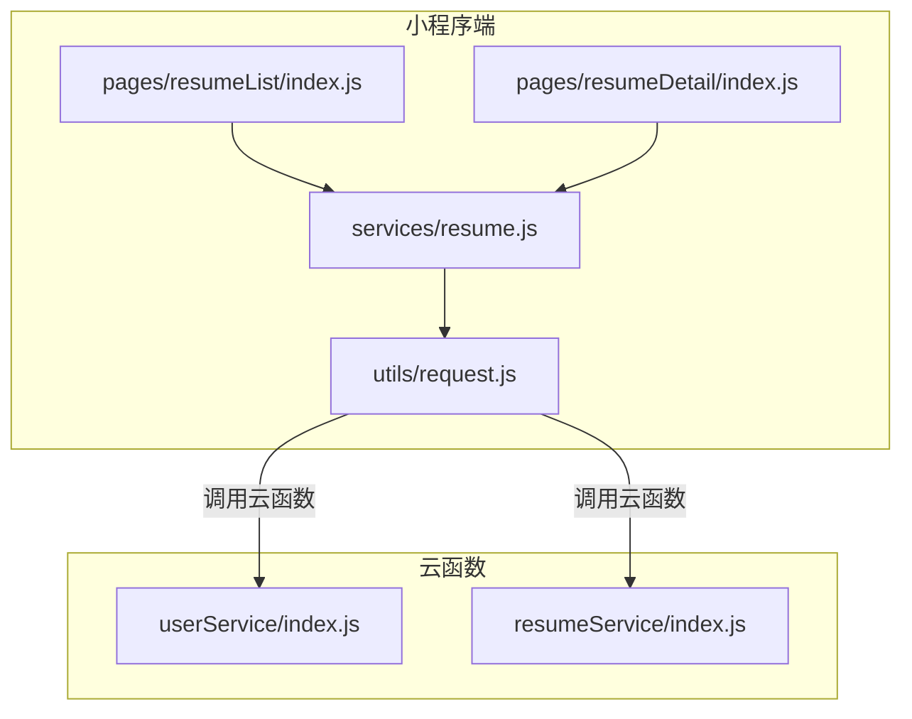
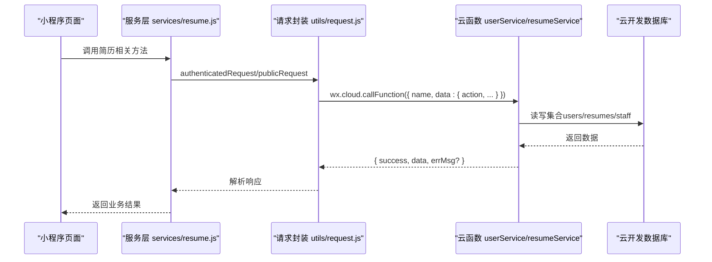
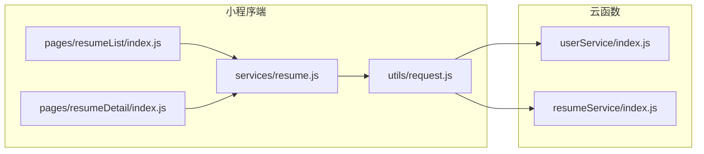

# API参考

<cite>
**本文引用的文件**
- [cloudfunctions/userService/index.js](file://cloudfunctions/userService/index.js)
- [cloudfunctions/userService/config.json](file://cloudfunctions/userService/config.json)
- [cloudfunctions/resumeService/index.js](file://cloudfunctions/resumeService/index.js)
- [cloudfunctions/resumeService/config.json](file://cloudfunctions/resumeService/config.json)
- [miniprogram/services/resume.js](file://miniprogram/services/resume.js)
- [miniprogram/utils/request.js](file://miniprogram/utils/request.js)
- [miniprogram/pages/resumeList/index.js](file://miniprogram/pages/resumeList/index.js)
- [miniprogram/pages/resumeDetail/index.js](file://miniprogram/pages/resumeDetail/index.js)
- [API完整文档.md](file://API完整文档.md)
</cite>

## 目录
1. [简介](#简介)
2. [项目结构](#项目结构)
3. [核心组件](#核心组件)
4. [架构总览](#架构总览)
5. [详细组件分析](#详细组件分析)
6. [依赖关系分析](#依赖关系分析)
7. [性能与可用性](#性能与可用性)
8. [故障排查指南](#故障排查指南)
9. [结论](#结论)
10. [附录](#附录)

## 简介
本文件为安得褓贝项目的API参考文档，聚焦于两个云函数服务：
- userService：提供用户身份与个人信息相关能力，包括获取/创建当前用户、更新用户资料、手机号一键登录、账号密码登录/注册等。
- resumeService：提供简历相关能力，包括公开简历列表、简历详情、管理端简历列表、简历增删改、以及权限校验（仅staff角色可用）。

同时，文档补充了小程序端服务层封装与调用方式，说明云函数调用、鉴权机制（基于微信上下文自动注入）、错误处理策略，并给出请求/响应示例与最佳实践。

## 项目结构
- 云函数位于 cloudfunctions 目录，分别提供 userService 与 resumeService 两个服务。
- 小程序端在 miniprogram/services 与 miniprogram/utils 下提供HTTP请求封装与业务服务层，用于调用后端API。
- 文档中还包含一份名为 API完整文档.md 的文件，但其内容与实际云函数代码不符，存在CRM系统、订单管理等不存在的接口，故本参考以实际云函数为准。

图表来源
- [miniprogram/pages/resumeList/index.js](file://miniprogram/pages/resumeList/index.js#L1-L698)
- [miniprogram/pages/resumeDetail/index.js](file://miniprogram/pages/resumeDetail/index.js#L1-L800)
- [miniprogram/services/resume.js](file://miniprogram/services/resume.js#L1-L239)
- [miniprogram/utils/request.js](file://miniprogram/utils/request.js#L1-L125)
- [cloudfunctions/userService/index.js](file://cloudfunctions/userService/index.js#L1-L289)
- [cloudfunctions/resumeService/index.js](file://cloudfunctions/resumeService/index.js#L1-L216)

章节来源
- [cloudfunctions/userService/index.js](file://cloudfunctions/userService/index.js#L1-L289)
- [cloudfunctions/resumeService/index.js](file://cloudfunctions/resumeService/index.js#L1-L216)
- [miniprogram/services/resume.js](file://miniprogram/services/resume.js#L1-L239)
- [miniprogram/utils/request.js](file://miniprogram/utils/request.js#L1-L125)

## 核心组件
- userService 云函数
  - 功能：获取/创建当前用户、更新用户资料、手机号一键登录、账号密码登录/注册。
  - 鉴权：通过微信上下文自动注入 OPENID，无需额外Token。
  - 权限：无显式权限校验，面向所有已登录用户。
- resumeService 云函数
  - 功能：公开简历列表、简历详情、管理端简历列表、简历增删改。
  - 鉴权：通过 isStaff 判断调用者是否为 staff 角色，非staff调用将被拒绝。
  - 权限：list/detail（公开）、listForManage/upsert/remove（仅staff）。

章节来源
- [cloudfunctions/userService/index.js](file://cloudfunctions/userService/index.js#L1-L289)
- [cloudfunctions/resumeService/index.js](file://cloudfunctions/resumeService/index.js#L1-L216)

## 架构总览
云函数与小程序端的交互流程如下：

图表来源
- [miniprogram/services/resume.js](file://miniprogram/services/resume.js#L1-L239)
- [miniprogram/utils/request.js](file://miniprogram/utils/request.js#L1-L125)
- [cloudfunctions/userService/index.js](file://cloudfunctions/userService/index.js#L1-L289)
- [cloudfunctions/resumeService/index.js](file://cloudfunctions/resumeService/index.js#L1-L216)

## 详细组件分析

### userService 云函数
- 云函数入口与鉴权
  - 通过 cloud.getWXContext() 获取 OPENID，作为用户标识。
  - 初始化阶段自动创建必要集合，避免新环境报错。
- 核心action
  - getOrCreateMe
    - 作用：获取或创建当前用户记录，自动根据手机号白名单判定角色（staff/customer）。
    - 请求参数：无
    - 响应数据：用户对象（含角色、创建/更新时间等）
    - 错误：无显式抛错，返回 { success:true, data:user }
  - updateMe
    - 作用：更新用户昵称、头像、手机号等字段。
    - 请求参数：data（包含 nickname、avatarUrl、phone 等）
    - 响应数据：更新后的用户对象
    - 错误：无显式抛错，返回 { success:true, data:user }
  - loginByPhone
    - 作用：通过微信手机号授权获取手机号并完善用户信息。
    - 请求参数：code（微信登录code）、nickname、avatarUrl（可选）
    - 响应数据：用户对象
    - 错误：微信接口失败或解析失败时抛出异常
  - accountRegister / accountLogin
    - 作用：账号密码注册/登录（演示用途，密码明文存储）
    - 请求参数：username、password、nickname（注册）、username、password（登录）
    - 响应数据：注册返回 { success:boolean, errMsg? }；登录返回 { success:boolean, data:user, errMsg? }
    - 错误：账号已存在、账号不存在、密码错误、注册/登录失败等

- 调用方式与鉴权
  - 小程序端通过 wx.cloud.callFunction 调用，传入 { name:"userService", data:{ action:"getOrCreateMe", ... } }。
  - 云函数内部自动获取 OPENID，无需前端携带Token。

- 错误处理策略
  - loginByPhone：捕获异常并向上抛出，便于前端感知。
  - accountRegister/accountLogin：返回 { success, errMsg? }，便于前端提示。

- 请求/响应示例
  - getOrCreateMe 成功响应示例（字段示意）
    - { "success": true, "data": { "_id":"...", "role":"customer|staff", "createdAt":"...", "updatedAt":"..." } }
  - updateMe 成功响应示例（字段示意）
    - { "success": true, "data": { "nickname":"张三", "avatarUrl":"...", "phone":"13800000000", "role":"..." } }
  - loginByPhone 成功响应示例（字段示意）
    - { "success": true, "data": { "phone":"13800000000", "nickname":"...", "role":"..." } }
  - accountRegister/accountLogin
    - 注册：{ "success": false, "errMsg": "账号已存在" }
    - 登录：{ "success": true, "data": { "id":"...", "role":"..." } }

章节来源
- [cloudfunctions/userService/index.js](file://cloudfunctions/userService/index.js#L1-L289)
- [cloudfunctions/userService/config.json](file://cloudfunctions/userService/config.json#L1-L6)

### resumeService 云函数
- 云函数入口与鉴权
  - 通过 cloud.getWXContext() 获取 OPENID，用于 staff 角色判定。
  - 初始化阶段自动创建必要集合。
- 核心action
  - list
    - 作用：返回公开简历列表（status=published）
    - 请求参数：page、pageSize、keyword（模糊匹配 name/city）
    - 响应数据：简历列表（仅公开字段）
    - 权限：公开接口，无需staff
    - 业务逻辑：分页查询，按 updatedAt 降序，支持关键词简单匹配
  - detail
    - 作用：返回简历详情（公开字段）
    - 请求参数：id、forManage（可选）
    - 权限：公开接口；若 forManage=true，则要求staff角色
    - 错误：缺少 id 抛错；非staff调用 forManage=true 抛错
  - listForManage
    - 作用：返回管理端简历列表（最近更新）
    - 请求参数：无
    - 权限：仅staff
    - 错误：非staff调用抛错
  - upsert
    - 作用：新增或更新简历（仅staff）
    - 请求参数：data（包含 name、age、city、experienceYears、priceMonth、tags、intro、coverFileId、photos、videoFileId、status 等）
    - 权限：仅staff
    - 错误：非staff调用抛错；新建时写入 createdAt/createdBy
  - remove
    - 作用：删除简历（仅staff）
    - 请求参数：id
    - 权限：仅staff
    - 错误：非staff调用抛错；缺少 id 抛错

- 调用方式与鉴权
  - 小程序端通过 wx.cloud.callFunction 调用，传入 { name:"resumeService", data:{ action:"list", ... } }。
  - 云函数内部自动获取 OPENID，通过 isStaff 判断权限。

- 错误处理策略
  - 对于缺少参数、权限不足等情况，直接抛出异常；云函数外层捕获并返回 { success:false, errMsg }。

- 请求/响应示例
  - list 成功响应示例（字段示意）
    - { "success": true, "data": [ { "_id":"...", "name":"张三", "age":30, "city":"北京", "experienceYears":5, "priceMonth":12000, "tags":["..."], "intro":"...", "coverFileId":"...", "photos":["..."], "videoFileId":"...", "status":"published", "updatedAt":"...", "createdAt":"..." } ] }
  - detail 成功响应示例（字段示意）
    - { "success": true, "data": { "_id":"...", "name":"张三", "age":30, "city":"北京", "status":"published", "photos":["..."], "videoFileId":"...", "updatedAt":"...", "createdAt":"..." } }
  - listForManage 成功响应示例（字段示意）
    - { "success": true, "data": [ { "_id":"...", "name":"张三", "status":"published", "updatedAt":"..." } ] }
  - upsert 成功响应示例（字段示意）
    - { "success": true, "data": { "_id":"..." } }
  - remove 成功响应示例（字段示意）
    - { "success": true }

章节来源
- [cloudfunctions/resumeService/index.js](file://cloudfunctions/resumeService/index.js#L1-L216)
- [cloudfunctions/resumeService/config.json](file://cloudfunctions/resumeService/config.json#L1-L6)

### 小程序服务层封装（miniprogram/services/resume.js）
- 封装目标
  - 将云函数调用抽象为易用的服务方法，统一请求头、鉴权、错误处理。
- 关键方法
  - getResumeList / getResumeListMiniprogram：简历列表（公开/小程序专用）
  - getResumeDetail / getResumeDetailMiniprogram：简历详情（公开）
  - createResume / updateResume / deleteResume：简历CRUD（小程序专用）
  - createShare / uploadFile：分享链接生成、文件上传（小程序专用）
- 调用方式
  - 通过 utils/request.js 的 publicRequest/authenticatedRequest 发起HTTP请求。
  - 未登录时走 publicRequest，登录后走 authenticatedRequest（自动附加 Authorization: Bearer token）。
- 重要说明
  - 该服务层封装的是 CRM 后台接口（BASE_URL=https://crm.andejiazheng.com/api），并非本仓库中的云函数。
  - 与本仓库云函数（userService/resumeService）的调用方式不同，后者通过 wx.cloud.callFunction 调用云函数。

章节来源
- [miniprogram/services/resume.js](file://miniprogram/services/resume.js#L1-L239)
- [miniprogram/utils/request.js](file://miniprogram/utils/request.js#L1-L125)

## 依赖关系分析

图表来源
- [cloudfunctions/userService/index.js](file://cloudfunctions/userService/index.js#L1-L289)
- [cloudfunctions/resumeService/index.js](file://cloudfunctions/resumeService/index.js#L1-L216)
- [miniprogram/pages/resumeList/index.js](file://miniprogram/pages/resumeList/index.js#L1-L698)
- [miniprogram/pages/resumeDetail/index.js](file://miniprogram/pages/resumeDetail/index.js#L1-L800)
- [miniprogram/services/resume.js](file://miniprogram/services/resume.js#L1-L239)
- [miniprogram/utils/request.js](file://miniprogram/utils/request.js#L1-L125)

章节来源
- [cloudfunctions/userService/index.js](file://cloudfunctions/userService/index.js#L1-L289)
- [cloudfunctions/resumeService/index.js](file://cloudfunctions/resumeService/index.js#L1-L216)
- [miniprogram/services/resume.js](file://miniprogram/services/resume.js#L1-L239)
- [miniprogram/utils/request.js](file://miniprogram/utils/request.js#L1-L125)

## 性能与可用性
- 分页与查询
  - list 接口支持 page/pageSize，建议前端按需分页，避免一次性拉取过多数据。
  - 关键词匹配采用正则模糊匹配，建议前端限制输入长度与频率，避免高并发导致查询压力。
- 权限控制
  - listForManage/upsert/remove 仅允许 staff 角色调用，非staff调用将被拒绝，避免越权访问。
- 错误处理
  - 云函数对外统一返回 { success, data?, errMsg? }，便于前端稳定处理。
  - 小程序端请求封装对401做了专门处理（清除本地token并跳转登录），提升用户体验。

[本节为通用指导，不涉及具体文件分析]

## 故障排查指南
- 云函数调用失败
  - 确认云函数已上传部署且名称正确（如 "userService"、"resumeService"）。
  - 检查小程序端 wx.cloud.callFunction 的 name 与 data.action 是否匹配。
- 权限错误
  - listForManage/upsert/remove 需要 staff 角色，确认用户角色判定逻辑（手机号白名单优先）。
- 参数缺失
  - detail 缺少 id 将抛错；remove 缺少 id 将抛错；loginByPhone 缺少 code 将抛错。
- 响应格式
  - 云函数返回 { success, data?, errMsg? }；若 success=false，优先读取 errMsg 字段定位问题。

章节来源
- [cloudfunctions/resumeService/index.js](file://cloudfunctions/resumeService/index.js#L1-L216)
- [cloudfunctions/userService/index.js](file://cloudfunctions/userService/index.js#L1-L289)

## 结论
- 本仓库实际提供的云函数API为 userService 与 resumeService，二者均通过微信上下文自动注入的 OPENID 进行鉴权与角色判定。
- resumeService 的 list 接口仅返回 published 状态简历，listForManage 接口仅限 staff 角色调用，体现了清晰的权限边界。
- 小程序端服务层封装了 CRM 后台接口，与云函数调用方式不同，二者可并行使用以满足不同场景需求。

[本节为总结性内容，不涉及具体文件分析]

## 附录

### 云函数调用方式与鉴权机制
- 调用方式
  - 小程序端通过 wx.cloud.callFunction({ name, data:{ action, ... } }) 调用云函数。
  - 云函数入口 exports.main(event, context) 中通过 cloud.getWXContext() 获取 OPENID。
- 鉴权机制
  - 无需前端携带Token；云函数侧基于 OPENID 与 staff 白名单进行权限判定。
- 错误处理
  - 云函数内部抛出异常会被外层捕获并返回 { success:false, errMsg }；部分方法（如 loginByPhone）会直接抛出异常供前端感知。

章节来源
- [cloudfunctions/userService/index.js](file://cloudfunctions/userService/index.js#L1-L289)
- [cloudfunctions/resumeService/index.js](file://cloudfunctions/resumeService/index.js#L1-L216)

### API对照与差异说明
- 与 API完整文档.md 的差异
  - API完整文档.md 描述了 CRM 后台接口（如 /api/resumes、/api/auth 等），与本仓库云函数 userService/resumeService 不一致。
  - 本参考严格依据实际云函数代码生成，不包含CRM系统、订单管理等不存在的接口。

章节来源
- [API完整文档.md](file://API完整文档.md#L1-L800)