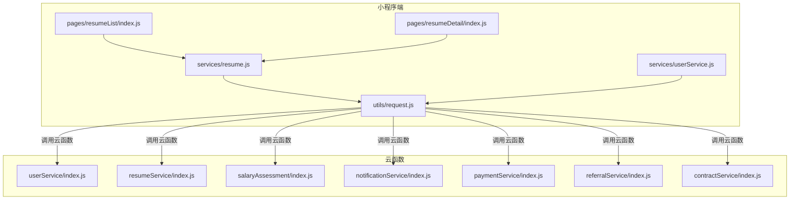
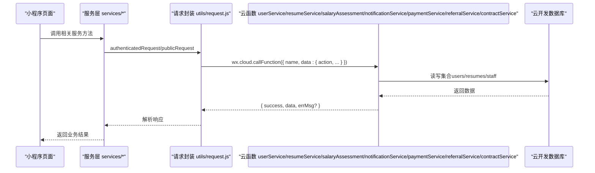
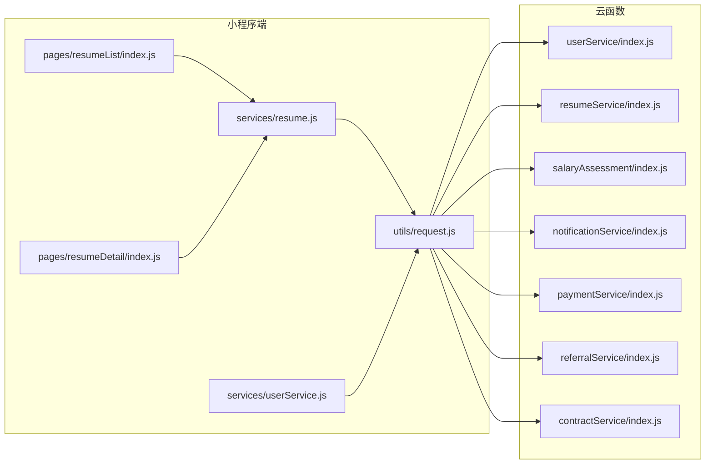

# API参考

<cite>
**本文引用的文件**
- [cloudfunctions/userService/index.js](file://cloudfunctions/userService/index.js)
- [cloudfunctions/userService/config.json](file://cloudfunctions/userService/config.json)
- [cloudfunctions/resumeService/index.js](file://cloudfunctions/resumeService/index.js)
- [cloudfunctions/resumeService/config.json](file://cloudfunctions/resumeService/config.json)
- [cloudfunctions/salaryAssessment/index.js](file://cloudfunctions/salaryAssessment/index.js)
- [cloudfunctions/salaryAssessment/config.json](file://cloudfunctions/salaryAssessment/config.json)
- [cloudfunctions/notificationService/index.js](file://cloudfunctions/notificationService/index.js)
- [cloudfunctions/notificationService/config.json](file://cloudfunctions/notificationService/config.json)
- [cloudfunctions/paymentService/index.js](file://cloudfunctions/paymentService/index.js)
- [cloudfunctions/paymentService/config.json](file://cloudfunctions/paymentService/config.json)
- [cloudfunctions/referralService/index.js](file://cloudfunctions/referralService/index.js)
- [cloudfunctions/referralService/config.json](file://cloudfunctions/referralService/config.json)
- [cloudfunctions/contractService/index.js](file://cloudfunctions/contractService/index.js)
- [cloudfunctions/contractService/config.json](file://cloudfunctions/contractService/config.json)
- [miniprogram/services/resume.js](file://miniprogram/services/resume.js)
- [miniprogram/services/userService.js](file://miniprogram/services/userService.js)
- [miniprogram/utils/request.js](file://miniprogram/utils/request.js)
- [miniprogram/pages/resumeList/index.js](file://miniprogram/pages/resumeList/index.js)
- [miniprogram/pages/resumeDetail/index.js](file://miniprogram/pages/resumeDetail/index.js)
- [API完整文档.md](file://API完整文档.md)
</cite>

## 目录
1. [简介](#简介)
2. [项目结构](#项目结构)
3. [核心组件](#核心组件)
4. [架构总览](#架构总览)
5. [详细组件分析](#详细组件分析)
6. [依赖关系分析](#依赖关系分析)
7. [性能与可用性](#性能与可用性)
8. [故障排查指南](#故障排查指南)
9. [结论](#结论)
10. [附录](#附录)

## 简介
本文件为安得褓贝项目的API参考文档，聚焦于多个云函数服务：
- userService：提供用户身份与个人信息相关能力，包括获取/创建当前用户、更新用户资料、手机号一键登录、账号密码登录/注册等。
- resumeService：提供简历相关能力，包括公开简历列表、简历详情、管理端简历列表、简历增删改、以及权限校验（仅staff角色可用）。
- salaryAssessment：提供薪资评估能力，包括智能抽题、测评计算、AI评估报告生成、结果查询等。
- notificationService：提供通知服务，包括简历查看通知、测试通知、通知列表查询、标记已读等。
- paymentService：提供支付服务，包括收钱吧终端激活、预下单、支付查询、退款、合同支付等。
- referralService：提供推荐服务，包括推荐人注册、推荐状态查询、重复检测、推荐提交、我的推荐列表等。
- contractService：提供合同服务，包括我的合同查询、合同详情、入职确认、签署链接获取等。

同时，文档补充了小程序端服务层封装与调用方式，说明云函数调用、鉴权机制（基于微信上下文自动注入）、错误处理策略，并给出请求/响应示例与最佳实践。

## 项目结构
- 云函数位于 cloudfunctions 目录，分别提供 userService、resumeService、salaryAssessment、notificationService、paymentService、referralService、contractService 等服务。
- 小程序端在 miniprogram/services 与 miniprogram/utils 下提供HTTP请求封装与业务服务层，用于调用后端API。
- 文档中还包含一份名为 API完整文档.md 的文件，但其内容与实际云函数代码不符，存在CRM系统、订单管理等不存在的接口，故本参考以实际云函数为准。

图表来源
- [miniprogram/pages/resumeList/index.js:1-698](file://miniprogram/pages/resumeList/index.js#L1-L698)
- [miniprogram/pages/resumeDetail/index.js:1-800](file://miniprogram/pages/resumeDetail/index.js#L1-L800)
- [miniprogram/services/resume.js:1-239](file://miniprogram/services/resume.js#L1-L239)
- [miniprogram/services/userService.js:1-45](file://miniprogram/services/userService.js#L1-L45)
- [miniprogram/utils/request.js:1-125](file://miniprogram/utils/request.js#L1-L125)
- [cloudfunctions/userService/index.js:1-289](file://cloudfunctions/userService/index.js#L1-L289)
- [cloudfunctions/resumeService/index.js:1-216](file://cloudfunctions/resumeService/index.js#L1-L216)
- [cloudfunctions/salaryAssessment/index.js:1-928](file://cloudfunctions/salaryAssessment/index.js#L1-L928)
- [cloudfunctions/notificationService/index.js:1-248](file://cloudfunctions/notificationService/index.js#L1-L248)
- [cloudfunctions/paymentService/index.js:1-662](file://cloudfunctions/paymentService/index.js#L1-L662)
- [cloudfunctions/referralService/index.js:1-374](file://cloudfunctions/referralService/index.js#L1-L374)
- [cloudfunctions/contractService/index.js:1-112](file://cloudfunctions/contractService/index.js#L1-L112)

章节来源
- [cloudfunctions/userService/index.js:1-289](file://cloudfunctions/userService/index.js#L1-L289)
- [cloudfunctions/resumeService/index.js:1-216](file://cloudfunctions/resumeService/index.js#L1-L216)
- [cloudfunctions/salaryAssessment/index.js:1-928](file://cloudfunctions/salaryAssessment/index.js#L1-L928)
- [cloudfunctions/notificationService/index.js:1-248](file://cloudfunctions/notificationService/index.js#L1-L248)
- [cloudfunctions/paymentService/index.js:1-662](file://cloudfunctions/paymentService/index.js#L1-L662)
- [cloudfunctions/referralService/index.js:1-374](file://cloudfunctions/referralService/index.js#L1-L374)
- [cloudfunctions/contractService/index.js:1-112](file://cloudfunctions/contractService/index.js#L1-L112)
- [miniprogram/services/resume.js:1-239](file://miniprogram/services/resume.js#L1-L239)
- [miniprogram/services/userService.js:1-45](file://miniprogram/services/userService.js#L1-L45)
- [miniprogram/utils/request.js:1-125](file://miniprogram/utils/request.js#L1-L125)

## 核心组件
- userService 云函数
  - 功能：获取/创建当前用户、更新用户资料、手机号一键登录、账号密码登录/注册。
  - 鉴权：通过微信上下文自动注入 OPENID，无需额外Token。
  - 权限：无显式权限校验，面向所有已登录用户。
- resumeService 云函数
  - 功能：公开简历列表、简历详情、管理端简历列表、简历增删改。
  - 鉴权：通过 isStaff 判断调用者是否为 staff 角色，非staff调用将被拒绝。
  - 权限：list/detail（公开）、listForManage/upsert/remove（仅staff）。
- salaryAssessment 云函数
  - 功能：智能抽题、测评计算、AI评估报告生成、结果查询。
  - 鉴权：通过微信上下文自动注入 OPENID，进行权限校验。
  - 权限：测评相关接口面向所有用户，AI评估需要完成测评后触发。
- notificationService 云函数
  - 功能：发送简历查看通知、测试通知、查询通知列表、标记已读。
  - 鉧权：通过微信上下文自动注入 OPENID，进行权限校验。
  - 权限：通知发送需要相应权限，查询接口需要手机号参数。
- paymentService 云函数
  - 功能：收钱吧终端激活、预下单、支付查询、退款、合同支付。
  - 鉧权：通过微信上下文自动注入 OPENID，进行权限校验。
  - 权限：支付相关接口需要用户授权，合同支付需要合同ID和手机号。
- referralService 云函数
  - 功能：推荐人注册、推荐状态查询、重复检测、推荐提交、我的推荐列表等。
  - 鉧权：通过微信上下文自动注入 OPENID，进行权限校验。
  - 权限：推荐相关接口面向推荐人，员工审核接口需要员工权限。
- contractService 云函数
  - 功能：我的合同查询、合同详情、入职确认、签署链接获取。
  - 鉧权：通过微信上下文自动注入 OPENID，进行权限校验。
  - 权限：合同相关接口需要手机号参数进行越权保护。

章节来源
- [cloudfunctions/userService/index.js:1-289](file://cloudfunctions/userService/index.js#L1-L289)
- [cloudfunctions/resumeService/index.js:1-216](file://cloudfunctions/resumeService/index.js#L1-L216)
- [cloudfunctions/salaryAssessment/index.js:1-928](file://cloudfunctions/salaryAssessment/index.js#L1-L928)
- [cloudfunctions/notificationService/index.js:1-248](file://cloudfunctions/notificationService/index.js#L1-L248)
- [cloudfunctions/paymentService/index.js:1-662](file://cloudfunctions/paymentService/index.js#L1-L662)
- [cloudfunctions/referralService/index.js:1-374](file://cloudfunctions/referralService/index.js#L1-L374)
- [cloudfunctions/contractService/index.js:1-112](file://cloudfunctions/contractService/index.js#L1-L112)

## 架构总览
云函数与小程序端的交互流程如下：

图表来源
- [miniprogram/services/resume.js:1-239](file://miniprogram/services/resume.js#L1-L239)
- [miniprogram/services/userService.js:1-45](file://miniprogram/services/userService.js#L1-L45)
- [miniprogram/utils/request.js:1-125](file://miniprogram/utils/request.js#L1-L125)
- [cloudfunctions/userService/index.js:1-289](file://cloudfunctions/userService/index.js#L1-L289)
- [cloudfunctions/resumeService/index.js:1-216](file://cloudfunctions/resumeService/index.js#L1-L216)
- [cloudfunctions/salaryAssessment/index.js:1-928](file://cloudfunctions/salaryAssessment/index.js#L1-L928)
- [cloudfunctions/notificationService/index.js:1-248](file://cloudfunctions/notificationService/index.js#L1-L248)
- [cloudfunctions/paymentService/index.js:1-662](file://cloudfunctions/paymentService/index.js#L1-L662)
- [cloudfunctions/referralService/index.js:1-374](file://cloudfunctions/referralService/index.js#L1-L374)
- [cloudfunctions/contractService/index.js:1-112](file://cloudfunctions/contractService/index.js#L1-L112)

## 详细组件分析

### userService 云函数
- 云函数入口与鉴权
  - 通过 cloud.getWXContext() 获取 OPENID，作为用户标识。
  - 初始化阶段自动创建必要集合，避免新环境报错。
- 核心action
  - getOrCreateMe
    - 作用：获取或创建当前用户记录，自动根据手机号白名单判定角色（staff/customer）。
    - 请求参数：无
    - 响应数据：用户对象（含角色、创建/更新时间等）
    - 错误：无显式抛错，返回 { success:true, data:user }
  - updateMe
    - 作用：更新用户昵称、头像、手机号等字段。
    - 请求参数：data（包含 nickname、avatarUrl、phone 等）
    - 响应数据：更新后的用户对象
    - 错误：无显式抛错，返回 { success:true, data:user }
  - loginByPhone
    - 作用：通过微信手机号授权获取手机号并完善用户信息。
    - 请求参数：code（微信登录code）、nickname、avatarUrl（可选）
    - 响应数据：用户对象
    - 错误：微信接口失败或解析失败时抛出异常
  - accountRegister / accountLogin
    - 作用：账号密码注册/登录（演示用途，密码明文存储）
    - 请求参数：username、password、nickname（注册）、username、password（登录）
    - 响应数据：注册返回 { success:boolean, errMsg? }；登录返回 { success:boolean, data:user, errMsg? }
    - 错误：账号已存在、账号不存在、密码错误、注册/登录失败等

- 调用方式与鉴权
  - 小程序端通过 wx.cloud.callFunction 调用，传入 { name:"userService", data:{ action:"getOrCreateMe", ... } }。
  - 云函数内部自动获取 OPENID，无需前端携带Token。

- 错误处理策略
  - loginByPhone：捕获异常并向上抛出，便于前端感知。
  - accountRegister/accountLogin：返回 { success, errMsg? }，便于前端提示。

- 请求/响应示例
  - getOrCreateMe 成功响应示例（字段示意）
    - { "success": true, "data": { "_id":"...", "role":"customer|staff", "createdAt":"...", "updatedAt":"..." } }
  - updateMe 成功响应示例（字段示意）
    - { "success": true, "data": { "nickname":"张三", "avatarUrl":"...", "phone":"13800000000", "role":"..." } }
  - loginByPhone 成功响应示例（字段示意）
    - { "success": true, "data": { "phone":"13800000000", "nickname":"...", "role":"..." } }
  - accountRegister/accountLogin
    - 注册：{ "success": false, "errMsg": "账号已存在" }
    - 登录：{ "success": true, "data": { "id":"...", "role":"..." } }

章节来源
- [cloudfunctions/userService/index.js:1-289](file://cloudfunctions/userService/index.js#L1-L289)
- [cloudfunctions/userService/config.json:1-6](file://cloudfunctions/userService/config.json#L1-L6)

### resumeService 云函数
- 云函数入口与鉴权
  - 通过 cloud.getWXContext() 获取 OPENID，用于 staff 角色判定。
  - 初始化阶段自动创建必要集合。
- 核心action
  - list
    - 作用：返回公开简历列表（status=published）
    - 请求参数：page、pageSize、keyword（模糊匹配 name/city）
    - 响应数据：简历列表（仅公开字段）
    - 权限：公开接口，无需staff
    - 业务逻辑：分页查询，按 updatedAt 降序，支持关键词简单匹配
  - detail
    - 作用：返回简历详情（公开字段）
    - 请求参数：id、forManage（可选）
    - 权限：公开接口；若 forManage=true，则要求staff角色
    - 错误：缺少 id 抛错；非staff调用 forManage=true 抛错
  - listForManage
    - 作用：返回管理端简历列表（最近更新）
    - 请求参数：无
    - 权限：仅staff
    - 错误：非staff调用抛错
  - upsert
    - 作用：新增或更新简历（仅staff）
    - 请求参数：data（包含 name、age、city、experienceYears、priceMonth、tags、intro、coverFileId、photos、videoFileId、status 等）
    - 权限：仅staff
    - 错误：非staff调用抛错；新建时写入 createdAt/createdBy
  - remove
    - 作用：删除简历（仅staff）
    - 请求参数：id
    - 权限：仅staff
    - 错误：非staff调用抛错；缺少 id 抛错

- 调用方式与鉴权
  - 小程序端通过 wx.cloud.callFunction 调用，传入 { name:"resumeService", data:{ action:"list", ... } }。
  - 云函数内部自动获取 OPENID，通过 isStaff 判断权限。

- 错误处理策略
  - 对于缺少参数、权限不足等情况，直接抛出异常；云函数外层捕获并返回 { success:false, errMsg }。

- 请求/响应示例
  - list 成功响应示例（字段示意）
    - { "success": true, "data": [ { "_id":"...", "name":"张三", "age":30, "city":"北京", "experienceYears":5, "priceMonth":12000, "tags":["..."], "intro":"...", "coverFileId":"...", "photos":["..."], "videoFileId":"...", "status":"published", "updatedAt":"...", "createdAt":"..." } ] }
  - detail 成功响应示例（字段示意）
    - { "success": true, "data": { "_id":"...", "name":"张三", "age":30, "city":"北京", "status":"published", "photos":["..."], "videoFileId":"...", "updatedAt":"...", "createdAt":"..." } }
  - listForManage 成功响应示例（字段示意）
    - { "success": true, "data": [ { "_id":"...", "name":"张三", "status":"published", "updatedAt":"..." } ] }
  - upsert 成功响应示例（字段示意）
    - { "success": true, "data": { "_id":"..." } }
  - remove 成功响应示例（字段示意）
    - { "success": true }

章节来源
- [cloudfunctions/resumeService/index.js:1-216](file://cloudfunctions/resumeService/index.js#L1-L216)
- [cloudfunctions/resumeService/config.json:1-6](file://cloudfunctions/resumeService/config.json#L1-L6)

### salaryAssessment 云函数
- 云函数入口与鉴权
  - 通过 cloud.getWXContext() 获取 OPENID，作为用户标识。
  - 初始化阶段自动创建必要集合（salary_assessment_questions、salary_assessments、salary_question_bank）。
- 核心action
  - getQuestions
    - 作用：智能抽取30道题目（硬件4题、技能18题、心理8题）。
    - 请求参数：jobType（工种）、assessmentId（可选，用于复用已有的测评记录）。
    - 响应数据：questions数组，包含题目ID、类型、章节、问题、选项等。
    - 权限：公开接口，面向所有用户。
    - 业务逻辑：根据工作经验年数动态调整技能题难度分布，按子类进行轮询分配。
  - start
    - 作用：开始测评，登记简历线索。
    - 请求参数：basicInfo（包含name、phone、jobType、age、experienceYears、education、city等）。
    - 响应数据：assessmentId和dateKey。
    - 权限：公开接口，面向所有用户。
    - 业务逻辑：同openid、同手机号、同工种当日未完成记录复用，避免重复创建。
  - evaluate
    - 作用：仅计算分数并写入兜底结果，立即返回。
    - 请求参数：assessmentId、jobType、answers（用户答案数组）。
    - 响应数据：assessmentId、sectionScores、result（兜底结果）、aiStatus。
    - 权限：仅测评所属用户可调用。
    - 业务逻辑：计算各模块得分和百分制总分，生成兜底AI结果。
  - runAIEvaluation
    - 作用：真正的AI评估，由结果页独立触发。
    - 请求参数：assessmentId。
    - 响应数据：assessmentId、sectionScores、result（AI评估结果）、aiStatus。
    - 权限：仅测评所属用户可调用。
    - 业务逻辑：构建评估提示词，调用豆包AI，提取JSON结构，生成最终评估报告。
  - getResult
    - 作用：拉取测评结果（容忍scoring中状态）。
    - 请求参数：assessmentId。
    - 响应数据：assessmentId、jobType、sectionScores、result、aiStatus、reviewItems。
    - 权限：仅测评所属用户可调用。
    - 业务逻辑：返回完整的测评结果，包括答题回顾数据。
  - getBankStats
    - 作用：查看每个(工种,section)题库当前数量。
    - 请求参数：无。
    - 响应数据：stats（各工种各章节题库数量）、target（目标数量）。
    - 权限：公开接口。
    - 业务逻辑：统计硬件、技能、心理三个章节的题库数量。

- 调用方式与鉴权
  - 小程序端通过 wx.cloud.callFunction 调用，传入 { name:"salaryAssessment", data:{ action:"getQuestions", ... } }。
  - 云函数内部自动获取 OPENID，进行权限校验。

- 错误处理策略
  - 对于缺少参数、权限不足、无效工种等情况，直接抛出异常；云函数外层捕获并返回 { success:false, errMsg }。
  - AI评估失败时，返回兜底结果并标记aiStatus为failed。

- 请求/响应示例
  - getQuestions 成功响应示例（字段示意）
    - { "success": true, "data": { "questions": [ { "id":"q1", "type":"choice|judge", "section":"hardware|skill|personality", "question":"题目内容", "options":[ { "label":"A", "text":"选项内容", "score":0|10 } ] } ] } }
  - start 成功响应示例（字段示意）
    - { "success": true, "data": { "assessmentId":"xxx", "dateKey":"2024-01-01" } }
  - evaluate 成功响应示例（字段示意）
    - { "success": true, "data": { "assessmentId":"xxx", "sectionScores":{ "hardware":20, "skill":108, "personality":120, "percent":70 }, "result":{ "totalScore":70, "level":"中级", "salaryRange":{ "min":8000, "max":9000, "unit":"元/月" } }, "aiStatus":"scoring" } }
  - runAIEvaluation 成功响应示例（字段示意）
    - { "success": true, "data": { "assessmentId":"xxx", "result":{ "totalScore":75, "level":"高级", "strengths":["优势1","优势2","优势3"], "improvements":["待提升1","待提升2","待提升3"], "salaryRange":{ "min":9000, "max":10000, "unit":"元/月" }, "advice":"建议..." }, "aiStatus":"completed" } }
  - getResult 成功响应示例（字段示意）
    - { "success": true, "data": { "assessmentId":"xxx", "jobType":"yuexin", "sectionScores":{ "percent":75 }, "result":{ "totalScore":75, "level":"高级" }, "aiStatus":"completed", "reviewItems":[ { "id":"q1", "section":"skill", "question":"题目内容", "options":[ { "label":"A", "text":"选项内容", "isCorrect":true, "isSelected":false } ] } ] } }

章节来源
- [cloudfunctions/salaryAssessment/index.js:1-928](file://cloudfunctions/salaryAssessment/index.js#L1-L928)
- [cloudfunctions/salaryAssessment/config.json:1-7](file://cloudfunctions/salaryAssessment/config.json#L1-L7)

### notificationService 云函数
- 云函数入口与鉴权
  - 通过 cloud.getWXContext() 获取 OPENID，用于权限校验。
  - 配置了订阅消息发送权限（subscribeMessage.send）。
- 核心action
  - sendResumeViewNotify
    - 作用：发送"简历被查看"订阅通知给员工。
    - 请求参数：sharerPhone（分享者手机号）、customerName（预约人）、nurseName（服务人员）、resumeId（简历ID）。
    - 响应数据：{ success:true } 或 { success:false, errMsg, errCode }。
    - 权限：需要相应权限，通过手机号查找员工openid。
    - 业务逻辑：从users或staff_profiles集合查找openid，构造订阅消息模板数据并发送。
  - sendTestNotify
    - 作用：直接向指定手机号发送测试通知。
    - 请求参数：phone（测试手机号）。
    - 响应数据：{ success:true, openid, msg } 或详细错误信息。
    - 权限：诊断用，返回中间步骤信息。
    - 业务逻辑：查找openid并发送测试消息，返回详细中间结果。
  - getList
    - 作用：查询通知列表。
    - 请求参数：phone（手机号）、page（页码，默认1）、pageSize（每页数量，默认20）。
    - 响应数据：{ success:true, data }。
    - 权限：需要手机号参数进行越权保护。
    - 业务逻辑：向CRM后端代理查询通知列表。
  - markRead
    - 作用：标记单条通知为已读。
    - 请求参数：phone（手机号）、id（通知ID）。
    - 响应数据：{ success:true }。
    - 权限：需要手机号和通知ID参数。
    - 业务逻辑：向CRM后端代理标记已读。
  - markAllRead
    - 作用：标记所有通知为已读。
    - 请求参数：phone（手机号）。
    - 响应数据：{ success:true }。
    - 权限：需要手机号参数。
    - 业务逻辑：向CRM后端代理标记全部已读。
  - debugUsers
    - 作用：诊断users集合数据。
    - 请求参数：phone（可选，精确查询手机号）。
    - 响应数据：{ success:true, env, totalInPage, records, phoneMatch, phoneMatchDetail }。
    - 权限：诊断用。
    - 业务逻辑：返回users集合前20条记录摘要和匹配详情。

- 调用方式与鉴权
  - 小程序端通过 wx.cloud.callFunction 调用，传入 { name:"notificationService", data:{ action:"sendResumeViewNotify", ... } }。
  - 云函数内部自动获取 OPENID，进行权限校验。

- 错误处理策略
  - 对于缺少参数、openid未找到、订阅消息发送失败等情况，返回 { success:false, errMsg, errCode? }。
  - CRM后端请求失败时，返回详细的错误信息。

- 请求/响应示例
  - sendResumeViewNotify 成功响应示例（字段示意）
    - { "success": true }
  - sendResumeViewNotify 失败响应示例（字段示意）
    - { "success": false, "errMsg": "未找到员工微信账号", "errCode": 404 }
  - sendTestNotify 成功响应示例（字段示意）
    - { "success": true, "openid": "oqJx55...", "msg": "✅ 测试通知发送成功，请检查微信消息" }
  - getList 成功响应示例（字段示意）
    - { "success": true, "data": [ { "_id":"xxx", "title":"通知标题", "content":"通知内容", "read":false, "createdAt":"2024-01-01T00:00:00Z" } ] }

章节来源
- [cloudfunctions/notificationService/index.js:1-248](file://cloudfunctions/notificationService/index.js#L1-L248)
- [cloudfunctions/notificationService/config.json:1-8](file://cloudfunctions/notificationService/config.json#L1-L8)

### paymentService 云函数
- 云函数入口与鉴权
  - 通过 cloud.getWXContext() 获取 OPENID，作为用户标识。
  - 配置了收钱吧支付常量和CRM通知配置。
- 核心action
  - activate
    - 作用：激活收钱吧终端（仅需执行一次）。
    - 请求参数：code（激活码，默认使用内置激活码）。
    - 响应数据：{ terminal_sn }。
    - 权限：公开接口。
    - 业务逻辑：调用收钱吧API进行终端激活，保存终端凭证到数据库。
  - checkin
    - 作用：手动签到。
    - 请求参数：无。
    - 响应数据：{ success:true }。
    - 权限：需要已激活的终端。
    - 业务逻辑：调用收钱吧API进行签到，更新终端密钥。
  - precreate
    - 作用：预下单（小程序支付）。
    - 请求参数：contractId（合同ID）、phone（手机号）、openid（用户openid）。
    - 响应数据：{ paymentId, clientSn, sqbSn, wapPayRequest }。
    - 权限：需要用户授权，合同ID和手机号参数。
    - 业务逻辑：防重复支付检查，从CRM获取合同金额，调用收钱吧预下单。
  - precreateTraining
    - 作用：职培订单预下单（小程序支付）。
    - 请求参数：contractId（合同ID）、phone（手机号）、amount（金额，分）。
    - 响应数据：{ paymentId, clientSn, sqbSn, wapPayRequest }。
    - 权限：需要用户授权，合同ID、手机号、金额参数。
    - 业务逻辑：与家政预下单类似，但金额由客户端传入并通过CRM二次校验。
  - queryPayment
    - 作用：查询支付结果（轮询用）。
    - 请求参数：paymentId（支付ID）或 contractId（合同ID）。
    - 响应数据：{ paymentStatus, paidAt? }。
    - 权限：公开接口。
    - 业务逻辑：查询收钱吧订单状态，更新本地支付记录，异步通知CRM。
  - getPaymentByContract
    - 作用：根据合同ID查支付记录（详情页用）。
    - 请求参数：contractId（合同ID）、orderCategory（可选，'training'|'housekeeping'）。
    - 响应数据：{ paymentStatus, paidAt?, amount? }。
    - 权限：公开接口。
    - 业务逻辑：查询最近一次支付记录，自动去查状态。
  - refund
    - 作用：退款。
    - 请求参数：contractId（合同ID）、phone（手机号）、refundAmount（可选，退款金额）。
    - 响应数据：{ success:true, orderStatus? } 或 { success:false, raw? }。
    - 权限：需要已支付记录。
    - 业务逻辑：调用收钱吧API进行退款，更新本地支付状态。

- 调用方式与鉴权
  - 小程序端通过 wx.cloud.callFunction 调用，传入 { name:"paymentService", data:{ action:"precreate", ... } }。
  - 云函数内部自动获取 OPENID，进行权限校验。

- 错误处理策略
  - 对于缺少参数、终端未激活、预下单失败等情况，直接抛出异常。
  - 收钱吧API调用失败时，返回详细的错误信息。
  - 支付状态轮询时，自动处理各种订单状态并更新本地记录。

- 请求/响应示例
  - activate 成功响应示例（字段示意）
    - { "success": true, "data": { "terminal_sn": "SN123456789" } }
  - precreate 成功响应示例（字段示意）
    - { "success": true, "data": { "paymentId":"xxx", "clientSn":"ADBP-123456789", "sqbSn":"SN987654321", "wapPayRequest":"{...}" } }
  - queryPayment 成功响应示例（字段示意）
    - { "success": true, "data": { "paymentStatus":"paid", "paidAt":"2024-01-01T00:00:00Z" } }
  - refund 成功响应示例（字段示意）
    - { "success": true, "data": { "success": true, "orderStatus": "REFUNDED" } }

章节来源
- [cloudfunctions/paymentService/index.js:1-662](file://cloudfunctions/paymentService/index.js#L1-L662)
- [cloudfunctions/paymentService/config.json:1-6](file://cloudfunctions/paymentService/config.json#L1-L6)

### referralService 云函数
- 云函数入口与鉴权
  - 通过 cloud.getWXContext() 获取 OPENID，用于权限校验。
  - 配置了CRM后端基址和HTTPS请求工具。
- 核心action
  - registerReferrer
    - 作用：申请成为推荐人（纯CRM模式）。
    - 请求参数：name（姓名）、phone（手机号）、sourceStaffId（可选）、sourcePhone（可选）、sourceOpenid（可选）、sourceCustomerId（可选）。
    - 响应数据：{ success:true, data }。
    - 权限：公开接口，小程序侧不落任何数据。
    - 业务逻辑：向CRM提交推荐人申请，CRM负责审核和状态管理。
  - getReferrerInfo
    - 作用：查询当前用户的推荐人状态（纯CRM查询）。
    - 请求参数：无。
    - 响应数据：{ success:true, data }。
    - 权限：公开接口。
    - 业务逻辑：查询CRM推荐人状态，审批通过时同步小程序侧用户角色。
  - checkDuplicate
    - 作用：去重查询（手机号/身份证号）。
    - 请求参数：phone（手机号）、idCard（身份证号）。
    - 响应数据：{ success:true, isDuplicate, matchField? }。
    - 权限：公开接口。
    - 业务逻辑：CRM侧去重（推荐库）+本地resumes（阿姨简历库）双查。
  - submitReferral
    - 作用：推荐人提交阿姨简历（纯CRM模式）。
    - 请求参数：name（姓名）、phone（手机号）、idCard（可选）、serviceType（可选）、experience（可选）、remark（可选）。
    - 响应数据：{ success:true, data }。
    - 权限：需要推荐人状态为approved。
    - 业务逻辑：调用CRM提交推荐简历，CRM负责去重校验并落库。
  - getMyReferrals
    - 作用：我的推荐列表（纯CRM代理）。
    - 请求参数：page（页码，默认1）、pageSize（每页数量，默认20）。
    - 响应数据：{ success:true, data, total }。
    - 权限：公开接口。
    - 业务逻辑：代理CRM推荐列表查询。
  - getReferralDetail
    - 作用：推荐记录详情（纯CRM代理）。
    - 请求参数：id（记录ID）。
    - 响应数据：{ success:true, data }。
    - 权限：公开接口。
    - 业务逻辑：代理CRM推荐详情查询，归一化ID字段。
  - getJobTypes
    - 作用：获取工种列表（代理CRM）。
    - 请求参数：无。
    - 响应数据：{ success:true, data }。
    - 权限：公开接口。
    - 业务逻辑：代理CRM工种列表查询。
  - applySettlement
    - 作用：推荐官申请结算（CRM负责校验记录归属和状态）。
    - 请求参数：referralId（可选）、crmId（可选）、idCard（身份证号）、payeeName（收款姓名）、payeePhone（收款手机号）、bankCard（银行卡号）、bankName（开户行）、rewardAmount（奖励金额）。
    - 响应数据：{ success:true }。
    - 权限：公开接口。
    - 业务逻辑：透传参数到CRM，由CRM负责校验和结算处理。
  - getMyAssignedReferrals
    - 作用：员工：分配给我的待审核简历列表（纯CRM代理）。
    - 请求参数：reviewStatus（可选，审核状态）、page（页码，默认1）、pageSize（每页数量，默认20）。
    - 响应数据：{ success:true, data, total }。
    - 权限：需要员工权限。
    - 业务逻辑：代理CRM员工待审核列表查询。
  - reviewReferral
    - 作用：员工：审核推荐简历（纯CRM代理）。
    - 请求参数：id（记录ID）、result（审核结果）、note（备注，可选）。
    - 响应数据：{ success:true }。
    - 权限：需要员工权限。
    - 业务逻辑：代理CRM审核操作。
  - listPendingReferrers/approveReferrer/rejectReferrer
    - 作用：管理员侧（兼容保留，已迁移至CRM）。
    - 请求参数：兼容参数。
    - 响应数据：{ success:true, data:[], total:0 } 或 { success:false, message:"推荐人审批已迁移至 CRM 后台..." }。
    - 权限：管理员权限。
    - 业务逻辑：仅作兼容保留，不做任何本地审批写入。

- 调用方式与鉴权
  - 小程序端通过 wx.cloud.callFunction 调用，传入 { name:"referralService", data:{ action:"registerReferrer", ... } }。
  - 云函数内部自动获取 OPENID，进行权限校验。

- 错误处理策略
  - 对于网络异常、CRM接口失败等情况，返回 { success:false, message }。
  - 推荐人状态未通过审核时，返回相应的错误信息。

- 请求/响应示例
  - registerReferrer 成功响应示例（字段示意）
    - { "success": true, "data": { "_id":"xxx", "name":"张三", "phone":"13800000000", "approvalStatus":"pending" } }
  - getReferrerInfo 成功响应示例（字段示意）
    - { "success": true, "data": { "approvalStatus":"approved", "sourceStaffId":"xxx", "sourceCustomerId":"yyy" } }
  - checkDuplicate 成功响应示例（字段示意）
    - { "success": true, "isDuplicate": true, "matchField": "phone" }
  - submitReferral 成功响应示例（字段示意）
    - { "success": true, "data": { "_id":"xxx", "name":"李四", "phone":"13900000000", "status":"pending" } }

章节来源
- [cloudfunctions/referralService/index.js:1-374](file://cloudfunctions/referralService/index.js#L1-L374)
- [cloudfunctions/referralService/config.json:1-6](file://cloudfunctions/referralService/config.json#L1-L6)

### contractService 云函数
- 云函数入口与鉴权
  - 通过 cloud.getWXContext() 获取 OPENID，用于权限校验。
  - 配置了CRM后端服务密钥和主机名。
- 核心action
  - getMyContracts
    - 作用：我的合同查询。
    - 请求参数：phone（手机号，由小程序端从crmUserInfo.phone传入）。
    - 响应数据：合同数组。
    - 权限：需要手机号参数进行越权保护。
    - 业务逻辑：向CRM后端查询当前手机号关联的所有合同。
  - getContractDetail
    - 作用：合同详情。
    - 请求参数：phone（手机号）、id（合同ID）。
    - 响应数据：合同详情对象。
    - 权限：需要手机号和合同ID参数。
    - 业务逻辑：向CRM后端查询指定合同详情。
  - confirmOnboard
    - 作用：入职确认。
    - 请求参数：phone（手机号）、id（合同ID）。
    - 响应数据：确认结果。
    - 权限：需要手机号和合同ID参数。
    - 业务逻辑：向CRM后端发送入职确认请求。
  - getSigningUrl
    - 作用：获取签署链接。
    - 请求参数：phone（手机号）、id（合同ID）。
    - 响应数据：签署URL。
    - 权限：需要手机号和合同ID参数。
    - 业务逻辑：向CRM后端获取电子合同签署链接。

- 调用方式与鉴权
  - 小程序端通过 wx.cloud.callFunction 调用，传入 { name:"contractService", data:{ action:"getMyContracts", phone:"13800000000" } }。
  - 云函数内部自动获取 OPENID，进行权限校验。

- 错误处理策略
  - 对于缺少参数、手机号未绑定、合同不存在或无权访问等情况，返回相应的错误信息。
  - CRM后端请求失败时，返回详细的错误信息。

- 请求/响应示例
  - getMyContracts 成功响应示例（字段示意）
    - [ { "_id":"xxx", "customerName":"张三", "serviceName":"月嫂服务", "status":"signed", "createdAt":"2024-01-01T00:00:00Z" } ]
  - getContractDetail 成功响应示例（字段示意）
    - { "_id":"xxx", "customerName":"张三", "serviceName":"月嫂服务", "status":"signed", "startDate":"2024-01-01", "endDate":"2024-12-31", "serviceFee":12000, "customerPhone":"13800000000" }
  - confirmOnboard 成功响应示例（字段示意）
    - { "success": true, "message": "入职确认成功" }
  - getSigningUrl 成功响应示例（字段示意）
    - { "url": "https://crm.andejiazheng.com/sign/contract/xxx" }

章节来源
- [cloudfunctions/contractService/index.js:1-112](file://cloudfunctions/contractService/index.js#L1-L112)
- [cloudfunctions/contractService/config.json:1-7](file://cloudfunctions/contractService/config.json#L1-L7)

### 小程序服务层封装
- userService.js
  - 封装目标：将云函数调用抽象为易用的服务方法，统一请求头、鉴权、错误处理。
  - 关键方法：getOrCreateMe、updateMe、isLoggedIn、requireLogin。
  - 调用方式：通过 wx.cloud.callFunction 调用云函数。
  - 重要说明：与本仓库云函数（userService）的调用方式相同，通过 wx.cloud.callFunction 调用云函数。

- resume.js
  - 封装目标：将CRM后台接口调用抽象为易用的服务方法，统一请求头、鉴权、错误处理。
  - 关键方法：getResumeList、getResumeListMiniprogram、getResumeDetail、createResume、updateResume、deleteResume、createShare、uploadFile。
  - 调用方式：通过 utils/request.js 的 publicRequest/authenticatedRequest 发起HTTP请求。
  - 重要说明：该服务层封装的是 CRM 后台接口（BASE_URL=https://crm.andejiazheng.com/api），并非本仓库中的云函数。

章节来源
- [miniprogram/services/userService.js:1-45](file://miniprogram/services/userService.js#L1-L45)
- [miniprogram/services/resume.js:1-239](file://miniprogram/services/resume.js#L1-L239)
- [miniprogram/utils/request.js:1-125](file://miniprogram/utils/request.js#L1-L125)

## 依赖关系分析

图表来源
- [cloudfunctions/userService/index.js:1-289](file://cloudfunctions/userService/index.js#L1-L289)
- [cloudfunctions/resumeService/index.js:1-216](file://cloudfunctions/resumeService/index.js#L1-L216)
- [cloudfunctions/salaryAssessment/index.js:1-928](file://cloudfunctions/salaryAssessment/index.js#L1-L928)
- [cloudfunctions/notificationService/index.js:1-248](file://cloudfunctions/notificationService/index.js#L1-L248)
- [cloudfunctions/paymentService/index.js:1-662](file://cloudfunctions/paymentService/index.js#L1-L662)
- [cloudfunctions/referralService/index.js:1-374](file://cloudfunctions/referralService/index.js#L1-L374)
- [cloudfunctions/contractService/index.js:1-112](file://cloudfunctions/contractService/index.js#L1-L112)
- [miniprogram/pages/resumeList/index.js:1-698](file://miniprogram/pages/resumeList/index.js#L1-L698)
- [miniprogram/pages/resumeDetail/index.js:1-800](file://miniprogram/pages/resumeDetail/index.js#L1-L800)
- [miniprogram/services/resume.js:1-239](file://miniprogram/services/resume.js#L1-L239)
- [miniprogram/services/userService.js:1-45](file://miniprogram/services/userService.js#L1-L45)
- [miniprogram/utils/request.js:1-125](file://miniprogram/utils/request.js#L1-L125)

章节来源
- [cloudfunctions/userService/index.js:1-289](file://cloudfunctions/userService/index.js#L1-L289)
- [cloudfunctions/resumeService/index.js:1-216](file://cloudfunctions/resumeService/index.js#L1-L216)
- [cloudfunctions/salaryAssessment/index.js:1-928](file://cloudfunctions/salaryAssessment/index.js#L1-L928)
- [cloudfunctions/notificationService/index.js:1-248](file://cloudfunctions/notificationService/index.js#L1-L248)
- [cloudfunctions/paymentService/index.js:1-662](file://cloudfunctions/paymentService/index.js#L1-L662)
- [cloudfunctions/referralService/index.js:1-374](file://cloudfunctions/referralService/index.js#L1-L374)
- [cloudfunctions/contractService/index.js:1-112](file://cloudfunctions/contractService/index.js#L1-L112)
- [miniprogram/services/resume.js:1-239](file://miniprogram/services/resume.js#L1-L239)
- [miniprogram/services/userService.js:1-45](file://miniprogram/services/userService.js#L1-L45)
- [miniprogram/utils/request.js:1-125](file://miniprogram/utils/request.js#L1-L125)

## 性能与可用性
- 分页与查询
  - list 接口支持 page/pageSize，建议前端按需分页，避免一次性拉取过多数据。
  - 关键词匹配采用正则模糊匹配，建议前端限制输入长度与频率，避免高并发导致查询压力。
- 权限控制
  - listForManage/upsert/remove 仅允许 staff 角色调用，非staff调用将被拒绝，避免越权访问。
  - salaryAssessment、notificationService、paymentService、referralService、contractService 等接口均通过OPENID进行权限校验。
- 错误处理
  - 云函数对外统一返回 { success, data?, errMsg? }，便于前端稳定处理。
  - 小程序端请求封装对401做了专门处理（清除本地token并跳转登录），提升用户体验。
- 性能优化
  - salaryAssessment 使用题库内存缓存（BANK_CACHE），TTL 10分钟，热启动直接JS内随机抽样。
  - paymentService 防重复支付检查，避免重复扣款风险。
  - notificationService 支持测试通知和诊断功能，便于问题排查。

## 故障排查指南
- 云函数调用失败
  - 确认云函数已上传部署且名称正确（如 "userService"、"resumeService"、"salaryAssessment"、"notificationService"、"paymentService"、"referralService"、"contractService"）。
  - 检查小程序端 wx.cloud.callFunction 的 name 与 data.action 是否匹配。
- 权限错误
  - listForManage/upsert/remove 需要 staff 角色，确认用户角色判定逻辑（手机号白名单优先）。
  - salaryAssessment、notificationService、paymentService、referralService、contractService 等接口需要相应权限。
- 参数缺失
  - detail 缺少 id 将抛错；remove 缺少 id 将抛错；loginByPhone 缺少 code 将抛错。
  - paymentService 缺少 contractId、phone、openid 等参数将抛错。
  - notificationService 缺少 phone、id 等参数将抛错。
  - referralService 缺少必要参数将抛错。
- 响应格式
  - 云函数返回 { success, data?, errMsg? }；若 success=false，优先读取 errMsg 字段定位问题。
- AI评估问题
  - salaryAssessment AI评估失败时，会返回兜底结果并标记aiStatus为failed。
  - 检查ARK_API_KEY环境变量配置和豆包AI服务可用性。
- 支付问题
  - paymentService 预下单失败时，检查收钱吧API响应和终端激活状态。
  - 防重复支付检查，避免同一合同重复支付。

章节来源
- [cloudfunctions/resumeService/index.js:1-216](file://cloudfunctions/resumeService/index.js#L1-L216)
- [cloudfunctions/userService/index.js:1-289](file://cloudfunctions/userService/index.js#L1-L289)
- [cloudfunctions/salaryAssessment/index.js:1-928](file://cloudfunctions/salaryAssessment/index.js#L1-L928)
- [cloudfunctions/notificationService/index.js:1-248](file://cloudfunctions/notificationService/index.js#L1-L248)
- [cloudfunctions/paymentService/index.js:1-662](file://cloudfunctions/paymentService/index.js#L1-L662)
- [cloudfunctions/referralService/index.js:1-374](file://cloudfunctions/referralService/index.js#L1-L374)
- [cloudfunctions/contractService/index.js:1-112](file://cloudfunctions/contractService/index.js#L1-L112)

## 结论
- 本仓库实际提供的云函数API为 userService、resumeService、salaryAssessment、notificationService、paymentService、referralService、contractService，均通过微信上下文自动注入的 OPENID 进行鉴权与角色判定。
- resumeService 的 list 接口仅返回 published 状态简历，listForManage 接口仅限 staff 角色调用，体现了清晰的权限边界。
- salaryAssessment 提供完整的薪资评估能力，包括智能抽题、测评计算、AI评估报告生成等。
- notificationService 提供通知服务，支持订阅消息发送和通知管理。
- paymentService 提供完整的支付解决方案，包括收钱吧终端管理、预下单、支付查询、退款等。
- referralService 和 contractService 提供推荐和合同管理功能，均通过CRM后端实现。
- 小程序端服务层封装了 CRM 后台接口，与云函数调用方式不同，二者可并行使用以满足不同场景需求。

## 附录

### 云函数调用方式与鉴权机制
- 调用方式
  - 小程序端通过 wx.cloud.callFunction({ name, data:{ action, ... } }) 调用云函数。
  - 云函数入口 exports.main(event, context) 中通过 cloud.getWXContext() 获取 OPENID。
- 鉴权机制
  - 无需前端携带Token；云函数侧基于 OPENID 与 staff 白名单进行权限判定。
  - 部分接口需要手机号参数进行越权保护（如 contractService、notificationService）。
- 错误处理
  - 云函数内部抛出异常会被外层捕获并返回 { success:false, errMsg }；部分方法（如 loginByPhone）会直接抛出异常供前端感知。

章节来源
- [cloudfunctions/userService/index.js:1-289](file://cloudfunctions/userService/index.js#L1-L289)
- [cloudfunctions/resumeService/index.js:1-216](file://cloudfunctions/resumeService/index.js#L1-L216)
- [cloudfunctions/salaryAssessment/index.js:1-928](file://cloudfunctions/salaryAssessment/index.js#L1-L928)
- [cloudfunctions/notificationService/index.js:1-248](file://cloudfunctions/notificationService/index.js#L1-L248)
- [cloudfunctions/paymentService/index.js:1-662](file://cloudfunctions/paymentService/index.js#L1-L662)
- [cloudfunctions/referralService/index.js:1-374](file://cloudfunctions/referralService/index.js#L1-L374)
- [cloudfunctions/contractService/index.js:1-112](file://cloudfunctions/contractService/index.js#L1-L112)

### API对照与差异说明
- 与 API完整文档.md 的差异
  - API完整文档.md 描述了 CRM 后台接口（如 /api/resumes、/api/auth 等），与本仓库云函数 userService/resumeService 不一致。
  - 本参考严格依据实际云函数代码生成，不包含CRM系统、订单管理等不存在的接口。
  - 新增了 salaryAssessment、notificationService、paymentService、referralService、contractService 等云函数的详细文档。

章节来源
- [API完整文档.md:1-800](file://API完整文档.md#L1-L800)