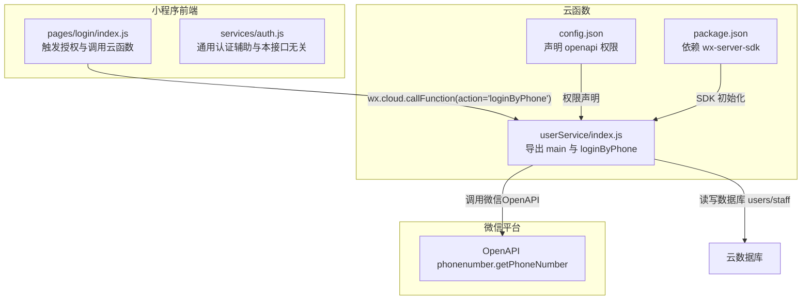
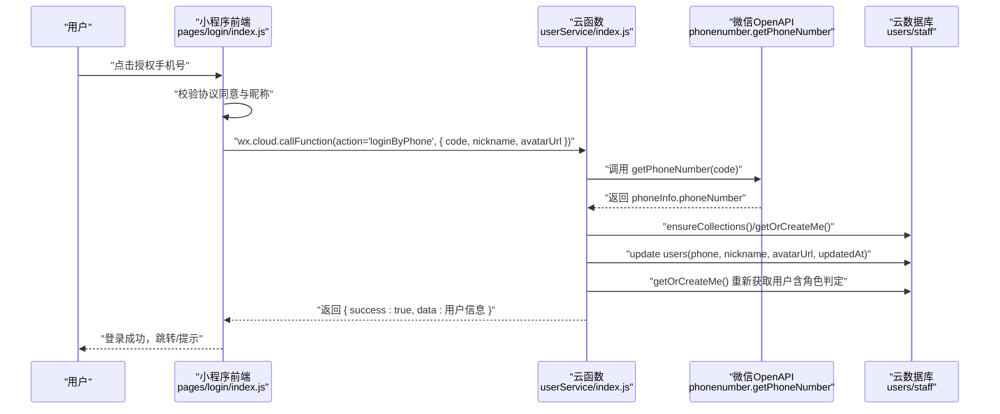
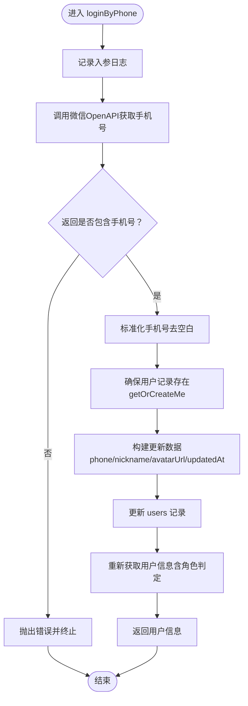
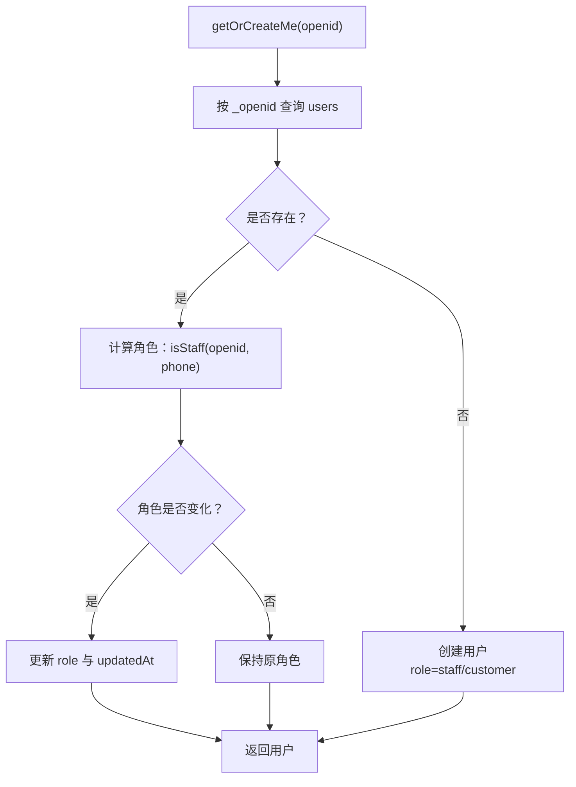
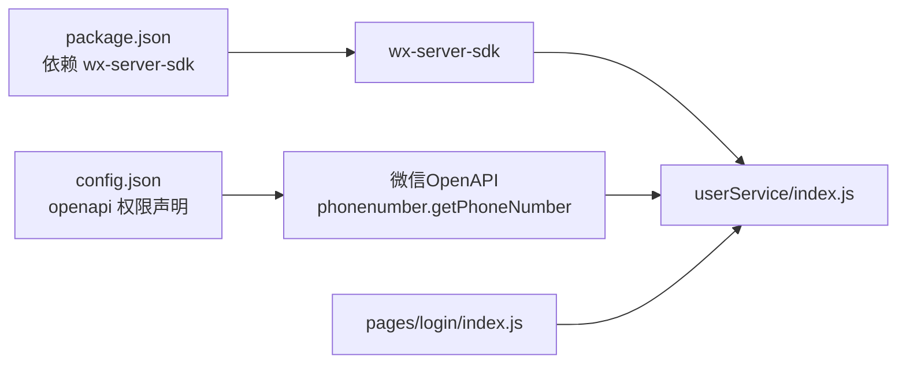

# 微信手机号登录 (loginByPhone)

<cite>
**本文引用的文件**
- [cloudfunctions/userService/index.js](file://cloudfunctions/userService/index.js)
- [cloudfunctions/userService/config.json](file://cloudfunctions/userService/config.json)
- [cloudfunctions/userService/package.json](file://cloudfunctions/userService/package.json)
- [miniprogram/pages/login/index.js](file://miniprogram/pages/login/index.js)
- [miniprogram/services/auth.js](file://miniprogram/services/auth.js)
- [PRD.md](file://PRD.md)
- [API完整文档.md](file://API完整文档.md)
</cite>

## 目录
1. [简介](#简介)
2. [项目结构](#项目结构)
3. [核心组件](#核心组件)
4. [架构总览](#架构总览)
5. [详细组件分析](#详细组件分析)
6. [依赖关系分析](#依赖关系分析)
7. [性能与安全考量](#性能与安全考量)
8. [故障排查指南](#故障排查指南)
9. [结论](#结论)
10. [附录](#附录)

## 简介
本文件聚焦于安得褓贝用户服务云函数中的 loginByPhone 接口，完整解析其通过微信 OpenAPI 解密手机号的全流程：从前端触发授权、到云函数调用微信 phonenumber.getPhoneNumber 接口、再到用户档案创建/更新与角色判定、最终返回用户信息。文档将逐行解读第105-157行的实现细节，覆盖参数校验、错误处理、日志记录与数据更新策略，并给出请求/响应示例与常见问题排查建议。同时强调该接口的安全性完全依赖微信平台鉴权，无需额外认证。

## 项目结构
loginByPhone 所在的云函数位于 cloudfunctions/userService，前端调用入口在 miniprogram/pages/login 中，二者通过 wx.cloud.callFunction 通信。云函数配置声明了对微信 phonenumber.getPhoneNumber 的 openapi 权限。

图表来源
- [cloudfunctions/userService/index.js](file://cloudfunctions/userService/index.js#L1-L20)
- [cloudfunctions/userService/config.json](file://cloudfunctions/userService/config.json#L1-L6)
- [cloudfunctions/userService/package.json](file://cloudfunctions/userService/package.json#L1-L12)
- [miniprogram/pages/login/index.js](file://miniprogram/pages/login/index.js#L120-L190)

章节来源
- [cloudfunctions/userService/index.js](file://cloudfunctions/userService/index.js#L1-L20)
- [cloudfunctions/userService/config.json](file://cloudfunctions/userService/config.json#L1-L6)
- [cloudfunctions/userService/package.json](file://cloudfunctions/userService/package.json#L1-L12)
- [miniprogram/pages/login/index.js](file://miniprogram/pages/login/index.js#L120-L190)

## 核心组件
- 云函数入口与分发：云函数 exports.main 根据 event.action 调用对应方法，其中 loginByPhone 负责手机号登录流程。
- loginByPhone：核心逻辑包括调用微信 OpenAPI 获取手机号、确保用户记录存在、合并昵称/头像/手机号更新、重新获取用户并返回。
- 用户档案与角色：getOrCreateMe 负责用户档案创建/更新与角色判定；updateMe 负责昵称/头像/手机号的更新。
- 前端触发：pages/login/index.js 在用户授权手机号后，调用云函数传入 code、nickname、avatarUrl。

章节来源
- [cloudfunctions/userService/index.js](file://cloudfunctions/userService/index.js#L258-L289)
- [cloudfunctions/userService/index.js](file://cloudfunctions/userService/index.js#L105-L161)
- [cloudfunctions/userService/index.js](file://cloudfunctions/userService/index.js#L49-L103)
- [miniprogram/pages/login/index.js](file://miniprogram/pages/login/index.js#L120-L190)

## 架构总览
下面的序列图展示了从用户授权手机号到返回用户信息的完整调用链路。

图表来源
- [miniprogram/pages/login/index.js](file://miniprogram/pages/login/index.js#L120-L190)
- [cloudfunctions/userService/index.js](file://cloudfunctions/userService/index.js#L105-L161)
- [cloudfunctions/userService/index.js](file://cloudfunctions/userService/index.js#L18-L24)
- [cloudfunctions/userService/index.js](file://cloudfunctions/userService/index.js#L49-L103)

## 详细组件分析

### loginByPhone 接口实现要点（逐行解析）
- 参数与上下文
  - 输入：openid（来自云开发上下文）、event.code、event.nickname、event.avatarUrl
  - 行为：调用微信 OpenAPI 获取手机号，随后更新用户档案并返回最新用户信息
- 调用微信 OpenAPI
  - 调用 cloud.openapi.phonenumber.getPhoneNumber(code)，返回 phoneInfo.phoneNumber
  - 若缺失或为空，抛出错误，阻止继续流程
- 用户档案保障与更新
  - 先执行 getOrCreateMe，确保 users 中存在该 openid 的用户记录（首次授权手机号时可能尚未创建）
  - 准备更新数据：phone、updatedAt；若传入 nickname/ avatarUrl 则一并写入
  - 执行数据库更新，随后再次 getOrCreateMe 以获得包含最新角色与字段的用户对象
- 日志与错误处理
  - 关键步骤均有 console.log 输出，便于排障
  - try/catch 包裹整个流程，捕获异常并向上抛出

图表来源
- [cloudfunctions/userService/index.js](file://cloudfunctions/userService/index.js#L105-L161)

章节来源
- [cloudfunctions/userService/index.js](file://cloudfunctions/userService/index.js#L105-L161)

### 用户档案与角色判定
- getOrCreateMe
  - 通过 openid 查询 users，若存在则更新角色（基于 isStaff 判定），返回用户
  - 若不存在则创建用户，角色依据 isStaff 判定（staff 优先以 phone 为准，其次以 openid）
- updateMe
  - 安全更新 nickname、avatarUrl、phone 等字段，统一写入 updatedAt
- isStaff
  - 优先以 phone 非空匹配 staff 集合；否则回退以 openid 匹配

图表来源
- [cloudfunctions/userService/index.js](file://cloudfunctions/userService/index.js#L49-L84)
- [cloudfunctions/userService/index.js](file://cloudfunctions/userService/index.js#L26-L47)

章节来源
- [cloudfunctions/userService/index.js](file://cloudfunctions/userService/index.js#L26-L84)

### 前端触发与参数传递
- pages/login/index.js
  - onGetPhoneNumber：在用户同意协议且已填写昵称后，调用 wx.cloud.callFunction
  - 传入参数：action="loginByPhone"，code（来自授权回调）、nickname、avatarUrl（可选）
  - 成功后提示“登录成功”，并返回上一页

章节来源
- [miniprogram/pages/login/index.js](file://miniprogram/pages/login/index.js#L120-L190)

## 依赖关系分析
- 云函数依赖
  - wx-server-sdk：提供 cloud.init、cloud.openapi、数据库命令等能力
  - openapi 权限：phonenumber.getPhoneNumber 在 config.json 中声明
- 前端依赖
  - wx.cloud.callFunction：调用云函数
  - wx.getUserProfile：用于获取头像与昵称（与 loginByPhone 互补）

图表来源
- [cloudfunctions/userService/package.json](file://cloudfunctions/userService/package.json#L1-L12)
- [cloudfunctions/userService/config.json](file://cloudfunctions/userService/config.json#L1-L6)
- [cloudfunctions/userService/index.js](file://cloudfunctions/userService/index.js#L1-L20)
- [miniprogram/pages/login/index.js](file://miniprogram/pages/login/index.js#L120-L190)

章节来源
- [cloudfunctions/userService/package.json](file://cloudfunctions/userService/package.json#L1-L12)
- [cloudfunctions/userService/config.json](file://cloudfunctions/userService/config.json#L1-L6)
- [cloudfunctions/userService/index.js](file://cloudfunctions/userService/index.js#L1-L20)
- [miniprogram/pages/login/index.js](file://miniprogram/pages/login/index.js#L120-L190)

## 性能与安全考量
- 性能
  - 一次数据库写入与两次查询（getOrCreateMe）构成主要开销，通常可忽略
  - 若频繁调用，建议前端在授权前缓存头像/昵称，减少不必要的云函数调用
- 安全
  - 本接口的安全性完全依赖微信平台鉴权，云函数无需额外认证
  - 云函数通过 wx-server-sdk 与微信 OpenAPI 交互，确保 code 的可信性
- 数据一致性
  - 通过 ensureCollections 预创建集合，避免新环境首次运行时报错
  - 更新采用原子更新（update），并统一写入 updatedAt

章节来源
- [cloudfunctions/userService/index.js](file://cloudfunctions/userService/index.js#L18-L24)
- [cloudfunctions/userService/index.js](file://cloudfunctions/userService/index.js#L105-L161)
- [cloudfunctions/userService/config.json](file://cloudfunctions/userService/config.json#L1-L6)

## 故障排查指南
- 常见错误与定位
  - 获取手机号失败：检查微信 OpenAPI 返回结构，确认 phoneInfo.phoneNumber 是否存在
  - 未授权/未同意协议：前端会在授权回调中校验并提示
  - 未设置昵称：前端会在授权前校验昵称，未设置将阻断流程
  - 云函数日志：关注 loginByPhone 中的 console.log 输出，定位具体步骤
- 建议排查步骤
  - 确认前端已正确传入 code、nickname、avatarUrl
  - 检查微信 OpenAPI 权限是否已配置（config.json）
  - 查看云函数日志，确认 getPhoneNumber 调用是否成功
  - 若 users 集合不存在，等待 ensureCollections 自动创建后再试

章节来源
- [cloudfunctions/userService/index.js](file://cloudfunctions/userService/index.js#L105-L161)
- [cloudfunctions/userService/config.json](file://cloudfunctions/userService/config.json#L1-L6)
- [miniprogram/pages/login/index.js](file://miniprogram/pages/login/index.js#L120-L190)

## 结论
loginByPhone 是小程序授权手机号场景下的关键路径，它通过微信 OpenAPI 安全地解密手机号，结合 getOrCreateMe 与 updateMe 完成用户档案的创建/更新与角色判定，最终返回标准化的用户信息。该流程简洁可靠，依赖微信平台鉴权，无需额外认证；前端在授权前进行必要的前置校验，保证用户体验与数据质量。

## 附录

### 请求与响应示例

- 成功场景
  - 请求
    - action: "loginByPhone"
    - code: "微信授权返回的临时登录凭证"
    - nickname: "用户昵称"
    - avatarUrl: "用户头像（可选）"
  - 响应
    - success: true
    - data: 用户对象（包含 openid、role、nickname、avatarUrl、phone、createdAt、updatedAt 等）

- 失败场景
  - 授权未同意协议或未设置昵称：前端直接提示并阻断
  - 微信 OpenAPI 返回无手机号：云函数抛错并返回错误信息
  - 云函数异常：捕获异常并向上抛出，前端收到失败提示

章节来源
- [miniprogram/pages/login/index.js](file://miniprogram/pages/login/index.js#L120-L190)
- [cloudfunctions/userService/index.js](file://cloudfunctions/userService/index.js#L105-L161)

### 与 PRD/架构的关系
- 角色与权限
  - 用户角色由 isStaff 判定，优先以 phone 匹配 staff 集合，其次以 openid 匹配
  - 个人中心展示角色，仅 staff 可见管理入口
- 数据模型
  - users 集合存储用户基本信息与角色；staff 集合作为员工白名单
- 云函数职责
  - userService 负责用户档案与角色判定；resumeService 负责简历相关能力

章节来源
- [PRD.md](file://PRD.md#L202-L231)
- [PRD.md](file://PRD.md#L262-L281)
- [cloudfunctions/userService/index.js](file://cloudfunctions/userService/index.js#L26-L84)