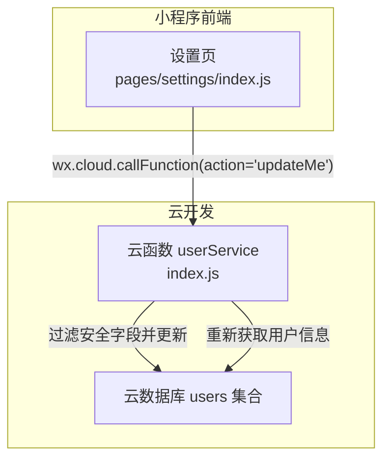
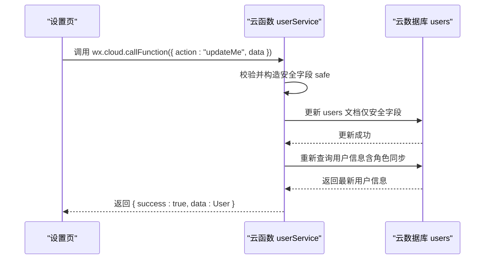
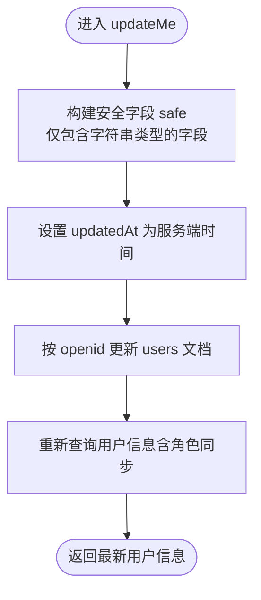
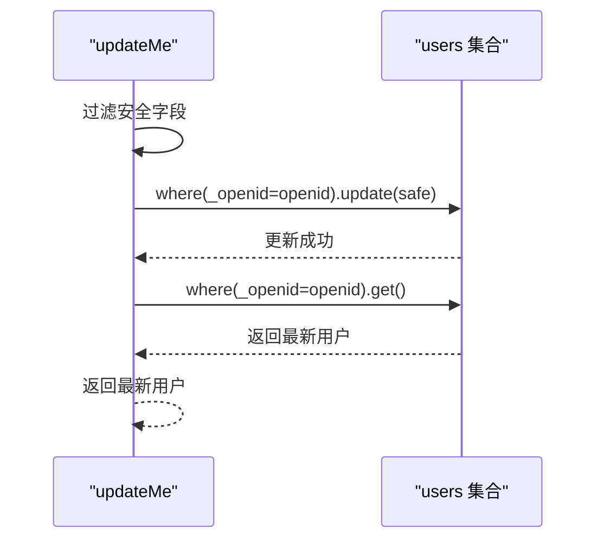
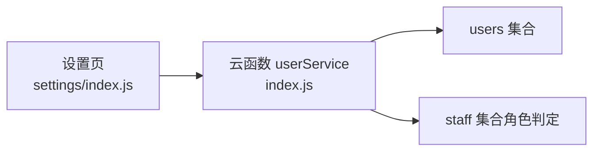

# 更新用户信息 (updateMe)

<cite>
**本文引用的文件**
- [cloudfunctions/userService/index.js](file://cloudfunctions/userService/index.js)
- [miniprogram/pages/settings/index.js](file://miniprogram/pages/settings/index.js)
- [PRD.md](file://PRD.md)
</cite>

## 目录
1. [简介](#简介)
2. [项目结构](#项目结构)
3. [核心组件](#核心组件)
4. [架构总览](#架构总览)
5. [详细组件分析](#详细组件分析)
6. [依赖关系分析](#依赖关系分析)
7. [性能考量](#性能考量)
8. [故障排查指南](#故障排查指南)
9. [结论](#结论)
10. [附录](#附录)

## 简介
本文件聚焦于安得褓贝用户服务云函数中的 updateMe 接口，用于更新当前用户的个人信息，包括昵称、头像 URL 和手机号。该接口通过云函数的 openid 自动鉴权，无需额外权限校验；后端仅允许更新安全字段，自动设置 updatedAt 时间戳，并在更新完成后重新获取最新用户信息返回。该接口在个人资料编辑场景中被调用，与前端“设置”页面紧密关联。

## 项目结构
- 云函数入口位于 cloudfunctions/userService/index.js，其中包含 updateMe 逻辑与 action 分发。
- 前端设置页 pages/settings/index.js 调用云函数执行 updateMe，实现个人资料编辑。

图表来源
- [cloudfunctions/userService/index.js](file://cloudfunctions/userService/index.js#L85-L103)
- [miniprogram/pages/settings/index.js](file://miniprogram/pages/settings/index.js#L147-L156)

章节来源
- [cloudfunctions/userService/index.js](file://cloudfunctions/userService/index.js#L85-L103)
- [miniprogram/pages/settings/index.js](file://miniprogram/pages/settings/index.js#L147-L156)

## 核心组件
- 云函数 userService：提供 updateMe 动作，负责数据过滤、数据库更新与最终用户信息返回。
- 前端设置页 settings：封装请求参数，调用云函数并处理响应。

章节来源
- [cloudfunctions/userService/index.js](file://cloudfunctions/userService/index.js#L85-L103)
- [miniprogram/pages/settings/index.js](file://miniprogram/pages/settings/index.js#L147-L156)

## 架构总览
updateMe 的调用链路如下：

图表来源
- [cloudfunctions/userService/index.js](file://cloudfunctions/userService/index.js#L85-L103)
- [miniprogram/pages/settings/index.js](file://miniprogram/pages/settings/index.js#L147-L156)

## 详细组件分析

### 接口定义与调用方式
- 云函数名称：userService
- 动作：updateMe
- 调用方式：小程序端通过 wx.cloud.callFunction 调用，传入 { action: "updateMe", data: { ... } }
- 数据模型：users 集合包含昵称、头像 URL、手机号、角色、时间戳等字段

章节来源
- [PRD.md](file://PRD.md#L288-L293)
- [cloudfunctions/userService/index.js](file://cloudfunctions/userService/index.js#L258-L288)
- [miniprogram/pages/settings/index.js](file://miniprogram/pages/settings/index.js#L147-L156)

### 请求参数与数据类型验证规则
- 参数结构：data 对象，包含以下可选字段
  - nickname：字符串
  - avatarUrl：字符串（支持临时 URL，前端可上传至云存储后再写入）
  - phone：字符串（后端支持写入，但前端暂无入口）
- 类型验证：后端对每个字段进行类型检查，仅当字段为字符串时才写入安全对象 safe
- 安全字段范围：仅允许更新 nickname、avatarUrl、phone（由后端逻辑决定）

章节来源
- [cloudfunctions/userService/index.js](file://cloudfunctions/userService/index.js#L86-L100)
- [PRD.md](file://PRD.md#L210-L218)

### 后端实现逻辑
- 数据过滤：遍历 data 对象，仅当字段为字符串类型时写入 safe
- 写入 updatedAt：始终设置 updatedAt 为服务端时间
- 数据库更新：基于 openid 查询 users 文档并执行更新
- 结果返回：重新获取用户信息（会自动同步角色），返回最新用户对象

图表来源
- [cloudfunctions/userService/index.js](file://cloudfunctions/userService/index.js#L86-L103)

章节来源
- [cloudfunctions/userService/index.js](file://cloudfunctions/userService/index.js#L86-L103)

### 事务性操作流程（第86-102行）
- 数据过滤：逐项检查 data 中的 nickname、avatarUrl、phone，仅当类型为字符串时加入 safe
- 数据库更新：使用 where({ _openid: openid }) 定位文档并更新 safe 字段
- 角色同步校验：更新完成后再次查询用户信息，确保角色与手机号白名单一致
- 返回最新用户：返回包含最新字段与角色的用户对象

图表来源
- [cloudfunctions/userService/index.js](file://cloudfunctions/userService/index.js#L86-L103)

章节来源
- [cloudfunctions/userService/index.js](file://cloudfunctions/userService/index.js#L86-L103)

### 鉴权机制
- 通过云函数上下文 wxContext.OPENID 获取当前用户 openid
- 以 openid 作为查询条件定位用户文档，实现按用户隔离的更新
- 无需额外权限校验，符合 PRD 中“获取/更新用户信息”对任意角色开放的策略

章节来源
- [cloudfunctions/userService/index.js](file://cloudfunctions/userService/index.js#L258-L260)
- [PRD.md](file://PRD.md#L273-L274)

### 前端调用与个人资料编辑场景
- 设置页 settings 在保存时调用 updateMe，将临时编辑的昵称与头像 URL 传给云函数
- 若头像为临时 URL，前端先上传至云存储再写入数据库
- 该流程与前端 profile 页面的个人资料展示相辅相成

章节来源
- [miniprogram/pages/settings/index.js](file://miniprogram/pages/settings/index.js#L147-L156)

### 请求与响应示例
- 请求示例（动作与数据）：
  - { action: "updateMe", data: { nickname: "新昵称", avatarUrl: "https://..." } }
  - { action: "updateMe", data: { phone: "13800000000" } }（后端支持，前端暂无入口）
- 响应示例：
  - { success: true, data: { nickname, avatarUrl, phone, role, createdAt, updatedAt, ... } }

章节来源
- [PRD.md](file://PRD.md#L288-L293)
- [cloudfunctions/userService/index.js](file://cloudfunctions/userService/index.js#L270-L274)

## 依赖关系分析
- 云函数 userService 依赖云数据库 users 集合
- 前端设置页依赖云函数 userService 的 updateMe 动作
- 角色同步依赖 staff 集合（在 getOrCreateMe 中用于判定角色）

图表来源
- [cloudfunctions/userService/index.js](file://cloudfunctions/userService/index.js#L26-L84)
- [miniprogram/pages/settings/index.js](file://miniprogram/pages/settings/index.js#L147-L156)

章节来源
- [cloudfunctions/userService/index.js](file://cloudfunctions/userService/index.js#L26-L84)
- [miniprogram/pages/settings/index.js](file://miniprogram/pages/settings/index.js#L147-L156)

## 性能考量
- 单次更新操作仅涉及 users 集合的一次写入与一次读取，复杂度低
- 由于仅过滤安全字段并更新，避免不必要的字段变更
- 建议前端在调用前对输入进行基本校验，减少无效请求

## 故障排查指南
- 无权限或失败：若前端绕过路径访问管理页，后端会在云函数处拒绝（PRD 中有说明）
- 未知 action：云函数 switch 未匹配到 action 时返回 unknown action
- 云函数未初始化：首次调用会自动创建必要集合，避免“集合不存在”错误

章节来源
- [PRD.md](file://PRD.md#L279-L280)
- [cloudfunctions/userService/index.js](file://cloudfunctions/userService/index.js#L258-L288)

## 结论
updateMe 接口以 openid 自动鉴权，仅允许更新安全字段并自动设置 updatedAt，更新后重新获取最新用户信息返回，满足个人资料编辑场景需求。前端设置页通过 wx.cloud.callFunction 调用该接口，配合临时头像上传与角色同步，形成完整的用户信息更新闭环。

## 附录
- 数据模型（users 集合）关键字段
  - _openid：微信 openid（云开发自动写入/可查询）
  - role：角色（staff/customer）
  - nickname：昵称
  - avatarUrl：头像 URL
  - phone：手机号（后端支持写入）
  - createdAt/updatedAt：创建与更新时间

章节来源
- [PRD.md](file://PRD.md#L206-L218)