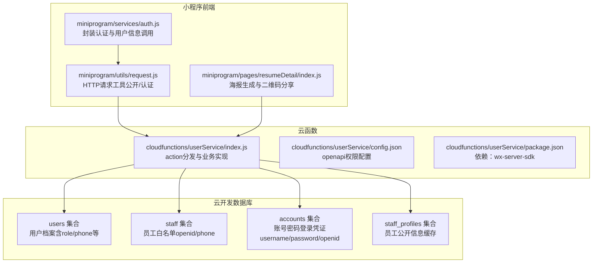
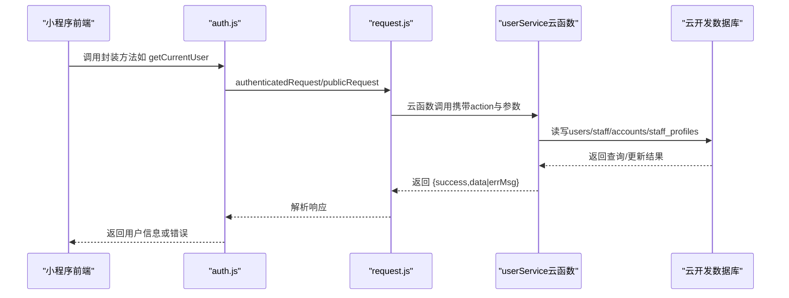
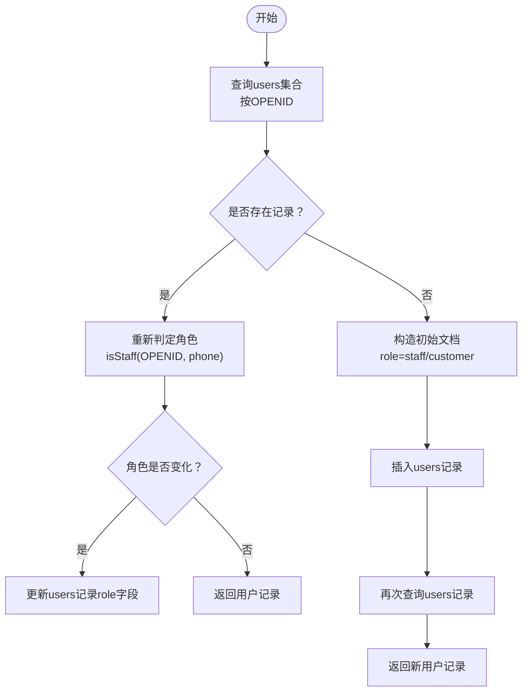
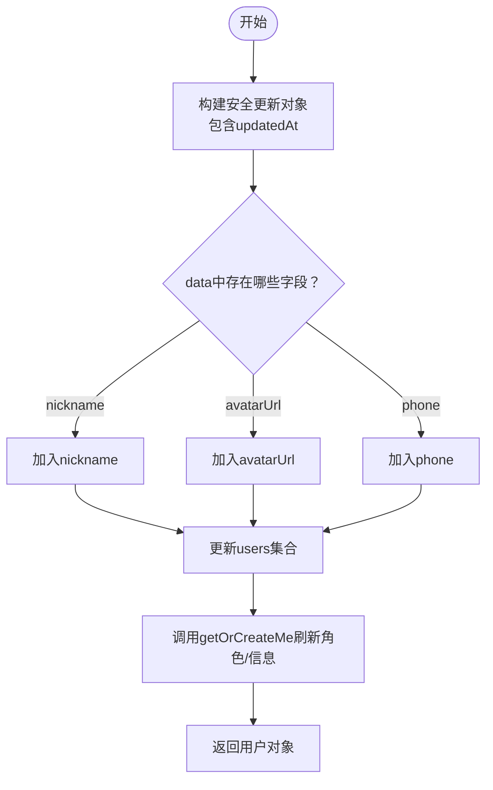
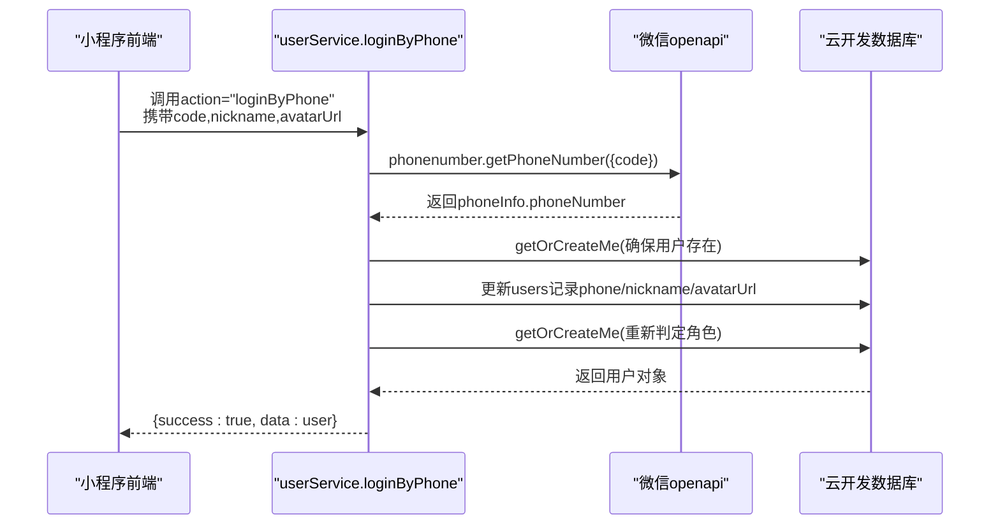
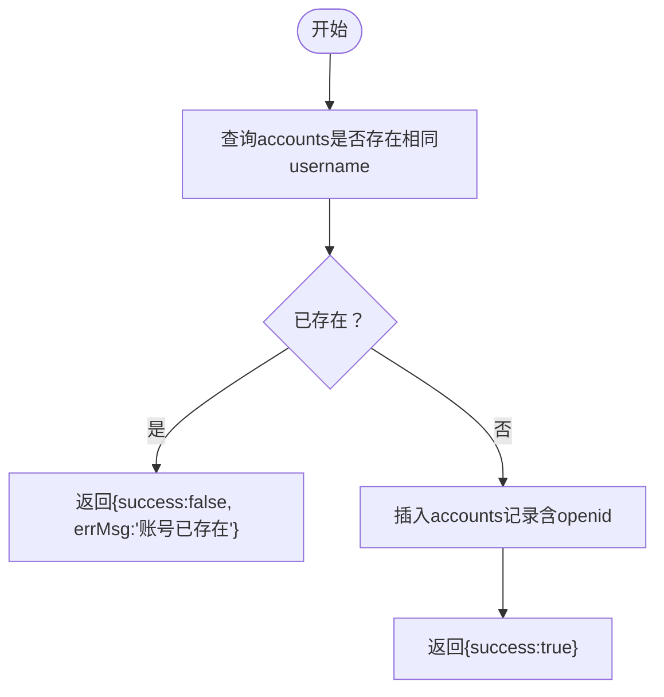
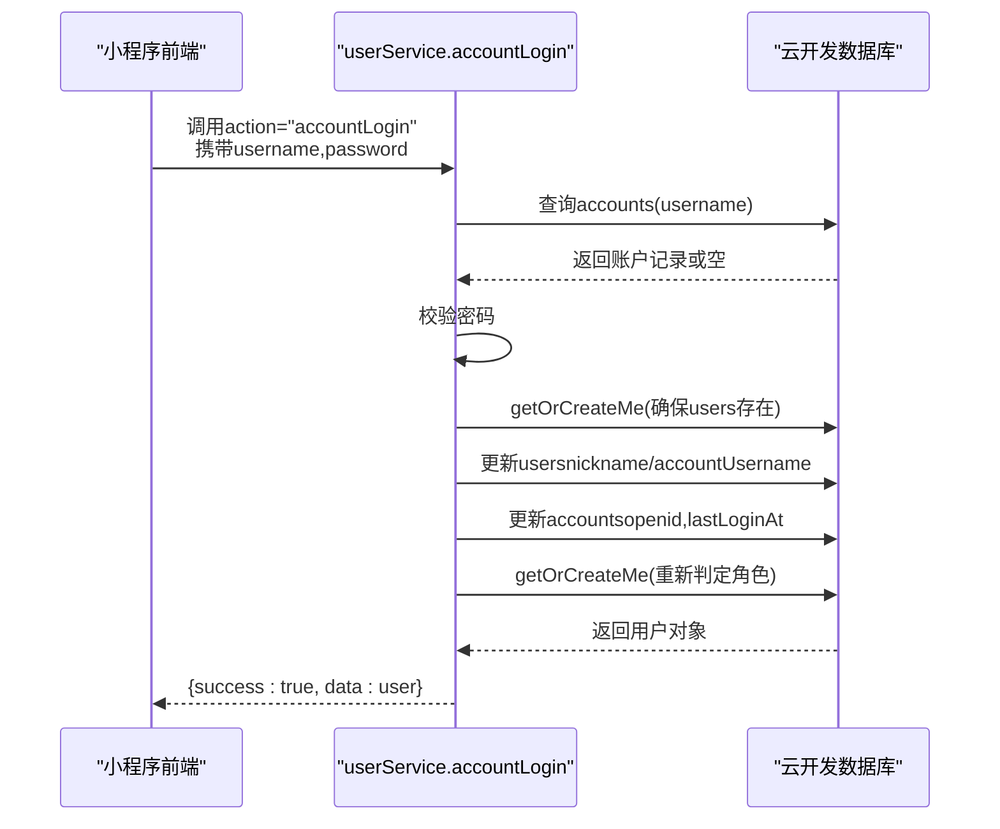
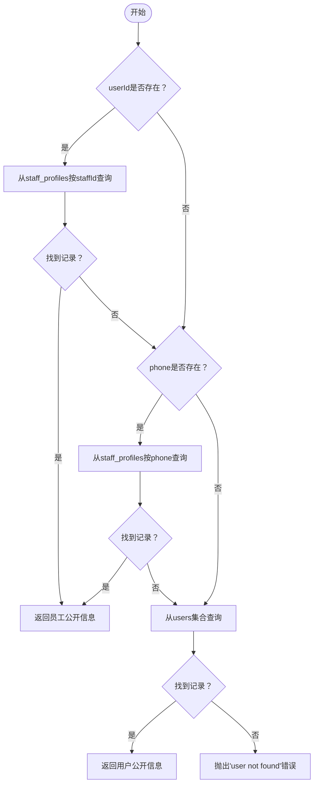
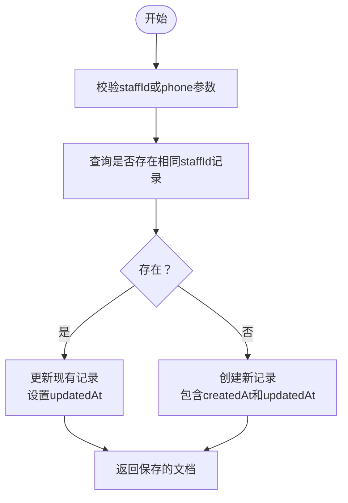
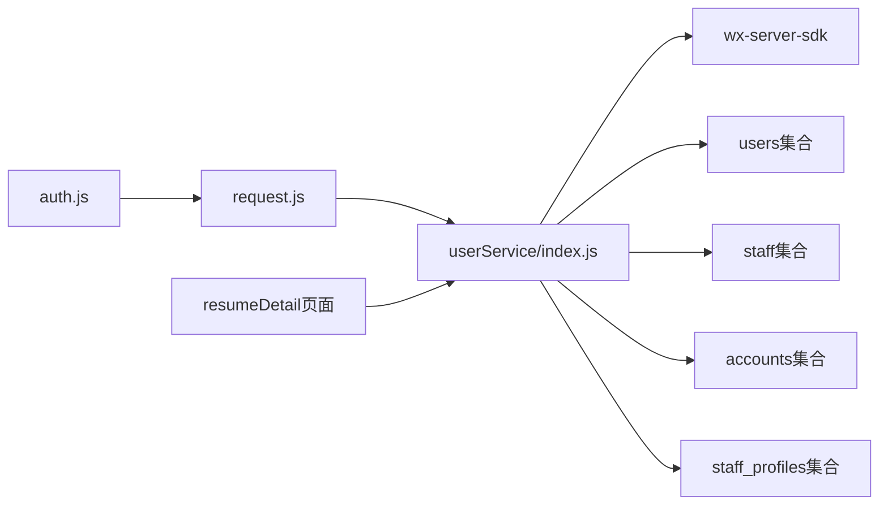

# 用户服务API

<cite>
**本文引用的文件**
- [cloudfunctions/userService/index.js](file://cloudfunctions/userService/index.js)
- [cloudfunctions/userService/config.json](file://cloudfunctions/userService/config.json)
- [cloudfunctions/userService/package.json](file://cloudfunctions/userService/package.json)
- [miniprogram/services/auth.js](file://miniprogram/services/auth.js)
- [miniprogram/utils/request.js](file://miniprogram/utils/request.js)
- [miniprogram/pages/resumeDetail/index.js](file://miniprogram/pages/resumeDetail/index.js)
- [API完整文档.md](file://API完整文档.md)
- [PRD.md](file://PRD.md)
</cite>

## 目录
1. [简介](#简介)
2. [项目结构](#项目结构)
3. [核心组件](#核心组件)
4. [架构总览](#架构总览)
5. [详细组件分析](#详细组件分析)
6. [依赖关系分析](#依赖关系分析)
7. [性能考虑](#性能考虑)
8. [故障排查指南](#故障排查指南)
9. [结论](#结论)
10. [附录](#附录)

## 简介
本文件面向安得褓贝小程序端用户服务API，聚焦云函数 userService 提供的七个核心 action：getOrCreateMe、updateMe、loginByPhone、accountRegister、accountLogin、getStaffPublicInfo 和 saveStaffProfile。内容涵盖调用方式（云函数调用）、请求参数、响应数据结构、错误码与使用场景，并结合实际代码说明微信上下文自动鉴权（OPENID）机制。特别说明：
- getOrCreateMe 会根据 staff 集合中的手机号白名单自动判定用户角色（staff 或 customer）。
- updateMe 支持更新昵称、头像和手机号等基本信息。
- loginByPhone 通过微信 openapi 获取手机号，随后更新用户信息并重新判定角色。
- 账号密码登录与注册 accountLogin/accountRegister 的实现逻辑与注意事项。
- **新增**：getStaffPublicInfo 和 saveStaffProfile 支持员工公开信息缓存和QR码分享体验，提升客户扫码查看顾问信息的效率。

## 项目结构
用户服务API位于云函数 userService 中，前端通过 miniprogram/services/auth.js 与 miniprogram/utils/request.js 封装调用。整体结构如下：

**图表来源**
- [cloudfunctions/userService/index.js:1-458](file://cloudfunctions/userService/index.js#L1-L458)
- [cloudfunctions/userService/config.json:1-6](file://cloudfunctions/userService/config.json#L1-L6)
- [cloudfunctions/userService/package.json:1-12](file://cloudfunctions/userService/package.json#L1-L12)
- [miniprogram/services/auth.js:1-163](file://miniprogram/services/auth.js#L1-L163)
- [miniprogram/utils/request.js:1-125](file://miniprogram/utils/request.js#L1-L125)
- [miniprogram/pages/resumeDetail/index.js:320-343](file://miniprogram/pages/resumeDetail/index.js#L320-L343)

**章节来源**
- [cloudfunctions/userService/index.js:1-458](file://cloudfunctions/userService/index.js#L1-L458)
- [cloudfunctions/userService/config.json:1-6](file://cloudfunctions/userService/config.json#L1-L6)
- [cloudfunctions/userService/package.json:1-12](file://cloudfunctions/userService/package.json#L1-L12)
- [miniprogram/services/auth.js:1-163](file://miniprogram/services/auth.js#L1-L163)
- [miniprogram/utils/request.js:1-125](file://miniprogram/utils/request.js#L1-L125)
- [miniprogram/pages/resumeDetail/index.js:320-343](file://miniprogram/pages/resumeDetail/index.js#L320-L343)

## 核心组件
- 云函数入口与action分发：根据 event.action 调用对应方法，返回统一结构 { success, data|errMsg }。
- 用户档案集合 users：存储用户 OPENID、角色 role、昵称、头像、手机号等基础信息。
- 员工白名单集合 staff：用于判定 staff 角色（优先手机号，其次 openid）。
- 账号密码集合 accounts：存储 username/password/openid 等登录凭证。
- **新增**：员工公开信息集合 staff_profiles：缓存员工公开信息，支持QR码分享体验。

**章节来源**
- [cloudfunctions/userService/index.js:23-25](file://cloudfunctions/userService/index.js#L23-L25)
- [cloudfunctions/userService/index.js:113-195](file://cloudfunctions/userService/index.js#L113-L195)
- [PRD.md:220-281](file://PRD.md#L220-L281)

## 架构总览
用户服务API的调用链路如下：

**图表来源**
- [miniprogram/services/auth.js:1-163](file://miniprogram/services/auth.js#L1-L163)
- [miniprogram/utils/request.js:1-125](file://miniprogram/utils/request.js#L1-L125)
- [cloudfunctions/userService/index.js:412-457](file://cloudfunctions/userService/index.js#L412-L457)

## 详细组件分析

### getOrCreateMe
- 功能：获取当前用户档案；若不存在则创建，并根据 staff 白名单自动判定角色（staff 或 customer）。
- 调用方式：云函数调用，action 为 "getOrCreateMe"。
- 请求参数：无显式参数（使用微信上下文 OPENID）。
- 响应数据结构：{ success: true, data: User }，其中 User 包含 OPENID、角色 role、昵称、头像、手机号、创建/更新时间等。
- 使用场景：小程序启动时初始化用户信息、刷新用户资料。
- 关键逻辑要点：
  - 若 users 中已有记录，会重新判定角色并同步更新。
  - 首次创建时，role 由 isStaff(openid, phone=null) 决定。
  - 角色判定优先使用手机号白名单，其次使用 openid。

**图表来源**
- [cloudfunctions/userService/index.js:50-94](file://cloudfunctions/userService/index.js#L50-L94)

**章节来源**
- [cloudfunctions/userService/index.js:50-94](file://cloudfunctions/userService/index.js#L50-L94)
- [PRD.md:262-281](file://PRD.md#L262-L281)

### updateMe
- 功能：更新用户昵称、头像、手机号等基本信息。
- 调用方式：云函数调用，action 为 "updateMe"，参数为 { data: { nickname?, avatarUrl?, phone? } }。
- 请求参数：data 对象中可选字段 nickname、avatarUrl、phone。
- 响应数据结构：{ success: true, data: User }，返回更新后的用户对象。
- 使用场景：用户在个人中心修改昵称、头像或绑定手机号。
- 关键逻辑要点：
  - 仅对传入的有效字符串字段进行更新。
  - 更新后会再次调用 getOrCreateMe，确保角色与最新信息同步。

**图表来源**
- [cloudfunctions/userService/index.js:236-253](file://cloudfunctions/userService/index.js#L236-L253)

**章节来源**
- [cloudfunctions/userService/index.js:236-253](file://cloudfunctions/userService/index.js#L236-L253)

### loginByPhone
- 功能：通过微信 openapi 获取手机号，绑定到用户档案并更新昵称/头像（如有），随后重新判定角色。
- 调用方式：云函数调用，action 为 "loginByPhone"，参数为 { code, nickname?, avatarUrl? }。
- 请求参数：
  - code：微信登录临时code，用于换取手机号。
  - nickname/ avatarUrl：可选，首次授权时可同时保存昵称与头像。
- 响应数据结构：{ success: true, data: User }，返回更新后的用户对象。
- 使用场景：用户授权手机号登录，完善用户档案。
- 关键逻辑要点：
  - 调用微信 openapi.phonenumber.getPhoneNumber(code) 获取手机号。
  - 若获取失败，抛出异常。
  - 首次授权可能尚未创建 users 记录，会先确保用户存在。
  - 更新用户 phone/nickname/avatarUrl，并刷新角色。

**图表来源**
- [cloudfunctions/userService/index.js:255-315](file://cloudfunctions/userService/index.js#L255-L315)
- [cloudfunctions/userService/config.json:1-6](file://cloudfunctions/userService/config.json#L1-L6)

**章节来源**
- [cloudfunctions/userService/index.js:255-315](file://cloudfunctions/userService/index.js#L255-L315)
- [cloudfunctions/userService/config.json:1-6](file://cloudfunctions/userService/config.json#L1-L6)

### accountRegister
- 功能：账号密码注册，校验用户名唯一性后写入 accounts 集合。
- 调用方式：云函数调用，action 为 "accountRegister"，参数为 { username, password, nickname }。
- 请求参数：username、password、nickname。
- 响应数据结构：{ success: true } 或 { success: false, errMsg }。
- 使用场景：用户使用账号密码注册。
- 关键逻辑要点：
  - 校验 username 是否已存在。
  - 直接写入 accounts，包含 username/password/openid/nickname/createdAt。
  - 注释提示：生产环境应使用密码加密（当前代码未加密）。

**图表来源**
- [cloudfunctions/userService/index.js:317-350](file://cloudfunctions/userService/index.js#L317-L350)

**章节来源**
- [cloudfunctions/userService/index.js:317-350](file://cloudfunctions/userService/index.js#L317-L350)

### accountLogin
- 功能：账号密码登录，校验用户名与密码，绑定 openid，更新用户信息并重新判定角色。
- 调用方式：云函数调用，action 为 "accountLogin"，参数为 { username, password }。
- 请求参数：username、password。
- 响应数据结构：{ success: true, data: User } 或 { success: false, errMsg }。
- 使用场景：用户使用账号密码登录。
- 关键逻辑要点：
  - 查询 accounts，校验用户名存在且密码匹配。
  - 确保 users 记录存在，更新 nickname/accountUsername 等字段。
  - 更新 accounts 的 openid 与 lastLoginAt，支持多设备登录。
  - 重新获取用户信息，确保角色与最新信息同步。

**图表来源**
- [cloudfunctions/userService/index.js:352-410](file://cloudfunctions/userService/index.js#L352-L410)

**章节来源**
- [cloudfunctions/userService/index.js:352-410](file://cloudfunctions/userService/index.js#L352-L410)

### **新增** getStaffPublicInfo
- 功能：按 staffId 或手机号查询顾问公开信息，支持QR码分享体验。
- 调用方式：云函数调用，action 为 "getStaffPublicInfo"，参数为 { userId?, phone? }。
- 请求参数：
  - userId：员工ID（推荐使用，优先级最高）。
  - phone：手机号（作为回退查询条件）。
- 响应数据结构：{ success: true, data: StaffProfile }，其中 StaffProfile 包含 _id、name、phone、avatar、company 等公开信息。
- 使用场景：客户扫描海报二维码查看顾问完整信息，无需登录即可获取公开资料。
- 关键逻辑要点：
  - 优先从 staff_profiles 集合按 staffId 查找（生成海报时已缓存）。
  - 其次按手机号从 staff_profiles 查找。
  - 最后兼容旧逻辑：从 users 集合按文档ID或手机号查找。
  - 未找到时抛出 "user not found" 错误。

**图表来源**
- [cloudfunctions/userService/index.js:147-195](file://cloudfunctions/userService/index.js#L147-L195)

**章节来源**
- [cloudfunctions/userService/index.js:147-195](file://cloudfunctions/userService/index.js#L147-L195)

### **新增** saveStaffProfile
- 功能：保存员工公开信息到 staff_profiles 集合，支持海报生成和QR码分享。
- 调用方式：云函数调用，action 为 "saveStaffProfile"，参数为 { staffId, name, phone, avatar, company? }。
- 请求参数：
  - staffId：员工ID（必填，用于唯一标识）。
  - name：员工姓名（可选）。
  - phone：手机号（可选）。
  - avatar：头像URL（可选）。
  - company：公司名称（可选，默认"安得褓贝"）。
- 响应数据结构：{ success: true, data: StaffProfile }，返回保存的员工公开信息。
- 使用场景：员工生成海报或小程序码时，将公开信息缓存到 staff_profiles 集合。
- 关键逻辑要点：
  - 必须提供 staffId 或 phone 参数。
  - 若存在相同 staffId 的记录，则更新现有记录。
  - 若不存在，则创建新记录并设置 createdAt。
  - 自动更新 updatedAt 时间戳。

**图表来源**
- [cloudfunctions/userService/index.js:117-140](file://cloudfunctions/userService/index.js#L117-L140)

**章节来源**
- [cloudfunctions/userService/index.js:117-140](file://cloudfunctions/userService/index.js#L117-L140)

## 依赖关系分析
- 云函数依赖：
  - wx-server-sdk：初始化云开发环境、获取微信上下文 OPENID、调用微信 openapi。
  - 数据库：users/staff/accounts/staff_profiles 四个集合。
- 前端依赖：
  - request.js：封装公开请求与认证请求，自动注入 Authorization 头与 Token。
  - auth.js：封装登录、登出、Token 校验、用户信息获取等。
  - **新增**：resumeDetail 页面：负责海报生成、二维码分享和员工信息缓存。

**图表来源**
- [cloudfunctions/userService/package.json:1-12](file://cloudfunctions/userService/package.json#L1-L12)
- [cloudfunctions/userService/index.js:1-458](file://cloudfunctions/userService/index.js#L1-L458)
- [miniprogram/services/auth.js:1-163](file://miniprogram/services/auth.js#L1-L163)
- [miniprogram/utils/request.js:1-125](file://miniprogram/utils/request.js#L1-L125)
- [miniprogram/pages/resumeDetail/index.js:1750-1757](file://miniprogram/pages/resumeDetail/index.js#L1750-L1757)

**章节来源**
- [cloudfunctions/userService/package.json:1-12](file://cloudfunctions/userService/package.json#L1-L12)
- [cloudfunctions/userService/index.js:1-458](file://cloudfunctions/userService/index.js#L1-L458)
- [miniprogram/services/auth.js:1-163](file://miniprogram/services/auth.js#L1-L163)
- [miniprogram/utils/request.js:1-125](file://miniprogram/utils/request.js#L1-L125)
- [miniprogram/pages/resumeDetail/index.js:1750-1757](file://miniprogram/pages/resumeDetail/index.js#L1750-L1757)

## 性能考虑
- 集合初始化：首次运行自动创建 users/staff/accounts/staff_profiles 集合，避免新环境直接报错。
- 查询与更新：getOrCreateMe/updateMe 使用按 OPENID 的精确查询，复杂度 O(1)；loginByPhone/accountLogin 会触发多次数据库读写，建议在前端做好节流与重试策略。
- 角色判定：isStaff 优先使用手机号白名单，减少 openid 查询成本。
- **新增**：staff_profiles 缓存机制显著提升 QR 码分享体验，避免每次扫码都查询 users 集合。
- 建议：
  - 对频繁调用的接口（如 getOrCreateMe）可在前端做缓存策略。
  - 账号密码登录建议在云函数侧增加密码加密与更严格的校验。
  - **新增**：QR 码分享场景下，建议在前端缓存 getStaffPublicInfo 的结果，减少重复查询。

## 故障排查指南
- 常见错误与定位：
  - loginByPhone 获取手机号失败：检查微信 code 是否有效、是否配置 phonenumber.openapi 权限。
  - accountRegister 返回"账号已存在"：确认 username 唯一性。
  - accountLogin 返回"账号不存在/密码错误"：核对用户名与密码。
  - 角色未更新：确认 staff 集合中是否存在对应 openid 或 phone。
  - **新增**：getStaffPublicInfo 返回"user not found"：确认 staff_profiles 中是否存在对应的 staffId 或 phone。
- 前端验证：
  - 使用 auth.js 的 validateToken 方法检测 Token 有效性。
  - request.js 在 401 时会自动清理本地 Token 并跳转登录页。
  - **新增**：QR 码分享时，getStaffPublicInfo 失败不应阻塞主流程，前端已做错误处理。

**章节来源**
- [cloudfunctions/userService/config.json:1-6](file://cloudfunctions/userService/config.json#L1-L6)
- [cloudfunctions/userService/index.js:255-315](file://cloudfunctions/userService/index.js#L255-L315)
- [cloudfunctions/userService/index.js:317-410](file://cloudfunctions/userService/index.js#L317-L410)
- [cloudfunctions/userService/index.js:147-195](file://cloudfunctions/userService/index.js#L147-L195)
- [miniprogram/services/auth.js:1-163](file://miniprogram/services/auth.js#L1-L163)
- [miniprogram/utils/request.js:1-125](file://miniprogram/utils/request.js#L1-L125)
- [miniprogram/pages/resumeDetail/index.js:320-343](file://miniprogram/pages/resumeDetail/index.js#L320-L343)

## 结论
用户服务API通过云函数 userService 提供了完善的用户生命周期管理能力：从用户档案创建与更新，到手机号授权登录，再到账号密码登录与注册。系统采用微信上下文自动鉴权（OPENID），无需额外认证；角色判定基于 staff 白名单，支持手机号优先策略。

**新增功能**：getStaffPublicInfo 和 saveStaffProfile 两个API显著提升了用户体验，通过 staff_profiles 集合缓存员工公开信息，使客户扫码查看顾问信息更加高效流畅。这两个功能与现有的海报生成和二维码分享功能完美集成，形成了完整的员工展示生态。

建议在生产环境中对账号密码登录增加密码加密与更严格的安全校验，并在前端做好 Token 管理与错误处理。QR 码分享场景下，建议实现结果缓存机制以进一步提升性能。

## 附录

### 前端服务层封装示例（miniprogram/services/auth.js）
- 登录：login(username, password) -> publicRequest('/auth/login')
- 获取当前用户：getCurrentUser() -> authenticatedRequest('/auth/me')
- Token 校验：validateToken() -> 调用 getCurrentUser 并解析响应
- 保存/读取本地认证数据：saveAuthData()/getLocalUserInfo()/getLocalToken()
- 登出：logout() -> 清除本地存储

**章节来源**
- [miniprogram/services/auth.js:1-163](file://miniprogram/services/auth.js#L1-L163)
- [miniprogram/utils/request.js:1-125](file://miniprogram/utils/request.js#L1-L125)

### 前端QR码分享实现示例（miniprogram/pages/resumeDetail/index.js）
- 海报生成时缓存员工公开信息：调用 saveStaffProfile
- 客户扫码时获取顾问信息：调用 getStaffPublicInfo
- 错误处理：扫码失败不影响主流程

**章节来源**
- [miniprogram/pages/resumeDetail/index.js:320-343](file://miniprogram/pages/resumeDetail/index.js#L320-L343)
- [miniprogram/pages/resumeDetail/index.js:1750-1757](file://miniprogram/pages/resumeDetail/index.js#L1750-L1757)

### 请求与响应示例（基于实际代码行为）
- getOrCreateMe 成功响应：{ success: true, data: User }
  - User 示例字段：_openid、role、nickname、avatarUrl、phone、createdAt、updatedAt
- updateMe 成功响应：{ success: true, data: User }
- loginByPhone 成功响应：{ success: true, data: User }
- accountRegister 成功响应：{ success: true } 或 { success: false, errMsg: "账号已存在" }
- accountLogin 成功响应：{ success: true, data: User } 或 { success: false, errMsg: "账号不存在/密码错误" }
- **新增**：getStaffPublicInfo 成功响应：{ success: true, data: StaffProfile }
  - StaffProfile 示例字段：_id、name、phone、avatar、company
- **新增**：saveStaffProfile 成功响应：{ success: true, data: StaffProfile }

**章节来源**
- [cloudfunctions/userService/index.js:50-410](file://cloudfunctions/userService/index.js#L50-L410)
- [cloudfunctions/userService/index.js:117-195](file://cloudfunctions/userService/index.js#L117-L195)

### 微信上下文与鉴权说明
- 云函数通过 cloud.getWXContext() 获取 OPENID，所有用户相关操作均基于 OPENID 进行读写。
- 前端通过 request.js 的 authenticatedRequest 自动注入 Authorization 头与 Token，用于其他模块的认证接口。

**章节来源**
- [cloudfunctions/userService/index.js:412-414](file://cloudfunctions/userService/index.js#L412-L414)
- [miniprogram/utils/request.js:1-125](file://miniprogram/utils/request.js#L1-L125)