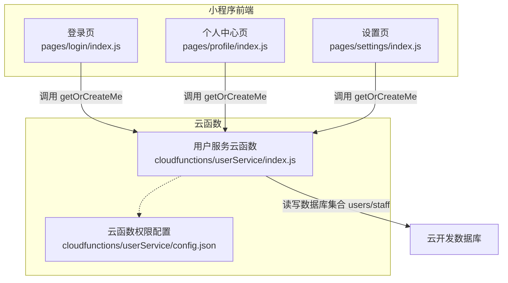
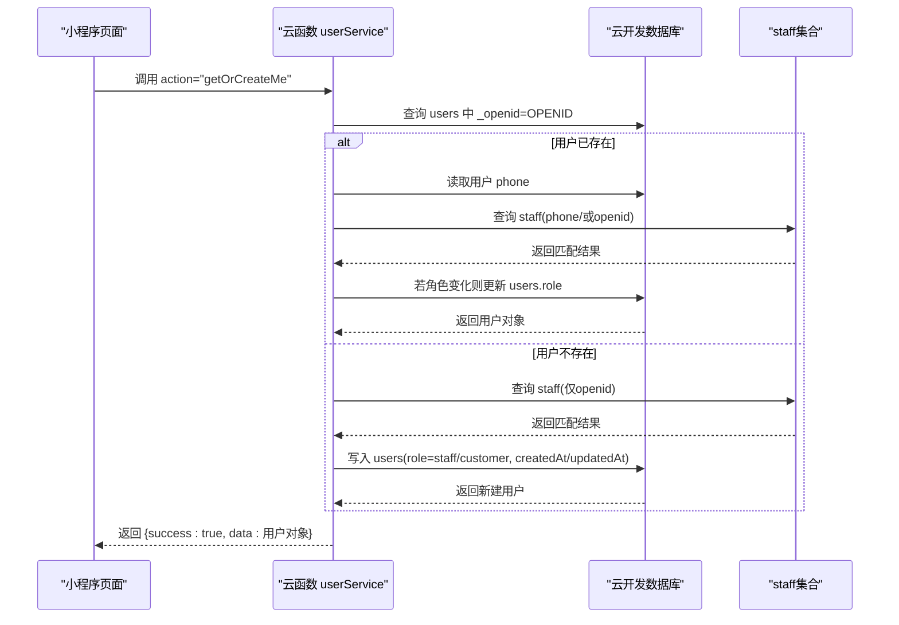
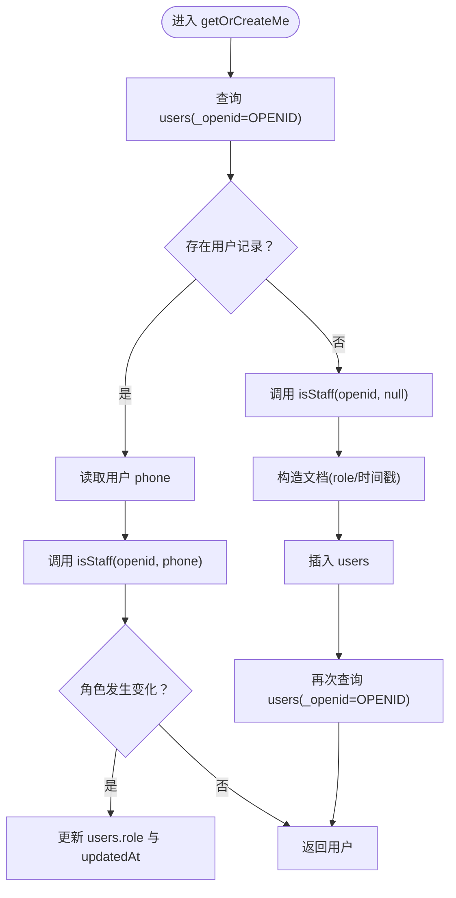
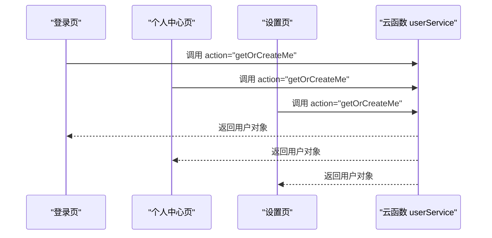
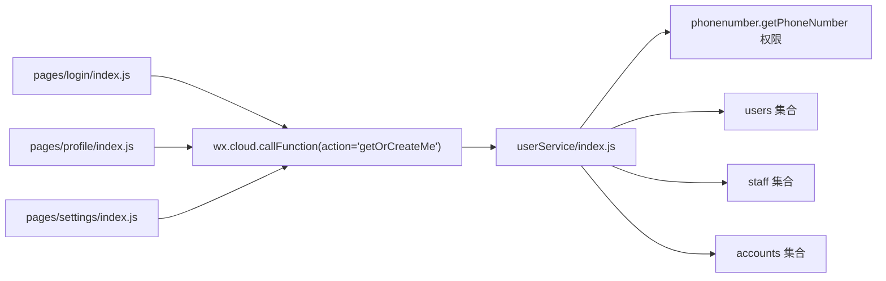

# 获取或创建用户信息 (getOrCreateMe)

<cite>
**本文引用的文件**
- [cloudfunctions/userService/index.js](file://cloudfunctions/userService/index.js)
- [cloudfunctions/userService/config.json](file://cloudfunctions/userService/config.json)
- [miniprogram/pages/login/index.js](file://miniprogram/pages/login/index.js)
- [miniprogram/pages/profile/index.js](file://miniprogram/pages/profile/index.js)
- [miniprogram/pages/settings/index.js](file://miniprogram/pages/settings/index.js)
- [miniprogram/pages/profile/index.wxml](file://miniprogram/pages/profile/index.wxml)
- [miniprogram/pages/settings/index.wxml](file://miniprogram/pages/settings/index.wxml)
</cite>

## 目录
1. [简介](#简介)
2. [项目结构](#项目结构)
3. [核心组件](#核心组件)
4. [架构总览](#架构总览)
5. [详细组件分析](#详细组件分析)
6. [依赖关系分析](#依赖关系分析)
7. [性能考量](#性能考量)
8. [故障排查指南](#故障排查指南)
9. [结论](#结论)
10. [附录](#附录)

## 简介
本文件聚焦于用户服务云函数中的 getOrCreateMe 接口，说明其通过微信上下文 OPENID 自动获取或创建用户信息，并基于 staff 集合中的手机号白名单自动判定用户角色（staff 或 customer）。接口在应用初始化阶段被调用，作为用户身份识别与权限控制的核心入口，广泛被登录页、个人中心等页面依赖。

## 项目结构
- 云函数 userService：提供 getOrCreateMe、updateMe、loginByPhone、账号密码登录/注册等用户相关能力。
- 小程序前端 pages/login、pages/profile、pages/settings：通过 wx.cloud.callFunction 调用 userService，实现用户初始化、资料展示与更新。
- 权限配置：云函数配置中声明 phonenumber.getPhoneNumber 开放接口权限，用于手机号授权解密。

图表来源
- [cloudfunctions/userService/index.js](file://cloudfunctions/userService/index.js#L258-L288)
- [cloudfunctions/userService/config.json](file://cloudfunctions/userService/config.json#L1-L6)
- [miniprogram/pages/login/index.js](file://miniprogram/pages/login/index.js#L70-L85)
- [miniprogram/pages/profile/index.js](file://miniprogram/pages/profile/index.js#L19-L35)
- [miniprogram/pages/settings/index.js](file://miniprogram/pages/settings/index.js#L22-L47)

章节来源
- [cloudfunctions/userService/index.js](file://cloudfunctions/userService/index.js#L1-L288)
- [cloudfunctions/userService/config.json](file://cloudfunctions/userService/config.json#L1-L6)
- [miniprogram/pages/login/index.js](file://miniprogram/pages/login/index.js#L70-L85)
- [miniprogram/pages/profile/index.js](file://miniprogram/pages/profile/index.js#L19-L35)
- [miniprogram/pages/settings/index.js](file://miniprogram/pages/settings/index.js#L22-L47)

## 核心组件
- getOrCreateMe(openid)：根据 OPENID 查找用户，若存在则重新判定角色并按需更新；若不存在则基于 staff 白名单创建用户并返回。
- isStaff(openid, phone)：优先通过 phone 判断是否为 staff，否则回退到 openid 判断。
- updateMe(openid, data)：安全更新用户昵称、头像、手机号等字段，并触发角色同步。
- loginByPhone(openid, code, nickname, avatarUrl)：通过微信手机号授权解密手机号，补充用户信息并返回最新用户。

章节来源
- [cloudfunctions/userService/index.js](file://cloudfunctions/userService/index.js#L26-L47)
- [cloudfunctions/userService/index.js](file://cloudfunctions/userService/index.js#L49-L84)
- [cloudfunctions/userService/index.js](file://cloudfunctions/userService/index.js#L86-L103)
- [cloudfunctions/userService/index.js](file://cloudfunctions/userService/index.js#L105-L161)

## 架构总览
getOrCreateMe 在云函数入口处被调用，内部通过数据库查询用户、判定角色、必要时创建用户并返回完整用户对象。该流程贯穿于小程序初始化与用户资料变更场景。

图表来源
- [cloudfunctions/userService/index.js](file://cloudfunctions/userService/index.js#L26-L47)
- [cloudfunctions/userService/index.js](file://cloudfunctions/userService/index.js#L49-L84)
- [cloudfunctions/userService/index.js](file://cloudfunctions/userService/index.js#L258-L288)

## 详细组件分析

### getOrCreateMe 接口详解
- 调用方式：云函数调用，action="getOrCreateMe"，无需显式传参，自动从微信上下文获取 OPENID。
- 请求参数：无显式参数，内部使用 wxContext.OPENID。
- 响应数据：返回完整用户对象，包含_id、_openid、role、nickname、avatarUrl、phone、createdAt、updatedAt 等字段。
- 核心流程（第49-83行）：
  1) 查询 users 中是否存在 _openid=OPENID 的记录。
  2) 若存在：读取用户 phone，调用 isStaff(openid, user.phone) 判定角色；若角色变化则更新 users.role 并返回用户。
  3) 若不存在：调用 isStaff(openid, null) 判定角色，构造包含 role、createdAt、updatedAt 的文档并插入 users，随后再次查询返回用户。
- 角色判定 isStaff：
  - 优先通过 phone 判断：若用户存在 phone 且 staff 集合中存在相同 phone，则为 staff。
  - 回退到 openid 判断：若 staff 集合中存在 openid，则为 staff。
- 自动更新机制：当用户 phone 变更或首次创建时，会根据 isStaff 结果自动修正 role 字段，保证角色与白名单一致。

图表来源
- [cloudfunctions/userService/index.js](file://cloudfunctions/userService/index.js#L49-L84)
- [cloudfunctions/userService/index.js](file://cloudfunctions/userService/index.js#L26-L47)

章节来源
- [cloudfunctions/userService/index.js](file://cloudfunctions/userService/index.js#L49-L84)
- [cloudfunctions/userService/index.js](file://cloudfunctions/userService/index.js#L26-L47)

### 前端调用与依赖
- 登录页 login：在 onLoad 时调用 getOrCreateMe，用于初始化用户信息并决定是否跳转首页。
- 个人中心 profile：onShow 时调用 getOrCreateMe，用于展示用户昵称、头像、角色等信息。
- 设置页 settings：onLoad/onShow 时调用 getOrCreateMe，用于展示手机号授权入口与用户资料。

图表来源
- [miniprogram/pages/login/index.js](file://miniprogram/pages/login/index.js#L70-L85)
- [miniprogram/pages/profile/index.js](file://miniprogram/pages/profile/index.js#L19-L35)
- [miniprogram/pages/settings/index.js](file://miniprogram/pages/settings/index.js#L22-L47)

章节来源
- [miniprogram/pages/login/index.js](file://miniprogram/pages/login/index.js#L70-L85)
- [miniprogram/pages/profile/index.js](file://miniprogram/pages/profile/index.js#L19-L35)
- [miniprogram/pages/settings/index.js](file://miniprogram/pages/settings/index.js#L22-L47)

### 数据模型与字段说明
- 用户对象字段（示例 JSON 结构，字段名称以实际数据库为准）：
  - _id：用户唯一标识
  - _openid：微信 OPENID
  - role：用户角色（staff 或 customer）
  - nickname：昵称
  - avatarUrl：头像地址
  - phone：手机号（可能为空）
  - createdAt：创建时间
  - updatedAt：更新时间
- 示例响应（示意，不含具体值）：
  {
    "_id": "用户唯一ID",
    "_openid": "微信OPENID",
    "role": "staff 或 customer",
    "nickname": "用户昵称",
    "avatarUrl": "头像URL",
    "phone": "手机号（可空）",
    "createdAt": "创建时间",
    "updatedAt": "更新时间"
  }

章节来源
- [cloudfunctions/userService/index.js](file://cloudfunctions/userService/index.js#L49-L84)

### 错误码与处理策略
- 通用返回结构：
  - 成功：{ success: true, data: 用户对象 }
  - 失败：{ success: false, errMsg: "错误信息" }
- 常见错误场景与处理：
  - unknown action：传入 action 不在支持列表时返回未知动作错误。
  - 数据库集合不存在：云函数启动时会自动创建 users、staff、accounts 集合，避免新环境直接报错。
  - getOrCreateMe 内部逻辑：
    - 当用户存在但角色变化时，会自动更新 role 字段。
    - 当用户不存在时，会基于 isStaff 判定角色并创建用户。
- 前端处理建议：
  - 登录页：若调用失败，提示用户稍后重试或检查网络。
  - 个人中心/设置页：若调用失败，提示加载失败并允许用户重试。

章节来源
- [cloudfunctions/userService/index.js](file://cloudfunctions/userService/index.js#L258-L288)
- [cloudfunctions/userService/index.js](file://cloudfunctions/userService/index.js#L18-L24)

## 依赖关系分析
- 云函数依赖：
  - 微信云开发 SDK：获取 OPENID、调用开放接口、操作数据库。
  - 数据库集合：users、staff、accounts。
  - 开放接口权限：phonenumber.getPhoneNumber（用于手机号授权解密）。
- 前端依赖：
  - wx.cloud.callFunction：调用 userService 云函数。
  - 页面生命周期：onLoad/onShow 时拉取用户信息，确保初始化与刷新一致。
- 角色判定依赖：
  - staff 集合：通过 phone 或 openid 判断是否为员工。

图表来源
- [cloudfunctions/userService/config.json](file://cloudfunctions/userService/config.json#L1-L6)
- [cloudfunctions/userService/index.js](file://cloudfunctions/userService/index.js#L18-L24)
- [cloudfunctions/userService/index.js](file://cloudfunctions/userService/index.js#L258-L288)
- [miniprogram/pages/login/index.js](file://miniprogram/pages/login/index.js#L70-L85)
- [miniprogram/pages/profile/index.js](file://miniprogram/pages/profile/index.js#L19-L35)
- [miniprogram/pages/settings/index.js](file://miniprogram/pages/settings/index.js#L22-L47)

章节来源
- [cloudfunctions/userService/config.json](file://cloudfunctions/userService/config.json#L1-L6)
- [cloudfunctions/userService/index.js](file://cloudfunctions/userService/index.js#L18-L24)
- [cloudfunctions/userService/index.js](file://cloudfunctions/userService/index.js#L258-L288)
- [miniprogram/pages/login/index.js](file://miniprogram/pages/login/index.js#L70-L85)
- [miniprogram/pages/profile/index.js](file://miniprogram/pages/profile/index.js#L19-L35)
- [miniprogram/pages/settings/index.js](file://miniprogram/pages/settings/index.js#L22-L47)

## 性能考量
- 数据库查询：
  - getOrCreateMe 对 users 的查询使用 _openid 索引条件，命中率高。
  - isStaff 仅做单条限制查询，复杂度低。
- 自动更新：
  - 仅在角色变化时才执行更新，避免不必要的写操作。
- 并发与幂等：
  - 云函数入口 ensureCollections 在首次调用时创建集合，避免重复创建开销。
- 建议：
  - 在 staff 集合上为 phone 和 openid 建立索引，提升 isStaff 查询效率。
  - 对频繁调用的页面，可在前端做缓存策略（如本地缓存用户信息并在合适时机刷新）。

章节来源
- [cloudfunctions/userService/index.js](file://cloudfunctions/userService/index.js#L18-L24)
- [cloudfunctions/userService/index.js](file://cloudfunctions/userService/index.js#L26-L47)
- [cloudfunctions/userService/index.js](file://cloudfunctions/userService/index.js#L49-L84)

## 故障排查指南
- 现象：调用 getOrCreateMe 返回 unknown action
  - 原因：传入 action 非支持值
  - 处理：确认调用参数 action 为 "getOrCreateMe"
- 现象：新环境首次调用报集合不存在
  - 原因：数据库集合未初始化
  - 处理：云函数入口会自动创建 users、staff、accounts 集合，重新调用即可
- 现象：角色未正确更新
  - 原因：staff 白名单未配置 phone 或 openid
  - 处理：在 staff 集合中添加对应 phone 或 openid 记录
- 现象：手机号授权解密失败
  - 原因：微信开放接口返回异常或未授权
  - 处理：检查 phonenumber.getPhoneNumber 权限配置与用户授权状态

章节来源
- [cloudfunctions/userService/index.js](file://cloudfunctions/userService/index.js#L258-L288)
- [cloudfunctions/userService/config.json](file://cloudfunctions/userService/config.json#L1-L6)

## 结论
getOrCreateMe 是用户系统的基石接口，通过 OPENID 自动识别用户身份，结合 staff 白名单实现角色判定与动态更新。其在小程序初始化与资料变更场景中被广泛使用，保障了用户身份的一致性与权限控制的有效性。建议在生产环境中完善 staff 白名单维护流程与数据库索引，持续优化查询与更新性能。

## 附录
- 前端页面对 getOrCreateMe 的调用位置：
  - 登录页：[miniprogram/pages/login/index.js](file://miniprogram/pages/login/index.js#L70-L85)
  - 个人中心：[miniprogram/pages/profile/index.js](file://miniprogram/pages/profile/index.js#L19-L35)
  - 设置页：[miniprogram/pages/settings/index.js](file://miniprogram/pages/settings/index.js#L22-L47)
- 前端页面模板中对用户信息的展示：
  - 个人中心模板：[miniprogram/pages/profile/index.wxml](file://miniprogram/pages/profile/index.wxml#L1-L44)
  - 设置模板（手机号授权入口）：[miniprogram/pages/settings/index.wxml](file://miniprogram/pages/settings/index.wxml#L1-L44)