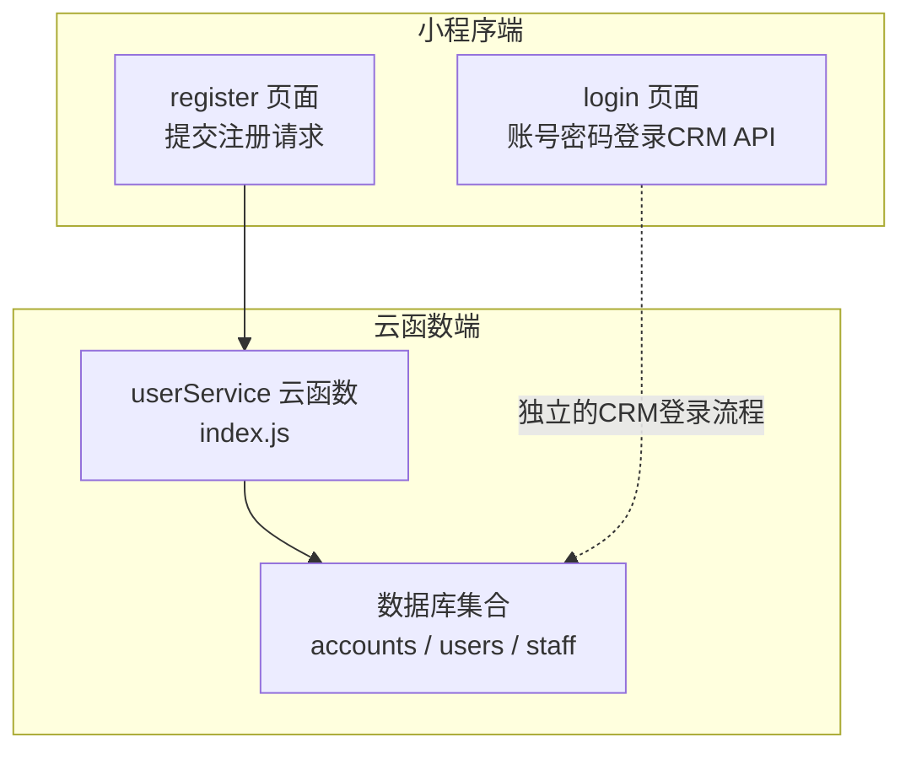
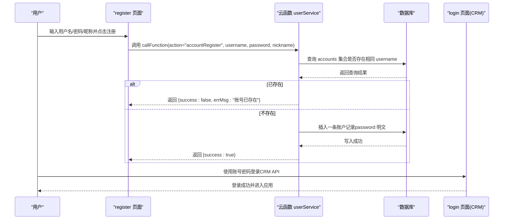
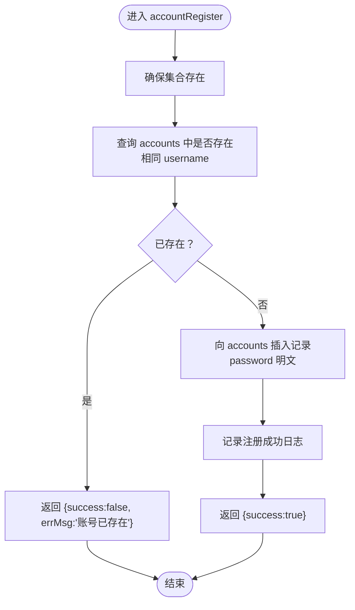
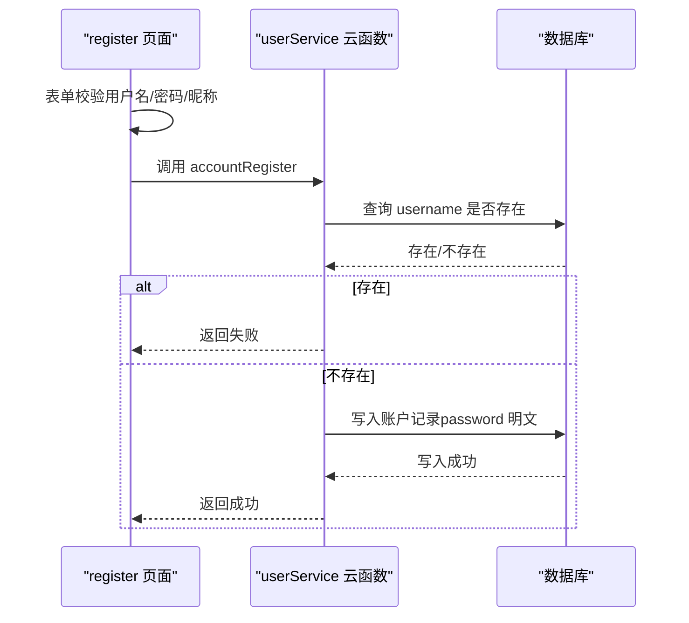
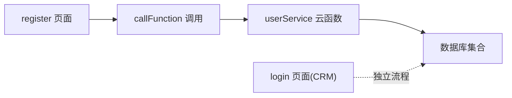

# 账号密码注册 (accountRegister)

<cite>
**本文引用的文件**
- [cloudfunctions/userService/index.js](file://cloudfunctions/userService/index.js)
- [miniprogram/pages/register/index.js](file://miniprogram/pages/register/index.js)
- [miniprogram/pages/login/index.js](file://miniprogram/pages/login/index.js)
- [cloudfunctions/userService/config.json](file://cloudfunctions/userService/config.json)
</cite>

## 目录
1. [简介](#简介)
2. [项目结构](#项目结构)
3. [核心组件](#核心组件)
4. [架构总览](#架构总览)
5. [详细组件分析](#详细组件分析)
6. [依赖关系分析](#依赖关系分析)
7. [性能考量](#性能考量)
8. [故障排查指南](#故障排查指南)
9. [结论](#结论)
10. [附录](#附录)

## 简介
本文件针对安得褓贝用户服务云函数中的 accountRegister 接口进行深入文档化，重点说明其账号密码注册能力：接收 username、password 和 nickname 参数；业务流程为“检查账号唯一性→创建 accounts 集合记录→返回注册结果”。同时明确指出当前实现中密码以明文存储的问题（代码第183行），并给出生产环境改用 bcrypt 等加密算法的升级建议。结合第164-195行实现细节，分析数据库查询、数据插入与错误处理机制，并提供请求示例与响应格式说明。最后阐述该接口与前端 register 页面的联动关系，以及注册成功后的典型业务流程（通常会引导用户使用账号密码登录）。

## 项目结构
- 云函数 userService 提供多种用户相关能力，其中包含 accountRegister 与 accountLogin 等账号密码相关接口。
- 小程序端 register 页面负责收集用户输入并调用云函数 userService 的 accountRegister 接口。
- 小程序端 login 页面提供账号密码登录入口，但该登录流程使用的是“安得家政”CRM 后端 API（非本云函数），二者属于不同体系。

图表来源
- [cloudfunctions/userService/index.js](file://cloudfunctions/userService/index.js#L163-L196)
- [miniprogram/pages/register/index.js](file://miniprogram/pages/register/index.js#L56-L90)
- [miniprogram/pages/login/index.js](file://miniprogram/pages/login/index.js#L195-L277)

章节来源
- [cloudfunctions/userService/index.js](file://cloudfunctions/userService/index.js#L163-L196)
- [miniprogram/pages/register/index.js](file://miniprogram/pages/register/index.js#L56-L90)

## 核心组件
- 云函数 userService 的 accountRegister 接口：负责账号密码注册的核心逻辑，包括账号唯一性检查、向 accounts 集合写入用户凭证与昵称、返回统一的成功/失败结果。
- 小程序 register 页面：负责表单校验与调用云函数，展示注册结果提示。
- 数据库集合：
  - accounts：存储 username/password/nickname/openid/createdAt 等字段。
  - users：存储用户基础信息（昵称、头像、角色等），注册后登录流程会在此集合中维护用户状态。
  - staff：用于员工白名单判定（与注册流程无直接关系）。

章节来源
- [cloudfunctions/userService/index.js](file://cloudfunctions/userService/index.js#L163-L196)
- [cloudfunctions/userService/index.js](file://cloudfunctions/userService/index.js#L1-L24)
- [cloudfunctions/userService/index.js](file://cloudfunctions/userService/index.js#L258-L289)

## 架构总览
下图展示了从 register 页面到云函数 userService 的调用链路，以及注册成功后通常会触发的登录流程（账号密码登录采用“安得家政”CRM API，与本云函数无关）。

图表来源
- [miniprogram/pages/register/index.js](file://miniprogram/pages/register/index.js#L56-L90)
- [cloudfunctions/userService/index.js](file://cloudfunctions/userService/index.js#L163-L196)
- [miniprogram/pages/login/index.js](file://miniprogram/pages/login/index.js#L195-L277)

## 详细组件分析

### 接口定义与参数
- 接口名称：accountRegister
- 作用：账号密码注册
- 参数：
  - username：字符串，账号名
  - password：字符串，密码（当前实现为明文）
  - nickname：字符串，昵称
- 返回值：
  - 成功：{ success: true }
  - 失败：{ success: false, errMsg: string }

章节来源
- [cloudfunctions/userService/index.js](file://cloudfunctions/userService/index.js#L163-L196)

### 业务流程与实现要点（第164-195行）
- 初始化与集合准备
  - 首次运行会自动确保 users、staff、accounts 集合存在（若不存在则创建）。
- 账号唯一性检查
  - 在 accounts 集合按 username 查询，若存在即拒绝注册。
- 账户创建
  - 向 accounts 集合写入 username、password、nickname、openid、createdAt。
  - 当前实现将 password 以明文形式存储（第183行注释明确提示应使用 bcrypt 等加密）。
- 结果返回
  - 成功：返回 { success: true }
  - 异常：捕获错误并返回 { success: false, errMsg: "...错误信息..." }

图表来源
- [cloudfunctions/userService/index.js](file://cloudfunctions/userService/index.js#L163-L196)

章节来源
- [cloudfunctions/userService/index.js](file://cloudfunctions/userService/index.js#L163-L196)

### 前端集成与交互
- register 页面
  - 对用户名、密码、确认密码、昵称进行前端校验。
  - 调用云函数 userService 的 accountRegister 接口，传入清洗后的 username、password、nickname。
  - 根据返回结果展示成功/失败提示，并在成功时返回上一页。
- login 页面
  - 提供账号密码登录入口，但该登录流程使用“安得家政”CRM 后端 API，与本云函数的 accountRegister 无直接耦合。
  - 注册成功后，用户通常会跳转至 login 页面并通过 CRM 登录流程完成后续操作。

图表来源
- [miniprogram/pages/register/index.js](file://miniprogram/pages/register/index.js#L25-L90)
- [cloudfunctions/userService/index.js](file://cloudfunctions/userService/index.js#L163-L196)

章节来源
- [miniprogram/pages/register/index.js](file://miniprogram/pages/register/index.js#L25-L90)
- [miniprogram/pages/login/index.js](file://miniprogram/pages/login/index.js#L195-L277)

### 安全注意事项
- 密码明文存储风险
  - 当前实现将 password 以明文形式写入数据库（第183行注释明确提示应使用 bcrypt 等加密）。
  - 生产环境务必使用强哈希算法（如 bcrypt、scrypt、argon2）对密码进行加密存储，并在登录时进行比对。
- 账号唯一性约束
  - 代码层面通过查询 accounts 集合 username 字段实现唯一性检查。
  - 建议在数据库层增加唯一索引以进一步保障一致性与性能。
- 前端传输安全
  - 建议在小程序端启用 HTTPS 与可信域名校验，避免中间人攻击。
- 错误处理
  - 云函数对异常进行了捕获并返回统一的错误消息，前端应根据 errMsg 进行友好提示。

章节来源
- [cloudfunctions/userService/index.js](file://cloudfunctions/userService/index.js#L163-L196)

## 依赖关系分析
- 云函数 userService 依赖微信云开发 SDK 与数据库命令。
- register 页面依赖 wx.cloud.callFunction 调用云函数。
- login 页面使用“安得家政”CRM 后端 API（与本云函数无关）。

图表来源
- [miniprogram/pages/register/index.js](file://miniprogram/pages/register/index.js#L56-L90)
- [cloudfunctions/userService/index.js](file://cloudfunctions/userService/index.js#L258-L289)
- [miniprogram/pages/login/index.js](file://miniprogram/pages/login/index.js#L195-L277)

章节来源
- [cloudfunctions/userService/index.js](file://cloudfunctions/userService/index.js#L258-L289)
- [cloudfunctions/userService/config.json](file://cloudfunctions/userService/config.json#L1-L6)

## 性能考量
- 查询性能
  - accounts 集合按 username 查询应建立唯一索引，以降低重复检查成本并提升并发下的稳定性。
- 写入性能
  - 单条插入 accounts 记录为 O(1)，但需注意数据库写入延迟与事务一致性。
- 并发控制
  - 在高并发场景下，建议在数据库层增加唯一索引并在应用层做幂等处理，避免重复注册。
- 日志与监控
  - 建议在关键路径添加日志埋点与错误上报，便于定位性能瓶颈与异常。

## 故障排查指南
- 常见错误与处理
  - 账号已存在：返回 { success: false, errMsg: "账号已存在" }。前端应提示用户更换账号名。
  - 注册失败：返回 { success: false, errMsg: "注册失败：..." }。前端可展示具体错误信息。
  - 数据库异常：云函数捕获异常并返回错误信息，前端应提示用户重试或检查网络。
- 建议排查步骤
  - 确认数据库集合 accounts 是否存在且具备唯一索引。
  - 检查网络与域名配置，确保云函数调用正常。
  - 核对前端传参是否符合要求（username、password、nickname）。
  - 如遇登录异常，确认是否使用了正确的登录流程（本云函数的 accountRegister 与 login 页面的 CRM 登录流程不同）。

章节来源
- [cloudfunctions/userService/index.js](file://cloudfunctions/userService/index.js#L163-L196)
- [miniprogram/pages/register/index.js](file://miniprogram/pages/register/index.js#L56-L90)

## 结论
accountRegister 接口实现了基于账号密码的用户注册能力，流程清晰、易于扩展。当前实现的关键风险在于密码明文存储，强烈建议在生产环境中引入强哈希算法（如 bcrypt）进行加密。同时，建议在数据库层增加唯一索引以强化账号唯一性约束与查询性能。前端侧应完善错误提示与用户体验，并在注册成功后引导用户通过合适的登录流程完成后续操作。

## 附录

### 请求示例
- 动作：accountRegister
- 参数：
  - username：用户输入的账号名
  - password：用户输入的密码
  - nickname：用户输入的昵称
- 示例请求体（路径参考）：
  - [miniprogram/pages/register/index.js](file://miniprogram/pages/register/index.js#L56-L66)

### 响应格式
- 成功：{ success: true }
- 失败：{ success: false, errMsg: string }

章节来源
- [cloudfunctions/userService/index.js](file://cloudfunctions/userService/index.js#L163-L196)

### 与前端 register 页面的关联
- register 页面负责收集并校验用户输入，随后调用云函数 userService 的 accountRegister 接口。
- 注册成功后，页面会提示用户返回登录页面使用账号密码登录（CRM 流程）。

章节来源
- [miniprogram/pages/register/index.js](file://miniprogram/pages/register/index.js#L56-L90)
- [miniprogram/pages/login/index.js](file://miniprogram/pages/login/index.js#L195-L277)