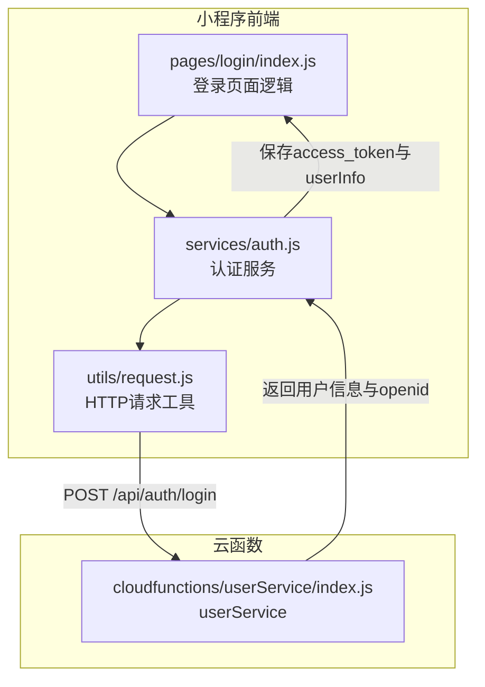
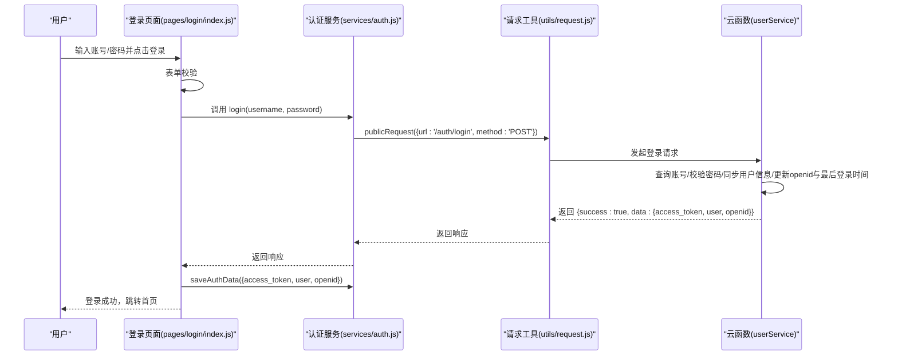
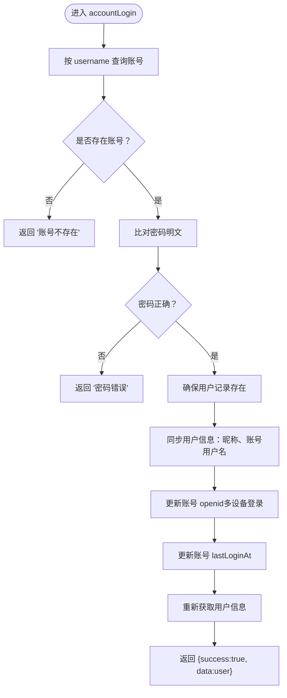
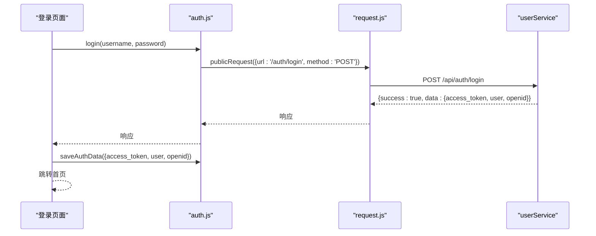
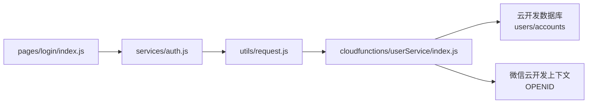

# 账号密码登录 (accountLogin)

<cite>
**本文引用的文件**
- [cloudfunctions/userService/index.js](file://cloudfunctions/userService/index.js)
- [miniprogram/services/auth.js](file://miniprogram/services/auth.js)
- [miniprogram/pages/login/index.js](file://miniprogram/pages/login/index.js)
- [miniprogram/utils/request.js](file://miniprogram/utils/request.js)
- [API完整文档.md](file://API完整文档.md)
- [账号密码登录-使用说明.md](file://docs/账号密码登录-使用说明.md)
- [账号密码登录测试说明.md](file://docs/账号密码登录测试说明.md)
</cite>

## 目录
1. [简介](#简介)
2. [项目结构](#项目结构)
3. [核心组件](#核心组件)
4. [架构总览](#架构总览)
5. [详细组件分析](#详细组件分析)
6. [依赖分析](#依赖分析)
7. [性能考虑](#性能考虑)
8. [故障排查指南](#故障排查指南)
9. [结论](#结论)
10. [附录](#附录)

## 简介
本文件聚焦“安得褓贝”用户服务中的账号密码登录接口（accountLogin），系统性梳理其认证流程、数据流、与前端协作关系及错误处理策略。重点覆盖：
- 登录流程：查询账号→校验密码（明文比对）→同步用户信息（昵称等）→更新账号最后登录时间→返回用户数据
- 多设备登录支持：通过更新账号记录中的 openid 字段，使同一账号可在不同设备登录
- 前端协同：auth.js 的 login 方法与云函数 userService 的 accountLogin 对接；登录成功后通过 saveAuthData 存储 token 与用户信息
- 错误码与响应示例：账号不存在、密码错误等典型场景
- 与微信登录的互补关系：账号密码登录作为传统登录方式，与微信手机号登录并行

## 项目结构
围绕账号密码登录的关键文件分布如下：
- 云函数 userService：实现 accountLogin、getOrCreateMe、updateMe、loginByPhone 等能力
- 小程序前端 services/auth.js：封装登录、Token 管理、本地存储等
- 小程序页面 pages/login/index.js：登录页面逻辑，调用 auth.js 并处理登录结果
- 工具 request.js：封装公开请求与带 Token 请求
- 文档：API完整文档、账号密码登录使用说明、测试说明

图表来源
- [miniprogram/pages/login/index.js](file://miniprogram/pages/login/index.js#L195-L277)
- [miniprogram/services/auth.js](file://miniprogram/services/auth.js#L14-L22)
- [miniprogram/utils/request.js](file://miniprogram/utils/request.js#L6-L23)
- [cloudfunctions/userService/index.js](file://cloudfunctions/userService/index.js#L258-L289)

章节来源
- [miniprogram/pages/login/index.js](file://miniprogram/pages/login/index.js#L1-L294)
- [miniprogram/services/auth.js](file://miniprogram/services/auth.js#L1-L163)
- [miniprogram/utils/request.js](file://miniprogram/utils/request.js#L1-L125)
- [cloudfunctions/userService/index.js](file://cloudfunctions/userService/index.js#L1-L289)

## 核心组件
- 云函数 userService.accountLogin：实现账号密码登录的核心逻辑，包含账号查询、密码校验、用户信息同步、多设备登录支持与最后登录时间更新
- 小程序 auth.js.login：封装向 CRM 后端发起登录请求的方法，供页面调用
- 小程序 auth.js.saveAuthData：登录成功后将 access_token 与用户信息持久化到本地存储
- 小程序 pages/login/index.onAccountLogin：登录页面入口，负责表单校验、调用 auth.js.login、处理响应并跳转
- utils/request.js：封装公开请求（无需 Token）与认证请求（含 Bearer Token）

章节来源
- [cloudfunctions/userService/index.js](file://cloudfunctions/userService/index.js#L199-L256)
- [miniprogram/services/auth.js](file://miniprogram/services/auth.js#L14-L22)
- [miniprogram/services/auth.js](file://miniprogram/services/auth.js#L69-L95)
- [miniprogram/pages/login/index.js](file://miniprogram/pages/login/index.js#L195-L277)
- [miniprogram/utils/request.js](file://miniprogram/utils/request.js#L12-L41)

## 架构总览
账号密码登录的整体调用链路如下：

图表来源
- [miniprogram/pages/login/index.js](file://miniprogram/pages/login/index.js#L195-L277)
- [miniprogram/services/auth.js](file://miniprogram/services/auth.js#L14-L22)
- [miniprogram/utils/request.js](file://miniprogram/utils/request.js#L12-L23)
- [cloudfunctions/userService/index.js](file://cloudfunctions/userService/index.js#L258-L289)

## 详细组件分析

### 云函数 userService.accountLogin（核心逻辑）
- 输入参数：openid、username、password
- 主要步骤：
  1) 查询账号记录（按 username）
  2) 若不存在，返回“账号不存在”
  3) 比对密码（当前为明文比对）
  4) 若密码错误，返回“密码错误”
  5) 确保用户记录存在（getOrCreateMe）
  6) 同步用户信息：将账号昵称、账号用户名写入 users 记录
  7) 更新账号 openid（支持多设备登录）与 lastLoginAt
  8) 重新获取用户信息并返回
- 返回值：success 与 data（包含用户对象），或 success 与 errMsg（错误信息）

图表来源
- [cloudfunctions/userService/index.js](file://cloudfunctions/userService/index.js#L199-L256)

章节来源
- [cloudfunctions/userService/index.js](file://cloudfunctions/userService/index.js#L199-L256)

### 前端 auth.js.login 与页面 onAccountLogin 协作
- auth.js.login：封装向 CRM 后端发起登录请求（POST /api/auth/login），返回响应
- pages/login/index.onAccountLogin：
  - 表单校验（账号/密码非空）
  - 调用 auth.js.login(username, password)
  - 解析响应，提取 access_token、user、openid
  - 调用 auth.js.saveAuthData 持久化
  - 成功后跳转首页

图表来源
- [miniprogram/pages/login/index.js](file://miniprogram/pages/login/index.js#L195-L277)
- [miniprogram/services/auth.js](file://miniprogram/services/auth.js#L14-L22)
- [miniprogram/utils/request.js](file://miniprogram/utils/request.js#L12-L23)
- [cloudfunctions/userService/index.js](file://cloudfunctions/userService/index.js#L258-L289)

章节来源
- [miniprogram/pages/login/index.js](file://miniprogram/pages/login/index.js#L195-L277)
- [miniprogram/services/auth.js](file://miniprogram/services/auth.js#L14-L22)
- [miniprogram/utils/request.js](file://miniprogram/utils/request.js#L12-L23)

### 多设备登录支持（更新 openid）
- 云函数在登录成功后，会将当前 openid 写入 accounts 记录，从而允许同一账号在不同设备登录
- 该设计与“微信手机号登录”形成互补：前者基于账号密码，后者基于微信手机号授权

章节来源
- [cloudfunctions/userService/index.js](file://cloudfunctions/userService/index.js#L236-L245)
- [账号密码登录测试说明.md](file://docs/账号密码登录测试说明.md#L104-L110)

### 前端 Token 管理与本地存储
- 登录成功后，auth.js.saveAuthData 将 access_token 与用户信息分别以“access_token”、“token”、“userInfo”、“user_info”等键存储，便于跨页面兼容
- 页面通过 getLocalToken、getLocalUserInfo、isLoggedIn 等方法进行状态判断与后续请求

章节来源
- [miniprogram/services/auth.js](file://miniprogram/services/auth.js#L69-L95)
- [miniprogram/services/auth.js](file://miniprogram/services/auth.js#L110-L131)

## 依赖分析
- 云函数 userService 依赖：
  - 数据库：users、accounts 集合
  - 微信云开发上下文：OPENID
- 前端依赖：
  - request.js：封装公开请求与认证请求
  - auth.js：封装登录、Token 管理、本地存储
  - pages/login/index：页面逻辑与交互

图表来源
- [miniprogram/pages/login/index.js](file://miniprogram/pages/login/index.js#L195-L277)
- [miniprogram/services/auth.js](file://miniprogram/services/auth.js#L14-L22)
- [miniprogram/utils/request.js](file://miniprogram/utils/request.js#L12-L23)
- [cloudfunctions/userService/index.js](file://cloudfunctions/userService/index.js#L258-L289)

章节来源
- [miniprogram/pages/login/index.js](file://miniprogram/pages/login/index.js#L1-L294)
- [miniprogram/services/auth.js](file://miniprogram/services/auth.js#L1-L163)
- [miniprogram/utils/request.js](file://miniprogram/utils/request.js#L1-L125)
- [cloudfunctions/userService/index.js](file://cloudfunctions/userService/index.js#L1-L289)

## 性能考虑
- 数据库查询：accountLogin 仅按 username 查询一次，复杂度 O(1)（假设 username 上有索引）
- 密码比对：当前为明文比对，性能高但安全性低，建议迁移到加密比对（如 bcrypt）
- 多设备登录：每次登录都会更新 openid 与 lastLoginAt，属于轻量级写操作
- 前端存储：本地存储为同步操作，影响极小

## 故障排查指南
- 常见错误与定位
  - “账号不存在”：检查 username 是否正确，确认 accounts 集合中是否存在该账号
  - “密码错误”：确认密码输入是否正确，注意大小写与空格
  - “网络请求失败”：检查域名配置、开发者工具“不校验合法域名”设置
  - “Token 已过期”：前端 request.js 会拦截 401 并清除本地存储，需重新登录
- 前端日志与断点
  - 登录页面 onAccountLogin：打印响应、token 提取、保存与跳转
  - auth.js.login：打印请求 URL 与方法
  - request.js：打印响应状态码与错误信息
- 云函数日志
  - accountLogin：打印参数、查询结果、比对结果、更新动作与最终返回

章节来源
- [miniprogram/pages/login/index.js](file://miniprogram/pages/login/index.js#L211-L277)
- [miniprogram/services/auth.js](file://miniprogram/services/auth.js#L14-L22)
- [miniprogram/utils/request.js](file://miniprogram/utils/request.js#L68-L103)
- [cloudfunctions/userService/index.js](file://cloudfunctions/userService/index.js#L199-L256)

## 结论
accountLogin 接口以简洁的流程实现了账号密码认证：查询账号→明文比对密码→同步用户信息→更新 openid 与最后登录时间→返回用户数据。其与前端 auth.js 的 login/saveAuthData 协同良好，配合 request.js 的 Token 管理，构成完整的登录闭环。当前实现以易用性为主，建议尽快引入密码加密与更完善的错误码体系，以提升安全性与可观测性。

## 附录

### 请求与响应示例（来自文档）
- 登录请求
  - 方法：POST
  - URL：/api/auth/login
  - 请求体：包含 username、password
- 成功响应
  - data 包含 access_token、user、openid
- Token 验证
  - GET /api/auth/me
  - 需携带 Authorization: Bearer {token}

章节来源
- [API完整文档.md](file://API完整文档.md#L94-L131)
- [API完整文档.md](file://API完整文档.md#L158-L179)
- [账号密码登录-使用说明.md](file://docs/账号密码登录-使用说明.md#L85-L119)

### 错误码与典型场景
- 账号不存在：返回“账号不存在”
- 密码错误：返回“密码错误”
- 网络异常：前端 request.js 捕获并提示
- Token 过期：request.js 拦截 401，清除本地存储并跳转登录页

章节来源
- [cloudfunctions/userService/index.js](file://cloudfunctions/userService/index.js#L210-L219)
- [miniprogram/utils/request.js](file://miniprogram/utils/request.js#L68-L103)
- [账号密码登录测试说明.md](file://docs/账号密码登录测试说明.md#L69-L74)

### 与微信登录的关系
- 账号密码登录：传统登录方式，适合已有账号体系的用户
- 微信手机号登录：一键授权，适合快速体验
- 两者并行：满足不同用户偏好与场景需求

章节来源
- [账号密码登录-使用说明.md](file://docs/账号密码登录-使用说明.md#L231-L241)
- [账号密码登录测试说明.md](file://docs/账号密码登录测试说明.md#L104-L110)