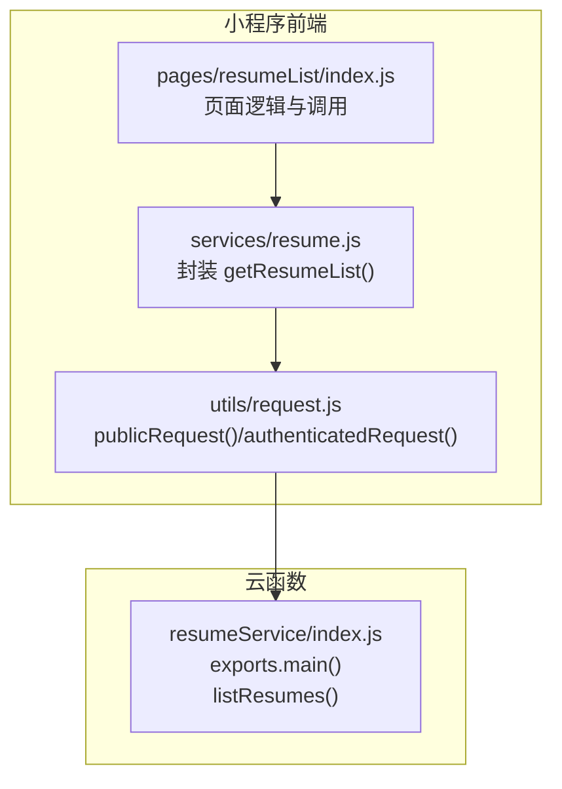
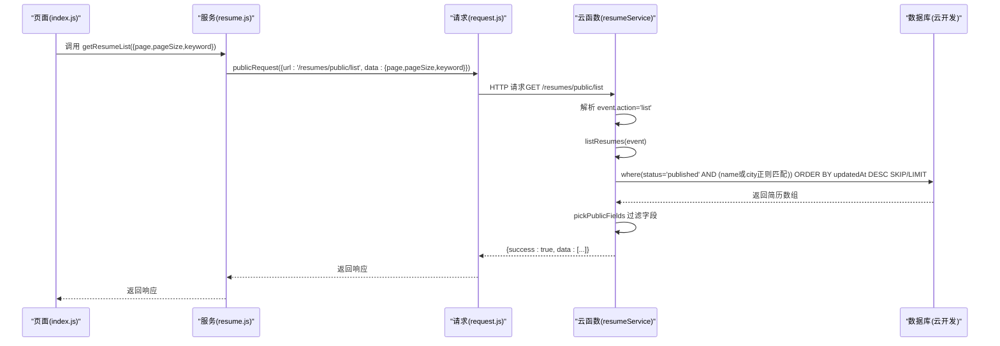
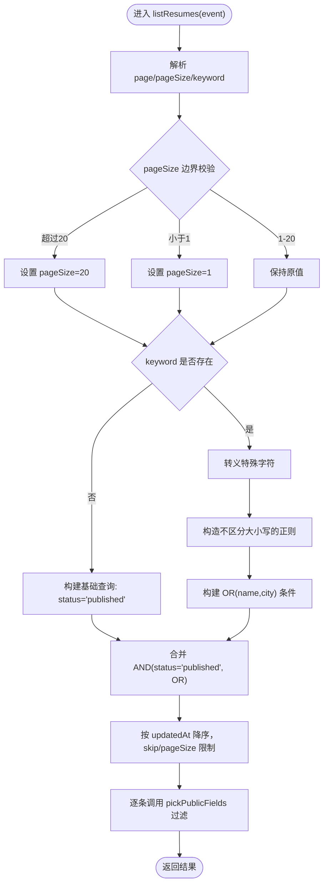
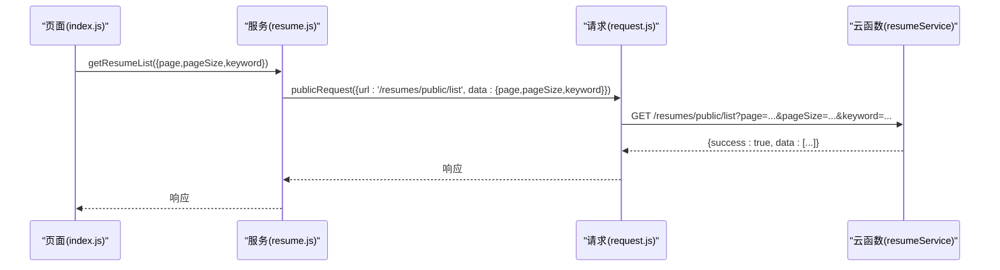

# 简历列表查询接口

<cite>
**本文引用的文件**
- [cloudfunctions/resumeService/index.js](file://cloudfunctions/resumeService/index.js)
- [miniprogram/services/resume.js](file://miniprogram/services/resume.js)
- [miniprogram/utils/request.js](file://miniprogram/utils/request.js)
- [miniprogram/pages/resumeList/index.js](file://miniprogram/pages/resumeList/index.js)
- [API完整文档.md](file://API完整文档.md)
- [PRD.md](file://PRD.md)
</cite>

## 目录
1. [简介](#简介)
2. [项目结构](#项目结构)
3. [核心组件](#核心组件)
4. [架构总览](#架构总览)
5. [详细组件分析](#详细组件分析)
6. [依赖关系分析](#依赖关系分析)
7. [性能考量](#性能考量)
8. [故障排查指南](#故障排查指南)
9. [结论](#结论)
10. [附录](#附录)

## 简介
本文件聚焦于“简历列表查询接口”的详细说明，目标是帮助开发者准确理解该接口的行为与约束，包括：
- 返回所有状态为 published 的公开简历
- 支持分页（page、pageSize 参数）
- 支持关键词搜索（姓名/城市模糊匹配）
- 按更新时间倒序排列
- 请求参数默认值与边界处理（pageSize 最大 20）
- 关键词搜索采用正则表达式实现不区分大小写的匹配机制
- 响应数据结构说明，强调所有返回字段均经过 pickPublicFields 函数过滤，仅包含公开信息
- 结合 miniprogram/services/resume.js 中的 getResumeList 方法，展示前端如何通过 publicRequest 调用此云函数
- 纠正 API 完整文档.md 中对“通过 HTTP RESTful 路径传递参数”的错误描述，明确该接口通过云函数 event 参数传递

## 项目结构
围绕简历列表查询接口，涉及以下关键文件：
- 云函数入口与实现：cloudfunctions/resumeService/index.js
- 前端服务封装：miniprogram/services/resume.js
- 前端请求封装：miniprogram/utils/request.js
- 前端页面调用：miniprogram/pages/resumeList/index.js
- 文档与规范：API完整文档.md、PRD.md

图表来源
- [miniprogram/pages/resumeList/index.js](file://miniprogram/pages/resumeList/index.js#L330-L380)
- [miniprogram/services/resume.js](file://miniprogram/services/resume.js#L16-L45)
- [miniprogram/utils/request.js](file://miniprogram/utils/request.js#L12-L41)
- [cloudfunctions/resumeService/index.js](file://cloudfunctions/resumeService/index.js#L180-L216)

章节来源
- [miniprogram/pages/resumeList/index.js](file://miniprogram/pages/resumeList/index.js#L330-L380)
- [miniprogram/services/resume.js](file://miniprogram/services/resume.js#L16-L45)
- [miniprogram/utils/request.js](file://miniprogram/utils/request.js#L12-L41)
- [cloudfunctions/resumeService/index.js](file://cloudfunctions/resumeService/index.js#L180-L216)

## 核心组件
- 云函数入口 exports.main(event, context)
  - 根据 event.action 分发至 listResumes、getDetail、listForManage、upsertResume、removeResume 等处理函数
- listResumes(event)
  - 解析 page/pageSize/keyword
  - 构造查询条件 status=published
  - 若 keyword 存在，使用正则表达式进行不区分大小写的姓名/城市模糊匹配
  - 按 updatedAt 降序排序，分页 skip/pageSize
  - 对每条记录调用 pickPublicFields 过滤公开字段
- pickPublicFields(doc)
  - 仅返回公开字段集合，确保隐私信息不泄露
- 前端 getResumeList(params)
  - 通过 publicRequest 发起 GET 请求，URL 为 /resumes/public/list
  - 参数 page/pageSize/keyword 作为查询参数随请求发送
- 前端 request 封装
  - publicRequest：无需 Token 的公开请求
  - authenticatedRequest：需要 Token 的认证请求

章节来源
- [cloudfunctions/resumeService/index.js](file://cloudfunctions/resumeService/index.js#L58-L106)
- [cloudfunctions/resumeService/index.js](file://cloudfunctions/resumeService/index.js#L180-L216)
- [miniprogram/services/resume.js](file://miniprogram/services/resume.js#L16-L45)
- [miniprogram/utils/request.js](file://miniprogram/utils/request.js#L12-L41)

## 架构总览
简历列表查询的端到端流程如下：

图表来源
- [miniprogram/pages/resumeList/index.js](file://miniprogram/pages/resumeList/index.js#L330-L380)
- [miniprogram/services/resume.js](file://miniprogram/services/resume.js#L16-L45)
- [miniprogram/utils/request.js](file://miniprogram/utils/request.js#L12-L41)
- [cloudfunctions/resumeService/index.js](file://cloudfunctions/resumeService/index.js#L78-L106)
- [cloudfunctions/resumeService/index.js](file://cloudfunctions/resumeService/index.js#L180-L216)

## 详细组件分析

### 云函数 listResumes(event) 行为
- 参数解析与边界处理
  - page：默认 0，最小 0
  - pageSize：默认 10，最小 1，最大 20
  - keyword：去除前后空白，为空则不启用关键词过滤
- 查询构建
  - status 固定为 published
  - 若 keyword 存在：对关键字进行正则转义，构造不区分大小写的正则表达式，匹配 name 或 city
- 排序与分页
  - orderBy("updatedAt","desc")
  - skip(page * pageSize)
  - limit(pageSize)
- 数据过滤
  - 对每条记录调用 pickPublicFields，仅返回公开字段

图表来源
- [cloudfunctions/resumeService/index.js](file://cloudfunctions/resumeService/index.js#L78-L106)

章节来源
- [cloudfunctions/resumeService/index.js](file://cloudfunctions/resumeService/index.js#L78-L106)

### 前端 getResumeList(params) 调用链
- 参数构建
  - page 默认 1（小程序侧默认 20）
  - pageSize 默认 20（小程序侧默认 20）
  - keyword 仅在非空时加入查询参数
- 请求方式
  - 使用 publicRequest 发起 GET 请求，URL 为 /resumes/public/list
- 页面集成
  - 页面在 onReachBottom() 与 reload() 中调用 getResumeList，实现分页加载与关键词搜索

图表来源
- [miniprogram/services/resume.js](file://miniprogram/services/resume.js#L16-L45)
- [miniprogram/utils/request.js](file://miniprogram/utils/request.js#L12-L41)
- [miniprogram/pages/resumeList/index.js](file://miniprogram/pages/resumeList/index.js#L330-L380)

章节来源
- [miniprogram/services/resume.js](file://miniprogram/services/resume.js#L16-L45)
- [miniprogram/utils/request.js](file://miniprogram/utils/request.js#L12-L41)
- [miniprogram/pages/resumeList/index.js](file://miniprogram/pages/resumeList/index.js#L330-L380)

### pickPublicFields 字段过滤
- 作用：确保对外暴露的简历数据仅包含公开字段，避免泄露隐私信息
- 返回字段（依据实现）：_id、name、age、city、experienceYears、priceMonth、tags、intro、coverFileId、photos、videoFileId、status、updatedAt、createdAt
- 影响：无论数据库中简历对象包含多少字段，最终对外仅返回上述公开字段

章节来源
- [cloudfunctions/resumeService/index.js](file://cloudfunctions/resumeService/index.js#L58-L76)

### 关键词搜索正则机制
- 正则构造
  - 对输入关键字进行特殊字符转义，防止正则注入
  - 使用不区分大小写的选项进行匹配
- 匹配范围
  - 仅匹配 name 与 city 字段
- 云开发限制
  - 由于云开发查询不支持 $or，实现中通过 AND 与 OR 组合的方式达到相同效果

章节来源
- [cloudfunctions/resumeService/index.js](file://cloudfunctions/resumeService/index.js#L88-L95)

### 响应数据结构说明
- 响应体结构
  - success: true/false
  - data: 简历数组（每条记录均为公开字段）
- 字段说明（公开字段）
  - _id: 简历标识
  - name: 姓名
  - age: 年龄
  - city: 城市
  - experienceYears: 工作年限
  - priceMonth: 月薪期望
  - tags: 技能标签
  - intro: 自我介绍
  - coverFileId: 封面文件ID
  - photos: 照片文件ID数组
  - videoFileId: 视频文件ID
  - status: 状态（published）
  - updatedAt/createdAt: 更新与创建时间

章节来源
- [cloudfunctions/resumeService/index.js](file://cloudfunctions/resumeService/index.js#L58-L76)

### 请求参数默认值与边界处理
- page
  - 默认 1（小程序侧默认 20）
  - 云函数内部解析为从 0 开始的偏移（skip = page * pageSize）
- pageSize
  - 默认 10（云函数）
  - 默认 20（小程序侧）
  - 上限 20（云函数）
- keyword
  - 默认空字符串（不启用关键词过滤）
  - 非空时启用正则匹配（name 或 city）

章节来源
- [cloudfunctions/resumeService/index.js](file://cloudfunctions/resumeService/index.js#L78-L86)
- [miniprogram/services/resume.js](file://miniprogram/services/resume.js#L16-L33)

### 纠正 API 完整文档.md 的错误描述
- 错误点
  - 文档中将“简历列表查询接口”描述为通过 HTTP RESTful 路径传递参数
- 实际情况
  - 该接口通过云函数 event 参数传递（page、pageSize、keyword）
  - 前端调用的是 /resumes/public/list，但参数随 data 查询参数发送，最终在云函数内被解析为 event.page/event.pageSize/event.keyword
- 建议
  - 在文档中明确“参数通过云函数 event 传递”，而非“RESTful 路径参数”

章节来源
- [cloudfunctions/resumeService/index.js](file://cloudfunctions/resumeService/index.js#L180-L216)
- [miniprogram/services/resume.js](file://miniprogram/services/resume.js#L16-L45)
- [API完整文档.md](file://API完整文档.md)

## 依赖关系分析
- 前端依赖
  - pages/resumeList/index.js 依赖 services/resume.js
  - services/resume.js 依赖 utils/request.js
- 云函数依赖
  - resumeService/index.js 依赖 wx-server-sdk 与云开发数据库
- 数据流
  - 前端通过 publicRequest 发送 GET 请求到 /resumes/public/list
  - 云函数 exports.main 解析 event.action='list'，调用 listResumes(event)
  - listResumes 构造查询、排序、分页并过滤字段后返回

图表来源
- [miniprogram/pages/resumeList/index.js](file://miniprogram/pages/resumeList/index.js#L330-L380)
- [miniprogram/services/resume.js](file://miniprogram/services/resume.js#L16-L45)
- [miniprogram/utils/request.js](file://miniprogram/utils/request.js#L12-L41)
- [cloudfunctions/resumeService/index.js](file://cloudfunctions/resumeService/index.js#L180-L216)

章节来源
- [miniprogram/pages/resumeList/index.js](file://miniprogram/pages/resumeList/index.js#L330-L380)
- [miniprogram/services/resume.js](file://miniprogram/services/resume.js#L16-L45)
- [miniprogram/utils/request.js](file://miniprogram/utils/request.js#L12-L41)
- [cloudfunctions/resumeService/index.js](file://cloudfunctions/resumeService/index.js#L180-L216)

## 性能考量
- 分页与上限
  - pageSize 最大 20，避免一次性返回过多数据
  - 前端按需加载（上拉触底）减少首屏压力
- 排序与索引
  - 按 updatedAt 降序排序，有利于展示最新简历
  - 建议在 resumes 集合上为 status、updatedAt 建立复合索引以提升查询性能
- 正则匹配
  - 关键词搜索使用正则，可能影响性能；建议对高频关键词建立更高效的索引或缓存策略
- 媒体资源
  - 封面/照片/视频使用 fileID，前端可结合预加载策略优化用户体验

## 故障排查指南
- 常见错误与定位
  - 参数非法：pageSize 超过上限或 page 非法
  - 关键词匹配无结果：确认 keyword 是否为空或包含特殊字符
  - 权限问题：该接口为公开接口，无需 Token；若出现 401/403，检查前端是否误用了 authenticatedRequest
- 日志与调试
  - 前端：在 services/resume.js 与 pages/resumeList/index.js 中打印请求参数与响应
  - 云函数：在 listResumes 中输出查询条件与返回条数，便于定位问题
- 响应格式
  - 云函数统一返回 {success:true|false, data|errMsg}
  - 前端 request 封装对 200 以外的状态码进行错误处理

章节来源
- [miniprogram/services/resume.js](file://miniprogram/services/resume.js#L16-L45)
- [miniprogram/utils/request.js](file://miniprogram/utils/request.js#L12-L41)
- [cloudfunctions/resumeService/index.js](file://cloudfunctions/resumeService/index.js#L180-L216)

## 结论
- 该简历列表查询接口严格限定返回 published 状态的公开简历，支持分页与关键词搜索，并按更新时间倒序排列
- 参数默认值与边界处理清晰，pageSize 最大 20，page 默认 1
- 关键词搜索通过正则实现不区分大小写匹配，覆盖 name 与 city
- 响应数据经 pickPublicFields 过滤，确保隐私安全
- 前端通过 publicRequest 调用 /resumes/public/list，参数通过 event 传递给云函数
- 建议在数据库层面完善索引与缓存策略，以进一步提升性能与稳定性

## 附录

### 请求与响应规范
- 请求
  - 方法：GET
  - URL：/resumes/public/list
  - 查询参数：
    - page：页码（默认 1）
    - pageSize：每页数量（默认 20，上限 20）
    - keyword：关键词（可选）
- 响应
  - success：布尔
  - data：简历数组（每条记录为公开字段）

章节来源
- [miniprogram/services/resume.js](file://miniprogram/services/resume.js#L16-L45)
- [cloudfunctions/resumeService/index.js](file://cloudfunctions/resumeService/index.js#L78-L106)