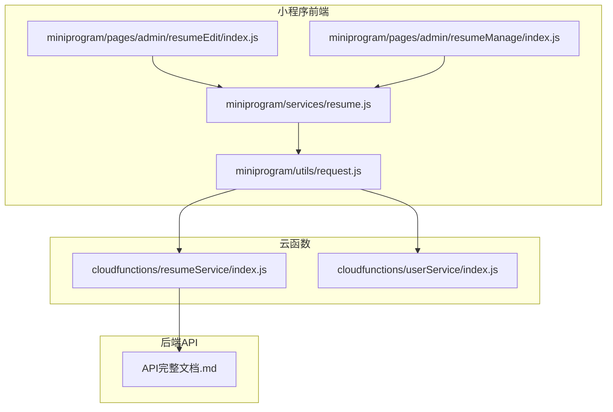
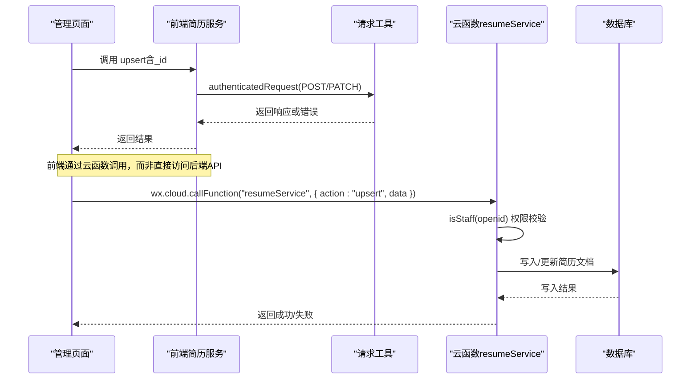
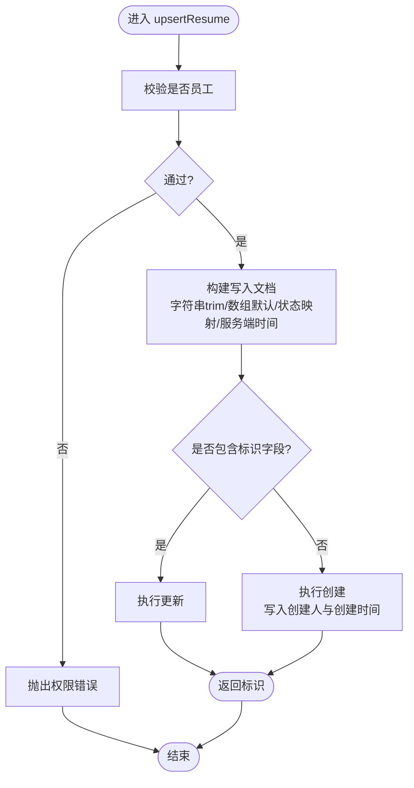
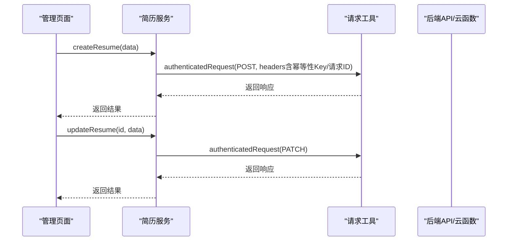
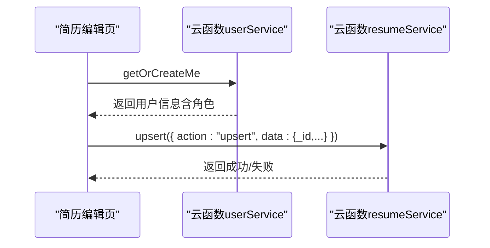
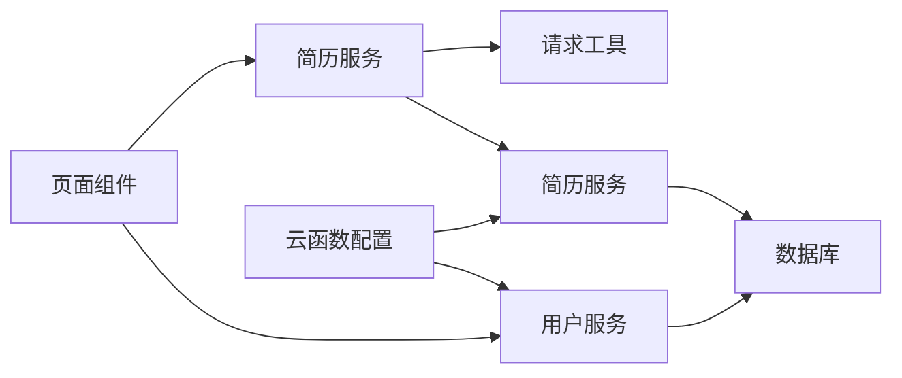

# 简历创建与更新接口

<cite>
**本文引用的文件**
- [cloudfunctions/resumeService/index.js](file://cloudfunctions/resumeService/index.js)
- [miniprogram/services/resume.js](file://miniprogram/services/resume.js)
- [miniprogram/utils/request.js](file://miniprogram/utils/request.js)
- [miniprogram/pages/admin/resumeEdit/index.js](file://miniprogram/pages/admin/resumeEdit/index.js)
- [miniprogram/pages/admin/resumeManage/index.js](file://miniprogram/pages/admin/resumeManage/index.js)
- [API完整文档.md](file://API完整文档.md)
- [cloudfunctions/resumeService/config.json](file://cloudfunctions/resumeService/config.json)
- [cloudfunctions/userService/index.js](file://cloudfunctions/userService/index.js)
</cite>

## 目录
1. [简介](#简介)
2. [项目结构](#项目结构)
3. [核心组件](#核心组件)
4. [架构总览](#架构总览)
5. [详细组件分析](#详细组件分析)
6. [依赖关系分析](#依赖关系分析)
7. [性能考量](#性能考量)
8. [故障排查指南](#故障排查指南)
9. [结论](#结论)
10. [附录](#附录)

## 简介
本文件面向“简历创建与更新接口”的全面文档，重点说明以下要点：
- upsert接口通过判断传入数据中的标识字段是否存在，决定执行创建还是更新操作。
- 所有调用必须经过员工权限校验，确保仅员工可修改简历。
- 数据写入时的字段处理逻辑：字符串trim、数组默认值、状态映射（非published即draft）、时间字段使用服务端时间保证一致性。
- 创建时自动记录创建人与创建时间；更新时仅更新最近修改时间。
- 结合前端服务层封装，展示通过认证请求发送POST/PATCH请求，并处理幂等性Key与请求ID。
- 说明upsert操作的事务性保证与错误码处理策略。

## 项目结构
本项目采用前后端分离与云函数结合的模式：
- 前端小程序通过服务层封装HTTP请求，调用云函数或后端API。
- 云函数负责权限校验、数据清洗与数据库写入。
- 文档与配置文件提供接口规范与部署权限说明。

图表来源
- [cloudfunctions/resumeService/index.js](file://cloudfunctions/resumeService/index.js#L180-L215)
- [miniprogram/services/resume.js](file://miniprogram/services/resume.js#L118-L151)
- [miniprogram/utils/request.js](file://miniprogram/utils/request.js#L43-L103)
- [miniprogram/pages/admin/resumeEdit/index.js](file://miniprogram/pages/admin/resumeEdit/index.js#L172-L209)
- [miniprogram/pages/admin/resumeManage/index.js](file://miniprogram/pages/admin/resumeManage/index.js#L49-L111)
- [API完整文档.md](file://API完整文档.md#L217-L590)

章节来源
- [cloudfunctions/resumeService/index.js](file://cloudfunctions/resumeService/index.js#L180-L215)
- [miniprogram/services/resume.js](file://miniprogram/services/resume.js#L118-L151)
- [miniprogram/utils/request.js](file://miniprogram/utils/request.js#L43-L103)
- [miniprogram/pages/admin/resumeEdit/index.js](file://miniprogram/pages/admin/resumeEdit/index.js#L172-L209)
- [miniprogram/pages/admin/resumeManage/index.js](file://miniprogram/pages/admin/resumeManage/index.js#L49-L111)
- [API完整文档.md](file://API完整文档.md#L217-L590)

## 核心组件
- 云函数简历服务：负责upsert、查询、删除等操作，并进行员工权限校验与数据清洗。
- 前端简历服务：封装创建、更新、删除等操作，统一处理认证请求与幂等性Key。
- 前端请求工具：统一封装公开与认证请求，处理Token过期与错误响应。
- 页面组件：管理员页面负责调用云函数执行upsert，确保仅员工可访问。

章节来源
- [cloudfunctions/resumeService/index.js](file://cloudfunctions/resumeService/index.js#L135-L169)
- [miniprogram/services/resume.js](file://miniprogram/services/resume.js#L118-L151)
- [miniprogram/utils/request.js](file://miniprogram/utils/request.js#L43-L103)
- [miniprogram/pages/admin/resumeEdit/index.js](file://miniprogram/pages/admin/resumeEdit/index.js#L38-L51)

## 架构总览
下图展示了从前端到云函数再到数据库的调用链路与权限校验流程。

图表来源
- [miniprogram/pages/admin/resumeEdit/index.js](file://miniprogram/pages/admin/resumeEdit/index.js#L172-L209)
- [miniprogram/services/resume.js](file://miniprogram/services/resume.js#L118-L151)
- [miniprogram/utils/request.js](file://miniprogram/utils/request.js#L43-L103)
- [cloudfunctions/resumeService/index.js](file://cloudfunctions/resumeService/index.js#L135-L169)

## 详细组件分析

### 云函数简历服务（upsert实现）
- 权限校验：通过isStaff(openid)判断调用方是否为员工，非员工直接拒绝。
- upsert逻辑：
  - 若传入数据包含标识字段，则执行更新；否则执行创建。
  - 字段处理：
    - 字符串字段统一trim。
    - 数组字段若非数组则置为空数组。
    - 状态字段映射：非“published”即为“draft”。
    - 时间字段统一使用服务端时间。
  - 创建时自动记录创建人与创建时间；更新时仅更新最近修改时间。

图表来源
- [cloudfunctions/resumeService/index.js](file://cloudfunctions/resumeService/index.js#L135-L169)

章节来源
- [cloudfunctions/resumeService/index.js](file://cloudfunctions/resumeService/index.js#L135-L169)

### 前端简历服务（POST/PATCH与幂等性）
- 创建简历：通过POST请求，携带幂等性Key与请求ID，便于后端去重与追踪。
- 更新简历：通过PATCH请求，按需更新字段。
- 统一使用认证请求，要求Token有效。

图表来源
- [miniprogram/services/resume.js](file://miniprogram/services/resume.js#L118-L151)
- [miniprogram/utils/request.js](file://miniprogram/utils/request.js#L43-L103)

章节来源
- [miniprogram/services/resume.js](file://miniprogram/services/resume.js#L118-L151)
- [miniprogram/utils/request.js](file://miniprogram/utils/request.js#L43-L103)

### 前端页面（权限与调用）
- 页面在加载时先确保调用方为员工，否则提示并跳转。
- 保存时调用云函数执行upsert，传入表单数据与标识字段（若有）。

图表来源
- [miniprogram/pages/admin/resumeEdit/index.js](file://miniprogram/pages/admin/resumeEdit/index.js#L38-L51)
- [miniprogram/pages/admin/resumeEdit/index.js](file://miniprogram/pages/admin/resumeEdit/index.js#L172-L209)
- [cloudfunctions/userService/index.js](file://cloudfunctions/userService/index.js#L49-L84)

章节来源
- [miniprogram/pages/admin/resumeEdit/index.js](file://miniprogram/pages/admin/resumeEdit/index.js#L38-L51)
- [miniprogram/pages/admin/resumeEdit/index.js](file://miniprogram/pages/admin/resumeEdit/index.js#L172-L209)
- [cloudfunctions/userService/index.js](file://cloudfunctions/userService/index.js#L49-L84)

### 数据写入字段处理与时间一致性
- 字段处理：
  - 字符串trim：姓名、城市等字段统一去除首尾空白。
  - 数组默认值：tags、photos等若非数组则置空数组。
  - 状态映射：非“published”即为“draft”，确保状态合法。
- 时间一致性：
  - 使用服务端时间，避免客户端时间偏差导致的时间错乱。
- 创建与更新差异：
  - 创建：写入创建人与创建时间。
  - 更新：仅更新最近修改时间。

章节来源
- [cloudfunctions/resumeService/index.js](file://cloudfunctions/resumeService/index.js#L135-L169)

### 事务性保证与错误码处理
- 事务性：
  - upsert在单条文档写入层面具备原子性；若需跨文档事务，应在云函数内使用云开发事务API进行扩展。
- 错误码：
  - 前端请求工具对401进行Token过期处理，统一提示并引导重新登录。
  - 后端返回统一响应结构，包含成功标志与错误信息，便于前端识别与处理。

章节来源
- [miniprogram/utils/request.js](file://miniprogram/utils/request.js#L43-L103)
- [cloudfunctions/resumeService/index.js](file://cloudfunctions/resumeService/index.js#L180-L215)
- [API完整文档.md](file://API完整文档.md#L1159-L1206)

## 依赖关系分析
- 前端依赖：
  - 简历服务依赖请求工具，统一处理认证与错误。
  - 页面组件依赖云函数，间接依赖用户服务进行角色判定。
- 云函数依赖：
  - 简历服务依赖数据库命令与服务端时间。
  - 用户服务用于获取或创建用户并判定角色。
- 配置依赖：
  - 云函数配置声明权限，确保运行时可用的OpenAPI能力。

图表来源
- [miniprogram/pages/admin/resumeEdit/index.js](file://miniprogram/pages/admin/resumeEdit/index.js#L38-L51)
- [miniprogram/services/resume.js](file://miniprogram/services/resume.js#L118-L151)
- [miniprogram/utils/request.js](file://miniprogram/utils/request.js#L43-L103)
- [cloudfunctions/resumeService/index.js](file://cloudfunctions/resumeService/index.js#L180-L215)
- [cloudfunctions/userService/index.js](file://cloudfunctions/userService/index.js#L49-L84)
- [cloudfunctions/resumeService/config.json](file://cloudfunctions/resumeService/config.json#L1-L6)

章节来源
- [cloudfunctions/resumeService/index.js](file://cloudfunctions/resumeService/index.js#L180-L215)
- [cloudfunctions/userService/index.js](file://cloudfunctions/userService/index.js#L49-L84)
- [cloudfunctions/resumeService/config.json](file://cloudfunctions/resumeService/config.json#L1-L6)

## 性能考量
- 前端：
  - 使用认证请求统一处理Token与错误，减少重复逻辑。
  - 表单输入时进行trim与数组拆分，降低后端清洗成本。
- 云函数：
  - 使用服务端时间减少网络往返与时间漂移。
  - upsert在单文档层面原子性强，避免不必要的跨文档事务。
- 建议：
  - 对于高频写入场景，可在云函数内引入幂等性Key去重策略（前端已提供），并在数据库层面增加唯一索引以进一步保障幂等性与一致性。

[本节为通用指导，不涉及具体文件分析]

## 故障排查指南
- 权限错误：
  - 现象：调用upsert返回权限不足。
  - 排查：确认调用方是否为员工角色；页面加载时应先调用用户服务获取角色。
- Token过期：
  - 现象：认证请求返回401。
  - 处理：前端工具会清除本地Token并跳转登录页；请重新登录后再试。
- 数据异常：
  - 现象：状态非预期、数组字段为空。
  - 处理：前端已对字符串trim与数组默认值；后端upsert亦做相同处理，确认传参是否符合预期。
- 事务与幂等：
  - 建议：若出现重复提交或并发写入问题，结合前端提供的幂等性Key与后端去重策略进行排查。

章节来源
- [miniprogram/utils/request.js](file://miniprogram/utils/request.js#L43-L103)
- [miniprogram/pages/admin/resumeEdit/index.js](file://miniprogram/pages/admin/resumeEdit/index.js#L38-L51)
- [cloudfunctions/resumeService/index.js](file://cloudfunctions/resumeService/index.js#L135-L169)

## 结论
- upsert接口通过“是否存在标识字段”实现创建/更新的统一入口，配合严格的员工权限校验，确保简历数据的安全与可控。
- 前端在请求层面提供了幂等性Key与请求ID，有助于后端去重与审计。
- 数据写入时的字段处理与服务端时间一致性，提升了数据质量与系统稳定性。
- 错误码与统一响应结构便于前端统一处理与用户反馈。

[本节为总结性内容，不涉及具体文件分析]

## 附录

### 接口与字段规范摘要
- upsert调用路径：页面通过云函数调用，传入action与data。
- 字段处理：
  - 字符串trim、数组默认值、状态映射、服务端时间。
- 创建与更新：
  - 创建：写入创建人与创建时间。
  - 更新：仅更新最近修改时间。
- 幂等性与请求ID：
  - 前端在创建请求中设置幂等性Key与请求ID，便于后端去重与追踪。

章节来源
- [miniprogram/pages/admin/resumeEdit/index.js](file://miniprogram/pages/admin/resumeEdit/index.js#L172-L209)
- [miniprogram/services/resume.js](file://miniprogram/services/resume.js#L118-L151)
- [cloudfunctions/resumeService/index.js](file://cloudfunctions/resumeService/index.js#L135-L169)