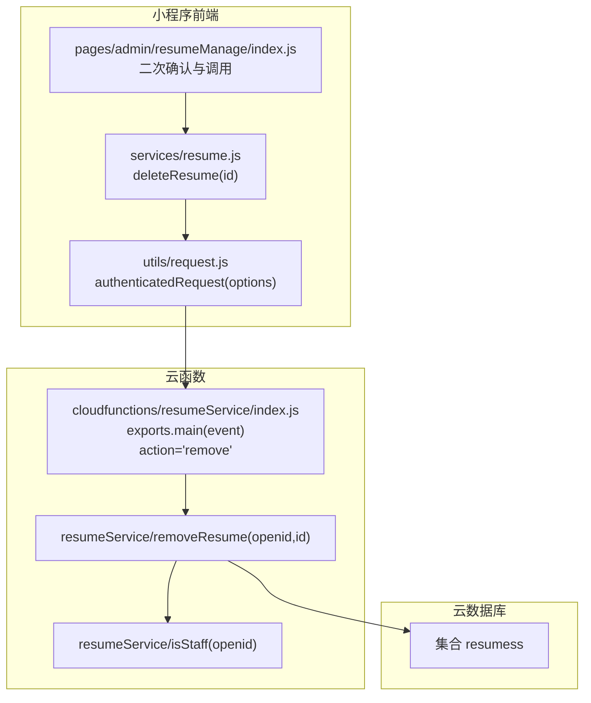
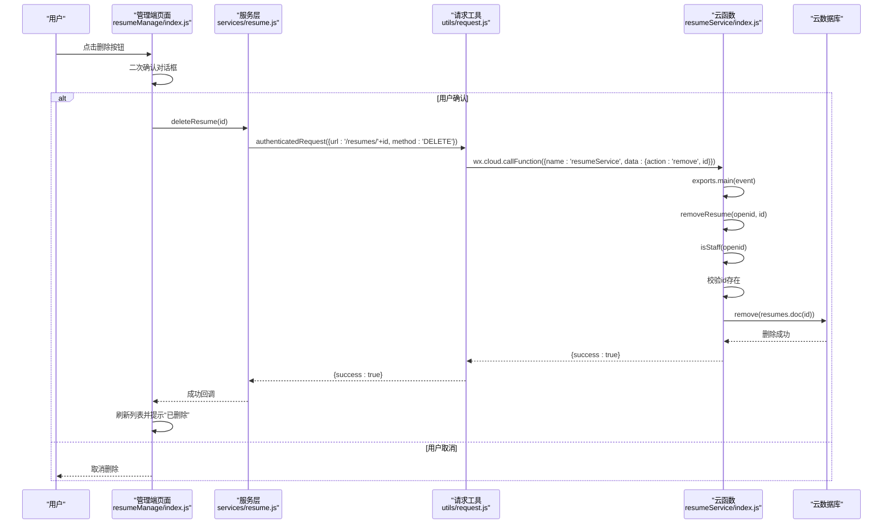
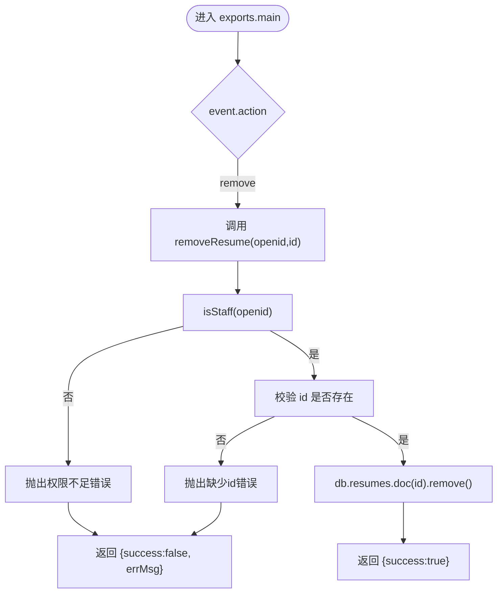
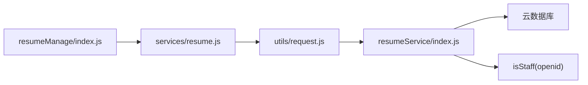

# 简历删除接口

<cite>
**本文引用的文件**
- [cloudfunctions/resumeService/index.js](file://cloudfunctions/resumeService/index.js)
- [miniprogram/services/resume.js](file://miniprogram/services/resume.js)
- [miniprogram/utils/request.js](file://miniprogram/utils/request.js)
- [miniprogram/pages/admin/resumeManage/index.js](file://miniprogram/pages/admin/resumeManage/index.js)
- [API完整文档.md](file://API完整文档.md)
- [PRD.md](file://PRD.md)
</cite>

## 目录
1. [简介](#简介)
2. [项目结构](#项目结构)
3. [核心组件](#核心组件)
4. [架构总览](#架构总览)
5. [详细组件分析](#详细组件分析)
6. [依赖关系分析](#依赖关系分析)
7. [性能考量](#性能考量)
8. [故障排查指南](#故障排查指南)
9. [结论](#结论)
10. [附录](#附录)

## 简介
本文件面向“简历删除”接口的专业文档，目标如下：
- 明确该接口用于永久删除指定ID的简历记录，且删除前必须完成员工权限校验（isStaff函数）。
- 描述接口参数验证机制：确保id字段存在且非空。
- 解释删除操作直接调用云数据库remove方法，无软删除机制。
- 结合miniprogram/services/resume.js中的deleteResume方法，展示前端如何通过authenticatedRequest发起DELETE请求并处理成功/失败响应。
- 强调该操作不可逆，建议前端增加二次确认交互。
- 提供错误处理场景说明，如权限拒绝、记录不存在等情况的响应格式。
- 纠正API完整文档.md中关于此接口为RESTful DELETE的描述偏差，明确其实际为云函数action调用。

## 项目结构
围绕简历删除接口的相关模块分布如下：
- 云函数层：resumeService提供action分发，其中包含remove动作。
- 前端小程序层：services/resume.js封装deleteResume方法，基于utils/request.js的authenticatedRequest发起DELETE请求。
- 管理端页面：admin/resumeManage页面在删除前进行员工权限校验，并对用户进行二次确认提示。

图表来源
- [cloudfunctions/resumeService/index.js](file://cloudfunctions/resumeService/index.js#L171-L178)
- [cloudfunctions/resumeService/index.js](file://cloudfunctions/resumeService/index.js#L180-L215)
- [miniprogram/services/resume.js](file://miniprogram/services/resume.js#L153-L166)
- [miniprogram/utils/request.js](file://miniprogram/utils/request.js#L43-L103)
- [miniprogram/pages/admin/resumeManage/index.js](file://miniprogram/pages/admin/resumeManage/index.js#L82-L111)

章节来源
- [cloudfunctions/resumeService/index.js](file://cloudfunctions/resumeService/index.js#L171-L178)
- [miniprogram/services/resume.js](file://miniprogram/services/resume.js#L153-L166)
- [miniprogram/utils/request.js](file://miniprogram/utils/request.js#L43-L103)
- [miniprogram/pages/admin/resumeManage/index.js](file://miniprogram/pages/admin/resumeManage/index.js#L82-L111)

## 核心组件
- 云函数入口与action分发：exports.main根据event.action分发至具体处理函数，其中包含remove动作。
- 删除业务逻辑：removeResume(openid, id)负责权限校验与删除执行。
- 员工权限校验：isStaff(openid)判定当前用户是否具备删除权限。
- 前端删除方法：deleteResume(id)通过authenticatedRequest发起DELETE请求。
- 管理端页面：在删除前进行二次确认，调用云函数执行删除。

章节来源
- [cloudfunctions/resumeService/index.js](file://cloudfunctions/resumeService/index.js#L180-L215)
- [cloudfunctions/resumeService/index.js](file://cloudfunctions/resumeService/index.js#L171-L178)
- [cloudfunctions/resumeService/index.js](file://cloudfunctions/resumeService/index.js#L26-L56)
- [miniprogram/services/resume.js](file://miniprogram/services/resume.js#L153-L166)
- [miniprogram/pages/admin/resumeManage/index.js](file://miniprogram/pages/admin/resumeManage/index.js#L82-L111)

## 架构总览
简历删除的端到端流程如下：
- 前端页面触发删除按钮，弹出二次确认对话框。
- 用户确认后，前端调用deleteResume(id)，通过authenticatedRequest以DELETE方式请求后端。
- 云函数resumeService接收请求，根据action='remove'调用removeResume(openid, id)。
- removeResume内部先调用isStaff(openid)进行权限校验，再校验id参数，最后直接调用云数据库remove删除记录。
- 返回统一的成功响应，前端刷新列表并提示结果。

图表来源
- [miniprogram/pages/admin/resumeManage/index.js](file://miniprogram/pages/admin/resumeManage/index.js#L82-L111)
- [miniprogram/services/resume.js](file://miniprogram/services/resume.js#L153-L166)
- [miniprogram/utils/request.js](file://miniprogram/utils/request.js#L43-L103)
- [cloudfunctions/resumeService/index.js](file://cloudfunctions/resumeService/index.js#L180-L215)
- [cloudfunctions/resumeService/index.js](file://cloudfunctions/resumeService/index.js#L171-L178)

## 详细组件分析

### 云函数：resumeService
- action分发：exports.main根据event.action选择对应处理函数，其中包含remove分支。
- 删除逻辑：removeResume(openid, id)先isStaff校验，再校验id存在，最后调用云数据库remove删除指定文档。
- 权限校验：isStaff通过users与staff集合关联判断当前openid是否为员工。

图表来源
- [cloudfunctions/resumeService/index.js](file://cloudfunctions/resumeService/index.js#L180-L215)
- [cloudfunctions/resumeService/index.js](file://cloudfunctions/resumeService/index.js#L171-L178)
- [cloudfunctions/resumeService/index.js](file://cloudfunctions/resumeService/index.js#L26-L56)

章节来源
- [cloudfunctions/resumeService/index.js](file://cloudfunctions/resumeService/index.js#L180-L215)
- [cloudfunctions/resumeService/index.js](file://cloudfunctions/resumeService/index.js#L171-L178)
- [cloudfunctions/resumeService/index.js](file://cloudfunctions/resumeService/index.js#L26-L56)

### 前端服务：services/resume.js
- deleteResume(id)：封装DELETE请求，调用authenticatedRequest，请求路径为/resumes/{id}。
- 该方法不包含参数校验，参数校验由云函数侧执行。

章节来源
- [miniprogram/services/resume.js](file://miniprogram/services/resume.js#L153-L166)

### 前端请求工具：utils/request.js
- authenticatedRequest(options)：自动注入Authorization头，携带本地存储的token；当401时清理本地token并跳转登录。
- 对于非200响应，提取message或状态码作为错误信息。

章节来源
- [miniprogram/utils/request.js](file://miniprogram/utils/request.js#L43-L103)

### 管理端页面：pages/admin/resumeManage/index.js
- 删除流程：showModal二次确认 -> wx.cloud.callFunction调用resumeService的remove动作 -> 刷新列表并提示结果。
- 页面在显示时会先调用userService确保当前用户为员工角色。

章节来源
- [miniprogram/pages/admin/resumeManage/index.js](file://miniprogram/pages/admin/resumeManage/index.js#L82-L111)

### 参数验证与错误处理
- 参数验证：云函数侧在removeResume中校验id是否存在，否则抛出错误；同时通过isStaff校验权限。
- 错误处理：
  - 权限不足：返回{success:false, errMsg:"permission denied"}。
  - 缺少id：返回{success:false, errMsg:"missing id"}。
  - 401未授权：authenticatedRequest会清理token并提示登录过期。
  - 其他HTTP错误：提取message或状态码作为错误信息。

章节来源
- [cloudfunctions/resumeService/index.js](file://cloudfunctions/resumeService/index.js#L171-L178)
- [cloudfunctions/resumeService/index.js](file://cloudfunctions/resumeService/index.js#L205-L215)
- [miniprogram/utils/request.js](file://miniprogram/utils/request.js#L68-L96)

### 关于API文档中的描述修正
- API完整文档.md中将“删除简历”描述为RESTful DELETE接口，但实际实现为云函数action调用（action='remove'），并非标准RESTful路由。
- 正确理解：前端通过wx.cloud.callFunction调用resumeService，事件体包含action与id；云函数内部根据action分发到removeResume执行删除。

章节来源
- [API完整文档.md](file://API完整文档.md#L344-L356)
- [cloudfunctions/resumeService/index.js](file://cloudfunctions/resumeService/index.js#L180-L215)

## 依赖关系分析
- 云函数依赖：resumeService依赖云数据库API进行文档删除；依赖isStaff进行权限校验。
- 前端依赖：services/resume.js依赖utils/request.js；管理端页面依赖services/resume.js与云函数。
- 数据依赖：删除操作直接作用于resumes集合的指定文档。

图表来源
- [miniprogram/pages/admin/resumeManage/index.js](file://miniprogram/pages/admin/resumeManage/index.js#L82-L111)
- [miniprogram/services/resume.js](file://miniprogram/services/resume.js#L153-L166)
- [miniprogram/utils/request.js](file://miniprogram/utils/request.js#L43-L103)
- [cloudfunctions/resumeService/index.js](file://cloudfunctions/resumeService/index.js#L171-L178)

章节来源
- [miniprogram/pages/admin/resumeManage/index.js](file://miniprogram/pages/admin/resumeManage/index.js#L82-L111)
- [miniprogram/services/resume.js](file://miniprogram/services/resume.js#L153-L166)
- [miniprogram/utils/request.js](file://miniprogram/utils/request.js#L43-L103)
- [cloudfunctions/resumeService/index.js](file://cloudfunctions/resumeService/index.js#L171-L178)

## 性能考量
- 删除操作为单文档删除，复杂度较低，受网络与数据库延迟影响。
- 建议前端在删除前进行二次确认，避免误操作导致的重试与网络消耗。
- 云函数侧已做参数校验与权限校验，减少无效请求。

## 故障排查指南
- 权限不足
  - 现象：返回{success:false, errMsg:"permission denied"}。
  - 排查：确认当前用户是否在staff集合中，或是否满足isStaff条件。
- 缺少id
  - 现象：返回{success:false, errMsg:"missing id"}。
  - 排查：确认调用时传入了正确的简历ID。
- 401未授权
  - 现象：authenticatedRequest检测到401，清理本地token并提示登录过期。
  - 排查：重新登录获取有效token。
- 删除失败
  - 现象：页面提示“删除失败”，列表未刷新。
  - 排查：检查网络状态、云函数日志、数据库连接；确认ID是否存在。

章节来源
- [cloudfunctions/resumeService/index.js](file://cloudfunctions/resumeService/index.js#L171-L178)
- [cloudfunctions/resumeService/index.js](file://cloudfunctions/resumeService/index.js#L205-L215)
- [miniprogram/utils/request.js](file://miniprogram/utils/request.js#L68-L96)

## 结论
- 简历删除接口为云函数action调用，非RESTful DELETE路由；删除前必须完成员工权限校验与id参数校验。
- 删除操作为硬删除，无软删除机制，建议前端增加二次确认。
- 前端通过authenticatedRequest发起DELETE请求，云函数侧执行删除并返回统一响应格式。

## 附录

### 接口定义与调用要点
- 云函数入口与action
  - 入口：resumeService/index.js
  - action：remove
  - 入参：{ action:'remove', id }
  - 出参：{ success:true }
- 前端调用
  - 方法：services/resume.js.deleteResume(id)
  - 请求：DELETE /resumes/{id}
  - 认证：Bearer Token（authenticatedRequest自动注入）

章节来源
- [cloudfunctions/resumeService/index.js](file://cloudfunctions/resumeService/index.js#L180-L215)
- [miniprogram/services/resume.js](file://miniprogram/services/resume.js#L153-L166)
- [PRD.md](file://PRD.md#L295-L307)