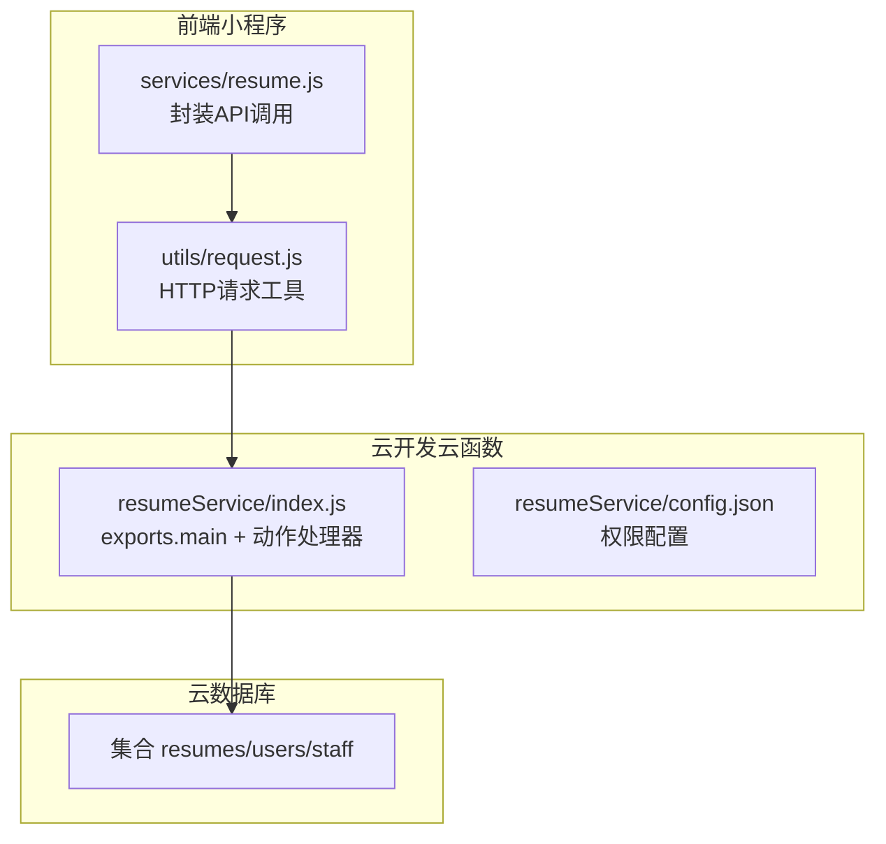
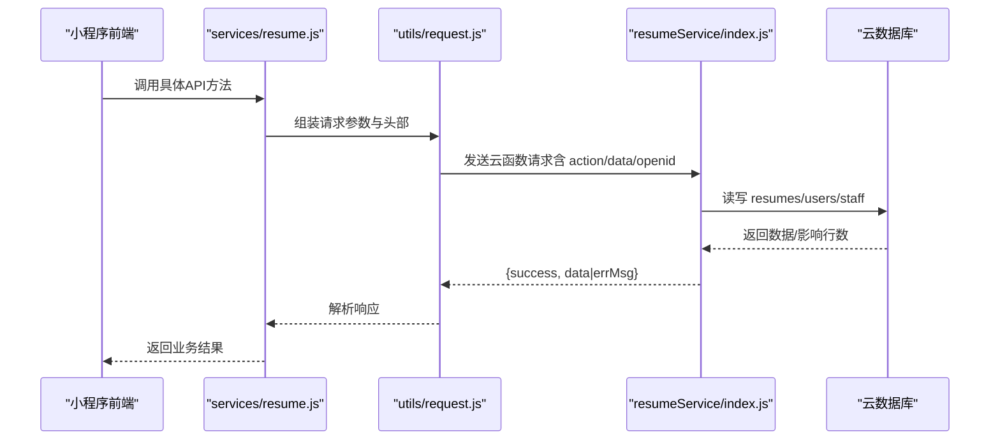
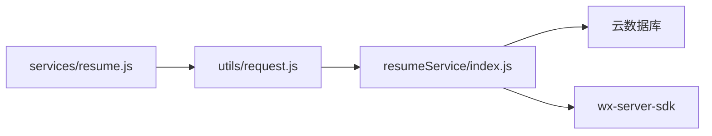

# 简历服务API

<cite>
**本文引用的文件**
- [cloudfunctions/resumeService/index.js](file://cloudfunctions/resumeService/index.js)
- [cloudfunctions/resumeService/config.json](file://cloudfunctions/resumeService/config.json)
- [miniprogram/services/resume.js](file://miniprogram/services/resume.js)
- [miniprogram/utils/request.js](file://miniprogram/utils/request.js)
- [PRD.md](file://PRD.md)
- [API完整文档.md](file://API完整文档.md)
</cite>

## 目录
1. [简介](#简介)
2. [项目结构](#项目结构)
3. [核心组件](#核心组件)
4. [架构总览](#架构总览)
5. [详细组件分析](#详细组件分析)
6. [依赖关系分析](#依赖关系分析)
7. [性能考量](#性能考量)
8. [故障排查指南](#故障排查指南)
9. [结论](#结论)
10. [附录](#附录)

## 简介
本文件面向安得褓贝项目中的简历服务API，聚焦于云函数 resumeService 提供的五个核心 action：list、detail、listForManage、upsert 和 remove。文档严格基于仓库中的实际代码生成，纠正了 API完整文档.md 中与云函数实现不一致的部分，并补充了前端服务层调用示例与数据模型说明。

## 项目结构
简历服务API由两部分组成：
- 云函数侧：resumeService 提供 list、detail、listForManage、upsert、remove 等动作，统一通过 exports.main 接收事件并返回标准结构。
- 前端服务层：miniprogram/services/resume.js 封装对公开接口与小程序专用接口的调用，使用 miniprogram/utils/request.js 统一发起网络请求。

图表来源
- [cloudfunctions/resumeService/index.js](file://cloudfunctions/resumeService/index.js#L1-L216)
- [cloudfunctions/resumeService/config.json](file://cloudfunctions/resumeService/config.json#L1-L6)
- [miniprogram/services/resume.js](file://miniprogram/services/resume.js#L1-L239)
- [miniprogram/utils/request.js](file://miniprogram/utils/request.js#L1-L125)

章节来源
- [cloudfunctions/resumeService/index.js](file://cloudfunctions/resumeService/index.js#L1-L216)
- [cloudfunctions/resumeService/config.json](file://cloudfunctions/resumeService/config.json#L1-L6)
- [miniprogram/services/resume.js](file://miniprogram/services/resume.js#L1-L239)
- [miniprogram/utils/request.js](file://miniprogram/utils/request.js#L1-L125)

## 核心组件
- 云函数入口与动作分发：exports.main 根据 event.action 调用对应处理器，并返回统一的 { success, data|errMsg } 结构。
- 权限校验：isStaff 通过 users 表与 staff 白名单判断 openid 是否具备 staff 角色。
- 数据裁剪：pickPublicFields 仅输出简历公开字段，确保对外暴露最小化数据集。
- 数据模型：resumes 集合字段定义见 PRD.md 的“数据模型”章节。

章节来源
- [cloudfunctions/resumeService/index.js](file://cloudfunctions/resumeService/index.js#L180-L216)
- [cloudfunctions/resumeService/index.js](file://cloudfunctions/resumeService/index.js#L26-L56)
- [cloudfunctions/resumeService/index.js](file://cloudfunctions/resumeService/index.js#L58-L76)
- [PRD.md](file://PRD.md#L202-L255)

## 架构总览
简历服务API的调用链路如下：
- 前端通过 services/resume.js 发起请求；
- request.js 统一封装 HTTP 请求，自动携带 Authorization 或公共请求头；
- 云函数 resumeService/index.js 接收事件，执行相应动作；
- 数据库操作通过云开发 SDK 访问 resumes/users/staff 集合；
- 返回统一响应结构 { success, data|errMsg }。

图表来源
- [miniprogram/services/resume.js](file://miniprogram/services/resume.js#L1-L239)
- [miniprogram/utils/request.js](file://miniprogram/utils/request.js#L1-L125)
- [cloudfunctions/resumeService/index.js](file://cloudfunctions/resumeService/index.js#L180-L216)

## 详细组件分析

### list 接口（公开列表）
- 作用：返回状态为 published 的简历，支持分页、关键词搜索（姓名/城市）、按 updatedAt 倒序排序。
- 请求参数
  - page：页码（从 0 开始，云函数内部转换为 skip）
  - pageSize：每页数量（限制在 1-20）
  - keyword：关键词（模糊匹配 name 或 city）
- 响应数据
  - 列表项为 pickPublicFields 裁剪后的公开字段集合
- 错误处理
  - 无显式抛错；若无数据则返回空数组
- 性能与复杂度
  - 分页使用 skip/limit，大数据量下建议配合索引优化 updatedAt
- 与前端集成
  - 前端调用路径：miniprogram/services/resume.js 中的 getResumeList 方法（公开接口）

章节来源
- [cloudfunctions/resumeService/index.js](file://cloudfunctions/resumeService/index.js#L78-L106)
- [cloudfunctions/resumeService/index.js](file://cloudfunctions/resumeService/index.js#L58-L76)
- [miniprogram/services/resume.js](file://miniprogram/services/resume.js#L16-L45)

### detail 接口（详情）
- 作用：根据 id 获取简历详情；当 forManage 为真时，要求调用者具备 staff 权限。
- 请求参数
  - id：简历标识
  - forManage：布尔开关，开启时进行 staff 权限校验
- 响应数据
  - 单条记录经 pickPublicFields 裁剪后的公开字段
- 错误处理
  - 缺少 id：抛出错误
  - 非 staff 且 forManage 为真：抛出权限不足错误
- 与前端集成
  - 前端调用路径：miniprogram/services/resume.js 中的 getResumeDetail/getResumeDetailMiniprogram（公开接口）

章节来源
- [cloudfunctions/resumeService/index.js](file://cloudfunctions/resumeService/index.js#L108-L120)
- [cloudfunctions/resumeService/index.js](file://cloudfunctions/resumeService/index.js#L26-L56)
- [cloudfunctions/resumeService/index.js](file://cloudfunctions/resumeService/index.js#L58-L76)
- [miniprogram/services/resume.js](file://miniprogram/services/resume.js#L73-L99)

### listForManage 接口（管理后台）
- 作用：仅 staff 角色可调用，返回最近更新的简历列表（最多 100 条），按 updatedAt 倒序。
- 请求参数：无
- 响应数据
  - 列表项为 pickPublicFields 裁剪后的公开字段集合
- 错误处理
  - 非 staff：抛出权限不足错误
- 与前端集成
  - 前端调用路径：miniprogram/services/resume.js 中的 getResumeListMiniprogram（公开接口，但实际由云函数侧权限控制）

章节来源
- [cloudfunctions/resumeService/index.js](file://cloudfunctions/resumeService/index.js#L122-L133)
- [cloudfunctions/resumeService/index.js](file://cloudfunctions/resumeService/index.js#L26-L56)
- [cloudfunctions/resumeService/index.js](file://cloudfunctions/resumeService/index.js#L58-L76)
- [miniprogram/services/resume.js](file://miniprogram/services/resume.js#L47-L71)

### upsert 接口（创建/更新）
- 作用：通过 _id 判断创建或更新；强制要求 staff 权限；status 仅接受 "published" 或 "draft"。
- 请求参数
  - data：包含简历字段（name、age、city、experienceYears、priceMonth、tags、intro、coverFileId、photos、videoFileId、status、_id）
- 响应数据
  - 返回 { _id }，表示创建或更新成功的简历标识
- 错误处理
  - 非 staff：抛出权限不足错误
  - 当 status 非 "published" 时，保存为 "draft"
- 与前端集成
  - 前端调用路径：miniprogram/services/resume.js 中的 createResume/updateResume（小程序专用接口）

章节来源
- [cloudfunctions/resumeService/index.js](file://cloudfunctions/resumeService/index.js#L135-L169)
- [cloudfunctions/resumeService/index.js](file://cloudfunctions/resumeService/index.js#L26-L56)
- [cloudfunctions/resumeService/index.js](file://cloudfunctions/resumeService/index.js#L58-L76)
- [miniprogram/services/resume.js](file://miniprogram/services/resume.js#L113-L151)

### remove 接口（删除）
- 作用：删除指定简历；强制要求 staff 权限。
- 请求参数
  - id：简历标识
- 响应数据
  - 返回 true
- 错误处理
  - 非 staff：抛出权限不足错误
  - 缺少 id：抛出错误
- 与前端集成
  - 前端调用路径：miniprogram/services/resume.js 中的 deleteResume（小程序专用接口）

章节来源
- [cloudfunctions/resumeService/index.js](file://cloudfunctions/resumeService/index.js#L171-L178)
- [cloudfunctions/resumeService/index.js](file://cloudfunctions/resumeService/index.js#L26-L56)
- [miniprogram/services/resume.js](file://miniprogram/services/resume.js#L153-L165)

### 数据模型与字段定义
- resumes 集合字段（公开字段经 pickPublicFields 输出）
  - _id：简历标识
  - name：姓名
  - age：年龄
  - city：城市
  - experienceYears：经验年数
  - priceMonth：月薪
  - tags：标签数组
  - intro：文字介绍
  - coverFileId：封面文件ID
  - photos：图片文件ID数组
  - videoFileId：视频文件ID
  - status：状态（仅 published 对外可见）
  - updatedAt/createdAt：更新/创建时间
- users/staff 集合
  - users：存储用户基本信息与角色，用于 isStaff 权限判断
  - staff：员工白名单，用于 staff 角色判定

章节来源
- [cloudfunctions/resumeService/index.js](file://cloudfunctions/resumeService/index.js#L58-L76)
- [cloudfunctions/resumeService/index.js](file://cloudfunctions/resumeService/index.js#L26-L56)
- [PRD.md](file://PRD.md#L202-L255)

### 前端服务层调用示例
- 公开接口（无需登录）
  - 获取简历列表：getResumeList(params)
  - 获取简历详情：getResumeDetail(id)
- 小程序专用接口（需要登录）
  - 获取简历列表（小程序）：getResumeListMiniprogram(params)
  - 获取简历详情（小程序）：getResumeDetailMiniprogram(id)
  - 创建简历：createResume(data)
  - 更新简历：updateResume(id, data)
  - 删除简历：deleteResume(id)

章节来源
- [miniprogram/services/resume.js](file://miniprogram/services/resume.js#L1-L239)
- [miniprogram/utils/request.js](file://miniprogram/utils/request.js#L1-L125)

## 依赖关系分析
- 云函数依赖
  - wx-server-sdk：获取 WX 上下文、数据库命令、ServerDate
  - 云数据库：resumes/users/staff 集合
- 前端依赖
  - utils/request.js：统一请求封装，自动处理 Token、状态码与错误
  - services/resume.js：按业务拆分 API 方法，调用 request.js

图表来源
- [cloudfunctions/resumeService/index.js](file://cloudfunctions/resumeService/index.js#L1-L216)
- [miniprogram/services/resume.js](file://miniprogram/services/resume.js#L1-L239)
- [miniprogram/utils/request.js](file://miniprogram/utils/request.js#L1-L125)

章节来源
- [cloudfunctions/resumeService/index.js](file://cloudfunctions/resumeService/index.js#L1-L216)
- [miniprogram/services/resume.js](file://miniprogram/services/resume.js#L1-L239)
- [miniprogram/utils/request.js](file://miniprogram/utils/request.js#L1-L125)

## 性能考量
- 分页与排序
  - list 接口使用 skip/limit 实现分页，建议在 updatedAt 字段建立索引以提升排序与分页性能。
- 查询条件
  - 关键词搜索采用正则匹配 name 或 city，建议在高频字段上建立索引。
- 权限判断
  - isStaff 会查询 users 与 staff 集合，建议在 staff.phone 与 users._openid 建立索引。
- 数据裁剪
  - pickPublicFields 仅返回公开字段，减少传输体积，有利于前端渲染与缓存。

章节来源
- [cloudfunctions/resumeService/index.js](file://cloudfunctions/resumeService/index.js#L78-L106)
- [cloudfunctions/resumeService/index.js](file://cloudfunctions/resumeService/index.js#L26-L56)
- [cloudfunctions/resumeService/index.js](file://cloudfunctions/resumeService/index.js#L58-L76)

## 故障排查指南
- 常见错误与定位
  - permission denied：确认调用方是否具备 staff 权限；检查 users 与 staff 集合数据与 isStaff 判定逻辑。
  - missing id：确认传入的 id 参数是否存在。
  - unknown action：确认 event.action 是否为 list/detail/listForManage/upsert/remove 之一。
  - 响应结构异常：云函数统一返回 { success, data|errMsg }，前端需按此结构解析。
- 前端错误处理
  - request.js 在 401 时会清除本地 Token 并提示重新登录；其他错误会返回 message 或状态码。
- 云函数日志
  - 使用云开发控制台查看云函数日志，定位具体抛错位置（如权限校验、数据库查询、参数校验）。

章节来源
- [cloudfunctions/resumeService/index.js](file://cloudfunctions/resumeService/index.js#L180-L216)
- [cloudfunctions/resumeService/index.js](file://cloudfunctions/resumeService/index.js#L108-L178)
- [miniprogram/utils/request.js](file://miniprogram/utils/request.js#L43-L103)

## 结论
resumeService 云函数提供了稳定、清晰的简历管理能力，通过统一的动作分发与权限校验，保障了数据安全与一致性。前端服务层通过标准化的请求封装与方法拆分，简化了调用流程。建议在生产环境中为高频字段建立索引，并持续监控云函数日志与前端错误上报，以提升整体稳定性与用户体验。

## 附录

### 接口清单与差异说明
- 与 API完整文档.md 的差异核对
  - 云函数 resumeService 的 list、detail、listForManage、upsert、remove 均为云函数动作，而非传统 REST API；其请求/响应结构与权限控制与 API完整文档.md 中的“CRM端简历接口”存在差异。
  - 云函数侧的 detail 接口支持 forManage 参数进行 staff 权限校验；而 API完整文档.md 中的“CRM端简历接口”未体现该差异。
  - 云函数侧的 upsert 强制要求 staff 权限；API完整文档.md 中的“CRM端简历接口”未体现该差异。
  - 云函数侧的 list 仅返回 status=published 的简历；API完整文档.md 中的“CRM端简历接口”未体现该差异。
- 建议
  - 前端调用时应以 resumeService 云函数的实际行为为准，避免与 API完整文档.md 中的“CRM端简历接口”混淆。

章节来源
- [cloudfunctions/resumeService/index.js](file://cloudfunctions/resumeService/index.js#L78-L178)
- [API完整文档.md](file://API完整文档.md#L217-L382)