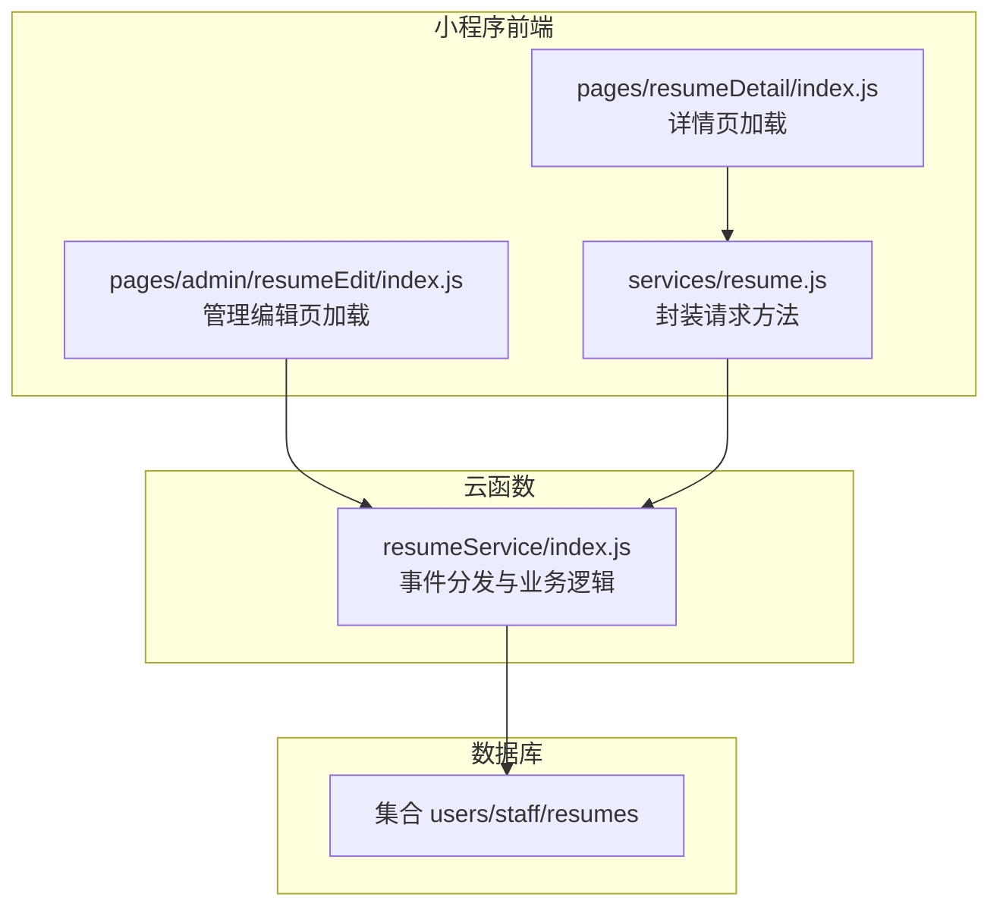
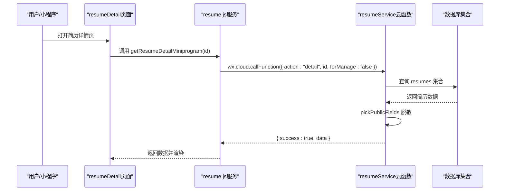
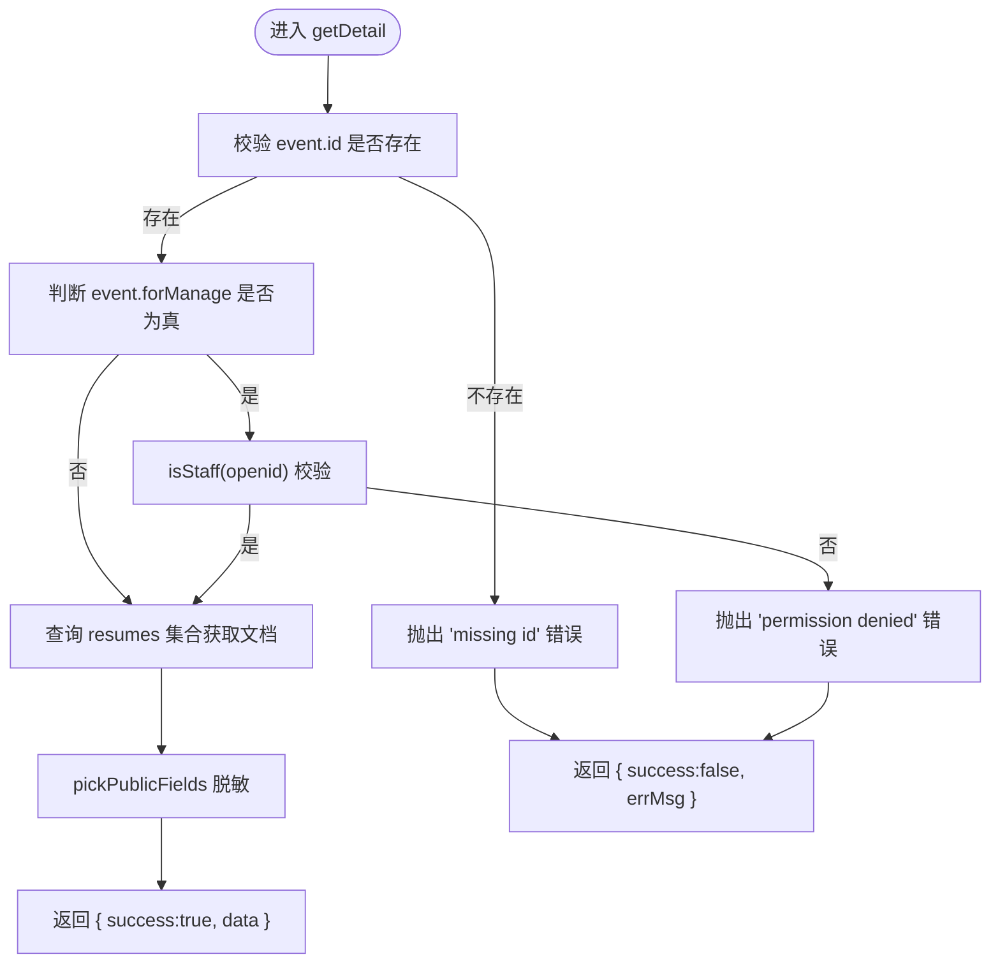
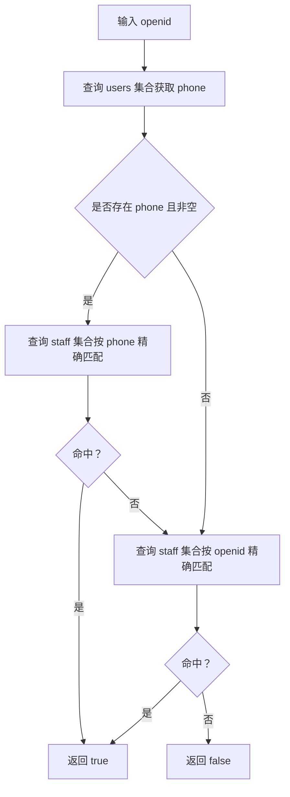
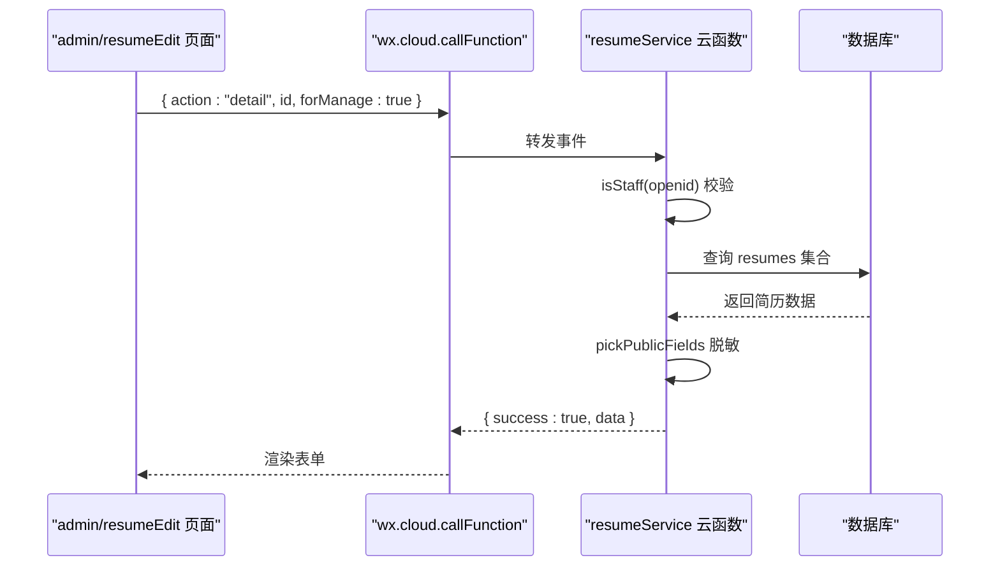
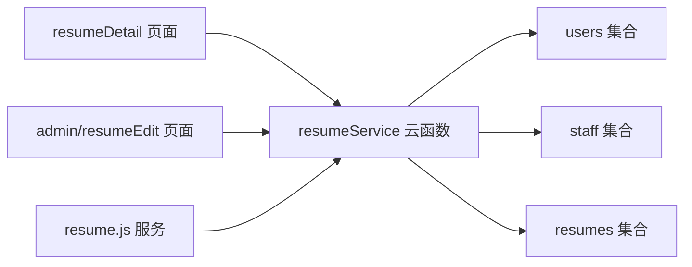

# 简历详情查询接口

<cite>
**本文引用的文件**
- [cloudfunctions/resumeService/index.js](file://cloudfunctions/resumeService/index.js)
- [miniprogram/services/resume.js](file://miniprogram/services/resume.js)
- [miniprogram/pages/resumeDetail/index.js](file://miniprogram/pages/resumeDetail/index.js)
- [miniprogram/pages/admin/resumeEdit/index.js](file://miniprogram/pages/admin/resumeEdit/index.js)
- [API完整文档.md](file://API完整文档.md)
- [PRD.md](file://PRD.md)
</cite>

## 目录
1. [简介](#简介)
2. [项目结构](#项目结构)
3. [核心组件](#核心组件)
4. [架构概览](#架构概览)
5. [详细组件分析](#详细组件分析)
6. [依赖关系分析](#依赖关系分析)
7. [性能考量](#性能考量)
8. [故障排查指南](#故障排查指南)
9. [结论](#结论)

## 简介
本文件围绕简历服务API的detail接口进行深度文档化，重点说明以下要点：
- 该接口根据传入的简历ID获取简历详情；
- 通过forManage参数决定是否进行员工权限校验；
- 当forManage为true时，需验证调用者openid是否在staff集合中（优先通过手机号匹配，其次兼容旧openid方式）；
- 当forManage为false或未提供时，仅返回公开字段数据；
- 数据获取后统一通过pickPublicFields函数进行字段脱敏；
- 结合miniprogram/services/resume.js中的getResumeDetail和getResumeDetailMiniprogram方法，展示前端在不同场景下的调用方式；
- 明确错误处理机制：缺少id或权限不足时的异常抛出；
- 纠正API完整文档.md中关于此接口为RESTful API的错误描述，明确其基于云函数event.action调用。

## 项目结构
本项目采用前后端分离与云函数结合的架构：
- 云函数层：resumeService负责简历相关业务逻辑，通过event.action分发不同动作；
- 小程序前端：通过wx.cloud.callFunction调用云函数，或通过自定义封装的服务方法发起HTTP请求；
- 文档层：PRD.md与API完整文档.md分别给出云函数与REST API的文档描述，二者在本接口上存在差异，需以实际实现为准。

图表来源
- [cloudfunctions/resumeService/index.js](file://cloudfunctions/resumeService/index.js#L180-L215)
- [miniprogram/pages/resumeDetail/index.js](file://miniprogram/pages/resumeDetail/index.js#L202-L220)
- [miniprogram/pages/admin/resumeEdit/index.js](file://miniprogram/pages/admin/resumeEdit/index.js#L74-L104)
- [miniprogram/services/resume.js](file://miniprogram/services/resume.js#L73-L99)

章节来源
- [cloudfunctions/resumeService/index.js](file://cloudfunctions/resumeService/index.js#L180-L215)
- [miniprogram/pages/resumeDetail/index.js](file://miniprogram/pages/resumeDetail/index.js#L202-L220)
- [miniprogram/pages/admin/resumeEdit/index.js](file://miniprogram/pages/admin/resumeEdit/index.js#L74-L104)
- [miniprogram/services/resume.js](file://miniprogram/services/resume.js#L73-L99)

## 核心组件
- 云函数resumeService：负责简历详情查询、权限校验、字段脱敏与统一响应格式。
- 前端服务封装resume.js：提供公开与小程序专用的简历接口调用方法。
- 小程序页面：
  - resumeDetail：面向C端的简历详情页，调用公开接口；
  - admin/resumeEdit：面向管理端的简历编辑页，调用云函数detail并开启forManage=true。

章节来源
- [cloudfunctions/resumeService/index.js](file://cloudfunctions/resumeService/index.js#L108-L120)
- [miniprogram/services/resume.js](file://miniprogram/services/resume.js#L73-L99)
- [miniprogram/pages/resumeDetail/index.js](file://miniprogram/pages/resumeDetail/index.js#L202-L220)
- [miniprogram/pages/admin/resumeEdit/index.js](file://miniprogram/pages/admin/resumeEdit/index.js#L74-L104)

## 架构概览
下图展示了从客户端到云函数再到数据库的数据流与控制流：

图表来源
- [miniprogram/pages/resumeDetail/index.js](file://miniprogram/pages/resumeDetail/index.js#L202-L220)
- [miniprogram/services/resume.js](file://miniprogram/services/resume.js#L73-L99)
- [cloudfunctions/resumeService/index.js](file://cloudfunctions/resumeService/index.js#L108-L120)

## 详细组件分析

### 云函数detail流程与权限校验
- 输入参数：
  - event.id：简历ID（必填）
  - event.forManage：是否为管理场景（可选，默认false）
- 权限判定：
  - 当forManage为true时，需要调用isStaff(openid)进行员工校验；
  - isStaff优先通过手机号匹配staff集合，其次兼容旧openid方式；
  - 若校验失败，抛出权限不足错误；
- 数据获取与脱敏：
  - 读取resumes集合中指定ID的文档；
  - 统一通过pickPublicFields进行字段脱敏，仅返回公开字段；
- 错误处理：
  - 缺少id时抛出“缺少id”错误；
  - 权限不足时抛出“权限不足”错误；
  - 其他异常被捕获并返回统一错误响应。

图表来源
- [cloudfunctions/resumeService/index.js](file://cloudfunctions/resumeService/index.js#L108-L120)
- [cloudfunctions/resumeService/index.js](file://cloudfunctions/resumeService/index.js#L26-L56)
- [cloudfunctions/resumeService/index.js](file://cloudfunctions/resumeService/index.js#L58-L76)

章节来源
- [cloudfunctions/resumeService/index.js](file://cloudfunctions/resumeService/index.js#L108-L120)
- [cloudfunctions/resumeService/index.js](file://cloudfunctions/resumeService/index.js#L26-L56)
- [cloudfunctions/resumeService/index.js](file://cloudfunctions/resumeService/index.js#L58-L76)

### 员工权限校验逻辑
- isStaff流程：
  - 先根据openid查询users集合获取手机号；
  - 优先使用手机号在staff集合中查找，命中则返回true；
  - 若未命中且存在手机号，则回退到使用openid在staff集合中查找；
  - 以上任一条件满足即视为员工。

图表来源
- [cloudfunctions/resumeService/index.js](file://cloudfunctions/resumeService/index.js#L26-L56)

章节来源
- [cloudfunctions/resumeService/index.js](file://cloudfunctions/resumeService/index.js#L26-L56)

### 字段脱敏策略
- pickPublicFields仅保留简历公开字段，避免泄露敏感信息；
- 返回结构包含简历标识、基本信息、公开展示字段及时间戳等。

章节来源
- [cloudfunctions/resumeService/index.js](file://cloudfunctions/resumeService/index.js#L58-L76)

### 前端调用场景与差异
- C端简历详情页（resumeDetail）：
  - 通过resume.js的getResumeDetailMiniprogram(id)调用公开接口；
  - 该方法内部使用publicRequest，不携带鉴权头；
  - 适合对外展示的简历详情。
- 管理端简历编辑页（admin/resumeEdit）：
  - 直接调用wx.cloud.callFunction，传入{ action:"detail", id, forManage:true }；
  - 云函数侧进行员工权限校验，仅允许staff查看；
  - 适合后台管理场景。

图表来源
- [miniprogram/pages/admin/resumeEdit/index.js](file://miniprogram/pages/admin/resumeEdit/index.js#L74-L104)
- [cloudfunctions/resumeService/index.js](file://cloudfunctions/resumeService/index.js#L108-L120)

章节来源
- [miniprogram/pages/resumeDetail/index.js](file://miniprogram/pages/resumeDetail/index.js#L202-L220)
- [miniprogram/services/resume.js](file://miniprogram/services/resume.js#L73-L99)
- [miniprogram/pages/admin/resumeEdit/index.js](file://miniprogram/pages/admin/resumeEdit/index.js#L74-L104)

### 与REST API文档的差异说明
- PRD.md与API完整文档.md对简历详情接口的描述存在差异：
  - PRD.md明确指出resumeService的detail接口支持forManage参数，且在forManage=true时仅staff可见；
  - API完整文档.md将该接口描述为RESTful API（GET /api/resumes/public/:id），但实际实现为云函数事件分发；
- 本接口属于云函数事件驱动模式，而非传统RESTful API，应以resumeService的实现为准。

章节来源
- [PRD.md](file://PRD.md#L293-L312)
- [API完整文档.md](file://API完整文档.md#L470-L496)

## 依赖关系分析
- 云函数依赖：
  - 数据库集合：users、staff、resumes；
  - 微信云开发SDK：获取OPENID、数据库命令、服务端时间等。
- 前端依赖：
  - wx.cloud.callFunction：调用云函数；
  - 自定义请求封装：publicRequest/authenticatedRequest；
  - 页面逻辑：resumeDetail与admin/resumeEdit分别面向不同场景。

图表来源
- [cloudfunctions/resumeService/index.js](file://cloudfunctions/resumeService/index.js#L1-L25)
- [cloudfunctions/resumeService/index.js](file://cloudfunctions/resumeService/index.js#L180-L215)
- [miniprogram/pages/resumeDetail/index.js](file://miniprogram/pages/resumeDetail/index.js#L202-L220)
- [miniprogram/pages/admin/resumeEdit/index.js](file://miniprogram/pages/admin/resumeEdit/index.js#L74-L104)
- [miniprogram/services/resume.js](file://miniprogram/services/resume.js#L73-L99)

章节来源
- [cloudfunctions/resumeService/index.js](file://cloudfunctions/resumeService/index.js#L1-L25)
- [cloudfunctions/resumeService/index.js](file://cloudfunctions/resumeService/index.js#L180-L215)

## 性能考量
- 数据库查询：
  - detail接口仅按ID查询单条记录，复杂度为O(1)，性能稳定；
  - pickPublicFields为纯对象映射，开销极低。
- 权限校验：
  - isStaff涉及两次集合查询（users与staff），建议确保staff集合对phone字段建立索引以降低延迟；
  - 对于高频调用场景，可在业务层增加缓存策略（如内存缓存或Redis）以减少重复查询。
- 前端渲染：
  - resumeDetail页面对字段做了兼容与归一化处理，注意避免在渲染阶段进行大量重复计算；
  - 视频播放采用云端临时链接，减少本地预加载压力。

[本节为通用性能建议，不直接分析具体文件]

## 故障排查指南
- 常见错误与定位：
  - 缺少id：云函数抛出“缺少id”，检查前端是否传入正确的简历ID；
  - 权限不足：云函数抛出“权限不足”，检查调用方是否具备员工身份（openid是否在staff集合中）；
  - 数据库异常：集合不存在或查询失败，确认云函数已执行集合初始化逻辑。
- 建议排查步骤：
  - 管理端场景：确认admin/resumeEdit页面是否传入forManage:true；
  - C端场景：确认resumeDetail页面是否使用公开接口（getResumeDetailMiniprogram）；
  - 日志定位：查看云函数日志与小程序控制台输出，确认事件转发与响应格式。

章节来源
- [cloudfunctions/resumeService/index.js](file://cloudfunctions/resumeService/index.js#L108-L120)
- [cloudfunctions/resumeService/index.js](file://cloudfunctions/resumeService/index.js#L180-L215)
- [miniprogram/pages/admin/resumeEdit/index.js](file://miniprogram/pages/admin/resumeEdit/index.js#L74-L104)
- [miniprogram/pages/resumeDetail/index.js](file://miniprogram/pages/resumeDetail/index.js#L202-L220)

## 结论
- detail接口通过forManage参数实现“公开/受控”两种访问模式，满足C端展示与管理端编辑的不同需求；
- 权限校验优先手机号匹配，兼顾历史兼容，确保员工身份识别的准确性；
- pickPublicFields统一脱敏策略，保障数据安全；
- 实际实现为云函数事件分发，而非RESTful API，应以resumeService实现为准；
- 前端在不同场景下应选择合适的调用方式：C端使用公开接口，管理端使用云函数并开启forManage=true。