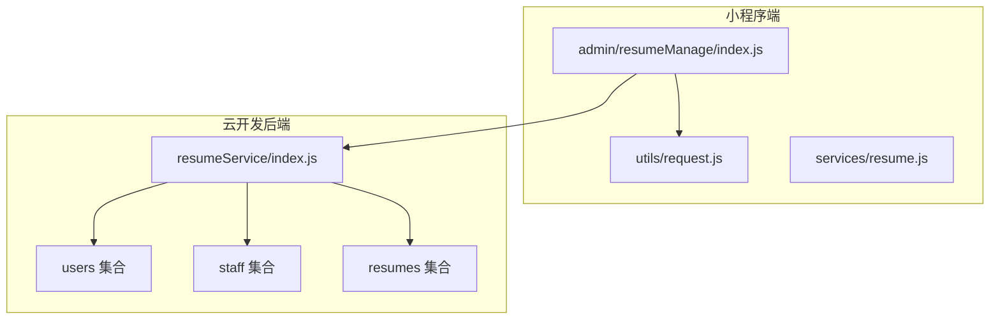
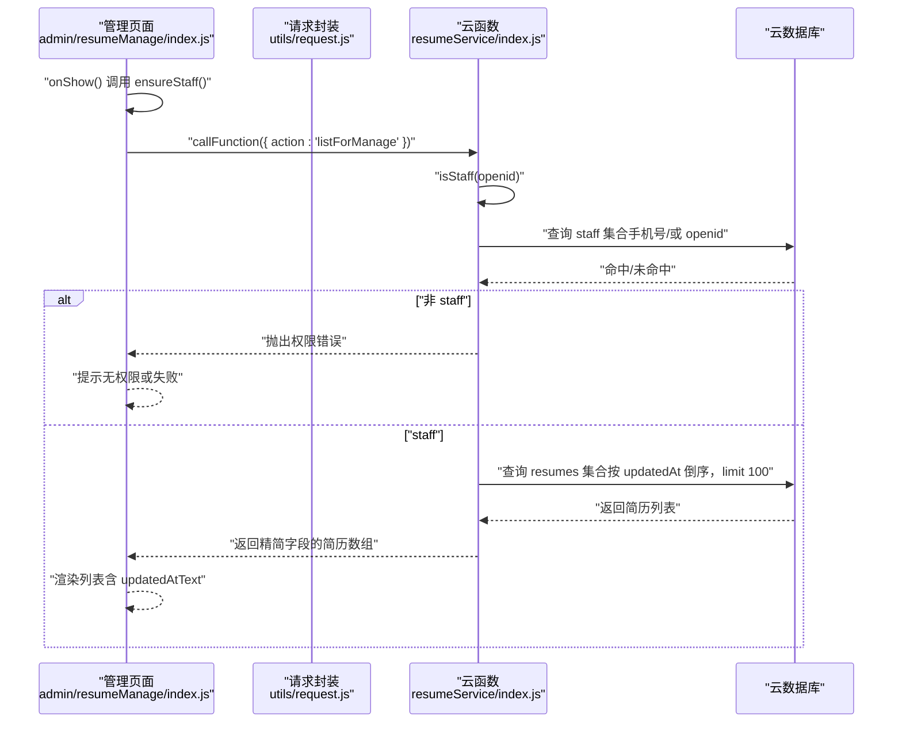
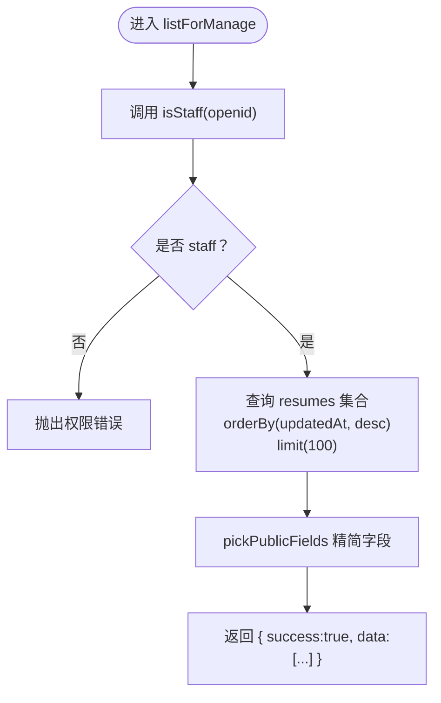
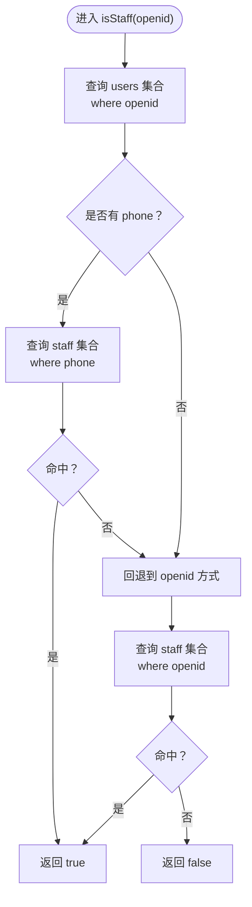
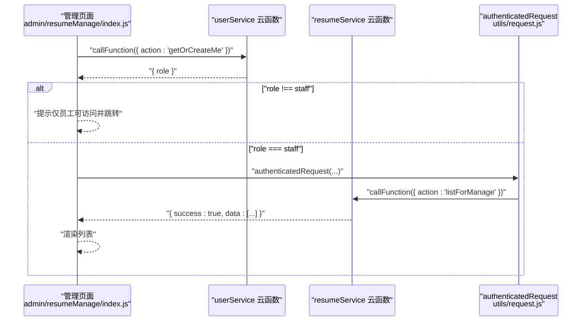
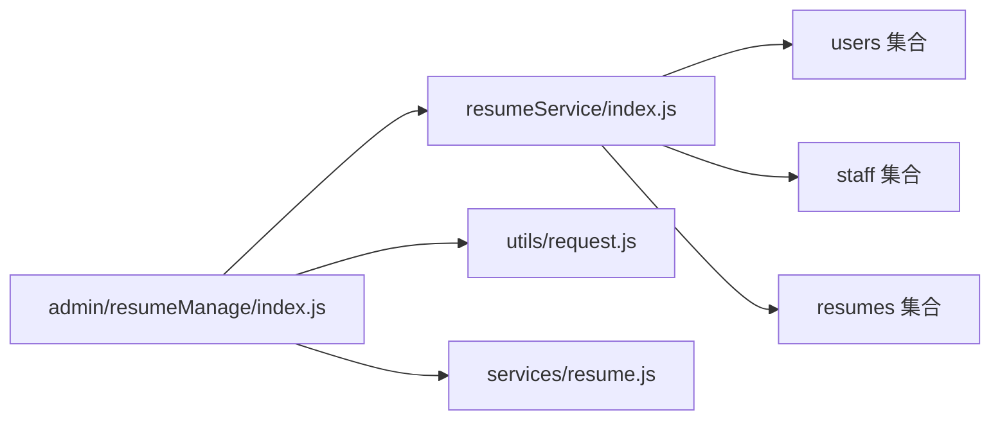

# 管理端简历列表接口

<cite>
**本文引用的文件**
- [cloudfunctions/resumeService/index.js](file://cloudfunctions/resumeService/index.js)
- [miniprogram/pages/admin/resumeManage/index.js](file://miniprogram/pages/admin/resumeManage/index.js)
- [miniprogram/services/resume.js](file://miniprogram/services/resume.js)
- [miniprogram/utils/request.js](file://miniprogram/utils/request.js)
- [API完整文档.md](file://API完整文档.md)
- [PRD.md](file://PRD.md)
- [docs/简历管理方案深度分析.md](file://docs/简历管理方案深度分析.md)
</cite>

## 目录
1. [简介](#简介)
2. [项目结构](#项目结构)
3. [核心组件](#核心组件)
4. [架构总览](#架构总览)
5. [详细组件分析](#详细组件分析)
6. [依赖关系分析](#依赖关系分析)
7. [性能考量](#性能考量)
8. [故障排查指南](#故障排查指南)
9. [结论](#结论)
10. [附录](#附录)

## 简介
本文件针对“管理端简历列表接口（listForManage）”进行完整技术说明，明确其专供员工管理后台使用，必须通过 staff 角色权限校验（通过 isStaff 函数验证 openid 或绑定手机号是否存在于 staff 集合）。接口返回所有简历（包括 draft 和 published 状态），按更新时间倒序排列，并限制最多 100 条记录。同时，本文对比普通 list 接口，指出其核心差异：无状态过滤、有权限控制、无分页支持。结合前端页面 miniprogram/pages/admin/resumeManage/index.js 的逻辑，说明前端如何通过 authenticatedRequest 安全调用该接口。最后给出性能建议与 API 文档缺失问题的修正说明。

## 项目结构
- 后端云函数：resumeService 提供 listForManage 等简历管理能力，内部通过 isStaff 校验 staff 角色。
- 前端小程序：admin 页面通过云函数调用 resumeService 的 listForManage，展示简历列表。
- 前端请求封装：utils/request.js 提供 publicRequest/ authenticatedRequest，默认 request 自动判断是否需要 Token。
- 文档与规范：PRD.md 明确权限矩阵与接口职责；API完整文档.md 为 CRM 后台 API 文档，与本接口不在同一后端链路。

图表来源
- [cloudfunctions/resumeService/index.js](file://cloudfunctions/resumeService/index.js#L1-L216)
- [miniprogram/pages/admin/resumeManage/index.js](file://miniprogram/pages/admin/resumeManage/index.js#L1-L112)
- [miniprogram/utils/request.js](file://miniprogram/utils/request.js#L1-L125)

章节来源
- [cloudfunctions/resumeService/index.js](file://cloudfunctions/resumeService/index.js#L1-L216)
- [miniprogram/pages/admin/resumeManage/index.js](file://miniprogram/pages/admin/resumeManage/index.js#L1-L112)
- [miniprogram/utils/request.js](file://miniprogram/utils/request.js#L1-L125)

## 核心组件
- listForManage 云函数：执行 staff 权限校验，查询 resumes 集合，按 updatedAt 倒序返回最多 100 条记录，字段经 pickPublicFields 精简。
- isStaff：优先通过用户绑定手机号判断是否 staff，否则回退到 openid 判断。
- 前端 admin 页面：在 onShow 时先确保 staff 角色，再调用云函数 listForManage 获取数据。
- 请求封装：authenticatedRequest 自动携带 Bearer Token，用于需要登录态的接口调用。

章节来源
- [cloudfunctions/resumeService/index.js](file://cloudfunctions/resumeService/index.js#L26-L56)
- [cloudfunctions/resumeService/index.js](file://cloudfunctions/resumeService/index.js#L122-L133)
- [miniprogram/pages/admin/resumeManage/index.js](file://miniprogram/pages/admin/resumeManage/index.js#L29-L71)
- [miniprogram/utils/request.js](file://miniprogram/utils/request.js#L43-L103)

## 架构总览
下面的序列图展示了管理端简历列表接口的调用链路与权限校验流程。

图表来源
- [cloudfunctions/resumeService/index.js](file://cloudfunctions/resumeService/index.js#L26-L56)
- [cloudfunctions/resumeService/index.js](file://cloudfunctions/resumeService/index.js#L122-L133)
- [miniprogram/pages/admin/resumeManage/index.js](file://miniprogram/pages/admin/resumeManage/index.js#L29-L71)

## 详细组件分析

### listForManage 接口实现
- 权限校验：调用 isStaff(openid)，若非 staff 直接抛错。
- 数据查询：不带状态过滤，直接查询 resumes 集合，按 updatedAt 降序排序，限制 100 条。
- 字段精简：通过 pickPublicFields 返回公开字段集，避免泄露敏感信息。
- 返回结构：success=true 且 data 为简历数组。

图表来源
- [cloudfunctions/resumeService/index.js](file://cloudfunctions/resumeService/index.js#L122-L133)
- [cloudfunctions/resumeService/index.js](file://cloudfunctions/resumeService/index.js#L58-L76)

章节来源
- [cloudfunctions/resumeService/index.js](file://cloudfunctions/resumeService/index.js#L122-L133)
- [cloudfunctions/resumeService/index.js](file://cloudfunctions/resumeService/index.js#L58-L76)

### isStaff 权限校验逻辑
- 优先通过用户绑定手机号判断：从 users 集合获取 openid 对应用户的 phone，若存在则查询 staff 集合中是否存在相同 phone。
- 兼容旧方式：若未绑定手机号或未命中，回退到查询 staff 集合中 openid 字段。
- 返回 true/false 表示是否 staff。

图表来源
- [cloudfunctions/resumeService/index.js](file://cloudfunctions/resumeService/index.js#L26-L56)

章节来源
- [cloudfunctions/resumeService/index.js](file://cloudfunctions/resumeService/index.js#L26-L56)

### 前端调用链路与安全封装
- 管理页面在 onShow 时先调用 ensureStaff，通过云函数 userService 的 getOrCreateMe 获取当前用户信息并判断 role 是否为 staff。
- 成功后调用 resumeService 的 listForManage，将返回的简历列表渲染到页面。
- 请求封装：authenticatedRequest 自动从本地缓存读取 access_token，若不存在则拒绝请求；当服务端返回 401 时主动清理本地 token 并引导重登。

图表来源
- [miniprogram/pages/admin/resumeManage/index.js](file://miniprogram/pages/admin/resumeManage/index.js#L29-L71)
- [miniprogram/utils/request.js](file://miniprogram/utils/request.js#L43-L103)

章节来源
- [miniprogram/pages/admin/resumeManage/index.js](file://miniprogram/pages/admin/resumeManage/index.js#L29-L71)
- [miniprogram/utils/request.js](file://miniprogram/utils/request.js#L43-L103)

### 与普通 list 接口的核心差异
- listForManage
  - 无状态过滤：不强制只返回 published，返回 draft/published。
  - 有权限控制：必须 staff 角色。
  - 无分页支持：固定 limit 100，不支持 page/pageSize。
- 普通 list（小程序侧）
  - 有状态过滤：默认只返回 published。
  - 无权限控制：普通用户可见。
  - 有分页支持：支持 page/pageSize，keyword 搜索。

章节来源
- [cloudfunctions/resumeService/index.js](file://cloudfunctions/resumeService/index.js#L78-L106)
- [cloudfunctions/resumeService/index.js](file://cloudfunctions/resumeService/index.js#L122-L133)
- [PRD.md](file://PRD.md#L262-L274)

## 依赖关系分析
- 云函数 resumeService 依赖云数据库集合：users、staff、resumes。
- 前端 admin 页面依赖 resumeService 云函数；请求封装依赖本地 token 存储。
- API完整文档.md 描述的是 CRM 后台 REST API，与本云函数接口不在同一后端链路。

图表来源
- [cloudfunctions/resumeService/index.js](file://cloudfunctions/resumeService/index.js#L1-L216)
- [miniprogram/pages/admin/resumeManage/index.js](file://miniprogram/pages/admin/resumeManage/index.js#L1-L112)
- [miniprogram/utils/request.js](file://miniprogram/utils/request.js#L1-L125)

章节来源
- [cloudfunctions/resumeService/index.js](file://cloudfunctions/resumeService/index.js#L1-L216)
- [miniprogram/pages/admin/resumeManage/index.js](file://miniprogram/pages/admin/resumeManage/index.js#L1-L112)
- [miniprogram/utils/request.js](file://miniprogram/utils/request.js#L1-L125)

## 性能考量
- 当前实现
  - listForManage 固定 limit 100，无分页，适合小规模后台浏览。
  - 查询未带 keyword 搜索，适合快速浏览全部简历。
- 大数据量下的优化方向（建议）
  - 增加分页：引入 page/pageSize 参数，配合 totalCount 返回，前端按需加载。
  - 增加索引：在 resumes 上建立 updatedAt 降序索引，limit 100 的场景下提升查询性能。
  - 增加筛选：支持按状态、城市、姓名等维度筛选，减少无效数据传输。
  - 增加 keyword 搜索：支持模糊匹配，降低前端二次处理成本。
  - 前端懒加载：结合虚拟滚动或无限滚动，避免一次性渲染过多节点。
  - 服务端分页：在 resumeService 中实现分页逻辑，避免一次性返回大量数据。

章节来源
- [cloudfunctions/resumeService/index.js](file://cloudfunctions/resumeService/index.js#L122-L133)

## 故障排查指南
- “无权限或失败”
  - 可能原因：当前用户非 staff，isStaff 校验失败。
  - 建议：确认 staff 集合中是否存在该用户的 phone 或 openid；检查用户登录态是否正确。
- “仅员工可访问”
  - 可能原因：ensureStaff 判断 role 非 staff。
  - 建议：确认员工已在 staff 集合中维护；检查前端 token 是否过期。
- “网络请求失败/401”
  - 可能原因：authenticatedRequest 未检测到 token 或服务端返回 401。
  - 建议：检查本地 token 存储；确认登录流程正常；必要时重新登录。

章节来源
- [miniprogram/pages/admin/resumeManage/index.js](file://miniprogram/pages/admin/resumeManage/index.js#L29-L71)
- [miniprogram/utils/request.js](file://miniprogram/utils/request.js#L43-L103)

## 结论
listForManage 接口专为员工管理后台设计，具备严格的 staff 权限校验、无状态过滤、无分页支持与固定上限的特点。其与普通 list 接口在权限、过滤与分页方面存在显著差异。前端通过云函数安全调用，配合权限校验与错误处理，保证了后台管理的安全与可用。对于大规模数据场景，建议在保持权限不变的前提下引入分页、索引与筛选能力，以提升性能与用户体验。

## 附录

### API 定义与调用说明
- 云函数入口
  - action: listForManage
  - 输入：无（使用 openid 作为鉴权依据）
  - 输出：success=true 且 data 为简历数组（最多 100 条，按 updatedAt 倒序）
- 前端调用
  - 管理页面在 onShow 时调用云函数 resumeService 的 listForManage。
  - authenticatedRequest 自动携带 Bearer Token，若未登录则拒绝请求。
- 与 CRM 后台 API 的区别
  - 本接口为云函数调用，使用 wx.cloud.callFunction；CRM 后台 API 文档见 API完整文档.md，二者属于不同后端链路。

章节来源
- [cloudfunctions/resumeService/index.js](file://cloudfunctions/resumeService/index.js#L180-L215)
- [miniprogram/pages/admin/resumeManage/index.js](file://miniprogram/pages/admin/resumeManage/index.js#L51-L71)
- [miniprogram/utils/request.js](file://miniprogram/utils/request.js#L43-L103)
- [API完整文档.md](file://API完整文档.md#L1-L120)

### 与 PRD 的一致性核对
- 权限矩阵
  - 管理列表（listForManage）：仅 staff 可用，强校验 staff。
- 接口职责
  - listForManage：返回最多 100 条（含 draft/published），按 updatedAt 倒序。
- 前端入口
  - 管理页 onShow 先拉取 me 并做 staff 校验，再调用 listForManage。

章节来源
- [PRD.md](file://PRD.md#L262-L274)
- [PRD.md](file://PRD.md#L301-L301)

### API 文档缺失问题修正
- 现状：API完整文档.md 未收录 listForManage 接口。
- 建议：在 API完整文档.md 中新增“管理端简历列表（listForManage）”条目，明确：
  - 接口用途：仅员工后台使用
  - 认证方式：Bearer Token（与 CRM 后台一致）
  - 请求参数：无
  - 响应字段：success、data（简历数组，最多 100 条）
  - 权限要求：staff
  - 与普通 list 的差异：无状态过滤、无分页、无 keyword 搜索
  - 与云函数接口的关系：本仓库为云函数实现，CRM 文档为 REST API 文档，二者不同链路

章节来源
- [API完整文档.md](file://API完整文档.md#L1-L120)
- [cloudfunctions/resumeService/index.js](file://cloudfunctions/resumeService/index.js#L180-L215)