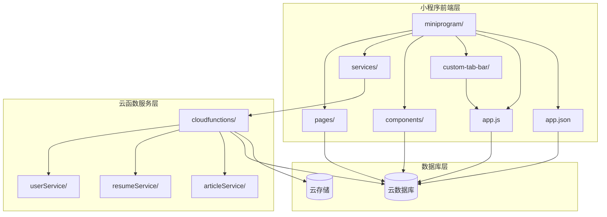
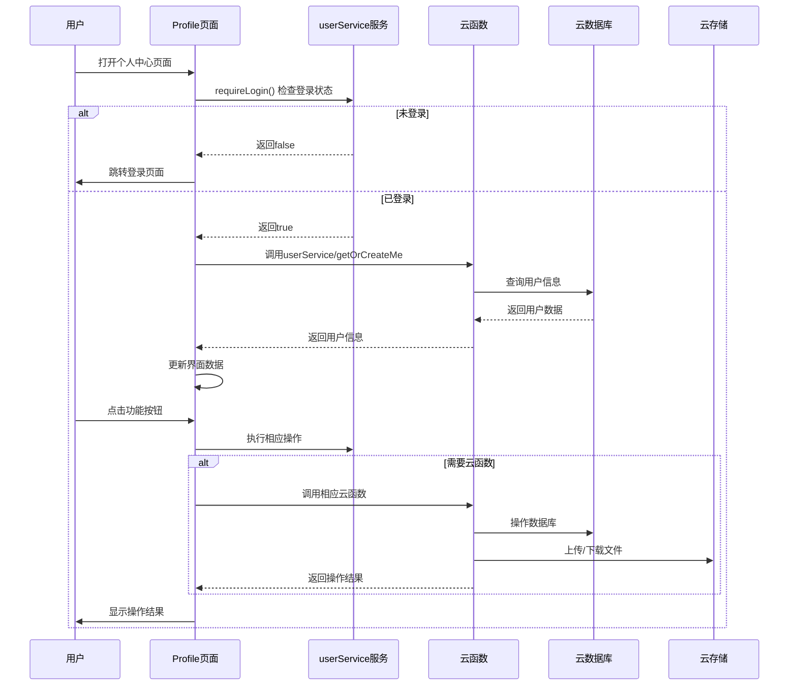
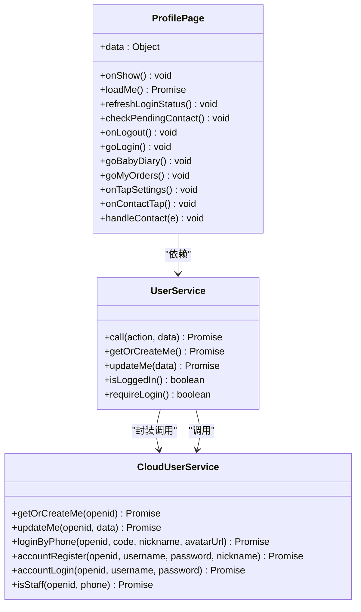
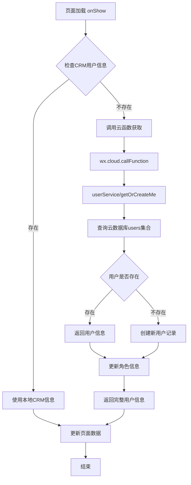
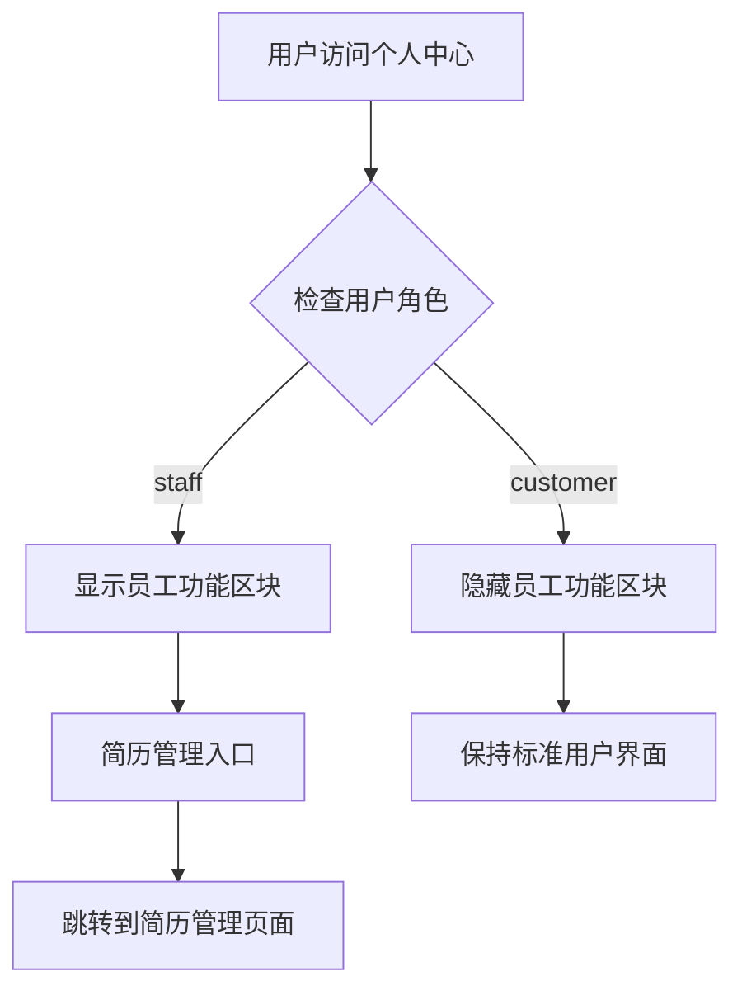
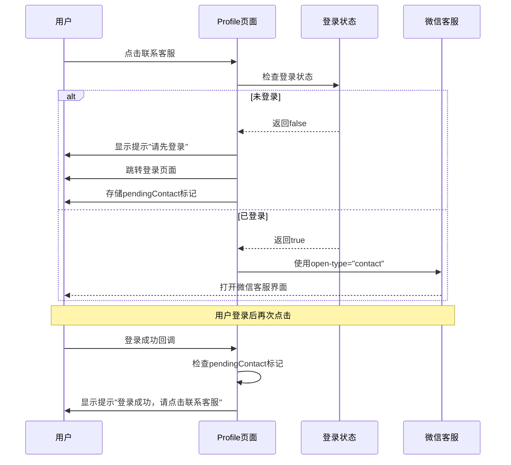
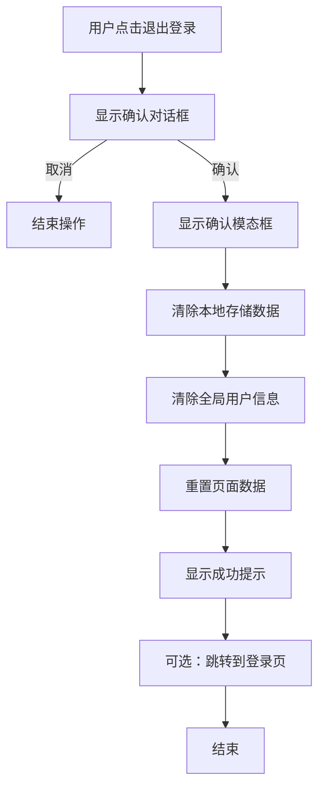
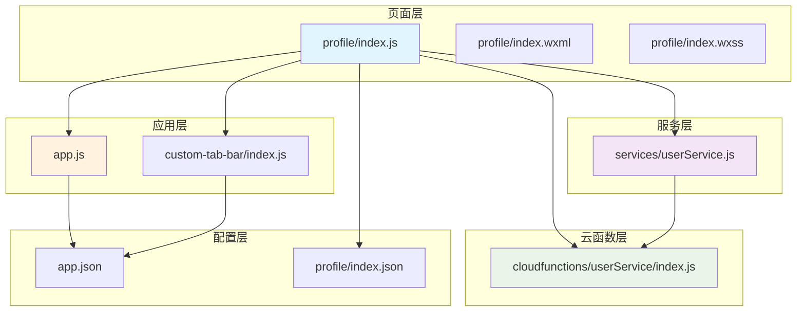

# Profile Page Enhancement

<cite>
**本文档引用的文件**
- [miniprogram/pages/profile/index.js](file://miniprogram/pages/profile/index.js)
- [miniprogram/pages/profile/index.json](file://miniprogram/pages/profile/index.json)
- [miniprogram/pages/profile/index.wxml](file://miniprogram/pages/profile/index.wxml)
- [miniprogram/pages/profile/index.wxss](file://miniprogram/pages/profile/index.wxss)
- [miniprogram/services/userService.js](file://miniprogram/services/userService.js)
- [cloudfunctions/userService/index.js](file://cloudfunctions/userService/index.js)
- [miniprogram/app.js](file://miniprogram/app.js)
- [miniprogram/pages/login/index.js](file://miniprogram/pages/login/index.js)
- [miniprogram/pages/settings/index.js](file://miniprogram/pages/settings/index.js)
- [miniprogram/custom-tab-bar/index.js](file://miniprogram/custom-tab-bar/index.js)
- [miniprogram/app.json](file://miniprogram/app.json)
- [PRD.md](file://PRD.md)
</cite>

## 目录
1. [简介](#简介)
2. [项目结构](#项目结构)
3. [核心组件](#核心组件)
4. [架构概览](#架构概览)
5. [详细组件分析](#详细组件分析)
6. [依赖关系分析](#依赖关系分析)
7. [性能考虑](#性能考虑)
8. [故障排除指南](#故障排除指南)
9. [结论](#结论)

## 简介

本文档详细分析了"安得褓贝"微信小程序中的个人中心页面增强方案。该项目是一个专注于月嫂/育婴师简历展示与管理的小程序，个人中心页面作为用户身份管理和功能入口的核心模块，承担着用户信息展示、功能导航、权限控制等重要职责。

个人中心页面经过重构后，采用了更加现代化的设计理念和用户体验优化策略，包括渐变色彩主题、响应式布局、智能权限控制等功能特性。该页面不仅展示了用户的基本信息，还提供了完整的功能导航体系，包括员工专属功能入口、服务快捷方式、设置选项等。

## 项目结构

项目采用典型的微信小程序三层架构设计：



**图表来源**
- [miniprogram/app.json:1-81](file://miniprogram/app.json#L1-L81)
- [miniprogram/app.js:1-144](file://miniprogram/app.js#L1-L144)

**章节来源**
- [miniprogram/app.json:1-81](file://miniprogram/app.json#L1-L81)
- [miniprogram/app.js:1-144](file://miniprogram/app.js#L1-L144)

## 核心组件

个人中心页面由四个主要部分组成：

### 1. 用户信息展示区
- **头像展示**：支持微信头像、自定义头像、占位符头像
- **昵称显示**：支持微信昵称、自定义昵称、登录提示
- **角色标识**：根据用户权限动态显示员工标签

### 2. 功能导航区
- **员工功能**：仅对员工用户显示简历管理入口
- **服务快捷方式**：我的订单、宝贝日记等常用功能
- **设置入口**：个人资料修改、帮助、设置等

### 3. 权限控制区
- **登录保护**：未登录用户的功能限制
- **客服入口**：智能客服连接机制
- **退出登录**：安全的用户登出流程

### 4. 响应式设计
- **移动端适配**：基于rpx的响应式布局
- **渐变主题**：紫色渐变的视觉设计
- **交互反馈**：完整的点击状态和动画效果

**章节来源**
- [miniprogram/pages/profile/index.js:1-180](file://miniprogram/pages/profile/index.js#L1-L180)
- [miniprogram/pages/profile/index.wxml:1-71](file://miniprogram/pages/profile/index.wxml#L1-L71)
- [miniprogram/pages/profile/index.wxss:1-289](file://miniprogram/pages/profile/index.wxss#L1-L289)

## 架构概览

个人中心页面采用MVVM架构模式，结合云开发的无服务器架构：



**图表来源**
- [miniprogram/pages/profile/index.js:12-25](file://miniprogram/pages/profile/index.js#L12-L25)
- [miniprogram/services/userService.js:33-37](file://miniprogram/services/userService.js#L33-L37)
- [cloudfunctions/userService/index.js:412-457](file://cloudfunctions/userService/index.js#L412-L457)

**章节来源**
- [miniprogram/pages/profile/index.js:12-103](file://miniprogram/pages/profile/index.js#L12-L103)
- [cloudfunctions/userService/index.js:50-94](file://cloudfunctions/userService/index.js#L50-L94)

## 详细组件分析

### 用户信息服务组件

用户信息服务是个人中心页面的核心支撑组件，负责用户身份验证、信息获取和权限控制：



**图表来源**
- [miniprogram/services/userService.js:1-45](file://miniprogram/services/userService.js#L1-L45)
- [cloudfunctions/userService/index.js:50-94](file://cloudfunctions/userService/index.js#L50-L94)
- [miniprogram/pages/profile/index.js:1-180](file://miniprogram/pages/profile/index.js#L1-L180)

#### 用户信息获取流程

个人中心页面的用户信息获取采用了双重缓存策略：



**图表来源**
- [miniprogram/pages/profile/index.js:28-64](file://miniprogram/pages/profile/index.js#L28-L64)
- [cloudfunctions/userService/index.js:50-94](file://cloudfunctions/userService/index.js#L50-L94)

#### 登录状态管理

登录状态管理采用了多层次的检查机制：

| 检查层级 | 检查内容 | 实现方式 | 失败处理 |
|---------|---------|---------|---------|
| 本地存储检查 | `crmUserInfo` | `wx.getStorageSync('crmUserInfo')` | 跳转登录页 |
| 云函数检查 | 用户存在性 | `userService/getOrCreateMe` | 跳转登录页 |
| 权限验证 | `phone` 字段存在 | `crmUserInfo.phone` | 跳转登录页 |
| 实时同步 | `isLoggedIn()` 方法 | `userService.isLoggedIn()` | 状态更新 |

**章节来源**
- [miniprogram/pages/profile/index.js:84-103](file://miniprogram/pages/profile/index.js#L84-L103)
- [miniprogram/services/userService.js:27-37](file://miniprogram/services/userService.js#L27-L37)

### 功能导航组件

个人中心页面的功能导航采用了模块化设计，根据不同用户角色显示相应的功能入口：

```mermaid
graph LR
subgraph "用户角色"
A[访客/普通用户]
B[员工(staff)]
end
subgraph "功能模块"
C[用户信息展示]
D[服务快捷方式]
E[设置入口]
F[员工专属功能]
end
A --> C
A --> D
A --> E
B --> C
B --> D
B --> E
B --> F
F --> G[简历管理]
```

**图表来源**
- [miniprogram/pages/profile/index.wxml:15-22](file://miniprogram/pages/profile/index.wxml#L15-L22)
- [miniprogram/pages/profile/index.wxml:24-41](file://miniprogram/pages/profile/index.wxml#L24-L41)

#### 员工功能入口

员工功能入口仅对具有 `staff` 角色的用户开放：



**图表来源**
- [miniprogram/pages/profile/index.wxml:16-22](file://miniprogram/pages/profile/index.wxml#L16-L22)

**章节来源**
- [miniprogram/pages/profile/index.wxml:15-67](file://miniprogram/pages/profile/index.wxml#L15-L67)

### 客服功能增强

个人中心页面的客服功能采用了智能连接机制：



**图表来源**
- [miniprogram/pages/profile/index.js:70-103](file://miniprogram/pages/profile/index.js#L70-L103)

**章节来源**
- [miniprogram/pages/profile/index.js:70-108](file://miniprogram/pages/profile/index.js#L70-L108)

### 退出登录流程

退出登录采用了安全的清理机制：



**图表来源**
- [miniprogram/pages/profile/index.js:140-178](file://miniprogram/pages/profile/index.js#L140-L178)

**章节来源**
- [miniprogram/pages/profile/index.js:140-178](file://miniprogram/pages/profile/index.js#L140-L178)

## 依赖关系分析

个人中心页面的依赖关系呈现清晰的层次结构：



**图表来源**
- [miniprogram/pages/profile/index.js:1](file://miniprogram/pages/profile/index.js#L1)
- [miniprogram/services/userService.js:1](file://miniprogram/services/userService.js#L1)
- [cloudfunctions/userService/index.js:1](file://cloudfunctions/userService/index.js#L1)

### 核心依赖关系

| 依赖方向 | 依赖源 | 依赖目标 | 作用说明 |
|---------|--------|---------|---------|
| 页面依赖 | profile/index.js | services/userService.js | 用户服务封装 |
| 服务依赖 | services/userService.js | cloudfunctions/userService/index.js | 云函数调用 |
| 页面依赖 | profile/index.js | app.js | 应用全局状态 |
| 页面依赖 | profile/index.js | custom-tab-bar/index.js | 自定义tabbar |
| 配置依赖 | app.js | app.json | 应用配置 |
| 页面依赖 | profile/index.js | profile/index.json | 页面配置 |

**章节来源**
- [miniprogram/pages/profile/index.js:1](file://miniprogram/pages/profile/index.js#L1)
- [miniprogram/services/userService.js:1](file://miniprogram/services/userService.js#L1)
- [cloudfunctions/userService/index.js:1](file://cloudfunctions/userService/index.js#L1)

## 性能考虑

个人中心页面在性能优化方面采用了多项策略：

### 1. 缓存策略
- **本地存储缓存**：`crmUserInfo` 和 `token` 的持久化存储
- **云函数缓存**：用户信息的云端缓存机制
- **页面状态缓存**：TabBar选中状态的实时同步

### 2. 异步处理
- **Promise链式调用**：避免回调地狱，提升代码可读性
- **并发操作**：多个异步操作的并行执行
- **错误处理**：完善的异常捕获和错误提示

### 3. 资源优化
- **按需加载**：功能模块的条件渲染
- **图片优化**：头像的懒加载和缓存
- **样式复用**：CSS类名的统一管理和复用

## 故障排除指南

### 常见问题及解决方案

#### 1. 用户信息加载失败
**问题现象**：个人中心页面显示空白或加载失败
**可能原因**：
- 云函数调用失败
- 网络连接异常
- 用户未授权

**解决步骤**：
1. 检查云函数部署状态
2. 验证网络连接
3. 重新授权用户信息
4. 查看控制台错误日志

#### 2. 登录状态异常
**问题现象**：已登录用户仍被重定向到登录页
**可能原因**：
- 本地存储数据损坏
- 云函数返回数据格式错误
- 缓存同步问题

**解决步骤**：
1. 清除本地存储的用户信息
2. 重新调用云函数获取用户信息
3. 检查用户角色判断逻辑
4. 验证权限验证流程

#### 3. 客服功能失效
**问题现象**：联系客服按钮无响应
**可能原因**：
- 用户未登录
- 微信客服配置问题
- 权限不足

**解决步骤**：
1. 确认用户登录状态
2. 检查微信客服配置
3. 验证用户权限
4. 测试客服连接功能

**章节来源**
- [miniprogram/pages/profile/index.js:60-63](file://miniprogram/pages/profile/index.js#L60-L63)
- [miniprogram/services/userService.js:10-14](file://miniprogram/services/userService.js#L10-L14)

## 结论

个人中心页面的增强实现了以下关键改进：

### 技术成就
1. **完整的用户身份管理体系**：实现了从本地存储到云端数据库的多层用户信息管理
2. **智能权限控制**：基于角色的动态功能展示和访问控制
3. **响应式设计**：适配不同屏幕尺寸的现代化UI设计
4. **安全的登录流程**：完整的登录状态管理和退出机制

### 用户体验提升
1. **直观的信息展示**：清晰的用户信息和功能导航
2. **流畅的操作流程**：简化的工作流和即时反馈
3. **个性化设置**：支持用户头像和昵称的自定义
4. **便捷的功能入口**：常用功能的一键访问

### 架构优势
1. **模块化设计**：清晰的组件分离和职责划分
2. **可扩展性**：易于添加新功能和修改现有功能
3. **可维护性**：规范的代码结构和详细的注释
4. **性能优化**：合理的缓存策略和异步处理

该个人中心页面为整个"安得褓贝"小程序奠定了坚实的基础，不仅满足了当前的功能需求，还为未来的功能扩展预留了充足的空间。通过采用现代化的技术栈和设计理念，确保了系统的稳定性和可维护性。