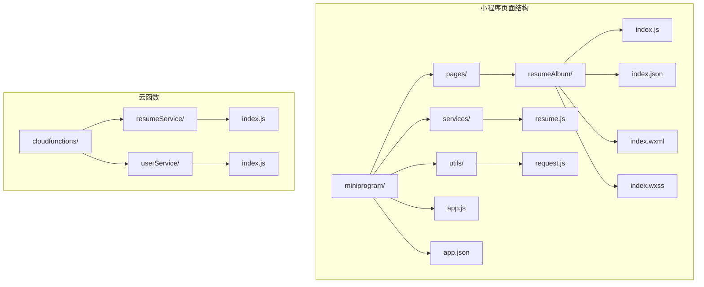
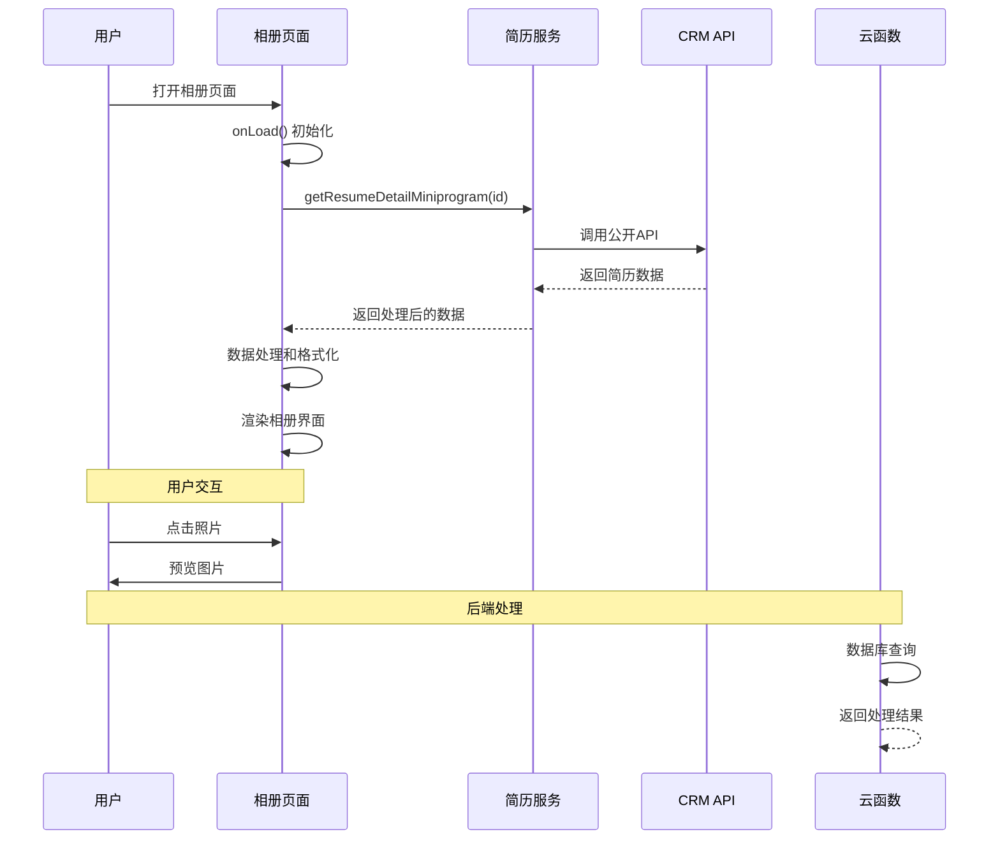
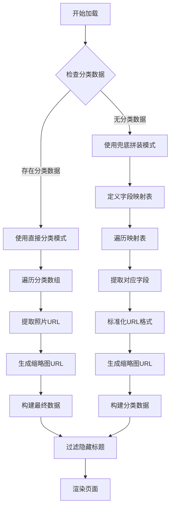
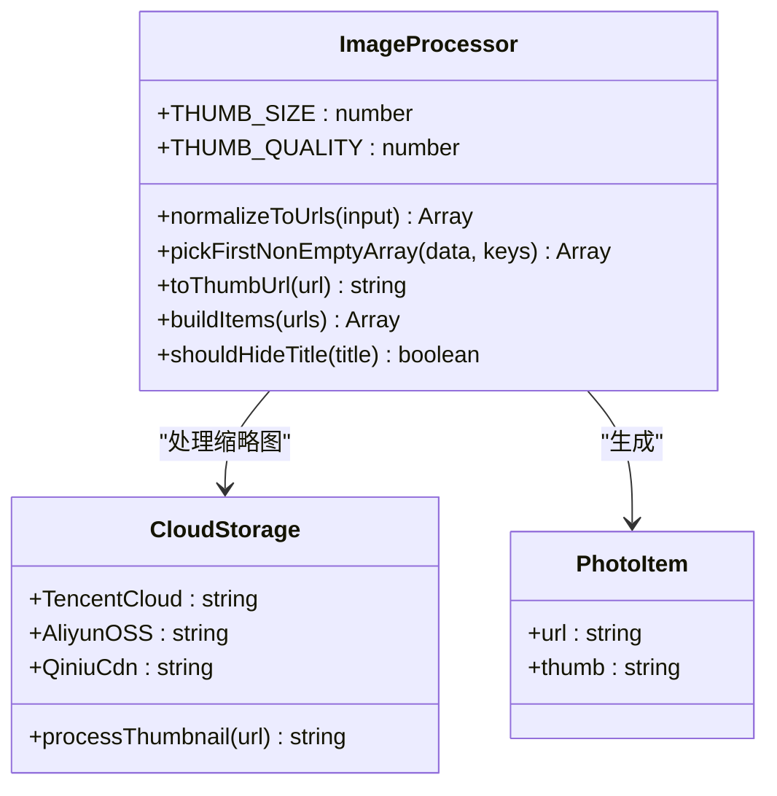
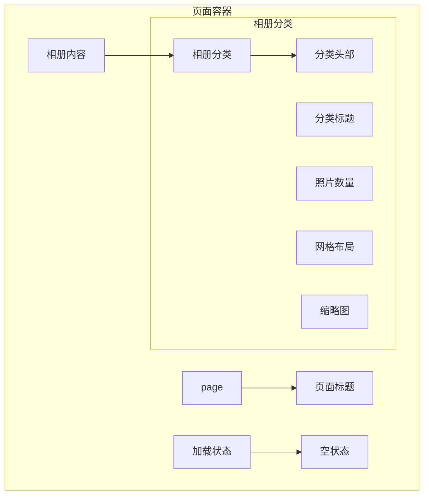
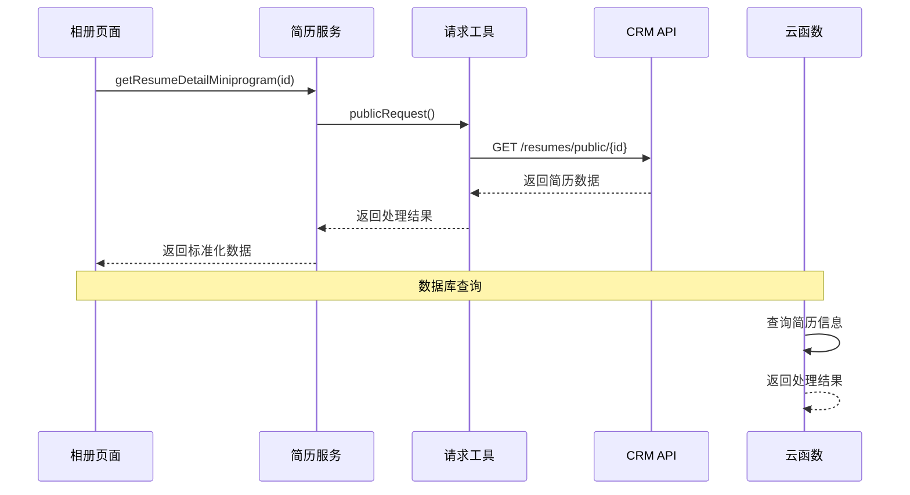
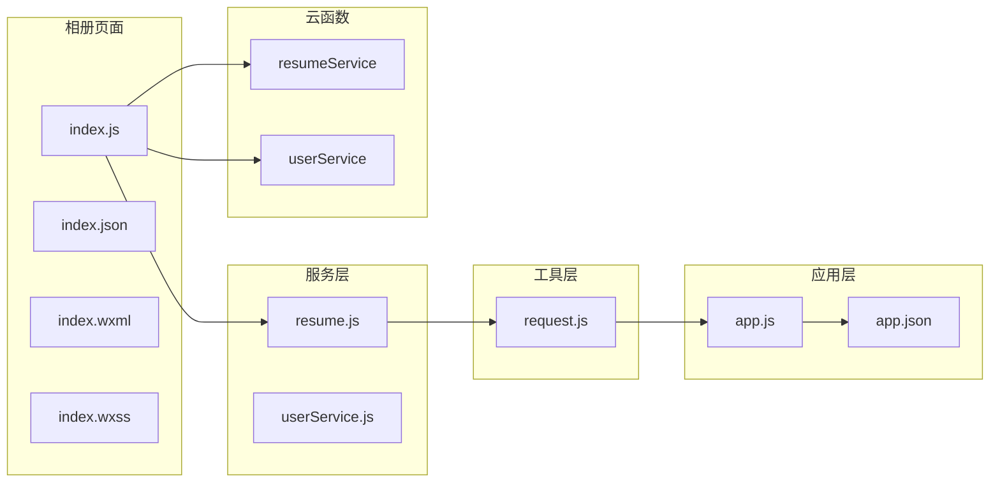

# 简历相册页面文档

<cite>
**本文档引用的文件**
- [miniprogram/pages/resumeAlbum/index.js](file://miniprogram/pages/resumeAlbum/index.js)
- [miniprogram/pages/resumeAlbum/index.json](file://miniprogram/pages/resumeAlbum/index.json)
- [miniprogram/pages/resumeAlbum/index.wxml](file://miniprogram/pages/resumeAlbum/index.wxml)
- [miniprogram/pages/resumeAlbum/index.wxss](file://miniprogram/pages/resumeAlbum/index.wxss)
- [miniprogram/services/resume.js](file://miniprogram/services/resume.js)
- [miniprogram/utils/request.js](file://miniprogram/utils/request.js)
- [miniprogram/pages/resumeDetail/index.js](file://miniprogram/pages/resumeDetail/index.js)
- [miniprogram/pages/resumeList/index.js](file://miniprogram/pages/resumeList/index.js)
- [miniprogram/app.js](file://miniprogram/app.js)
- [miniprogram/app.json](file://miniprogram/app.json)
- [cloudfunctions/resumeService/index.js](file://cloudfunctions/resumeService/index.js)
- [cloudfunctions/userService/index.js](file://cloudfunctions/userService/index.js)
</cite>

## 目录
1. [简介](#简介)
2. [项目结构](#项目结构)
3. [核心组件](#核心组件)
4. [架构概览](#架构概览)
5. [详细组件分析](#详细组件分析)
6. [依赖关系分析](#依赖关系分析)
7. [性能考虑](#性能考虑)
8. [故障排除指南](#故障排除指南)
9. [结论](#结论)

## 简介

简历相册页面是安得褓贝小程序中的一个重要功能模块，专门用于展示和浏览保姆的个人相册内容。该页面提供了直观的网格布局来展示不同分类的照片，包括个人照片、月子餐、烹饪、辅食、好评展示、体检报告等类别。用户可以通过下拉刷新来更新相册内容，点击任意照片可以进行预览查看。

该页面采用现代化的小程序开发技术栈，集成了云端存储、图片处理、响应式设计等特性，为用户提供流畅的相册浏览体验。

## 项目结构

安得褓贝项目采用标准的小程序目录结构，简历相册页面位于 `miniprogram/pages/resumeAlbum/` 目录下，包含完整的页面文件：

**图表来源**
- [miniprogram/pages/resumeAlbum/index.js:1-211](file://miniprogram/pages/resumeAlbum/index.js#L1-L211)
- [miniprogram/services/resume.js:1-239](file://miniprogram/services/resume.js#L1-L239)
- [cloudfunctions/resumeService/index.js:1-216](file://cloudfunctions/resumeService/index.js#L1-L216)

**章节来源**
- [miniprogram/pages/resumeAlbum/index.js:1-211](file://miniprogram/pages/resumeAlbum/index.js#L1-L211)
- [miniprogram/app.json:1-81](file://miniprogram/app.json#L1-L81)

## 核心组件

简历相册页面由多个核心组件构成，每个组件都有特定的功能职责：

### 页面组件
- **index.js**: 主要逻辑处理，包括数据加载、图片处理、用户交互
- **index.json**: 页面配置，设置导航栏样式和下拉刷新功能
- **index.wxml**: 页面结构模板，定义相册网格布局
- **index.wxss**: 样式文件，提供美观的视觉效果

### 服务组件
- **resume.js**: 简历服务封装，提供与CRM系统的API接口
- **request.js**: HTTP请求工具，处理网络通信和错误处理

### 云函数组件
- **resumeService**: 云函数，处理简历数据的增删改查操作
- **userService**: 用户服务云函数，管理用户认证和权限

**章节来源**
- [miniprogram/pages/resumeAlbum/index.js:99-211](file://miniprogram/pages/resumeAlbum/index.js#L99-L211)
- [miniprogram/services/resume.js:1-239](file://miniprogram/services/resume.js#L1-L239)

## 架构概览

简历相册页面采用前后端分离的架构设计，结合小程序原生能力和云开发服务：

**图表来源**
- [miniprogram/pages/resumeAlbum/index.js:112-191](file://miniprogram/pages/resumeAlbum/index.js#L112-L191)
- [miniprogram/services/resume.js:92-99](file://miniprogram/services/resume.js#L92-L99)
- [cloudfunctions/resumeService/index.js:180-216](file://cloudfunctions/resumeService/index.js#L180-L216)

## 详细组件分析

### 相册页面核心逻辑

相册页面的核心逻辑集中在数据处理和图片缩略图生成两个方面：

#### 数据处理机制

页面支持两种数据获取模式：

1. **直接分类模式**: 直接使用CRM返回的分类数据
2. **兜底拼装模式**: 通过预定义的字段映射规则拼装相册数据

**图表来源**
- [miniprogram/pages/resumeAlbum/index.js:131-185](file://miniprogram/pages/resumeAlbum/index.js#L131-L185)

#### 图片缩略图生成

页面实现了智能的图片缩略图生成机制，支持多种云存储平台：

**图表来源**
- [miniprogram/pages/resumeAlbum/index.js:10-97](file://miniprogram/pages/resumeAlbum/index.js#L10-L97)

**章节来源**
- [miniprogram/pages/resumeAlbum/index.js:10-97](file://miniprogram/pages/resumeAlbum/index.js#L10-L97)

### 页面渲染结构

相册页面采用响应式网格布局，提供良好的用户体验：

#### 界面布局设计

**图表来源**
- [miniprogram/pages/resumeAlbum/index.wxml:1-35](file://miniprogram/pages/resumeAlbum/index.wxml#L1-L35)

#### 样式设计特点

页面采用了现代化的设计理念：

- **色彩搭配**: 使用柔和的紫色主题(#F7F5FF背景色)
- **阴影效果**: 为相册卡片添加阴影增强层次感
- **圆角设计**: 统一的圆角边框提升视觉效果
- **网格布局**: 3列等分布局，适配不同屏幕尺寸

**章节来源**
- [miniprogram/pages/resumeAlbum/index.wxss:1-68](file://miniprogram/pages/resumeAlbum/index.wxss#L1-L68)

### 服务层集成

相册页面通过服务层与后端系统进行交互：

#### API调用流程

**图表来源**
- [miniprogram/services/resume.js:92-99](file://miniprogram/services/resume.js#L92-L99)
- [miniprogram/utils/request.js:12-41](file://miniprogram/utils/request.js#L12-L41)

**章节来源**
- [miniprogram/services/resume.js:1-239](file://miniprogram/services/resume.js#L1-L239)
- [miniprogram/utils/request.js:1-125](file://miniprogram/utils/request.js#L1-L125)

## 依赖关系分析

简历相册页面的依赖关系相对简单，主要依赖于服务层和工具层：

**图表来源**
- [miniprogram/pages/resumeAlbum/index.js:1-3](file://miniprogram/pages/resumeAlbum/index.js#L1-L3)
- [miniprogram/services/resume.js](file://miniprogram/services/resume.js#L6)

### 依赖特点

1. **单向依赖**: 页面只依赖服务层，不反向依赖其他页面
2. **松耦合**: 服务层通过统一的接口抽象，降低页面复杂度
3. **可扩展性**: 新增功能只需扩展服务层接口，不影响页面逻辑

**章节来源**
- [miniprogram/pages/resumeAlbum/index.js:1-3](file://miniprogram/pages/resumeAlbum/index.js#L1-L3)
- [miniprogram/services/resume.js:1-239](file://miniprogram/services/resume.js#L1-L239)

## 性能考虑

相册页面在性能优化方面采用了多项措施：

### 图片加载优化

1. **懒加载**: 使用 `lazy-load` 属性实现图片懒加载
2. **缩略图生成**: 自动为图片生成适合移动端显示的缩略图
3. **缓存策略**: 利用云存储的CDN加速和浏览器缓存

### 数据处理优化

1. **去重处理**: 自动去除重复的图片URL
2. **异步加载**: 使用 `async/await` 实现异步数据处理
3. **错误处理**: 完善的错误捕获和降级处理

### 网络请求优化

1. **请求合并**: 合并多个API调用减少网络请求次数
2. **超时控制**: 设置合理的请求超时时间
3. **重试机制**: 在网络不稳定时提供重试机会

## 故障排除指南

### 常见问题及解决方案

#### 相册内容为空

**问题描述**: 相册页面显示"暂无相册内容"

**可能原因**:
1. 简历ID无效或不存在
2. CRM系统中没有配置相册数据
3. 网络连接异常

**解决方案**:
1. 检查简历ID是否正确传递
2. 确认CRM系统中存在相册数据
3. 检查网络连接状态

#### 图片加载失败

**问题描述**: 相册中的图片无法正常显示

**可能原因**:
1. 图片URL格式不正确
2. 云存储权限不足
3. 网络环境问题

**解决方案**:
1. 验证图片URL格式
2. 检查云存储访问权限
3. 切换网络环境重试

#### 缩略图显示异常

**问题描述**: 缩略图质量差或显示不完整

**可能原因**:
1. 缩略图生成参数配置不当
2. 云存储平台不支持缩略图处理
3. 图片格式不被支持

**解决方案**:
1. 调整缩略图尺寸和质量参数
2. 检查云存储平台的缩略图处理能力
3. 确认图片格式兼容性

**章节来源**
- [miniprogram/pages/resumeAlbum/index.js:186-190](file://miniprogram/pages/resumeAlbum/index.js#L186-L190)

## 结论

简历相册页面是一个功能完善、架构清晰的小程序页面组件。它成功地实现了以下目标：

1. **用户体验**: 提供直观的相册浏览体验，支持多种图片格式和分类展示
2. **技术实现**: 采用现代化的小程序开发技术，具备良好的可维护性和扩展性
3. **性能优化**: 实现了图片懒加载、缩略图生成等性能优化措施
4. **错误处理**: 完善的错误处理机制，提升了系统的稳定性

该页面为安得褓贝小程序的整体功能提供了重要的支撑，特别是在展示保姆个人能力和专业素养方面发挥了重要作用。通过持续的优化和改进，相信能够为用户带来更好的使用体验。