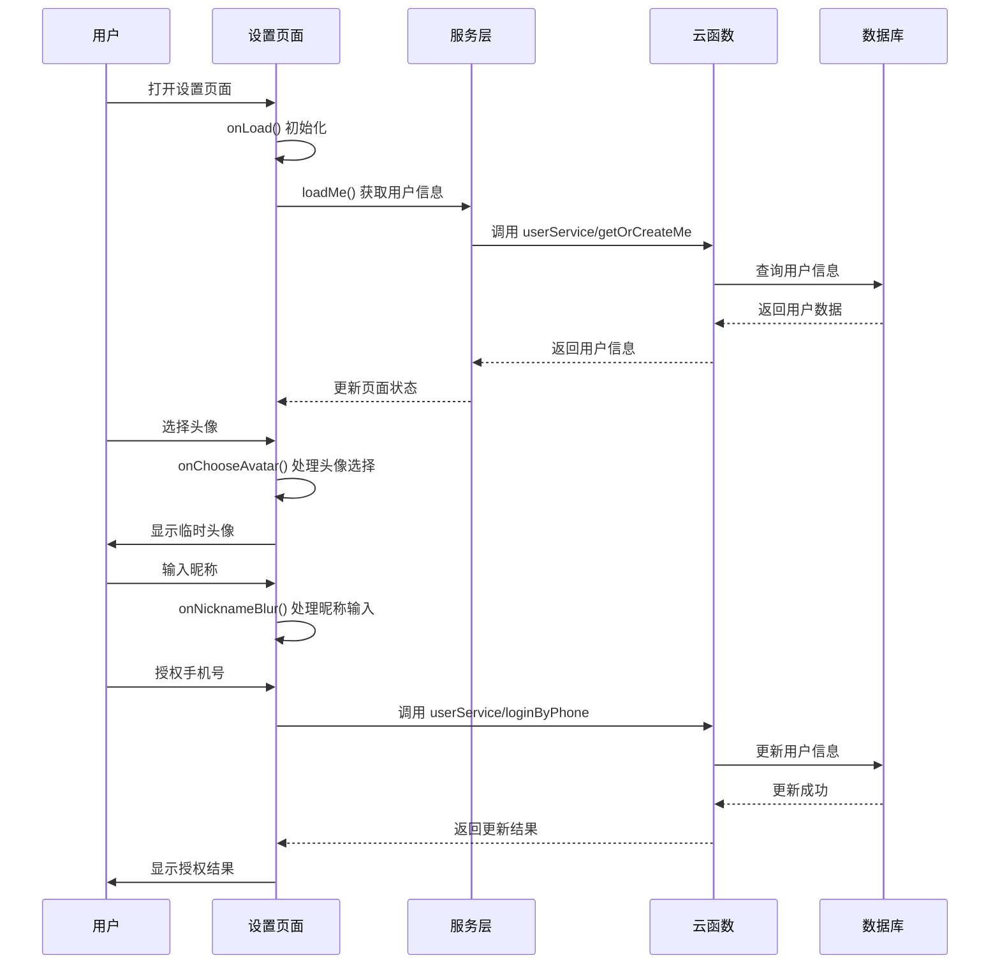
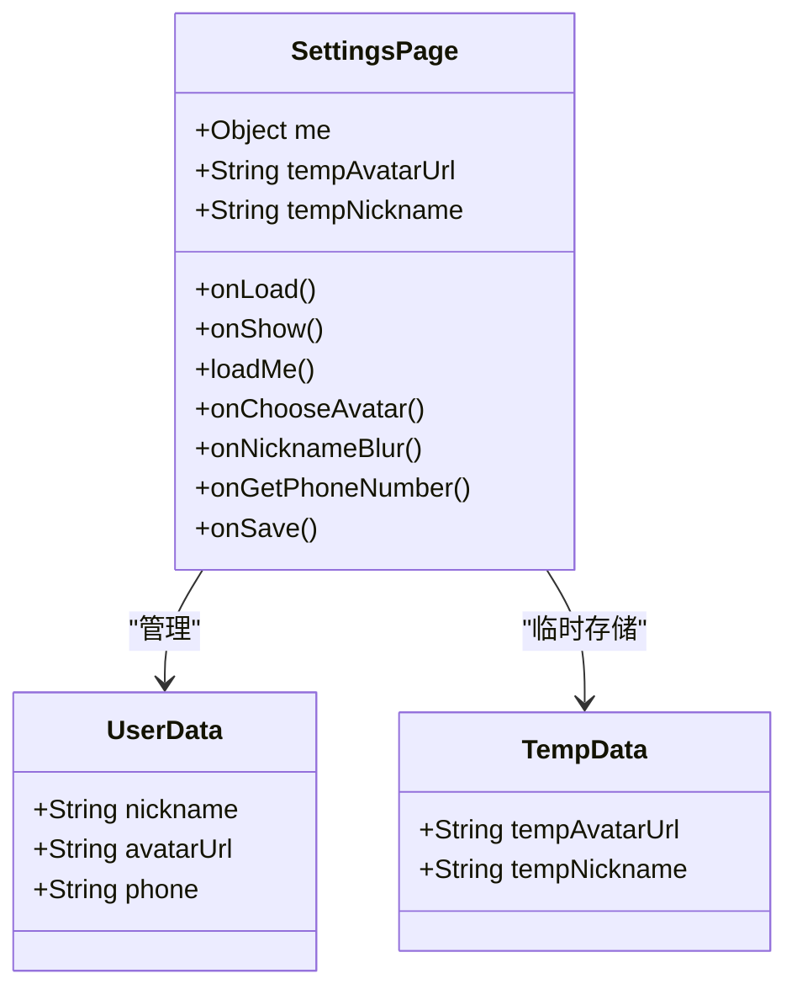
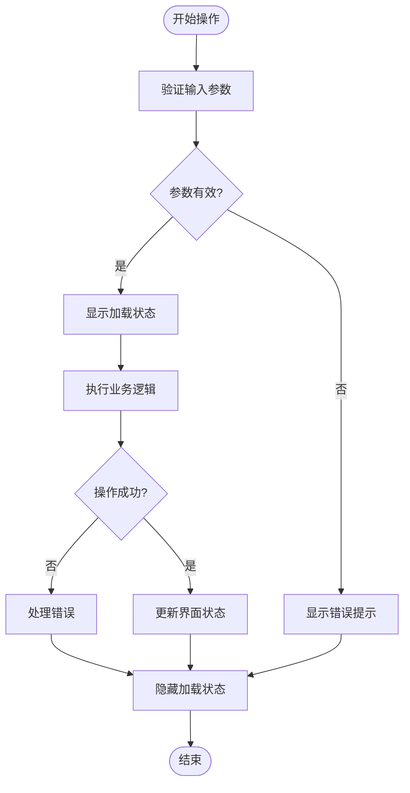
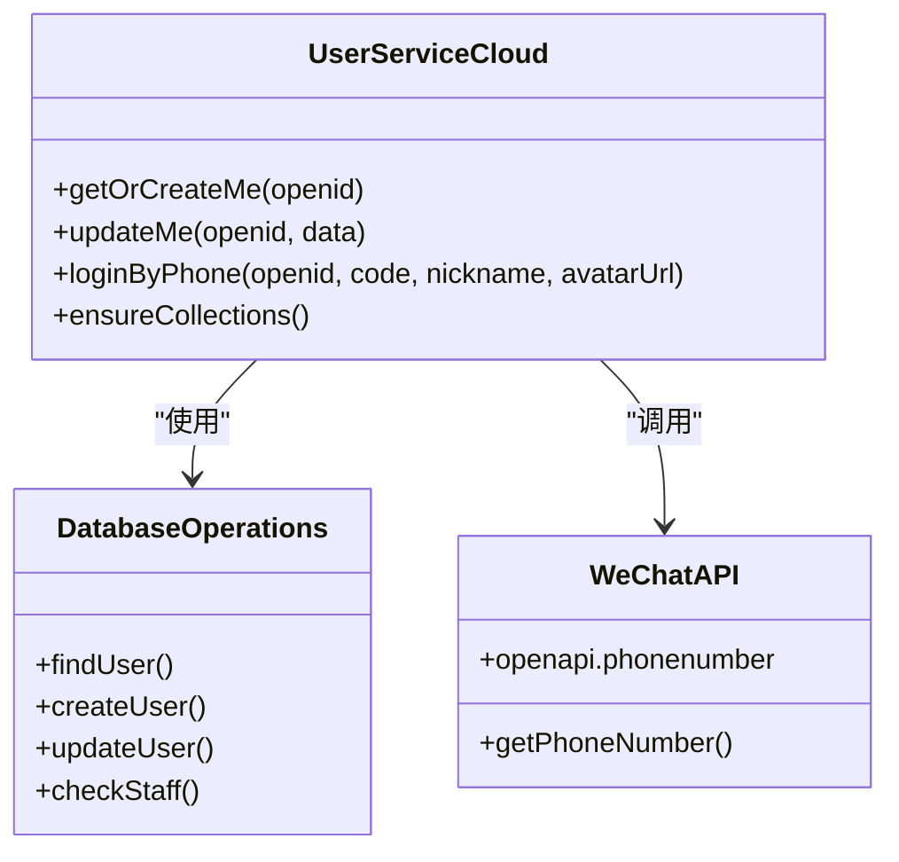
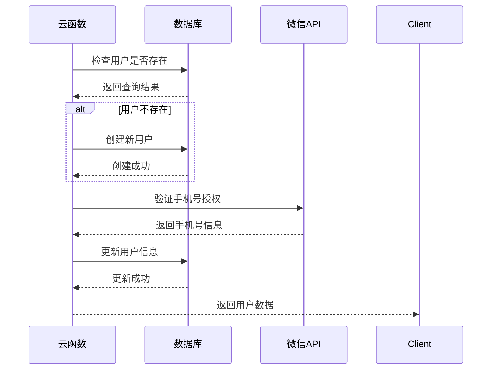
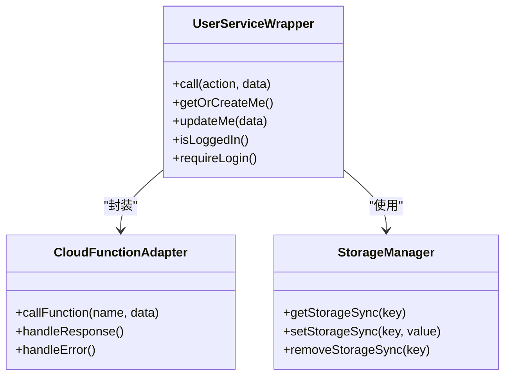
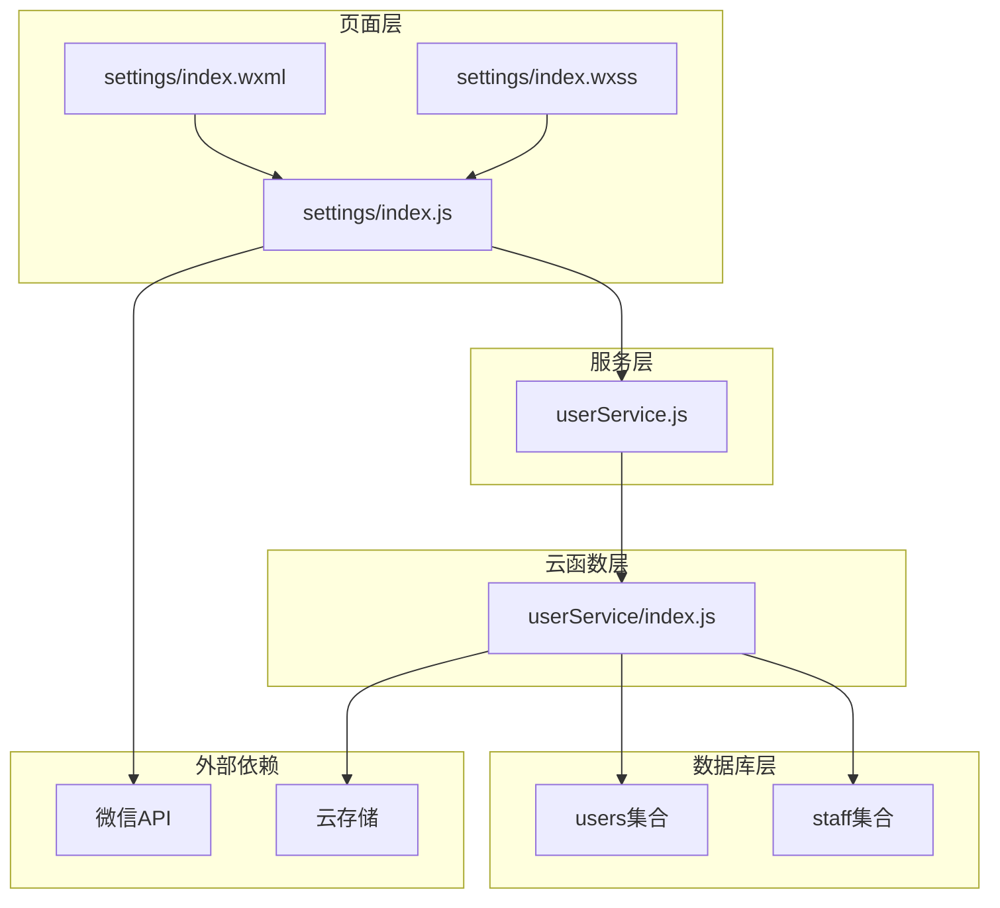

# 设置页面更新

<cite>
**本文档引用的文件**
- [miniprogram/pages/settings/index.js](file://miniprogram/pages/settings/index.js)
- [miniprogram/pages/settings/index.json](file://miniprogram/pages/settings/index.json)
- [miniprogram/pages/settings/index.wxml](file://miniprogram/pages/settings/index.wxml)
- [miniprogram/pages/settings/index.wxss](file://miniprogram/pages/settings/index.wxss)
- [miniprogram/services/userService.js](file://miniprogram/services/userService.js)
- [cloudfunctions/userService/index.js](file://cloudfunctions/userService/index.js)
- [miniprogram/pages/profile/index.js](file://miniprogram/pages/profile/index.js)
- [miniprogram/app.js](file://miniprogram/app.js)
- [miniprogram/utils/request.js](file://miniprogram/utils/request.js)
- [PRD.md](file://PRD.md)
</cite>

## 目录
1. [简介](#简介)
2. [项目结构](#项目结构)
3. [核心组件](#核心组件)
4. [架构概览](#架构概览)
5. [详细组件分析](#详细组件分析)
6. [依赖关系分析](#依赖关系分析)
7. [性能考虑](#性能考虑)
8. [故障排除指南](#故障排除指南)
9. [结论](#结论)

## 简介

本文档详细分析了安得褓贝小程序中的设置页面更新功能。该设置页面实现了用户个人信息管理的核心功能，包括头像编辑、昵称修改、手机号授权等功能。通过对代码库的深入分析，本文档提供了完整的架构说明、组件关系、数据流分析和最佳实践指导。

## 项目结构

安得褓贝小程序采用典型的微信小程序架构，主要分为以下几个层次：

```mermaid
graph TB
subgraph "小程序前端层"
A[pages/settings/] -- 设置页面
B[pages/profile/] -- 个人中心页面
C[services/] -- 服务层
D[utils/] -- 工具类
end
subgraph "云开发层"
E[cloudfunctions/] -- 云函数
F[数据库] -- MongoDB
G[云存储] -- 文件存储
end
subgraph "外部服务"
H[微信开放平台] -- 微信API
I[CRM系统] -- 后端服务
end
A --> C
B --> C
C --> E
E --> F
E --> G
A --> H
I --> H
```

**图表来源**
- [miniprogram/pages/settings/index.js:1-179](file://miniprogram/pages/settings/index.js#L1-L179)
- [cloudfunctions/userService/index.js:1-458](file://cloudfunctions/userService/index.js#L1-L458)

**章节来源**
- [miniprogram/pages/settings/index.js:1-179](file://miniprogram/pages/settings/index.js#L1-L179)
- [cloudfunctions/userService/index.js:1-458](file://cloudfunctions/userService/index.js#L1-L458)

## 核心组件

设置页面由四个核心文件组成，每个文件承担特定的功能职责：

### 页面组件结构

| 文件名 | 功能描述 | 技术特点 |
|--------|----------|----------|
| index.js | 页面逻辑控制器 | 异步操作、事件处理、状态管理 |
| index.wxml | 页面结构模板 | 数据绑定、条件渲染、事件绑定 |
| index.wxss | 样式定义 | 响应式设计、渐变效果、布局样式 |
| index.json | 页面配置 | 导航栏标题、窗口表现 |

### 服务层组件

| 文件名 | 功能描述 | 技术特点 |
|--------|----------|----------|
| userService.js | 用户服务封装 | Promise封装、错误处理、登录状态检查 |

**章节来源**
- [miniprogram/pages/settings/index.js:1-179](file://miniprogram/pages/settings/index.js#L1-L179)
- [miniprogram/pages/settings/index.wxml:1-44](file://miniprogram/pages/settings/index.wxml#L1-L44)
- [miniprogram/pages/settings/index.wxss:1-144](file://miniprogram/pages/settings/index.wxss#L1-L144)
- [miniprogram/pages/settings/index.json:1-5](file://miniprogram/pages/settings/index.json#L1-L5)

## 架构概览

设置页面采用了MVVM架构模式，结合微信小程序的原生能力，实现了完整的用户信息管理功能。



**图表来源**
- [miniprogram/pages/settings/index.js:22-121](file://miniprogram/pages/settings/index.js#L22-L121)
- [cloudfunctions/userService/index.js:255-315](file://cloudfunctions/userService/index.js#L255-L315)

## 详细组件分析

### 设置页面主控制器

设置页面的JavaScript控制器实现了完整的用户信息管理逻辑，包括数据加载、状态管理和异步操作处理。

#### 核心数据结构



**图表来源**
- [miniprogram/pages/settings/index.js:2-10](file://miniprogram/pages/settings/index.js#L2-L10)

#### 异步操作流程

设置页面的异步操作遵循统一的错误处理模式：



**图表来源**
- [miniprogram/pages/settings/index.js:123-176](file://miniprogram/pages/settings/index.js#L123-L176)

#### 事件处理机制

设置页面实现了多种用户交互事件的处理：

| 事件类型 | 处理方法 | 功能描述 |
|----------|----------|----------|
| 页面加载 | onLoad() | 初始化页面，加载用户信息 |
| 页面显示 | onShow() | 重新加载用户信息，确保数据同步 |
| 头像选择 | onChooseAvatar() | 处理用户头像选择事件 |
| 昵称输入 | onNicknameBlur() | 处理昵称输入完成事件 |
| 手机号授权 | onGetPhoneNumber() | 处理手机号授权流程 |
| 保存操作 | onSave() | 保存用户修改的信息 |

**章节来源**
- [miniprogram/pages/settings/index.js:12-176](file://miniprogram/pages/settings/index.js#L12-L176)

### 云函数服务层

云函数实现了用户信息的持久化存储和业务逻辑处理。

#### 用户信息服务



**图表来源**
- [cloudfunctions/userService/index.js:50-315](file://cloudfunctions/userService/index.js#L50-L315)

#### 数据库操作流程

云函数的数据库操作遵循严格的事务处理原则：



**图表来源**
- [cloudfunctions/userService/index.js:255-315](file://cloudfunctions/userService/index.js#L255-L315)

**章节来源**
- [cloudfunctions/userService/index.js:50-315](file://cloudfunctions/userService/index.js#L50-L315)

### 服务层封装

服务层提供了统一的API接口，简化了页面逻辑的复杂度。

#### 服务层设计模式



**图表来源**
- [miniprogram/services/userService.js:5-45](file://miniprogram/services/userService.js#L5-L45)

**章节来源**
- [miniprogram/services/userService.js:5-45](file://miniprogram/services/userService.js#L5-L45)

## 依赖关系分析

设置页面的依赖关系体现了清晰的分层架构设计。



**图表来源**
- [miniprogram/pages/settings/index.js:1-179](file://miniprogram/pages/settings/index.js#L1-L179)
- [miniprogram/services/userService.js:1-45](file://miniprogram/services/userService.js#L1-L45)
- [cloudfunctions/userService/index.js:1-458](file://cloudfunctions/userService/index.js#L1-L458)

### 组件耦合度分析

| 组件 | 内聚性 | 耦合度 | 说明 |
|------|--------|--------|------|
| 设置页面JS | 高 | 低 | 专注于用户信息管理 |
| 服务层封装 | 中 | 低 | 提供统一接口 |
| 云函数服务 | 高 | 中 | 处理业务逻辑 |
| 数据库操作 | 高 | 低 | 专注数据持久化 |

**章节来源**
- [miniprogram/pages/settings/index.js:1-179](file://miniprogram/pages/settings/index.js#L1-L179)
- [miniprogram/services/userService.js:1-45](file://miniprogram/services/userService.js#L1-L45)
- [cloudfunctions/userService/index.js:1-458](file://cloudfunctions/userService/index.js#L1-L458)

## 性能考虑

设置页面在设计时充分考虑了性能优化和用户体验。

### 性能优化策略

1. **懒加载机制**：页面只在需要时加载用户信息
2. **缓存策略**：使用临时数据避免重复网络请求
3. **异步处理**：所有网络操作都采用Promise异步处理
4. **错误恢复**：完善的错误处理和用户反馈机制

### 用户体验优化

| 优化点 | 实现方式 | 效果 |
|--------|----------|------|
| 加载状态 | 显示loading提示 | 提供即时反馈 |
| 错误处理 | 统一的错误提示 | 减少用户困惑 |
| 数据同步 | 自动重新加载 | 确保数据一致性 |
| 状态保持 | 临时数据存储 | 避免数据丢失 |

## 故障排除指南

### 常见问题及解决方案

#### 1. 云函数调用失败

**问题现象**：页面加载时出现"加载失败"提示

**可能原因**：
- 云函数未正确部署
- 网络连接异常
- 权限不足

**解决步骤**：
1. 检查云函数是否已部署
2. 验证网络连接状态
3. 确认用户权限

#### 2. 头像上传失败

**问题现象**：头像选择后无法保存

**可能原因**：
- 临时文件路径无效
- 云存储权限问题
- 文件格式不支持

**解决步骤**：
1. 检查文件路径格式
2. 验证云存储权限
3. 确认文件格式兼容性

#### 3. 手机号授权失败

**问题现象**：点击授权按钮无响应

**可能原因**：
- 用户未授权
- 微信API调用失败
- 网络超时

**解决步骤**：
1. 确认用户授权状态
2. 检查微信API可用性
3. 增加重试机制

**章节来源**
- [miniprogram/pages/settings/index.js:43-46](file://miniprogram/pages/settings/index.js#L43-L46)
- [miniprogram/pages/settings/index.js:115-120](file://miniprogram/pages/settings/index.js#L115-L120)

## 结论

设置页面更新功能展现了安得褓贝小程序在用户信息管理方面的完整解决方案。通过MVVM架构、分层设计和完善的错误处理机制，实现了稳定可靠的用户体验。

### 主要成就

1. **完整的用户信息管理**：支持头像、昵称、手机号的全生命周期管理
2. **优雅的错误处理**：提供清晰的用户反馈和错误恢复机制
3. **高性能的异步处理**：优化的网络请求和状态管理
4. **良好的扩展性**：模块化的架构设计便于功能扩展

### 技术亮点

- **异步操作的统一处理**：Promise模式确保代码的一致性和可维护性
- **状态管理的完整性**：临时数据和持久化数据的协调管理
- **用户体验的优化**：加载状态、错误提示、数据同步的完整体验
- **安全性的保障**：权限验证和数据验证的双重保障

该设置页面为整个安得褓贝小程序奠定了坚实的基础，为后续功能扩展提供了良好的技术支撑。