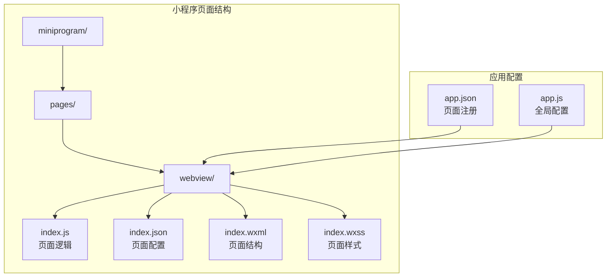
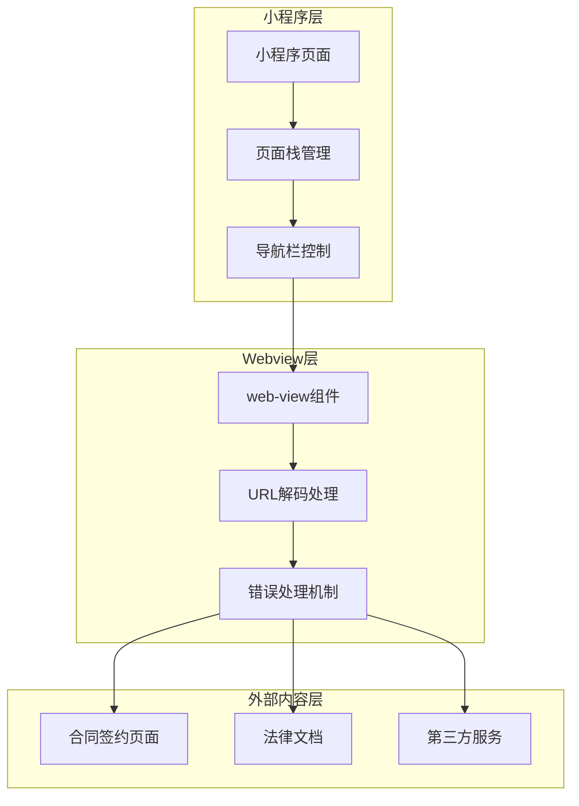
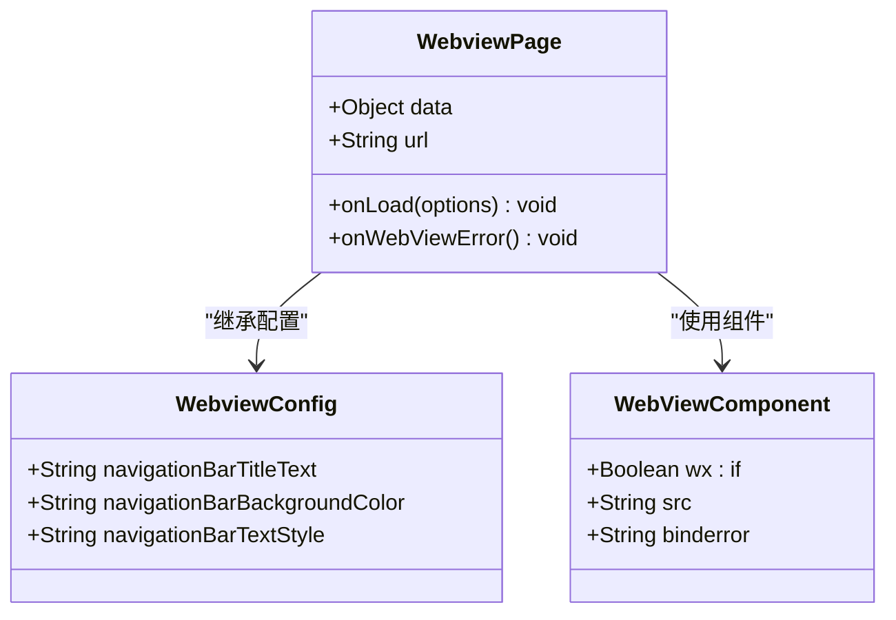
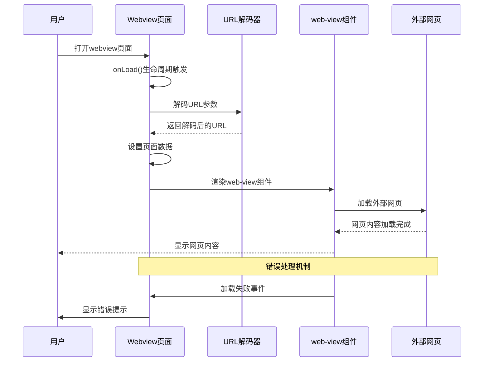
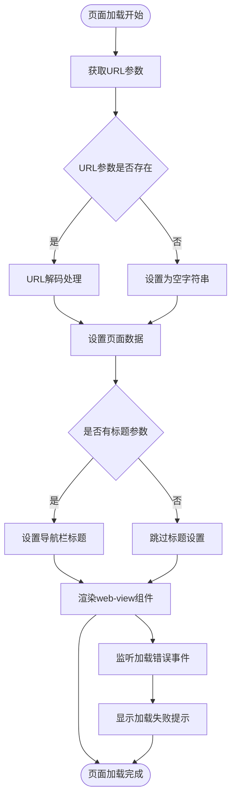
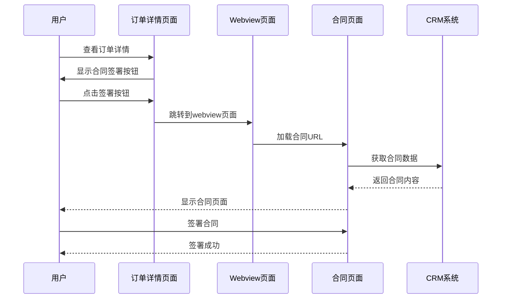
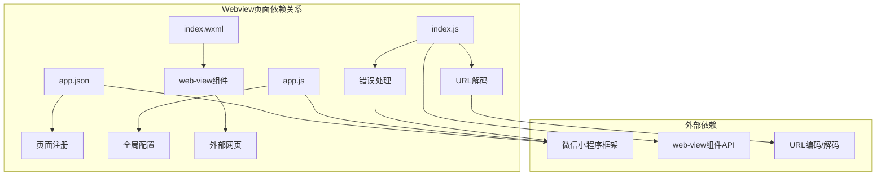
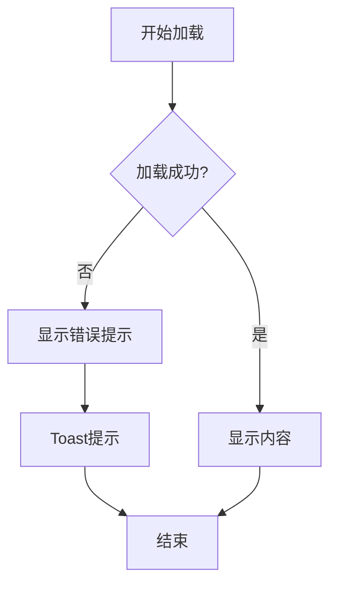

# Webview页面

<cite>
**本文档引用的文件**
- [miniprogram/pages/webview/index.js](file://miniprogram/pages/webview/index.js)
- [miniprogram/pages/webview/index.json](file://miniprogram/pages/webview/index.json)
- [miniprogram/pages/webview/index.wxml](file://miniprogram/pages/webview/index.wxml)
- [miniprogram/pages/webview/index.wxss](file://miniprogram/pages/webview/index.wxss)
- [miniprogram/app.json](file://miniprogram/app.json)
- [miniprogram/app.js](file://miniprogram/app.js)
- [miniprogram/pages/myOrders/detail.js](file://miniprogram/pages/myOrders/detail.js)
- [PRD.md](file://PRD.md)
- [API完整文档.md](file://API完整文档.md)
</cite>

## 目录
1. [简介](#简介)
2. [项目结构](#项目结构)
3. [核心组件](#核心组件)
4. [架构概览](#架构概览)
5. [详细组件分析](#详细组件分析)
6. [依赖关系分析](#依赖关系分析)
7. [性能考虑](#性能考虑)
8. [故障排除指南](#故障排除指南)
9. [结论](#结论)

## 简介

Webview页面是微信小程序中的一个重要功能组件，用于在小程序内部嵌入和显示外部网页内容。该页面采用微信小程序的web-view组件，能够安全地加载和展示各种外部链接内容，包括合同签约页面、法律文档、第三方服务等。

在安得褓贝项目中，Webview页面主要用于处理需要在小程序内展示的外部网页内容，特别是合同签约功能。该页面实现了基本的URL解码、导航栏标题设置和错误处理机制，为用户提供了一个简洁高效的外部内容展示界面。

## 项目结构

Webview页面位于小程序的pages目录下，采用标准的小程序页面结构：

**图表来源**
- [miniprogram/pages/webview/index.js:1-18](file://miniprogram/pages/webview/index.js#L1-L18)
- [miniprogram/pages/webview/index.json:1-7](file://miniprogram/pages/webview/index.json#L1-L7)
- [miniprogram/pages/webview/index.wxml:1-3](file://miniprogram/pages/webview/index.wxml#L1-L3)

**章节来源**
- [miniprogram/pages/webview/index.js:1-18](file://miniprogram/pages/webview/index.js#L1-L18)
- [miniprogram/pages/webview/index.json:1-7](file://miniprogram/pages/webview/index.json#L1-L7)
- [miniprogram/pages/webview/index.wxml:1-3](file://miniprogram/pages/webview/index.wxml#L1-L3)
- [miniprogram/pages/webview/index.wxss:1-1](file://miniprogram/pages/webview/index.wxss#L1-L1)

## 核心组件

Webview页面由四个核心文件组成，每个文件都有特定的功能职责：

### 页面逻辑组件 (index.js)
负责处理页面的生命周期事件、URL参数解析和错误处理逻辑。

### 页面配置组件 (index.json)
定义页面的导航栏样式和行为配置。

### 页面结构组件 (index.wxml)
使用web-view组件渲染外部网页内容。

### 页面样式组件 (index.wxss)
提供页面的基础样式定义。

**章节来源**
- [miniprogram/pages/webview/index.js:1-18](file://miniprogram/pages/webview/index.js#L1-L18)
- [miniprogram/pages/webview/index.json:1-7](file://miniprogram/pages/webview/index.json#L1-L7)
- [miniprogram/pages/webview/index.wxml:1-3](file://miniprogram/pages/webview/index.wxml#L1-L3)
- [miniprogram/pages/webview/index.wxss:1-1](file://miniprogram/pages/webview/index.wxss#L1-L1)

## 架构概览

Webview页面在整个小程序架构中扮演着桥梁的角色，连接小程序原生功能和外部网页内容：

**图表来源**
- [miniprogram/pages/webview/index.js:4-15](file://miniprogram/pages/webview/index.js#L4-L15)
- [miniprogram/pages/webview/index.wxml:1-1](file://miniprogram/pages/webview/index.wxml#L1-L1)

## 详细组件分析

### Webview页面类结构

**图表来源**
- [miniprogram/pages/webview/index.js:1-16](file://miniprogram/pages/webview/index.js#L1-L16)
- [miniprogram/pages/webview/index.json:1-7](file://miniprogram/pages/webview/index.json#L1-L7)
- [miniprogram/pages/webview/index.wxml:1-1](file://miniprogram/pages/webview/index.wxml#L1-L1)

### 页面加载流程

**图表来源**
- [miniprogram/pages/webview/index.js:4-15](file://miniprogram/pages/webview/index.js#L4-L15)
- [miniprogram/pages/webview/index.wxml:1-1](file://miniprogram/pages/webview/index.wxml#L1-L1)

### URL处理算法

**图表来源**
- [miniprogram/pages/webview/index.js:4-15](file://miniprogram/pages/webview/index.js#L4-L15)

### 实际应用场景

Webview页面在项目中有以下具体应用场景：

#### 合同签约功能

**图表来源**
- [miniprogram/pages/myOrders/detail.js](file://miniprogram/pages/myOrders/detail.js#L146)
- [miniprogram/pages/webview/index.js:4-9](file://miniprogram/pages/webview/index.js#L4-L9)

**章节来源**
- [miniprogram/pages/webview/index.js:1-18](file://miniprogram/pages/webview/index.js#L1-L18)
- [miniprogram/pages/webview/index.json:1-7](file://miniprogram/pages/webview/index.json#L1-L7)
- [miniprogram/pages/webview/index.wxml:1-3](file://miniprogram/pages/webview/index.wxml#L1-L3)
- [miniprogram/pages/myOrders/detail.js](file://miniprogram/pages/myOrders/detail.js#L146)

## 依赖关系分析

Webview页面与其他组件之间的依赖关系如下：

**图表来源**
- [miniprogram/app.json](file://miniprogram/app.json#L19)
- [miniprogram/app.js:1-144](file://miniprogram/app.js#L1-L144)
- [miniprogram/pages/webview/index.js:4-15](file://miniprogram/pages/webview/index.js#L4-L15)
- [miniprogram/pages/webview/index.wxml:1-1](file://miniprogram/pages/webview/index.wxml#L1-L1)

**章节来源**
- [miniprogram/app.json](file://miniprogram/app.json#L19)
- [miniprogram/app.js:1-144](file://miniprogram/app.js#L1-L144)
- [miniprogram/pages/webview/index.js:1-18](file://miniprogram/pages/webview/index.js#L1-L18)

## 性能考虑

Webview页面在性能方面需要考虑以下几个关键因素：

### 加载性能优化
- **懒加载策略**：只有在用户实际需要时才加载外部网页内容
- **缓存机制**：合理利用浏览器缓存减少重复加载
- **预加载准备**：在页面进入前做好必要的准备工作

### 内存管理
- **及时释放**：页面卸载时及时释放相关资源
- **内存监控**：监控页面内存使用情况
- **避免内存泄漏**：确保事件监听器正确移除

### 网络优化
- **CDN加速**：使用CDN加速外部资源加载
- **压缩传输**：启用Gzip等压缩技术
- **连接复用**：复用HTTP连接减少延迟

## 故障排除指南

### 常见问题及解决方案

#### 页面加载失败
**问题描述**：web-view组件无法正常加载外部网页内容

**可能原因**：
1. URL格式不正确或被编码
2. 网络连接异常
3. 外部网站不可访问
4. 域名未在合法域名列表中

**解决步骤**：
1. 检查URL参数是否正确传递
2. 验证网络连接状态
3. 确认外部网站可正常访问
4. 在微信公众平台配置合法域名

#### 导航栏标题显示异常
**问题描述**：页面标题没有正确显示或显示乱码

**解决方法**：
1. 确保title参数正确传递
2. 检查标题字符编码
3. 验证导航栏配置

#### 错误处理机制
页面内置了完善的错误处理机制：

**图表来源**
- [miniprogram/pages/webview/index.js:13-15](file://miniprogram/pages/webview/index.js#L13-L15)

**章节来源**
- [miniprogram/pages/webview/index.js:13-15](file://miniprogram/pages/webview/index.js#L13-L15)

## 结论

Webview页面作为安得褓贝项目中的重要组成部分，为小程序提供了强大的外部内容展示能力。通过合理的架构设计和完善的错误处理机制，该页面能够稳定地为用户提供合同签约、法律文档查看等关键功能。

主要特点包括：
- **简洁高效**：采用最小化设计，专注于核心功能
- **安全可靠**：严格遵守微信小程序的安全规范
- **易于扩展**：模块化设计便于功能扩展和维护
- **用户体验友好**：提供清晰的错误提示和加载状态

未来可以在以下方面进一步优化：
- 增加更多的错误处理和恢复机制
- 优化页面加载性能和用户体验
- 扩展对不同类型外部内容的支持
- 加强与小程序其他功能的集成度