# 专业发展页面

<cite>
**本文档引用的文件**
- [README.md](file://README.md)
- [PRD.md](file://PRD.md)
- [salaryAssessment/index.js](file://miniprogram/pages/salaryAssessment/index.js)
- [salaryAssessment/quiz.js](file://miniprogram/pages/salaryAssessment/quiz.js)
- [salaryAssessment/result.js](file://miniprogram/pages/salaryAssessment/result.js)
- [salaryAssessmentPoster/index.js](file://miniprogram/pages/salaryAssessmentPoster/index.js)
- [salaryAssessment/index.js](file://cloudfunctions/salaryAssessment/index.js)
- [assessmentShareImage.js](file://miniprogram/utils/assessmentShareImage.js)
- [sharerUtils.js](file://miniprogram/utils/sharerUtils.js)
- [resume.js](file://miniprogram/services/resume.js)
</cite>

## 目录
1. [项目概述](#项目概述)
2. [专业发展页面架构](#专业发展页面架构)
3. [核心组件分析](#核心组件分析)
4. [业务流程详解](#业务流程详解)
5. [技术实现细节](#技术实现细节)
6. [数据流分析](#数据流分析)
7. [性能优化策略](#性能优化策略)
8. [故障排查指南](#故障排查指南)
9. [总结](#总结)

## 项目概述

安得褓贝专业发展页面是一个完整的家政从业者薪资评估系统，基于微信小程序平台构建。该系统旨在为月嫂、育儿嫂、保姆、护老等家政从业者提供智能化的薪资水平评估服务。

### 系统特点

- **AI智能评估**：基于豆包AI模型提供专业的薪资评估
- **多工种支持**：涵盖月嫂、育儿嫂、保姆、护老四大工种
- **全流程服务**：从测评登记到结果展示的完整体验
- **员工分享机制**：支持员工分享推广测评服务
- **CRM集成**：与企业CRM系统无缝对接

## 专业发展页面架构

### 整体架构设计

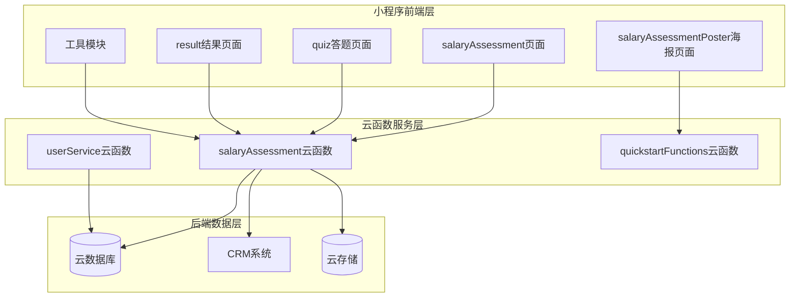

**图表来源**
- [salaryAssessment/index.js:1-335](file://miniprogram/pages/salaryAssessment/index.js#L1-L335)
- [salaryAssessment/quiz.js:1-265](file://miniprogram/pages/salaryAssessment/quiz.js#L1-L265)
- [salaryAssessment/result.js:1-275](file://miniprogram/pages/salaryAssessment/result.js#L1-L275)
- [salaryAssessment/index.js:1-928](file://cloudfunctions/salaryAssessment/index.js#L1-L928)

### 页面层次结构

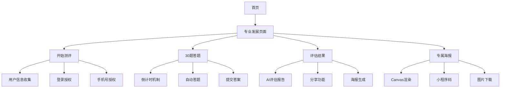

**图表来源**
- [PRD.md:84-200](file://PRD.md#L84-L200)

## 核心组件分析

### 1. 测评登记组件

测评登记是整个专业发展流程的起点，负责收集用户基本信息并建立测评记录。

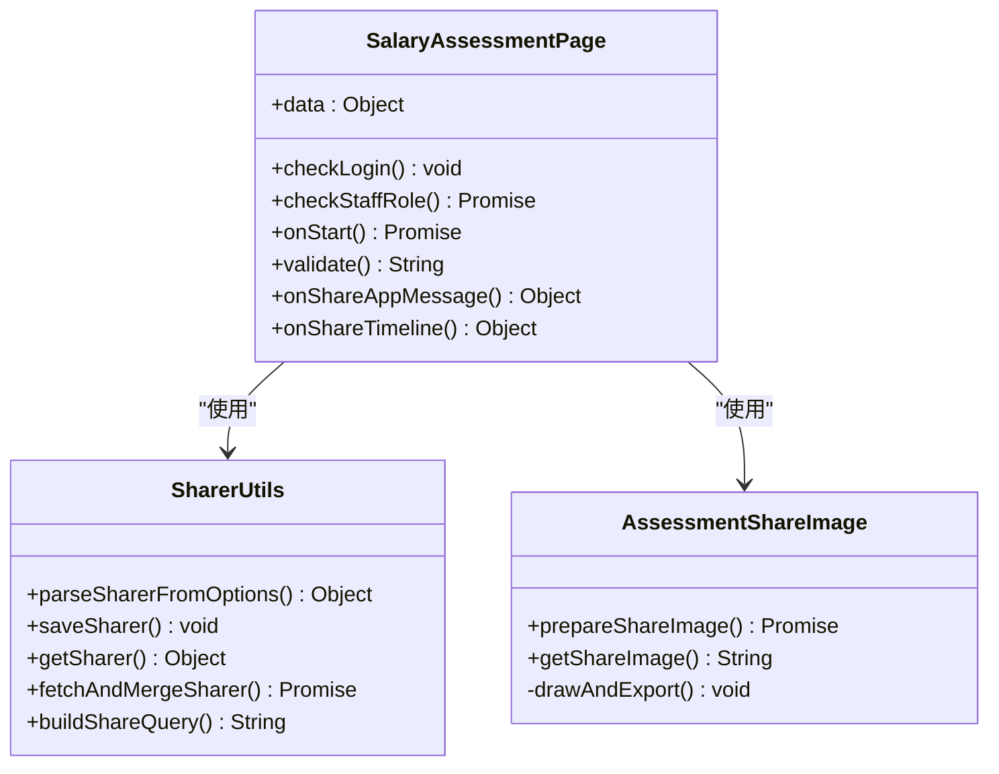

**图表来源**
- [salaryAssessment/index.js:42-335](file://miniprogram/pages/salaryAssessment/index.js#L42-L335)
- [sharerUtils.js:1-128](file://miniprogram/utils/sharerUtils.js#L1-L128)
- [assessmentShareImage.js:1-147](file://miniprogram/utils/assessmentShareImage.js#L1-L147)

### 2. 答题组件

答题组件提供了30道题目的智能测评体验，包含倒计时、自动跳题等功能。

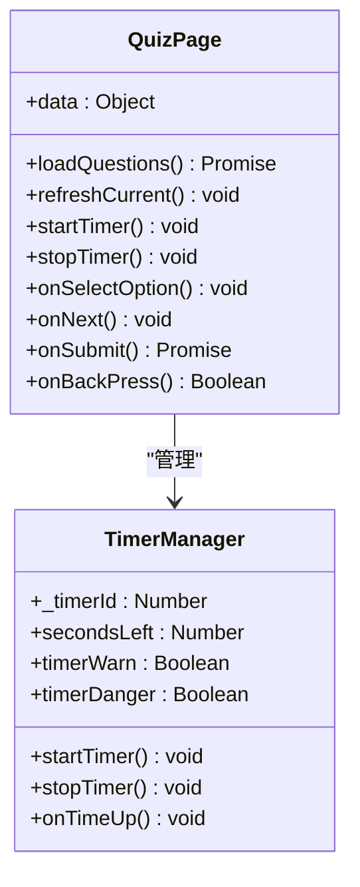

**图表来源**
- [salaryAssessment/quiz.js:12-265](file://miniprogram/pages/salaryAssessment/quiz.js#L12-L265)

### 3. 结果展示组件

结果展示组件提供详细的AI评估报告，包括薪资区间、能力分析等。

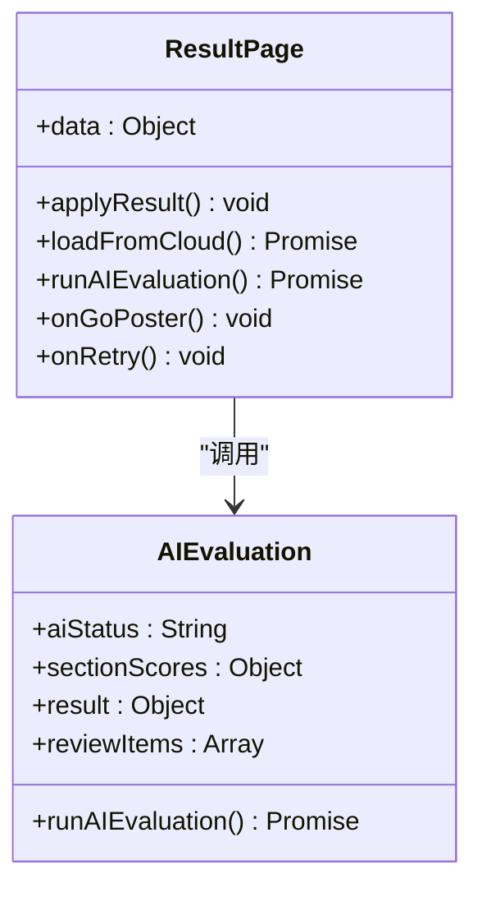

**图表来源**
- [salaryAssessment/result.js:19-275](file://miniprogram/pages/salaryAssessment/result.js#L19-L275)

## 业务流程详解

### 1. 用户参与流程

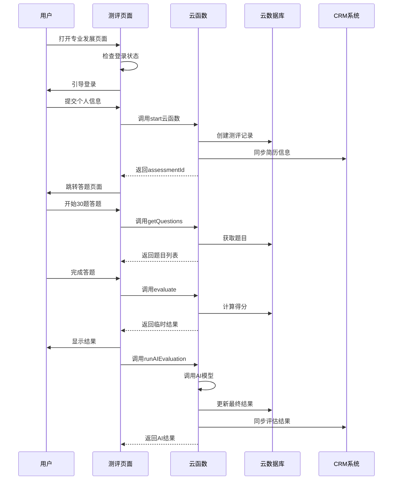

**图表来源**
- [salaryAssessment/index.js:225-318](file://miniprogram/pages/salaryAssessment/index.js#L225-L318)
- [salaryAssessment/quiz.js:176-232](file://miniprogram/pages/salaryAssessment/quiz.js#L176-L232)
- [salaryAssessment/result.js:152-183](file://miniprogram/pages/salaryAssessment/result.js#L152-L183)

### 2. 员工分享机制

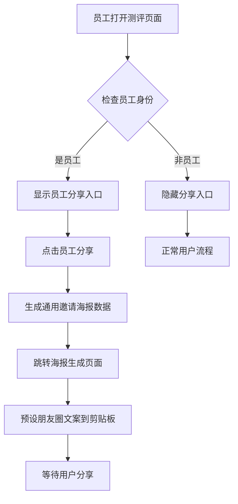

**图表来源**
- [salaryAssessment/index.js:118-131](file://miniprogram/pages/salaryAssessment/index.js#L118-L131)

### 3. AI评估流程

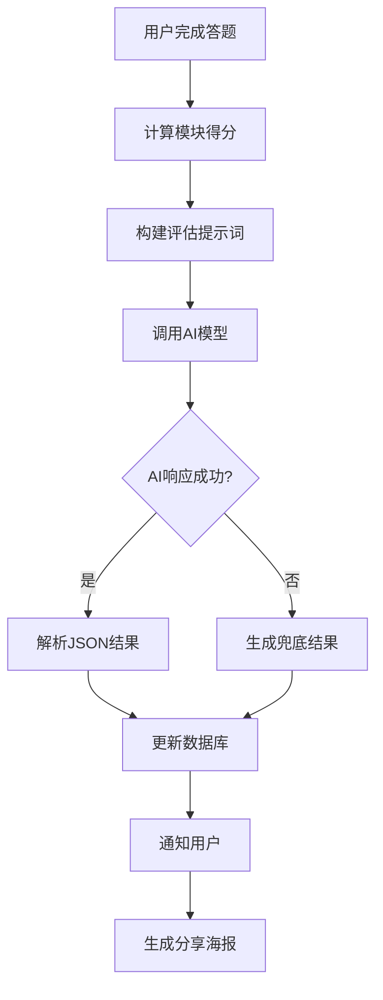

**图表来源**
- [salaryAssessment/index.js:658-729](file://cloudfunctions/salaryAssessment/index.js#L658-L729)

## 技术实现细节

### 1. 数据模型设计

专业发展页面涉及多个关键数据模型：

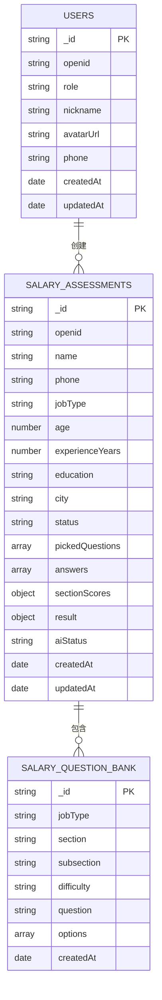

**图表来源**
- [PRD.md:202-258](file://PRD.md#L202-L258)

### 2. 题库抽样算法

系统采用智能抽样算法确保题目质量：

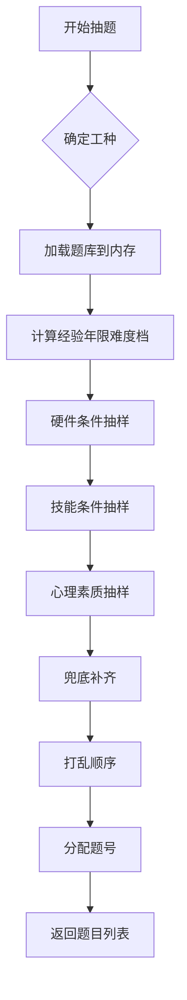

**图表来源**
- [salaryAssessment/index.js:369-465](file://cloudfunctions/salaryAssessment/index.js#L369-L465)

### 3. 性能优化策略

系统实现了多项性能优化措施：

- **题库缓存**：内存缓存题库数据，减少数据库查询
- **并发处理**：使用Promise.all并行获取资源
- **懒加载**：海报生成采用延迟加载策略
- **本地存储**：缓存用户信息和测评结果

## 数据流分析

### 1. 用户数据流

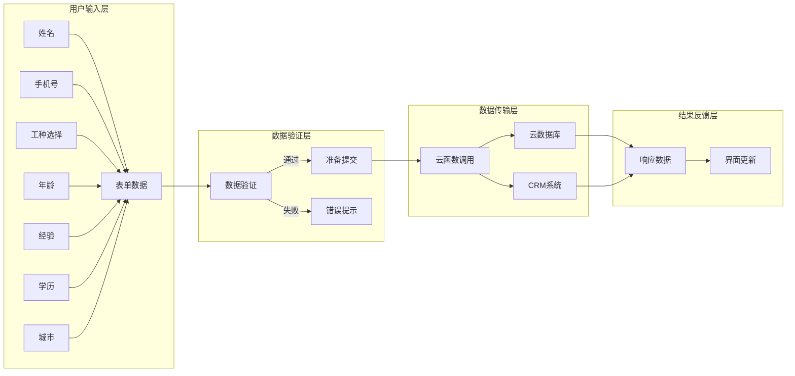

**图表来源**
- [salaryAssessment/index.js:202-211](file://miniprogram/pages/salaryAssessment/index.js#L202-L211)

### 2. AI评估数据流

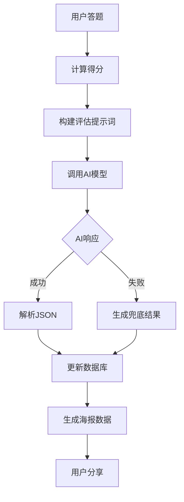

**图表来源**
- [salaryAssessment/index.js:214-268](file://cloudfunctions/salaryAssessment/index.js#L214-L268)

## 性能优化策略

### 1. 前端优化

- **页面懒加载**：使用onReady时机生成分享图片
- **资源预加载**：提前下载海报所需资源
- **内存管理**：及时清理定时器和事件监听器
- **缓存策略**：合理使用本地存储缓存数据

### 2. 后端优化

- **题库缓存**：内存缓存题库数据，TTL 10分钟
- **批量查询**：使用分页查询减少单次查询量
- **并发控制**：限制同时进行的AI调用数量
- **错误降级**：AI失败时提供兜底结果

### 3. 网络优化

- **CDN加速**：使用云存储CDN加速静态资源
- **连接复用**：复用HTTP连接减少握手开销
- **压缩传输**：启用GZIP压缩减少传输体积
- **超时控制**：合理设置超时时间避免长时间等待

## 故障排查指南

### 1. 常见问题及解决方案

| 问题类型 | 症状描述 | 可能原因 | 解决方案 |
|---------|---------|---------|---------|
| 登录失败 | 无法获取用户信息 | 微信授权失败 | 检查微信授权配置，重新登录 |
| 题目加载失败 | 答题页面空白 | 网络请求超时 | 检查云函数部署状态，重试加载 |
| AI评估失败 | 结果页显示加载中 | AI模型调用异常 | 检查ARK_API_KEY配置，查看日志 |
| 海报生成失败 | 无法生成分享图片 | Canvas渲染异常 | 检查Canvas节点是否存在 |

### 2. 日志监控

系统关键日志包括：

- **云函数调用日志**：记录所有云函数的执行时间和参数
- **AI调用日志**：记录AI模型调用的响应时间和结果
- **数据库操作日志**：记录关键数据操作的执行情况
- **错误日志**：记录所有异常和错误信息

### 3. 性能监控指标

- **页面加载时间**：从onLoad到onReady的时间
- **API响应时间**：云函数调用的平均响应时间
- **AI调用成功率**：AI模型调用的成功比例
- **用户转化率**：从开始测评到完成评估的比例

## 总结

安得褓贝专业发展页面是一个功能完整、技术先进的家政从业者服务平台。系统通过智能化的AI评估、完善的员工分享机制、以及高效的性能优化，为用户提供优质的薪资评估体验。

### 核心优势

1. **智能化程度高**：基于AI模型提供专业的薪资评估
2. **用户体验优秀**：简洁直观的操作流程和界面设计
3. **技术架构先进**：采用前后端分离架构，具备良好的扩展性
4. **数据安全保障**：完善的权限控制和数据加密机制

### 发展建议

1. **功能扩展**：可以考虑增加更多工种的专门评估
2. **个性化定制**：根据用户历史数据提供个性化的学习建议
3. **社交功能**：增加用户间的互动和经验分享功能
4. **数据分析**：提供更详细的数据分析和趋势预测

该系统为家政行业的数字化转型提供了优秀的示范，具有良好的推广价值和商业前景。