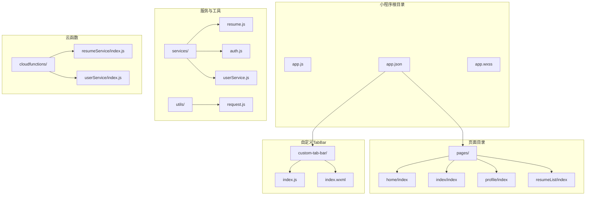
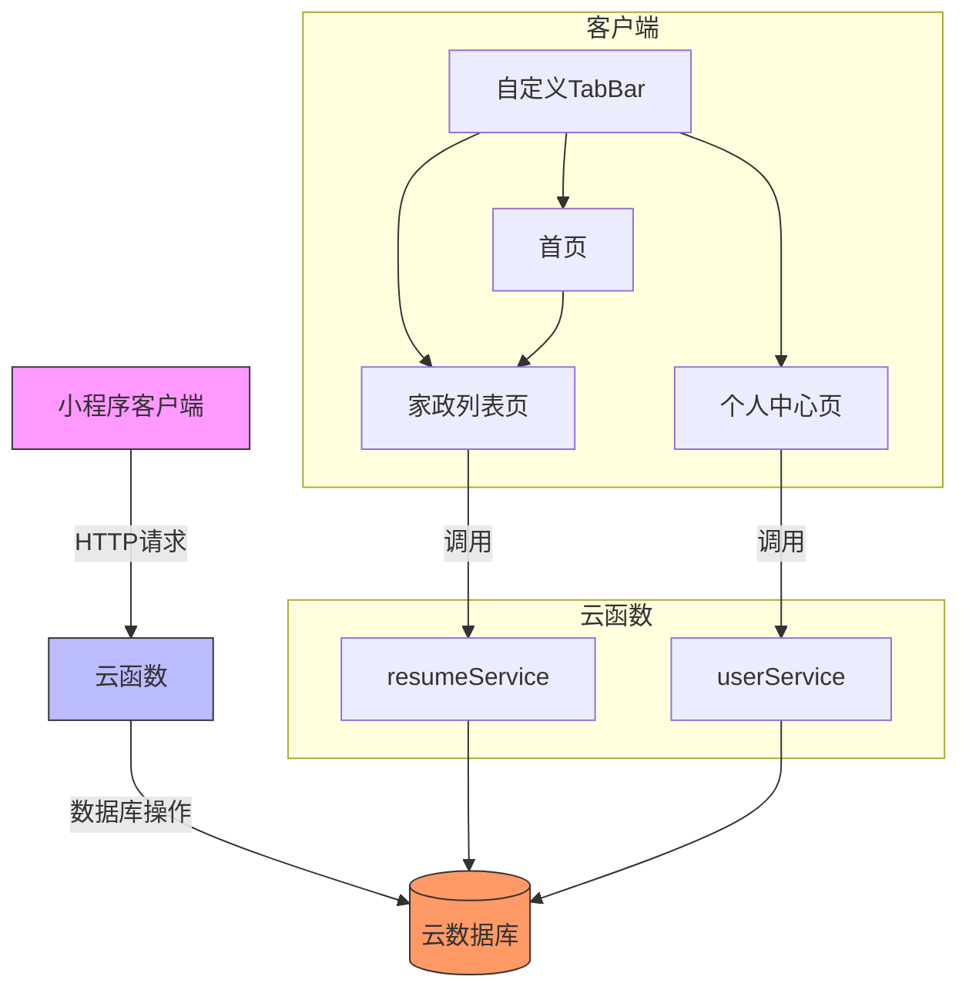
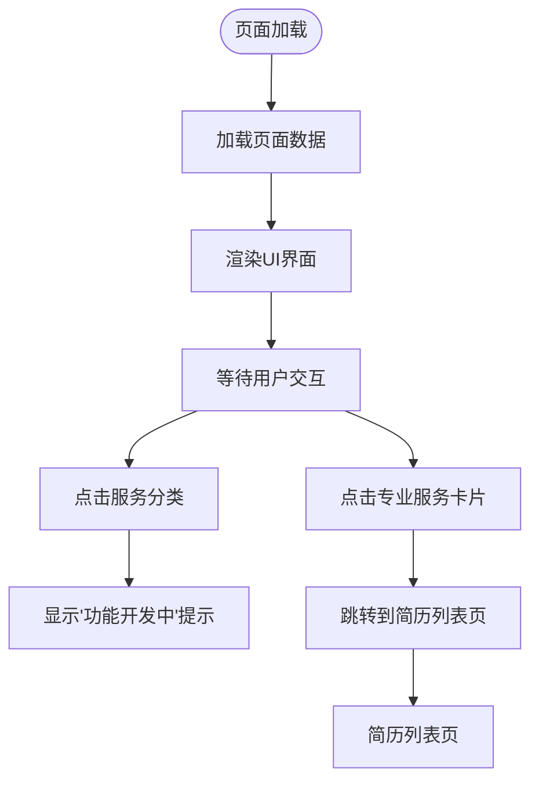
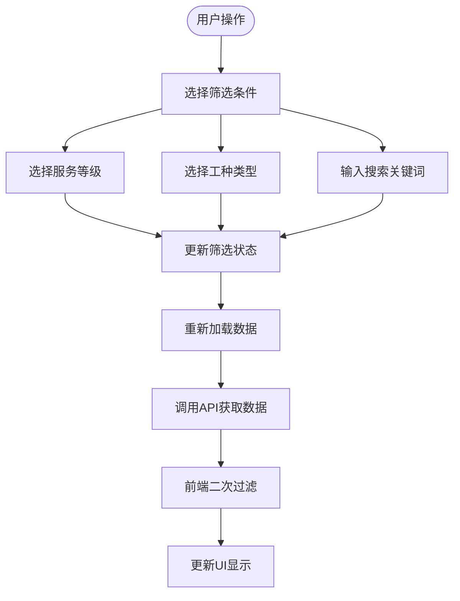
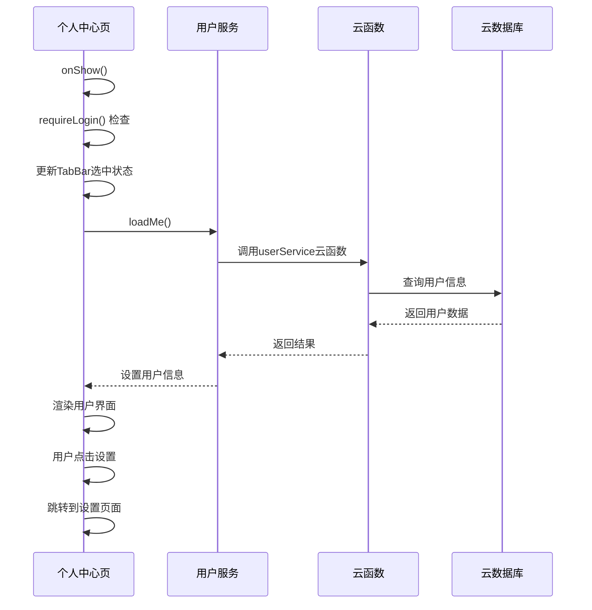
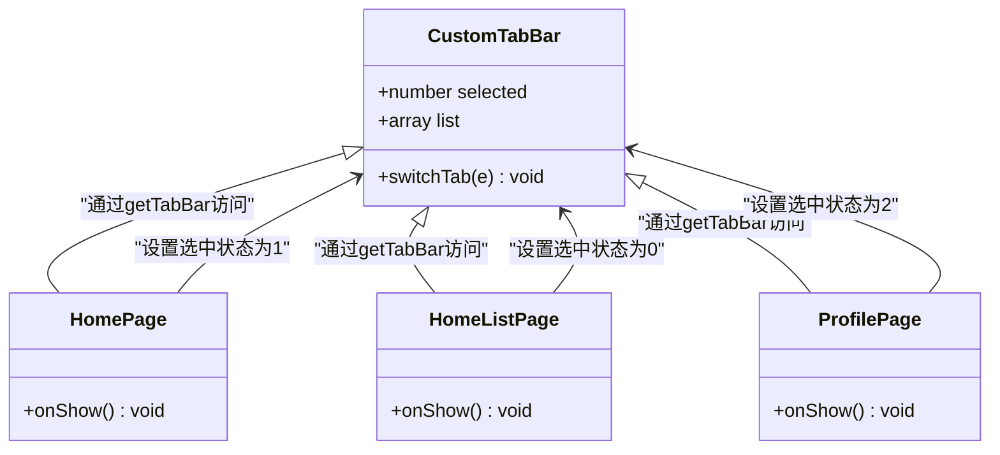
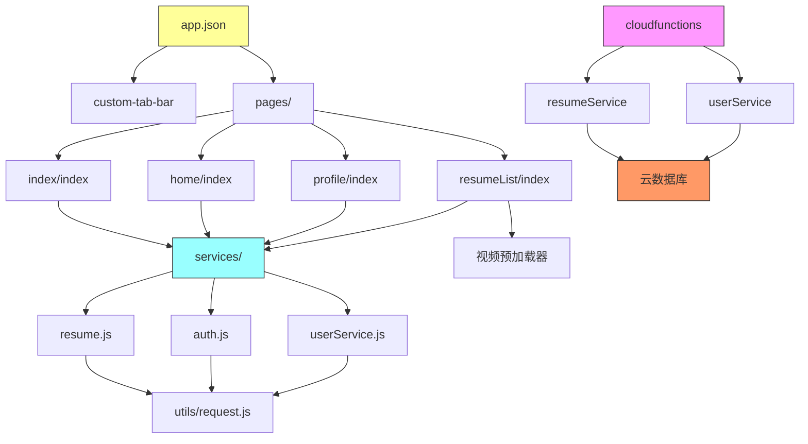
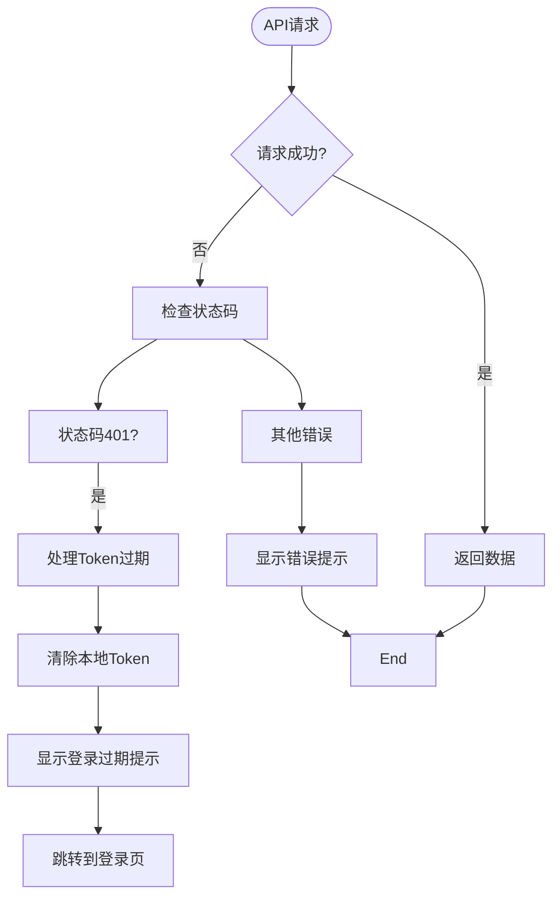

# 主Tab页面

<cite>
**本文档引用文件**  
- [app.json](file://miniprogram/app.json)
- [index.js](file://miniprogram/pages/index/index.js)
- [index.wxml](file://miniprogram/pages/index/index.wxml)
- [home/index.js](file://miniprogram/pages/home/index.js)
- [home/index.wxml](file://miniprogram/pages/home/index.wxml)
- [profile/index.js](file://miniprogram/pages/profile/index.js)
- [profile/index.wxml](file://miniprogram/pages/profile/index.wxml)
- [resumeList/index.js](file://miniprogram/pages/resumeList/index.js)
- [resumeList/index.wxml](file://miniprogram/pages/resumeList/index.wxml)
- [custom-tab-bar/index.js](file://miniprogram/custom-tab-bar/index.js)
- [services/resume.js](file://miniprogram/services/resume.js)
- [services/auth.js](file://miniprogram/services/auth.js)
- [services/userService.js](file://miniprogram/services/userService.js)
- [utils/request.js](file://miniprogram/utils/request.js)
- [cloudfunctions/resumeService/index.js](file://cloudfunctions/resumeService/index.js)
- [cloudfunctions/userService/index.js](file://cloudfunctions/userService/index.js)
</cite>

## 更新摘要
**变更内容**   
- 更新首页认证机制：移除了requireLogin()检查，允许访客浏览服务和价格信息
- 更新个人中心页认证逻辑：保留requireLogin()检查，确保敏感功能的安全性
- 更新用户体验分析：强调访客友好性和功能可用性的平衡

## 目录
1. [简介](#简介)
2. [项目结构](#项目结构)
3. [核心组件](#核心组件)
4. [架构概览](#架构概览)
5. [详细组件分析](#详细组件分析)
6. [依赖分析](#依赖分析)
7. [性能考虑](#性能考虑)
8. [故障排除指南](#故障排除指南)
9. [结论](#结论)

## 简介
本文档详细描述了安得褓贝小程序的主Tab页面，涵盖首页、家政列表和个人中心三个核心导航页面。文档说明了TabBar在`app.json`中的配置方式及其在用户导航中的作用，详细阐述了各页面的布局结构、功能入口、数据展示逻辑、分页加载机制、搜索过滤实现、用户信息管理及交互流程。同时，文档结合UI设计，说明响应式布局与用户体验优化策略，并分析页面与云函数的数据交互模式。

**更新** 本次更新反映了首页认证要求的简化，移除了requireLogin()检查，允许访客浏览服务和价格信息，提升了用户体验。

## 项目结构



**图示来源**  
- [app.json](file://miniprogram/app.json)
- [custom-tab-bar/index.js](file://miniprogram/custom-tab-bar/index.js)
- [pages/](file://miniprogram/pages/)

**本节来源**  
- [app.json](file://miniprogram/app.json)
- [miniprogram/pages/](file://miniprogram/pages/)

## 核心组件

本文档的核心组件包括：
- **首页（index）**：提供服务入口和导航跳转，现允许访客浏览
- **家政列表页（home）**：简历数据展示、分页加载、搜索过滤
- **个人中心页（profile）**：用户信息展示、登录状态管理、设置跳转
- **自定义TabBar**：主导航栏，支持页面切换
- **简历服务（resumeService）**：云函数，提供简历数据接口
- **用户服务（userService）**：云函数，处理用户认证和信息获取

**本节来源**  
- [app.json](file://miniprogram/app.json)
- [pages/index/index.js](file://miniprogram/pages/index/index.js)
- [pages/home/index.js](file://miniprogram/pages/home/index.js)
- [pages/profile/index.js](file://miniprogram/pages/profile/index.js)
- [cloudfunctions/resumeService/index.js](file://cloudfunctions/resumeService/index.js)
- [cloudfunctions/userService/index.js](file://cloudfunctions/userService/index.js)

## 架构概览



**图示来源**  
- [app.json](file://miniprogram/app.json)
- [custom-tab-bar/index.js](file://miniprogram/custom-tab-bar/index.js)
- [cloudfunctions/resumeService/index.js](file://cloudfunctions/resumeService/index.js)
- [cloudfunctions/userService/index.js](file://cloudfunctions/userService/index.js)

## 详细组件分析

### 首页分析

首页是小程序的入口页面，提供服务分类和导航功能。**更新** 现在允许访客浏览，移除了requireLogin()检查。



**图示来源**  
- [pages/index/index.js](file://miniprogram/pages/index/index.js)
- [pages/index/index.wxml](file://miniprogram/pages/index/index.wxml)

**本节来源**  
- [pages/index/index.js](file://miniprogram/pages/index/index.js)
- [pages/index/index.wxml](file://miniprogram/pages/index/index.wxml)

### 家政列表页分析

家政列表页是核心功能页面，负责简历数据的展示、分页加载和搜索过滤。

#### 数据展示与分页机制

```mermaid
classDiagram
class ResumeListPage {
+string keyword
+array resumes
+number page
+number pageSize
+boolean hasMore
+boolean loading
+string selectedLevel
+string selectedType
+loadMore() void
+reload() void
+onReachBottom() void
+onPullDownRefresh() void
}
class ResumeService {
+getResumeList(params) Promise
+getResumeDetail(id) Promise
}
class VideoPreloader {
+preload(videoUrl, resumeId) Promise
+batchPreload(videos) Promise
+getCached(videoUrl) string
}
ResumeListPage --> ResumeService : "调用"
ResumeListPage --> VideoPreloader : "使用"
ResumeListPage --> "云数据库" : "通过云函数访问"
```

**图示来源**  
- [pages/resumeList/index.js](file://miniprogram/pages/resumeList/index.js)
- [services/resume.js](file://miniprogram/services/resume.js)
- [cloudfunctions/resumeService/index.js](file://cloudfunctions/resumeService/index.js)

#### 搜索过滤实现



**图示来源**  
- [pages/resumeList/index.js](file://miniprogram/pages/resumeList/index.js)
- [pages/resumeList/index.wxml](file://miniprogram/pages/resumeList/index.wxml)

**本节来源**  
- [pages/resumeList/index.js](file://miniprogram/pages/resumeList/index.js)
- [pages/resumeList/index.wxml](file://miniprogram/pages/resumeList/index.wxml)
- [services/resume.js](file://miniprogram/services/resume.js)

### 个人中心页分析

个人中心页负责用户信息展示、登录状态管理和设置跳转。**更新** 保留了requireLogin()检查，确保敏感功能的安全性。



**图示来源**  
- [pages/profile/index.js](file://miniprogram/pages/profile/index.js)
- [cloudfunctions/userService/index.js](file://cloudfunctions/userService/index.js)

**本节来源**  
- [pages/profile/index.js](file://miniprogram/pages/profile/index.js)
- [pages/profile/index.wxml](file://miniprogram/pages/profile/index.wxml)
- [cloudfunctions/userService/index.js](file://cloudfunctions/userService/index.js)

### 自定义TabBar分析

自定义TabBar是小程序的主导航组件，负责页面切换和状态管理。



**图示来源**  
- [app.json](file://miniprogram/app.json)
- [custom-tab-bar/index.js](file://miniprogram/custom-tab-bar/index.js)
- [pages/home/index.js](file://miniprogram/pages/home/index.js)
- [pages/index/index.js](file://miniprogram/pages/index/index.js)
- [pages/profile/index.js](file://miniprogram/pages/profile/index.js)

**本节来源**  
- [app.json](file://miniprogram/app.json)
- [custom-tab-bar/index.js](file://miniprogram/custom-tab-bar/index.js)

## 依赖分析



**图示来源**  
- [app.json](file://miniprogram/app.json)
- [miniprogram/services/](file://miniprogram/services/)
- [cloudfunctions/](file://cloudfunctions/)

**本节来源**  
- [app.json](file://miniprogram/app.json)
- [miniprogram/services/](file://miniprogram/services/)
- [cloudfunctions/](file://cloudfunctions/)

## 性能考虑

家政列表页实现了多项性能优化策略：
- **视频预加载**：使用`VideoPreloader`类实现视频预加载，提升用户体验
- **分批加载**：分批预加载视频，避免网络拥堵
- **缓存管理**：实现视频缓存，限制最大缓存数量，清理旧缓存
- **智能限流**：控制并发下载数量，避免过载
- **延迟加载**：每批之间添加延迟，避免系统过载

这些优化策略确保了在大量数据和多媒体内容下的流畅用户体验。

**本节来源**  
- [pages/resumeList/index.js](file://miniprogram/pages/resumeList/index.js)

## 故障排除指南

### 常见问题及解决方案

| 问题现象 | 可能原因 | 解决方案 |
|---------|--------|--------|
| TabBar不显示 | 未正确配置`app.json` | 检查`app.json`中`tabBar.custom`是否为`true` |
| 页面无法跳转 | URL路径错误 | 检查`wx.switchTab`和`wx.navigateTo`中的路径是否正确 |
| 数据加载失败 | 网络请求错误 | 检查云函数是否正常运行，网络连接是否正常 |
| 用户信息不显示 | 登录状态问题 | 检查用户是否已登录，Token是否有效 |
| 视频无法播放 | 视频URL问题 | 检查视频URL是否有效，是否需要转换云存储URL |

### 错误处理机制



**本节来源**  
- [utils/request.js](file://miniprogram/utils/request.js)
- [services/auth.js](file://miniprogram/services/auth.js)

## 结论

安得褓贝小程序的主Tab页面设计合理，功能完整，实现了首页、家政列表和个人中心三个核心导航页面。通过自定义TabBar实现了灵活的导航控制，各页面之间通过规范的API调用和数据绑定实现交互。

**更新** 本次更新反映了用户体验优化的重要改进：首页移除了requireLogin()检查，允许访客浏览服务和价格信息，提升了用户友好性。同时，个人中心页仍保留认证检查，确保敏感功能的安全性。这种差异化的设计平衡了用户体验和安全需求。

家政列表页实现了复杂的数据展示、分页加载和搜索过滤功能，个人中心页实现了用户信息管理和状态控制。整体架构清晰，依赖关系明确，性能优化到位，为用户提供了良好的使用体验。