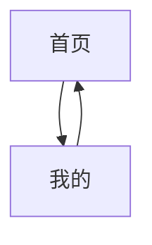
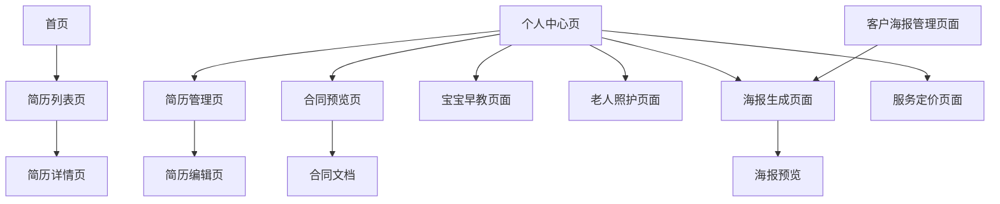

# 前端页面

<cite>
**本文档引用的文件**  
- [app.json](file://miniprogram/app.json)
- [custom-tab-bar/index.js](file://miniprogram/custom-tab-bar/index.js)
- [home/index.js](file://miniprogram/pages/home/index.js)
- [resumeList/index.js](file://miniprogram/pages/resumeList/index.js)
- [resumeDetail/index.js](file://miniprogram/pages/resumeDetail/index.js)
- [profile/index.js](file://miniprogram/pages/profile/index.js)
- [resumeManage/index.js](file://miniprogram/pages/admin/resumeManage/index.js)
- [resumeEdit/index.js](file://miniprogram/pages/admin/resumeEdit/index.js)
- [webview/index.js](file://miniprogram/pages/webview/index.js)
- [contractPreview/index.js](file://miniprogram/pages/contractPreview/index.js)
- [hourlyContractPreview/index.js](file://miniprogram/pages/hourlyContractPreview/index.js)
- [childcareContractPreview/index.js](file://miniprogram/pages/childcareContractPreview/index.js)
- [nannyChildcareContractPreview/index.js](file://miniprogram/pages/nannyChildcareContractPreview/index.js)
- [babyEducation/index.js](file://miniprogram/pages/babyEducation/index.js)
- [poster/index.js](file://miniprogram/pages/poster/index.js)
- [posterCustomerList/index.js](file://miniprogram/pages/posterCustomerList/index.js)
- [serviceFee/index.js](file://miniprogram/pages/serviceFee/index.js)
- [childcarePricing/index.js](file://miniprogram/pages/childcarePricing/index.js)
- [maternityPricing/index.js](file://miniprogram/pages/maternityPricing/index.js)
- [elderlyCare/index.js](file://miniprogram/pages/elderlyCare/index.js)
- [resume.js](file://miniprogram/services/resume.js)
- [userService.js](file://miniprogram/services/userService.js)
</cite>

## 更新摘要
**变更内容**  
- 新增教育内容页面：宝宝早教指南、老人照护指南，提供分龄启蒙和分级照护内容
- 新增海报生成系统：支持AI文案生成、智能视觉描述、客户推荐海报等功能
- 新增服务定价页面：育儿师和月嫂星级价格体系展示
- 新增服务费用透明化页面：展示服务保障和收费政策
- 新增客户海报管理：客户列表管理和批量海报生成
- 增强个人中心功能，新增教育内容入口和海报生成入口

## 目录
1. [项目结构](#项目结构)  
2. [TabBar导航结构](#tabbar导航结构)  
3. [核心页面功能详解](#核心页面功能详解)  
   - [首页](#首页)  
   - [简历列表页](#简历列表页)  
   - [简历详情页](#简历详情页)  
   - [个人中心页](#个人中心页)  
   - [合同预览页面](#合同预览页面)  
   - [webview页面](#webview页面)  
   - [简历管理页](#简历管理页)  
   - [简历编辑页](#简历编辑页)  
   - [教育内容页面](#教育内容页面)  
   - [海报生成系统](#海报生成系统)  
   - [服务定价页面](#服务定价页面)  
   - [服务费用页面](#服务费用页面)  
   - [客户海报管理](#客户海报管理)  
4. [页面间导航关系](#页面间导航关系)  
5. [关键页面实现分析](#关键页面实现分析)  
   - [简历列表页的分页与搜索](#简历列表页的分页与搜索)  
   - [合同预览页面的云存储文档处理](#合同预览页面的云存储文档处理)  
   - [简历编辑页的文件上传逻辑](#简历编辑页的文件上传逻辑)  
   - [海报生成系统的AI集成](#海报生成系统的ai集成)  
   - [教育内容页面的数据结构](#教育内容页面的数据结构)  
6. [页面状态管理](#页面状态管理)  
7. [UI与交互设计](#ui与交互设计)  
8. [总结](#总结)

## 项目结构

安得褓贝小程序的前端代码位于 `miniprogram` 目录下，采用标准的小程序项目结构。主要目录包括：

- `components/`：存放可复用的自定义组件，如 `cloudTipModal` 和 `job-type-icon`。
- `custom-tab-bar/`：自定义底部 TabBar 的实现。
- `pages/`：包含所有页面，分为普通页面（如 `home`、`profile`）、管理员专属页面（`admin/resumeManage`、`admin/resumeEdit`）和新增的教育内容、海报生成、服务定价等页面。
- `services/`：封装业务逻辑的服务层，如 `resume.js`、`userService.js` 提供简历和用户相关的 API 调用。
- `utils/`：工具函数，如 `request.js` 封装网络请求。
- `app.js`、`app.json`、`app.wxss`：小程序的全局配置和样式。

**Section sources**  
- [app.json](file://miniprogram/app.json)

## TabBar导航结构

小程序采用自定义 TabBar，通过 `app.json` 中的 `"custom": true` 启用，并在 `custom-tab-bar/index.js` 中实现。TabBar 包含三个主页面：

- **首页**：路径为 `pages/home/index`，图标为房屋形状，选中时为紫色。
- **我的**：路径为 `pages/profile/index`，图标为用户头像形状，选中时为紫色。

**更新** 移除了原有的消息页面，简化了导航结构。

每个 Tab 的点击事件通过 `switchTab` 方法触发，使用 `wx.switchTab` API 进行页面跳转。



**Diagram sources**  
- [app.json:57-76](file://miniprogram/app.json#L57-L76)
- [custom-tab-bar/index.js:13-48](file://miniprogram/custom-tab-bar/index.js#L13-L48)

## 核心页面功能详解

### 首页

首页是小程序的入口页面，提供快速访问不同工种简历的入口。用户点击"月嫂"、"育儿嫂"等按钮时，会跳转到简历列表页并传递 `jobType` 参数。

```javascript
goResumeList(e) {
  const jobType = e.currentTarget.dataset.jobtype;
  wx.navigateTo({
    url: `/pages/resumeList/index?jobType=${jobType}`
  });
}
```

**Section sources**  
- [home/index.js:11-25](file://miniprogram/pages/home/index.js#L11-L25)
- [home/index.json](file://miniprogram/pages/home/index.json)

### 简历列表页

简历列表页展示所有可用的简历，支持分页加载、关键词搜索、工种和等级筛选。页面通过 `resumeService.getResumeList` 调用后端 API 获取数据，并在滚动到底部时自动加载下一页。

- **分页加载**：通过 `page` 和 `pageSize` 参数控制。
- **搜索功能**：用户输入关键词后，实时调用 API 过滤结果。
- **筛选功能**：支持按工种（如月嫂、保姆）和服务等级（如金牌、钻石）筛选。

**Section sources**  
- [resumeList/index.js:197-576](file://miniprogram/pages/resumeList/index.js#L197-L576)
- [resumeList/index.json](file://miniprogram/pages/resumeList/index.json)

### 简历详情页

简历详情页根据 `id` 参数加载指定简历的详细信息。页面展示简历的个人信息、工作经历、技能标签、证书和自我介绍视频。

- **数据加载**：通过 `resumeService.getResumeDetailMiniprogram(id)` 获取简历详情。
- **视频播放**：支持云存储视频的播放，优先使用预加载的本地路径以提升加载速度。
- **图片预览**：点击图片可放大查看。

**Section sources**  
- [resumeDetail/index.js:166-708](file://miniprogram/pages/resumeDetail/index.js#L166-L708)
- [resumeDetail/index.json](file://miniprogram/pages/resumeDetail/index.json)

### 个人中心页

个人中心页展示用户个人信息，并提供进入简历管理页、合同管理页、教育内容和海报生成的入口。页面在 `onShow` 时调用 `getOrCreateMe` 获取用户数据，并根据用户角色判断是否显示管理入口。

```javascript
goResumeManage() {
  wx.navigateTo({ url: "/pages/admin/resumeManage/index" });
}

goContractManage() {
  wx.navigateTo({ url: "/pages/contractPreview/index" });
}

goBabyEducation() {
  wx.navigateTo({ url: "/pages/babyEducation/index" });
}

goPosterGeneration() {
  wx.navigateTo({ url: "/pages/poster/index" });
}
```

**更新** 新增了教育内容和海报生成入口，丰富了个人中心的功能。

**Section sources**  
- [profile/index.js:1-53](file://miniprogram/pages/profile/index.js#L1-L53)
- [profile/index.json](file://miniprogram/pages/profile/index.json)

### 合同预览页面

**新增** 合同预览页面提供多种类型的合同文档预览功能，包括标准合同、小时工合同、育儿服务合同和保姆育儿服务合同。所有页面都基于相同的云存储文档处理流程。

- **权限验证**：通过 `userService.requireLogin()` 检查用户登录状态。
- **云存储文档处理**：使用 `wx.cloud.getTempFileURL` 获取临时访问链接，然后下载到本地并使用 `wx.openDocument` 打开。
- **错误处理**：针对权限不足、文件不存在等错误情况提供友好的用户提示。
- **分享功能**：支持将合同页面分享给好友。

**更新** 新增了四种不同类型的合同预览页面，满足不同的服务场景需求。

**Section sources**  
- [contractPreview/index.js:1-132](file://miniprogram/pages/contractPreview/index.js#L1-L132)
- [hourlyContractPreview/index.js:1-132](file://miniprogram/pages/hourlyContractPreview/index.js#L1-L132)
- [childcareContractPreview/index.js:1-132](file://miniprogram/pages/childcareContractPreview/index.js#L1-L132)
- [nannyChildcareContractPreview/index.js:1-131](file://miniprogram/pages/nannyChildcareContractPreview/index.js#L1-L131)

### webview页面

**新增** webview页面用于加载外部网页内容，支持通过URL参数传递目标页面地址和标题。

- **URL解码**：对传入的URL进行解码处理，支持中文字符。
- **导航栏标题**：可选的标题参数用于设置页面导航栏标题。
- **错误处理**：提供 `onWebViewError` 回调处理网页加载失败的情况。

**Section sources**  
- [webview/index.js:1-18](file://miniprogram/pages/webview/index.js#L1-L18)

### 简历管理页

简历管理页为员工专属功能，仅当用户角色为 `staff` 时可访问。页面展示所有简历的列表，并提供新增、编辑、删除操作。

- **权限校验**：通过 `ensureStaff` 方法检查用户角色。
- **数据加载**：调用 `resumeService` 的 `listForManage` 接口获取简历列表。
- **删除操作**：弹出确认框，确认后调用 `remove` 接口删除简历。

**Section sources**  
- [resumeManage/index.js:23-112](file://miniprogram/pages/admin/resumeManage/index.js#L23-L112)
- [resumeManage/index.json](file://miniprogram/pages/admin/resumeManage/index.json)

### 简历编辑页

简历编辑页用于新增或编辑简历，支持表单输入和媒体文件上传（封面、图片、视频）。

- **表单字段**：包括姓名、年龄、城市、经验、价格、标签、状态等。
- **文件上传**：通过 `wx.chooseMedia` 选择文件，调用 `wx.cloud.uploadFile` 上传至云存储。
- **保存逻辑**：调用 `resumeService.upsert` 接口保存或更新简历。

**Section sources**  
- [resumeEdit/index.js:8-211](file://miniprogram/pages/admin/resumeEdit/index.js#L8-L211)
- [resumeEdit/index.json](file://miniprogram/pages/admin/resumeEdit/index.json)

### 教育内容页面

**新增** 教育内容页面包含宝宝早教和老人照护两大模块，提供专业的育儿和照护指导。

#### 宝宝早教页面

提供0-6岁宝宝的分龄早教指导，包含8个年龄段的发育特点和训练项目：

- **分龄内容**：从0-3个月到2.5-3岁，每个阶段都有特定的发育特征和训练重点
- **训练领域**：涵盖视觉听觉、大动作、精细动作、语言、社交等五大领域
- **互动游戏**：提供具体的亲子互动游戏和训练方法
- **分享功能**：支持将早教内容分享给其他用户

#### 老人照护页面

提供基于国家标准的老人照护指南，包含三个能力等级的照护方案：

- **能力评估**：基于GB/T 42195-2022国家标准，提供三个能力等级的划分
- **循证照护**：结合WHO ICOPE框架，提供科学的照护方案
- **关键任务**：涵盖26项关键照护任务，包括压疮防控、跌倒预防、慢病管理等
- **专业提醒**：提供用药安全、营养管理、康复训练等专业指导

**Section sources**  
- [babyEducation/index.js:1-94](file://miniprogram/pages/babyEducation/index.js#L1-L94)
- [elderlyCare/index.js:1-68](file://miniprogram/pages/elderlyCare/index.js#L1-L68)

### 海报生成系统

**新增** 海报生成系统支持AI驱动的个性化海报制作，包含多种主题和功能：

#### 核心功能

- **AI文案生成**：基于豆包AI模型生成个性化激励文案
- **智能视觉描述**：根据文案自动生成匹配的视觉场景描述
- **多主题设计**：提供情感、事业、创业、经济独立四大主题
- **客户推荐模式**：支持员工为推荐客户生成专属海报

#### 技术实现

- **并行处理**：AI文案生成、图片下载、Canvas合成等操作并行执行
- **本地缓存**：Logo、二维码等静态资源本地缓存，提升性能
- **高清输出**：支持2K超高清海报输出，确保打印质量
- **云端存储**：生成的海报自动上传到云存储，支持分享和保存

#### 客户模式

- **信息收集**：从CRM系统获取客户详细信息
- **模板定制**：根据客户需求生成个性化海报
- **员工标识**：在海报中标注推荐员工信息
- **一键生成**：支持批量生成客户推荐海报

**Section sources**  
- [poster/index.js:1-1029](file://miniprogram/pages/poster/index.js#L1-L1029)
- [posterCustomerList/index.js:1-125](file://miniprogram/pages/posterCustomerList/index.js#L1-L125)

### 服务定价页面

**新增** 服务定价页面展示安得褓贝的各项服务价格体系：

#### 育儿师定价

- **星级体系**：金牌、皇冠、钻石、首席四个等级
- **价格区间**：从6000-13000元起的差异化定价
- **技能匹配**：每个等级对应不同的专业技能和服务范围
- **经验要求**：明确各等级的从业经验和专业资质

#### 月嫂定价

- **等级划分**：初级到皇冠六个等级的价格体系
- **专业能力**：涵盖新生儿护理、产妇护理、月子餐制作等技能
- **服务范围**：从基础护理到高级专业护理的全面覆盖
- **收费标准**：透明化的收费结构和附加服务说明

**Section sources**  
- [childcarePricing/index.js:1-120](file://miniprogram/pages/childcarePricing/index.js#L1-L120)
- [maternityPricing/index.js:1-147](file://miniprogram/pages/maternityPricing/index.js#L1-L147)

### 服务费用页面

**新增** 服务费用页面展示安得褓贝的服务保障和收费政策：

- **服务承诺**：专业背景调查、24小时响应、不限次换人等核心服务
- **安全保障**：百万职业保险、国家授权机构认证等保障措施
- **退款政策**：3天内无条件退款的无忧退服务
- **透明收费**：详细的费用构成和服务内容说明

**Section sources**  
- [serviceFee/index.js:1-40](file://miniprogram/pages/serviceFee/index.js#L1-L40)

### 客户海报管理

**新增** 客户海报管理页面支持员工管理推荐客户的海报生成：

- **客户列表**：基于CRM系统获取的客户信息列表
- **状态管理**：显示客户的签约状态和跟进进度
- **信息脱敏**：保护客户隐私，手机号码部分隐藏
- **批量操作**：支持批量生成和管理客户推荐海报
- **搜索功能**：支持按关键字搜索客户信息

**Section sources**  
- [posterCustomerList/index.js:1-125](file://miniprogram/pages/posterCustomerList/index.js#L1-L125)

## 页面间导航关系

**更新** 页面间的导航关系已调整，新增了教育内容、海报生成、服务定价等相关页面。

页面间的导航关系如下：

- 从 **首页** 点击工种按钮 → 跳转至 **简历列表页**（带 `jobType` 参数）。
- 从 **简历列表页** 点击简历项 → 跳转至 **简历详情页**（带 `id` 参数）。
- 从 **个人中心页** 点击"简历管理" → 跳转至 **简历管理页**。
- 从 **个人中心页** 点击"合同管理" → 跳转至 **合同预览页**。
- 从 **个人中心页** 点击"宝宝早教" → 跳转至 **宝宝早教页面**。
- 从 **个人中心页** 点击"老人照护" → 跳转至 **老人照护页面**。
- 从 **个人中心页** 点击"海报生成" → 跳转至 **海报生成页面**。
- 从 **个人中心页** 点击"服务定价" → 跳转至 **服务定价页面**。
- 从 **简历管理页** 点击"新增"或"编辑" → 跳转至 **简历编辑页**（带 `id` 参数）。
- 从 **合同预览页** 点击"查看合同" → 通过云存储文档处理流程打开合同文档。
- 从 **海报生成页面** 点击"生成海报" → 调用AI接口生成个性化海报。
- 从 **客户海报管理页面** 点击客户 → 跳转至 **海报生成页面**（带 `customerId` 参数）。



**Diagram sources**  
- [home/index.js:16-24](file://miniprogram/pages/home/index.js#L16-L24)
- [resumeList/index.js:578-583](file://miniprogram/pages/resumeList/index.js#L578-L583)
- [profile/index.js](file://miniprogram/pages/profile/index.js#L50)
- [resumeManage/index.js:74-80](file://miniprogram/pages/admin/resumeManage/index.js#L74-L80)
- [posterCustomerList/index.js:107-117](file://miniprogram/pages/posterCustomerList/index.js#L107-L117)

## 关键页面实现分析

### 简历列表页的分页与搜索

简历列表页通过 `loadMore` 方法实现分页加载。每次加载时，将当前页码、每页数量、关键词、筛选条件等参数传递给 `resumeService.getResumeList`。

```javascript
async loadMore() {
  if (this.data.loading || !this.data.hasMore) return;
  this.setData({ loading: true });
  const params = {
    page: this.data.page,
    pageSize: this.data.pageSize,
    keyword: this.data.keyword
  };
  const resp = await resumeService.getResumeList(params);
  // 处理响应数据...
}
```

**Section sources**  
- [resumeList/index.js:330-576](file://miniprogram/pages/resumeList/index.js#L330-L576)

### 合同预览页面的云存储文档处理

**新增** 合同预览页面实现了完整的云存储文档处理流程，包括权限验证、临时链接获取、文件下载和文档打开。

```javascript
previewContract() {
  wx.showLoading({ title: '加载中...', mask: true });
  
  // 获取云文件的临时链接
  wx.cloud.getTempFileURL({
    fileList: [this.data.contractFileId],
    success: res => {
      wx.hideLoading();
      
      if (res.fileList && res.fileList.length > 0) {
        const fileInfo = res.fileList[0];
        
        // 检查是否有错误
        if (fileInfo.status !== 0) {
          // 权限错误提示
          if (fileInfo.errMsg === 'STORAGE_EXCEED_AUTHORITY') {
            wx.showModal({
              title: '权限不足',
              content: '该文件需要管理员在云开发控制台设置访问权限。\n\n请联系管理员将云存储文件夹权限设置为"所有用户可读"',
              showCancel: false,
              confirmText: '我知道了'
            });
          }
          return;
        }

        const tempFileURL = fileInfo.tempFileURL;
        
        // 下载文件到本地
        wx.downloadFile({
          url: tempFileURL,
          success: function (downloadRes) {
            if (downloadRes.statusCode === 200) {
              // 打开文档
              wx.openDocument({
                filePath: downloadRes.tempFilePath,
                fileType: 'docx',
                showMenu: true
              });
            }
          }
        });
      }
    }
  });
}
```

**Section sources**  
- [contractPreview/index.js:22-129](file://miniprogram/pages/contractPreview/index.js#L22-L129)

### 简历编辑页的文件上传逻辑

简历编辑页通过 `uploadOne` 方法上传文件。选择文件后，生成唯一的 `cloudPath`，调用 `wx.cloud.uploadFile` 上传，并将返回的 `fileID` 保存到表单中。

```javascript
async uploadOne(tempFilePath, ext) {
  const cloudPath = `resume/${Date.now()}-${Math.random().toString(16).slice(2)}.${ext}`;
  const res = await wx.cloud.uploadFile({
    cloudPath,
    filePath: tempFilePath
  });
  return res.fileID;
}
```

**Section sources**  
- [resumeEdit/index.js:106-113](file://miniprogram/pages/admin/resumeEdit/index.js#L106-L113)

### 海报生成系统的AI集成

**新增** 海报生成系统深度集成了豆包AI服务，实现智能化的海报制作流程：

#### AI文案生成

```javascript
_callDoubaoTextAPI(themeName) {
  const prompt = `你是专为中年女性写心灵激励文案的创作者。目标读者：35-50岁普通女性，经历过生活的起伏，渴望被看见、被鼓励，正在努力活出自己。请为「${themeName}」主题生成3条文案，每条包含：
- 主句：不超过12字，有力量感，不说教，像朋友说的话，能触动人心
- 副句：不超过18字，温柔呼应主句，给人温暖和勇气
严格按以下格式输出，不要序号、不要解释：
主句1|副句1
主句2|副句2
主句3|副句3`;
  
  return new Promise((resolve, reject) => {
    wx.request({
      url: DOUBAO_TXT_URL,
      method: 'POST',
      header: {
        'Content-Type': 'application/json',
        'Authorization': `Bearer ${DOUBAO_API_KEY}`
      },
      data: {
        model: DOUBAO_TXT_MODEL,
        messages: [{ role: 'user', content: prompt }],
        temperature: 0.9,
        max_tokens: 200,
        thinking: { type: 'disabled' }
      },
      success(res) {
        // 解析AI生成的文案
        const raw = res.data?.choices?.[0]?.message?.content || '';
        const texts = raw.trim().split('\n')
          .map(l => l.trim())
          .filter(l => l.includes('|'))
          .map(l => {
            const [main, sub] = l.split('|');
            return { main: (main || '').trim(), sub: (sub || '').trim() };
          })
          .filter(t => t.main && t.sub)
          .slice(0, 3);
        
        texts.length ? resolve(texts) : reject(new Error('文案解析失败'));
      },
      fail(err) { reject(new Error(err.errMsg || '网络请求失败')); }
    });
  });
}
```

#### 智能视觉描述

```javascript
_generateImagePromptFromText(main, sub, themeName) {
  return new Promise((resolve, reject) => {
    wx.request({
      url: DOUBAO_TXT_URL,
      method: 'POST',
      header: {
        'Content-Type': 'application/json',
        'Authorization': `Bearer ${DOUBAO_API_KEY}`
      },
      data: {
        model: DOUBAO_TXT_MODEL,
        messages: [{
          role: 'user',
          content: `你是专业图片创意总监，擅长把文字转化为摄影画面描述。
根据以下女性激励金句，生成一段适合作为海报背景图的画面描述。
金句：「${main}，${sub}」
主题分类：${themeName}
要求：
- 只输出画面描述，不超过60字，不要解释
- 场景与金句情绪匹配（可以是人物/风景/空间/静物）
- 人物要求：若有人物，须为东方女性，真实肤色，情绪自然
- 画面中绝对不能有任何文字、字母、符号、水印`
        }],
        temperature: 0.85,
        max_tokens: 120,
        thinking: { type: 'disabled' }
      },
      success(res) {
        const desc = res.data?.choices?.[0]?.message?.content?.trim() || '';
        desc ? resolve(desc) : reject(new Error('未生成视觉描述'));
      },
      fail(err) { reject(new Error(err.errMsg || '请求失败')); }
    });
  });
}
```

#### 并行处理优化

```javascript
async onGenerate() {
  // 并行执行多个异步操作
  const [bgUrl, [qrPath, logoLocalPath]] = await Promise.all([
    this._callDoubaoAPI(imagePrompt),
    qrLogoPromise
  ]);
  
  // 合成海报
  const posterPath = await this._renderCanvas(localPath, qrPath, logoLocalPath, textObj);
  
  // 分享海报
  wx.showShareImageMenu({
    path: posterPath,
    fail: () => {
      // 降级处理
      wx.saveImageToPhotosAlbum({
        filePath: posterPath,
        success: () => wx.showToast({ title: '已保存到相册', icon: 'success' })
      });
    }
  });
}
```

**Section sources**  
- [poster/index.js:265-388](file://miniprogram/pages/poster/index.js#L265-L388)
- [poster/index.js:390-461](file://miniprogram/pages/poster/index.js#L390-L461)
- [poster/index.js:463-661](file://miniprogram/pages/poster/index.js#L463-L661)

### 教育内容页面的数据结构

**新增** 教育内容页面采用结构化的数据组织方式：

#### 宝宝早教数据结构

```javascript
schedule: [
  { 
    dot: '0-3m', 
    age: '0-3 月龄', 
    hint: '视觉与听觉敏感期',
    feature: '从模糊到清晰，宝宝用感官开始探索世界',
    items: [
      { n: '黑白卡视觉训练', d: '感官', p: '高对比图案，距离 20-30cm，每次 2-3 分钟' },
      { n: '每日趴卧 (Tummy Time)', d: '大动作', p: '累计 15-30 分钟，锻炼颈背力量' },
      // 更多训练项目...
    ] 
  },
  // 更多年龄段...
]
```

#### 老人照护数据结构

```javascript
phases: [
  { 
    dot: '0-1级', 
    title: '自理期 · 健康管理', 
    hint: '能力完好 / 轻度失能',
    feature: 'GB/T 42195-2022 国标能力 0-1 级...',
    items: [
      { t: '老年综合评估 CGA', d: '每年 1 次：ADL/IADL 量表 + 跌倒史 + 简易精神状态量表...' },
      { t: '营养与饮食', d: '《中国老年人膳食指南 2022》：蛋白质 1.0-1.2g/kg/天...' },
      // 更多照护项目...
    ] 
  },
  // 更多照护阶段...
]
```

**Section sources**  
- [babyEducation/index.js:4-71](file://miniprogram/pages/babyEducation/index.js#L4-L71)
- [elderlyCare/index.js:4-45](file://miniprogram/pages/elderlyCare/index.js#L4-L45)

## 页面状态管理

页面通过 `setData` 方法管理状态，常见的状态包括：

- `loading`：控制加载中提示。
- `loaded`：表示数据是否已加载完成。
- `hasMore`：判断是否还有更多数据可加载。
- `error`：处理加载失败的情况。

**更新** 新增了教育内容页面的状态管理，包括 `shareLogo`、`schedule`、`phases` 等数据状态。

例如，在简历详情页中，`loaded` 状态用于控制骨架屏的显示与隐藏。

**Section sources**  
- [resumeDetail/index.js](file://miniprogram/pages/resumeDetail/index.js#L139)
- [resumeList/index.js](file://miniprogram/pages/resumeList/index.js#L203)
- [contractPreview/index.js](file://miniprogram/pages/contractPreview/index.js#L4)
- [babyEducation/index.js](file://miniprogram/pages/babyEducation/index.js#L4)
- [elderlyCare/index.js](file://miniprogram/pages/elderlyCare/index.js#L4)

## UI与交互设计

- **自定义TabBar**：使用 SVG 图标，通过 Base64 编码内嵌，提升加载速度。
- **视频预加载**：在简历列表页预加载视频，提升详情页播放体验。
- **响应式布局**：适配不同屏幕尺寸，确保在手机端良好显示。
- **交互反馈**：使用 `wx.showToast` 提供操作反馈，如"已保存"、"删除失败"、"权限不足"等。
- **合同文档预览**：提供统一的合同文档预览界面，支持多种合同类型。
- **AI海报生成**：提供智能化的海报制作体验，支持多种主题和风格。
- **教育内容展示**：采用时间轴和卡片式布局，清晰展示分龄指导和照护方案。
- **服务定价展示**：使用星级图标和颜色区分，直观展示服务等级和价格。

## 总结

安得褓贝小程序的前端页面结构经过重大更新，新增了教育内容、海报生成、服务定价等多个重要功能模块，显著提升了平台的专业性和用户体验。通过自定义 TabBar 提供直观的导航，各页面职责明确，数据加载和状态管理合理。

**主要更新内容**：
- 新增宝宝早教和老人照护两大教育内容模块，提供专业的育儿和照护指导
- 新增海报生成系统，支持AI驱动的个性化海报制作和客户推荐功能
- 新增服务定价页面，透明化展示各项服务的价格体系
- 新增服务费用页面，详细说明服务保障和收费政策
- 个人中心功能增强，新增教育内容和海报生成入口
- 简化TabBar结构，移除消息页面
- 增强了云存储文档处理的错误处理机制
- 新增客户海报管理功能，支持员工管理推荐客户

教育内容页面基于循证医学和国家标准，提供权威的育儿和照护指导；海报生成系统通过AI技术实现智能化的内容创作；服务定价页面确保收费透明化，增强用户信任度。整体设计符合小程序开发规范，具备良好的可维护性和扩展性。