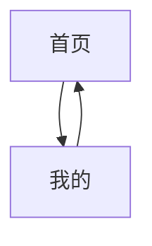
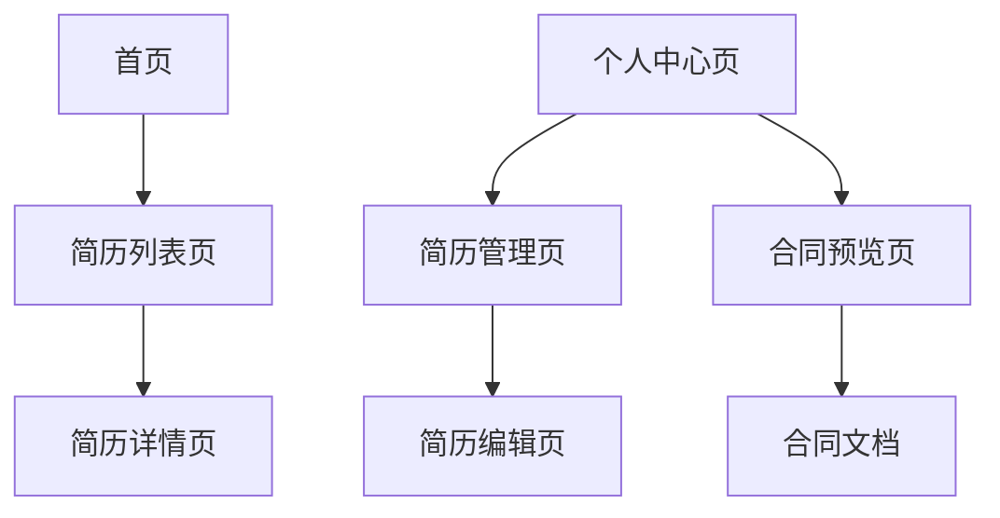

# 前端页面

<cite>
**本文档引用的文件**  
- [app.json](file://miniprogram/app.json)
- [custom-tab-bar/index.js](file://miniprogram/custom-tab-bar/index.js)
- [home/index.js](file://miniprogram/pages/home/index.js)
- [resumeList/index.js](file://miniprogram/pages/resumeList/index.js)
- [resumeDetail/index.js](file://miniprogram/pages/resumeDetail/index.js)
- [profile/index.js](file://miniprogram/pages/profile/index.js)
- [resumeManage/index.js](file://miniprogram/pages/admin/resumeManage/index.js)
- [resumeEdit/index.js](file://miniprogram/pages/admin/resumeEdit/index.js)
- [webview/index.js](file://miniprogram/pages/webview/index.js)
- [contractPreview/index.js](file://miniprogram/pages/contractPreview/index.js)
- [hourlyContractPreview/index.js](file://miniprogram/pages/hourlyContractPreview/index.js)
- [childcareContractPreview/index.js](file://miniprogram/pages/childcareContractPreview/index.js)
- [nannyChildcareContractPreview/index.js](file://miniprogram/pages/nannyChildcareContractPreview/index.js)
- [resume.js](file://miniprogram/services/resume.js)
- [userService.js](file://miniprogram/services/userService.js)
</cite>

## 更新摘要
**变更内容**  
- 新增合同管理相关页面：标准合同预览、小时工合同预览、育儿服务合同预览、保姆育儿服务合同预览
- 新增webview页面用于外部网页加载
- 增强个人中心功能，增加合同管理入口
- 更新TabBar导航结构，移除原有的消息页面

## 目录
1. [项目结构](#项目结构)  
2. [TabBar导航结构](#tabbar导航结构)  
3. [核心页面功能详解](#核心页面功能详解)  
   - [首页](#首页)  
   - [简历列表页](#简历列表页)  
   - [简历详情页](#简历详情页)  
   - [个人中心页](#个人中心页)  
   - [合同预览页面](#合同预览页面)  
   - [webview页面](#webview页面)  
   - [简历管理页](#简历管理页)  
   - [简历编辑页](#简历编辑页)  
4. [页面间导航关系](#页面间导航关系)  
5. [关键页面实现分析](#关键页面实现分析)  
   - [简历列表页的分页与搜索](#简历列表页的分页与搜索)  
   - [合同预览页面的云存储文档处理](#合同预览页面的云存储文档处理)  
   - [简历编辑页的文件上传逻辑](#简历编辑页的文件上传逻辑)  
6. [页面状态管理](#页面状态管理)  
7. [UI与交互设计](#ui与交互设计)  
8. [总结](#总结)

## 项目结构

安得褓贝小程序的前端代码位于 `miniprogram` 目录下，采用标准的小程序项目结构。主要目录包括：

- `components/`：存放可复用的自定义组件，如 `cloudTipModal` 和 `job-type-icon`。
- `custom-tab-bar/`：自定义底部 TabBar 的实现。
- `pages/`：包含所有页面，分为普通页面（如 `home`、`profile`）、管理员专属页面（`admin/resumeManage`、`admin/resumeEdit`）和新增的合同管理页面。
- `services/`：封装业务逻辑的服务层，如 `resume.js`、`userService.js` 提供简历和用户相关的 API 调用。
- `utils/`：工具函数，如 `request.js` 封装网络请求。
- `app.js`、`app.json`、`app.wxss`：小程序的全局配置和样式。

**Section sources**  
- [app.json](file://miniprogram/app.json)

## TabBar导航结构

小程序采用自定义 TabBar，通过 `app.json` 中的 `"custom": true` 启用，并在 `custom-tab-bar/index.js` 中实现。TabBar 包含三个主页面：

- **首页**：路径为 `pages/home/index`，图标为房屋形状，选中时为紫色。
- **我的**：路径为 `pages/profile/index`，图标为用户头像形状，选中时为紫色。

**更新** 移除了原有的消息页面，简化了导航结构。

每个 Tab 的点击事件通过 `switchTab` 方法触发，使用 `wx.switchTab` API 进行页面跳转。



**Diagram sources**  
- [app.json:57-76](file://miniprogram/app.json#L57-L76)
- [custom-tab-bar/index.js:13-48](file://miniprogram/custom-tab-bar/index.js#L13-L48)

## 核心页面功能详解

### 首页

首页是小程序的入口页面，提供快速访问不同工种简历的入口。用户点击"月嫂"、"育儿嫂"等按钮时，会跳转到简历列表页并传递 `jobType` 参数。

```javascript
goResumeList(e) {
  const jobType = e.currentTarget.dataset.jobtype;
  wx.navigateTo({
    url: `/pages/resumeList/index?jobType=${jobType}`
  });
}
```

**Section sources**  
- [home/index.js:11-25](file://miniprogram/pages/home/index.js#L11-L25)
- [home/index.json](file://miniprogram/pages/home/index.json)

### 简历列表页

简历列表页展示所有可用的简历，支持分页加载、关键词搜索、工种和等级筛选。页面通过 `resumeService.getResumeList` 调用后端 API 获取数据，并在滚动到底部时自动加载下一页。

- **分页加载**：通过 `page` 和 `pageSize` 参数控制。
- **搜索功能**：用户输入关键词后，实时调用 API 过滤结果。
- **筛选功能**：支持按工种（如月嫂、保姆）和服务等级（如金牌、钻石）筛选。

**Section sources**  
- [resumeList/index.js:197-576](file://miniprogram/pages/resumeList/index.js#L197-L576)
- [resumeList/index.json](file://miniprogram/pages/resumeList/index.json)

### 简历详情页

简历详情页根据 `id` 参数加载指定简历的详细信息。页面展示简历的个人信息、工作经历、技能标签、证书和自我介绍视频。

- **数据加载**：通过 `resumeService.getResumeDetailMiniprogram(id)` 获取简历详情。
- **视频播放**：支持云存储视频的播放，优先使用预加载的本地路径以提升加载速度。
- **图片预览**：点击图片可放大查看。

**Section sources**  
- [resumeDetail/index.js:166-708](file://miniprogram/pages/resumeDetail/index.js#L166-L708)
- [resumeDetail/index.json](file://miniprogram/pages/resumeDetail/index.json)

### 个人中心页

个人中心页展示用户个人信息，并提供进入简历管理页和合同管理页的入口。页面在 `onShow` 时调用 `getOrCreateMe` 获取用户数据，并根据用户角色判断是否显示管理入口。

```javascript
goResumeManage() {
  wx.navigateTo({ url: "/pages/admin/resumeManage/index" });
}

goContractManage() {
  wx.navigateTo({ url: "/pages/contractPreview/index" });
}
```

**更新** 新增了合同管理入口，方便用户直接访问合同相关功能。

**Section sources**  
- [profile/index.js:1-53](file://miniprogram/pages/profile/index.js#L1-L53)
- [profile/index.json](file://miniprogram/pages/profile/index.json)

### 合同预览页面

**新增** 合同预览页面提供多种类型的合同文档预览功能，包括标准合同、小时工合同、育儿服务合同和保姆育儿服务合同。所有页面都基于相同的云存储文档处理流程。

- **权限验证**：通过 `userService.requireLogin()` 检查用户登录状态。
- **云存储文档处理**：使用 `wx.cloud.getTempFileURL` 获取临时访问链接，然后下载到本地并使用 `wx.openDocument` 打开。
- **错误处理**：针对权限不足、文件不存在等错误情况提供友好的用户提示。
- **分享功能**：支持将合同页面分享给好友。

**更新** 新增了四种不同类型的合同预览页面，满足不同的服务场景需求。

**Section sources**  
- [contractPreview/index.js:1-132](file://miniprogram/pages/contractPreview/index.js#L1-L132)
- [hourlyContractPreview/index.js:1-132](file://miniprogram/pages/hourlyContractPreview/index.js#L1-L132)
- [childcareContractPreview/index.js:1-132](file://miniprogram/pages/childcareContractPreview/index.js#L1-L132)
- [nannyChildcareContractPreview/index.js:1-131](file://miniprogram/pages/nannyChildcareContractPreview/index.js#L1-L131)

### webview页面

**新增** webview页面用于加载外部网页内容，支持通过URL参数传递目标页面地址和标题。

- **URL解码**：对传入的URL进行解码处理，支持中文字符。
- **导航栏标题**：可选的标题参数用于设置页面导航栏标题。
- **错误处理**：提供 `onWebViewError` 回调处理网页加载失败的情况。

**Section sources**  
- [webview/index.js:1-18](file://miniprogram/pages/webview/index.js#L1-L18)

### 简历管理页

简历管理页为员工专属功能，仅当用户角色为 `staff` 时可访问。页面展示所有简历的列表，并提供新增、编辑、删除操作。

- **权限校验**：通过 `ensureStaff` 方法检查用户角色。
- **数据加载**：调用 `resumeService` 的 `listForManage` 接口获取简历列表。
- **删除操作**：弹出确认框，确认后调用 `remove` 接口删除简历。

**Section sources**  
- [resumeManage/index.js:23-112](file://miniprogram/pages/admin/resumeManage/index.js#L23-L112)
- [resumeManage/index.json](file://miniprogram/pages/admin/resumeManage/index.json)

### 简历编辑页

简历编辑页用于新增或编辑简历，支持表单输入和媒体文件上传（封面、图片、视频）。

- **表单字段**：包括姓名、年龄、城市、经验、价格、标签、状态等。
- **文件上传**：通过 `wx.chooseMedia` 选择文件，调用 `wx.cloud.uploadFile` 上传至云存储。
- **保存逻辑**：调用 `resumeService.upsert` 接口保存或更新简历。

**Section sources**  
- [resumeEdit/index.js:8-211](file://miniprogram/pages/admin/resumeEdit/index.js#L8-L211)
- [resumeEdit/index.json](file://miniprogram/pages/admin/resumeEdit/index.json)

## 页面间导航关系

**更新** 页面间的导航关系已调整，移除了消息页面的依赖。

页面间的导航关系如下：

- 从 **首页** 点击工种按钮 → 跳转至 **简历列表页**（带 `jobType` 参数）。
- 从 **简历列表页** 点击简历项 → 跳转至 **简历详情页**（带 `id` 参数）。
- 从 **个人中心页** 点击"简历管理" → 跳转至 **简历管理页**。
- 从 **个人中心页** 点击"合同管理" → 跳转至 **合同预览页**。
- 从 **简历管理页** 点击"新增"或"编辑" → 跳转至 **简历编辑页**（带 `id` 参数）。
- 从 **合同预览页** 点击"查看合同" → 通过云存储文档处理流程打开合同文档。



**Diagram sources**  
- [home/index.js:16-24](file://miniprogram/pages/home/index.js#L16-L24)
- [resumeList/index.js:578-583](file://miniprogram/pages/resumeList/index.js#L578-L583)
- [profile/index.js](file://miniprogram/pages/profile/index.js#L50)
- [resumeManage/index.js:74-80](file://miniprogram/pages/admin/resumeManage/index.js#L74-L80)

## 关键页面实现分析

### 简历列表页的分页与搜索

简历列表页通过 `loadMore` 方法实现分页加载。每次加载时，将当前页码、每页数量、关键词、筛选条件等参数传递给 `resumeService.getResumeList`。

```javascript
async loadMore() {
  if (this.data.loading || !this.data.hasMore) return;
  this.setData({ loading: true });
  const params = {
    page: this.data.page,
    pageSize: this.data.pageSize,
    keyword: this.data.keyword
  };
  const resp = await resumeService.getResumeList(params);
  // 处理响应数据...
}
```

**Section sources**  
- [resumeList/index.js:330-576](file://miniprogram/pages/resumeList/index.js#L330-L576)

### 合同预览页面的云存储文档处理

**新增** 合同预览页面实现了完整的云存储文档处理流程，包括权限验证、临时链接获取、文件下载和文档打开。

```javascript
previewContract() {
  wx.showLoading({ title: '加载中...', mask: true });
  
  // 获取云文件的临时链接
  wx.cloud.getTempFileURL({
    fileList: [this.data.contractFileId],
    success: res => {
      wx.hideLoading();
      
      if (res.fileList && res.fileList.length > 0) {
        const fileInfo = res.fileList[0];
        
        // 检查是否有错误
        if (fileInfo.status !== 0) {
          // 权限错误提示
          if (fileInfo.errMsg === 'STORAGE_EXCEED_AUTHORITY') {
            wx.showModal({
              title: '权限不足',
              content: '该文件需要管理员在云开发控制台设置访问权限。\n\n请联系管理员将云存储文件夹权限设置为"所有用户可读"',
              showCancel: false,
              confirmText: '我知道了'
            });
          }
          return;
        }

        const tempFileURL = fileInfo.tempFileURL;
        
        // 下载文件到本地
        wx.downloadFile({
          url: tempFileURL,
          success: function (downloadRes) {
            if (downloadRes.statusCode === 200) {
              // 打开文档
              wx.openDocument({
                filePath: downloadRes.tempFilePath,
                fileType: 'docx',
                showMenu: true
              });
            }
          }
        });
      }
    }
  });
}
```

**Section sources**  
- [contractPreview/index.js:22-129](file://miniprogram/pages/contractPreview/index.js#L22-L129)

### 简历编辑页的文件上传逻辑

简历编辑页通过 `uploadOne` 方法上传文件。选择文件后，生成唯一的 `cloudPath`，调用 `wx.cloud.uploadFile` 上传，并将返回的 `fileID` 保存到表单中。

```javascript
async uploadOne(tempFilePath, ext) {
  const cloudPath = `resume/${Date.now()}-${Math.random().toString(16).slice(2)}.${ext}`;
  const res = await wx.cloud.uploadFile({
    cloudPath,
    filePath: tempFilePath
  });
  return res.fileID;
}
```

**Section sources**  
- [resumeEdit/index.js:106-113](file://miniprogram/pages/admin/resumeEdit/index.js#L106-L113)

## 页面状态管理

页面通过 `setData` 方法管理状态，常见的状态包括：

- `loading`：控制加载中提示。
- `loaded`：表示数据是否已加载完成。
- `hasMore`：判断是否还有更多数据可加载。
- `error`：处理加载失败的情况。

**更新** 合同预览页面增加了 `contractFileId` 状态用于存储云存储文件ID。

例如，在简历详情页中，`loaded` 状态用于控制骨架屏的显示与隐藏。

**Section sources**  
- [resumeDetail/index.js](file://miniprogram/pages/resumeDetail/index.js#L139)
- [resumeList/index.js](file://miniprogram/pages/resumeList/index.js#L203)
- [contractPreview/index.js](file://miniprogram/pages/contractPreview/index.js#L4)

## UI与交互设计

- **自定义TabBar**：使用 SVG 图标，通过 Base64 编码内嵌，提升加载速度。
- **视频预加载**：在简历列表页预加载视频，提升详情页播放体验。
- **响应式布局**：适配不同屏幕尺寸，确保在手机端良好显示。
- **交互反馈**：使用 `wx.showToast` 提供操作反馈，如"已保存"、"删除失败"、"权限不足"等。
- **合同文档预览**：提供统一的合同文档预览界面，支持多种合同类型。

## 总结

安得褓贝小程序的前端页面结构经过重大更新，新增了合同管理和webview相关功能，增强了个人中心的实用性。通过自定义 TabBar 提供直观的导航，各页面职责明确，数据加载和状态管理合理。

**主要更新内容**：
- 新增四种合同预览页面，支持标准合同、小时工合同、育儿服务合同和保姆育儿服务合同
- 新增webview页面，支持外部网页加载
- 个人中心增加合同管理入口
- 简化TabBar结构，移除消息页面
- 增强了云存储文档处理的错误处理机制

管理员功能通过角色校验确保安全性，文件上传和视频播放优化了用户体验。整体设计符合小程序开发规范，具备良好的可维护性和扩展性。