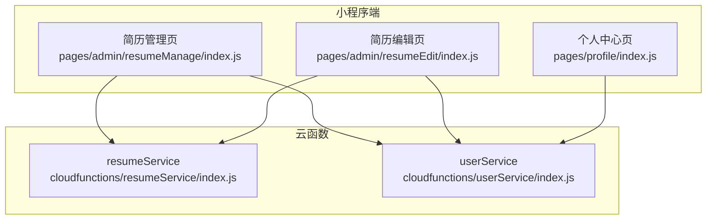
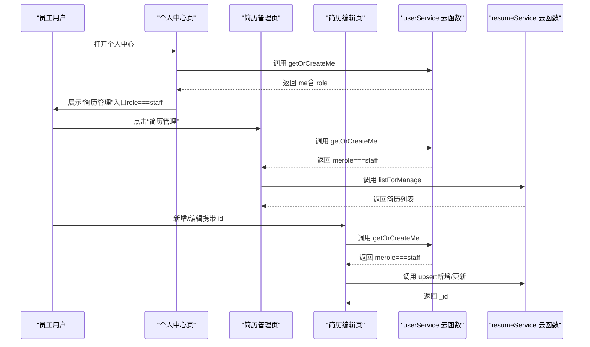
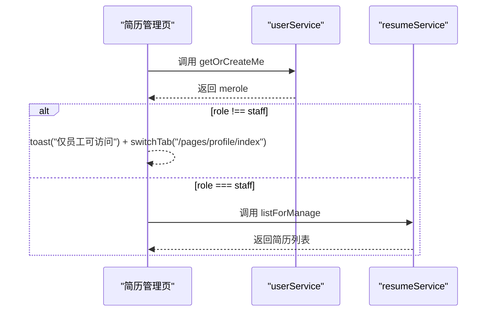
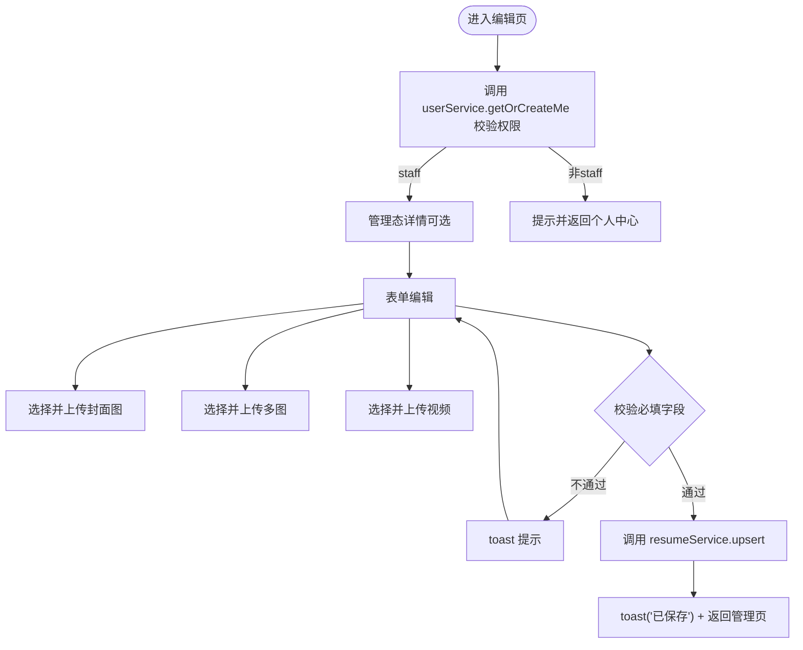
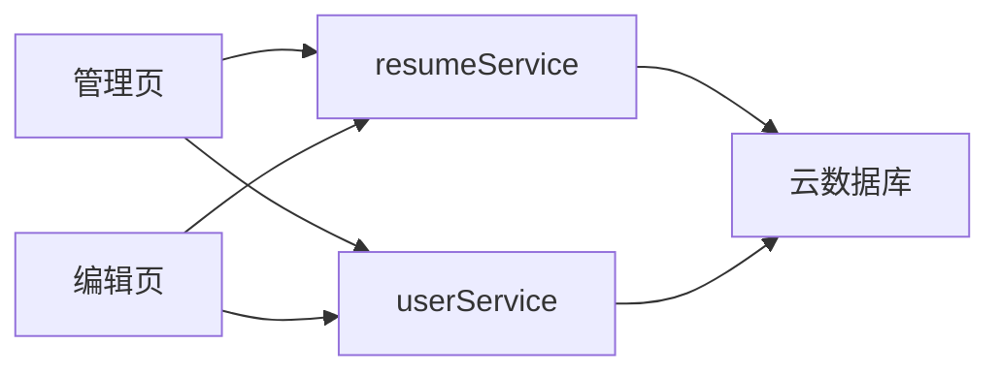

# 员工简历管理

<cite>
**本文引用的文件**
- [miniprogram/pages/admin/resumeManage/index.js](file://miniprogram/pages/admin/resumeManage/index.js)
- [miniprogram/pages/admin/resumeManage/index.json](file://miniprogram/pages/admin/resumeManage/index.json)
- [miniprogram/pages/admin/resumeEdit/index.js](file://miniprogram/pages/admin/resumeEdit/index.js)
- [miniprogram/pages/admin/resumeEdit/index.json](file://miniprogram/pages/admin/resumeEdit/index.json)
- [cloudfunctions/resumeService/index.js](file://cloudfunctions/resumeService/index.js)
- [cloudfunctions/userService/index.js](file://cloudfunctions/userService/index.js)
- [miniprogram/pages/profile/index.js](file://miniprogram/pages/profile/index.js)
- [PRD.md](file://PRD.md)
- [docs/简历管理方案深度分析.md](file://docs/简历管理方案深度分析.md)
</cite>

## 目录
1. [简介](#简介)
2. [项目结构](#项目结构)
3. [核心组件](#核心组件)
4. [架构总览](#架构总览)
5. [详细组件分析](#详细组件分析)
6. [依赖关系分析](#依赖关系分析)
7. [性能考虑](#性能考虑)
8. [故障排查指南](#故障排查指南)
9. [结论](#结论)
10. [附录](#附录)

## 简介
本文件聚焦“员工简历管理模块”，覆盖两大子功能：
- 简历管理页（resumeManage）：仅员工可见，提供简历列表、新增、编辑、删除等管理能力，并与 resumeService 云函数交互。
- 简历编辑页（resumeEdit）：支持表单输入、标签解析、封面图与多图上传至云存储、视频上传、保存提交等，保存时调用 resumeService 的 upsert 接口。

文档同时结合 PRD 与现有代码，说明权限校验流程、交互协议、数据模型、页面跳转参数与状态同步机制，并给出关键 JS 逻辑的代码片段路径，帮助读者快速定位实现细节。

## 项目结构
- 小程序端（miniprogram）包含：
  - 管理页：pages/admin/resumeManage
  - 编辑页：pages/admin/resumeEdit
  - 个人中心：pages/profile（用于员工入口与角色展示）
- 云函数（cloudfunctions）包含：
  - resumeService：简历管理相关接口（listForManage、upsert、remove、detail）
  - userService：用户信息与角色判定（getOrCreateMe、updateMe）

图表来源
- [miniprogram/pages/admin/resumeManage/index.js](file://miniprogram/pages/admin/resumeManage/index.js#L1-L112)
- [miniprogram/pages/admin/resumeEdit/index.js](file://miniprogram/pages/admin/resumeEdit/index.js#L1-L211)
- [miniprogram/pages/profile/index.js](file://miniprogram/pages/profile/index.js#L1-L53)
- [cloudfunctions/resumeService/index.js](file://cloudfunctions/resumeService/index.js#L1-L216)
- [cloudfunctions/userService/index.js](file://cloudfunctions/userService/index.js#L1-L289)

章节来源
- [miniprogram/pages/admin/resumeManage/index.js](file://miniprogram/pages/admin/resumeManage/index.js#L1-L112)
- [miniprogram/pages/admin/resumeEdit/index.js](file://miniprogram/pages/admin/resumeEdit/index.js#L1-L211)
- [cloudfunctions/resumeService/index.js](file://cloudfunctions/resumeService/index.js#L1-L216)
- [cloudfunctions/userService/index.js](file://cloudfunctions/userService/index.js#L1-L289)

## 核心组件
- 简历管理页（resumeManage）
  - 权限校验：onShow 生命周期中调用 userService 的 getOrCreateMe，仅当 me.role === "staff" 时允许继续加载。
  - 列表加载：调用 resumeService 的 listForManage 获取管理态简历列表。
  - 新增/编辑：通过 navigateTo 传入空 id 或带 id 的参数进入编辑页。
  - 删除：二次确认后调用 resumeService 的 remove 接口。
- 简历编辑页（resumeEdit）
  - 表单数据：包含基础字段与媒体字段（封面、多图、视频）。
  - 标签解析：支持逗号/中文逗号分隔，保存为数组。
  - 上传逻辑：使用 wx.cloud.uploadFile，云路径采用 resume/{timestamp}-{random}.{ext}。
  - 保存提交：调用 resumeService 的 upsert，支持新增（无 _id）与更新（有 _id）。
- 云函数交互
  - resumeService：listForManage、upsert、remove、detail（管理态）。
  - userService：getOrCreateMe、updateMe。

章节来源
- [miniprogram/pages/admin/resumeManage/index.js](file://miniprogram/pages/admin/resumeManage/index.js#L1-L112)
- [miniprogram/pages/admin/resumeEdit/index.js](file://miniprogram/pages/admin/resumeEdit/index.js#L1-L211)
- [cloudfunctions/resumeService/index.js](file://cloudfunctions/resumeService/index.js#L1-L216)
- [cloudfunctions/userService/index.js](file://cloudfunctions/userService/index.js#L1-L289)

## 架构总览
小程序端通过 wx.cloud.callFunction 调用云函数，resumeService 负责简历数据的增删改查与状态控制，userService 负责用户角色判定与个人信息维护。管理页与编辑页均依赖 userService 进行权限校验，确保仅员工可访问管理功能。

图表来源
- [miniprogram/pages/profile/index.js](file://miniprogram/pages/profile/index.js#L1-L53)
- [miniprogram/pages/admin/resumeManage/index.js](file://miniprogram/pages/admin/resumeManage/index.js#L1-L112)
- [miniprogram/pages/admin/resumeEdit/index.js](file://miniprogram/pages/admin/resumeEdit/index.js#L1-L211)
- [cloudfunctions/userService/index.js](file://cloudfunctions/userService/index.js#L1-L289)
- [cloudfunctions/resumeService/index.js](file://cloudfunctions/resumeService/index.js#L1-L216)

## 详细组件分析

### 简历管理页（resumeManage）
- 权限校验流程
  - onShow 生命周期中调用 wx.cloud.callFunction("userService", { action: "getOrCreateMe" })，读取 me.role。
  - 若非 staff，提示“仅员工可访问”，并 switchTab 到个人中心。
- 列表加载
  - 调用 wx.cloud.callFunction("resumeService", { action: "listForManage" })，返回最多 100 条，按 updatedAt 降序。
  - 将 updatedAt 转换为本地文本展示。
- 新增/编辑
  - create：navigateTo 到编辑页（无 id）。
  - edit：navigateTo 到编辑页（带 id）。
- 删除
  - showConfirm：二次确认。
  - 调用 wx.cloud.callFunction("resumeService", { action: "remove", id })，成功后 reload 刷新列表。

图表来源
- [miniprogram/pages/admin/resumeManage/index.js](file://miniprogram/pages/admin/resumeManage/index.js#L1-L112)
- [cloudfunctions/userService/index.js](file://cloudfunctions/userService/index.js#L1-L289)
- [cloudfunctions/resumeService/index.js](file://cloudfunctions/resumeService/index.js#L1-L216)

章节来源
- [miniprogram/pages/admin/resumeManage/index.js](file://miniprogram/pages/admin/resumeManage/index.js#L1-L112)
- [miniprogram/pages/admin/resumeManage/index.json](file://miniprogram/pages/admin/resumeManage/index.json#L1-L4)

### 简历编辑页（resumeEdit）
- 表单设计与数据校验
  - 基础字段：name、age、city、experienceYears、priceMonth、intro。
  - 标签：tagsText 支持逗号/中文逗号分隔，保存为数组。
  - 状态：status 为 draft/published。
  - 媒体：coverFileId（封面）、photos（最多 6 张）、videoFileId（视频）。
  - 校验：保存前校验 name 必填。
- 上传逻辑
  - 封面图：chooseMedia 选择图片，uploadOne 上传至云存储，返回 fileID。
  - 多图：chooseMedia 选择多张图片，Promise.all 并行上传，得到 fileID 数组。
  - 视频：chooseMedia 选择视频，uploadOne 上传，返回 fileID。
  - 云路径：resume/{timestamp}-{random}.{ext}。
- 保存提交
  - 调用 wx.cloud.callFunction("resumeService", { action: "upsert", data })。
  - data._id 存在则更新，否则新增。
  - 成功后 toast“已保存”，navigateBack 返回管理页。

图表来源
- [miniprogram/pages/admin/resumeEdit/index.js](file://miniprogram/pages/admin/resumeEdit/index.js#L1-L211)
- [cloudfunctions/userService/index.js](file://cloudfunctions/userService/index.js#L1-L289)
- [cloudfunctions/resumeService/index.js](file://cloudfunctions/resumeService/index.js#L1-L216)

章节来源
- [miniprogram/pages/admin/resumeEdit/index.js](file://miniprogram/pages/admin/resumeEdit/index.js#L1-L211)
- [miniprogram/pages/admin/resumeEdit/index.json](file://miniprogram/pages/admin/resumeEdit/index.json#L1-L4)

### 云函数交互协议
- userService
  - getOrCreateMe：获取或创建用户档案，写入 role。
  - updateMe：更新用户昵称、头像、手机号等。
- resumeService
  - listForManage：返回最多 100 条简历（管理态），按 updatedAt 降序。
  - upsert：新增或更新简历，支持 status 为 draft/published。
  - remove：删除指定简历。
  - detail（管理态）：forManage=true 时仅 staff 可见。

章节来源
- [cloudfunctions/userService/index.js](file://cloudfunctions/userService/index.js#L1-L289)
- [cloudfunctions/resumeService/index.js](file://cloudfunctions/resumeService/index.js#L1-L216)

### 页面间跳转与状态同步
- 管理页到编辑页
  - 新增：navigateTo("/pages/admin/resumeEdit/index")，无 id。
  - 编辑：navigateTo("/pages/admin/resumeEdit/index?id=...")，带 id。
- 编辑页返回管理页
  - 保存成功后 navigateBack 返回管理页，管理页 onShow 中再次 ensureStaff 并 reload，实现状态同步与刷新。
- 个人中心入口
  - 仅当 me.role === "staff" 时展示“简历管理”入口，点击后跳转管理页。

章节来源
- [miniprogram/pages/admin/resumeManage/index.js](file://miniprogram/pages/admin/resumeManage/index.js#L1-L112)
- [miniprogram/pages/admin/resumeEdit/index.js](file://miniprogram/pages/admin/resumeEdit/index.js#L1-L211)
- [miniprogram/pages/profile/index.js](file://miniprogram/pages/profile/index.js#L1-L53)

## 依赖关系分析
- 管理页依赖
  - userService：权限校验（getOrCreateMe）。
  - resumeService：列表（listForManage）、删除（remove）。
- 编辑页依赖
  - userService：权限校验（getOrCreateMe）。
  - resumeService：详情（forManage=true）、保存（upsert）。
  - 云存储：wx.cloud.uploadFile。
- 云函数依赖
  - resumeService：读写 resumes 集合，校验 staff 白名单。
  - userService：读写 users、staff 集合，判定角色。

图表来源
- [miniprogram/pages/admin/resumeManage/index.js](file://miniprogram/pages/admin/resumeManage/index.js#L1-L112)
- [miniprogram/pages/admin/resumeEdit/index.js](file://miniprogram/pages/admin/resumeEdit/index.js#L1-L211)
- [cloudfunctions/resumeService/index.js](file://cloudfunctions/resumeService/index.js#L1-L216)
- [cloudfunctions/userService/index.js](file://cloudfunctions/userService/index.js#L1-L289)

章节来源
- [cloudfunctions/resumeService/index.js](file://cloudfunctions/resumeService/index.js#L1-L216)
- [cloudfunctions/userService/index.js](file://cloudfunctions/userService/index.js#L1-L289)

## 性能考虑
- 列表加载
  - listForManage 限制返回 100 条，避免一次性传输过多数据。
  - 管理态详情（forManage=true）仅在编辑时调用，减少不必要的网络请求。
- 上传性能
  - 多图上传采用 Promise.all 并行，缩短总上传时间。
  - 云路径采用随机后缀，避免同名冲突。
- 前端渲染
  - 管理页对 updatedAt 做本地格式化，避免重复计算。
  - 编辑页保存时使用 showLoading 与 hideLoading，避免界面卡顿感。

[本节为通用指导，不涉及具体文件分析]

## 故障排查指南
- 无权限或失败
  - 管理页加载失败时会 toast“无权限或失败”，并清空列表。检查用户是否在 staff 集合中，或是否正确部署云函数。
- 保存失败
  - 编辑页保存失败时会 toast“保存失败（无权限？）”。检查 resumeService 的 upsert 是否抛出权限错误，或网络异常。
- 上传失败
  - 上传封面/多图/视频失败时会 toast“选择/上传失败”。检查 wx.cloud.uploadFile 的权限与网络状态。
- 角色不一致
  - 个人中心 role 与管理页不一致，检查 userService 的 getOrCreateMe 是否正确写入 role，或 staff 集合是否包含该 openid/phone。

章节来源
- [miniprogram/pages/admin/resumeManage/index.js](file://miniprogram/pages/admin/resumeManage/index.js#L1-L112)
- [miniprogram/pages/admin/resumeEdit/index.js](file://miniprogram/pages/admin/resumeEdit/index.js#L1-L211)
- [cloudfunctions/userService/index.js](file://cloudfunctions/userService/index.js#L1-L289)
- [cloudfunctions/resumeService/index.js](file://cloudfunctions/resumeService/index.js#L1-L216)

## 结论
- 管理页与编辑页均通过 userService 进行权限校验，确保仅员工可访问管理功能。
- 云函数 resumeService 提供了完整的简历管理能力，包括列表、详情（管理态）、新增/更新、删除。
- 编辑页实现了表单校验、媒体上传与保存提交，整体流程清晰、边界明确。
- 建议在后续版本中进一步细化角色权限（如区分员工与阿姨），并在管理页增加前端拦截，提升用户体验与安全性。

[本节为总结性内容，不涉及具体文件分析]

## 附录

### 关键JS逻辑代码片段路径
- 管理页权限校验与列表加载
  - [ensureStaff 与 reload](file://miniprogram/pages/admin/resumeManage/index.js#L35-L71)
  - [删除流程](file://miniprogram/pages/admin/resumeManage/index.js#L82-L111)
- 编辑页表单与上传
  - [表单输入与状态切换](file://miniprogram/pages/admin/resumeEdit/index.js#L54-L72)
  - [加载详情（管理态）](file://miniprogram/pages/admin/resumeEdit/index.js#L74-L104)
  - [封面图上传](file://miniprogram/pages/admin/resumeEdit/index.js#L115-L127)
  - [多图上传](file://miniprogram/pages/admin/resumeEdit/index.js#L133-L148)
  - [视频上传](file://miniprogram/pages/admin/resumeEdit/index.js#L154-L166)
  - [保存提交](file://miniprogram/pages/admin/resumeEdit/index.js#L172-L209)
- 云函数接口
  - [resumeService.listForManage](file://cloudfunctions/resumeService/index.js#L122-L133)
  - [resumeService.upsert](file://cloudfunctions/resumeService/index.js#L135-L169)
  - [resumeService.remove](file://cloudfunctions/resumeService/index.js#L171-L178)
  - [resumeService.detail（管理态）](file://cloudfunctions/resumeService/index.js#L108-L121)
  - [userService.getOrCreateMe](file://cloudfunctions/userService/index.js#L49-L84)

### 业务规则与PRD对照
- 发布状态控制：仅 status='published' 的简历出现在 C 端列表（此规则适用于 C 端接口，管理端可查看 draft/published）。
- 搜索规则：C 端列表支持 keyword 匹配姓名/城市（大小写不敏感）。
- 分页规则：C 端列表 pageSize 最大 20，page 从 0 开始。
- 媒体存储：封面/图片/视频均存 fileID，前端可直接以 src=fileID 展示。

章节来源
- [PRD.md](file://PRD.md#L1-L353)
- [docs/简历管理方案深度分析.md](file://docs/简历管理方案深度分析.md#L1-L629)