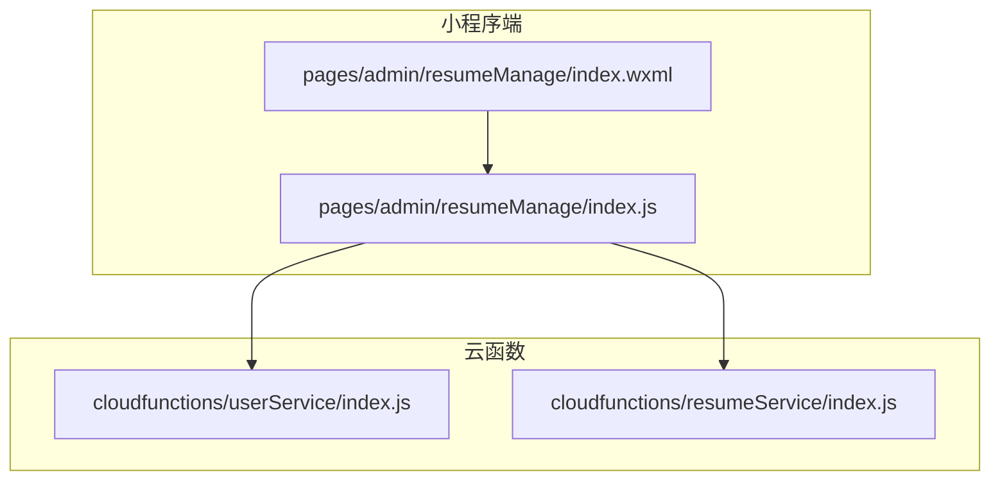
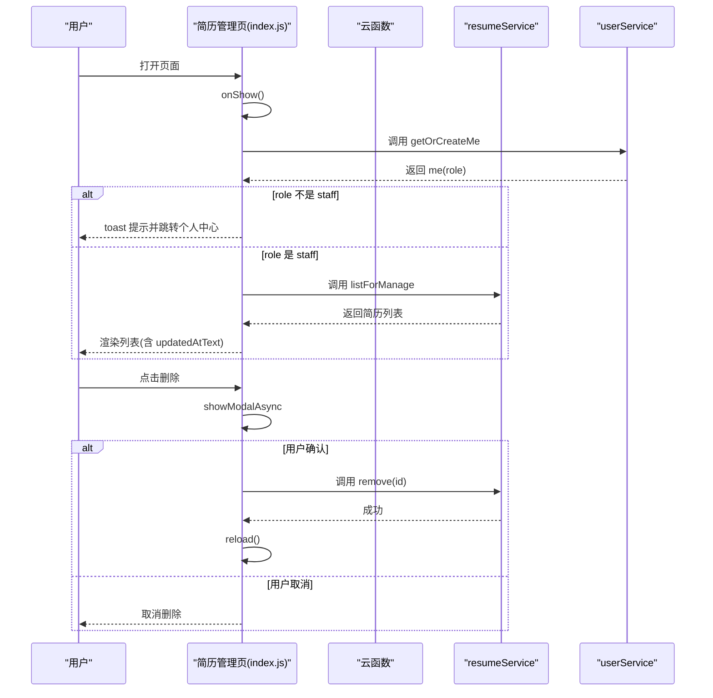
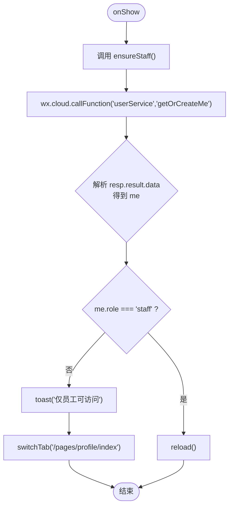
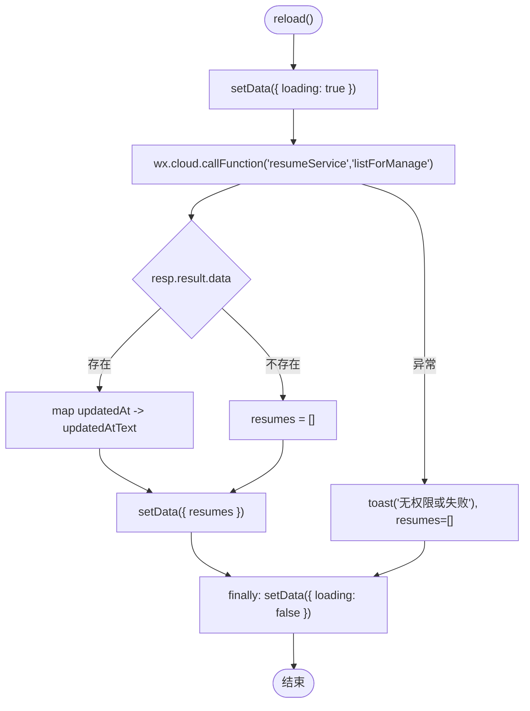
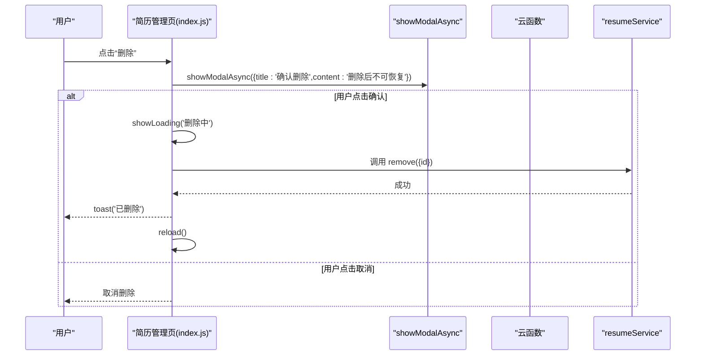
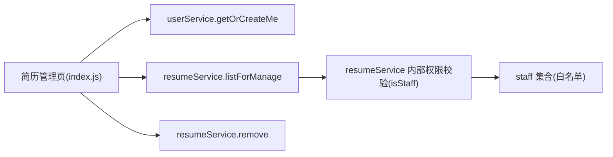

# 简历管理页

<cite>
**本文引用的文件**
- [miniprogram/pages/admin/resumeManage/index.js](file://miniprogram/pages/admin/resumeManage/index.js)
- [miniprogram/pages/admin/resumeManage/index.wxml](file://miniprogram/pages/admin/resumeManage/index.wxml)
- [cloudfunctions/userService/index.js](file://cloudfunctions/userService/index.js)
- [cloudfunctions/resumeService/index.js](file://cloudfunctions/resumeService/index.js)
- [PRD.md](file://PRD.md)
</cite>

## 目录
1. [简介](#简介)
2. [项目结构](#项目结构)
3. [核心组件](#核心组件)
4. [架构总览](#架构总览)
5. [详细组件分析](#详细组件分析)
6. [依赖关系分析](#依赖关系分析)
7. [性能考虑](#性能考虑)
8. [故障排查指南](#故障排查指南)
9. [结论](#结论)

## 简介
本页聚焦“简历管理（员工）”页面的实现逻辑，围绕以下目标展开：
- 页面加载时的员工权限校验流程（ensureStaff），通过调用 userService 云函数验证用户角色是否为 staff，若非员工则提示并跳转至个人中心。
- 简历列表的加载机制（reload），包括调用 resumeService 云函数的 listForManage 接口获取数据、加载状态管理、错误处理及时间格式化显示。
- 列表项的增删改操作交互设计：新增按钮触发 create 跳转至编辑页；编辑按钮通过 dataset 传递简历 ID 并跳转；删除功能的确认模态框实现（showModalAsync）与 remove 函数中云函数 remove 调用的完整流程。
- 结合 WXML 结构说明数据绑定与事件绑定方式，并引用 PRD 中的业务规则，如仅员工可见、删除不可逆等约束条件。

## 项目结构
简历管理页位于小程序端 pages/admin/resumeManage，其核心逻辑在 index.js 中，UI 在 index.wxml；权限与业务数据分别由云函数 userService 与 resumeService 提供。

图表来源
- [miniprogram/pages/admin/resumeManage/index.js](file://miniprogram/pages/admin/resumeManage/index.js#L1-L112)
- [miniprogram/pages/admin/resumeManage/index.wxml](file://miniprogram/pages/admin/resumeManage/index.wxml#L1-L24)
- [cloudfunctions/userService/index.js](file://cloudfunctions/userService/index.js#L1-L289)
- [cloudfunctions/resumeService/index.js](file://cloudfunctions/resumeService/index.js#L1-L216)

章节来源
- [miniprogram/pages/admin/resumeManage/index.js](file://miniprogram/pages/admin/resumeManage/index.js#L1-L112)
- [miniprogram/pages/admin/resumeManage/index.wxml](file://miniprogram/pages/admin/resumeManage/index.wxml#L1-L24)
- [cloudfunctions/userService/index.js](file://cloudfunctions/userService/index.js#L1-L289)
- [cloudfunctions/resumeService/index.js](file://cloudfunctions/resumeService/index.js#L1-L216)

## 核心组件
- 页面生命周期与事件：onShow、bindtap 事件绑定（新增、刷新、编辑、删除）。
- 权限校验：ensureStaff 通过 wx.cloud.callFunction 调用 userService 的 getOrCreateMe，读取 me.role 并判定是否为 staff。
- 列表加载：reload 通过 wx.cloud.callFunction 调用 resumeService 的 listForManage，映射 updatedAt 至 updatedAtText 用于 UI 展示。
- 时间格式化：toDateText 支持多种时间输入形式，统一转换为本地字符串。
- 删除交互：showModalAsync 包装 wx.showModal 返回 Promise，confirm 后调用 resumeService 的 remove 并刷新列表。

章节来源
- [miniprogram/pages/admin/resumeManage/index.js](file://miniprogram/pages/admin/resumeManage/index.js#L1-L112)
- [PRD.md](file://PRD.md#L158-L173)

## 架构总览
简历管理页的调用链路如下：页面 onShow -> ensureStaff -> reload -> listForManage -> 数据渲染；删除流程：点击删除 -> showModalAsync -> confirm -> 调用 remove -> 刷新列表。

图表来源
- [miniprogram/pages/admin/resumeManage/index.js](file://miniprogram/pages/admin/resumeManage/index.js#L1-L112)
- [cloudfunctions/userService/index.js](file://cloudfunctions/userService/index.js#L258-L289)
- [cloudfunctions/resumeService/index.js](file://cloudfunctions/resumeService/index.js#L180-L216)

## 详细组件分析

### 页面加载与权限校验（ensureStaff）
- 触发时机：页面 onShow 生命周期中调用 ensureStaff。
- 校验流程：
  - 调用 wx.cloud.callFunction 调用 userService 的 getOrCreateMe。
  - 解析 resp.result.data 获取 me，并检查 me.role 是否为 "staff"。
  - 若非 staff：toast 提示“仅员工可访问”，并切换到个人中心 tab。
  - 若是 staff：继续执行 reload。
- 云函数侧逻辑要点：
  - getOrCreateMe 会根据 staff 集合判定用户角色并写回 users 集合。
  - isStaff 优先通过手机号匹配 staff，其次兼容 openid。

图表来源
- [miniprogram/pages/admin/resumeManage/index.js](file://miniprogram/pages/admin/resumeManage/index.js#L29-L48)
- [cloudfunctions/userService/index.js](file://cloudfunctions/userService/index.js#L258-L289)

章节来源
- [miniprogram/pages/admin/resumeManage/index.js](file://miniprogram/pages/admin/resumeManage/index.js#L29-L48)
- [cloudfunctions/userService/index.js](file://cloudfunctions/userService/index.js#L258-L289)
- [PRD.md](file://PRD.md#L158-L173)

### 列表加载机制（reload）
- 触发时机：ensureStaff 通过后，立即调用 reload。
- 加载流程：
  - 设置 loading: true。
  - 调用 wx.cloud.callFunction 调用 resumeService 的 listForManage。
  - 解析 resp.result.data 为 list，并对每条记录映射 updatedAtText（通过 toDateText）。
  - 设置 resumes 并将 loading 设为 false。
- 错误处理：
  - 捕获异常：toast 提示“无权限或失败”，并将 resumes 置空。
- 时间格式化：
  - toDateText 支持空值、Date、字符串、数字、云开发日期对象等，统一转为本地字符串。

图表来源
- [miniprogram/pages/admin/resumeManage/index.js](file://miniprogram/pages/admin/resumeManage/index.js#L51-L71)
- [cloudfunctions/resumeService/index.js](file://cloudfunctions/resumeService/index.js#L180-L216)

章节来源
- [miniprogram/pages/admin/resumeManage/index.js](file://miniprogram/pages/admin/resumeManage/index.js#L51-L71)
- [cloudfunctions/resumeService/index.js](file://cloudfunctions/resumeService/index.js#L180-L216)
- [PRD.md](file://PRD.md#L158-L173)

### 列表项增删改交互设计
- 新增（create）：
  - WXML 中“新增简历”按钮绑定 bindtap="create"。
  - JS 中 create 跳转至编辑页（无 id）。
- 编辑（edit）：
  - WXML 中“编辑”按钮绑定 bindtap="edit"，并通过 data-id="{{item._id}}" 传入简历 ID。
  - JS 中 edit 读取 dataset.id 并跳转至编辑页（带 id）。
- 删除（remove）：
  - WXML 中“删除”按钮绑定 bindtap="remove"，并通过 data-id="{{item._id}}" 传入简历 ID。
  - JS 中 remove：
    - 通过 showModalAsync 包装 wx.showModal，等待用户确认。
    - 若 confirm 为真：showLoading -> 调用 wx.cloud.callFunction('resumeService','remove',{id}) -> toast("已删除") -> reload()。
    - 异常：toast("删除失败")。
    - finally：hideLoading。

图表来源
- [miniprogram/pages/admin/resumeManage/index.js](file://miniprogram/pages/admin/resumeManage/index.js#L73-L111)
- [cloudfunctions/resumeService/index.js](file://cloudfunctions/resumeService/index.js#L180-L216)

章节来源
- [miniprogram/pages/admin/resumeManage/index.js](file://miniprogram/pages/admin/resumeManage/index.js#L73-L111)
- [miniprogram/pages/admin/resumeManage/index.wxml](file://miniprogram/pages/admin/resumeManage/index.wxml#L1-L24)
- [PRD.md](file://PRD.md#L158-L173)

### WXML 数据绑定与事件绑定
- 顶部区域：包含“新增简历”和“刷新”两个按钮，分别绑定 create 与 reload。
- 列表区域：使用 wx:for 遍历 resumes，key 为 _id；每个 item 包含主内容与操作区。
  - 主内容：bindtap="edit"，data-id="{{item._id}}"，展示 name、status、updated-at 文本。
  - 操作区：包含“编辑”和“删除”两个按钮，均绑定 bindtap，并通过 data-id 传入简历 ID。
- 空态与加载态：
  - 当 loading 为 false 且 resumes 长度为 0 时显示“暂无数据”。
  - 当 loading 为 true 时显示“加载中...”。

章节来源
- [miniprogram/pages/admin/resumeManage/index.wxml](file://miniprogram/pages/admin/resumeManage/index.wxml#L1-L24)

## 依赖关系分析
- 页面对云函数的依赖：
  - ensureStaff 依赖 userService.getOrCreateMe。
  - reload 依赖 resumeService.listForManage。
  - 删除依赖 resumeService.remove。
- 云函数内部依赖：
  - resumeService.listForManage 与 upsert、remove 均依赖 isStaff 判定 staff 权限。
  - isStaff 优先通过手机号匹配 staff，其次兼容 openid。
- PRD 中的关键约束：
  - 仅 staff 可访问管理页（PRD 4.5）。
  - 删除不可逆（PRD 4.5）。
  - 管理列表仅 staff 可见（PRD 4.5）。

图表来源
- [miniprogram/pages/admin/resumeManage/index.js](file://miniprogram/pages/admin/resumeManage/index.js#L1-L112)
- [cloudfunctions/resumeService/index.js](file://cloudfunctions/resumeService/index.js#L180-L216)
- [cloudfunctions/userService/index.js](file://cloudfunctions/userService/index.js#L258-L289)

章节来源
- [PRD.md](file://PRD.md#L158-L173)
- [cloudfunctions/resumeService/index.js](file://cloudfunctions/resumeService/index.js#L180-L216)
- [cloudfunctions/userService/index.js](file://cloudfunctions/userService/index.js#L258-L289)

## 性能考虑
- 列表加载：
  - listForManage 返回最多 100 条，避免一次性拉取过多数据。
  - 使用 updatedAt 倒序排序，保证最新数据优先展示。
- 删除流程：
  - 删除前弹窗确认，减少误操作带来的重复请求。
  - 删除成功后立即刷新列表，避免 UI 与数据不同步。
- 时间格式化：
  - toDateText 对多种时间输入进行统一处理，减少 UI 层重复逻辑。

[本节为通用建议，不直接分析具体文件]

## 故障排查指南
- 无权限或失败：
  - reload 捕获异常时会 toast“无权限或失败”，并清空列表。检查 resumeService.listForManage 的权限校验与网络状态。
- 删除失败：
  - remove 捕获异常时会 toast“删除失败”。检查 resumeService.remove 的权限校验与网络状态。
- 仅员工可访问：
  - ensureStaff 非 staff 时会 toast“仅员工可访问”并跳转个人中心。确认 staff 白名单配置与用户角色同步。

章节来源
- [miniprogram/pages/admin/resumeManage/index.js](file://miniprogram/pages/admin/resumeManage/index.js#L51-L71)
- [miniprogram/pages/admin/resumeManage/index.js](file://miniprogram/pages/admin/resumeManage/index.js#L82-L111)
- [cloudfunctions/resumeService/index.js](file://cloudfunctions/resumeService/index.js#L180-L216)

## 结论
简历管理页通过 ensureStaff 严格限制访问权限，确保仅 staff 可操作；通过 reload 与 listForManage 实现高效的数据加载与展示；删除流程采用二次确认与错误兜底，保障数据安全与用户体验。整体实现遵循 PRD 的业务规则，具备清晰的调用链与良好的错误处理机制。