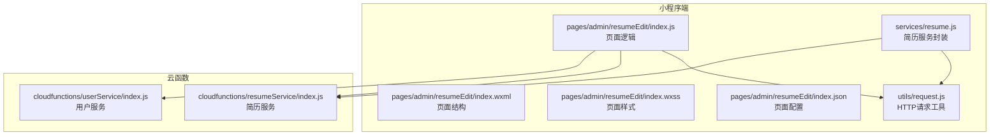
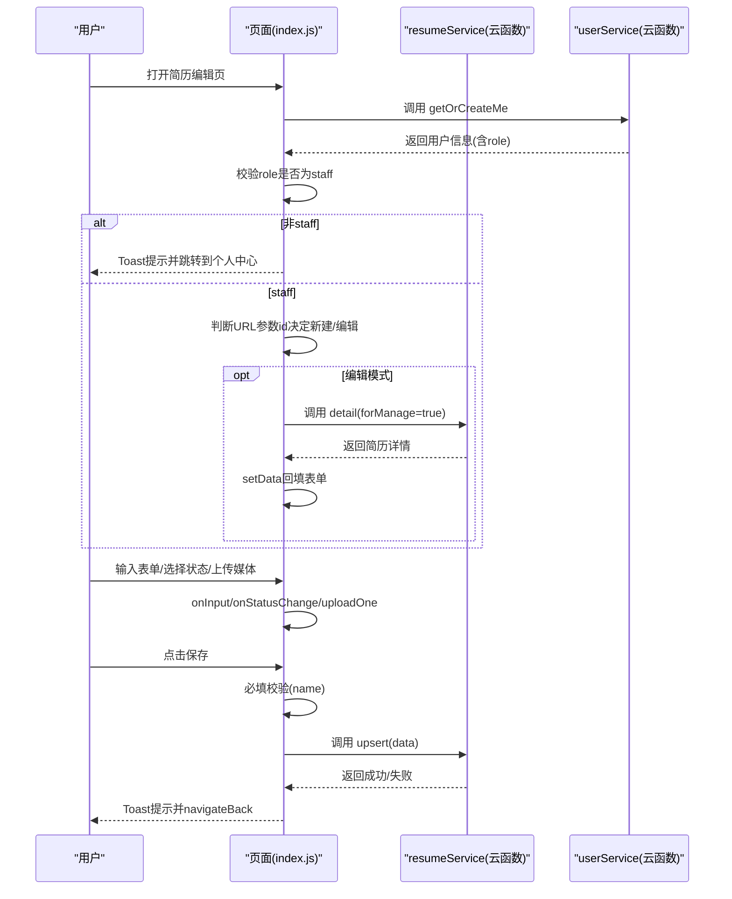
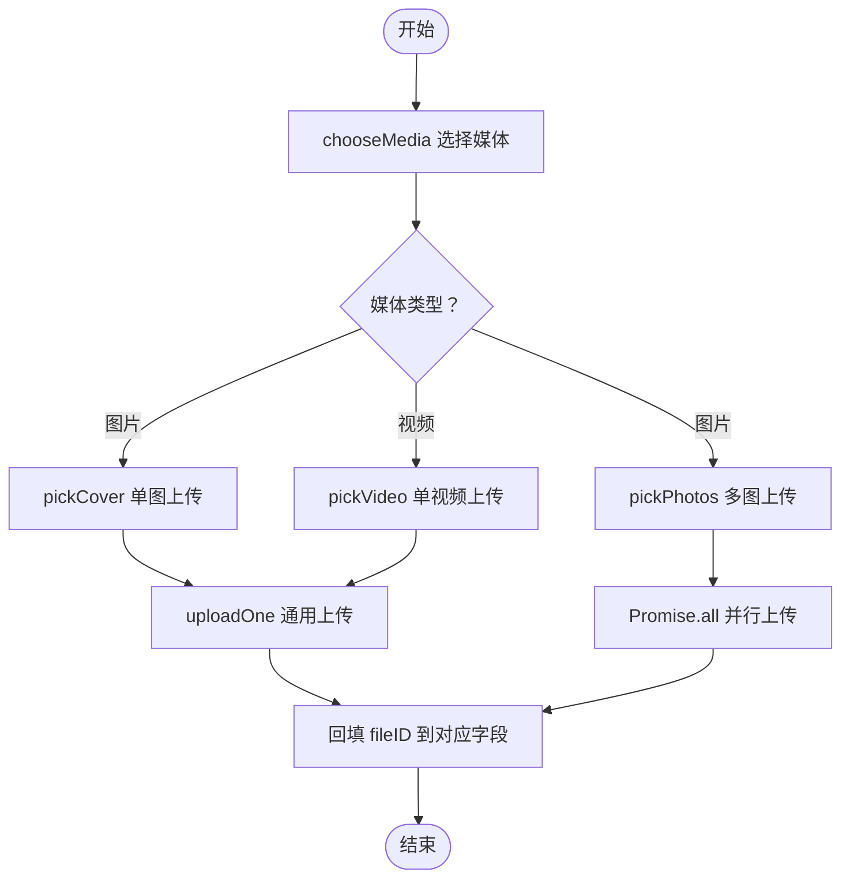
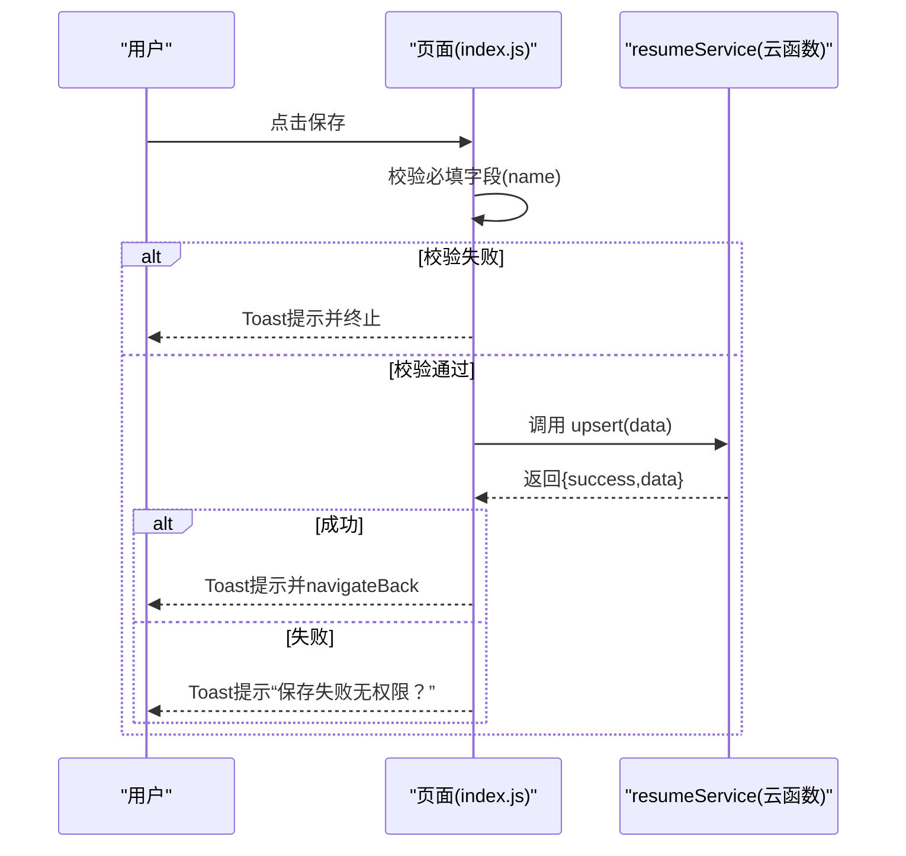
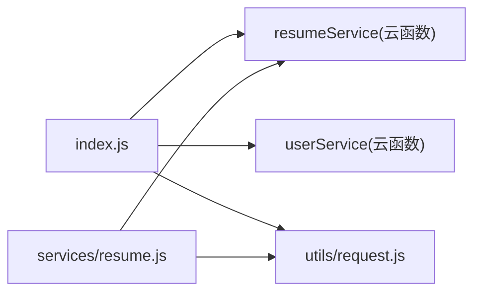

# 简历编辑页

<cite>
**本文引用的文件**
- [miniprogram/pages/admin/resumeEdit/index.js](file://miniprogram/pages/admin/resumeEdit/index.js)
- [miniprogram/pages/admin/resumeEdit/index.wxml](file://miniprogram/pages/admin/resumeEdit/index.wxml)
- [miniprogram/pages/admin/resumeEdit/index.wxss](file://miniprogram/pages/admin/resumeEdit/index.wxss)
- [miniprogram/pages/admin/resumeEdit/index.json](file://miniprogram/pages/admin/resumeEdit/index.json)
- [miniprogram/utils/request.js](file://miniprogram/utils/request.js)
- [miniprogram/services/resume.js](file://miniprogram/services/resume.js)
- [cloudfunctions/resumeService/index.js](file://cloudfunctions/resumeService/index.js)
- [cloudfunctions/userService/index.js](file://cloudfunctions/userService/index.js)
- [docs/简历管理方案深度分析.md](file://docs/简历管理方案深度分析.md)
- [PRD.md](file://PRD.md)
</cite>

## 目录
1. [简介](#简介)
2. [项目结构](#项目结构)
3. [核心组件](#核心组件)
4. [架构总览](#架构总览)
5. [详细组件分析](#详细组件分析)
6. [依赖关系分析](#依赖关系分析)
7. [性能考量](#性能考量)
8. [故障排查指南](#故障排查指南)
9. [结论](#结论)
10. [附录](#附录)

## 简介
本文件围绕“简历编辑页（resumeEdit）”的全流程实现进行深入解析，覆盖页面初始化的员工权限校验、新建/编辑状态判断、表单字段绑定与输入处理、下拉状态联动更新、多媒体文件上传机制（封面图、多图集、视频）、提交前必填校验与 upsert 操作、云函数调用、以及认证请求机制与错误处理。同时结合 resume.js 服务文件与云函数实现，给出关键流程图与最佳实践建议。

## 项目结构
简历编辑页位于小程序端的 admin 页面组内，采用页面级目录组织，配合云函数与通用请求工具实现前后端交互。

图表来源
- [miniprogram/pages/admin/resumeEdit/index.js](file://miniprogram/pages/admin/resumeEdit/index.js#L1-L211)
- [miniprogram/utils/request.js](file://miniprogram/utils/request.js#L1-L125)
- [miniprogram/services/resume.js](file://miniprogram/services/resume.js#L1-L239)
- [cloudfunctions/resumeService/index.js](file://cloudfunctions/resumeService/index.js#L1-L216)
- [cloudfunctions/userService/index.js](file://cloudfunctions/userService/index.js#L1-L200)

章节来源
- [miniprogram/pages/admin/resumeEdit/index.js](file://miniprogram/pages/admin/resumeEdit/index.js#L1-L211)
- [miniprogram/pages/admin/resumeEdit/index.wxml](file://miniprogram/pages/admin/resumeEdit/index.wxml#L1-L71)
- [miniprogram/pages/admin/resumeEdit/index.wxss](file://miniprogram/pages/admin/resumeEdit/index.wxss#L1-L127)
- [miniprogram/pages/admin/resumeEdit/index.json](file://miniprogram/pages/admin/resumeEdit/index.json#L1-L4)

## 核心组件
- 页面逻辑（index.js）：负责权限校验、新建/编辑状态判断、表单输入处理、状态选择联动、多媒体上传、提交校验与 upsert 调用。
- 页面结构（index.wxml）：定义表单项、状态选择器、封面图/相册/视频区域与操作按钮。
- 请求工具（utils/request.js）：提供公开请求与认证请求两类封装，统一处理 Token、401 过期跳转、错误日志与响应解析。
- 简历服务（services/resume.js）：封装公开与认证接口（如列表、详情、创建/更新、删除、分享、文件上传），并提供幂等性与请求标识。
- 云函数（resumeService/index.js）：实现简历列表、详情、管理列表、upsert、删除等操作，并内置员工权限校验。
- 用户服务（cloudfunctions/userService/index.js）：提供 getOrCreateMe 等用户相关能力，供页面进行员工权限校验。

章节来源
- [miniprogram/pages/admin/resumeEdit/index.js](file://miniprogram/pages/admin/resumeEdit/index.js#L1-L211)
- [miniprogram/utils/request.js](file://miniprogram/utils/request.js#L1-L125)
- [miniprogram/services/resume.js](file://miniprogram/services/resume.js#L1-L239)
- [cloudfunctions/resumeService/index.js](file://cloudfunctions/resumeService/index.js#L1-L216)
- [cloudfunctions/userService/index.js](file://cloudfunctions/userService/index.js#L1-L200)

## 架构总览
简历编辑页的整体调用链如下：
- 页面初始化：调用 ensureStaff 进行员工权限校验；根据 URL 参数 id 决定新建或编辑模式。
- 表单输入：bindinput 绑定 onInput，实时更新 data.form 对象。
- 状态选择：picker 选择器触发 onStatusChange，联动更新 statusIndex 与 form.status。
- 多媒体上传：pickCover/pickPhotos/pickVideo 调用 chooseMedia，随后调用 uploadOne 将临时文件上传至云存储，回填 fileID 至对应字段。
- 提交保存：save 中进行必填校验（如 name），随后调用 resumeService 的 upsert 接口，成功后返回上一页。

图表来源
- [miniprogram/pages/admin/resumeEdit/index.js](file://miniprogram/pages/admin/resumeEdit/index.js#L29-L209)
- [cloudfunctions/resumeService/index.js](file://cloudfunctions/resumeService/index.js#L180-L215)
- [cloudfunctions/userService/index.js](file://cloudfunctions/userService/index.js#L1-L200)

## 详细组件分析

### 页面初始化与权限校验（ensureStaff）
- 初始化流程
  - onLoad 接收 options，调用 ensureStaff 校验员工身份，若失败则提示并跳转到个人中心。
  - 若存在 id，则调用 loadDetail 获取详情并回填表单。
- 员工权限校验
  - 通过 wx.cloud.callFunction 调用 userService 的 getOrCreateMe，读取返回的用户信息并检查 role 是否为 staff。
  - 非 staff 场景下，Toast 提示“仅员工可访问”，并切换到个人中心 tab。

章节来源
- [miniprogram/pages/admin/resumeEdit/index.js](file://miniprogram/pages/admin/resumeEdit/index.js#L29-L51)
- [cloudfunctions/userService/index.js](file://cloudfunctions/userService/index.js#L1-L200)
- [PRD.md](file://PRD.md#L262-L281)

### 新建/编辑状态判断（onLoad）
- onLoad 中读取 options.id：
  - 无 id：新建模式，仅初始化表单与状态选项。
  - 有 id：编辑模式，调用 loadDetail 通过 resumeService 的 detail 接口获取详情，回填表单字段与状态索引。

章节来源
- [miniprogram/pages/admin/resumeEdit/index.js](file://miniprogram/pages/admin/resumeEdit/index.js#L29-L36)
- [cloudfunctions/resumeService/index.js](file://cloudfunctions/resumeService/index.js#L108-L120)

### 表单字段绑定与输入处理（onInput）
- onInput 使用 dataset.key 作为字段名，将用户输入 detail.value 合并到 data.form 中，实现双向绑定。
- 支持的字段包括：name、age、city、experienceYears、priceMonth、tagsText、status、coverFileId、photos、videoFileId、intro。

章节来源
- [miniprogram/pages/admin/resumeEdit/index.js](file://miniprogram/pages/admin/resumeEdit/index.js#L54-L63)
- [miniprogram/pages/admin/resumeEdit/index.wxml](file://miniprogram/pages/admin/resumeEdit/index.wxml#L1-L71)

### 下拉状态联动更新（onStatusChange）
- picker 选择器触发 onStatusChange，根据选中索引计算 status，并同时更新 statusIndex 与 form.status，确保视图与数据一致。

章节来源
- [miniprogram/pages/admin/resumeEdit/index.js](file://miniprogram/pages/admin/resumeEdit/index.js#L65-L72)
- [miniprogram/pages/admin/resumeEdit/index.wxml](file://miniprogram/pages/admin/resumeEdit/index.wxml#L27-L32)

### 标签解析函数（splitTags）
- 在保存时，将 tagsText 以中文逗号或英文逗号拆分并去空白，过滤空字符串，得到数组形式的 tags，用于 upsert 数据体。

章节来源
- [miniprogram/pages/admin/resumeEdit/index.js](file://miniprogram/pages/admin/resumeEdit/index.js#L1-L6)

### 多媒体文件上传机制
- 通用上传函数 uploadOne
  - 生成云存储路径（resume/{timestamp}-{随机}.ext），调用 wx.cloud.uploadFile，返回 fileID。
- 封面图上传（pickCover）
  - chooseMedia 选择一张图片，显示“上传中”loading，逐个上传并回填 form.coverFileId。
- 图集上传（pickPhotos）
  - chooseMedia 选择最多6张图片，使用 Promise.all 并行上传，完成后回填 form.photos。
- 视频上传（pickVideo）
  - chooseMedia 选择一个视频，显示“上传中”loading，上传后回填 form.videoFileId。
- 清空操作
  - 提供 clearCover/clearPhotos/clearVideo 清空对应字段，便于重新选择。

图表来源
- [miniprogram/pages/admin/resumeEdit/index.js](file://miniprogram/pages/admin/resumeEdit/index.js#L106-L170)

章节来源
- [miniprogram/pages/admin/resumeEdit/index.js](file://miniprogram/pages/admin/resumeEdit/index.js#L106-L170)

### 表单提交与 upsert 操作
- 提交前校验
  - save 中对 name 字段进行必填校验，为空则 Toast 提示并中断。
- upsert 调用
  - 通过 wx.cloud.callFunction 调用 resumeService 的 upsert 接口，传入包含 name、age、city、experienceYears、priceMonth、tags、status、coverFileId、photos、videoFileId、intro 等字段的数据体。
  - 成功后 Toast 提示“已保存”，并 navigateBack 返回上一页。
  - 失败时 Toast 提示“保存失败（无权限？）”。

图表来源
- [miniprogram/pages/admin/resumeEdit/index.js](file://miniprogram/pages/admin/resumeEdit/index.js#L172-L209)
- [cloudfunctions/resumeService/index.js](file://cloudfunctions/resumeService/index.js#L135-L169)

章节来源
- [miniprogram/pages/admin/resumeEdit/index.js](file://miniprogram/pages/admin/resumeEdit/index.js#L172-L209)
- [cloudfunctions/resumeService/index.js](file://cloudfunctions/resumeService/index.js#L135-L169)

### 认证请求机制与数据提交中的作用（authenticatedRequest）
- authenticatedRequest
  - 自动从本地存储读取 access_token 或 token，若缺失则直接拒绝请求。
  - 在 header 中附加 Authorization: Bearer {token}，统一走 HTTPS 基础地址。
  - 当响应为 401 时，清理本地认证数据并跳转到登录页。
- 在简历编辑页中的作用
  - 页面本身通过云函数调用实现权限校验与数据持久化，不直接使用 authenticatedRequest。
  - 但 resume.js 中的 createResume/updateResume/deleteResume 等接口使用 authenticatedRequest，体现统一认证机制。

章节来源
- [miniprogram/utils/request.js](file://miniprogram/utils/request.js#L43-L103)
- [miniprogram/services/resume.js](file://miniprogram/services/resume.js#L118-L151)

### 页面返回时的状态同步
- 保存成功后，页面调用 navigateBack 返回上一页，保持编辑前后的状态一致性。
- 由于页面未在 onUnload 中执行额外回写逻辑，返回即完成状态同步。

章节来源
- [miniprogram/pages/admin/resumeEdit/index.js](file://miniprogram/pages/admin/resumeEdit/index.js#L196-L209)

## 依赖关系分析
- 页面依赖
  - index.js 依赖 utils/request.js 进行云函数调用，依赖 resumeService 云函数进行数据持久化，依赖 userService 云函数进行员工权限校验。
- 云函数依赖
  - resumeService 依赖云开发 SDK 初始化、数据库与命令，内部实现 isStaff 权限校验、upsertResume 新增/更新逻辑。
  - userService 提供 getOrCreateMe 等用户能力，支撑 ensureStaff。
- 服务封装
  - services/resume.js 提供公开与认证接口封装，统一请求头与错误处理，便于业务层复用。

图表来源
- [miniprogram/pages/admin/resumeEdit/index.js](file://miniprogram/pages/admin/resumeEdit/index.js#L1-L211)
- [miniprogram/utils/request.js](file://miniprogram/utils/request.js#L1-L125)
- [miniprogram/services/resume.js](file://miniprogram/services/resume.js#L1-L239)
- [cloudfunctions/resumeService/index.js](file://cloudfunctions/resumeService/index.js#L1-L216)
- [cloudfunctions/userService/index.js](file://cloudfunctions/userService/index.js#L1-L200)

章节来源
- [miniprogram/pages/admin/resumeEdit/index.js](file://miniprogram/pages/admin/resumeEdit/index.js#L1-L211)
- [miniprogram/utils/request.js](file://miniprogram/utils/request.js#L1-L125)
- [miniprogram/services/resume.js](file://miniprogram/services/resume.js#L1-L239)
- [cloudfunctions/resumeService/index.js](file://cloudfunctions/resumeService/index.js#L1-L216)
- [cloudfunctions/userService/index.js](file://cloudfunctions/userService/index.js#L1-L200)

## 性能考量
- 多图上传采用 Promise.all 并行上传，显著提升批量媒体上传效率。
- 上传路径采用时间戳+随机数命名，避免冲突并利于缓存控制。
- 表单输入采用实时合并更新，减少不必要的 setData 次数。
- 详情加载与保存均显示 loading，改善用户体验。

章节来源
- [miniprogram/pages/admin/resumeEdit/index.js](file://miniprogram/pages/admin/resumeEdit/index.js#L133-L147)
- [miniprogram/pages/admin/resumeEdit/index.js](file://miniprogram/pages/admin/resumeEdit/index.js#L106-L113)
- [miniprogram/pages/admin/resumeEdit/index.js](file://miniprogram/pages/admin/resumeEdit/index.js#L74-L104)
- [miniprogram/pages/admin/resumeEdit/index.js](file://miniprogram/pages/admin/resumeEdit/index.js#L172-L209)

## 故障排查指南
- 员工权限不足
  - 现象：打开页面即提示“仅员工可访问”并跳转。
  - 排查：确认 getOrCreateMe 返回的用户 role 是否为 staff；检查云函数 isStaff 判定逻辑。
- 上传失败
  - 现象：选择/上传失败提示。
  - 排查：检查 chooseMedia 选择是否成功、uploadOne 上传是否异常、网络状态与云存储权限。
- 保存失败（无权限？）
  - 现象：保存时报错“保存失败（无权限？）”。
  - 排查：确认 resumeService 的 upsert 是否抛出“permission denied”；检查云函数 isStaff 判定与调用上下文。
- 401 Token 过期
  - 现象：authenticatedRequest 返回 401 并自动跳转登录。
  - 排查：确认本地 access_token 是否存在且有效；检查登录流程与 Token 刷新策略。

章节来源
- [miniprogram/pages/admin/resumeEdit/index.js](file://miniprogram/pages/admin/resumeEdit/index.js#L38-L51)
- [miniprogram/pages/admin/resumeEdit/index.js](file://miniprogram/pages/admin/resumeEdit/index.js#L115-L170)
- [miniprogram/pages/admin/resumeEdit/index.js](file://miniprogram/pages/admin/resumeEdit/index.js#L172-L209)
- [miniprogram/utils/request.js](file://miniprogram/utils/request.js#L70-L103)
- [cloudfunctions/resumeService/index.js](file://cloudfunctions/resumeService/index.js#L135-L169)

## 结论
简历编辑页通过清晰的职责划分与完善的权限校验，实现了从员工身份确认、新建/编辑状态判断、表单输入与状态联动、多媒体上传到 upsert 提交的完整闭环。页面逻辑简洁、云函数权限严格，配合统一的认证请求机制，保证了功能正确性与安全性。建议在后续迭代中进一步完善上传进度监听与错误重试策略，以提升复杂场景下的稳定性与用户体验。

## 附录
- 关键代码片段路径
  - 标签解析函数：[splitTags](file://miniprogram/pages/admin/resumeEdit/index.js#L1-L6)
  - 表单输入处理：[onInput](file://miniprogram/pages/admin/resumeEdit/index.js#L54-L63)
  - 状态联动更新：[onStatusChange](file://miniprogram/pages/admin/resumeEdit/index.js#L65-L72)
  - 通用上传函数：[uploadOne](file://miniprogram/pages/admin/resumeEdit/index.js#L106-L113)
  - 封面图上传：[pickCover](file://miniprogram/pages/admin/resumeEdit/index.js#L115-L127)
  - 图集上传：[pickPhotos](file://miniprogram/pages/admin/resumeEdit/index.js#L133-L148)
  - 视频上传：[pickVideo](file://miniprogram/pages/admin/resumeEdit/index.js#L154-L166)
  - 提交保存：[save](file://miniprogram/pages/admin/resumeEdit/index.js#L172-L209)
  - 员工权限校验：[ensureStaff](file://miniprogram/pages/admin/resumeEdit/index.js#L38-L51)
  - 详情加载：[loadDetail](file://miniprogram/pages/admin/resumeEdit/index.js#L74-L104)
  - 认证请求封装：[authenticatedRequest](file://miniprogram/utils/request.js#L43-L103)
  - upsert 云函数实现：[upsertResume](file://cloudfunctions/resumeService/index.js#L135-L169)
  - 员工权限判定：[isStaff](file://cloudfunctions/resumeService/index.js#L26-L56)