# 我的订单页面

<cite>
**本文档引用的文件**
- [miniprogram/pages/myOrders/index.js](file://miniprogram/pages/myOrders/index.js)
- [miniprogram/pages/myOrders/detail.js](file://miniprogram/pages/myOrders/detail.js)
- [miniprogram/pages/myOrders/index.json](file://miniprogram/pages/myOrders/index.json)
- [miniprogram/pages/myOrders/detail.json](file://miniprogram/pages/myOrders/detail.json)
- [miniprogram/pages/myOrders/index.wxml](file://miniprogram/pages/myOrders/index.wxml)
- [miniprogram/pages/myOrders/detail.wxml](file://miniprogram/pages/myOrders/detail.wxml)
- [miniprogram/pages/myOrders/index.wxss](file://miniprogram/pages/myOrders/index.wxss)
- [miniprogram/pages/myOrders/detail.wxss](file://miniprogram/pages/myOrders/detail.wxss)
- [cloudfunctions/contractService/index.js](file://cloudfunctions/contractService/index.js)
- [miniprogram/services/userService.js](file://miniprogram/services/userService.js)
- [miniprogram/utils/request.js](file://miniprogram/utils/request.js)
- [miniprogram/app.js](file://miniprogram/app.js)
- [miniprogram/app.json](file://miniprogram/app.json)
</cite>

## 目录
1. [简介](#简介)
2. [项目结构](#项目结构)
3. [核心组件](#核心组件)
4. [架构概览](#架构概览)
5. [详细组件分析](#详细组件分析)
6. [依赖关系分析](#依赖关系分析)
7. [性能考虑](#性能考虑)
8. [故障排除指南](#故障排除指南)
9. [结论](#结论)

## 简介

"我的订单页面"是安得褓贝小程序中的核心功能模块，为用户提供个人服务合同的查看、管理和操作界面。该页面实现了完整的合同生命周期管理，包括合同列表展示、合同详情查看、电子签约、上户确认等功能。

该模块采用前后端分离架构，前端使用微信小程序框架，后端通过云函数提供服务，与CRM系统进行数据交互。页面设计注重用户体验，提供了直观的状态展示和操作指引。

## 项目结构

"我的订单页面"位于小程序的pages目录下，采用标准的小程序页面组织结构：

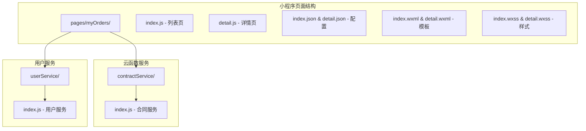

**图表来源**
- [miniprogram/pages/myOrders/index.js:1-121](file://miniprogram/pages/myOrders/index.js#L1-L121)
- [cloudfunctions/contractService/index.js:1-112](file://cloudfunctions/contractService/index.js#L1-L112)

**章节来源**
- [miniprogram/pages/myOrders/index.js:1-121](file://miniprogram/pages/myOrders/index.js#L1-L121)
- [miniprogram/pages/myOrders/detail.js:1-184](file://miniprogram/pages/myOrders/detail.js#L1-L184)
- [miniprogram/pages/myOrders/index.json:1-10](file://miniprogram/pages/myOrders/index.json#L1-L10)
- [miniprogram/pages/myOrders/detail.json:1-8](file://miniprogram/pages/myOrders/detail.json#L1-L8)

## 核心组件

### 页面组件架构

"我的订单页面"由两个主要页面组成：合同列表页和合同详情页，它们协同工作提供完整的合同管理体验。

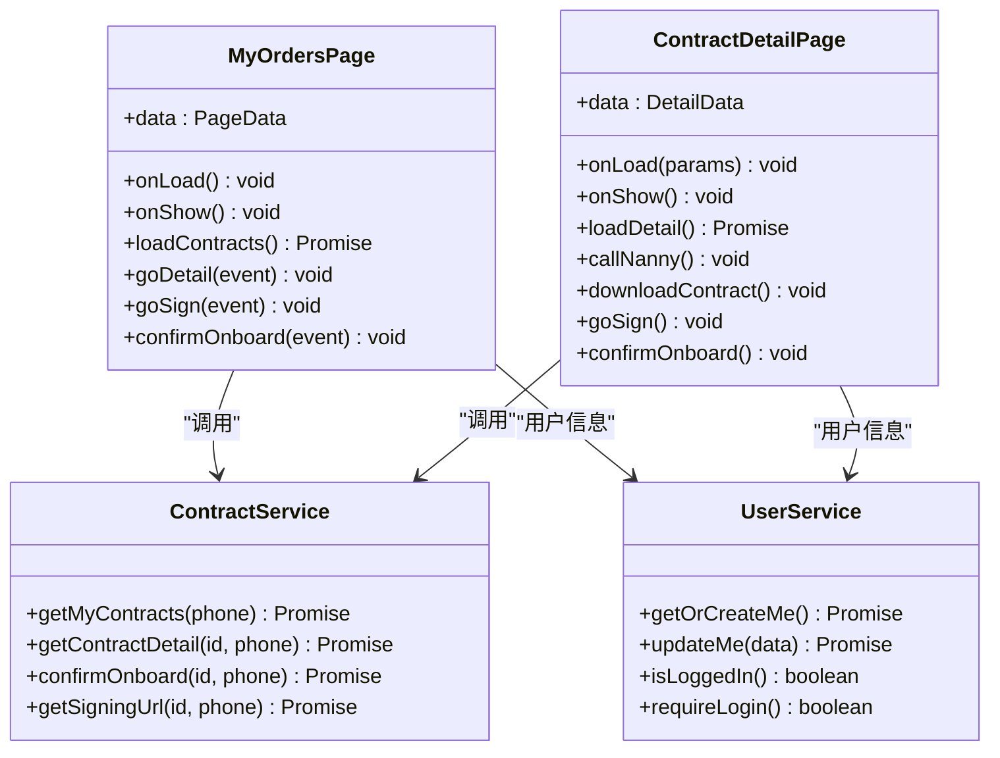

**图表来源**
- [miniprogram/pages/myOrders/index.js:16-121](file://miniprogram/pages/myOrders/index.js#L16-L121)
- [miniprogram/pages/myOrders/detail.js:24-184](file://miniprogram/pages/myOrders/detail.js#L24-L184)
- [cloudfunctions/contractService/index.js:81-110](file://cloudfunctions/contractService/index.js#L81-L110)

### 数据流处理

页面采用异步数据加载机制，通过云函数与CRM系统进行数据交互：

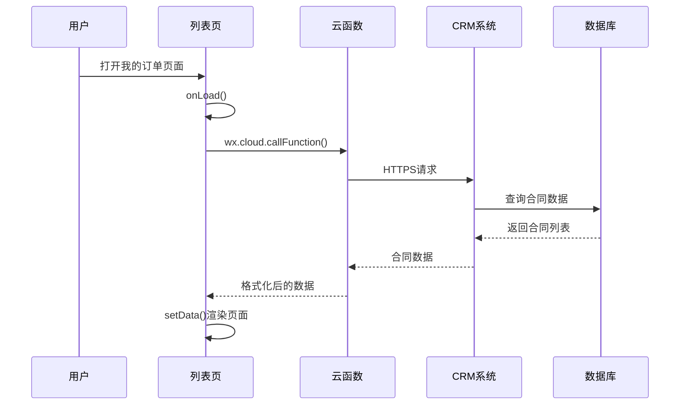

**图表来源**
- [miniprogram/pages/myOrders/index.js:37-82](file://miniprogram/pages/myOrders/index.js#L37-L82)
- [cloudfunctions/contractService/index.js:54-58](file://cloudfunctions/contractService/index.js#L54-L58)

**章节来源**
- [miniprogram/pages/myOrders/index.js:1-121](file://miniprogram/pages/myOrders/index.js#L1-L121)
- [miniprogram/pages/myOrders/detail.js:1-184](file://miniprogram/pages/myOrders/detail.js#L1-L184)

## 架构概览

### 整体架构设计

"我的订单页面"采用三层架构设计，确保了良好的可维护性和扩展性：

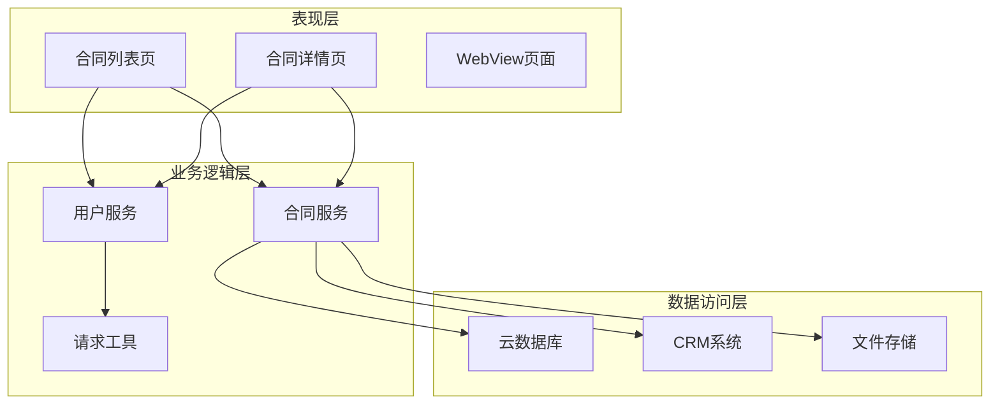

**图表来源**
- [miniprogram/pages/myOrders/index.js:42-44](file://miniprogram/pages/myOrders/index.js#L42-L44)
- [miniprogram/pages/myOrders/detail.js:45-47](file://miniprogram/pages/myOrders/detail.js#L45-L47)
- [cloudfunctions/contractService/index.js:17-52](file://cloudfunctions/contractService/index.js#L17-L52)

### 状态管理机制

页面实现了完整的状态管理，包括加载状态、错误状态和业务状态：

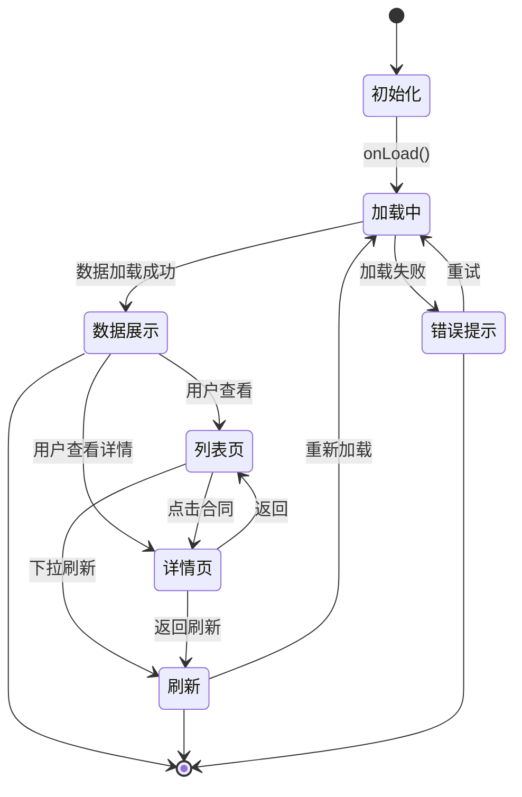

**图表来源**
- [miniprogram/pages/myOrders/index.js:17-21](file://miniprogram/pages/myOrders/index.js#L17-L21)
- [miniprogram/pages/myOrders/detail.js:25-26](file://miniprogram/pages/myOrders/detail.js#L25-L26)

## 详细组件分析

### 合同列表页 (index.js)

合同列表页是用户查看所有服务合同的主要界面，提供了简洁明了的合同概览和快速操作入口。

#### 核心功能实现

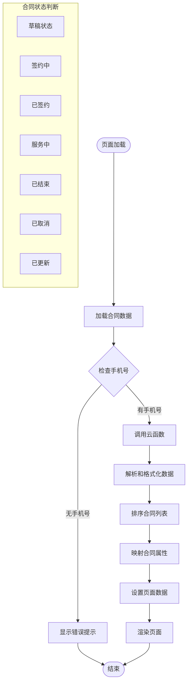

**图表来源**
- [miniprogram/pages/myOrders/index.js:37-82](file://miniprogram/pages/myOrders/index.js#L37-L82)

#### 数据处理逻辑

页面对从CRM系统获取的原始合同数据进行了多层处理：

1. **合同排序**：当前合同优先显示，历史记录按创建时间倒序排列
2. **状态映射**：将系统状态码转换为用户友好的中文状态文本
3. **操作按钮控制**：根据合同状态动态显示相应的操作按钮
4. **历史记录标识**：通过`isLatest`字段区分当前合同和历史合同

**章节来源**
- [miniprogram/pages/myOrders/index.js:37-82](file://miniprogram/pages/myOrders/index.js#L37-L82)

### 合同详情页 (detail.js)

合同详情页提供了合同的完整信息展示和深度操作功能，是用户管理合同的关键界面。

#### 电子签约流程

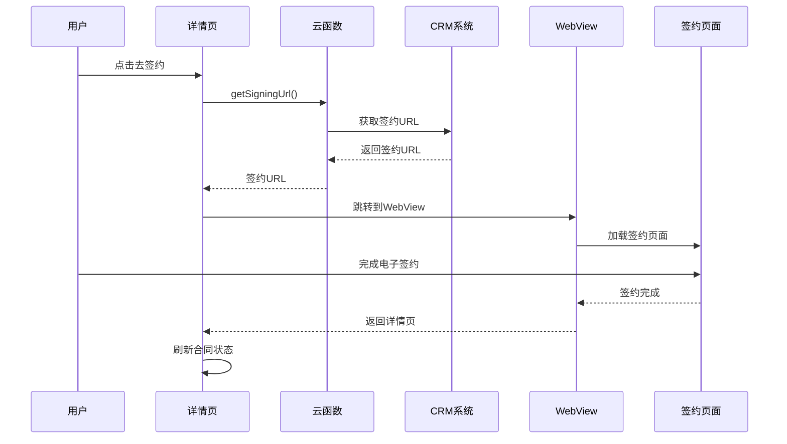

**图表来源**
- [miniprogram/pages/myOrders/detail.js:125-153](file://miniprogram/pages/myOrders/detail.js#L125-L153)
- [cloudfunctions/contractService/index.js:74-79](file://cloudfunctions/contractService/index.js#L74-L79)

#### 上户确认机制

页面实现了严格的上户确认流程，确保服务开始的准确性：

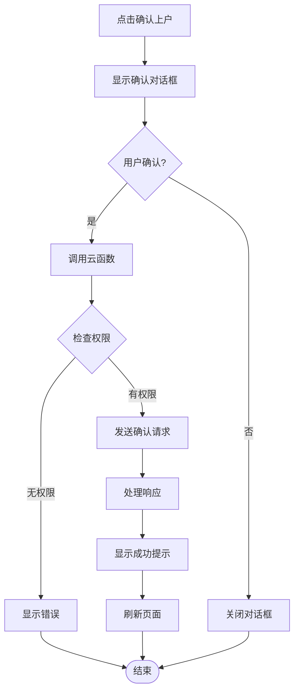

**图表来源**
- [miniprogram/pages/myOrders/detail.js:156-181](file://miniprogram/pages/myOrders/detail.js#L156-L181)

**章节来源**
- [miniprogram/pages/myOrders/detail.js:1-184](file://miniprogram/pages/myOrders/detail.js#L1-L184)

### 云函数服务 (contractService)

云函数作为前后端的桥梁，负责与CRM系统的安全通信和数据处理。

#### 安全通信机制

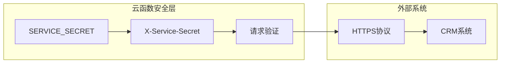

**图表来源**
- [cloudfunctions/contractService/index.js:6-28](file://cloudfunctions/contractService/index.js#L6-L28)

#### API接口设计

云函数提供了标准化的接口调用模式：

| 接口名称 | 功能描述 | 参数 | 返回值 |
|---------|---------|------|--------|
| getMyContracts | 获取用户合同列表 | phone | 合同数组 |
| getContractDetail | 获取合同详情 | id, phone | 合同详情 |
| confirmOnboard | 确认上户 | id, phone | 操作结果 |
| getSigningUrl | 获取签约URL | id, phone | 签约URL |

**章节来源**
- [cloudfunctions/contractService/index.js:81-110](file://cloudfunctions/contractService/index.js#L81-L110)

### 用户服务集成

页面集成了用户服务，确保只有登录用户才能访问合同信息：

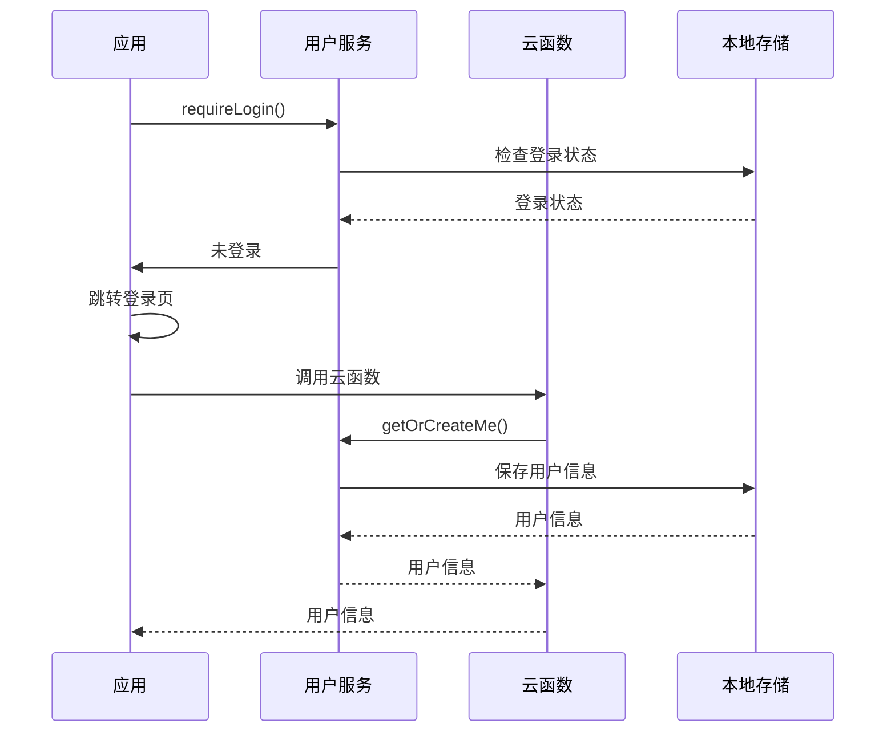

**图表来源**
- [miniprogram/services/userService.js:32-37](file://miniprogram/services/userService.js#L32-L37)
- [miniprogram/app.js:72-142](file://miniprogram/app.js#L72-L142)

**章节来源**
- [miniprogram/services/userService.js:1-45](file://miniprogram/services/userService.js#L1-L45)
- [miniprogram/app.js:72-142](file://miniprogram/app.js#L72-L142)

## 依赖关系分析

### 技术栈依赖

"我的订单页面"采用了现代小程序开发的最佳实践，建立了清晰的依赖关系：

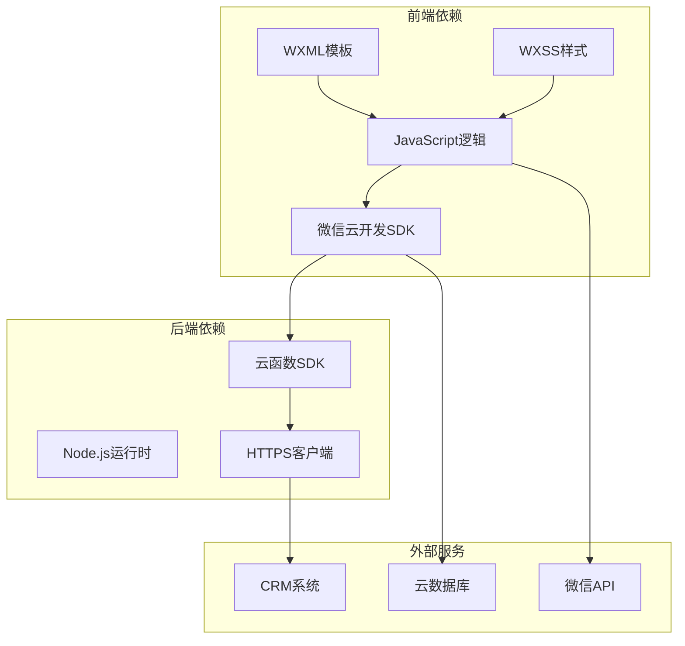

**图表来源**
- [miniprogram/pages/myOrders/index.js:42-44](file://miniprogram/pages/myOrders/index.js#L42-L44)
- [cloudfunctions/contractService/index.js:1-2](file://cloudfunctions/contractService/index.js#L1-L2)

### 数据依赖关系

页面的数据流体现了清晰的层次结构：

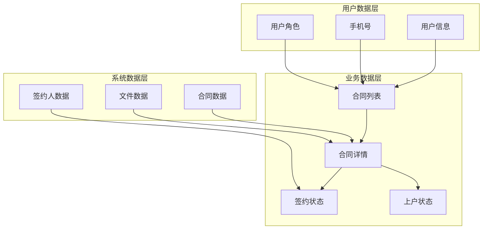

**图表来源**
- [miniprogram/pages/myOrders/index.js:39-40](file://miniprogram/pages/myOrders/index.js#L39-L40)
- [miniprogram/pages/myOrders/detail.js:30-31](file://miniprogram/pages/myOrders/detail.js#L30-L31)

**章节来源**
- [miniprogram/pages/myOrders/index.js:1-121](file://miniprogram/pages/myOrders/index.js#L1-L121)
- [miniprogram/pages/myOrders/detail.js:1-184](file://miniprogram/pages/myOrders/detail.js#L1-L184)

## 性能考虑

### 加载性能优化

页面实现了多项性能优化措施：

1. **懒加载策略**：仅在页面显示时加载数据，避免不必要的网络请求
2. **数据缓存**：利用小程序的页面生命周期，在页面隐藏时保留数据
3. **下拉刷新**：提供即时的刷新机制，避免重复加载
4. **错误处理**：完善的错误处理机制，防止页面崩溃

### 网络请求优化

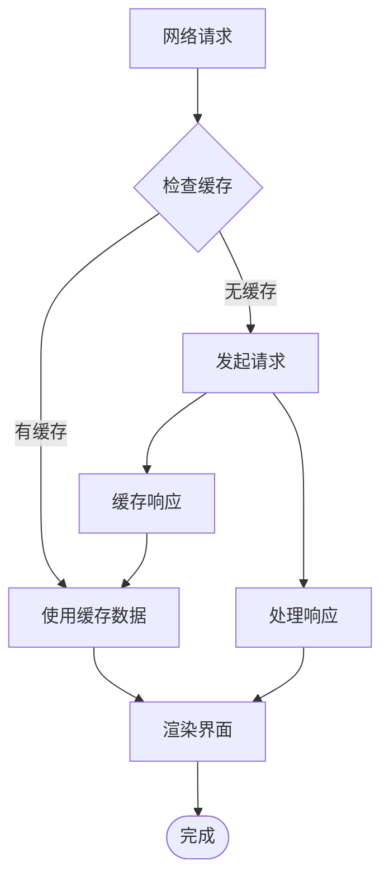

**图表来源**
- [miniprogram/pages/myOrders/index.js:28-30](file://miniprogram/pages/myOrders/index.js#L28-L30)

### 内存管理

页面遵循了小程序的内存管理最佳实践：

- 合理使用`setData`更新页面数据
- 及时清理定时器和事件监听器
- 避免创建不必要的全局变量
- 使用局部变量减少内存占用

## 故障排除指南

### 常见问题及解决方案

#### 合同数据加载失败

**问题症状**：页面显示"加载失败"或空白状态

**可能原因**：
1. 网络连接异常
2. 用户未绑定手机号
3. 云函数调用失败
4. CRM系统响应超时

**解决步骤**：
1. 检查网络连接状态
2. 确认用户已授权手机号
3. 查看云函数日志
4. 重试加载操作

#### 电子签约无法进行

**问题症状**：点击"去签约"按钮无响应

**可能原因**：
1. 合同状态不符合签约条件
2. 签约URL获取失败
3. WebView加载异常

**解决步骤**：
1. 检查合同状态是否为草稿或签约中
2. 验证手机号绑定状态
3. 重新获取签约URL
4. 检查网络连接

#### 上户确认失败

**问题症状**：确认上户操作后状态未更新

**可能原因**：
1. 权限不足
2. 网络请求超时
3. CRM系统异常

**解决步骤**：
1. 确认合同状态为服务中且未确认上户
2. 检查网络连接稳定性
3. 稍后重试操作
4. 联系客服支持

### 调试技巧

1. **开发者工具**：使用微信开发者工具的网络面板监控请求
2. **控制台日志**：查看详细的错误信息和堆栈跟踪
3. **云函数日志**：检查云函数执行状态和错误信息
4. **本地存储**：验证用户信息和缓存数据的完整性

**章节来源**
- [miniprogram/pages/myOrders/index.js:77-81](file://miniprogram/pages/myOrders/index.js#L77-L81)
- [miniprogram/pages/myOrders/detail.js:90-99](file://miniprogram/pages/myOrders/detail.js#L90-L99)

## 结论

"我的订单页面"是一个设计精良、功能完整的合同管理模块，体现了现代小程序开发的最佳实践。该模块具有以下特点：

### 技术优势

1. **架构清晰**：采用分层架构，职责分离明确
2. **安全性强**：通过云函数和HTTPS协议确保数据安全
3. **用户体验佳**：界面简洁直观，操作流畅自然
4. **扩展性强**：模块化设计便于功能扩展和维护

### 功能完整性

页面涵盖了合同管理的完整生命周期，从合同创建到服务完成，为用户提供了全方位的服务体验。通过电子签约、上户确认等核心功能，实现了传统纸质合同的数字化转型。

### 改进建议

1. **性能优化**：可以考虑增加数据预加载机制
2. **错误处理**：增强错误恢复机制，提升用户体验
3. **通知提醒**：增加关键节点的通知功能
4. **数据分析**：集成用户行为分析，优化功能设计

该模块为安得褓贝小程序提供了坚实的业务基础，为后续功能扩展奠定了良好的技术基础。