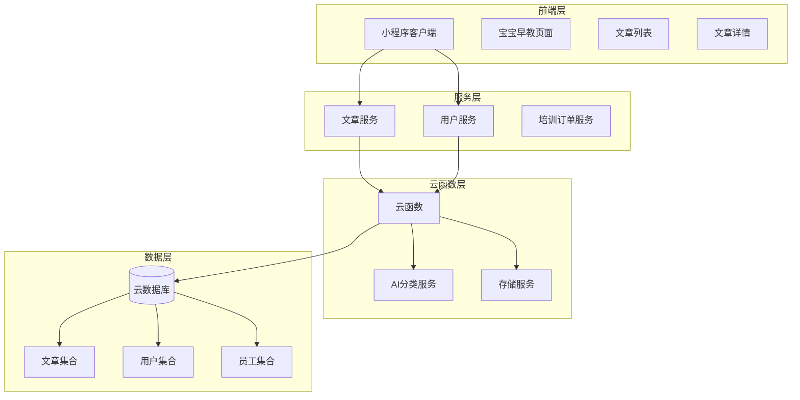
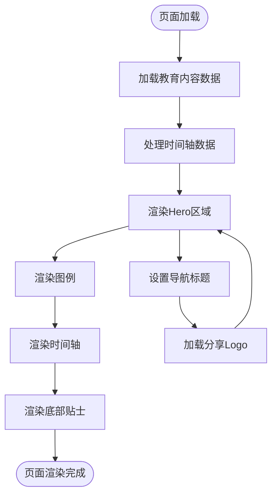
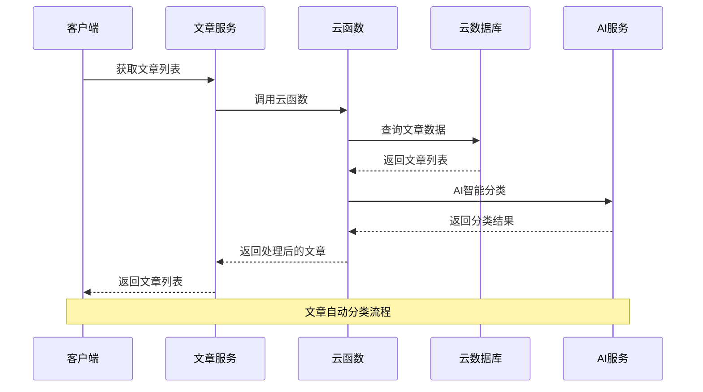
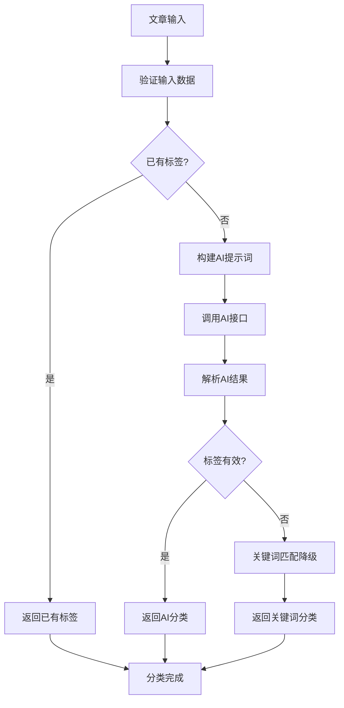
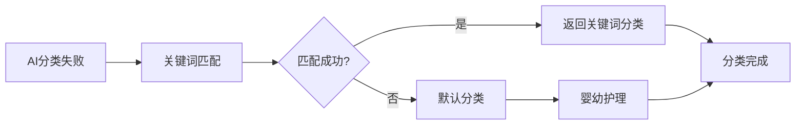
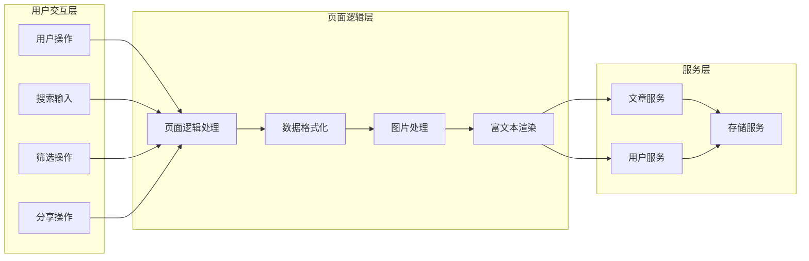
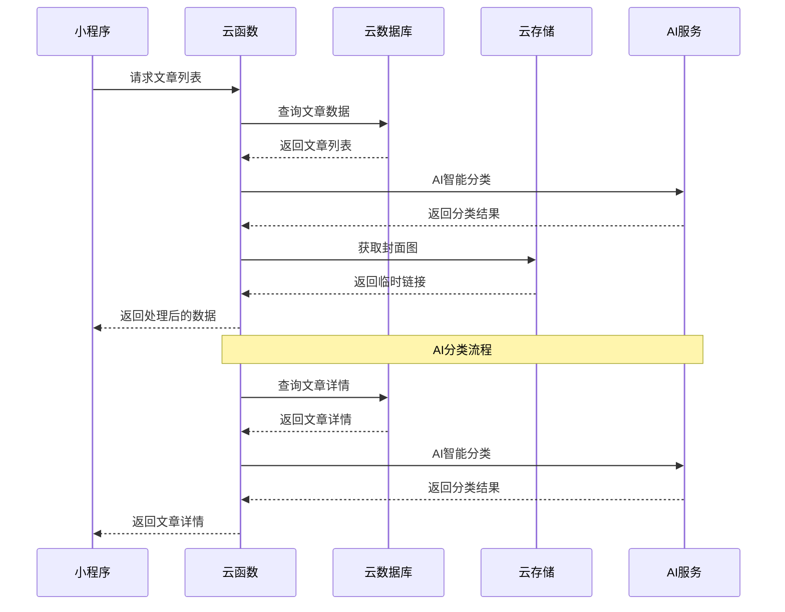

# 教育内容扩展

<cite>
**本文档引用的文件**
- [PRD.md](file://PRD.md)
- [README.md](file://README.md)
- [miniprogram/pages/babyEducation/index.js](file://miniprogram/pages/babyEducation/index.js)
- [miniprogram/pages/babyEducation/index.wxml](file://miniprogram/pages/babyEducation/index.wxml)
- [miniprogram/pages/babyEducation/index.wxss](file://miniprogram/pages/babyEducation/index.wxss)
- [miniprogram/pages/articleList/index.js](file://miniprogram/pages/articleList/index.js)
- [miniprogram/pages/articleDetail/index.js](file://miniprogram/pages/articleDetail/index.js)
- [miniprogram/services/article.js](file://miniprogram/services/article.js)
- [cloudfunctions/articleService/index.js](file://cloudfunctions/articleService/index.js)
- [cloudfunctions/userService/index.js](file://cloudfunctions/userService/index.js)
- [miniprogram/app.json](file://miniprogram/app.json)
- [docs/育儿宝典模块使用说明.md](file://docs/育儿宝典模块使用说明.md)
- [docs/AI分类功能使用说明.md](file://docs/AI分类功能使用说明.md)
- [docs/标签匹配算法优化方案.md](file://docs/标签匹配算法优化方案.md)
- [test-ai-classify-cli.js](file://test-ai-classify-cli.js)
</cite>

## 目录
1. [项目概述](#项目概述)
2. [教育内容架构](#教育内容架构)
3. [宝宝早教页面分析](#宝宝早教页面分析)
4. [文章管理系统](#文章管理系统)
5. [AI智能分类系统](#AI智能分类系统)
6. [数据流分析](#数据流分析)
7. [性能优化策略](#性能优化策略)
8. [故障排除指南](#故障排除指南)
9. [总结](#总结)

## 项目概述

安得褓贝是一个基于微信小程序的企业级育儿服务平台，专注于为用户提供专业的育儿知识和教育资源。该项目采用云开发技术栈，实现了完整的前后端分离架构。

### 核心功能特性

- **宝宝早教指导**：提供0-6岁儿童分龄教育指导
- **智能文章分类**：基于AI的育儿内容自动分类系统
- **个性化学习路径**：根据儿童成长阶段提供针对性教育建议
- **多媒体教育资源**：图文并茂的教育内容展示

### 技术架构概览



**图表来源**
- [miniprogram/pages/babyEducation/index.js:1-94](file://miniprogram/pages/babyEducation/index.js#L1-L94)
- [cloudfunctions/articleService/index.js:1-456](file://cloudfunctions/articleService/index.js#L1-L456)
- [cloudfunctions/userService/index.js:1-537](file://cloudfunctions/userService/index.js#L1-L537)

**章节来源**
- [PRD.md:1-353](file://PRD.md#L1-L353)
- [README.md:1-13](file://README.md#L1-L13)

## 教育内容架构

### 教育内容分类体系

项目建立了完善的育儿内容分类体系，将教育内容按照科学的标准进行组织和管理：

```mermaid
mindmap
root((育儿教育内容))
0-3岁
感官发展
大动作发展
精细动作发展
语言发展
认知发展
社交发展
3-6岁
专注力培养
语言爆发期
规则意识
同伴社交
学前准备
教育理念
蒙台梭利教育
科学育儿方法
亲子关系培养
行为习惯养成
```

### 内容组织结构

每个年龄段的教育内容都包含以下要素：

1. **发展阶段特征**：详细描述该阶段儿童的发展特点
2. **敏感期识别**：帮助家长识别关键发展时期
3. **教育活动建议**：提供具体的教育活动和游戏
4. **注意事项**：列出教育过程中的注意事项

**章节来源**
- [miniprogram/pages/babyEducation/index.js:6-71](file://miniprogram/pages/babyEducation/index.js#L6-L71)
- [miniprogram/pages/babyEducation/index.wxml:42-67](file://miniprogram/pages/babyEducation/index.wxml#L42-L67)

## 宝宝早教页面分析

### 页面设计特色

宝宝早教页面采用了独特的蒙台梭利教育理念设计，通过时间轴的形式展示儿童不同发展阶段的教育重点：



**图表来源**
- [miniprogram/pages/babyEducation/index.js:74-93](file://miniprogram/pages/babyEducation/index.js#L74-L93)

### 核心组件功能

#### Hero区域设计
- **渐变背景**：使用温暖的橙色调营造温馨的育儿氛围
- **统计信息**：展示8个发展阶段、7个能力领域、36个月全周期
- **教育理念**：突出蒙台梭利教育的核心价值

#### 时间轴展示
- **阶段标识**：每个发展阶段都有对应的年龄标识
- **敏感期提示**：标注该阶段的敏感期特征
- **教育要点**：详细列出该阶段的教育重点和活动建议

#### 底部贴士
- **观察优先**：强调观察孩子行为的重要性
- **环境预备**：提供适合孩子探索的环境布置建议
- **允许犯错**：鼓励孩子在探索中学习
- **专注时间**：建议每天高质量陪伴的时间安排

**章节来源**
- [miniprogram/pages/babyEducation/index.wxml:1-90](file://miniprogram/pages/babyEducation/index.wxml#L1-L90)
- [miniprogram/pages/babyEducation/index.wxss:1-311](file://miniprogram/pages/babyEducation/index.wxss#L1-L311)

## 文章管理系统

### 文章服务架构

文章管理系统提供了完整的文章生命周期管理功能，包括文章的获取、分类、展示和交互：



**图表来源**
- [miniprogram/services/article.js:64-138](file://miniprogram/services/article.js#L64-L138)
- [cloudfunctions/articleService/index.js:412-454](file://cloudfunctions/articleService/index.js#L412-L454)

### 文章列表功能

文章列表页面实现了完整的文章展示功能：

#### 核心功能
- **分页加载**：支持无限滚动的分页加载
- **搜索功能**：支持按标题、作者、关键词搜索
- **标签筛选**：按育儿内容分类进行筛选
- **阅读量统计**：实时显示文章阅读量

#### 数据处理流程
1. **数据获取**：从CRM后台获取文章数据
2. **AI分类**：对没有标签的文章进行智能分类
3. **数据格式化**：统一处理文章数据格式
4. **封面图处理**：处理云存储文件ID转换

**章节来源**
- [miniprogram/pages/articleList/index.js:284-397](file://miniprogram/pages/articleList/index.js#L284-L397)

### 文章详情功能

文章详情页面提供了丰富的文章展示和交互功能：

#### 核心特性
- **小红书风格**：支持多图展示和轮播
- **富文本渲染**：支持HTML内容的富文本展示
- **分享功能**：支持微信好友和朋友圈分享
- **顾问联系**：支持通过文章分享联系育儿顾问

#### 技术实现
- **图片处理**：支持多种图片格式和尺寸
- **内容解析**：智能解析HTML内容结构
- **分享逻辑**：支持带分享者信息的深度分享

**章节来源**
- [miniprogram/pages/articleDetail/index.js:246-598](file://miniprogram/pages/articleDetail/index.js#L246-L598)

## AI智能分类系统

### 分类算法设计

AI智能分类系统采用了多层次的分类策略，确保分类结果的准确性和可靠性：



**图表来源**
- [cloudfunctions/articleService/index.js:162-258](file://cloudfunctions/articleService/index.js#L162-L258)

### 分类标签体系

系统建立了详细的育儿内容分类标签体系：

| 分类标签 | 适用内容 | 关键词示例 |
|---------|---------|-----------|
| **备孕好孕** | 备孕准备、孕前检查、叶酸补充、排卵受孕 | 备孕、孕前、叶酸、排卵、受孕 |
| **孕期呵护** | 孕期保健、产检、胎动、孕期饮食、孕期不适 | 孕期、孕妇、产检、胎动、孕期饮食 |
| **产后恢复** | 月子护理、产后修复、哺乳催乳、产后抑郁 | 产后、月子、哺乳、催乳、产后抑郁 |
| **新生儿养护** | 0-3个月宝宝护理、新生儿喂养、黄疸、脐带护理 | 新生儿、满月、黄疸、脐带、新生儿喂养 |
| **婴幼护理** | 4个月以上宝宝护理、辅食添加、生长发育、常见疾病 | 辅食、断奶、湿疹、发育、常见疾病 |
| **亲子早教** | 早教启蒙、亲子互动、绘本阅读、习惯培养 | 早教、启蒙、绘本、亲子、习惯培养 |

### AI分类实现

#### 提示词设计
AI分类系统使用精心设计的提示词来指导AI进行准确的内容分类：

```javascript
const prompt = `你是一个母婴育儿内容分类专家。请根据文章内容，从以下6个分类中选择最合适的1个标签：

【分类说明——请仔细区分】
1. 备孕好孕 - 备孕准备、孕前检查、叶酸补充、排卵受孕、高龄备孕
2. 孕期呵护 - 孕期保健、产检、胎动、孕期饮食、孕吐、孕期不适、分娩准备
3. 产后恢复 - 月子护理、产后修复、哺乳催乳、产后抑郁、恶露、盆底肌、侧切
4. 新生儿养护 - 0-3个月宝宝的日常护理、喂养、黄疸、脐带护理、拍嗝、睡眠
5. 婴幼护理 - 4个月以上宝宝的喂养照护、辅食添加、断奶、常见疾病（腹泻/感冒/湿疹/积食）、体重身高监测。核心是"照护身体、处理疾病"
6. 亲子早教 - 科学育儿方法、亲子关系、行为习惯培养、专注力/语言/运动发育、早教启蒙、绘本、孩子性格与心理。核心是"教育引导、能力培养"

【重要区分规则】
- 文章讲"怎么喂、怎么护理、生病了怎么办" → 婴幼护理
- 文章讲"怎么教、怎么培养、科学育儿理念、孩子行为/性格/能力" → 亲子早教
- "科学育儿""养孩子方法论""自律""反宠""大脑发育""习惯" → 亲子早教
- 新生儿（0-3个月）相关 → 新生儿养护，不要归入婴幼护理
`;
```

#### 降级机制
当AI分类失败时，系统会自动启用关键词匹配降级机制：



**图表来源**
- [cloudfunctions/articleService/index.js:266-325](file://cloudfunctions/articleService/index.js#L266-L325)

**章节来源**
- [cloudfunctions/articleService/index.js:158-325](file://cloudfunctions/articleService/index.js#L158-L325)
- [docs/AI分类功能使用说明.md:138-199](file://docs/AI分类功能使用说明.md#L138-L199)

## 数据流分析

### 前端数据流



**图表来源**
- [miniprogram/pages/articleList/index.js:284-428](file://miniprogram/pages/articleList/index.js#L284-L428)
- [miniprogram/pages/articleDetail/index.js:335-598](file://miniprogram/pages/articleDetail/index.js#L335-L598)

### 云函数数据流



**图表来源**
- [cloudfunctions/articleService/index.js:412-454](file://cloudfunctions/articleService/index.js#L412-L454)

**章节来源**
- [miniprogram/services/article.js:1-281](file://miniprogram/services/article.js#L1-L281)
- [cloudfunctions/articleService/index.js:1-456](file://cloudfunctions/articleService/index.js#L1-L456)

## 性能优化策略

### 前端性能优化

#### 图片优化
- **懒加载**：实现图片的懒加载，提升页面加载速度
- **格式转换**：自动将HTTP图片转换为HTTPS，避免混合内容问题
- **尺寸适配**：根据屏幕尺寸动态计算图片显示尺寸

#### 数据缓存
- **本地缓存**：利用小程序的本地存储机制缓存常用数据
- **CDN加速**：通过云存储的CDN功能加速静态资源加载
- **分页加载**：实现无限滚动的分页加载，减少一次性数据传输

#### 渲染优化
- **虚拟列表**：对于大量数据的列表，采用虚拟列表技术
- **按需渲染**：只渲染可视区域内的内容
- **防抖处理**：对频繁的用户操作进行防抖处理

### 云函数性能优化

#### 并发处理
- **Promise.all**：使用Promise.all并行处理多个异步操作
- **批量操作**：支持批量获取和处理数据
- **连接池**：合理管理数据库连接，避免连接泄漏

#### 内存管理
- **及时释放**：及时释放不需要的变量和对象
- **分块处理**：对大数据进行分块处理，避免内存溢出
- **超时控制**：设置合理的超时时间，防止长时间占用资源

**章节来源**
- [miniprogram/pages/articleList/index.js:312-396](file://miniprogram/pages/articleList/index.js#L312-L396)
- [cloudfunctions/articleService/index.js:134-154](file://cloudfunctions/articleService/index.js#L134-L154)

## 故障排除指南

### 常见问题及解决方案

#### AI分类失败
**问题现象**：文章无法正确分类，返回"未分类"标签

**可能原因**：
1. 云函数未正确部署
2. 微信云开发AI能力未开通
3. 网络连接异常
4. 文章内容格式不符合要求

**解决方案**：
1. 检查云函数部署状态
2. 确认AI能力已开通
3. 验证网络连接
4. 确保文章包含足够的标题和内容信息

#### 文章加载失败
**问题现象**：文章列表无法加载或显示空白

**可能原因**：
1. CRM后台接口异常
2. 网络请求超时
3. 数据格式不匹配
4. 权限不足

**解决方案**：
1. 检查CRM后台服务状态
2. 增加重试机制
3. 验证数据格式兼容性
4. 确认用户权限

#### 图片显示异常
**问题现象**：文章图片无法正常显示

**可能原因**：
1. 云存储文件ID无效
2. 临时链接获取失败
3. 图片格式不支持
4. 网络问题

**解决方案**：
1. 验证文件ID的有效性
2. 检查云存储权限
3. 支持多种图片格式
4. 实现图片加载失败的降级处理

### 调试工具和方法

#### 本地测试
项目提供了专门的测试脚本用于AI分类功能的本地测试：

```javascript
// 测试用例示例
const testCases = [
  {
    title: '生理性黄疸的处理方法',
    summary: '新生儿生理性黄疸是正常现象...',
    content: '生理性黄疸一般在出生后2-3天出现...',
    expectedTags: ['新生儿养护']
  },
  {
    title: '6个月宝宝辅食添加指南',
    summary: '宝宝6个月后可以开始添加辅食...',
    content: '第一口辅食建议选择强化铁的米粉...',
    expectedTags: ['婴幼护理']
  }
];
```

#### 日志监控
- **详细日志**：记录关键操作的详细日志信息
- **错误追踪**：捕获和记录所有异常信息
- **性能监控**：监控关键操作的执行时间和资源消耗

**章节来源**
- [test-ai-classify-cli.js:33-74](file://test-ai-classify-cli.js#L33-L74)
- [docs/AI分类功能使用说明.md:192-229](file://docs/AI分类功能使用说明.md#L192-L229)

## 总结

安得褓贝项目的教育内容扩展功能展现了现代育儿服务平台的技术实力和专业水准。通过AI智能分类、多媒体内容展示和科学的教育理念，为用户提供了优质的育儿教育资源。

### 核心优势

1. **智能化内容管理**：AI驱动的内容分类系统确保内容的准确组织
2. **科学的教育理念**：基于蒙台梭利教育理论的科学指导
3. **完整的功能体系**：从前端展示到后端管理的完整解决方案
4. **优秀的用户体验**：直观的界面设计和流畅的操作体验

### 技术亮点

- **云开发架构**：充分利用微信云开发的强大功能
- **AI集成应用**：将AI技术深度融入产品功能
- **性能优化策略**：多维度的性能优化确保流畅体验
- **完善的监控体系**：全面的日志记录和错误处理机制

### 未来发展

随着技术的不断进步和用户需求的持续增长，项目将在以下几个方面继续发展：

1. **AI能力增强**：进一步提升AI分类的准确性和智能化水平
2. **内容生态扩展**：丰富教育内容的类型和形式
3. **个性化推荐**：基于用户行为的数据驱动推荐系统
4. **社区功能完善**：构建用户互动和经验分享的社区平台

通过持续的技术创新和产品优化，安得褓贝将继续为广大家长提供专业、科学、实用的育儿指导和服务。