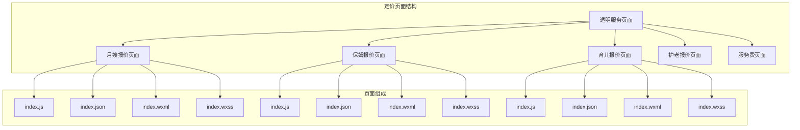
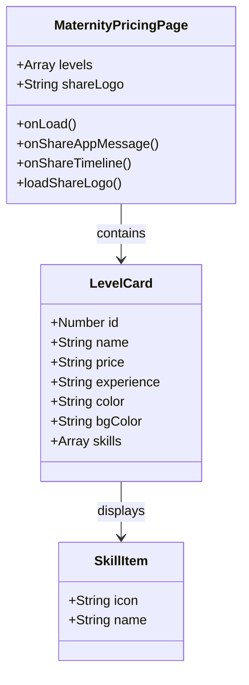
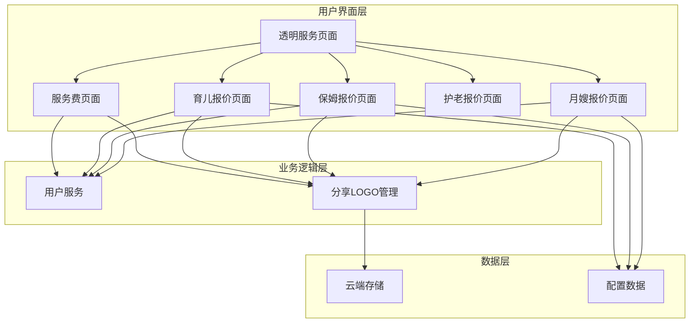
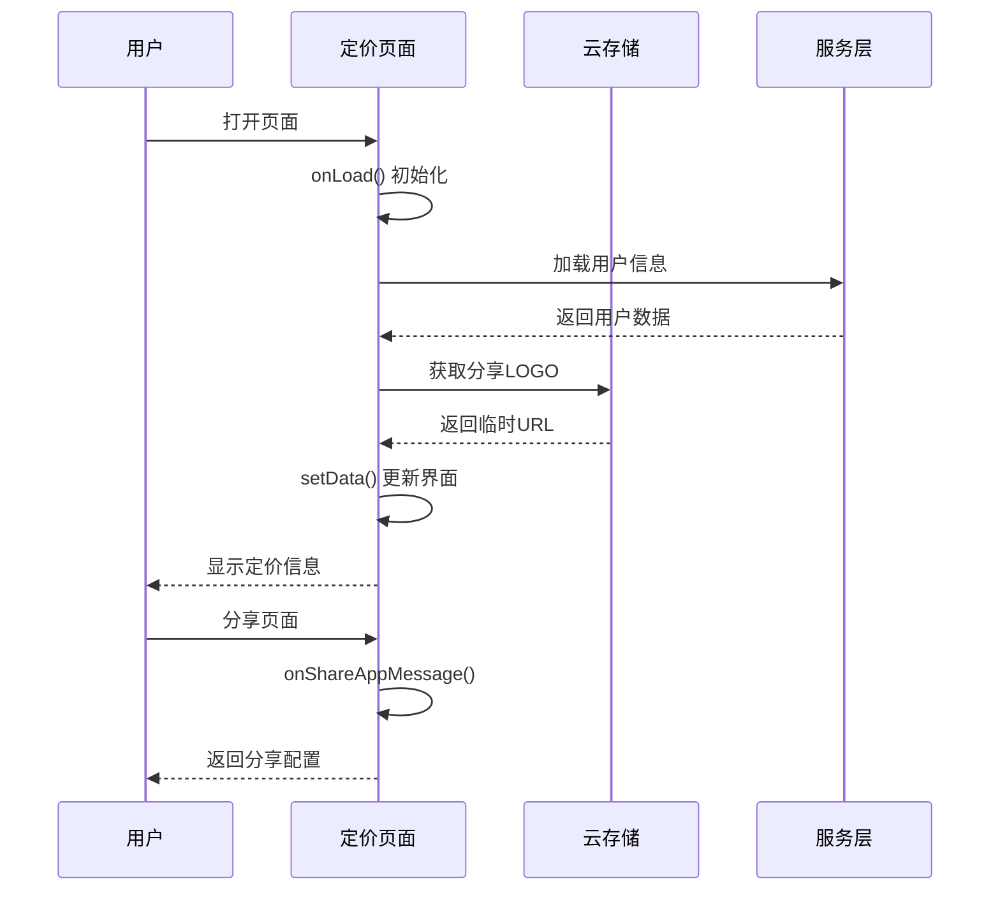
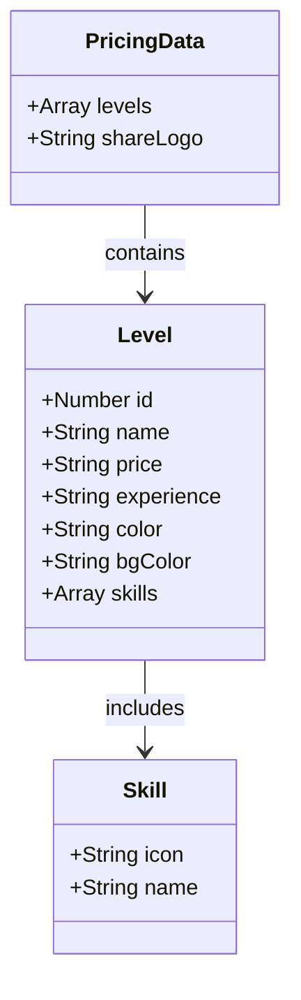
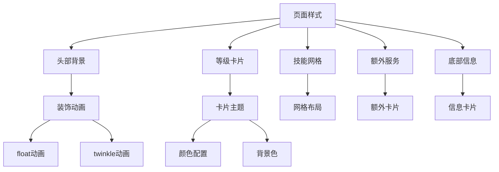
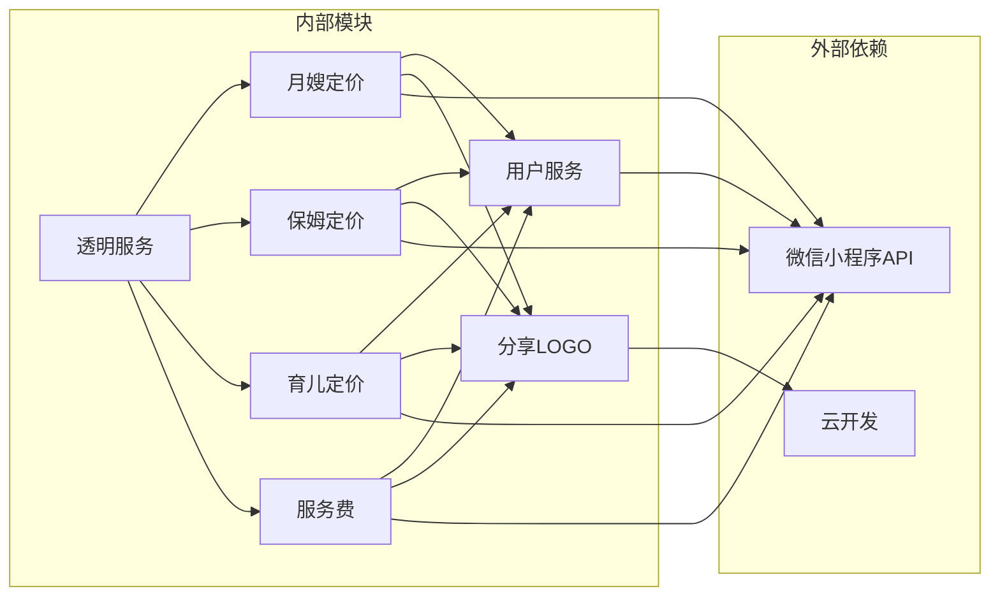

# 服务定价页面

<cite>
**本文档引用的文件**
- [miniprogram/pages/maternityPricing/index.js](file://miniprogram/pages/maternityPricing/index.js)
- [miniprogram/pages/maternityPricing/index.json](file://miniprogram/pages/maternityPricing/index.json)
- [miniprogram/pages/maternityPricing/index.wxml](file://miniprogram/pages/maternityPricing/index.wxml)
- [miniprogram/pages/maternityPricing/index.wxss](file://miniprogram/pages/maternityPricing/index.wxss)
- [miniprogram/pages/nannyPricing/index.js](file://miniprogram/pages/nannyPricing/index.js)
- [miniprogram/pages/nannyPricing/index.json](file://miniprogram/pages/nannyPricing/index.json)
- [miniprogram/pages/nannyPricing/index.wxml](file://miniprogram/pages/nannyPricing/index.wxml)
- [miniprogram/pages/nannyPricing/index.wxss](file://miniprogram/pages/nannyPricing/index.wxss)
- [miniprogram/pages/childcarePricing/index.js](file://miniprogram/pages/childcarePricing/index.js)
- [miniprogram/pages/childcarePricing/index.json](file://miniprogram/pages/childcarePricing/index.json)
- [miniprogram/pages/childcarePricing/index.wxml](file://miniprogram/pages/childcarePricing/index.wxml)
- [miniprogram/pages/childcarePricing/index.wxss](file://miniprogram/pages/childcarePricing/index.wxss)
- [miniprogram/pages/transparentService/index.js](file://miniprogram/pages/transparentService/index.js)
- [miniprogram/pages/transparentService/index.wxml](file://miniprogram/pages/transparentService/index.wxml)
- [miniprogram/pages/transparentService/index.json](file://miniprogram/pages/transparentService/index.json)
- [miniprogram/services/userService.js](file://miniprogram/services/userService.js)
- [miniprogram/utils/shareLogo.js](file://miniprogram/utils/shareLogo.js)
- [miniprogram/app.json](file://miniprogram/app.json)
</cite>

## 目录
1. [简介](#简介)
2. [项目结构](#项目结构)
3. [核心组件](#核心组件)
4. [架构概览](#架构概览)
5. [详细组件分析](#详细组件分析)
6. [依赖关系分析](#依赖关系分析)
7. [性能考虑](#性能考虑)
8. [故障排除指南](#故障排除指南)
9. [结论](#结论)

## 简介

安得褓贝小程序提供了完整的服务定价展示系统，涵盖月嫂、保姆、育儿师、护老员四大核心服务类别的价格体系。该系统采用微信小程序原生框架开发，通过星级评分机制直观展示不同服务等级的价格差异，帮助用户快速了解各项服务的收费标准。

系统设计注重用户体验，采用卡片式布局展示服务等级，配合详细的技能说明和价格标签，让用户能够一目了然地比较不同服务等级的价值差异。同时，系统集成了云端图片资源管理，确保分享功能的稳定性和一致性。

## 项目结构

服务定价页面位于小程序的pages目录下，按照服务类型进行组织：

**图表来源**
- [miniprogram/pages/transparentService/index.js:1-149](file://miniprogram/pages/transparentService/index.js#L1-L149)
- [miniprogram/pages/maternityPricing/index.js:1-147](file://miniprogram/pages/maternityPricing/index.js#L1-L147)
- [miniprogram/pages/nannyPricing/index.js:1-107](file://miniprogram/pages/nannyPricing/index.js#L1-L107)
- [miniprogram/pages/childcarePricing/index.js:1-120](file://miniprogram/pages/childcarePricing/index.js#L1-L120)

**章节来源**
- [miniprogram/pages/transparentService/index.js:1-149](file://miniprogram/pages/transparentService/index.js#L1-L149)
- [miniprogram/app.json:27-32](file://miniprogram/app.json#L27-L32)

## 核心组件

### 月嫂报价页面 (Maternity Pricing)

月嫂报价页面展示了从初级到皇冠六个等级的月嫂服务价格体系。每个等级都包含详细的技能描述、工作经验要求和对应的价格标签。

**图表来源**
- [miniprogram/pages/maternityPricing/index.js:5-112](file://miniprogram/pages/maternityPricing/index.js#L5-L112)

### 保姆报价页面 (Nanny Pricing)

保姆报价页面采用简洁的设计风格，突出显示三个等级的家政服务价格。页面特别强调了额外服务能力的展示，帮助用户了解特殊需求的附加费用。

**章节来源**
- [miniprogram/pages/nannyPricing/index.js:1-107](file://miniprogram/pages/nannyPricing/index.js#L1-L107)
- [miniprogram/pages/nannyPricing/index.wxml:1-96](file://miniprogram/pages/nannyPricing/index.wxml#L1-L96)

### 育儿报价页面 (Childcare Pricing)

育儿报价页面专注于0-6岁婴幼儿的看护服务，展示了从金牌到首席四个等级的专业育儿师服务。页面特别标注了特殊儿童照护的额外费用说明。

**章节来源**
- [miniprogram/pages/childcarePricing/index.js:1-120](file://miniprogram/pages/childcarePricing/index.js#L1-L120)
- [miniprogram/pages/childcarePricing/index.wxml:1-98](file://miniprogram/pages/childcarePricing/index.wxml#L1-L98)

### 透明服务导航

透明服务页面作为入口页面，统一管理所有服务定价页面的导航，提供清晰的服务分类和跳转功能。

**章节来源**
- [miniprogram/pages/transparentService/index.js:1-149](file://miniprogram/pages/transparentService/index.js#L1-L149)
- [miniprogram/pages/transparentService/index.wxml:1-125](file://miniprogram/pages/transparentService/index.wxml#L1-L125)

## 架构概览

服务定价系统的整体架构采用模块化设计，每个定价页面都是独立的模块，通过统一的导航页面进行访问。

**图表来源**
- [miniprogram/pages/transparentService/index.js:15-48](file://miniprogram/pages/transparentService/index.js#L15-L48)
- [miniprogram/services/userService.js:1-45](file://miniprogram/services/userService.js#L1-L45)
- [miniprogram/utils/shareLogo.js:1-32](file://miniprogram/utils/shareLogo.js#L1-L32)

## 详细组件分析

### 页面渲染流程

服务定价页面采用微信小程序的标准生命周期，通过数据绑定实现动态内容渲染。

**图表来源**
- [miniprogram/pages/maternityPricing/index.js:114-145](file://miniprogram/pages/maternityPricing/index.js#L114-L145)
- [miniprogram/utils/shareLogo.js:7-25](file://miniprogram/utils/shareLogo.js#L7-L25)

### 数据结构设计

每个定价页面都定义了标准化的数据结构来表示服务等级信息：

**图表来源**
- [miniprogram/pages/maternityPricing/index.js:5-112](file://miniprogram/pages/maternityPricing/index.js#L5-L112)
- [miniprogram/pages/nannyPricing/index.js:5-71](file://miniprogram/pages/nannyPricing/index.js#L5-L71)

### 样式系统架构

定价页面采用了统一的样式系统，确保不同页面间的一致性体验：

**图表来源**
- [miniprogram/pages/maternityPricing/index.wxss:12-77](file://miniprogram/pages/maternityPricing/index.wxss#L12-L77)
- [miniprogram/pages/nannyPricing/index.wxss:12-88](file://miniprogram/pages/nannyPricing/index.wxss#L12-L88)

**章节来源**
- [miniprogram/pages/maternityPricing/index.js:1-147](file://miniprogram/pages/maternityPricing/index.js#L1-L147)
- [miniprogram/pages/nannyPricing/index.js:1-107](file://miniprogram/pages/nannyPricing/index.js#L1-L107)
- [miniprogram/pages/childcarePricing/index.js:1-120](file://miniprogram/pages/childcarePricing/index.js#L1-L120)

## 依赖关系分析

服务定价系统的核心依赖关系如下：

**图表来源**
- [miniprogram/services/userService.js:5-15](file://miniprogram/services/userService.js#L5-L15)
- [miniprogram/utils/shareLogo.js:7-25](file://miniprogram/utils/shareLogo.js#L7-L25)

**章节来源**
- [miniprogram/services/userService.js:1-45](file://miniprogram/services/userService.js#L1-L45)
- [miniprogram/utils/shareLogo.js:1-32](file://miniprogram/utils/shareLogo.js#L1-L32)

## 性能考虑

### 图片资源优化

系统采用云端存储管理图片资源，通过临时URL的方式减少本地存储压力：

- 使用云存储文件ID标识图片资源
- 通过异步获取临时URL，避免阻塞页面加载
- 实现缓存机制，避免重复请求相同资源

### 数据渲染优化

- 采用微信小程序的数据绑定机制，实现高效的DOM更新
- 使用wx:for循环渲染列表数据，减少模板重复
- 合理设置页面缓存，提升二次访问速度

### 网络请求优化

- 分享LOGO采用懒加载策略，在需要时才请求云端资源
- 实现错误处理机制，确保网络异常时的用户体验
- 使用Promise处理异步操作，避免回调地狱

## 故障排除指南

### 常见问题及解决方案

**问题1：分享图片加载失败**
- 检查云存储文件ID是否正确
- 确认文件权限设置
- 验证网络连接状态

**问题2：页面数据显示异常**
- 检查数据格式是否符合预期
- 验证数据源的有效性
- 确认setData调用时机

**问题3：样式显示错乱**
- 检查CSS选择器的正确性
- 验证响应式布局设置
- 确认设备兼容性

**章节来源**
- [miniprogram/utils/shareLogo.js:21-24](file://miniprogram/utils/shareLogo.js#L21-L24)
- [miniprogram/pages/maternityPricing/index.js:142-144](file://miniprogram/pages/maternityPricing/index.js#L142-L144)

## 结论

安得褓贝的服务定价页面系统通过精心设计的架构和用户体验，成功实现了多服务类别的价格透明化展示。系统采用模块化设计，每个定价页面都有明确的职责分工，同时通过统一的导航页面实现良好的用户体验。

关键优势包括：
- **统一的视觉风格**：四个定价页面采用相似的设计语言，确保品牌一致性
- **清晰的信息架构**：通过星级评分和技能展示，帮助用户快速理解价值差异
- **优秀的性能表现**：合理的数据结构和渲染策略，保证页面加载速度
- **可靠的错误处理**：完善的异常处理机制，提升系统稳定性

该系统为用户提供了直观、透明的服务定价信息，有助于建立用户信任并促进服务预订转化。