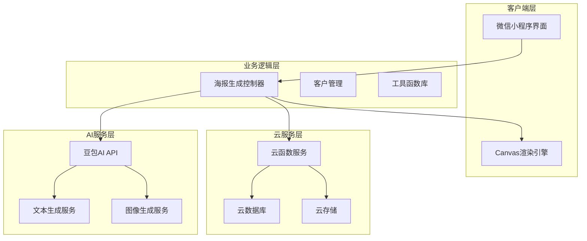
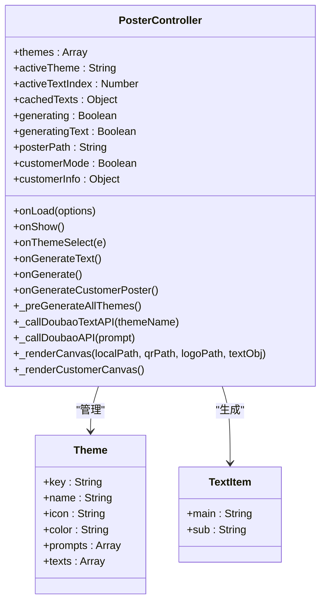
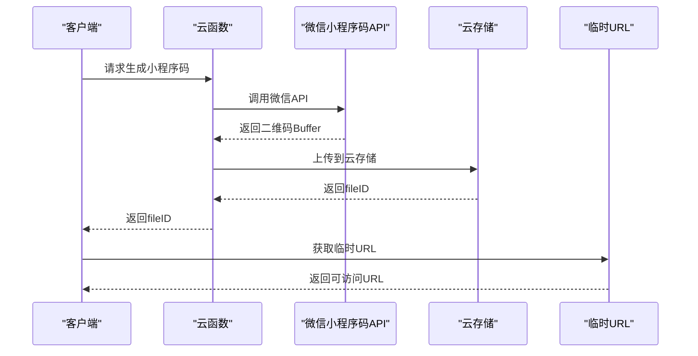
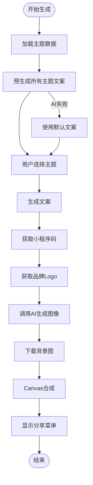
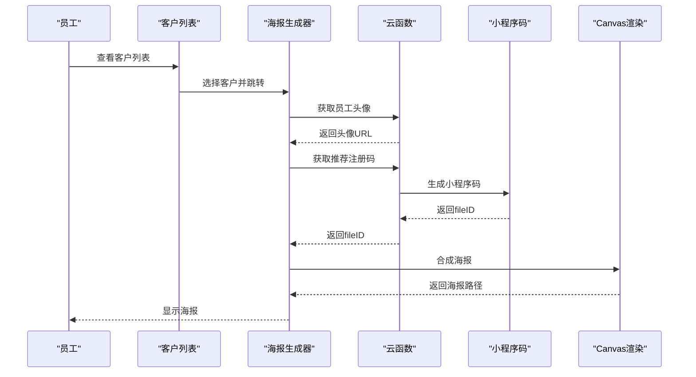
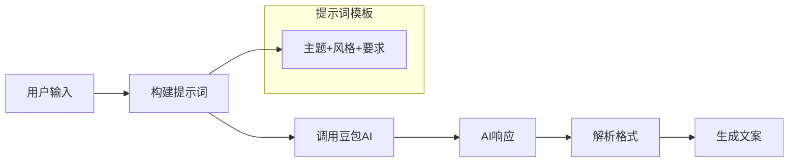
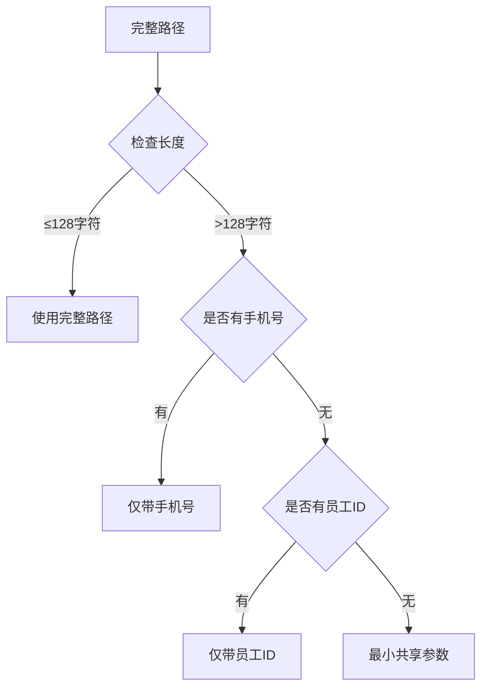
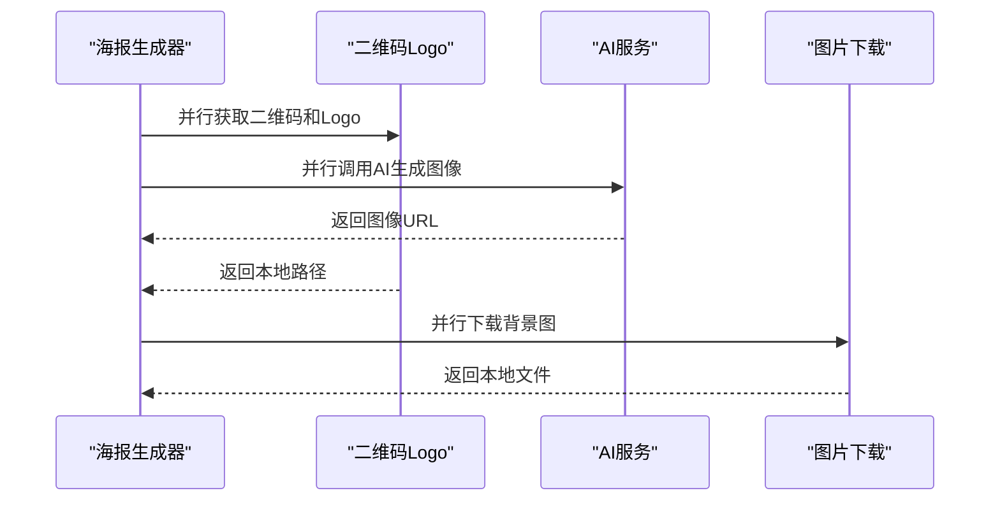
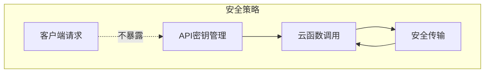

# 海报生成系统

<cite>
**本文档引用的文件**
- [miniprogram/pages/poster/index.js](file://miniprogram/pages/poster/index.js)
- [miniprogram/pages/poster/index.json](file://miniprogram/pages/poster/index.json)
- [miniprogram/pages/poster/index.wxml](file://miniprogram/pages/poster/index.wxml)
- [miniprogram/pages/poster/index.wxss](file://miniprogram/pages/poster/index.wxss)
- [miniprogram/pages/salaryAssessmentPoster/index.js](file://miniprogram/pages/salaryAssessmentPoster/index.js)
- [miniprogram/pages/posterCustomerList/index.js](file://miniprogram/pages/posterCustomerList/index.js)
- [cloudfunctions/quickstartFunctions/index.js](file://cloudfunctions/quickstartFunctions/index.js)
- [cloudfunctions/quickstartFunctions/package.json](file://cloudfunctions/quickstartFunctions/package.json)
- [miniprogram/utils/assessmentShareImage.js](file://miniprogram/utils/assessmentShareImage.js)
- [miniprogram/utils/sharerUtils.js](file://miniprogram/utils/sharerUtils.js)
- [miniprogram/app.js](file://miniprogram/app.js)
- [miniprogram/app.json](file://miniprogram/app.json)
- [docs/海报设计方案.md](file://docs/海报设计方案.md)
</cite>

## 目录
1. [项目概述](#项目概述)
2. [系统架构](#系统架构)
3. [核心组件分析](#核心组件分析)
4. [海报生成流程](#海报生成流程)
5. [技术实现细节](#技术实现细节)
6. [云函数服务](#云函数服务)
7. [性能优化策略](#性能优化策略)
8. [安全考虑](#安全考虑)
9. [故障排除指南](#故障排除指南)
10. [总结](#总结)

## 项目概述

海报生成系统是一个基于微信小程序的智能海报生成平台，主要服务于安得褓贝家政服务平台。该系统能够自动生成高质量的营销海报，包括个人简历海报、客户推荐海报和工资测评海报等多种类型。

### 系统特色

- **AI智能生成**：集成豆包AI模型，自动生成个性化文案和视觉描述
- **多种海报模板**：提供情感、事业、创业、经济独立四大主题海报
- **高质量输出**：采用2K分辨率，确保海报在各种设备上的清晰度
- **云端部署**：基于微信云开发，支持高并发访问
- **多场景应用**：支持个人展示、客户推荐、营销推广等多种用途

## 系统架构

海报生成系统采用前后端分离的架构设计，主要分为以下几个层次：



**架构图来源**
- [miniprogram/pages/poster/index.js:76-89](file://miniprogram/pages/poster/index.js#L76-L89)
- [cloudfunctions/quickstartFunctions/index.js:325-350](file://cloudfunctions/quickstartFunctions/index.js#L325-L350)

### 技术栈

- **前端框架**：微信小程序原生开发
- **后端服务**：微信云开发（云函数、云存储、云数据库）
- **AI服务**：豆包AI（Doubao AI）
- **图像处理**：Canvas 2D渲染
- **数据存储**：云数据库和云存储

## 核心组件分析

### 海报生成控制器

海报生成控制器是整个系统的核心，负责协调各个组件的工作流程。



**类图来源**
- [miniprogram/pages/poster/index.js:76-89](file://miniprogram/pages/poster/index.js#L76-L89)
- [miniprogram/pages/poster/index.js:20-74](file://miniprogram/pages/poster/index.js#L20-L74)

### 云函数服务架构

云函数服务提供了海报生成所需的各种基础设施：



**序列图来源**
- [cloudfunctions/quickstartFunctions/index.js:19-31](file://cloudfunctions/quickstartFunctions/index.js#L19-L31)
- [cloudfunctions/quickstartFunctions/index.js:98-119](file://cloudfunctions/quickstartFunctions/index.js#L98-L119)

**章节来源**
- [miniprogram/pages/poster/index.js:76-263](file://miniprogram/pages/poster/index.js#L76-L263)
- [cloudfunctions/quickstartFunctions/index.js:18-187](file://cloudfunctions/quickstartFunctions/index.js#L18-L187)

## 海报生成流程

### 普通心语海报生成流程

系统支持四种主题的心语海报生成，每种主题都有独特的视觉风格和文案风格。



**流程图来源**
- [miniprogram/pages/poster/index.js:138-161](file://miniprogram/pages/poster/index.js#L138-L161)
- [miniprogram/pages/poster/index.js:198-263](file://miniprogram/pages/poster/index.js#L198-L263)

### 客户推荐海报生成流程

客户推荐海报具有特殊的功能，能够基于客户的具体需求生成个性化的推荐海报。



**序列图来源**
- [miniprogram/pages/posterCustomerList/index.js:107-117](file://miniprogram/pages/posterCustomerList/index.js#L107-L117)
- [miniprogram/pages/poster/index.js:680-727](file://miniprogram/pages/poster/index.js#L680-L727)

**章节来源**
- [miniprogram/pages/poster/index.js:198-263](file://miniprogram/pages/poster/index.js#L198-L263)
- [miniprogram/pages/poster/index.js:680-727](file://miniprogram/pages/poster/index.js#L680-L727)
- [miniprogram/pages/posterCustomerList/index.js:107-117](file://miniprogram/pages/posterCustomerList/index.js#L107-L117)

## 技术实现细节

### Canvas渲染引擎

系统采用Canvas 2D渲染引擎进行海报合成，支持高清输出和复杂的图形效果。

#### 核心渲染参数

| 参数 | 值 | 说明 |
|------|-----|------|
| 画布尺寸 | 375 × 640 px | 标准手机屏幕尺寸 |
| 导出格式 | JPG | 高质量压缩 |
| 质量系数 | 0.95 | 平衡质量和文件大小 |
| DPI设置 | 自动检测 | 适配不同设备 |

#### 渐变遮罩实现

系统使用渐变遮罩技术增强海报的视觉层次感：

```mermaid
graph LR
Background[背景图] --> Mask[渐变遮罩]
Mask --> Content[内容层]
subgraph "渐变配置"
A[0%: rgba(15,5,30,0)] --> B[45%: rgba(15,5,30,0.55)]
B --> C[75%: rgba(15,5,30,0.88)]
C --> D[100%: rgba(15,5,30,0.97)]
end
```

**图表来源**
- [miniprogram/pages/poster/index.js:502-509](file://miniprogram/pages/poster/index.js#L502-L509)

### AI集成架构

系统集成了豆包AI服务，提供智能的文案生成和图像生成能力。

#### 文案生成流程



**图表来源**
- [miniprogram/pages/poster/index.js:266-318](file://miniprogram/pages/poster/index.js#L266-L318)

#### 图像生成参数

| 参数 | 值 | 说明 |
|------|-----|------|
| 模型名称 | doubao-seedream-5-0-260128 | AI图像生成模型 |
| 输出格式 | URL | 直接返回图片链接 |
| 分辨率 | 2K | 高清输出 |
| 水印 | 关闭 | 确保版权合规 |

**章节来源**
- [miniprogram/pages/poster/index.js:362-388](file://miniprogram/pages/poster/index.js#L362-L388)
- [miniprogram/pages/poster/index.js:266-359](file://miniprogram/pages/poster/index.js#L266-L359)

## 云函数服务

### 二维码生成功能

云函数提供了多种二维码生成功能，支持不同的使用场景：

| 功能类型 | 用途 | 参数 | 缓存策略 |
|----------|------|------|----------|
| 首页小程序码 | 固定页面跳转 | 无 | 永久缓存 |
| 简历详情码 | 带分享信息 | resumeId, staffId, phone | 按员工缓存 |
| 工资测评码 | 直达测评页面 | staffId, phone, openid | 按员工缓存 |
| 推荐注册码 | 客户推荐注册 | staffPhone, staffOpenid, customerId | 按客户缓存 |

### 路径长度优化

为了应对微信小程序码路径长度限制（128字符），系统实现了智能降级策略：



**流程图来源**
- [cloudfunctions/quickstartFunctions/index.js:42-77](file://cloudfunctions/quickstartFunctions/index.js#L42-L77)

**章节来源**
- [cloudfunctions/quickstartFunctions/index.js:18-187](file://cloudfunctions/quickstartFunctions/index.js#L18-L187)

## 性能优化策略

### 并行处理机制

系统采用了多项并行处理策略来提升性能：

#### 资源并行加载



#### 缓存策略

系统实现了多层次的缓存机制：

| 缓存层级 | 缓存对象 | 缓存策略 | 有效期 |
|----------|----------|----------|--------|
| 会话缓存 | Logo路径 | 同一会话内缓存 | 页面生命周期 |
| 会话缓存 | 二维码路径 | 按参数缓存 | 页面生命周期 |
| 云存储缓存 | 生成的海报 | 永久存储 | 手动清理 |
| 本地存储缓存 | 用户偏好设置 | 本地持久化 | 用户清除 |

### 内存管理

系统采用了智能的内存管理策略：

- **及时释放**：使用完的图片资源及时释放内存
- **懒加载**：只在需要时加载资源
- **缓存淘汰**：实现LRU缓存淘汰机制
- **错误恢复**：资源加载失败时的降级处理

## 安全考虑

### API密钥管理

系统采用了严格的安全措施保护API密钥：



**安全措施**：
- API密钥存储在云函数中，不暴露给客户端
- 使用HTTPS加密传输
- 实现访问频率限制
- 日志记录敏感操作

### 数据隐私保护

系统遵循数据隐私保护原则：

- 用户数据仅在必要时收集
- 数据传输采用加密通道
- 支持用户删除其个人数据
- 遵守相关法律法规

## 故障排除指南

### 常见问题及解决方案

#### 海报生成失败

**问题症状**：点击生成按钮后无响应或报错

**可能原因**：
1. AI服务不可用
2. 网络连接异常
3. 云存储权限不足
4. Canvas渲染错误

**解决方案**：
1. 检查网络连接状态
2. 重新启动小程序
3. 清理缓存数据
4. 联系技术支持

#### 二维码无法生成

**问题症状**：推荐海报中的二维码显示为空白

**可能原因**：
1. 云函数未正确部署
2. 微信小程序码API限制
3. 权限配置错误

**解决方案**：
1. 确认云函数已部署
2. 检查小程序版本是否为正式版
3. 验证云存储权限配置

#### 图片下载失败

**问题症状**：背景图片无法下载显示

**可能原因**：
1. AI服务返回无效URL
2. 云存储访问权限问题
3. 网络超时

**解决方案**：
1. 检查AI服务状态
2. 验证云存储配置
3. 重试下载操作

### 性能监控

系统提供了完善的性能监控机制：

- **加载时间统计**：记录各阶段耗时
- **错误日志收集**：自动收集异常信息
- **用户行为追踪**：分析用户使用习惯
- **性能指标上报**：定期上报系统状态

## 总结

海报生成系统是一个功能完善、技术先进的智能海报生成平台。系统通过AI技术、云服务和高效的渲染引擎，为用户提供高质量的海报生成体验。

### 系统优势

1. **智能化程度高**：AI驱动的文案和图像生成
2. **用户体验优秀**：简洁直观的操作界面
3. **性能表现优异**：多层缓存和并行处理
4. **安全性可靠**：严格的密钥管理和数据保护
5. **扩展性强**：模块化设计便于功能扩展

### 技术亮点

- **AI集成深度**：从文案到图像的全流程AI化
- **渲染技术先进**：Canvas 2D高性能渲染
- **云服务整合**：完整的云端解决方案
- **性能优化到位**：多维度的性能优化策略

### 发展前景

随着AI技术的不断发展和用户需求的持续增长，海报生成系统将继续优化升级，在保持现有优势的基础上，进一步提升智能化水平和用户体验，为安得褓贝平台创造更大的商业价值。