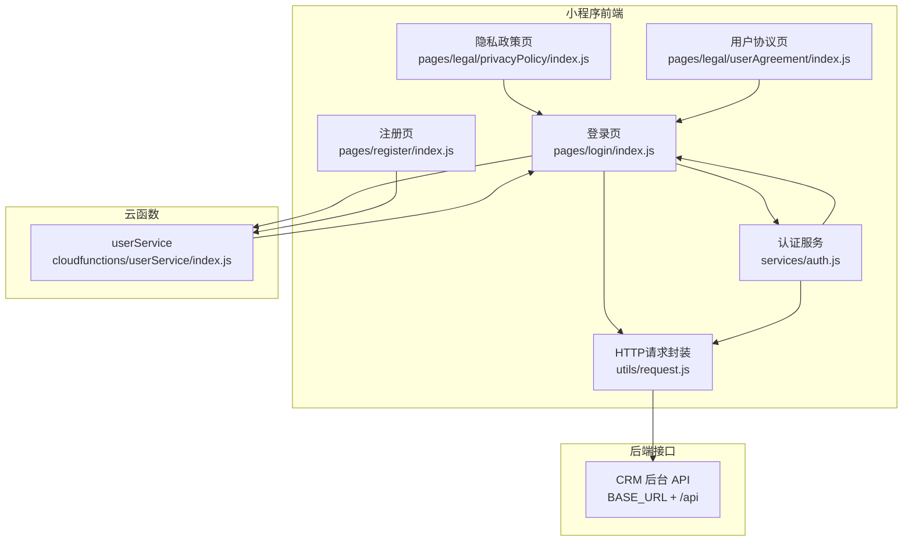
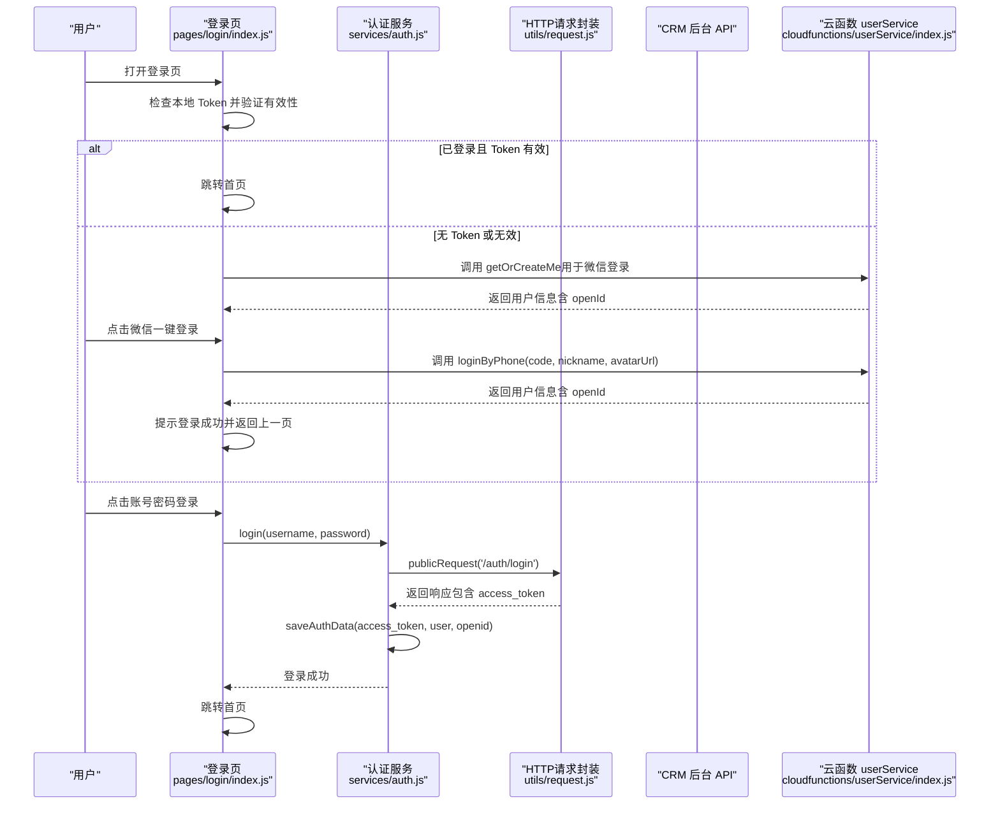
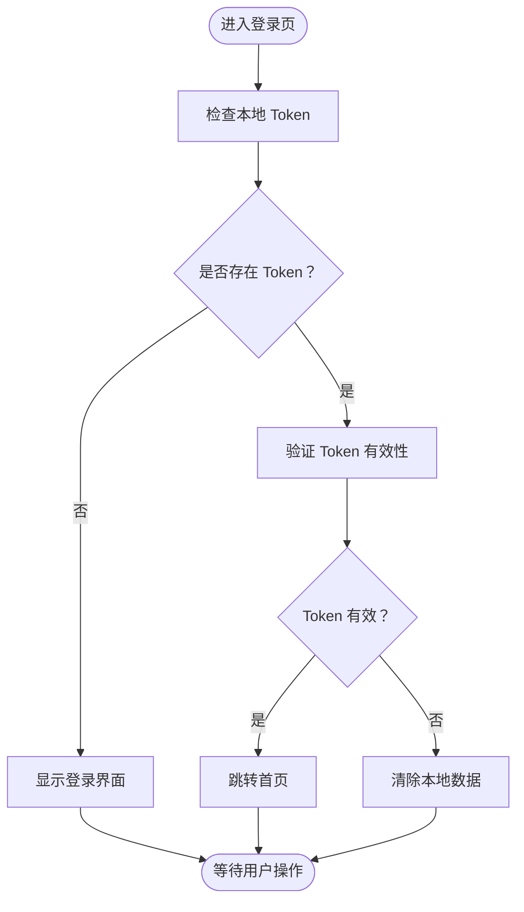
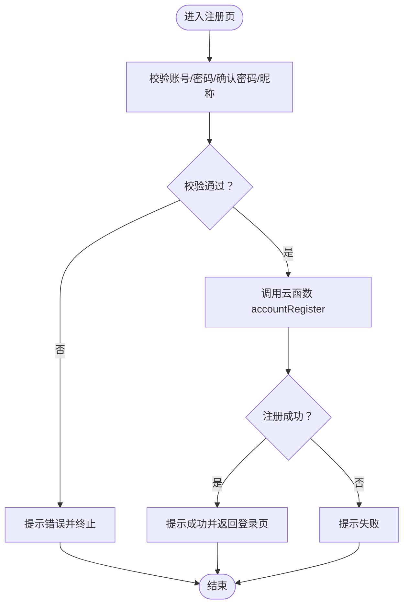
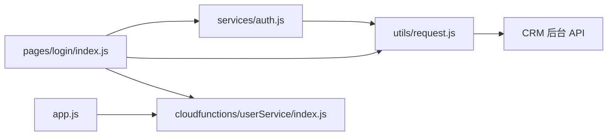

# 用户认证页面

<cite>
**本文引用的文件**
- [miniprogram/pages/login/index.js](file://miniprogram/pages/login/index.js)
- [miniprogram/pages/login/index.json](file://miniprogram/pages/login/index.json)
- [miniprogram/pages/register/index.js](file://miniprogram/pages/register/index.js)
- [miniprogram/pages/register/index.json](file://miniprogram/pages/register/index.json)
- [miniprogram/pages/legal/privacyPolicy/index.js](file://miniprogram/pages/legal/privacyPolicy/index.js)
- [miniprogram/pages/legal/privacyPolicy/index.json](file://miniprogram/pages/legal/privacyPolicy/index.json)
- [miniprogram/pages/legal/userAgreement/index.js](file://miniprogram/pages/legal/userAgreement/index.js)
- [miniprogram/pages/legal/userAgreement/index.json](file://miniprogram/pages/legal/userAgreement/index.json)
- [miniprogram/services/auth.js](file://miniprogram/services/auth.js)
- [miniprogram/utils/request.js](file://miniprogram/utils/request.js)
- [cloudfunctions/userService/index.js](file://cloudfunctions/userService/index.js)
- [miniprogram/app.js](file://miniprogram/app.js)
</cite>

## 目录
1. [简介](#简介)
2. [项目结构](#项目结构)
3. [核心组件](#核心组件)
4. [架构总览](#架构总览)
5. [详细组件分析](#详细组件分析)
6. [依赖关系分析](#依赖关系分析)
7. [性能考量](#性能考量)
8. [故障排查指南](#故障排查指南)
9. [结论](#结论)
10. [附录](#附录)

## 简介
本文件面向用户认证相关页面的综合文档，覆盖登录页、注册页以及隐私政策与用户协议页面。重点阐述两种登录模式的实现机制：微信一键登录（手机号授权）与账号密码登录；说明 openId 绑定、会话管理与 token 持久化策略；解释注册流程中的手机号验证、密码加密传输与用户信息初始化逻辑；解析隐私政策与用户协议页面的弹窗触发条件与用户授权记录方式；并提供登录状态拦截、页面跳转控制与异常处理（如登录失效）的代码实现示例。最后结合 userService 云函数，说明用户数据创建与查询接口的调用方式。

## 项目结构
围绕用户认证的关键目录与文件如下：
- 登录页：miniprogram/pages/login
- 注册页：miniprogram/pages/register
- 法律条款页：miniprogram/pages/legal/{privacyPolicy,userAgreement}
- 认证服务：miniprogram/services/auth.js
- HTTP 请求封装：miniprogram/utils/request.js
- 云函数：cloudfunctions/userService
- 小程序入口：miniprogram/app.js

图表来源
- [miniprogram/pages/login/index.js](file://miniprogram/pages/login/index.js#L1-L294)
- [miniprogram/pages/register/index.js](file://miniprogram/pages/register/index.js#L1-L97)
- [miniprogram/pages/legal/privacyPolicy/index.js](file://miniprogram/pages/legal/privacyPolicy/index.js#L1-L2)
- [miniprogram/pages/legal/userAgreement/index.js](file://miniprogram/pages/legal/userAgreement/index.js#L1-L2)
- [miniprogram/services/auth.js](file://miniprogram/services/auth.js#L1-L163)
- [miniprogram/utils/request.js](file://miniprogram/utils/request.js#L1-L125)
- [cloudfunctions/userService/index.js](file://cloudfunctions/userService/index.js#L1-L289)

章节来源
- [miniprogram/pages/login/index.js](file://miniprogram/pages/login/index.js#L1-L294)
- [miniprogram/pages/register/index.js](file://miniprogram/pages/register/index.js#L1-L97)
- [miniprogram/pages/legal/privacyPolicy/index.js](file://miniprogram/pages/legal/privacyPolicy/index.js#L1-L2)
- [miniprogram/pages/legal/userAgreement/index.js](file://miniprogram/pages/legal/userAgreement/index.js#L1-L2)
- [miniprogram/services/auth.js](file://miniprogram/services/auth.js#L1-L163)
- [miniprogram/utils/request.js](file://miniprogram/utils/request.js#L1-L125)
- [cloudfunctions/userService/index.js](file://cloudfunctions/userService/index.js#L1-L289)
- [miniprogram/app.js](file://miniprogram/app.js#L1-L21)

## 核心组件
- 登录页（微信一键登录 + 账号密码登录）
  - 微信一键登录：通过手机号授权回调，调用云函数解密手机号并保存用户信息，支持昵称与头像同步更新。
  - 账号密码登录：调用 CRM 后台登录接口，接收 JWT Token 并持久化到本地存储，随后跳转首页。
- 注册页：校验账号、密码、确认密码与昵称，调用云函数执行账号注册，返回成功提示并返回登录页。
- 法律条款页：隐私政策与用户协议页面，作为登录页的链接入口，用于展示法律文本。
- 认证服务（auth.js）：封装登录、登出、Token 校验、本地存储读写与用户信息获取。
- HTTP 请求封装（request.js）：区分公开请求与认证请求，统一处理 401 登录失效场景，自动清理本地 Token 并跳转登录页。
- 云函数（userService）：提供 getOrCreateMe/updateMe、loginByPhone、accountRegister、accountLogin 等动作，负责用户与账号数据的创建与查询。

章节来源
- [miniprogram/pages/login/index.js](file://miniprogram/pages/login/index.js#L1-L294)
- [miniprogram/pages/register/index.js](file://miniprogram/pages/register/index.js#L1-L97)
- [miniprogram/services/auth.js](file://miniprogram/services/auth.js#L1-L163)
- [miniprogram/utils/request.js](file://miniprogram/utils/request.js#L1-L125)
- [cloudfunctions/userService/index.js](file://cloudfunctions/userService/index.js#L1-L289)

## 架构总览
下图展示了从登录页到云函数与后端 API 的整体调用链路，以及会话管理与 token 持久化的路径。

图表来源
- [miniprogram/pages/login/index.js](file://miniprogram/pages/login/index.js#L1-L294)
- [miniprogram/services/auth.js](file://miniprogram/services/auth.js#L1-L163)
- [miniprogram/utils/request.js](file://miniprogram/utils/request.js#L1-L125)
- [cloudfunctions/userService/index.js](file://cloudfunctions/userService/index.js#L1-L289)

## 详细组件分析

### 登录页（微信一键登录与账号密码登录）
- 微信一键登录（手机号授权）
  - 触发条件：用户点击“微信一键登录”，并在同意《用户协议》与《隐私政策》的前提下授权手机号。
  - 流程要点：
    - 若头像为临时 URL，先上传至云存储并替换为 fileID。
    - 调用云函数 userService 的 loginByPhone 动作，传入 code、昵称与头像。
    - 成功后提示登录成功并返回上一页。
  - 关键实现位置参考：
    - [onGetPhoneNumber 回调与云函数调用](file://miniprogram/pages/login/index.js#L125-L189)
    - [loadMe 获取用户信息（含 openId）](file://miniprogram/pages/login/index.js#L70-L85)
    - [云函数 loginByPhone 实现](file://cloudfunctions/userService/index.js#L105-L161)

- 账号密码登录
  - 触发条件：用户在登录页弹窗中输入账号与密码。
  - 流程要点：
    - 调用认证服务 login(username, password)，内部通过 publicRequest 发起 POST /auth/login。
    - 成功后从响应中提取 access_token，并调用 saveAuthData 持久化到本地存储。
    - 跳转首页。
  - 关键实现位置参考：
    - [onAccountLogin 账号密码登录](file://miniprogram/pages/login/index.js#L195-L277)
    - [认证服务 login 实现](file://miniprogram/services/auth.js#L14-L22)
    - [HTTP 封装 publicRequest 实现](file://miniprogram/utils/request.js#L12-L41)

- openId 绑定与用户信息初始化
  - 登录页加载时调用 getOrCreateMe，确保用户在 users 集合中存在并返回 openId 对应的用户信息。
  - 云函数根据 openId 查询或创建用户记录，并根据手机号白名单判定角色（staff/customer），随后返回用户信息。
  - 关键实现位置参考：
    - [loadMe 调用 getOrCreateMe](file://miniprogram/pages/login/index.js#L70-L85)
    - [云函数 getOrCreateMe 实现](file://cloudfunctions/userService/index.js#L49-L84)

- 会话管理与 token 持久化
  - 登录成功后，saveAuthData 将 access_token 与 userInfo 存入本地存储（双键兼容），并可选保存 openid。
  - 登出时清除本地存储的 token 与用户信息。
  - 关键实现位置参考：
    - [saveAuthData 保存认证数据](file://miniprogram/services/auth.js#L69-L95)
    - [logout 清除认证数据](file://miniprogram/services/auth.js#L136-L150)

- 登录状态拦截与页面跳转控制
  - 登录页 onLaunch/onLoad 中检查本地 Token 并调用 validateToken，若有效则跳转首页；否则显示登录界面。
  - HTTP 封装 authenticatedRequest 在收到 401 时自动清理本地 Token 并跳转登录页。
  - 关键实现位置参考：
    - [checkLoginStatus 与 validateToken](file://miniprogram/pages/login/index.js#L32-L67)
    - [认证服务 validateToken](file://miniprogram/services/auth.js#L41-L63)
    - [authenticatedRequest 401 处理](file://miniprogram/utils/request.js#L70-L88)

- 异常处理（如登录失效）
  - 登录页：捕获 Token 验证异常并提示“登录已过期”，随后调用 logout 清理本地数据。
  - HTTP 封装：统一处理 401，提示“登录已过期”，清理本地数据并跳转登录页。
  - 关键实现位置参考：
    - [登录页异常分支与 logout 调用](file://miniprogram/pages/login/index.js#L58-L67)
    - [HTTP 封装 401 分支](file://miniprogram/utils/request.js#L70-L88)

图表来源
- [miniprogram/pages/login/index.js](file://miniprogram/pages/login/index.js#L32-L67)
- [miniprogram/services/auth.js](file://miniprogram/services/auth.js#L41-L63)

章节来源
- [miniprogram/pages/login/index.js](file://miniprogram/pages/login/index.js#L1-L294)
- [miniprogram/services/auth.js](file://miniprogram/services/auth.js#L1-L163)
- [miniprogram/utils/request.js](file://miniprogram/utils/request.js#L1-L125)
- [cloudfunctions/userService/index.js](file://cloudfunctions/userService/index.js#L1-L289)

### 注册页（手机号验证、密码加密传输与用户信息初始化）
- 输入校验
  - 账号：4-20 位字母或数字。
  - 密码：至少 6 位。
  - 确认密码：需与密码一致。
  - 昵称：必填。
- 调用云函数
  - 调用 userService 的 accountRegister 动作，传入 username、password、nickname。
  - 成功后提示“注册成功”，并返回登录页。
- 用户信息初始化
  - 账号密码登录成功后，云函数会确保 users 记录存在，并将 accountUsername 写入用户信息，同时更新 openid 与最近登录时间。
- 关键实现位置参考：
  - [注册表单校验与云函数调用](file://miniprogram/pages/register/index.js#L25-L89)
  - [云函数 accountRegister 实现](file://cloudfunctions/userService/index.js#L163-L196)
  - [云函数 accountLogin 初始化用户信息](file://cloudfunctions/userService/index.js#L199-L256)

图表来源
- [miniprogram/pages/register/index.js](file://miniprogram/pages/register/index.js#L25-L89)
- [cloudfunctions/userService/index.js](file://cloudfunctions/userService/index.js#L163-L196)

章节来源
- [miniprogram/pages/register/index.js](file://miniprogram/pages/register/index.js#L1-L97)
- [cloudfunctions/userService/index.js](file://cloudfunctions/userService/index.js#L163-L256)

### 隐私政策与用户协议页面
- 页面职责
  - 展示隐私政策与用户协议内容，供用户阅读。
- 触发条件
  - 登录页中“同意”复选框未勾选时，禁止进行微信一键登录与账号密码登录。
- 授权记录
  - 通过本地存储的 agreed 字段记录用户是否已同意协议。
- 关键实现位置参考：
  - [隐私政策页配置](file://miniprogram/pages/legal/privacyPolicy/index.json#L1-L4)
  - [用户协议页配置](file://miniprogram/pages/legal/userAgreement/index.json#L1-L4)
  - [登录页同意协议校验与跳转](file://miniprogram/pages/login/index.js#L125-L136)

章节来源
- [miniprogram/pages/legal/privacyPolicy/index.js](file://miniprogram/pages/legal/privacyPolicy/index.js#L1-L2)
- [miniprogram/pages/legal/privacyPolicy/index.json](file://miniprogram/pages/legal/privacyPolicy/index.json#L1-L4)
- [miniprogram/pages/legal/userAgreement/index.js](file://miniprogram/pages/legal/userAgreement/index.js#L1-L2)
- [miniprogram/pages/legal/userAgreement/index.json](file://miniprogram/pages/legal/userAgreement/index.json#L1-L4)
- [miniprogram/pages/login/index.js](file://miniprogram/pages/login/index.js#L125-L136)

### 认证服务与 HTTP 请求封装
- 认证服务（auth.js）
  - 提供 login、getCurrentUser、validateToken、saveAuthData、getLocalUserInfo、getLocalToken、isLoggedIn、logout 等方法。
  - 采用双键存储（access_token/token、userInfo/user_info）提升兼容性。
- HTTP 请求封装（utils/request.js）
  - publicRequest：用于无需认证的接口（如登录）。
  - authenticatedRequest：自动注入 Authorization 头，处理 401 登录失效并清理本地数据。
  - request：根据是否存在 Token 自动选择公开或认证请求。
- 关键实现位置参考：
  - [认证服务导出方法](file://miniprogram/services/auth.js#L152-L161)
  - [HTTP 封装导出方法](file://miniprogram/utils/request.js#L118-L123)

章节来源
- [miniprogram/services/auth.js](file://miniprogram/services/auth.js#L1-L163)
- [miniprogram/utils/request.js](file://miniprogram/utils/request.js#L1-L125)

### 云函数 userService（用户数据创建与查询）
- 主要动作
  - getOrCreateMe：按 openId 查询或创建用户记录，自动判断角色（staff/customer）。
  - updateMe：按 openId 更新用户信息（昵称、头像、手机号等）。
  - loginByPhone：通过微信手机号接口解密手机号，更新用户信息并返回用户对象。
  - accountRegister：校验账号唯一性并创建账号记录（密码明文存储，建议生产环境加密）。
  - accountLogin：校验账号与密码，确保用户记录存在并更新用户信息，同时更新账号 openid 与最近登录时间。
- 关键实现位置参考：
  - [云函数主入口与动作分发](file://cloudfunctions/userService/index.js#L258-L289)
  - [getOrCreateMe 实现](file://cloudfunctions/userService/index.js#L49-L84)
  - [loginByPhone 实现](file://cloudfunctions/userService/index.js#L105-L161)
  - [accountRegister 实现](file://cloudfunctions/userService/index.js#L163-L196)
  - [accountLogin 实现](file://cloudfunctions/userService/index.js#L199-L256)

章节来源
- [cloudfunctions/userService/index.js](file://cloudfunctions/userService/index.js#L1-L289)

## 依赖关系分析
- 登录页依赖认证服务与 HTTP 请求封装，间接依赖云函数与 CRM 后台 API。
- 认证服务依赖 HTTP 请求封装进行网络请求。
- 云函数依赖数据库操作与微信开放平台接口。
- 小程序入口初始化云环境，为云函数调用提供上下文。

图表来源
- [miniprogram/pages/login/index.js](file://miniprogram/pages/login/index.js#L1-L294)
- [miniprogram/services/auth.js](file://miniprogram/services/auth.js#L1-L163)
- [miniprogram/utils/request.js](file://miniprogram/utils/request.js#L1-L125)
- [cloudfunctions/userService/index.js](file://cloudfunctions/userService/index.js#L1-L289)
- [miniprogram/app.js](file://miniprogram/app.js#L1-L21)

章节来源
- [miniprogram/pages/login/index.js](file://miniprogram/pages/login/index.js#L1-L294)
- [miniprogram/services/auth.js](file://miniprogram/services/auth.js#L1-L163)
- [miniprogram/utils/request.js](file://miniprogram/utils/request.js#L1-L125)
- [cloudfunctions/userService/index.js](file://cloudfunctions/userService/index.js#L1-L289)
- [miniprogram/app.js](file://miniprogram/app.js#L1-L21)

## 性能考量
- 云函数初始化：首次运行自动创建必要集合，避免新环境直接报错，减少冷启动失败风险。
- 本地存储：采用双键存储提升兼容性，减少重复读取与转换成本。
- 请求封装：统一处理 401 登录失效，避免业务层重复处理。
- 图片上传：微信临时头像上传至云存储后再更新用户信息，避免频繁小文件访问。

章节来源
- [cloudfunctions/userService/index.js](file://cloudfunctions/userService/index.js#L1-L28)
- [miniprogram/services/auth.js](file://miniprogram/services/auth.js#L76-L95)
- [miniprogram/utils/request.js](file://miniprogram/utils/request.js#L70-L88)

## 故障排查指南
- 登录页无法跳转首页
  - 检查本地 Token 是否存在且有效；若无效，确认是否正确调用 validateToken 并执行 logout 清理。
  - 参考：[checkLoginStatus 与 validateToken](file://miniprogram/pages/login/index.js#L32-L67)、[认证服务 validateToken](file://miniprogram/services/auth.js#L41-L63)
- 账号密码登录失败
  - 确认 CRM 后台 /auth/login 接口可用，检查网络请求是否被域名限制拦截。
  - 参考：[HTTP 封装 publicRequest 与错误处理](file://miniprogram/utils/request.js#L12-L41)
- 登录失效自动跳转登录页
  - authenticatedRequest 收到 401 会自动清理本地 Token 并跳转登录页。
  - 参考：[authenticatedRequest 401 分支](file://miniprogram/utils/request.js#L70-L88)
- 微信一键登录失败
  - 检查是否已同意协议、是否授权手机号、头像上传是否成功。
  - 参考：[onGetPhoneNumber 回调与云函数调用](file://miniprogram/pages/login/index.js#L125-L189)、[云函数 loginByPhone](file://cloudfunctions/userService/index.js#L105-L161)
- 注册失败
  - 检查账号唯一性与输入校验，确认云函数 accountRegister 返回成功。
  - 参考：[注册页校验与调用](file://miniprogram/pages/register/index.js#L25-L89)、[云函数 accountRegister](file://cloudfunctions/userService/index.js#L163-L196)

章节来源
- [miniprogram/pages/login/index.js](file://miniprogram/pages/login/index.js#L32-L189)
- [miniprogram/services/auth.js](file://miniprogram/services/auth.js#L41-L63)
- [miniprogram/utils/request.js](file://miniprogram/utils/request.js#L12-L41)
- [cloudfunctions/userService/index.js](file://cloudfunctions/userService/index.js#L105-L196)
- [miniprogram/pages/register/index.js](file://miniprogram/pages/register/index.js#L25-L89)

## 结论
本认证体系通过登录页、注册页与法律条款页协同，实现了微信一键登录与账号密码登录双模式。openId 绑定与用户信息初始化由云函数 userService 负责，会话管理与 token 持久化由认证服务与 HTTP 请求封装共同保障。登录状态拦截、页面跳转控制与异常处理（如登录失效）均已在代码层面实现，具备良好的用户体验与健壮性。建议在生产环境中对密码进行加密存储，并完善网络请求的域名配置与安全策略。

## 附录
- 页面标题与导航配置
  - 登录页：[pages/login/index.json](file://miniprogram/pages/login/index.json#L1-L5)
  - 注册页：[pages/register/index.json](file://miniprogram/pages/register/index.json#L1-L7)
  - 隐私政策页：[pages/legal/privacyPolicy/index.json](file://miniprogram/pages/legal/privacyPolicy/index.json#L1-L4)
  - 用户协议页：[pages/legal/userAgreement/index.json](file://miniprogram/pages/legal/userAgreement/index.json#L1-L4)
- 小程序云环境初始化
  - [miniprogram/app.js](file://miniprogram/app.js#L1-L21)