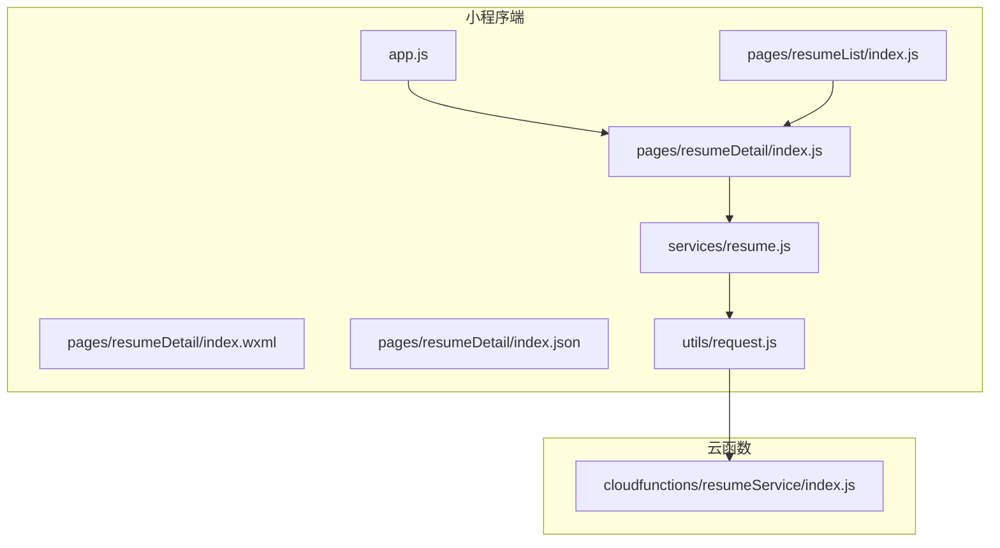
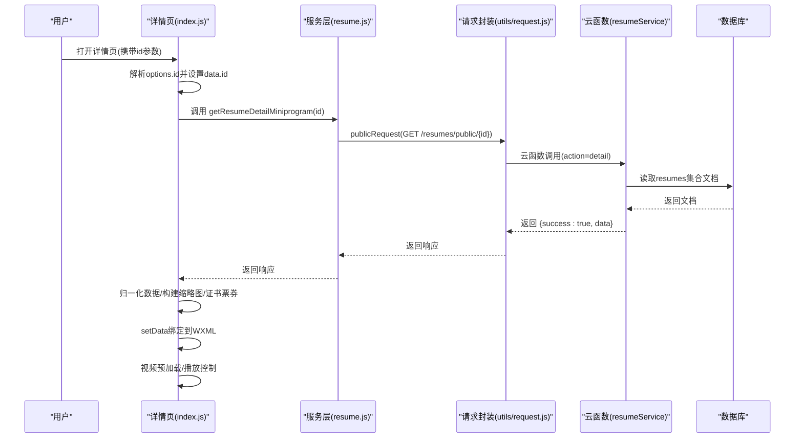
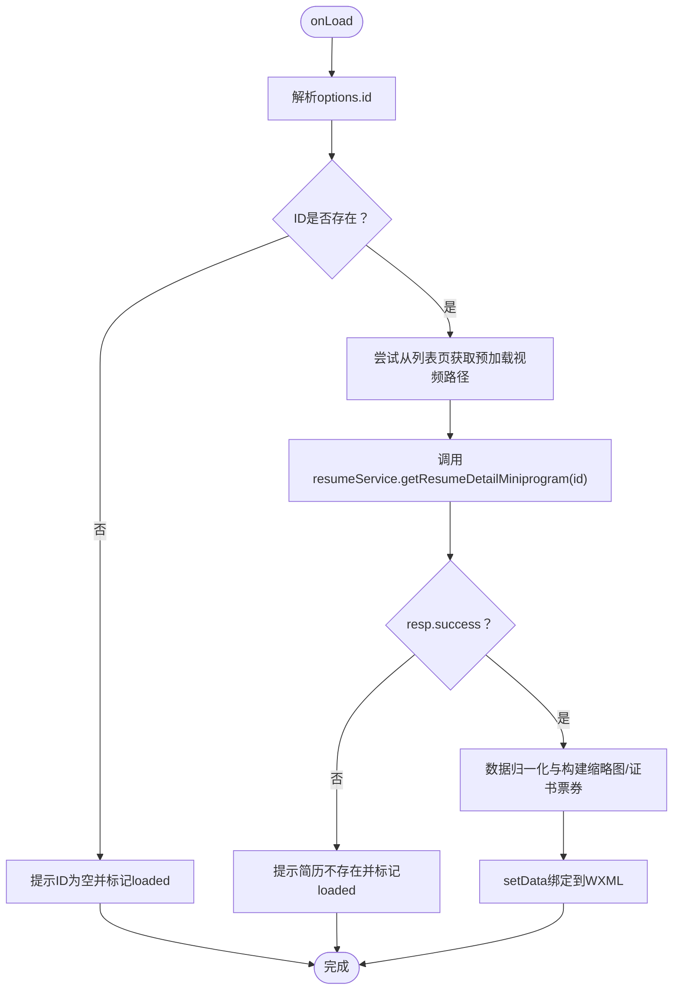
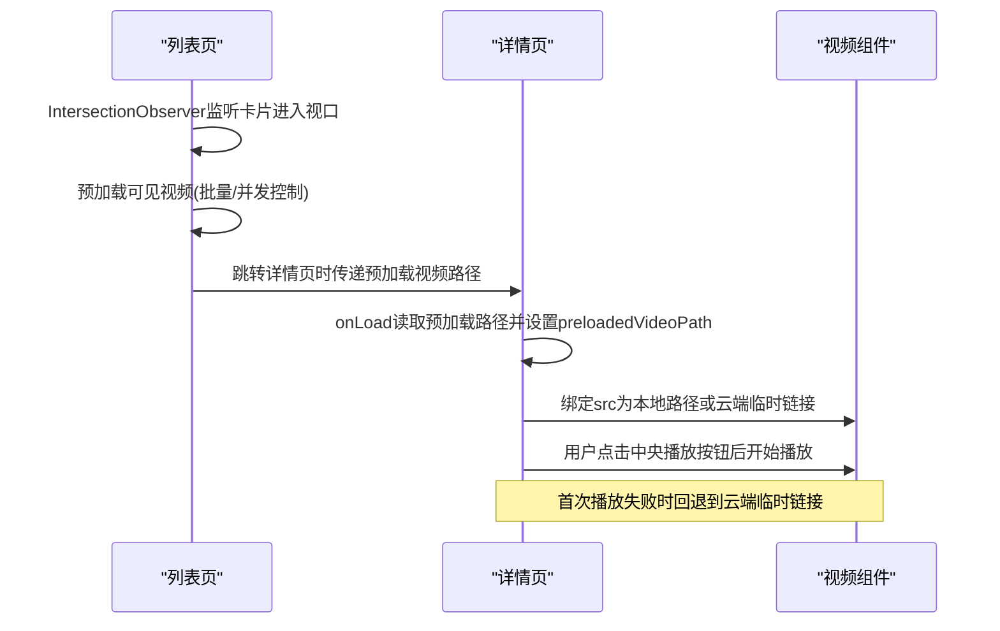
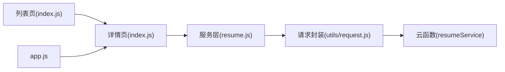

# 简历详情页

<cite>
**本文引用的文件**
- [miniprogram/pages/resumeDetail/index.js](file://miniprogram/pages/resumeDetail/index.js)
- [miniprogram/pages/resumeDetail/index.json](file://miniprogram/pages/resumeDetail/index.json)
- [miniprogram/pages/resumeDetail/index.wxml](file://miniprogram/pages/resumeDetail/index.wxml)
- [miniprogram/services/resume.js](file://miniprogram/services/resume.js)
- [cloudfunctions/resumeService/index.js](file://cloudfunctions/resumeService/index.js)
- [miniprogram/utils/request.js](file://miniprogram/utils/request.js)
- [miniprogram/pages/resumeList/index.js](file://miniprogram/pages/resumeList/index.js)
- [视频预加载优化方案.md](file://视频预加载优化方案.md)
- [miniprogram/app.js](file://miniprogram/app.js)
</cite>

## 目录
1. [简介](#简介)
2. [项目结构](#项目结构)
3. [核心组件](#核心组件)
4. [架构总览](#架构总览)
5. [详细组件分析](#详细组件分析)
6. [依赖关系分析](#依赖关系分析)
7. [性能考虑](#性能考虑)
8. [故障排查指南](#故障排查指南)
9. [结论](#结论)
10. [附录](#附录)

## 简介
本文件面向“简历详情页”的深度技术文档，聚焦通过简历ID参数动态加载并渲染单个月嫂简历的完整流程。内容涵盖：
- 页面生命周期中如何解析路由参数并调用服务层获取数据，处理加载状态、错误提示与数据绑定
- 多媒体展示（图片轮播、视频播放）的实现机制，特别是视频预加载优化方案的应用
- WXML模板结构分析，包括数据字段映射、条件渲染与事件绑定
- 页面分享功能的实现逻辑及自定义分享卡片内容的方式
- 性能优化建议，如图片懒加载与缓存策略

## 项目结构
简历详情页位于小程序端 pages/resumeDetail，主要由以下文件构成：
- index.js：页面逻辑（生命周期、数据处理、事件处理、视频控制、预加载）
- index.json：页面配置（导航栏标题）
- index.wxml：页面结构与数据绑定
- services/resume.js：封装对 CRM 后台 API 的调用
- cloudfunctions/resumeService/index.js：云函数（数据库读取、字段裁剪、权限校验）
- utils/request.js：HTTP 请求封装（公开/认证请求）
- pages/resumeList/index.js：列表页（负责视频预加载与跨页共享）
- 视频预加载优化方案.md：预加载方案说明
- app.js：云环境初始化

图表来源
- [miniprogram/pages/resumeDetail/index.js](file://miniprogram/pages/resumeDetail/index.js#L1-L120)
- [miniprogram/pages/resumeDetail/index.wxml](file://miniprogram/pages/resumeDetail/index.wxml#L1-L120)
- [miniprogram/services/resume.js](file://miniprogram/services/resume.js#L70-L120)
- [miniprogram/utils/request.js](file://miniprogram/utils/request.js#L1-L125)
- [cloudfunctions/resumeService/index.js](file://cloudfunctions/resumeService/index.js#L180-L216)
- [miniprogram/pages/resumeList/index.js](file://miniprogram/pages/resumeList/index.js#L36-L191)
- [miniprogram/app.js](file://miniprogram/app.js#L1-L21)

章节来源
- [miniprogram/pages/resumeDetail/index.js](file://miniprogram/pages/resumeDetail/index.js#L1-L120)
- [miniprogram/pages/resumeDetail/index.json](file://miniprogram/pages/resumeDetail/index.json#L1-L4)
- [miniprogram/pages/resumeDetail/index.wxml](file://miniprogram/pages/resumeDetail/index.wxml#L1-L120)
- [miniprogram/services/resume.js](file://miniprogram/services/resume.js#L70-L120)
- [cloudfunctions/resumeService/index.js](file://cloudfunctions/resumeService/index.js#L180-L216)
- [miniprogram/utils/request.js](file://miniprogram/utils/request.js#L1-L125)
- [miniprogram/pages/resumeList/index.js](file://miniprogram/pages/resumeList/index.js#L36-L191)
- [视频预加载优化方案.md](file://视频预加载优化方案.md#L1-L125)
- [miniprogram/app.js](file://miniprogram/app.js#L1-L21)

## 核心组件
- 页面逻辑（index.js）：负责解析路由参数、调用服务层、数据归一化、视频控制、预加载、事件处理与错误提示
- 服务层（services/resume.js）：封装公开接口调用，统一请求方式
- 云函数（cloudfunctions/resumeService/index.js）：数据库读取、字段裁剪、权限校验
- 请求封装（utils/request.js）：公开/认证请求封装，统一错误处理
- 列表页（pages/resumeList/index.js）：负责视频预加载与跨页共享
- 预加载方案（视频预加载优化方案.md）：提供预加载策略与配置

章节来源
- [miniprogram/pages/resumeDetail/index.js](file://miniprogram/pages/resumeDetail/index.js#L166-L200)
- [miniprogram/services/resume.js](file://miniprogram/services/resume.js#L70-L120)
- [cloudfunctions/resumeService/index.js](file://cloudfunctions/resumeService/index.js#L180-L216)
- [miniprogram/utils/request.js](file://miniprogram/utils/request.js#L1-L125)
- [miniprogram/pages/resumeList/index.js](file://miniprogram/pages/resumeList/index.js#L36-L191)
- [视频预加载优化方案.md](file://视频预加载优化方案.md#L1-L125)

## 架构总览
简历详情页的数据流与交互如下：

图表来源
- [miniprogram/pages/resumeDetail/index.js](file://miniprogram/pages/resumeDetail/index.js#L166-L200)
- [miniprogram/services/resume.js](file://miniprogram/services/resume.js#L87-L100)
- [miniprogram/utils/request.js](file://miniprogram/utils/request.js#L12-L41)
- [cloudfunctions/resumeService/index.js](file://cloudfunctions/resumeService/index.js#L108-L120)

## 详细组件分析

### 生命周期与数据加载（onLoad/loadDetail）
- 路由参数解析：从 options 中读取简历ID并写入 data.id
- 列表页预加载视频：通过 getCurrentPages 获取上一页，若上一页为简历列表且存在对应简历，则尝试复用其本地视频路径
- 调用服务层：调用 getResumeDetailMiniprogram(id) 发起公开接口请求
- 响应处理：根据 success 字段判断，成功时进行数据归一化（字段兼容、URL标准化、日期/地区/星座/生肖格式化、工作经历处理、头像与缩略图构建、证书票券生成），然后 setData 绑定到 WXML
- 错误处理：ID为空、接口失败、视频URL无效或仍为 cloud:// 时，均给出提示并标记 loaded

图表来源
- [miniprogram/pages/resumeDetail/index.js](file://miniprogram/pages/resumeDetail/index.js#L166-L200)
- [miniprogram/pages/resumeDetail/index.js](file://miniprogram/pages/resumeDetail/index.js#L202-L708)
- [miniprogram/services/resume.js](file://miniprogram/services/resume.js#L87-L100)

章节来源
- [miniprogram/pages/resumeDetail/index.js](file://miniprogram/pages/resumeDetail/index.js#L166-L200)
- [miniprogram/pages/resumeDetail/index.js](file://miniprogram/pages/resumeDetail/index.js#L202-L708)
- [miniprogram/services/resume.js](file://miniprogram/services/resume.js#L87-L100)

### 多媒体展示与视频控制
- 主媒体区：支持视频与图片两种模式，通过 heroMediaType 控制
- 视频组件：使用 wx:if 条件渲染 video 标签，绑定多种事件（元数据加载、缓冲、可播放、进度、结束、错误）
- 中央播放按钮：仅在视频可播放且用户未主动播放时显示，点击后才开始播放
- 静音控制：切换 heroVideoMuted
- 视频预加载策略：
  - 列表页预加载：通过 IntersectionObserver 监听卡片进入视口，批量预加载可见视频，缓存至本地
  - 详情页复用：onLoad 从列表页获取预加载视频路径，直接使用本地路径，避免二次下载
  - 本地缓存：在 Wi-Fi 下将视频下载到本地并持久化，下次命中缓存直接播放
  - 云端临时链接：若为 cloud://，通过 wx.cloud.getTempFileURL 转换为临时HTTPS链接

图表来源
- [miniprogram/pages/resumeDetail/index.js](file://miniprogram/pages/resumeDetail/index.js#L166-L200)
- [miniprogram/pages/resumeDetail/index.js](file://miniprogram/pages/resumeDetail/index.js#L897-L919)
- [miniprogram/pages/resumeDetail/index.js](file://miniprogram/pages/resumeDetail/index.js#L921-L1019)
- [miniprogram/pages/resumeList/index.js](file://miniprogram/pages/resumeList/index.js#L36-L191)
- [视频预加载优化方案.md](file://视频预加载优化方案.md#L1-L125)

章节来源
- [miniprogram/pages/resumeDetail/index.js](file://miniprogram/pages/resumeDetail/index.js#L1-L120)
- [miniprogram/pages/resumeDetail/index.js](file://miniprogram/pages/resumeDetail/index.js#L828-L919)
- [miniprogram/pages/resumeDetail/index.js](file://miniprogram/pages/resumeDetail/index.js#L921-L1019)
- [miniprogram/pages/resumeList/index.js](file://miniprogram/pages/resumeList/index.js#L36-L191)
- [视频预加载优化方案.md](file://视频预加载优化方案.md#L1-L125)

### WXML模板结构与数据绑定
- 顶层容器：根据 loaded 控制显示“加载中”或页面主体
- 顶部英雄区（主媒体区）：
  - 视频模式：video 标签绑定 src、poster、静音、隐藏控件等属性，绑定多种事件
  - 图片模式：image 标签绑定 heroSelectedImage 或封面
  - 中央播放按钮与静音按钮：使用普通 view 实现（同层渲染支持）
  - 底部缩略图：固定展示3张（含视频入口），支持点击切换到视频或图片
- 信息卡片：头像、姓名、工种、经验、好评数、认证徽章、基本信息行（属相/年龄/星座/籍贯/民族/学历）
- 证书票券：横向滚动展示，支持点击预览
- 工作经历：分段展示，包含日期、订单编号、服务区域、工作照片滚动、描述与客户评价
- 底部操作栏：咨询与预约按钮

章节来源
- [miniprogram/pages/resumeDetail/index.wxml](file://miniprogram/pages/resumeDetail/index.wxml#L1-L120)
- [miniprogram/pages/resumeDetail/index.wxml](file://miniprogram/pages/resumeDetail/index.wxml#L120-L303)

### 页面分享与自定义分享卡片
- 分享链接生成：服务层提供 createShare(id, expiresInHours) 接口，用于生成带过期时间的分享链接
- 页面配置：index.json 设置导航栏标题
- 自定义分享卡片：可在页面 onShareAppMessage 中返回 title、path、imageUrl 等字段，结合后端生成的分享链接实现个性化分享内容

章节来源
- [miniprogram/services/resume.js](file://miniprogram/services/resume.js#L167-L181)
- [miniprogram/pages/resumeDetail/index.json](file://miniprogram/pages/resumeDetail/index.json#L1-L4)

### 事件绑定与交互
- 视频事件：bindloadedmetadata、bindended、binderror、bindwaiting、bindcanplay、bindprogress
- 播放控制：中央播放按钮、静音按钮
- 缩略图切换：点击底部缩略图切换到视频或指定图片
- 图片预览：证书与工作照片点击预览
- 导航：查看全部照片、证书预览

章节来源
- [miniprogram/pages/resumeDetail/index.wxml](file://miniprogram/pages/resumeDetail/index.wxml#L1-L120)
- [miniprogram/pages/resumeDetail/index.js](file://miniprogram/pages/resumeDetail/index.js#L709-L808)
- [miniprogram/pages/resumeDetail/index.js](file://miniprogram/pages/resumeDetail/index.js#L809-L1044)

## 依赖关系分析
- 页面依赖服务层：通过 resume.js 调用公开接口
- 服务层依赖请求封装：utils/request.js 提供统一的请求方式
- 云函数依赖数据库：读取 resumes 文档并裁剪字段
- 列表页依赖预加载器：VideoPreloader 负责预加载与缓存
- app.js 初始化云环境，确保 wx.cloud 可用

图表来源
- [miniprogram/pages/resumeDetail/index.js](file://miniprogram/pages/resumeDetail/index.js#L1-L120)
- [miniprogram/services/resume.js](file://miniprogram/services/resume.js#L70-L120)
- [miniprogram/utils/request.js](file://miniprogram/utils/request.js#L1-L125)
- [cloudfunctions/resumeService/index.js](file://cloudfunctions/resumeService/index.js#L180-L216)
- [miniprogram/pages/resumeList/index.js](file://miniprogram/pages/resumeList/index.js#L36-L191)
- [miniprogram/app.js](file://miniprogram/app.js#L1-L21)

章节来源
- [miniprogram/pages/resumeDetail/index.js](file://miniprogram/pages/resumeDetail/index.js#L1-L120)
- [miniprogram/services/resume.js](file://miniprogram/services/resume.js#L70-L120)
- [miniprogram/utils/request.js](file://miniprogram/utils/request.js#L1-L125)
- [cloudfunctions/resumeService/index.js](file://cloudfunctions/resumeService/index.js#L180-L216)
- [miniprogram/pages/resumeList/index.js](file://miniprogram/pages/resumeList/index.js#L36-L191)
- [miniprogram/app.js](file://miniprogram/app.js#L1-L21)

## 性能考虑
- 视频预加载与缓存
  - 列表页：IntersectionObserver 监听卡片进入视口，首屏预加载若干视频，批量并发控制，避免阻塞
  - 详情页：优先使用列表页预加载的本地路径，减少二次下载
  - 本地缓存：Wi-Fi 下将视频下载到本地并持久化，命中缓存直接播放
  - 云端临时链接：对 cloud:// 自动转换为临时HTTPS链接
- 图片懒加载
  - 详情页图片采用按需加载策略，WXML 中使用 src 绑定，避免一次性加载全部图片
  - 工作照片使用横向滚动视图，按需渲染
- 错误回退
  - 视频播放失败时提示用户并回退到远程播放
  - 证书与工作照片加载失败时记录日志，不影响整体体验

章节来源
- [视频预加载优化方案.md](file://视频预加载优化方案.md#L1-L125)
- [miniprogram/pages/resumeDetail/index.js](file://miniprogram/pages/resumeDetail/index.js#L921-L1019)
- [miniprogram/pages/resumeList/index.js](file://miniprogram/pages/resumeList/index.js#L36-L191)
- [miniprogram/pages/resumeDetail/index.wxml](file://miniprogram/pages/resumeDetail/index.wxml#L200-L303)

## 故障排查指南
- 简历ID为空
  - 现象：页面直接提示并标记 loaded
  - 处理：检查路由传参是否正确
- 接口调用失败
  - 现象：提示“简历不存在”或“加载失败”
  - 处理：检查网络状态、CRM接口可用性、ID有效性
- 视频URL无效或仍为 cloud://
  - 现象：提示“视频地址无效/转换失败”，或视频无法播放
  - 处理：确认云存储文件已转临时链接；检查视频编码与格式；确认下载域名配置
- 视频播放缓冲/卡顿
  - 现象：出现缓冲提示
  - 处理：检查网络类型；确认预加载是否命中缓存；优化视频压缩与编码
- 图片加载失败
  - 现象：工作照片或证书图片加载失败
  - 处理：记录失败URL，稍后重试或替换为占位图

章节来源
- [miniprogram/pages/resumeDetail/index.js](file://miniprogram/pages/resumeDetail/index.js#L202-L708)
- [miniprogram/pages/resumeDetail/index.js](file://miniprogram/pages/resumeDetail/index.js#L879-L919)
- [miniprogram/pages/resumeDetail/index.js](file://miniprogram/pages/resumeDetail/index.js#L1033-L1044)

## 结论
简历详情页通过清晰的分层设计与完善的预加载策略，在保证数据一致性的同时，显著提升了视频播放体验与页面性能。详情页在 onLoad 中解析参数、复用列表页预加载视频、统一数据归一化与事件处理，配合 WXML 的条件渲染与事件绑定，形成了稳定、可维护的功能模块。

## 附录
- 云环境初始化：确保 wx.cloud 可用，便于调用云存储与云函数
- 分享卡片：结合后端生成的分享链接，实现个性化分享内容

章节来源
- [miniprogram/app.js](file://miniprogram/app.js#L1-L21)
- [miniprogram/services/resume.js](file://miniprogram/services/resume.js#L167-L181)