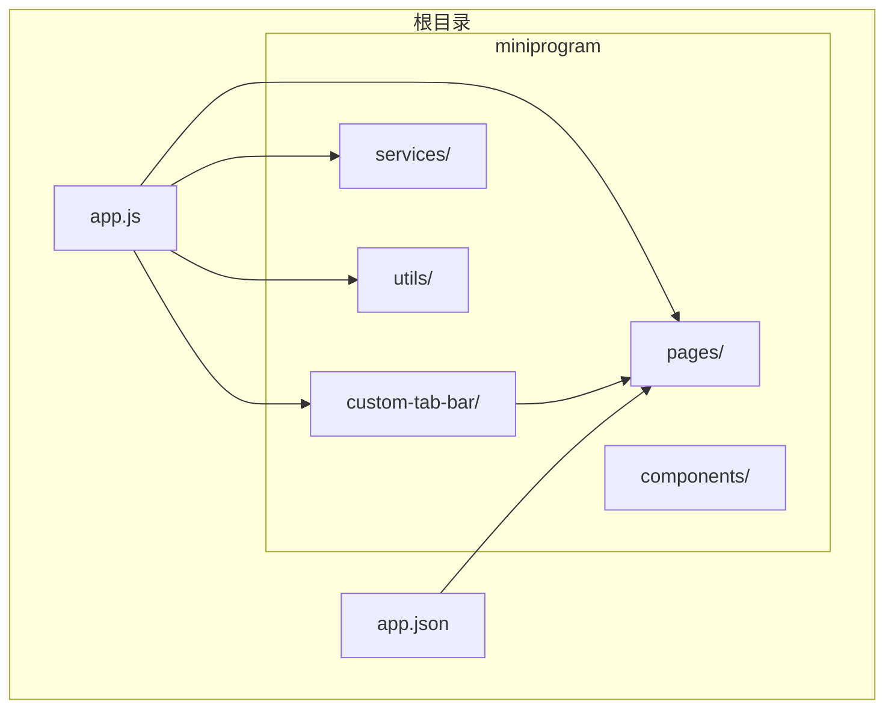
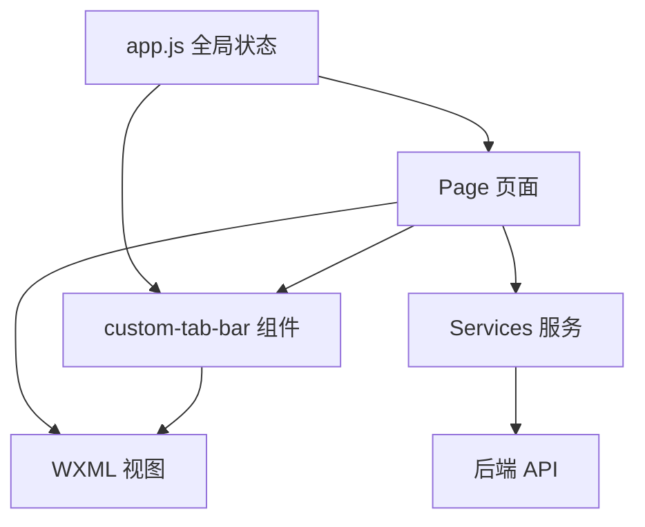
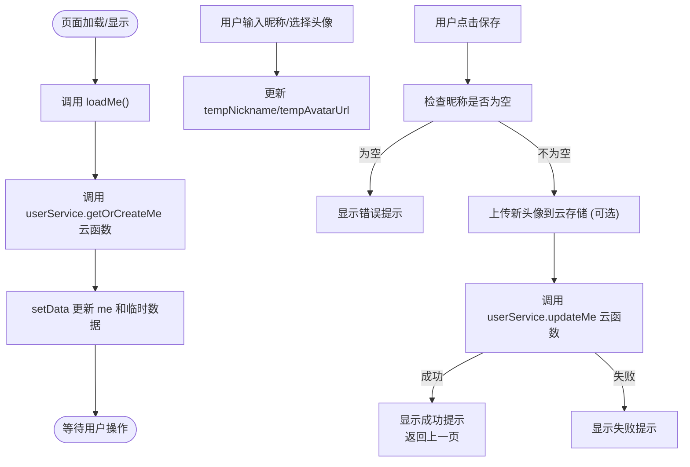
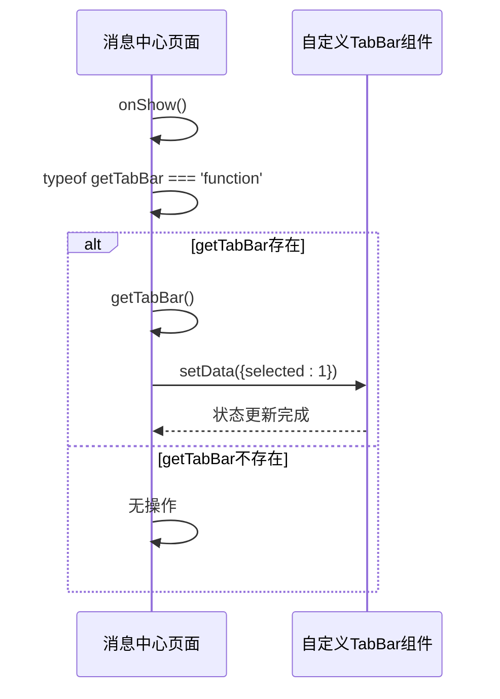
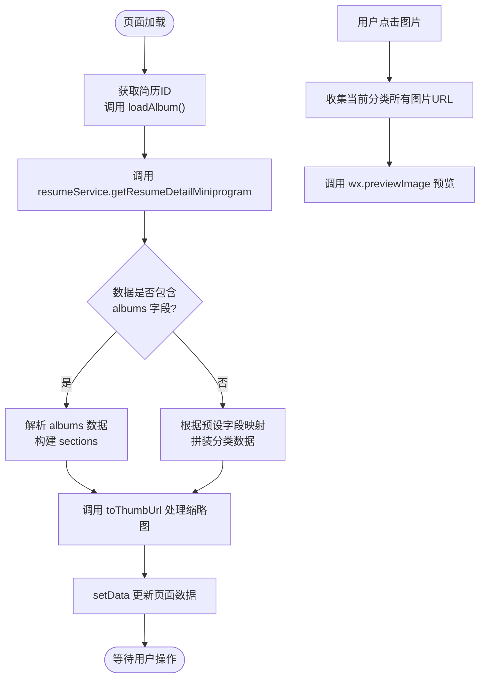
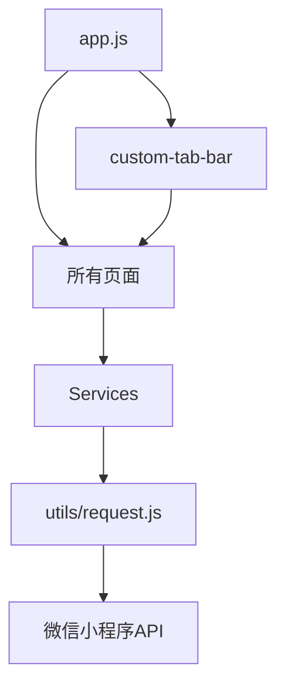

# 辅助功能页面

<cite>
**本文档引用文件**  
- [app.js](file://miniprogram/app.js)
- [app.json](file://miniprogram/app.json)
- [custom-tab-bar/index.js](file://miniprogram/custom-tab-bar/index.js)
- [custom-tab-bar/index.wxml](file://miniprogram/custom-tab-bar/index.wxml)
- [custom-tab-bar/index.wxss](file://miniprogram/custom-tab-bar/index.wxss)
- [custom-tab-bar/README.md](file://miniprogram/custom-tab-bar/README.md)
- [pages/settings/index.js](file://miniprogram/pages/settings/index.js)
- [pages/message/index.js](file://miniprogram/pages/message/index.js)
- [pages/resumeAlbum/index.js](file://miniprogram/pages/resumeAlbum/index.js)
- [pages/profile/index.js](file://miniprogram/pages/profile/index.js)
- [pages/home/index.js](file://miniprogram/pages/home/index.js)
- [services/resume.js](file://miniprogram/services/resume.js)
- [utils/request.js](file://miniprogram/utils/request.js)
- [services/auth.js](file://miniprogram/services/auth.js)
</cite>

## 目录
1. [简介](#简介)
2. [项目结构](#项目结构)
3. [核心组件](#核心组件)
4. [架构概览](#架构概览)
5. [详细组件分析](#详细组件分析)
6. [依赖分析](#依赖分析)
7. [性能考量](#性能考量)
8. [故障排除指南](#故障排除指南)
9. [结论](#结论)

## 简介
本文档旨在全面说明“安得褓贝”小程序中设置页、消息中心、简历相册等辅助功能页面的实现机制。文档涵盖页面功能逻辑、事件处理机制、数据更新模式以及与全局状态管理的交互方式，重点解析自定义 tabBar 的实现原理及其在跨页面状态同步中的作用。同时，阐述各页面的轻量化设计原则与性能优化策略，为开发者提供清晰的技术参考。

## 项目结构
项目采用典型的微信小程序目录结构，主要功能模块分布在 `miniprogram` 目录下。`pages` 目录包含所有页面逻辑，`components` 目录存放可复用组件，`services` 目录封装业务逻辑与 API 调用，`utils` 目录提供通用工具函数。`custom-tab-bar` 目录实现了自定义的底部导航栏，是跨页面状态同步的关键。`app.js` 和 `app.json` 作为应用入口和全局配置文件，管理着全局状态和路由。



**Diagram sources**
- [app.js](file://miniprogram/app.js)
- [app.json](file://miniprogram/app.json)
- [custom-tab-bar/index.js](file://miniprogram/custom-tab-bar/index.js)

## 核心组件
本项目的核心辅助功能组件包括设置页、消息中心、简历相册和自定义 tabBar。设置页负责用户信息的编辑与保存，并提供退出登录功能。消息中心展示用户通知，其核心在于与自定义 tabBar 的状态同步。简历相册实现图片的分类展示、预览与下载。自定义 tabBar 是整个导航系统的核心，它不仅提供美观的界面，还承担着跨页面状态同步的职责，确保用户在不同页面间切换时，底部导航的选中状态能正确更新。

**Section sources**
- [pages/settings/index.js](file://miniprogram/pages/settings/index.js)
- [pages/message/index.js](file://miniprogram/pages/message/index.js)
- [pages/resumeAlbum/index.js](file://miniprogram/pages/resumeAlbum/index.js)
- [custom-tab-bar/index.js](file://miniprogram/custom-tab-bar/index.js)

## 架构概览
系统采用微信小程序的 MVVM 架构，`app.js` 作为全局状态管理的中心。各个页面（Page）通过数据绑定（Data Binding）驱动视图（WXML）更新。`custom-tab-bar` 作为一个特殊的组件，被所有底部导航页共享。页面通过 `getTabBar()` API 获取对自定义 tabBar 组件的引用，从而实现跨页面的状态同步。业务逻辑通过 `services` 目录下的模块与后端 API 进行通信，`utils` 提供了请求封装等基础工具。



**Diagram sources**
- [app.js](file://miniprogram/app.js)
- [custom-tab-bar/index.js](file://miniprogram/custom-tab-bar/index.js)
- [services/resume.js](file://miniprogram/services/resume.js)

## 详细组件分析

### 设置页分析
设置页（`/pages/settings/index`）允许用户编辑昵称、头像和手机号。页面通过 `onLoad` 和 `onShow` 生命周期钩子调用 `loadMe` 方法，从云函数 `userService` 获取用户信息并初始化页面数据。用户在输入框中修改昵称或选择新头像时，数据会先保存在 `tempNickname` 和 `tempAvatarUrl` 这两个临时变量中，避免直接修改 `me` 对象。点击“保存”按钮后，`onSave` 方法会检查昵称是否为空，若不为空，则将临时数据上传至云存储（如果头像为新选择的本地文件），最后调用 `updateMe` 云函数更新用户信息。



**Diagram sources**
- [pages/settings/index.js](file://miniprogram/pages/settings/index.js)

**Section sources**
- [pages/settings/index.js](file://miniprogram/pages/settings/index.js)

### 消息中心分析
消息中心（`/pages/message/index`）当前功能较为简单，主要展示“暂无消息”的状态。其关键作用在于与自定义 tabBar 的状态同步。在 `onShow` 生命周期中，页面会检查 `getTabBar` 函数是否存在，如果存在，则获取自定义 tabBar 组件的实例，并调用其 `setData` 方法，将 `selected` 值设置为 `1`（消息页在 tabBar 列表中的索引），从而确保底部导航的“消息”图标处于选中状态。



**Diagram sources**
- [pages/message/index.js](file://miniprogram/pages/message/index.js)
- [custom-tab-bar/index.js](file://miniprogram/custom-tab-bar/index.js)

**Section sources**
- [pages/message/index.js](file://miniprogram/pages/message/index.js)

### 简历相册分析
简历相册（`/pages/resumeAlbum/index`）用于展示简历关联的图片。页面通过 `onLoad` 获取简历 ID，并调用 `loadAlbum` 方法加载数据。`loadAlbum` 方法首先调用 `resumeService.getResumeDetailMiniprogram` 服务获取简历详情。数据处理分为两个阶段：首先尝试解析后端直接返回的分类数据（`albums` 字段），若不存在，则根据预设的字段映射（如 `personalPhoto`, `cookingPhotos` 等）从简历详情中拼装出分类。图片 URL 会经过 `toThumbUrl` 函数处理，根据不同的云存储服务商（腾讯云、阿里云、七牛云）添加相应的缩略图参数，以实现前端轻量化加载。用户点击图片时，`onTapPhoto` 方法会收集当前分类下的所有图片 URL，并调用 `wx.previewImage` API 实现图片预览功能。



**Diagram sources**
- [pages/resumeAlbum/index.js](file://miniprogram/pages/resumeAlbum/index.js)
- [services/resume.js](file://miniprogram/services/resume.js)

**Section sources**
- [pages/resumeAlbum/index.js](file://miniprogram/pages/resumeAlbum/index.js)

### 自定义 TabBar 分析
自定义 tabBar（`/miniprogram/custom-tab-bar`）是实现跨页面状态同步的核心。它通过在 `app.json` 中配置 `"custom": true` 来启用。该组件定义了三个导航项（首页、消息、我的），每个项包含页面路径、文本和图标（包含选中与非选中状态）。`switchTab` 方法响应点击事件，调用 `wx.switchTab` 切换页面。

其状态同步机制依赖于小程序的 `getTabBar` API。所有使用该 tabBar 的页面（如首页、消息页、我的页）在 `onShow` 时，都会调用 `this.getTabBar()` 获取对 tabBar 组件实例的引用，然后直接调用该实例的 `setData` 方法来更新其 `selected` 状态。这种方式绕过了页面间无法直接通信的限制，实现了页面对 tabBar 状态的主动控制。

```mermaid
classDiagram
class CustomTabBar {
+data : {
selected : number,
list : Array
}
+switchTab(e : Event)
}
class HomePage {
+onShow()
}
class MessagePage {
+onShow()
}
class ProfilePage {
+onShow()
}
HomePage --> CustomTabBar : "getTabBar().setData()"
MessagePage --> CustomTabBar : "getTabBar().setData()"
ProfilePage --> CustomTabBar : "getTabBar().setData()"
CustomTabBar ..> HomePage : "wx.switchTab"
CustomTabBar ..> MessagePage : "wx.switchTab"
CustomTabBar ..> ProfilePage : "wx.switchTab"
```

**Diagram sources**
- [custom-tab-bar/index.js](file://miniprogram/custom-tab-bar/index.js)
- [pages/home/index.js](file://miniprogram/pages/home/index.js)
- [pages/message/index.js](file://miniprogram/pages/message/index.js)
- [pages/profile/index.js](file://miniprogram/pages/profile/index.js)

**Section sources**
- [custom-tab-bar/index.js](file://miniprogram/custom-tab-bar/index.js)
- [custom-tab-bar/README.md](file://miniprogram/custom-tab-bar/README.md)

## 依赖分析
项目依赖关系清晰。`app.js` 是全局依赖中心，初始化云开发环境。`pages` 下的各个页面依赖 `app.js` 的全局状态和 `services` 提供的业务逻辑。`services` 模块（如 `resume.js`, `auth.js`）依赖 `utils/request.js` 进行网络请求。`custom-tab-bar` 组件被多个页面共享，形成了一种特殊的依赖关系。`utils/request.js` 依赖微信小程序的基础库 API（如 `wx.request`, `wx.cloud`）。



**Diagram sources**
- [app.js](file://miniprogram/app.js)
- [services/resume.js](file://miniprogram/services/resume.js)
- [services/auth.js](file://miniprogram/services/auth.js)
- [utils/request.js](file://miniprogram/utils/request.js)

**Section sources**
- [app.js](file://miniprogram/app.js)
- [services/resume.js](file://miniprogram/services/resume.js)
- [utils/request.js](file://miniprogram/utils/request.js)

## 性能考量
项目在性能方面有明确考量。简历相册通过 `toThumbUrl` 函数对图片进行前端处理，添加缩略图和压缩参数，显著减少了图片加载的体积和时间，提升了列表页的渲染速度。视频预加载器（`VideoPreloader`）在简历列表页实现了视频的预加载和缓存管理，通过限制并发数和缓存大小，平衡了用户体验和资源消耗。自定义 tabBar 的实现虽然增加了代码复杂度，但通过状态同步机制避免了在每个页面重复定义导航逻辑，符合轻量化设计原则。全局的 `app.js` 状态管理减少了不必要的数据重复获取。

## 故障排除指南
- **问题：自定义 tabBar 不显示或状态不同步。**
  **原因与解决**：检查 `app.json` 中的 `tabBar.custom` 是否为 `true`。确保所有使用 tabBar 的页面在 `onShow` 中正确调用了 `getTabBar()` 并更新了 `selected` 状态。检查 `custom-tab-bar` 目录是否存在于项目根目录。

- **问题：设置页保存头像失败。**
  **原因与解决**：检查用户选择的头像路径是否为临时路径（`http://tmp/`）。确认 `uploadFile` 云函数或后端 API 是否正常工作。查看控制台日志，确认上传过程中是否有网络错误或权限错误。

- **问题：简历相册图片无法加载。**
  **原因与解决**：检查图片 URL 的格式。`toThumbUrl` 函数对不同云服务商有特定的处理规则，如果 URL 不符合规则（如域名不匹配），则不会添加缩略图参数。可以尝试在 `toThumbUrl` 函数中增加对新域名的支持，或确保后端返回的 URL 格式正确。

- **问题：消息中心未读状态未更新。**
  **原因与解决**：当前实现中，消息中心页面本身不管理未读状态。未读状态的管理应在后端实现，并通过 API 提供给前端。前端可考虑在 `app.js` 的全局状态中增加 `unreadMessageCount`，并在每次进入消息中心或收到新消息时更新此状态。

**Section sources**
- [app.json](file://miniprogram/app.json)
- [pages/settings/index.js](file://miniprogram/pages/settings/index.js)
- [pages/message/index.js](file://miniprogram/pages/message/index.js)
- [pages/resumeAlbum/index.js](file://miniprogram/pages/resumeAlbum/index.js)

## 结论
本文档详细解析了“安得褓贝”小程序中设置页、消息中心、简历相册等辅助功能页面的实现。通过分析，可以看出项目采用了清晰的分层架构和模块化设计。自定义 tabBar 的实现巧妙地解决了跨页面状态同步的问题，是项目的一大亮点。各页面遵循轻量化设计原则，特别是在图片和视频处理上进行了有效的性能优化。整体代码结构合理，便于维护和扩展。建议未来可以增强消息中心的未读状态管理功能，并进一步完善错误处理和用户反馈机制。