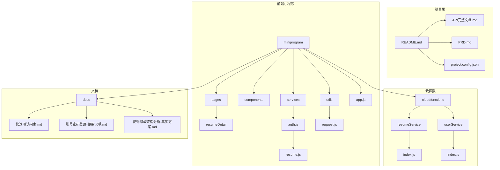
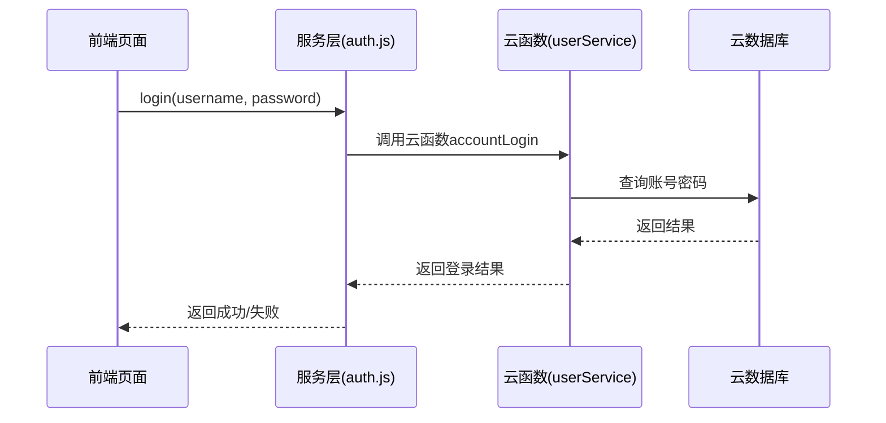

# 开发指南

<cite>
**本文档引用文件**  
- [README.md](file://README.md)
- [app.js](file://miniprogram/app.js)
- [auth.js](file://miniprogram/services/auth.js)
- [request.js](file://miniprogram/utils/request.js)
- [resume.js](file://miniprogram/services/resume.js)
- [resumeDetail/index.js](file://miniprogram/pages/resumeDetail/index.js)
- [login/index.js](file://miniprogram/pages/login/index.js)
- [resumeService/index.js](file://cloudfunctions/resumeService/index.js)
- [userService/index.js](file://cloudfunctions/userService/index.js)
- [快速测试指南.md](file://docs/快速测试指南.md)
- [账号密码登录-使用说明.md](file://docs/账号密码登录-使用说明.md)
- [安得家政架构分析-真实方案.md](file://docs/安得家政架构分析-真实方案.md)
</cite>

## 目录
1. [简介](#简介)
2. [项目结构](#项目结构)
3. [本地开发环境搭建](#本地开发环境搭建)
4. [新手入门教程：扩展简历详情页](#新手入门教程：扩展简历详情页)
5. [代码库结构与编码规范](#代码库结构与编码规范)
6. [云函数与前端服务层分离设计](#云函数与前端服务层分离设计)
7. [调试技巧](#调试技巧)
8. [测试指南](#测试指南)
9. [关键工具链使用说明](#关键工具链使用说明)
10. [贡献指南](#贡献指南)

## 简介

本开发指南旨在为新加入“安得褓贝”项目的开发人员提供全面的实践指导，帮助快速上手并高效参与项目开发。项目基于微信小程序平台，采用微信云开发技术栈，结合独立后端API服务，实现简历管理功能。

项目核心架构采用前后端分离模式，前端通过云函数调用本地业务逻辑或通过HTTP请求访问外部CRM系统API。认证体系复用“安得家政”系统的账号密码登录机制，确保用户数据互通。

本指南将详细介绍环境配置、代码结构、调试方法、测试流程及贡献规范，帮助开发者快速融入团队协作。

## 项目结构

安得褓贝项目采用标准的小程序+云开发架构，整体目录结构清晰，按功能模块划分。



**目录来源**  
- [README.md](file://README.md)
- [project.config.json](file://project.config.json)
- [miniprogram](file://miniprogram)
- [cloudfunctions](file://cloudfunctions)
- [docs](file://docs)

## 本地开发环境搭建

### 安装微信开发者工具

1. 访问[微信开发者工具官网](https://developers.weixin.qq.com/miniprogram/dev/devtools/download.html)下载并安装最新版本。
2. 登录微信账号，选择“小程序”类型创建项目。
3. 选择本地项目路径为 ``，使用现有项目配置（`project.config.json`）。

### 配置项目依赖

项目依赖微信云开发能力，无需手动安装npm包。但需确保以下配置正确：

1. 在微信开发者工具中，点击右上角“云开发”按钮，确保已开通云环境。
2. 检查 `miniprogram/app.js` 中的 `env` 配置是否指向正确的云环境ID。
3. 确保 `project.config.json` 中的 `cloudfunctionRoot` 指向 `cloudfunctions/` 目录。

### 开发者工具设置

为便于开发调试，请进行以下设置：

1. 点击右上角“详情” → “本地设置”
2. ✅ 勾选“不校验合法域名、web-view（业务域名）、TLS 版本以及 HTTPS 证书”
3. ✅ 勾选“启用调试”

此设置允许在本地测试时绕过HTTPS域名限制，特别适用于调用 `https://crm.andejiazheng.com/api` 外部接口。

**配置来源**  
- [app.js](file://miniprogram/app.js#L9)
- [project.config.json](file://project.config.json)
- [快速测试指南.md](file://docs/快速测试指南.md#L16-L23)

## 新手入门教程：扩展简历详情页

本教程将指导您如何在简历详情页添加一个新的信息字段——“服务理念”。

### 步骤 1：修改前端页面显示

打开 `miniprogram/pages/resumeDetail/index.wxml`，在“自我介绍”模块前添加新的信息区块：

```xml
<!-- 服务理念 -->
<view class="section" wx:if="{{detail.servicePhilosophy}}">
  <view class="section-title-with-icon">
    <image class="section-icon" src="/images/icons/lightbulb.svg" mode="aspectFit"></image>
    <text class="section-title-text">服务理念</text>
  </view>
  <view class="section-content">{{detail.servicePhilosophy}}</view>
</view>
```

### 步骤 2：更新数据处理逻辑

在 `miniprogram/pages/resumeDetail/index.js` 的 `loadDetail` 方法中，确保从API响应中提取 `servicePhilosophy` 字段：

```javascript
const detail = {
  // ...其他字段
  servicePhilosophy: data.servicePhilosophy || '',
  // ...后续处理
};
```

### 步骤 3：验证数据来源

检查 `resumeService.getResumeDetailMiniprogram` 接口是否返回该字段。根据 `miniprogram/services/resume.js` 的实现，该接口调用的是公开API `/resumes/public/:id`，需确认后端CRM系统已支持该字段。

### 步骤 4：样式调整

在 `miniprogram/pages/resumeDetail/index.wxss` 中添加对应样式：

```css
.section-title-with-icon {
  display: flex;
  align-items: center;
  margin-bottom: 10px;
}

.section-icon {
  width: 18px;
  height: 18px;
  margin-right: 6px;
}

.section-content {
  font-size: 15px;
  line-height: 1.6;
  color: #333;
  padding: 12px;
  background: #f8f8f8;
  border-radius: 6px;
}
```

完成以上步骤后，重新编译项目，即可在简历详情页看到新增的“服务理念”字段。

**代码来源**  
- [resumeDetail/index.wxml](file://miniprogram/pages/resumeDetail/index.wxml#L194-L200)
- [resumeDetail/index.js](file://miniprogram/pages/resumeDetail/index.js#L253-L362)
- [resume.js](file://miniprogram/services/resume.js#L92-L98)

## 代码库结构与编码规范

### 目录结构说明

| 目录 | 用途 |
|------|------|
| `miniprogram/` | 小程序前端代码 |
| `miniprogram/pages/` | 页面逻辑与视图 |
| `miniprogram/components/` | 可复用组件 |
| `miniprogram/services/` | 业务服务层，封装API调用 |
| `miniprogram/utils/` | 工具函数 |
| `cloudfunctions/` | 云函数代码 |
| `docs/` | 项目文档 |

### 编码规范

1. **JavaScript规范**：
   - 使用ES6+语法
   - 函数命名采用驼峰式（camelCase）
   - 常量使用大写字母和下划线（UPPER_CASE）
   - 注释使用JSDoc风格

2. **WXML规范**：
   - 标签属性按字母顺序排列
   - 使用语义化class名称
   - 避免内联样式

3. **WXSS规范**：
   - 使用BEM命名法
   - 样式按模块组织
   - 避免!important

4. **文件组织**：
   - 每个页面独立目录
   - 服务层按功能拆分
   - 工具函数按类型归类

**结构来源**  
- [项目结构](file://)
- [app.js](file://miniprogram/app.js)
- [services](file://miniprogram/services)
- [utils](file://miniprogram/utils)

## 云函数与前端服务层分离设计

项目采用清晰的分层架构，将云函数与前端服务层明确分离，职责分明。

### 前端服务层（Services）

位于 `miniprogram/services/` 目录，负责：

- 封装业务逻辑
- 调用底层请求工具
- 数据格式转换
- 错误处理

例如 `auth.js` 提供统一的认证接口：

```javascript
module.exports = {
  login,
  getCurrentUser,
  validateToken,
  saveAuthData,
  getLocalUserInfo,
  getLocalToken,
  isLoggedIn,
  logout
};
```

### 云函数层（Cloud Functions）

位于 `cloudfunctions/` 目录，提供：

- 数据库操作
- 业务逻辑处理
- 权限验证
- 与外部系统交互

如 `userService/index.js` 中的 `accountLogin` 函数处理账号密码登录逻辑。

### 分离优势

1. **职责分离**：前端专注UI交互，云函数专注数据处理
2. **可维护性**：逻辑变更只需修改对应层
3. **可测试性**：各层可独立测试
4. **安全性**：敏感逻辑在云端执行



**设计来源**  
- [auth.js](file://miniprogram/services/auth.js)
- [userService/index.js](file://cloudfunctions/userService/index.js)
- [resume.js](file://miniprogram/services/resume.js)

## 调试技巧

### 使用云开发控制台调试数据库

1. 打开微信开发者工具，点击“云开发”按钮
2. 进入“数据库”标签页
3. 选择 `resumes` 集合查看简历数据
4. 可直接编辑、删除、新增记录
5. 使用查询语句测试筛选条件：
   ```json
   {"status": "published", "city": {"$regex": "北京"}}
   ```

### 在开发者工具中查看云函数日志

1. 在“云开发”面板中选择“云函数”
2. 找到目标函数（如 `userService`）
3. 点击“日志”按钮查看执行记录
4. 可查看详细的输入参数、执行时间和返回结果
5. 错误日志会红色高亮显示

### 前端调试技巧

1. **Console日志**：
   - `auth.js` 中使用 `console.log` 输出认证流程
   - `request.js` 中记录API请求与响应

2. **网络请求监控**：
   - 在开发者工具“Network”标签查看所有HTTP请求
   - 特别关注对 `crm.andejiazheng.com` 的请求

3. **本地存储检查**：
   - 在“Storage”标签查看 `access_token` 和 `userInfo`
   - 可手动清除Token测试登录过期逻辑

4. **页面栈调试**：
   - 使用 `getCurrentPages()` 查看页面导航历史
   - 在 `resumeDetail` 页面中利用上一页数据预加载视频

**调试来源**  
- [auth.js](file://miniprogram/services/auth.js#L15)
- [request.js](file://miniprogram/utils/request.js#L25)
- [云开发控制台](https://developers.weixin.qq.com/miniprogram/dev/wxcloud/basis/getting-started.html)

## 测试指南

### 功能测试

参考 `docs/快速测试指南.md` 进行系统性测试：

1. **账号密码登录测试**：
   - 输入有效账号密码，验证是否成功登录
   - 检查控制台日志是否显示 `🔐 开始账号密码登录`
   - 验证是否跳转到首页

2. **Token验证测试**：
   - 登录后退出并重新进入登录页
   - 验证是否自动跳转（Token有效）
   - 检查日志是否显示 `✅ Token 有效`

3. **Token过期处理**：
   - 手动清除 `access_token`
   - 访问需要登录的页面
   - 验证是否提示“登录已过期”并跳转

### 接口测试

使用微信开发者工具的“云函数”功能直接测试：

1. **测试 resumeService.list 接口**：
   ```json
   {
     "action": "list",
     "page": 0,
     "pageSize": 10
   }
   ```
   验证返回的简历列表数据。

2. **测试 userService.accountLogin 接口**：
   ```json
   {
     "action": "accountLogin",
     "username": "test",
     "password": "123456"
   }
   ```
   验证登录逻辑和权限控制。

### 自动化测试建议

虽然当前项目未配置自动化测试框架，但建议未来引入：

- 使用 Jest 进行单元测试
- 使用 Puppeteer 进行E2E测试
- 在 `docs` 目录下维护测试用例文档

**测试来源**  
- [快速测试指南.md](file://docs/快速测试指南.md)
- [账号密码登录-使用说明.md](file://docs/账号密码登录-使用说明.md)
- [resumeService/index.js](file://cloudfunctions/resumeService/index.js)

## 关键工具链使用说明

### request.js：统一请求封装

位于 `miniprogram/utils/request.js`，提供三种请求方式：

1. **publicRequest**：公开请求，无需认证
   ```javascript
   publicRequest({
     url: '/auth/login',
     method: 'POST',
     data: { username, password }
   })
   ```

2. **authenticatedRequest**：认证请求，自动携带Token
   ```javascript
   authenticatedRequest({
     url: '/auth/me',
     method: 'GET'
   })
   ```

3. **request**：智能请求，根据Token存在自动选择
   ```javascript
   request({ url: '/some/api' })
   ```

**特性**：
- 统一错误处理
- 自动JSON解析
- 请求日志记录
- Token过期自动跳转

### auth.js：认证逻辑

位于 `miniprogram/services/auth.js`，封装完整的认证流程：

- `login()`：账号密码登录
- `validateToken()`：验证Token有效性
- `saveAuthData()`：保存认证数据（双键存储）
- `isLoggedIn()`：检查是否已登录
- `logout()`：登出并清除数据

采用双键存储策略（`access_token`/`token`，`userInfo`/`user_info`）提高兼容性。

**工具来源**  
- [request.js](file://miniprogram/utils/request.js)
- [auth.js](file://miniprogram/services/auth.js)
- [安得家政架构分析-真实方案.md](file://docs/安得家政架构分析-真实方案.md)

## 贡献指南

### 代码提交流程

1. 从 `main` 分支拉取最新代码
2. 创建功能分支：`feature/功能描述`
3. 完成开发并自测
4. 提交PR到 `main` 分支
5. 等待代码审查

### 分支管理策略

- `main`：生产环境分支，受保护
- `develop`：开发集成分支
- `feature/*`：功能开发分支
- `hotfix/*`：紧急修复分支

### 代码审查标准

1. **代码质量**：
   - 符合编码规范
   - 有适当注释
   - 无冗余代码

2. **功能完整性**：
   - 实现需求功能
   - 包含边界情况处理
   - 有相应测试

3. **性能与安全**：
   - 无明显性能问题
   - 敏感逻辑在云端处理
   - 输入参数有校验

4. **文档更新**：
   - 更新相关文档
   - 添加必要的注释

### 最佳实践

- 提交前确保通过所有测试
- 保持提交原子性（每个提交只做一件事）
- 编写清晰的提交信息
- 及时同步主干变更

**贡献来源**  
- [README.md](file://README.md)
- 项目协作惯例
- 行业最佳实践