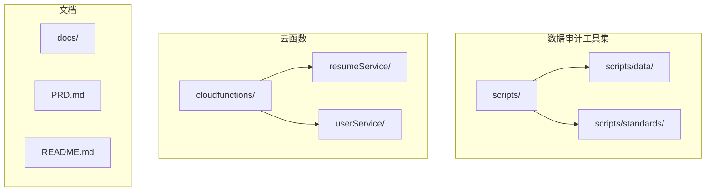
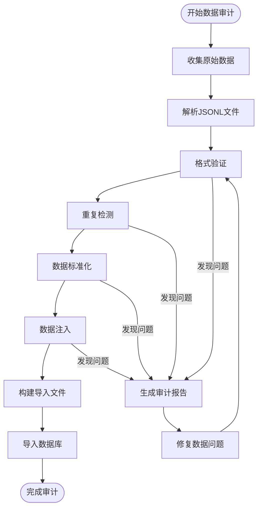
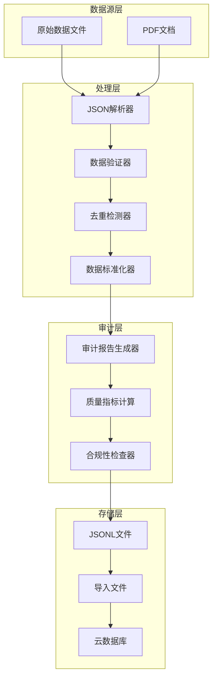
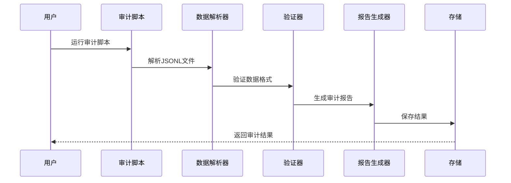
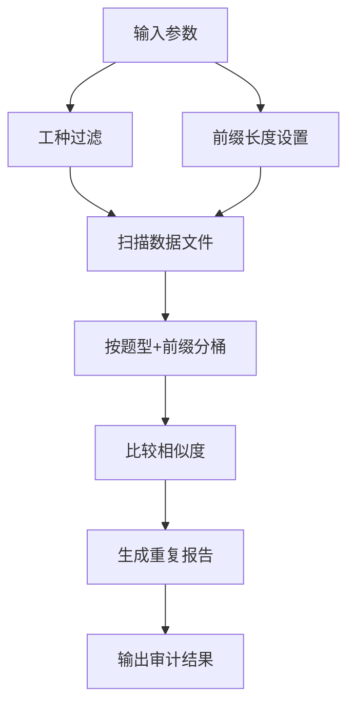
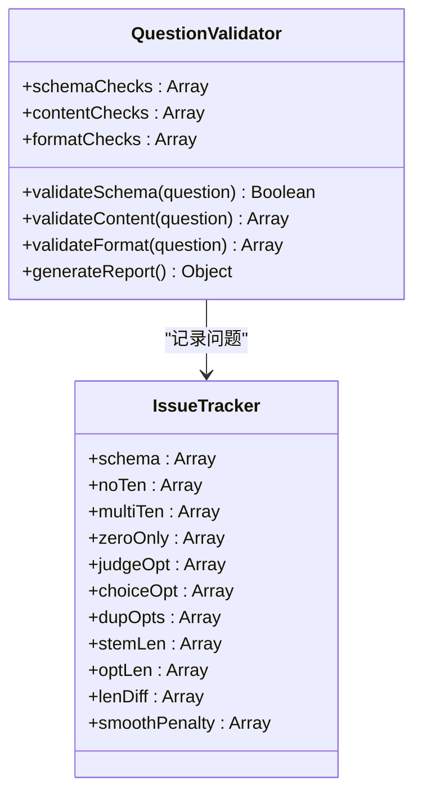
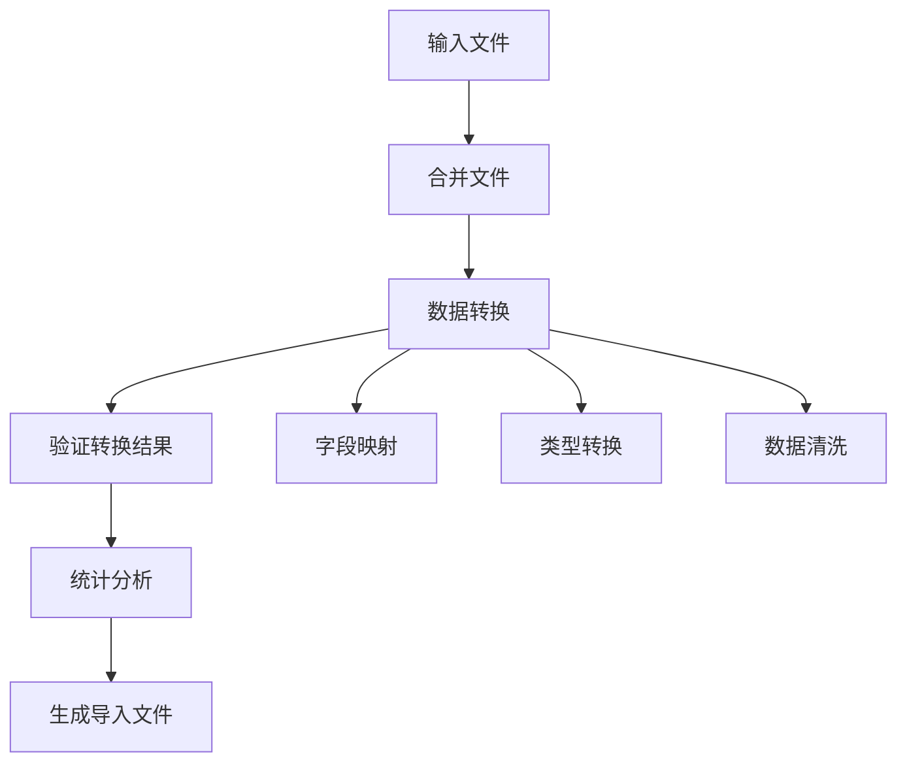
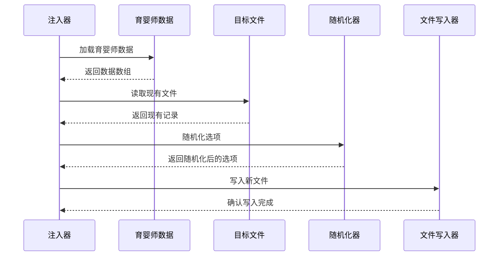
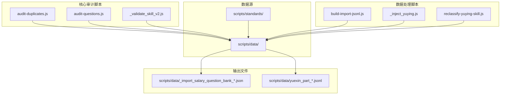
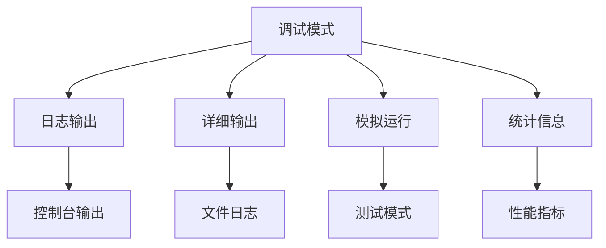

# 数据审计工具

<cite>
**本文档引用的文件**
- [README.md](file://README.md)
- [PRD.md](file://PRD.md)
- [audit-duplicates.js](file://scripts/audit-duplicates.js)
- [audit-questions.js](file://scripts/audit-questions.js)
- [build-import-jsonl.js](file://scripts/build-import-jsonl.js)
- [_validate_skill_v2.js](file://scripts/_validate_skill_v2.js)
- [_inject_yuying.js](file://scripts/_inject_yuying.js)
- [reclassify-yuying-skill.js](file://scripts/reclassify-yuying-skill.js)
- [_extract_pdf.py](file://scripts/standards/_extract_pdf.py)
- [_merge_yuexin_manual_release_v3.py](file://scripts/standards/_merge_yuexin_manual_release_v3.py)
- [yuexin_part_01_hardware.jsonl](file://scripts/data/yuexin_part_01_hardware.jsonl)
- [_import_salary_question_bank_yuexin.json](file://scripts/data/_import_salary_question_bank_yuexin.json)
- [index.js](file://cloudfunctions/resumeService/index.js)
- [index.js](file://cloudfunctions/userService/index.js)
</cite>

## 目录
1. [简介](#简介)
2. [项目结构](#项目结构)
3. [核心组件](#核心组件)
4. [架构概览](#架构概览)
5. [详细组件分析](#详细组件分析)
6. [依赖关系分析](#依赖关系分析)
7. [性能考虑](#性能考虑)
8. [故障排除指南](#故障排除指南)
9. [结论](#结论)

## 简介

安得褓贝项目包含一套完整的数据审计工具集，专门用于管理和验证工资测评题库数据的质量和一致性。该项目基于微信云开发平台构建，提供了从数据收集、验证、去重检测到最终导入的一站式解决方案。

项目的核心功能包括：
- **数据质量审计**：检查题库数据的完整性、一致性和规范性
- **重复数据检测**：识别和报告潜在的数据重复问题
- **格式验证**：确保数据符合预定义的结构和约束
- **数据标准化**：将分散的数据源整合为统一格式
- **自动化导入**：支持批量数据导入到云数据库

## 项目结构

项目采用模块化组织结构，主要分为以下几个部分：

**图表来源**
- [PRD.md:1-353](file://PRD.md#L1-L353)
- [README.md:1-13](file://README.md#L1-L13)

### 数据文件组织

数据文件按照工种和类型进行分类存储：

| 文件类型 | 描述 | 数量 |
|---------|------|------|
| yuexin_part_* | 月嫂技能题库分批文件 | 12个 |
| yuying_part_* | 育婴师技能题库分批文件 | 13个 |
| baomu_part_* | 保姆技能题库分批文件 | 14个 |
| huli_part_* | 护理员技能题库分批文件 | 14个 |

**章节来源**
- [PRD.md:202-353](file://PRD.md#L202-L353)

## 核心组件

### 数据审计脚本

项目包含多个专门的数据审计脚本，每个脚本负责特定的审计任务：

#### 重复数据检测工具
- **audit-duplicates.js**：检测题库中的重复数据
- **audit-questions.js**：检查题库数据的完整性

#### 数据验证工具
- **_validate_skill_v2.js**：验证技能题库的学术格式
- **reclassify-yuying-skill.js**：重新分类育婴师技能题目

#### 数据标准化工具
- **build-import-jsonl.js**：构建可导入的JSON文件
- **_inject_yuying.js**：注入育婴师技能数据

**章节来源**
- [audit-duplicates.js:1-63](file://scripts/audit-duplicates.js#L1-L63)
- [audit-questions.js:1-55](file://scripts/audit-questions.js#L1-L55)
- [_validate_skill_v2.js:1-110](file://scripts/_validate_skill_v2.js#L1-L110)

### 数据处理管道

**图表来源**
- [build-import-jsonl.js:1-93](file://scripts/build-import-jsonl.js#L1-L93)
- [audit-duplicates.js:1-63](file://scripts/audit-duplicates.js#L1-L63)

## 架构概览

### 整体架构设计

**图表来源**
- [scripts/standards/_extract_pdf.py:1-28](file://scripts/standards/_extract_pdf.py#L1-L28)
- [scripts/standards/_merge_yuexin_manual_release_v3.py:1-94](file://scripts/standards/_merge_yuexin_manual_release_v3.py#L1-L94)

### 数据流处理

**图表来源**
- [audit-questions.js:1-55](file://scripts/audit-questions.js#L1-L55)
- [audit-duplicates.js:1-63](file://scripts/audit-duplicates.js#L1-L63)

## 详细组件分析

### 重复数据检测组件

#### audit-duplicates.js 分析

该组件实现了智能的重复数据检测机制：

**图表来源**
- [audit-duplicates.js:21-58](file://scripts/audit-duplicates.js#L21-L58)

**章节来源**
- [audit-duplicates.js:1-63](file://scripts/audit-duplicates.js#L1-L63)

#### 审计报告生成

组件支持多种审计维度：
- **题干相似度检测**：基于前N字符的精确匹配
- **题型一致性检查**：确保相同题型的题目具有相似内容
- **文件来源追踪**：记录重复数据的具体来源文件
- **统计汇总**：提供整体重复率和各工种的重复情况

### 数据质量验证组件

#### audit-questions.js 分析

该组件提供了全面的数据质量检查功能：

**图表来源**
- [audit-questions.js:7-44](file://scripts/audit-questions.js#L7-L44)

**章节来源**
- [audit-questions.js:1-55](file://scripts/audit-questions.js#L1-L55)

#### 质量检查维度

组件涵盖以下质量检查维度：

| 检查类型 | 检查内容 | 预期标准 |
|---------|----------|----------|
| Schema检查 | 字段完整性 | 必填字段齐全 |
| 选项检查 | 选项数量和内容 | 选项唯一性、数量正确 |
| 分数检查 | 分值分配 | 合理的分数分布 |
| 内容检查 | 题干和选项长度 | 符合长度限制 |
| 一致性检查 | 选项文本一致性 | 避免重复和歧义 |

### 数据标准化组件

#### build-import-jsonl.js 分析

该组件实现了数据标准化和导入文件生成：

**图表来源**
- [build-import-jsonl.js:33-66](file://scripts/build-import-jsonl.js#L33-L66)

**章节来源**
- [build-import-jsonl.js:1-93](file://scripts/build-import-jsonl.js#L1-L93)

#### 标准化流程

组件执行以下标准化步骤：
1. **字段对齐**：确保所有记录具有相同的字段结构
2. **类型转换**：将文本数据转换为正确的数据类型
3. **数据清洗**：去除无效字符和格式问题
4. **统计分析**：生成数据分布统计信息
5. **格式输出**：生成符合云开发导入要求的JSON文件

### 数据注入组件

#### _inject_yuying.js 分析

该组件专门用于注入育婴师技能数据：

**图表来源**
- [_inject_yuying.js:116-142](file://scripts/_inject_yuying.js#L116-L142)

**章节来源**
- [_inject_yuying.js:1-143](file://scripts/_inject_yuying.js#L1-L143)

## 依赖关系分析

### 脚本间依赖关系

**图表来源**
- [audit-duplicates.js:13-24](file://scripts/audit-duplicates.js#L13-L24)
- [audit-questions.js:4-5](file://scripts/audit-questions.js#L4-L5)

### 数据依赖关系

项目中的数据文件存在以下依赖关系：

| 文件 | 依赖文件 | 用途 |
|------|----------|------|
| _import_salary_question_bank_yuexin.json | yuexin_part_*.jsonl | 合并后的导入文件 |
| yuexin_part_*.jsonl | 标准化后的数据文件 | 分批存储的原始数据 |
| _extract_pdf.py | PDF文档 | 从PDF提取文本内容 |
| _merge_yuexin_manual_release_v3.py | 多个JSONL文件 | 合并和标准化数据 |

**章节来源**
- [_merge_yuexin_manual_release_v3.py:7-24](file://scripts/standards/_merge_yuexin_manual_release_v3.py#L7-L24)

## 性能考虑

### 批处理优化

审计工具采用了高效的批处理策略：

1. **内存管理**：使用流式处理避免大文件内存溢出
2. **并行处理**：多文件并行解析提高处理速度
3. **增量处理**：支持增量审计减少重复计算
4. **缓存机制**：对重复使用的数据进行缓存

### 处理效率优化

- **索引构建**：使用哈希表快速查找重复数据
- **批量写入**：减少磁盘I/O操作次数
- **错误恢复**：支持断点续传和错误恢复
- **进度监控**：实时显示处理进度和状态

## 故障排除指南

### 常见问题及解决方案

#### 数据解析错误
**问题**：JSON解析失败
**解决方案**：
1. 检查JSON格式是否正确
2. 验证文件编码格式
3. 确认文件完整性

#### 权限不足错误
**问题**：文件读写权限不足
**解决方案**：
1. 检查文件权限设置
2. 确认运行用户权限
3. 修改文件所有权

#### 内存不足错误
**问题**：处理大文件时内存溢出
**解决方案**：
1. 分批处理大文件
2. 增加系统内存
3. 优化数据结构

### 调试工具

项目提供了多种调试和监控工具：

**章节来源**
- [audit-duplicates.js:60-63](file://scripts/audit-duplicates.js#L60-L63)
- [audit-questions.js:47-54](file://scripts/audit-questions.js#L47-L54)

## 结论

安得褓贝项目的数据审计工具集提供了一套完整、高效的数据质量管理解决方案。通过模块化的架构设计和自动化的工作流程，该工具集能够：

1. **全面覆盖**：从数据收集到质量保证的全流程覆盖
2. **高效处理**：支持大规模数据的快速处理和分析
3. **灵活扩展**：模块化设计便于功能扩展和定制
4. **易于使用**：提供清晰的接口和详细的错误报告

这些工具不仅提高了数据质量，还为后续的数据分析和业务应用奠定了坚实的基础。通过持续的使用和改进，这套工具集将成为项目数据治理的重要组成部分。