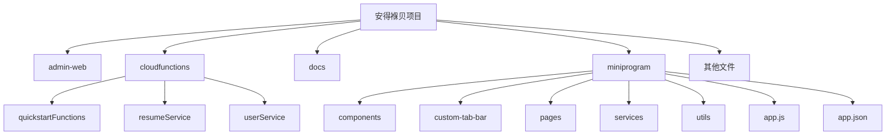
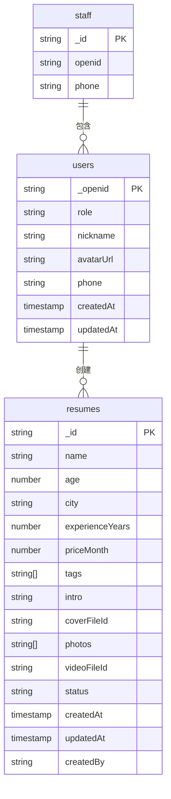
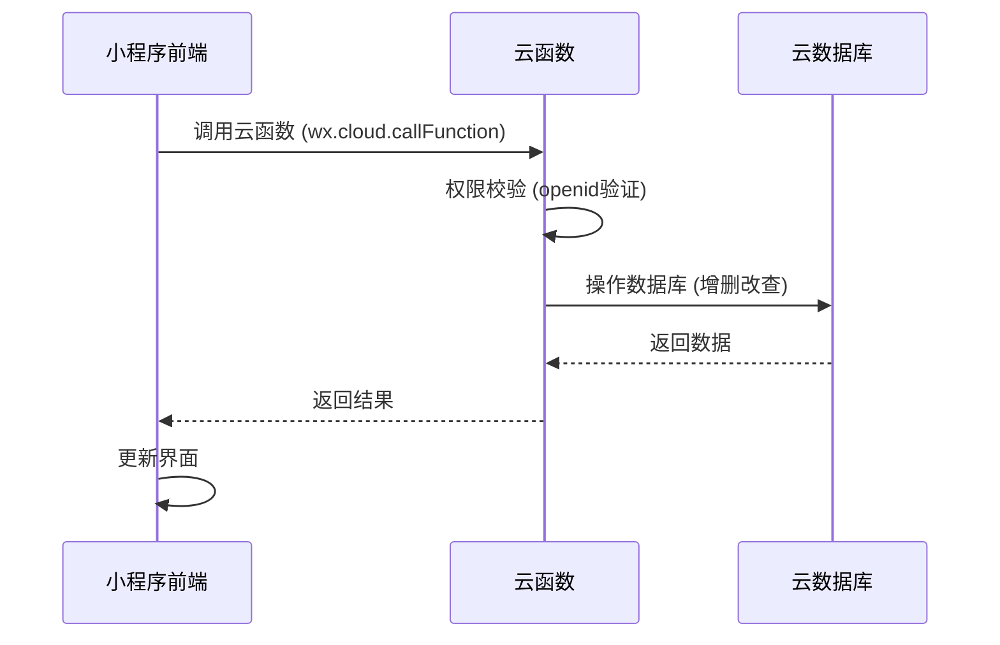
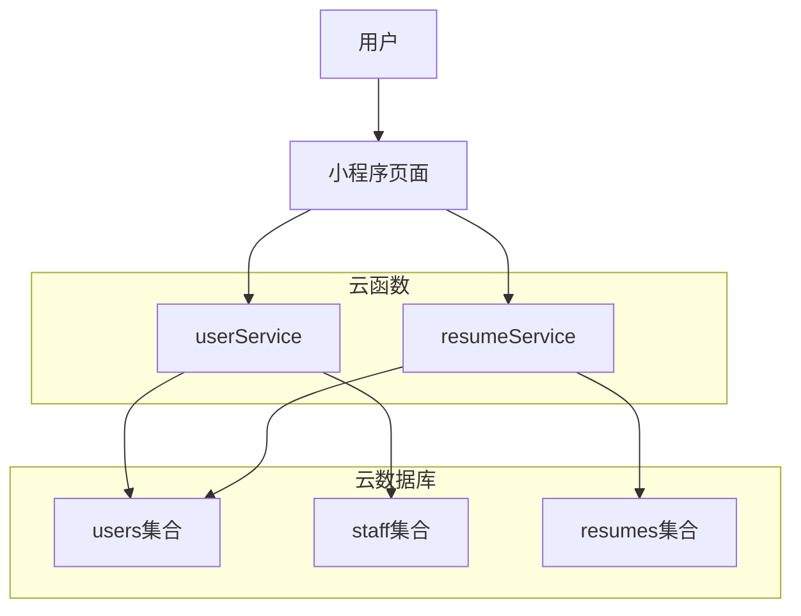
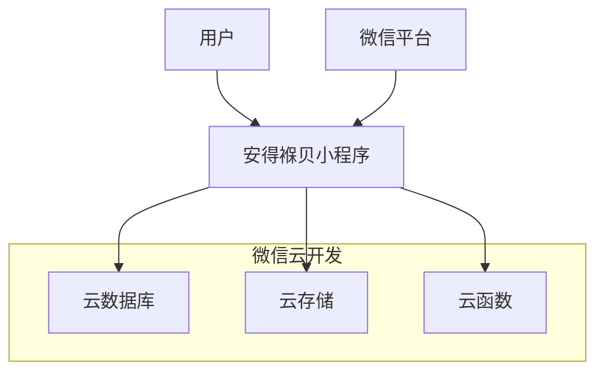
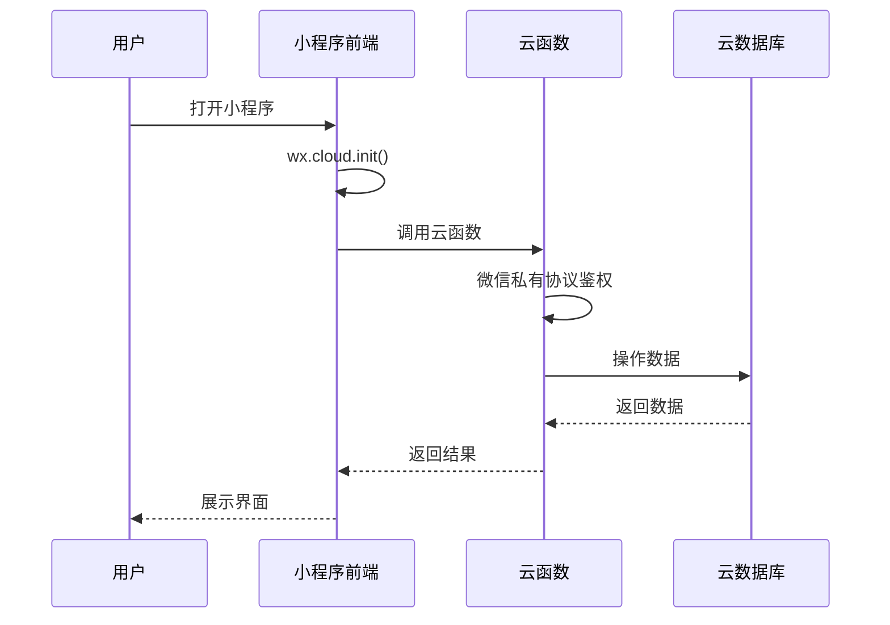

# 技术架构

<cite>
**本文档引用文件**  
- [app.js](file://miniprogram/app.js)
- [userService/index.js](file://cloudfunctions/userService/index.js)
- [resumeService/index.js](file://cloudfunctions/resumeService/index.js)
- [auth.js](file://miniprogram/services/auth.js)
- [resume.js](file://miniprogram/services/resume.js)
- [request.js](file://miniprogram/utils/request.js)
- [login/index.js](file://miniprogram/pages/login/index.js)
- [resumeList/index.js](file://miniprogram/pages/resumeList/index.js)
- [app.json](file://miniprogram/app.json)
- [userService/config.json](file://cloudfunctions/userService/config.json)
- [resumeService/config.json](file://cloudfunctions/resumeService/config.json)
- [README.md](file://README.md)
</cite>

## 目录
1. [引言](#引言)
2. [项目结构](#项目结构)
3. [MVC架构实现](#mvc架构实现)
4. [数据流路径](#数据流路径)
5. [前后端分离设计](#前后端分离设计)
6. [系统组件关系](#系统组件关系)
7. [微信云开发SDK依赖](#微信云开发sdk依赖)
8. [系统上下文图](#系统上下文图)
9. [组件交互图](#组件交互图)
10. [架构权衡](#架构权衡)

## 引言
安得褓贝是一个基于微信小程序的家政服务管理平台，采用MVC（Model-View-Controller）架构模式，利用微信云开发技术栈实现快速开发和部署。本技术架构文档详细描述了系统的MVC模式实现方式、数据流路径、前后端分离设计、系统组件关系以及架构权衡。

## 项目结构
安得褓贝项目采用典型的微信小程序云开发项目结构，主要分为以下几个部分：

- **admin-web/**：管理后台相关配置和部署脚本
- **cloudfunctions/**：云函数目录，包含多个云函数模块
- **docs/**：文档目录，包含各种说明文档
- **miniprogram/**：小程序前端代码
- **其他文件**：项目配置和说明文件

**Diagram sources**
- [app.js](file://miniprogram/app.js)
- [app.json](file://miniprogram/app.json)

**Section sources**
- [app.js](file://miniprogram/app.js)
- [app.json](file://miniprogram/app.json)

## MVC架构实现
安得褓贝系统采用MVC（Model-View-Controller）架构模式，将应用程序分为三个核心组件：Model（模型）、View（视图）和Controller（控制器），实现了关注点分离和代码组织的清晰性。

### Model层
Model层由微信云开发的云数据库构成，包含三个核心集合：users、staff和resumes。这些集合存储了系统的核心数据，通过云数据库的JSON文档型结构进行数据管理。

- **users集合**：存储用户基本信息，包括用户角色（客户或员工）、昵称、头像、手机号等
- **staff集合**：作为员工白名单，用于权限判定，包含员工的openid和手机号
- **resumes集合**：存储阿姨简历的主体数据，包括姓名、年龄、经验、技能标签、自我介绍、封面图片、相册和视频等

**Diagram sources**
- [userService/index.js](file://cloudfunctions/userService/index.js#L10-L24)
- [resumeService/index.js](file://cloudfunctions/resumeService/index.js#L18-L23)

**Section sources**
- [userService/index.js](file://cloudfunctions/userService/index.js)
- [resumeService/index.js](file://cloudfunctions/resumeService/index.js)

### View层
View层由小程序的WXML和WXSS页面组件构成，负责用户界面的展示和用户交互。小程序页面采用组件化设计，每个页面由WXML（WeiXin Markup Language）定义结构，WXSS（WeiXin Style Sheet）定义样式。

View层的主要特点包括：
- 使用WXML进行页面结构定义，支持数据绑定和事件处理
- 使用WXSS进行样式定义，支持类似CSS的语法
- 采用组件化设计，提高代码复用性和可维护性
- 支持自定义组件，如cloudTipModal和job-type-icon

### Controller层
Controller层由云函数构成，负责处理业务逻辑和数据操作。系统包含两个核心云函数模块：userService和resumeService，分别处理用户相关和简历相关的业务逻辑。

- **userService云函数**：处理用户认证、用户信息获取和更新、手机号登录等用户相关业务
- **resumeService云函数**：处理简历的增删改查、列表查询、详情获取等简历相关业务

云函数作为Controller层的核心，接收来自View层的请求，进行权限校验后操作Model层的数据，并将结果返回给View层。

## 数据流路径
安得褓贝系统的数据流路径清晰地展示了前端与后端之间的交互过程。小程序前端通过Taro框架或原生API调用云函数，经权限校验后操作数据库并返回结果。

数据流路径如下：
1. 小程序前端发起请求，调用云函数
2. 云函数接收到请求，进行权限校验
3. 通过微信云开发SDK操作云数据库
4. 数据库返回操作结果
5. 云函数将结果返回给前端
6. 前端根据结果更新界面

**Diagram sources**
- [login/index.js](file://miniprogram/pages/login/index.js#L72-L76)
- [userService/index.js](file://cloudfunctions/userService/index.js#L258-L288)
- [resumeService/index.js](file://cloudfunctions/resumeService/index.js#L180-L215)

**Section sources**
- [login/index.js](file://miniprogram/pages/login/index.js)
- [userService/index.js](file://cloudfunctions/userService/index.js)
- [resumeService/index.js](file://cloudfunctions/resumeService/index.js)

## 前后端分离设计
安得褓贝系统采用前后端分离的设计模式，前端通过云函数接口与后端通信，实现了业务逻辑的解耦。这种设计模式具有以下优势：

- **关注点分离**：前端专注于用户界面和用户体验，后端专注于业务逻辑和数据管理
- **独立开发**：前端和后端可以并行开发，提高开发效率
- **易于维护**：前后端代码分离，便于维护和升级
- **可扩展性**：可以独立扩展前端或后端，适应业务发展

前端通过云函数接口与后端通信，云函数作为API网关，提供了统一的接口供前端调用。前端无需直接操作数据库，所有数据操作都通过云函数进行，确保了数据安全和业务逻辑的一致性。

## 系统组件关系
安得褓贝系统的组件关系清晰地展示了用户、小程序页面、云函数模块和云数据库之间的交互。用户通过小程序页面发起请求，调用userService和resumeService两个核心云函数模块，操作云数据库中的数据。

**Diagram sources**
- [app.js](file://miniprogram/app.js)
- [userService/index.js](file://cloudfunctions/userService/index.js)
- [resumeService/index.js](file://cloudfunctions/resumeService/index.js)

**Section sources**
- [app.js](file://miniprogram/app.js)
- [userService/index.js](file://cloudfunctions/userService/index.js)
- [resumeService/index.js](file://cloudfunctions/resumeService/index.js)

## 微信云开发SDK依赖
安得褓贝系统主要依赖微信云开发SDK，该SDK提供了自动鉴权和无缝集成的优势。微信云开发SDK是微信官方提供的开发工具包，为小程序开发者提供了一站式的后端服务解决方案。

微信云开发SDK的主要优势包括：
- **自动鉴权**：利用微信私有协议天然鉴权，开发者无需实现复杂的认证机制
- **无缝集成**：与小程序开发工具无缝集成，提供一致的开发体验
- **简化开发**：提供了数据库、文件存储、云函数等基础能力，简化了后端开发
- **实时同步**：支持数据的实时同步，提高了应用的响应速度

通过使用微信云开发SDK，安得褓贝系统实现了快速开发和部署，降低了开发成本和维护难度。

## 系统上下文图
系统上下文图展示了安得褓贝系统与外部环境的关系，包括用户、微信平台和云开发资源。

**Diagram sources**
- [app.js](file://miniprogram/app.js)
- [README.md](file://README.md)

**Section sources**
- [app.js](file://miniprogram/app.js)
- [README.md](file://README.md)

## 组件交互图
组件交互图详细展示了安得褓贝系统中各组件之间的交互过程，突出了微信私有协议天然鉴权的特性。

**Diagram sources**
- [app.js](file://miniprogram/app.js#L14-L17)
- [userService/index.js](file://cloudfunctions/userService/index.js#L259-L260)
- [resumeService/index.js](file://cloudfunctions/resumeService/index.js#L181-L182)

**Section sources**
- [app.js](file://miniprogram/app.js)
- [userService/index.js](file://cloudfunctions/userService/index.js)
- [resumeService/index.js](file://cloudfunctions/resumeService/index.js)

## 架构权衡
在选择技术架构时，安得褓贝系统进行了深入的架构权衡，主要考虑了微信云开发带来的优势和潜在风险。

### 优势
- **快速部署**：微信云开发提供了开箱即用的后端服务，大大缩短了开发周期和部署时间
- **低成本**：无需自行搭建和维护服务器，降低了基础设施成本
- **自动扩展**：云开发平台自动处理流量高峰，无需担心服务器负载
- **安全可靠**：基于微信平台的安全机制，提供了可靠的数据保护

### 潜在风险
- **厂商锁定**：系统深度依赖微信云开发平台，迁移到其他平台的成本较高
- **功能限制**：云开发平台的功能可能无法满足所有业务需求，存在功能限制
- **性能瓶颈**：在高并发场景下，云函数的性能可能成为瓶颈
- **成本控制**：随着用户量的增长，云开发的使用成本可能增加

通过权衡这些因素，安得褓贝系统选择了微信云开发作为技术栈，以快速实现产品原型并验证市场。未来可以根据业务发展情况，考虑逐步将部分核心功能迁移到自建服务器，以降低厂商锁定的风险。