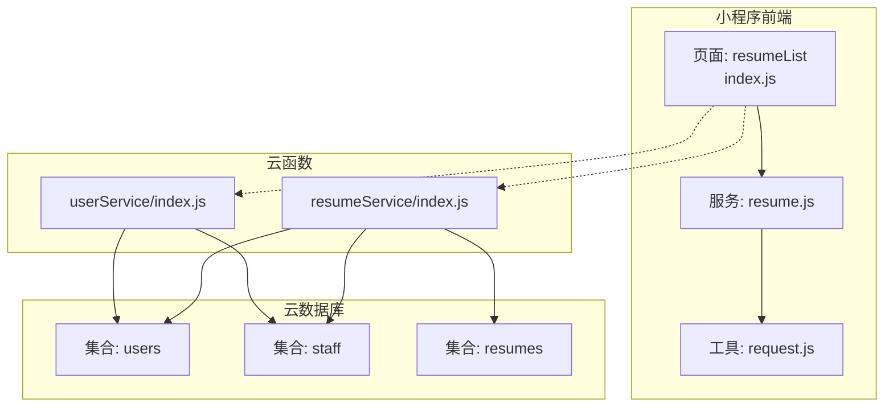
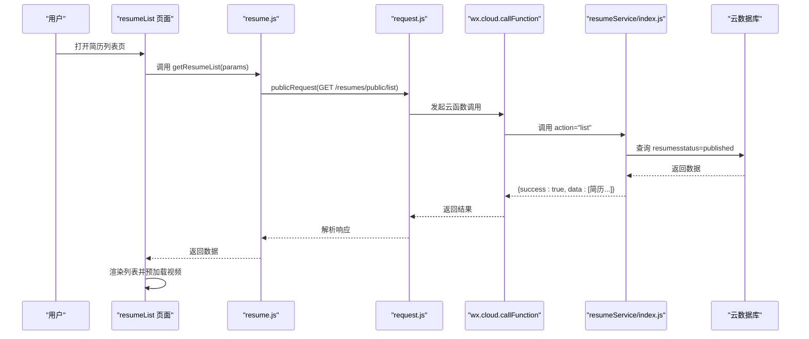
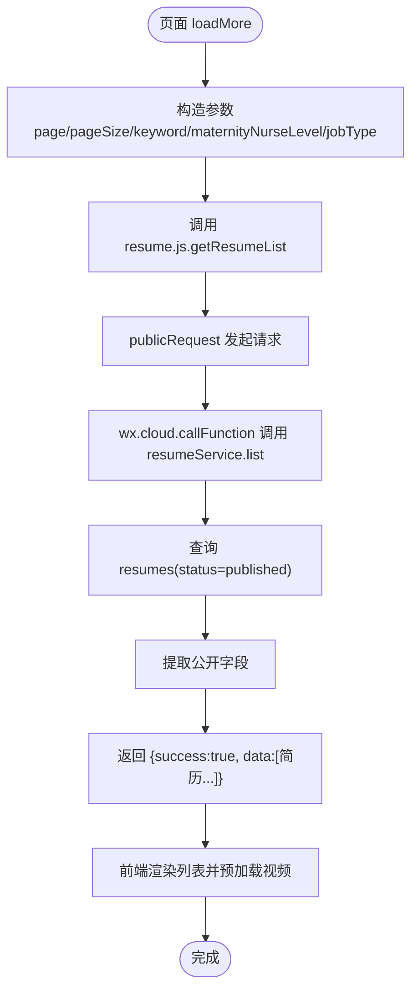
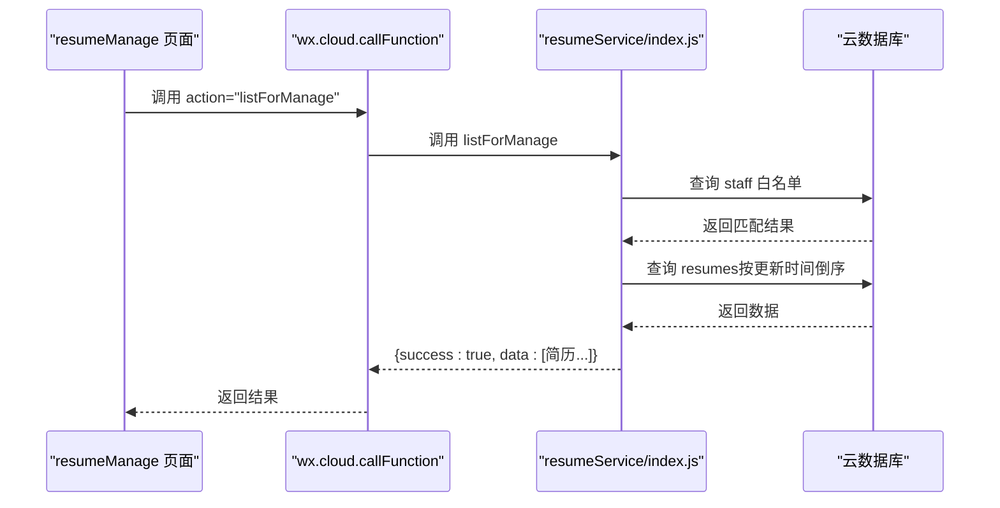
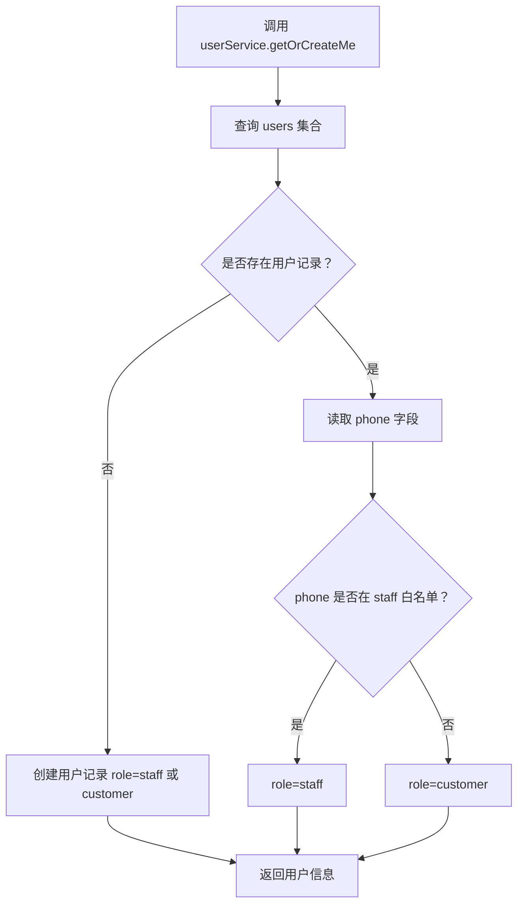
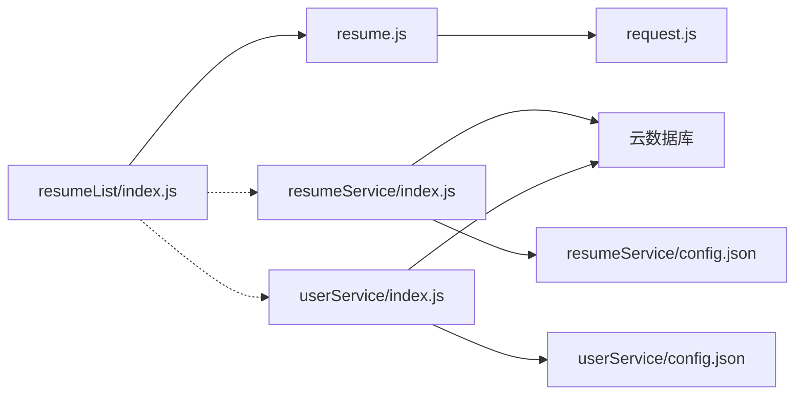

# 数据流

<cite>
**本文引用的文件**
- [miniprogram/services/resume.js](file://miniprogram/services/resume.js)
- [miniprogram/utils/request.js](file://miniprogram/utils/request.js)
- [miniprogram/pages/resumeList/index.js](file://miniprogram/pages/resumeList/index.js)
- [cloudfunctions/resumeService/index.js](file://cloudfunctions/resumeService/index.js)
- [cloudfunctions/userService/index.js](file://cloudfunctions/userService/index.js)
- [miniprogram/pages/admin/resumeManage/index.js](file://miniprogram/pages/admin/resumeManage/index.js)
- [miniprogram/pages/login/index.js](file://miniprogram/pages/login/index.js)
- [cloudfunctions/resumeService/config.json](file://cloudfunctions/resumeService/config.json)
- [cloudfunctions/userService/config.json](file://cloudfunctions/userService/config.json)
- [PRD.md](file://PRD.md)
</cite>

## 目录
1. [简介](#简介)
2. [项目结构](#项目结构)
3. [核心组件](#核心组件)
4. [架构总览](#架构总览)
5. [详细组件分析](#详细组件分析)
6. [依赖关系分析](#依赖关系分析)
7. [性能考量](#性能考量)
8. [故障排查指南](#故障排查指南)
9. [结论](#结论)

## 简介
本文聚焦“安得褓贝”的数据流动路径，从用户在小程序页面发起请求开始，到前端通过封装的 service 层调用云函数，再到云函数在云数据库中执行权限校验与数据操作，最终将结果返回前端。以简历查询为例，完整梳理从 resumeList 页面发起请求，经 resumeService 云函数查询 resumes 集合，返回过滤后的简历列表的链路，并强调微信私有协议在传输过程中的天然鉴权特性及安全性保障。同时提供时序图与关键交互步骤说明，以及实际代码片段路径指引。

## 项目结构
- 前端小程序位于 miniprogram，包含页面、服务层、工具层与云函数调用示例。
- 云函数位于 cloudfunctions，包含 resumeService 与 userService。
- 数据库集合包括 users、staff、resumes 等，分别用于用户信息、员工白名单与简历数据。

图表来源
- [miniprogram/pages/resumeList/index.js](file://miniprogram/pages/resumeList/index.js#L330-L370)
- [miniprogram/services/resume.js](file://miniprogram/services/resume.js#L1-L120)
- [miniprogram/utils/request.js](file://miniprogram/utils/request.js#L1-L125)
- [cloudfunctions/resumeService/index.js](file://cloudfunctions/resumeService/index.js#L1-L120)
- [cloudfunctions/userService/index.js](file://cloudfunctions/userService/index.js#L1-L120)

章节来源
- [miniprogram/pages/resumeList/index.js](file://miniprogram/pages/resumeList/index.js#L330-L370)
- [cloudfunctions/resumeService/index.js](file://cloudfunctions/resumeService/index.js#L1-L120)
- [cloudfunctions/userService/index.js](file://cloudfunctions/userService/index.js#L1-L120)

## 核心组件
- 前端服务层（resume.js）：封装公开与认证接口，构建查询参数，调用工具层发起请求。
- 前端工具层（request.js）：统一处理公开请求与认证请求，自动注入 Authorization 头与客户端标识。
- 云函数（resumeService/index.js）：接收 action 与参数，执行权限校验（基于 staff 白名单），读取/写入云数据库 resumes 集合。
- 云函数（userService/index.js）：负责用户信息与角色判定，支持手机号授权登录与账号密码登录。
- 页面（resumeList/index.js）：组装筛选条件，调用服务层，处理响应并渲染列表。

章节来源
- [miniprogram/services/resume.js](file://miniprogram/services/resume.js#L1-L120)
- [miniprogram/utils/request.js](file://miniprogram/utils/request.js#L1-L125)
- [cloudfunctions/resumeService/index.js](file://cloudfunctions/resumeService/index.js#L180-L216)
- [cloudfunctions/userService/index.js](file://cloudfunctions/userService/index.js#L258-L289)
- [miniprogram/pages/resumeList/index.js](file://miniprogram/pages/resumeList/index.js#L330-L370)

## 架构总览
整体数据流遵循“页面 -> 服务层 -> 工具层 -> 云函数 -> 云数据库”的路径。对于需要权限的操作（如管理端简历列表、创建/更新/删除简历），云函数通过 isStaff 判定调用者是否在 staff 白名单内，从而决定放行或拒绝。

图表来源
- [miniprogram/pages/resumeList/index.js](file://miniprogram/pages/resumeList/index.js#L330-L370)
- [miniprogram/services/resume.js](file://miniprogram/services/resume.js#L1-L120)
- [miniprogram/utils/request.js](file://miniprogram/utils/request.js#L1-L125)
- [cloudfunctions/resumeService/index.js](file://cloudfunctions/resumeService/index.js#L180-L216)

## 详细组件分析

### 组件A：简历查询链路（C端公开列表）
- 页面发起请求：resumeList 页面在 loadMore 中构造分页、关键词、等级与职位类型筛选参数，调用服务层 getResumeList。
- 服务层封装：resume.js 构造查询参数并调用 publicRequest，走公开接口路径。
- 工具层处理：request.js 自动注入 X-Client-Type、X-Platform 等头部，不附加 Authorization。
- 云函数处理：resumeService 接收 action="list"，执行 isStaff 校验（仅管理端需要），此处为公开列表，不强制 staff 权限；按 status=published 查询 resumes，返回公开字段。
- 数据返回：前端解析响应，格式化数据并渲染，同时进行视频预加载优化。

图表来源
- [miniprogram/pages/resumeList/index.js](file://miniprogram/pages/resumeList/index.js#L330-L370)
- [miniprogram/services/resume.js](file://miniprogram/services/resume.js#L1-L120)
- [cloudfunctions/resumeService/index.js](file://cloudfunctions/resumeService/index.js#L78-L106)

章节来源
- [miniprogram/pages/resumeList/index.js](file://miniprogram/pages/resumeList/index.js#L330-L370)
- [miniprogram/services/resume.js](file://miniprogram/services/resume.js#L1-L120)
- [cloudfunctions/resumeService/index.js](file://cloudfunctions/resumeService/index.js#L78-L106)

### 组件B：管理端简历列表（需要 staff 权限）
- 页面调用：admin/resumeManage 页面在 reload 中调用 wx.cloud.callFunction，action="listForManage"。
- 云函数校验：resumeService 在 listForManage 中调用 isStaff，若非 staff 则抛出权限错误。
- 数据返回：返回 resumes 的公开字段列表，供管理端展示。

图表来源
- [miniprogram/pages/admin/resumeManage/index.js](file://miniprogram/pages/admin/resumeManage/index.js#L50-L80)
- [cloudfunctions/resumeService/index.js](file://cloudfunctions/resumeService/index.js#L122-L133)

章节来源
- [miniprogram/pages/admin/resumeManage/index.js](file://miniprogram/pages/admin/resumeManage/index.js#L50-L80)
- [cloudfunctions/resumeService/index.js](file://cloudfunctions/resumeService/index.js#L122-L133)

### 组件C：权限校验与用户角色判定
- 用户登录与角色判定：userService 提供 getOrCreateMe 与 loginByPhone，优先通过手机号判断是否在 staff 白名单，否则回退到 openid 判定。
- 页面保护：admin/resumeManage.ensureStaff 通过 wx.cloud.callFunction 调用 userService.getOrCreateMe，校验 role 是否为 staff，否则提示无权限并跳转。

图表来源
- [cloudfunctions/userService/index.js](file://cloudfunctions/userService/index.js#L49-L84)
- [cloudfunctions/userService/index.js](file://cloudfunctions/userService/index.js#L105-L161)
- [cloudfunctions/userService/index.js](file://cloudfunctions/userService/index.js#L258-L289)

章节来源
- [cloudfunctions/userService/index.js](file://cloudfunctions/userService/index.js#L49-L84)
- [cloudfunctions/userService/index.js](file://cloudfunctions/userService/index.js#L105-L161)
- [cloudfunctions/userService/index.js](file://cloudfunctions/userService/index.js#L258-L289)
- [miniprogram/pages/admin/resumeManage/index.js](file://miniprogram/pages/admin/resumeManage/index.js#L35-L48)

### 组件D：数据库集合与字段约束
- staff（员工白名单）：用于权限判定，包含 openid 等字段。
- resumes（简历）：包含 name、age、city、experienceYears、priceMonth、tags、intro、coverFileId、photos、videoFileId、status、createdAt、updatedAt、createdBy 等字段；仅 status=published 对 C 端可见。
- users（用户）：包含 _openid、phone、role 等字段，role 由 isStaff 动态判定。

章节来源
- [PRD.md](file://PRD.md#L222-L255)
- [cloudfunctions/resumeService/index.js](file://cloudfunctions/resumeService/index.js#L180-L216)
- [cloudfunctions/userService/index.js](file://cloudfunctions/userService/index.js#L49-L84)

## 依赖关系分析
- 前端依赖：
  - resumeList 页面依赖 resume.js 与 request.js。
  - resume.js 依赖 request.js。
- 云函数依赖：
  - resumeService 依赖 wx-server-sdk 与云数据库 API，依赖 users/staff/resumes 集合。
  - userService 依赖 wx-server-sdk 与云数据库 API，依赖 users/staff/accounts 集合。
- 权限配置：
  - resumeService/config.json：开放权限为空。
  - userService/config.json：声明 phonenumber.getPhoneNumber 开放接口。

图表来源
- [miniprogram/pages/resumeList/index.js](file://miniprogram/pages/resumeList/index.js#L330-L370)
- [miniprogram/services/resume.js](file://miniprogram/services/resume.js#L1-L120)
- [miniprogram/utils/request.js](file://miniprogram/utils/request.js#L1-L125)
- [cloudfunctions/resumeService/index.js](file://cloudfunctions/resumeService/index.js#L1-L120)
- [cloudfunctions/userService/index.js](file://cloudfunctions/userService/index.js#L1-L120)
- [cloudfunctions/resumeService/config.json](file://cloudfunctions/resumeService/config.json#L1-L6)
- [cloudfunctions/userService/config.json](file://cloudfunctions/userService/config.json#L1-L6)

章节来源
- [cloudfunctions/resumeService/config.json](file://cloudfunctions/resumeService/config.json#L1-L6)
- [cloudfunctions/userService/config.json](file://cloudfunctions/userService/config.json#L1-L6)

## 性能考量
- 前端列表加载：
  - resumeList 页面在 loadMore 中根据服务端返回的原始条数判断是否还有更多，避免因前端过滤导致提前停止。
  - 列表加载完成后异步预加载视频，采用分批并发与缓存策略，减少首屏等待与重复下载。
- 云函数查询：
  - resumeService 对关键词使用正则模糊匹配，结合 status 与分页限制，避免全表扫描。
  - 返回数据时仅提取公开字段，降低网络传输与前端渲染负担。
- 权限判定：
  - isStaff 优先通过手机号匹配，命中率高且减少二次查询；若无手机号则回退 openid 匹配。

章节来源
- [miniprogram/pages/resumeList/index.js](file://miniprogram/pages/resumeList/index.js#L550-L575)
- [cloudfunctions/resumeService/index.js](file://cloudfunctions/resumeService/index.js#L78-L106)
- [cloudfunctions/resumeService/index.js](file://cloudfunctions/resumeService/index.js#L26-L56)

## 故障排查指南
- 云函数调用失败
  - 检查云函数名称与 data.action 是否正确，确保已上传并部署。
  - 查看云函数日志与返回的 errMsg，定位具体错误原因。
- 权限不足
  - 管理端操作需 staff 权限，确认用户已在 staff 白名单中或已绑定手机号。
- 数据库集合缺失
  - 云函数会在首次运行时尝试创建 users、staff、resumes 等集合；若仍报错，检查环境权限与集合命名。
- 前端鉴权失效
  - request.js 在 401 时会清理本地 token 并跳转登录页；确认登录流程是否正常完成。

章节来源
- [cloudfunctions/resumeService/index.js](file://cloudfunctions/resumeService/index.js#L180-L216)
- [cloudfunctions/userService/index.js](file://cloudfunctions/userService/index.js#L258-L289)
- [miniprogram/utils/request.js](file://miniprogram/utils/request.js#L60-L103)

## 结论
本项目通过清晰的前后端分层与云函数权限校验，实现了从 C 端简历查询到管理端简历维护的完整数据流。微信私有协议在传输过程中提供了天然鉴权能力，结合 staff 白名单与公开字段策略，既保障了安全性，又提升了用户体验。建议在生产环境中持续关注集合权限、索引设计与前端缓存策略，以进一步优化性能与稳定性。