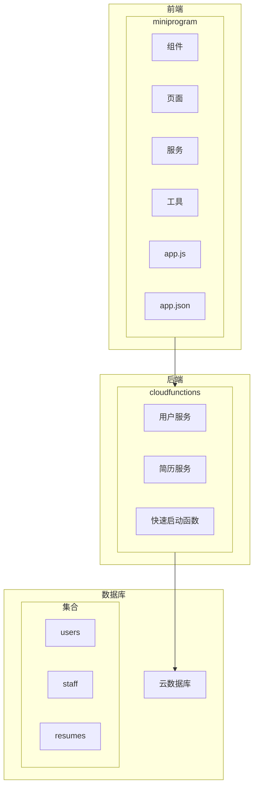
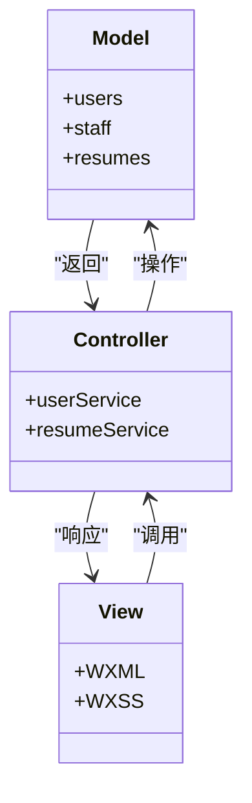
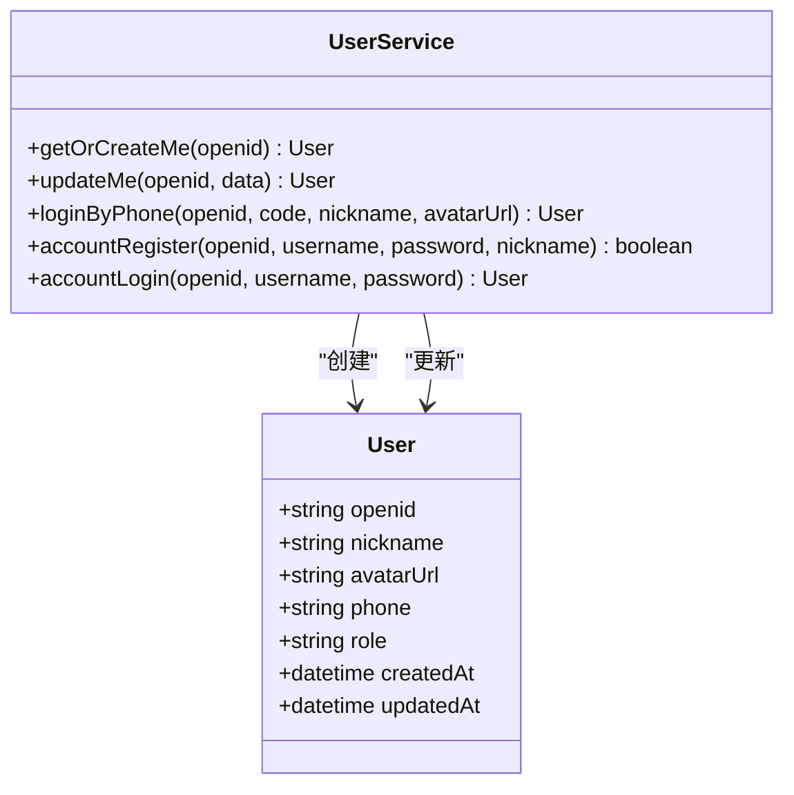
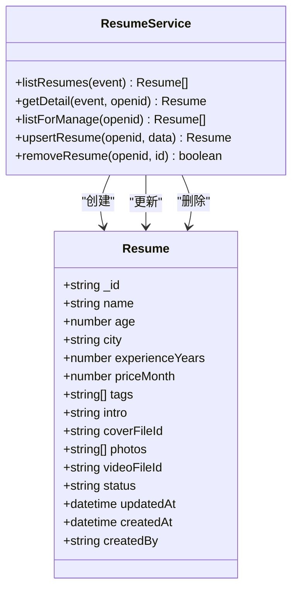
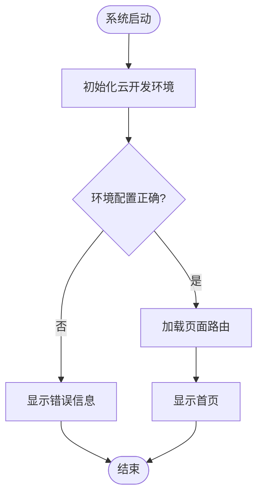

# 整体架构

<cite>
**本文档引用的文件**   
- [app.js](file://miniprogram/app.js)
- [app.json](file://miniprogram/app.json)
- [userService/index.js](file://cloudfunctions/userService/index.js)
- [resumeService/index.js](file://cloudfunctions/resumeService/index.js)
- [auth.js](file://miniprogram/services/auth.js)
- [request.js](file://miniprogram/utils/request.js)
- [login/index.js](file://miniprogram/pages/login/index.js)
- [resumeList/index.js](file://miniprogram/pages/resumeList/index.js)
- [profile/index.js](file://miniprogram/pages/profile/index.js)
- [resume.js](file://miniprogram/services/resume.js)
</cite>

## 目录
1. [简介](#简介)
2. [项目结构](#项目结构)
3. [核心组件](#核心组件)
4. [架构概述](#架构概述)
5. [详细组件分析](#详细组件分析)
6. [依赖分析](#依赖分析)
7. [性能考虑](#性能考虑)
8. [故障排除指南](#故障排除指南)
9. [结论](#结论)

## 简介
安得褓贝是一款基于微信云开发的全栈MVC架构的小程序，旨在提供月嫂和育婴师简历的展示与管理服务。该系统采用前后端分离设计，前端通过微信小程序实现，后端利用微信云开发提供的云函数、云数据库和云存储能力。本文档将详细描述系统的整体架构，重点介绍Model层、View层和Controller层的设计与实现，以及系统初始化流程和导航机制。

## 项目结构
安得褓贝的项目结构清晰，分为多个目录，每个目录负责不同的功能模块。主要目录包括`admin-web`、`cloudfunctions`、`docs`、`miniprogram`等。`miniprogram`目录包含小程序的前端代码，`cloudfunctions`目录包含云函数的后端代码，`docs`目录包含项目文档。

**图源**
- [app.js](file://miniprogram/app.js)
- [app.json](file://miniprogram/app.json)
- [userService/index.js](file://cloudfunctions/userService/index.js)
- [resumeService/index.js](file://cloudfunctions/resumeService/index.js)

**节源**
- [app.js](file://miniprogram/app.js)
- [app.json](file://miniprogram/app.json)
- [userService/index.js](file://cloudfunctions/userService/index.js)
- [resumeService/index.js](file://cloudfunctions/resumeService/index.js)

## 核心组件
安得褓贝的核心组件包括用户服务（userService）和简历服务（resumeService），这两个云函数模块分别处理用户管理和简历管理的业务逻辑。此外，前端通过`wx.cloud.callFunction`调用这些云函数接口，实现前后端的解耦。

**节源**
- [userService/index.js](file://cloudfunctions/userService/index.js)
- [resumeService/index.js](file://cloudfunctions/resumeService/index.js)

## 架构概述
安得褓贝采用MVC架构模式，其中Model层由云数据库中的`users`、`staff`、`resumes`三个核心集合构成，View层由小程序原生WXML/WXSS组件实现，Controller层通过`userService`和`resumeService`两个云函数模块处理业务逻辑。前后端分离设计使得前端通过`wx.cloud.callFunction`调用云函数接口，实现解耦。

**图源**
- [userService/index.js](file://cloudfunctions/userService/index.js)
- [resumeService/index.js](file://cloudfunctions/resumeService/index.js)

## 详细组件分析
### 用户服务分析
用户服务（userService）负责处理用户相关的业务逻辑，包括用户信息的获取、创建和更新。该服务通过`wx.cloud.callFunction`调用云函数，实现用户信息的管理。

#### 用户服务类图

**图源**
- [userService/index.js](file://cloudfunctions/userService/index.js)

### 简历服务分析
简历服务（resumeService）负责处理简历相关的业务逻辑，包括简历的创建、读取、更新和删除。该服务通过`wx.cloud.callFunction`调用云函数，实现简历信息的管理。

#### 简历服务类图

**图源**
- [resumeService/index.js](file://cloudfunctions/resumeService/index.js)

### 系统初始化流程
系统初始化流程从`app.js`中的`onLaunch`方法开始，通过`wx.cloud.init`初始化云开发环境。`app.json`中的页面路由结构定义了小程序的页面导航。

#### 系统初始化流程图

**图源**
- [app.js](file://miniprogram/app.js)
- [app.json](file://miniprogram/app.json)

**节源**
- [app.js](file://miniprogram/app.js)
- [app.json](file://miniprogram/app.json)

## 依赖分析
安得褓贝的依赖关系主要体现在前端与云函数之间的调用，以及云函数与云数据库之间的交互。前端通过`wx.cloud.callFunction`调用云函数，云函数通过`wx-server-sdk`操作云数据库。

**图源**
- [app.js](file://miniprogram/app.js)
- [userService/index.js](file://cloudfunctions/userService/index.js)
- [resumeService/index.js](file://cloudfunctions/resumeService/index.js)

**节源**
- [app.js](file://miniprogram/app.js)
- [userService/index.js](file://cloudfunctions/userService/index.js)
- [resumeService/index.js](file://cloudfunctions/resumeService/index.js)

## 性能考虑
安得褓贝在性能方面做了多项优化，包括使用云开发的自动鉴权和无缝集成优势，减少开发者的配置工作。此外，通过合理的分页和缓存策略，提高了数据加载的效率。

## 故障排除指南
在使用安得褓贝时，可能会遇到一些常见问题，如云环境配置错误、网络请求失败等。以下是一些常见的故障排除方法：

1. **云环境配置错误**：确保`app.js`中的`env`配置正确。
2. **网络请求失败**：检查网络连接，确保域名和SSL证书配置正确。
3. **权限问题**：确保用户具有相应的权限，如员工角色才能访问简历管理功能。

**节源**
- [app.js](file://miniprogram/app.js)
- [login/index.js](file://miniprogram/pages/login/index.js)
- [profile/index.js](file://miniprogram/pages/profile/index.js)

## 结论
安得褓贝通过基于微信云开发的全栈MVC架构，实现了高效、灵活的月嫂和育婴师简历展示与管理服务。系统采用前后端分离设计，前端通过`wx.cloud.callFunction`调用云函数接口，实现解耦。微信云开发SDK提供的自动鉴权和无缝集成优势显著提升了开发效率。尽管存在潜在的厂商锁定风险，但其快速部署能力和低维护成本使其成为中小型项目的理想选择。