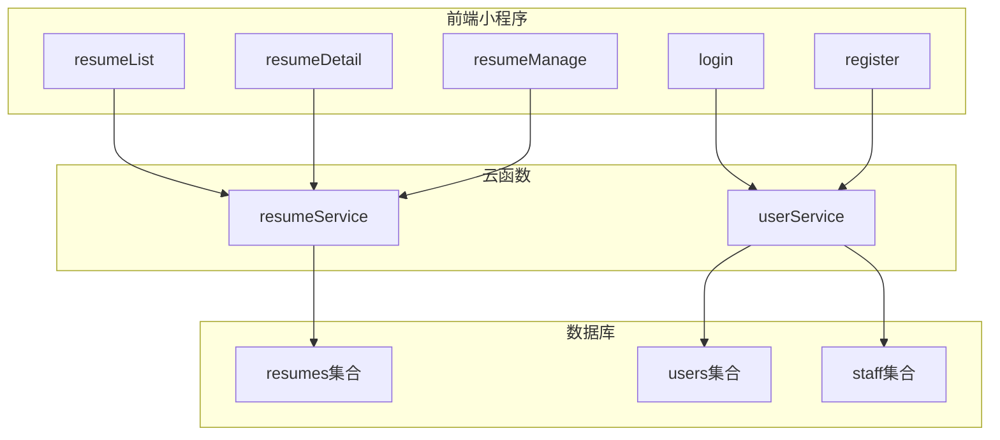
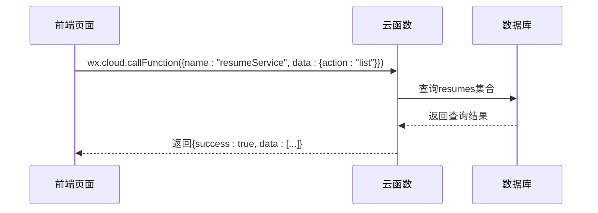
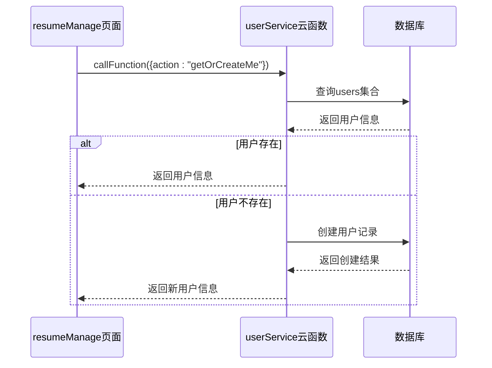
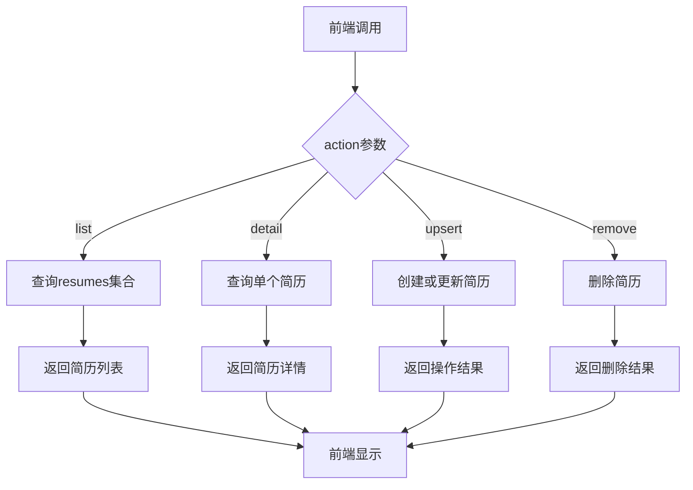
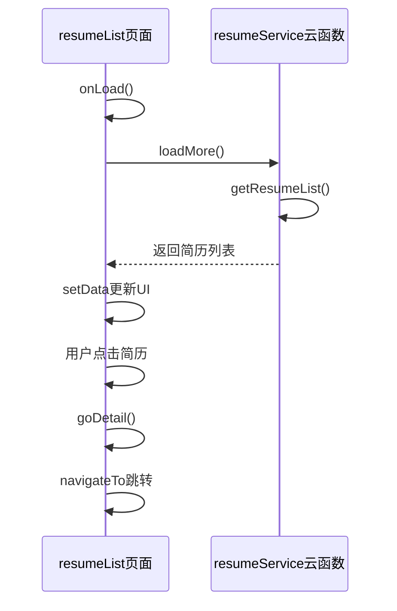
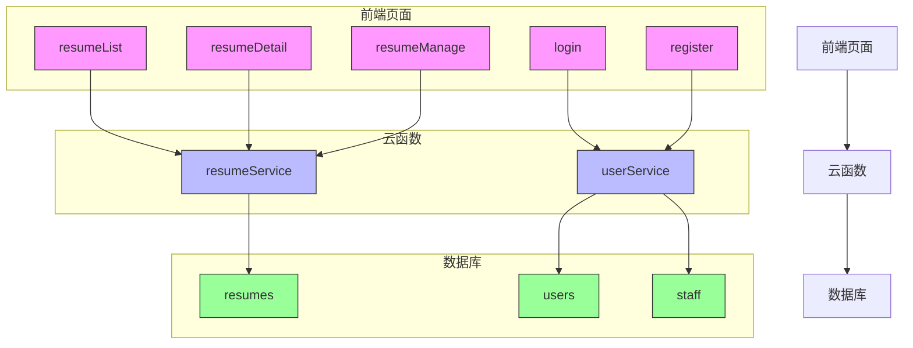
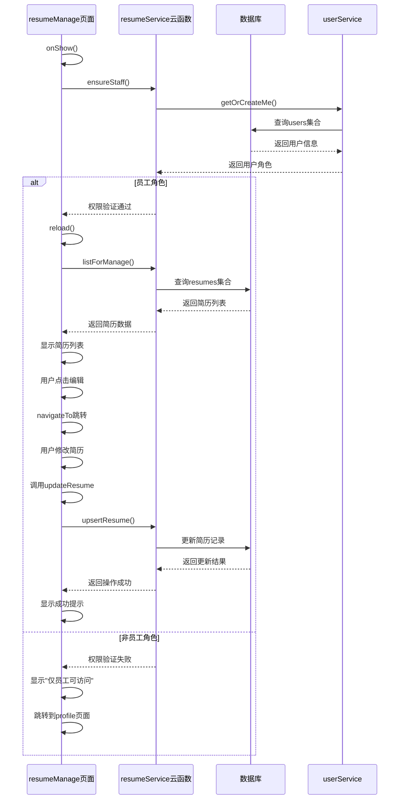
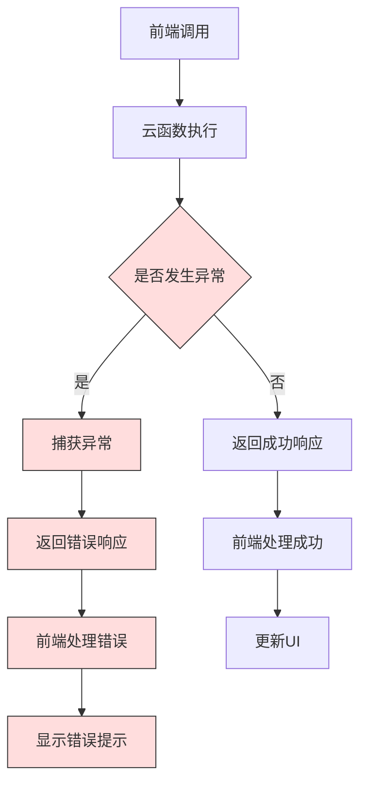

# 组件关系

<cite>
**本文档引用的文件**  
- [app.json](file://miniprogram/app.json)
- [resumeService/index.js](file://cloudfunctions/resumeService/index.js)
- [userService/index.js](file://cloudfunctions/userService/index.js)
- [resume.js](file://miniprogram/services/resume.js)
- [auth.js](file://miniprogram/services/auth.js)
- [request.js](file://miniprogram/utils/request.js)
- [resumeManage/index.js](file://miniprogram/pages/admin/resumeManage/index.js)
- [resumeDetail/index.js](file://miniprogram/pages/resumeDetail/index.js)
- [resumeList/index.js](file://miniprogram/pages/resumeList/index.js)
- [login/index.js](file://miniprogram/pages/login/index.js)
- [register/index.js](file://miniprogram/pages/register/index.js)
</cite>

## 目录
1. [项目结构概述](#项目结构概述)
2. [核心组件与服务](#核心组件与服务)
3. [页面与云函数通信机制](#页面与云函数通信机制)
4. [用户身份验证与档案管理](#用户身份验证与档案管理)
5. [简历增删改查操作流程](#简历增删改查操作流程)
6. [前端页面事件绑定与生命周期](#前端页面事件绑定与生命周期)
7. [组件调用关系图](#组件调用关系图)
8. [完整调用链示例](#完整调用链示例)
9. [错误处理与异常传递](#错误处理与异常传递)

## 项目结构概述

安得褓贝项目采用微信小程序云开发架构，主要分为前端小程序（miniprogram）、云函数（cloudfunctions）和管理后台（admin-web）三大部分。前端页面结构由`app.json`定义，包含核心页面如`resumeList`、`resumeDetail`、`resumeManage`等。云函数模块包括`resumeService`和`userService`，分别负责简历管理和用户服务。前端通过云函数接口与后端服务通信，实现数据交互和业务逻辑处理。



**组件来源**  
- [app.json](file://miniprogram/app.json#L1-L54)
- 项目结构信息

## 核心组件与服务

系统核心组件包括前端页面组件、云函数服务和数据库集合。`userService`负责用户登录、身份验证和档案管理，`resumeService`负责简历的增删改查操作。前端通过`services`目录下的`resume.js`和`auth.js`封装服务调用，`utils`目录下的`request.js`提供统一的HTTP请求处理。

**组件来源**  
- [resumeService/index.js](file://cloudfunctions/resumeService/index.js#L1-L216)
- [userService/index.js](file://cloudfunctions/userService/index.js#L1-L289)
- [resume.js](file://miniprogram/services/resume.js#L1-L239)
- [auth.js](file://miniprogram/services/auth.js#L1-L163)
- [request.js](file://miniprogram/utils/request.js#L1-L125)

## 页面与云函数通信机制

前端页面通过`wx.cloud.callFunction`调用云函数接口与后端服务通信。云函数接收`action`参数来区分不同操作，返回标准化的响应格式。前端通过事件绑定和生命周期函数触发服务调用，实现数据加载和交互。



**组件来源**  
- [resumeList/index.js](file://miniprogram/pages/resumeList/index.js#L335-L357)
- [resumeService/index.js](file://cloudfunctions/resumeService/index.js#L188-L211)

## 用户身份验证与档案管理

`userService`提供用户身份验证和档案管理功能。通过`getOrCreateMe`获取或创建用户信息，`loginByPhone`处理手机号登录，`accountRegister`和`accountLogin`处理账号密码注册和登录。用户角色通过`isStaff`函数判断，支持员工和客户两种角色。



**组件来源**  
- [userService/index.js](file://cloudfunctions/userService/index.js#L49-L84)
- [login/index.js](file://miniprogram/pages/login/index.js#L72-L76)
- [resumeManage/index.js](file://miniprogram/pages/admin/resumeManage/index.js#L37-L40)

## 简历增删改查操作流程

`resumeService`提供简历的增删改查操作。`list`和`detail`用于获取简历列表和详情，`upsert`用于创建或更新简历，`remove`用于删除简历。所有操作都通过`action`参数区分，返回标准化的响应格式。



**组件来源**  
- [resumeService/index.js](file://cloudfunctions/resumeService/index.js#L188-L211)
- [resume.js](file://miniprogram/services/resume.js#L16-L237)

## 前端页面事件绑定与生命周期

前端页面通过事件绑定和生命周期函数触发服务调用。`onLoad`和`onShow`生命周期函数用于页面初始化和数据加载，`bindtap`等事件绑定用于用户交互触发服务调用。



**组件来源**  
- [resumeList/index.js](file://miniprogram/pages/resumeList/index.js#L220-L254)
- [resumeDetail/index.js](file://miniprogram/pages/resumeDetail/index.js#L166-L200)

## 组件调用关系图



**组件来源**  
- [app.json](file://miniprogram/app.json#L1-L54)
- [resumeService/index.js](file://cloudfunctions/resumeService/index.js#L1-L216)
- [userService/index.js](file://cloudfunctions/userService/index.js#L1-L289)

## 完整调用链示例

员工角色通过`resumeManage`页面调用`resumeService.updateResume`接口更新简历的完整调用链：



**组件来源**  
- [resumeManage/index.js](file://miniprogram/pages/admin/resumeManage/index.js#L29-L71)
- [resumeService/index.js](file://cloudfunctions/resumeService/index.js#L135-L168)
- [userService/index.js](file://cloudfunctions/userService/index.js#L49-L84)

## 错误处理与异常传递

系统采用统一的错误处理机制，云函数通过try-catch捕获异常，返回标准化的错误响应。前端根据响应结果进行相应的错误处理和用户提示。



云函数中的错误处理代码示例：
```javascript
exports.main = async (event, context) => {
  try {
    // 业务逻辑
    switch (event.action) {
      // ...
    }
  } catch (e) {
    return { success: false, errMsg: e && e.message ? e.message : String(e) };
  }
}
```

前端错误处理代码示例：
```javascript
try {
  const resp = await wx.cloud.callFunction({
    name: "resumeService",
    data: { action: "remove", id },
  });
  wx.showToast({ title: "已删除" });
  this.reload();
} catch (e2) {
  wx.showToast({ title: "删除失败", icon: "none" });
}
```

**组件来源**  
- [resumeService/index.js](file://cloudfunctions/resumeService/index.js#L212-L214)
- [resumeManage/index.js](file://miniprogram/pages/admin/resumeManage/index.js#L97-L107)