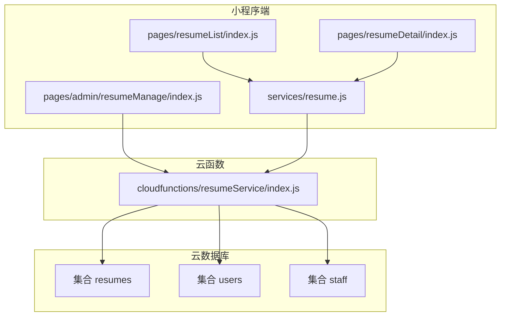
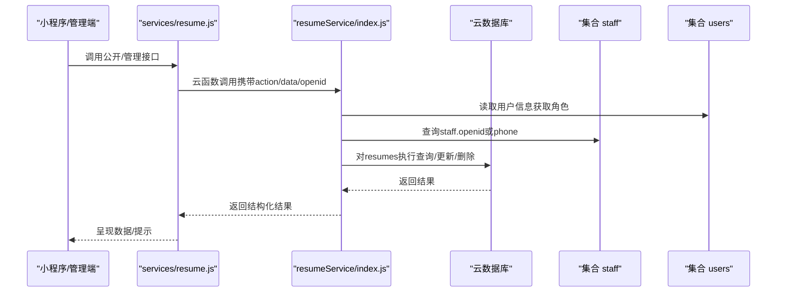
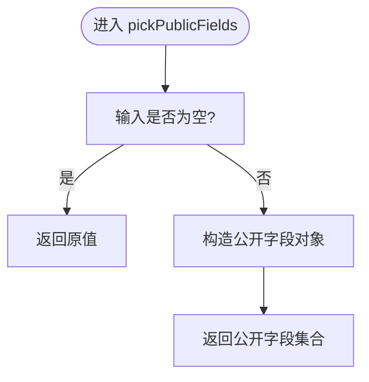
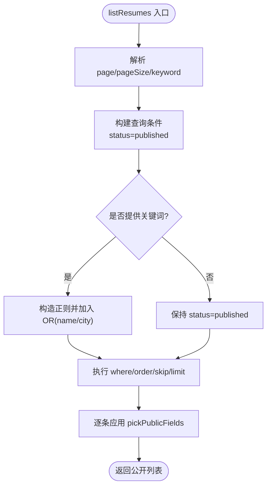
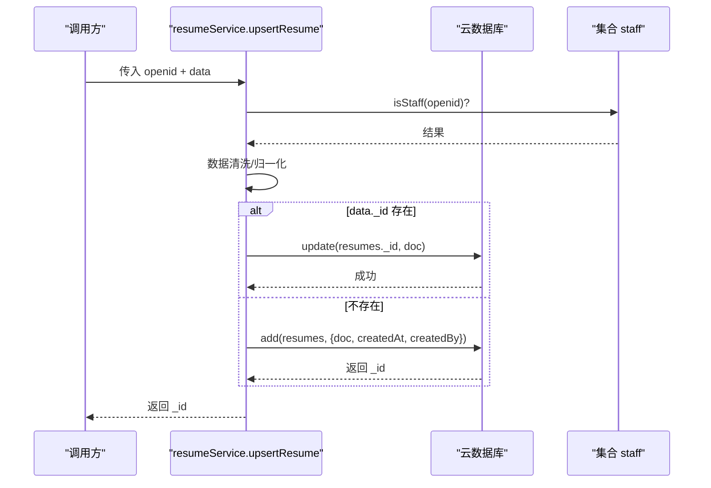
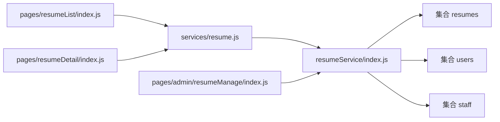

# resumes集合

<cite>
**本文引用的文件**
- [cloudfunctions/resumeService/index.js](file://cloudfunctions/resumeService/index.js)
- [miniprogram/services/resume.js](file://miniprogram/services/resume.js)
- [miniprogram/pages/resumeList/index.js](file://miniprogram/pages/resumeList/index.js)
- [miniprogram/pages/resumeDetail/index.js](file://miniprogram/pages/resumeDetail/index.js)
- [miniprogram/pages/admin/resumeManage/index.js](file://miniprogram/pages/admin/resumeManage/index.js)
- [docs/简历管理方案深度分析.md](file://docs/简历管理方案深度分析.md)
</cite>

## 目录
1. [简介](#简介)
2. [项目结构](#项目结构)
3. [核心组件](#核心组件)
4. [架构总览](#架构总览)
5. [详细组件分析](#详细组件分析)
6. [依赖关系分析](#依赖关系分析)
7. [性能考量](#性能考量)
8. [故障排查指南](#故障排查指南)
9. [结论](#结论)
10. [附录](#附录)

## 简介
本文件面向安得褓贝项目中的resumes集合，系统性梳理其数据模型、字段语义、业务规则与生命周期管理。重点覆盖：
- 字段体系与约束：_id、name、age、city、experienceYears、priceMonth、tags、intro、coverFileId、photos、videoFileId、status、createdAt、updatedAt、createdBy
- 业务规则：status控制C端可见性；createdBy实现数据归属；pickPublicFields筛选公开字段
- 查询与分页：分页参数、关键词搜索策略
- 云函数操作：upsert、remove的数据验证与权限控制
- 生命周期：创建、草稿/发布、编辑、删除、可见性变更

## 项目结构
围绕resumes集合的关键代码分布于云函数与小程序端：
- 云函数resumeService负责集合的增删改查、权限校验与公开字段筛选
- 小程序端通过服务封装调用云函数，实现简历列表、详情、上传、分享等能力
- 管理端页面通过云函数调用实现简历管理（草稿/发布、删除）

图表来源
- [cloudfunctions/resumeService/index.js](file://cloudfunctions/resumeService/index.js#L1-L216)
- [miniprogram/services/resume.js](file://miniprogram/services/resume.js#L1-L239)
- [miniprogram/pages/resumeList/index.js](file://miniprogram/pages/resumeList/index.js#L1-L698)
- [miniprogram/pages/resumeDetail/index.js](file://miniprogram/pages/resumeDetail/index.js#L1-L800)
- [miniprogram/pages/admin/resumeManage/index.js](file://miniprogram/pages/admin/resumeManage/index.js#L1-L112)

章节来源
- [cloudfunctions/resumeService/index.js](file://cloudfunctions/resumeService/index.js#L1-L216)
- [miniprogram/services/resume.js](file://miniprogram/services/resume.js#L1-L239)

## 核心组件
- resumes集合字段与约束
  - 唯一标识：_id（云数据库自动生成）
  - 基本信息：name、age、city、experienceYears、priceMonth
  - 标签与介绍：tags（数组）、intro（字符串）
  - 媒体资源：coverFileId（封面文件ID）、photos（个人照片数组）、videoFileId（自我介绍视频文件ID）
  - 发布状态：status（枚举 draft/published）
  - 时间戳：createdAt、updatedAt（服务端时间）
  - 数据归属：createdBy（创建者openid）
- 业务规则
  - status=published时对C端可见；status=draft仅管理端可见
  - createdBy用于数据归属与权限控制（结合staff集合判定）
  - pickPublicFields用于对外输出的公开字段集合
- 查询与分页
  - 分页：page/pageSize，最小1、最大20
  - 关键词：基于name/city的模糊匹配（大小写不敏感）
  - 排序：按updatedAt倒序
- 云函数操作
  - upsert：创建/更新简历，校验staff权限，自动填充createdAt/updatedAt/createdBy
  - remove：删除简历，校验staff权限
  - list/detail/listForManage：公开列表、详情（公开）、管理端列表（受权限控制）

章节来源
- [cloudfunctions/resumeService/index.js](file://cloudfunctions/resumeService/index.js#L58-L106)
- [cloudfunctions/resumeService/index.js](file://cloudfunctions/resumeService/index.js#L135-L169)
- [cloudfunctions/resumeService/index.js](file://cloudfunctions/resumeService/index.js#L171-L178)
- [cloudfunctions/resumeService/index.js](file://cloudfunctions/resumeService/index.js#L78-L106)
- [cloudfunctions/resumeService/index.js](file://cloudfunctions/resumeService/index.js#L122-L133)

## 架构总览
resumes集合在整体架构中的位置如下：
- 小程序端通过服务封装调用云函数
- 云函数通过wx-server-sdk访问云数据库，执行CRUD与权限校验
- 管理端页面通过云函数调用实现简历管理
- 用户角色通过staff集合与openid判定，从而控制对resumes的访问范围

图表来源
- [cloudfunctions/resumeService/index.js](file://cloudfunctions/resumeService/index.js#L26-L56)
- [cloudfunctions/resumeService/index.js](file://cloudfunctions/resumeService/index.js#L180-L216)
- [miniprogram/services/resume.js](file://miniprogram/services/resume.js#L1-L239)

## 详细组件分析

### 数据模型与字段约束
- 字段清单与含义
  - _id：简历唯一标识（云数据库自动生成）
  - name：姓名（字符串，必填建议）
  - age：年龄（数值）
  - city：所在城市（字符串）
  - experienceYears：经验年数（数值）
  - priceMonth：期望月薪/月（数值）
  - tags：技能/标签数组（字符串数组）
  - intro：自我介绍（字符串）
  - coverFileId：封面文件ID（字符串）
  - photos：个人照片数组（字符串数组）
  - videoFileId：自我介绍视频文件ID（字符串）
  - status：发布状态（枚举 draft/published）
  - createdAt：创建时间（服务端时间）
  - updatedAt：更新时间（服务端时间）
  - createdBy：创建者openid（字符串）
- 约束与默认值
  - status默认draft；若传入非published则归一为draft
  - 若新建简历，自动写入createdAt与createdBy
  - updatedAt每次更新都会刷新
  - 关键字段在upsert中进行清洗与归一化（如trim、数组化、空字符串处理）

章节来源
- [cloudfunctions/resumeService/index.js](file://cloudfunctions/resumeService/index.js#L135-L169)

### 公开字段筛选 pickPublicFields
- 作用：将完整文档裁剪为对外公开字段集合，避免泄露内部字段
- 裁剪范围：_id、name、age、city、experienceYears、priceMonth、tags、intro、coverFileId、photos、videoFileId、status、createdAt、updatedAt
- 使用场景：公开列表与详情接口返回给C端

图表来源
- [cloudfunctions/resumeService/index.js](file://cloudfunctions/resumeService/index.js#L58-L76)

章节来源
- [cloudfunctions/resumeService/index.js](file://cloudfunctions/resumeService/index.js#L58-L76)

### 分页与关键词搜索
- 分页参数
  - page：从0开始的页码（公开列表接口中被转换为skip）
  - pageSize：1~20，默认10
- 关键词搜索
  - 仅对name与city进行模糊匹配（大小写不敏感）
  - 使用正则表达式进行模糊匹配
- 排序
  - 按updatedAt降序
- 返回
  - 对每条记录应用pickPublicFields进行公开字段输出

图表来源
- [cloudfunctions/resumeService/index.js](file://cloudfunctions/resumeService/index.js#L78-L106)

章节来源
- [cloudfunctions/resumeService/index.js](file://cloudfunctions/resumeService/index.js#L78-L106)

### upsert 操作：创建/更新简历
- 权限控制
  - 仅允许staff角色（通过staff集合openid/phone匹配）调用
- 数据清洗与归一化
  - name、city：trim处理
  - tags/photos：确保为数组
  - status：仅接受published/draft，非published一律归一为draft
  - updatedAt：每次更新刷新
  - 新建：自动写入createdAt与createdBy
- 更新与创建分支
  - 存在_id：走update
  - 不存在_id：走add并写入createdBy

图表来源
- [cloudfunctions/resumeService/index.js](file://cloudfunctions/resumeService/index.js#L135-L169)
- [cloudfunctions/resumeService/index.js](file://cloudfunctions/resumeService/index.js#L26-L56)

章节来源
- [cloudfunctions/resumeService/index.js](file://cloudfunctions/resumeService/index.js#L135-L169)
- [cloudfunctions/resumeService/index.js](file://cloudfunctions/resumeService/index.js#L26-L56)

### remove 操作：删除简历
- 权限控制
  - 仅允许staff角色调用
- 参数校验
  - 缺少id时报错
- 执行
  - 删除指定_id的简历

章节来源
- [cloudfunctions/resumeService/index.js](file://cloudfunctions/resumeService/index.js#L171-L178)

### 管理端列表与详情（forManage）
- listForManage
  - 仅允许staff角色调用
  - 返回最近更新的简历（最多100条），并对每条应用pickPublicFields
- getDetail
  - 支持forManage=true时仅管理员可见
  - 校验staff权限后返回公开字段

章节来源
- [cloudfunctions/resumeService/index.js](file://cloudfunctions/resumeService/index.js#L122-L133)
- [cloudfunctions/resumeService/index.js](file://cloudfunctions/resumeService/index.js#L108-L121)

### C端公开接口与小程序端调用
- 公开列表
  - 小程序端通过services/resume.js调用云函数action=list
  - 参数：page/pageSize/keyword
- 公开详情
  - 小程序端通过services/resume.js调用云函数action=detail
  - 参数：id/forManage=false
- 管理端列表
  - 小程序端通过services/resume.js调用云函数action=listForManage
  - 参数：无

章节来源
- [miniprogram/services/resume.js](file://miniprogram/services/resume.js#L1-L239)
- [cloudfunctions/resumeService/index.js](file://cloudfunctions/resumeService/index.js#L180-L216)

### 媒体文件引用与C端展示
- 媒体字段
  - coverFileId：封面文件ID
  - photos：个人照片数组
  - videoFileId：自我介绍视频文件ID
- 展示与预加载
  - 小程序端在简历列表页对视频进行预加载与缓存
  - 详情页对视频进行云端URL转换与播放控制

章节来源
- [miniprogram/pages/resumeList/index.js](file://miniprogram/pages/resumeList/index.js#L1-L698)
- [miniprogram/pages/resumeDetail/index.js](file://miniprogram/pages/resumeDetail/index.js#L1-L800)

## 依赖关系分析
- 角色与权限
  - staff集合：通过openid或phone判定是否具备简历管理权限
  - users集合：用于获取用户信息（当前主要用于staff判定流程）
- 云函数与集合
  - resumeService依赖resumes、users、staff集合
  - 通过isStaff(openid)实现权限控制
- 前端与云函数
  - services/resume.js封装公开/管理接口调用
  - pages/resumeList与resumeDetail消费公开接口
  - pages/admin/resumeManage消费管理接口

图表来源
- [cloudfunctions/resumeService/index.js](file://cloudfunctions/resumeService/index.js#L26-L56)
- [miniprogram/services/resume.js](file://miniprogram/services/resume.js#L1-L239)
- [miniprogram/pages/resumeList/index.js](file://miniprogram/pages/resumeList/index.js#L1-L698)
- [miniprogram/pages/resumeDetail/index.js](file://miniprogram/pages/resumeDetail/index.js#L1-L800)
- [miniprogram/pages/admin/resumeManage/index.js](file://miniprogram/pages/admin/resumeManage/index.js#L1-L112)

章节来源
- [cloudfunctions/resumeService/index.js](file://cloudfunctions/resumeService/index.js#L26-L56)
- [miniprogram/services/resume.js](file://miniprogram/services/resume.js#L1-L239)

## 性能考量
- 分页与查询
  - pageSize上限20，避免一次性返回过多数据
  - 使用正则进行模糊匹配，建议在高频查询场景考虑建立索引（如name、city、status）
- 媒体资源
  - 列表页对视频进行预加载与缓存，减少重复下载
  - 详情页对云存储URL进行转换，避免直接播放cloud://格式
- 权限判定
  - isStaff(openid)涉及两次集合查询（users与staff），建议在staff规模较大时优化索引或引入缓存

[本节为通用性能建议，不直接分析具体文件]

## 故障排查指南
- 权限不足
  - 现象：调用upsert/remove/listForManage时报“权限不足”
  - 排查：确认调用者openid是否存在于staff集合（openid或phone）
- 缺少参数
  - 现象：调用remove时报“缺少id”
  - 排查：确认传入的id参数是否正确
- 关键词搜索无效
  - 现象：搜索name/city无结果
  - 排查：确认关键词是否为空；确认数据库中存在匹配数据
- 媒体播放失败
  - 现象：视频无法播放或地址无效
  - 排查：确认videoFileId为有效的云存储文件ID；确认已转换为临时可播放URL

章节来源
- [cloudfunctions/resumeService/index.js](file://cloudfunctions/resumeService/index.js#L171-L178)
- [cloudfunctions/resumeService/index.js](file://cloudfunctions/resumeService/index.js#L108-L121)
- [miniprogram/pages/resumeDetail/index.js](file://miniprogram/pages/resumeDetail/index.js#L454-L478)

## 结论
resumes集合围绕“草稿/发布”与“数据归属”两大核心规则构建：status控制C端可见性，createdBy实现数据归属，配合staff权限体系保障管理端可控。云函数通过统一的upsert/remove与公开字段筛选，形成稳定的数据生命周期管理闭环。前端通过服务封装与页面组件，实现公开列表、详情与管理端操作的一致体验。

[本节为总结性内容，不直接分析具体文件]

## 附录

### 字段定义与默认值对照
- 字段
  - _id：自动生成
  - name/age/city/experienceYears/priceMonth/tags/intro/coverFileId/photos/videoFileId/status/createdAt/updatedAt/createdBy
- 默认值与约束
  - status默认draft；非published统一归一为draft
  - 新建自动写入createdAt/updatedBy
  - updatedAt每次更新刷新
  - tags/photos为空时归一为空数组

章节来源
- [cloudfunctions/resumeService/index.js](file://cloudfunctions/resumeService/index.js#L135-L169)

### 角色与权限对照
- 角色
  - staff：具备简历管理权限（创建/更新/删除/查看全部）
  - customer：默认角色，仅能浏览已发布简历
- 权限判定
  - 通过staff集合openid/phone匹配判定
  - 管理端页面通过云函数调用实现权限校验

章节来源
- [cloudfunctions/resumeService/index.js](file://cloudfunctions/resumeService/index.js#L26-L56)
- [docs/简历管理方案深度分析.md](file://docs/简历管理方案深度分析.md#L34-L64)