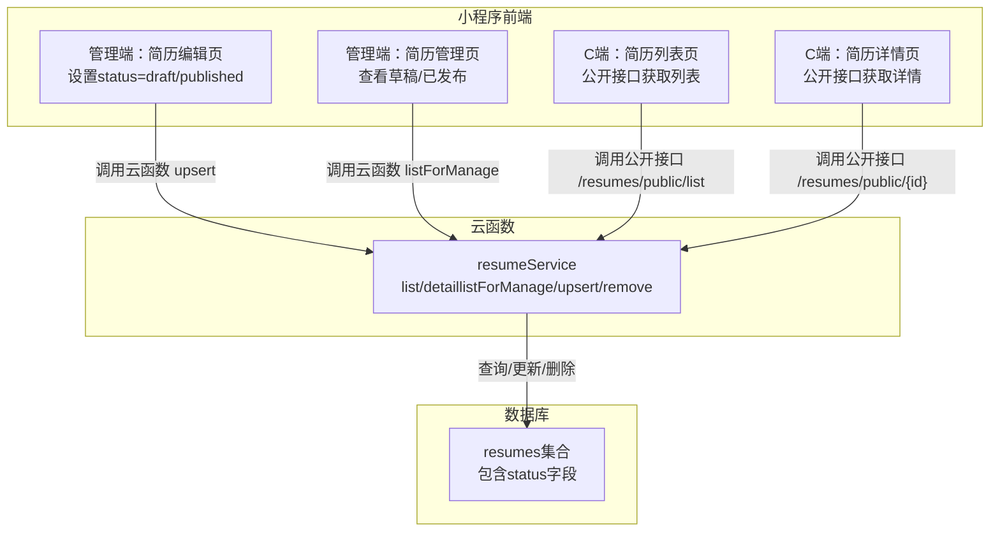
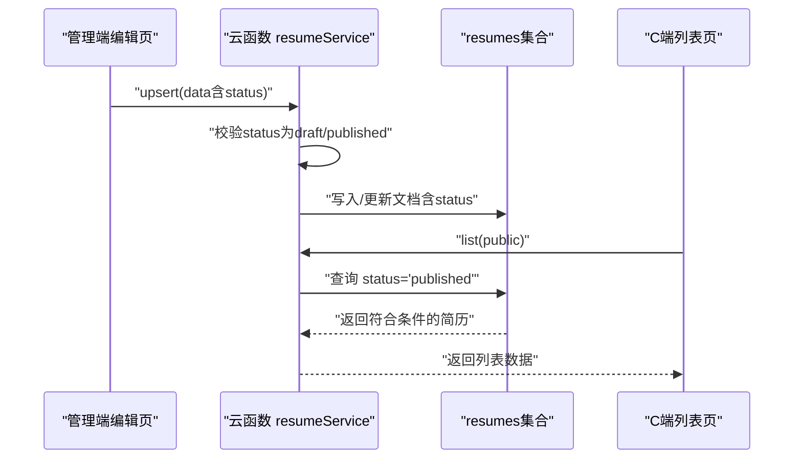
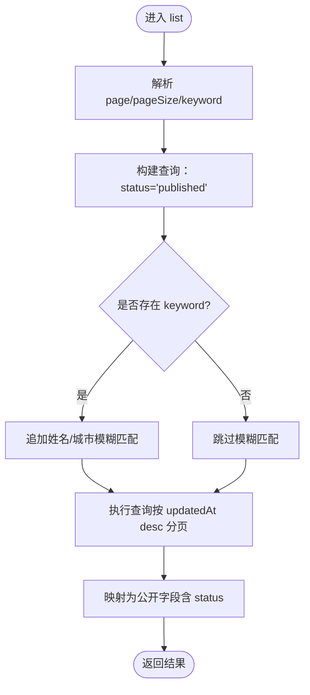
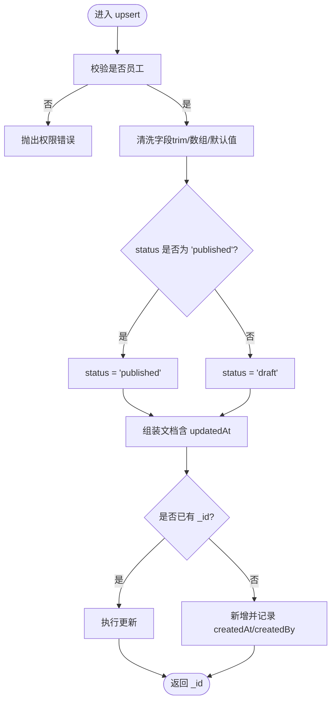
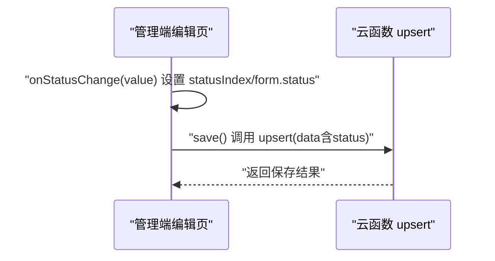
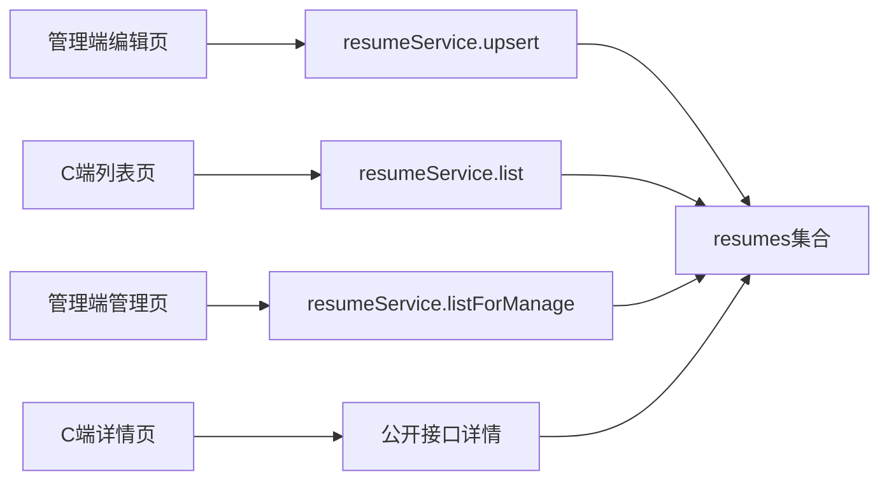

# 发布状态控制

<cite>
**本文引用的文件**
- [cloudfunctions/resumeService/index.js](file://cloudfunctions/resumeService/index.js)
- [miniprogram/pages/admin/resumeEdit/index.js](file://miniprogram/pages/admin/resumeEdit/index.js)
- [miniprogram/services/resume.js](file://miniprogram/services/resume.js)
- [miniprogram/pages/resumeList/index.js](file://miniprogram/pages/resumeList/index.js)
- [miniprogram/pages/resumeDetail/index.js](file://miniprogram/pages/resumeDetail/index.js)
- [miniprogram/pages/admin/resumeManage/index.js](file://miniprogram/pages/admin/resumeManage/index.js)
- [PRD.md](file://PRD.md)
</cite>

## 目录
1. [简介](#简介)
2. [项目结构](#项目结构)
3. [核心组件](#核心组件)
4. [架构总览](#架构总览)
5. [详细组件分析](#详细组件分析)
6. [依赖关系分析](#依赖关系分析)
7. [性能考量](#性能考量)
8. [故障排查指南](#故障排查指南)
9. [结论](#结论)
10. [附录](#附录)

## 简介
本专项文档聚焦于安得褓贝项目中“resumes集合发布状态控制机制”。围绕_status_字段设计与业务规则，系统性说明：
- _status_字段为枚举类型，包含'draft'（草稿）和'published'（已发布）两种取值；
- C端可见性控制：仅当status为'published'的简历才会出现在C端简历列表中；
- 云函数upsert操作时对状态字段的处理逻辑（自动转换为有效值）；
- 员工在简历编辑页面如何切换发布状态；
- 状态变更对数据查询的影响；
- 状态控制相关的业务规则验收标准。

## 项目结构
围绕发布状态控制的关键文件分布如下：
- 云函数：resumeService负责简历的增删改查与状态控制；
- 小程序端：
  - 管理端：简历编辑页负责设置status，管理页展示草稿/已发布状态；
  - C端：简历列表页通过公开接口获取数据，受云函数list查询条件约束；
  - 详情页：公开接口读取详情，不受状态过滤影响；
- PRD文档明确列出关键业务规则。

图表来源
- [cloudfunctions/resumeService/index.js](file://cloudfunctions/resumeService/index.js#L78-L106)
- [miniprogram/pages/admin/resumeEdit/index.js](file://miniprogram/pages/admin/resumeEdit/index.js#L65-L72)
- [miniprogram/pages/resumeList/index.js](file://miniprogram/pages/resumeList/index.js#L336-L356)
- [miniprogram/pages/resumeDetail/index.js](file://miniprogram/pages/resumeDetail/index.js#L214-L216)

章节来源
- [cloudfunctions/resumeService/index.js](file://cloudfunctions/resumeService/index.js#L78-L106)
- [miniprogram/pages/admin/resumeEdit/index.js](file://miniprogram/pages/admin/resumeEdit/index.js#L65-L72)
- [miniprogram/pages/resumeList/index.js](file://miniprogram/pages/resumeList/index.js#L336-L356)
- [miniprogram/pages/resumeDetail/index.js](file://miniprogram/pages/resumeDetail/index.js#L214-L216)

## 核心组件
- 云函数resumeService
  - list：固定查询条件status='published'，并支持按姓名/城市进行关键词匹配；
  - upsert：对传入的status进行安全转换，确保最终入库为'draft'或'published'；
  - listForManage：供管理端查看全部简历（无状态过滤）；
  - detail：供管理端查看详情（无状态过滤）。
- 小程序管理端
  - 简历编辑页：提供status选项（draft/published），保存时将status透传至云函数；
  - 管理页：展示所有简历，包含status字段，便于核验状态。
- 小程序C端
  - 简历列表页：通过公开接口获取列表，受云函数list查询条件约束；
  - 简历详情页：通过公开接口获取详情，不受状态过滤影响。

章节来源
- [cloudfunctions/resumeService/index.js](file://cloudfunctions/resumeService/index.js#L78-L106)
- [cloudfunctions/resumeService/index.js](file://cloudfunctions/resumeService/index.js#L135-L169)
- [cloudfunctions/resumeService/index.js](file://cloudfunctions/resumeService/index.js#L122-L133)
- [cloudfunctions/resumeService/index.js](file://cloudfunctions/resumeService/index.js#L108-L121)
- [miniprogram/pages/admin/resumeEdit/index.js](file://miniprogram/pages/admin/resumeEdit/index.js#L65-L72)
- [miniprogram/pages/admin/resumeManage/index.js](file://miniprogram/pages/admin/resumeManage/index.js#L51-L71)
- [miniprogram/pages/resumeList/index.js](file://miniprogram/pages/resumeList/index.js#L336-L356)
- [miniprogram/pages/resumeDetail/index.js](file://miniprogram/pages/resumeDetail/index.js#L214-L216)

## 架构总览
发布状态控制贯穿“前端编辑—云函数校验—数据库落库—C端查询”的全链路。其核心要点：
- 状态枚举：'draft'与'published'；
- C端可见性：仅published简历出现在C端列表；
- upsert状态转换：无论前端传入何种值，最终入库严格限定为有效枚举；
- 管理端可见性：管理端查询不受状态限制，便于审核与核对。

图表来源
- [cloudfunctions/resumeService/index.js](file://cloudfunctions/resumeService/index.js#L135-L169)
- [cloudfunctions/resumeService/index.js](file://cloudfunctions/resumeService/index.js#L78-L106)
- [miniprogram/pages/admin/resumeEdit/index.js](file://miniprogram/pages/admin/resumeEdit/index.js#L172-L209)

章节来源
- [cloudfunctions/resumeService/index.js](file://cloudfunctions/resumeService/index.js#L78-L106)
- [cloudfunctions/resumeService/index.js](file://cloudfunctions/resumeService/index.js#L135-L169)
- [miniprogram/pages/admin/resumeEdit/index.js](file://miniprogram/pages/admin/resumeEdit/index.js#L172-L209)

## 详细组件分析

### 云函数：resumeService.list（C端可见性控制）
- 查询条件固定包含status='published'；
- 支持keyword（姓名/城市）的模糊匹配；
- 结果按updatedAt降序分页返回。

图表来源
- [cloudfunctions/resumeService/index.js](file://cloudfunctions/resumeService/index.js#L78-L106)

章节来源
- [cloudfunctions/resumeService/index.js](file://cloudfunctions/resumeService/index.js#L78-L106)

### 云函数：resumeService.upsert（状态字段处理逻辑）
- 对status进行安全转换：若传入值为'published'，则入库为'published'，否则为'draft'；
- 其他字段如name、city、tags、intro、coverFileId、photos、videoFileId、priceMonth、experienceYears、age等按传入值清洗后入库；
- 若存在_id，则执行更新；否则新增并记录createdAt与createdBy。

图表来源
- [cloudfunctions/resumeService/index.js](file://cloudfunctions/resumeService/index.js#L135-L169)

章节来源
- [cloudfunctions/resumeService/index.js](file://cloudfunctions/resumeService/index.js#L135-L169)

### 管理端：简历编辑页（状态切换）
- 页面提供statusOptions=['draft','published']；
- 用户通过onStatusChange选择状态；
- 保存时将form.status透传给云函数upsert。

图表来源
- [miniprogram/pages/admin/resumeEdit/index.js](file://miniprogram/pages/admin/resumeEdit/index.js#L65-L72)
- [miniprogram/pages/admin/resumeEdit/index.js](file://miniprogram/pages/admin/resumeEdit/index.js#L172-L209)

章节来源
- [miniprogram/pages/admin/resumeEdit/index.js](file://miniprogram/pages/admin/resumeEdit/index.js#L65-L72)
- [miniprogram/pages/admin/resumeEdit/index.js](file://miniprogram/pages/admin/resumeEdit/index.js#L172-L209)

### 管理端：简历管理页（状态可见性）
- 通过listForManage获取全部简历（无状态过滤），展示status字段，便于核验；
- 仅员工可访问，非员工会被拒绝。

章节来源
- [cloudfunctions/resumeService/index.js](file://cloudfunctions/resumeService/index.js#L122-L133)
- [miniprogram/pages/admin/resumeManage/index.js](file://miniprogram/pages/admin/resumeManage/index.js#L51-L71)

### C端：简历列表页（状态影响）
- 通过公开接口获取列表；
- 云函数list内部固定status='published'，因此C端仅能看到已发布的简历。

章节来源
- [miniprogram/pages/resumeList/index.js](file://miniprogram/pages/resumeList/index.js#L336-L356)
- [cloudfunctions/resumeService/index.js](file://cloudfunctions/resumeService/index.js#L78-L106)

### C端：简历详情页（状态无关）
- 通过公开接口获取详情；
- 详情接口不受状态过滤影响，但管理端详情接口在forManage=true时会校验员工身份。

章节来源
- [miniprogram/pages/resumeDetail/index.js](file://miniprogram/pages/resumeDetail/index.js#L214-L216)
- [cloudfunctions/resumeService/index.js](file://cloudfunctions/resumeService/index.js#L108-L121)

## 依赖关系分析
- 管理端编辑页依赖云函数upsert进行状态写入；
- 管理端管理页依赖云函数listForManage进行全量查看；
- C端列表页依赖云函数list进行公开查询；
- C端详情页依赖公开接口读取详情。

图表来源
- [cloudfunctions/resumeService/index.js](file://cloudfunctions/resumeService/index.js#L78-L106)
- [cloudfunctions/resumeService/index.js](file://cloudfunctions/resumeService/index.js#L122-L133)
- [cloudfunctions/resumeService/index.js](file://cloudfunctions/resumeService/index.js#L135-L169)
- [miniprogram/pages/admin/resumeEdit/index.js](file://miniprogram/pages/admin/resumeEdit/index.js#L172-L209)
- [miniprogram/pages/admin/resumeManage/index.js](file://miniprogram/pages/admin/resumeManage/index.js#L51-L71)
- [miniprogram/pages/resumeList/index.js](file://miniprogram/pages/resumeList/index.js#L336-L356)
- [miniprogram/pages/resumeDetail/index.js](file://miniprogram/pages/resumeDetail/index.js#L214-L216)

章节来源
- [cloudfunctions/resumeService/index.js](file://cloudfunctions/resumeService/index.js#L78-L106)
- [cloudfunctions/resumeService/index.js](file://cloudfunctions/resumeService/index.js#L122-L133)
- [cloudfunctions/resumeService/index.js](file://cloudfunctions/resumeService/index.js#L135-L169)
- [miniprogram/pages/admin/resumeEdit/index.js](file://miniprogram/pages/admin/resumeEdit/index.js#L172-L209)
- [miniprogram/pages/admin/resumeManage/index.js](file://miniprogram/pages/admin/resumeManage/index.js#L51-L71)
- [miniprogram/pages/resumeList/index.js](file://miniprogram/pages/resumeList/index.js#L336-L356)
- [miniprogram/pages/resumeDetail/index.js](file://miniprogram/pages/resumeDetail/index.js#L214-L216)

## 性能考量
- 列表查询固定status='published'，减少无效数据扫描；
- C端列表页使用分页（pageSize最大20，page从0开始），避免一次性传输过多数据；
- 管理端列表页无状态过滤，便于审核，但建议控制返回条数上限以降低压力。

章节来源
- [cloudfunctions/resumeService/index.js](file://cloudfunctions/resumeService/index.js#L78-L106)
- [cloudfunctions/resumeService/index.js](file://cloudfunctions/resumeService/index.js#L122-L133)
- [PRD.md](file://PRD.md#L313-L325)

## 故障排查指南
- 问题：C端看不到某简历
  - 检查该简历status是否为'published'；
  - 确认云函数list查询条件是否生效（status='published'）。
- 问题：编辑页保存后状态未生效
  - 确认编辑页onStatusChange是否正确设置form.status；
  - 确认保存时是否将form.status传入云函数upsert；
  - 检查upsert中status转换逻辑是否被覆盖。
- 问题：管理端看不到草稿
  - 管理端使用listForManage，不受状态过滤，应能看到全部简历；
  - 若无数据，检查员工身份校验与集合数据。
- 问题：权限不足
  - 云函数对非员工调用会抛出权限错误；
  - 管理端页面也会在非员工情况下提示并跳转。

章节来源
- [cloudfunctions/resumeService/index.js](file://cloudfunctions/resumeService/index.js#L135-L169)
- [cloudfunctions/resumeService/index.js](file://cloudfunctions/resumeService/index.js#L122-L133)
- [miniprogram/pages/admin/resumeEdit/index.js](file://miniprogram/pages/admin/resumeEdit/index.js#L172-L209)
- [miniprogram/pages/admin/resumeManage/index.js](file://miniprogram/pages/admin/resumeManage/index.js#L35-L48)

## 结论
- _status_字段采用严格枚举：'draft'与'published'；
- C端可见性完全由云函数list查询条件控制，确保只有published简历出现在列表；
- upsert对status进行安全转换，防止非法值入库；
- 管理端具备全量查看能力，便于审核；
- 业务规则已在PRD中明确，验收标准清晰可测。

## 附录

### 业务规则验收标准
- 仅status='published'的简历出现在C端简历列表；
- 搜索keyword仅匹配姓名/城市；
- 分页规则：pageSize最大20；page从0开始；返回条数小于pageSize视为无更多；
- 媒体资源统一以fileID存储，前端可直接使用fileID展示。

章节来源
- [PRD.md](file://PRD.md#L313-L325)