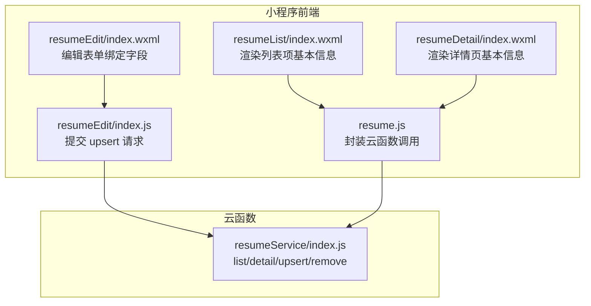
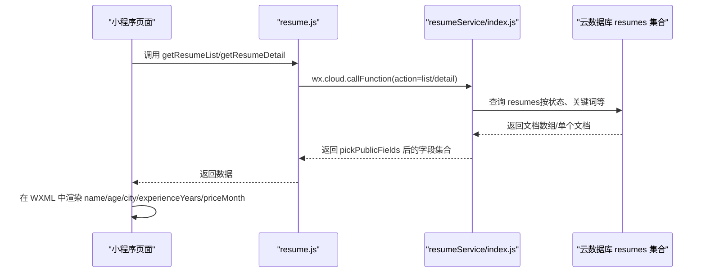
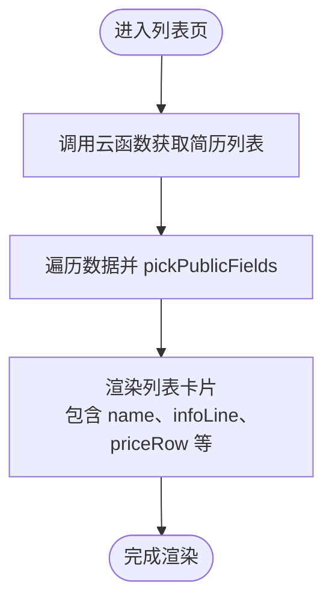
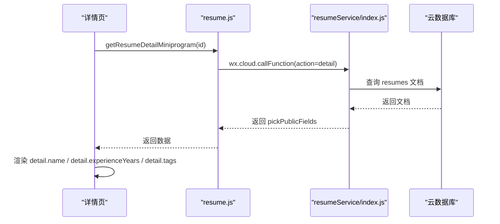
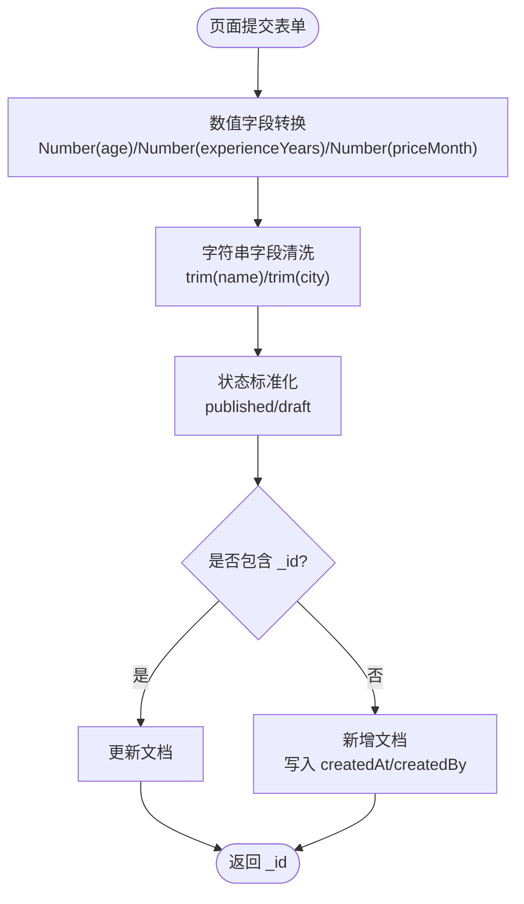
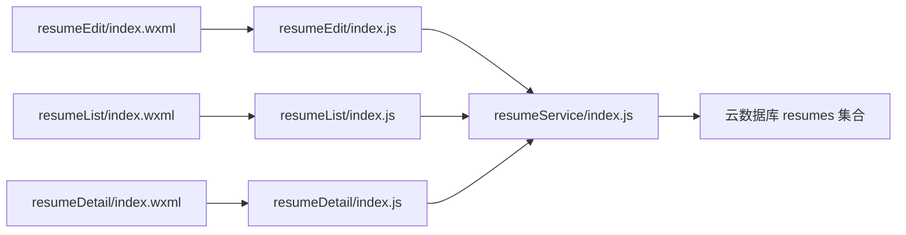

# 基本信息字段

<cite>
**本文引用的文件**
- [PRD.md](file://PRD.md)
- [resumeService/index.js](file://cloudfunctions/resumeService/index.js)
- [resumeEdit/index.wxml](file://miniprogram/pages/admin/resumeEdit/index.wxml)
- [resumeEdit/index.js](file://miniprogram/pages/admin/resumeEdit/index.js)
- [resumeList/index.wxml](file://miniprogram/pages/resumeList/index.wxml)
- [resumeList/index.js](file://miniprogram/pages/resumeList/index.js)
- [resumeDetail/index.wxml](file://miniprogram/pages/resumeDetail/index.wxml)
- [resumeDetail/index.js](file://miniprogram/pages/resumeDetail/index.js)
- [resume.js](file://miniprogram/services/resume.js)
</cite>

## 目录
1. [简介](#简介)
2. [项目结构](#项目结构)
3. [核心组件](#核心组件)
4. [架构总览](#架构总览)
5. [详细组件分析](#详细组件分析)
6. [依赖关系分析](#依赖关系分析)
7. [性能考量](#性能考量)
8. [故障排查指南](#故障排查指南)
9. [结论](#结论)

## 简介
本文件聚焦于安得褓贝项目中 resumes 集合的“基本信息字段”，围绕 _name、age、city、experienceYears、priceMonth 五个字段进行系统化说明。内容基于 PRD 文档与云函数实现，解释字段在简历列表、详情页的展示逻辑，以及在 upsert 操作中的数据清洗与验证规则，并提供前端页面中字段绑定示例与从云数据库获取并渲染到 WXML 模板的方法指引。

## 项目结构
围绕“基本信息字段”的关键文件分布如下：
- 云函数：负责简历数据的读取、筛选、upsert 写入与权限控制
- 小程序页面：负责从云函数拉取数据并在 WXML 中渲染
- 服务封装：对云函数调用进行统一封装，便于页面使用

图表来源
- [resumeList/index.wxml](file://miniprogram/pages/resumeList/index.wxml#L41-L110)
- [resumeDetail/index.wxml](file://miniprogram/pages/resumeDetail/index.wxml#L128-L173)
- [resumeEdit/index.wxml](file://miniprogram/pages/admin/resumeEdit/index.wxml#L1-L30)
- [resumeEdit/index.js](file://miniprogram/pages/admin/resumeEdit/index.js#L180-L211)
- [resume.js](file://miniprogram/services/resume.js#L1-L165)
- [resumeService/index.js](file://cloudfunctions/resumeService/index.js#L78-L169)

章节来源
- [resumeList/index.wxml](file://miniprogram/pages/resumeList/index.wxml#L41-L110)
- [resumeDetail/index.wxml](file://miniprogram/pages/resumeDetail/index.wxml#L128-L173)
- [resumeEdit/index.wxml](file://miniprogram/pages/admin/resumeEdit/index.wxml#L1-L30)
- [resumeEdit/index.js](file://miniprogram/pages/admin/resumeEdit/index.js#L180-L211)
- [resume.js](file://miniprogram/services/resume.js#L1-L165)
- [resumeService/index.js](file://cloudfunctions/resumeService/index.js#L78-L169)

## 核心组件
- 云函数 resumeService：提供 list、detail、listForManage、upsert、remove 等能力，其中 pickPublicFields 负责从数据库文档中挑选对外公开字段，包括 _name、age、city、experienceYears、priceMonth。
- 小程序页面：
  - 列表页 resumeList：从云函数获取简历列表，渲染 name、infoLine（由多个字段组合）、priceRow 等。
  - 详情页 resumeDetail：渲染 name、experienceYears、tags 等字段。
  - 编辑页 resumeEdit：表单输入绑定 name、age、city、experienceYears、priceMonth 等字段，并在保存时发起 upsert 请求。
- 服务封装 resume.js：统一暴露云函数调用方法，供页面使用。

章节来源
- [resumeService/index.js](file://cloudfunctions/resumeService/index.js#L58-L76)
- [resumeList/index.wxml](file://miniprogram/pages/resumeList/index.wxml#L41-L110)
- [resumeDetail/index.wxml](file://miniprogram/pages/resumeDetail/index.wxml#L128-L173)
- [resumeEdit/index.wxml](file://miniprogram/pages/admin/resumeEdit/index.wxml#L1-L30)
- [resumeEdit/index.js](file://miniprogram/pages/admin/resumeEdit/index.js#L180-L211)
- [resume.js](file://miniprogram/services/resume.js#L1-L165)

## 架构总览
下图展示了“基本信息字段”在前后端之间的流转与渲染路径。

图表来源
- [resume.js](file://miniprogram/services/resume.js#L1-L165)
- [resumeService/index.js](file://cloudfunctions/resumeService/index.js#L78-L169)
- [resumeList/index.wxml](file://miniprogram/pages/resumeList/index.wxml#L41-L110)
- [resumeDetail/index.wxml](file://miniprogram/pages/resumeDetail/index.wxml#L128-L173)

## 详细组件分析

### 字段设计与数据模型
- 字段定义与类型约束
  - name：字符串，必填（PRD 明确“姓名 name（必填）”）
  - age：数值类型，可为空（PRD 明确“年龄 age（number，可空）”）
  - city：字符串
  - experienceYears：数值类型
  - priceMonth：数值类型，可为空（PRD 明确“月薪 priceMonth（number，可空）”）

- 字段在数据库中的呈现
  - PRD 数据模型明确列出 resumes 集合字段及类型，其中 age 与 priceMonth 支持空值（空字符串）。
  - 云函数 pickPublicFields 会从数据库文档中挑选上述字段返回给前端。

章节来源
- [PRD.md](file://PRD.md#L177-L182)
- [PRD.md](file://PRD.md#L232-L252)
- [resumeService/index.js](file://cloudfunctions/resumeService/index.js#L58-L76)

### 列表页展示逻辑（简历列表）
- 列表页通过云函数获取数据并渲染，基本信息字段在列表卡片中以“单行展示，超出用省略号”的方式呈现，通常由 infoLine 字段承载组合后的文本。
- 价格字段 priceMonth 在列表页以独立的价格行展示，单位与类型由页面逻辑决定。

图表来源
- [resumeList/index.wxml](file://miniprogram/pages/resumeList/index.wxml#L41-L110)
- [resumeService/index.js](file://cloudfunctions/resumeService/index.js#L78-L106)

章节来源
- [resumeList/index.wxml](file://miniprogram/pages/resumeList/index.wxml#L41-L110)
- [resumeService/index.js](file://cloudfunctions/resumeService/index.js#L78-L106)

### 详情页展示逻辑（简历详情）
- 详情页渲染 name、experienceYears、tags 等字段，基本信息字段在“信息卡片”区域以网格形式展示，体现清晰的可读性。
- 页面通过云函数获取详情数据并绑定到 detail 对象，再在 WXML 中渲染。

图表来源
- [resumeDetail/index.wxml](file://miniprogram/pages/resumeDetail/index.wxml#L128-L173)
- [resumeDetail/index.js](file://miniprogram/pages/resumeDetail/index.js#L202-L224)
- [resume.js](file://miniprogram/services/resume.js#L73-L112)
- [resumeService/index.js](file://cloudfunctions/resumeService/index.js#L108-L120)

章节来源
- [resumeDetail/index.wxml](file://miniprogram/pages/resumeDetail/index.wxml#L128-L173)
- [resumeDetail/index.js](file://miniprogram/pages/resumeDetail/index.js#L202-L224)
- [resume.js](file://miniprogram/services/resume.js#L73-L112)
- [resumeService/index.js](file://cloudfunctions/resumeService/index.js#L108-L120)

### upsert 操作的数据清洗与验证规则
- 权限控制
  - 仅具备 staff 角色的用户可执行 upsert 操作；云函数内部通过 isStaff 判断。
- 数据清洗
  - name、city：进行 trim 清洗，确保前后空白被去除。
  - age、experienceYears、priceMonth：作为数值类型，页面在提交前通过 Number 转换；若转换失败则回退为空字符串或默认数值。
  - tags：按逗号拆分为数组。
  - status：仅接受 "published" 或 "draft"，其余值会被归一为 "draft"。
  - 时间戳：统一使用服务器时间。
- 写入行为
  - 若传入 _id：执行更新；否则执行新增，并写入 createdAt 与 createdBy。

图表来源
- [resumeEdit/index.js](file://miniprogram/pages/admin/resumeEdit/index.js#L180-L211)
- [resumeService/index.js](file://cloudfunctions/resumeService/index.js#L135-L169)

章节来源
- [resumeEdit/index.js](file://miniprogram/pages/admin/resumeEdit/index.js#L180-L211)
- [resumeService/index.js](file://cloudfunctions/resumeService/index.js#L135-L169)

### 前端字段绑定示例与渲染
- 编辑页表单绑定
  - 表单字段通过 data-key 绑定到 form 对象，包括 name、age、city、experienceYears、priceMonth、tagsText、status、coverFileId、photos、videoFileId、intro。
  - 提交时将 form 数据经由 Number 转换后传入云函数 upsert。

- 列表页渲染
  - 列表项通过 {{item.name}}、{{item.infoLine}}、{{item.priceMonth}} 等绑定渲染。
  - 价格单位与展示由页面逻辑控制。

- 详情页渲染
  - 详情页通过 {{detail.name}}、{{detail.experienceYears}}、{{detail.tags}} 等绑定渲染。

章节来源
- [resumeEdit/index.wxml](file://miniprogram/pages/admin/resumeEdit/index.wxml#L1-L30)
- [resumeEdit/index.js](file://miniprogram/pages/admin/resumeEdit/index.js#L180-L211)
- [resumeList/index.wxml](file://miniprogram/pages/resumeList/index.wxml#L41-L110)
- [resumeDetail/index.wxml](file://miniprogram/pages/resumeDetail/index.wxml#L128-L173)

## 依赖关系分析
- 前端依赖
  - 页面依赖服务封装 resume.js，后者封装云函数调用。
  - 列表页与详情页依赖云函数返回的 pickPublicFields 字段集。
- 云函数依赖
  - 云函数依赖数据库 resumes 集合，通过 where 查询、正则匹配、分页排序等实现列表检索。
  - 云函数依赖 isStaff 实现权限控制。

图表来源
- [resumeEdit/index.wxml](file://miniprogram/pages/admin/resumeEdit/index.wxml#L1-L30)
- [resumeEdit/index.js](file://miniprogram/pages/admin/resumeEdit/index.js#L180-L211)
- [resumeList/index.wxml](file://miniprogram/pages/resumeList/index.wxml#L41-L110)
- [resumeList/index.js](file://miniprogram/pages/resumeList/index.js#L1-L200)
- [resumeDetail/index.wxml](file://miniprogram/pages/resumeDetail/index.wxml#L128-L173)
- [resumeDetail/index.js](file://miniprogram/pages/resumeDetail/index.js#L202-L224)
- [resumeService/index.js](file://cloudfunctions/resumeService/index.js#L78-L169)

章节来源
- [resumeEdit/index.wxml](file://miniprogram/pages/admin/resumeEdit/index.wxml#L1-L30)
- [resumeEdit/index.js](file://miniprogram/pages/admin/resumeEdit/index.js#L180-L211)
- [resumeList/index.wxml](file://miniprogram/pages/resumeList/index.wxml#L41-L110)
- [resumeList/index.js](file://miniprogram/pages/resumeList/index.js#L1-L200)
- [resumeDetail/index.wxml](file://miniprogram/pages/resumeDetail/index.wxml#L128-L173)
- [resumeDetail/index.js](file://miniprogram/pages/resumeDetail/index.js#L202-L224)
- [resumeService/index.js](file://cloudfunctions/resumeService/index.js#L78-L169)

## 性能考量
- 列表分页与关键词检索
  - 云函数对列表页采用分页与关键词检索，关键词支持姓名/城市模糊匹配，避免一次性返回大量数据。
- 媒体资源优化
  - 列表页对视频进行预加载与缓存，减少首屏等待与播放卡顿。
- 字段裁剪
  - 通过 pickPublicFields 仅返回必要字段，降低网络传输与前端渲染负担。

章节来源
- [resumeService/index.js](file://cloudfunctions/resumeService/index.js#L78-L106)
- [resumeList/index.js](file://miniprogram/pages/resumeList/index.js#L1-L200)

## 故障排查指南
- 权限问题
  - upsert 操作需要 staff 角色，若提示“无权限或失败”，请确认当前用户是否具备 staff 权限。
- 字段为空或类型不符
  - age、experienceYears、priceMonth 为数值类型，页面提交前已进行 Number 转换；若仍出现异常，检查输入是否为合法数字。
- 列表无数据
  - 列表仅展示 status 为 published 的简历，若无数据，请检查状态是否正确。
- 详情页加载失败
  - 确认传入的简历 ID 是否有效，以及云函数 detail 接口是否返回数据。

章节来源
- [resumeService/index.js](file://cloudfunctions/resumeService/index.js#L108-L120)
- [resumeService/index.js](file://cloudfunctions/resumeService/index.js#L135-L169)
- [resume.js](file://miniprogram/services/resume.js#L73-L112)

## 结论
- _name、age、city、experienceYears、priceMonth 五个字段在 PRD 与云函数实现中均有明确的数据模型与类型约束。
- 列表页通过 infoLine 组合展示基本信息，详情页以网格形式清晰呈现；编辑页提供直观的表单绑定与 upsert 提交流程。
- 云函数在 upsert 中对字段进行清洗与标准化，并通过 isStaff 控制权限，保证数据质量与安全性。
- 前端通过服务封装与 WXML 绑定，实现了从云数据库获取数据到页面渲染的完整闭环。