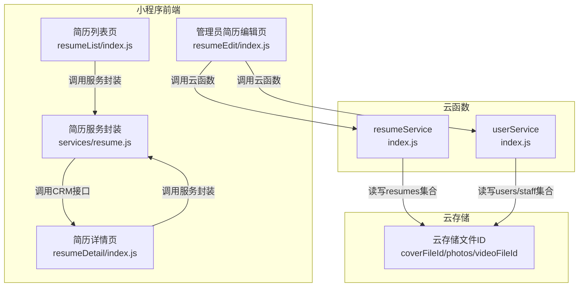
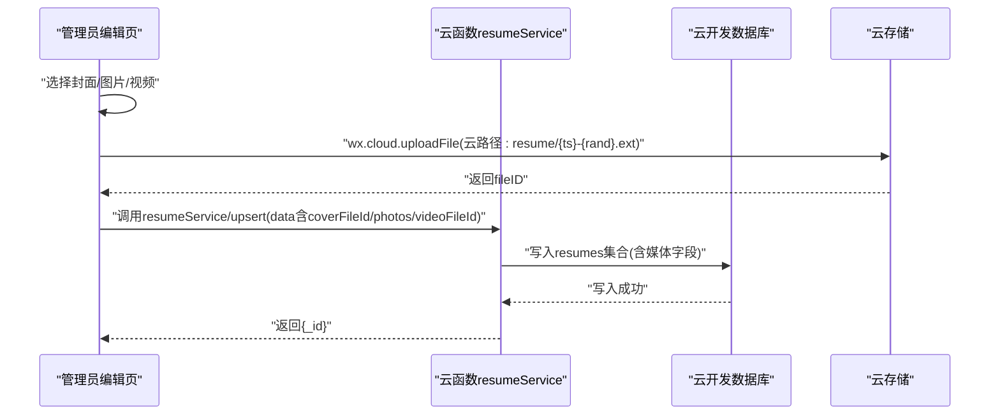
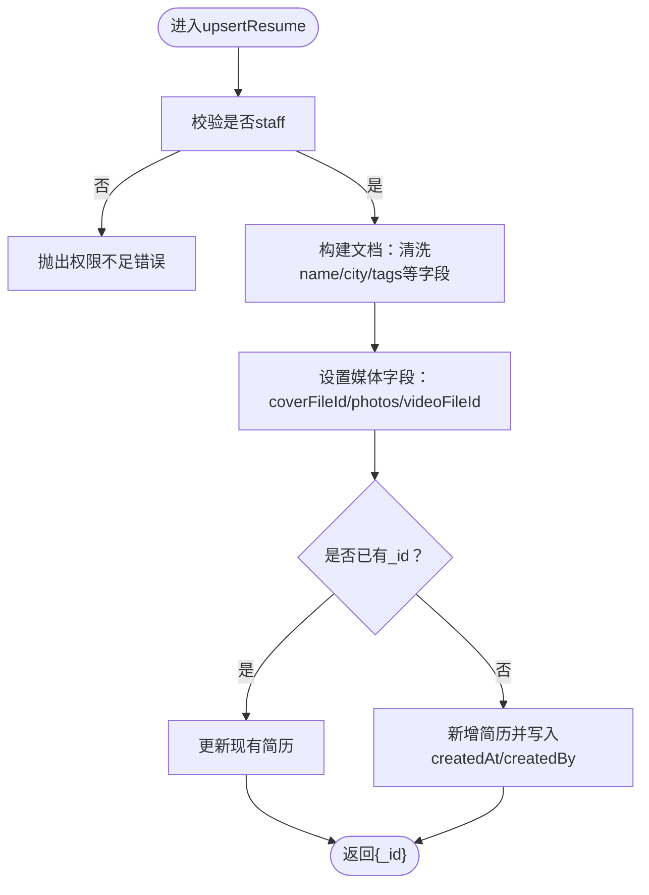
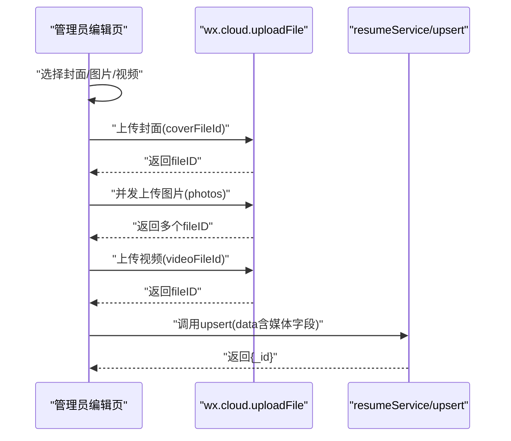
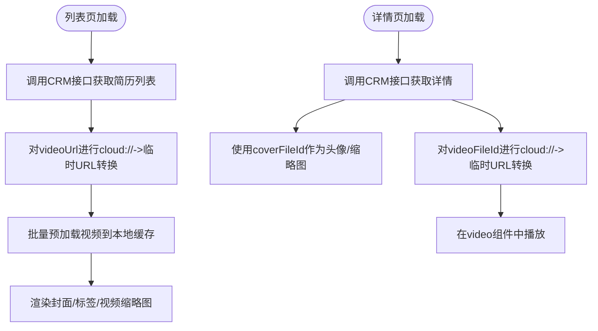
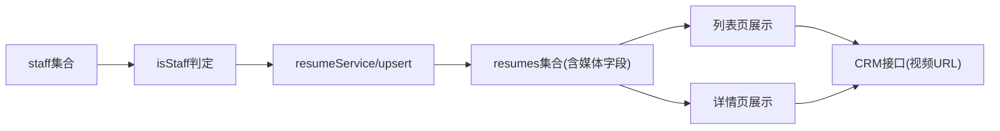

# 媒体文件管理

<cite>
**本文引用的文件**
- [PRD.md](file://PRD.md)
- [resumeService/index.js](file://cloudfunctions/resumeService/index.js)
- [resumeEdit/index.js](file://miniprogram/pages/admin/resumeEdit/index.js)
- [resume.js](file://miniprogram/services/resume.js)
- [resumeDetail/index.js](file://miniprogram/pages/resumeDetail/index.js)
- [resumeList/index.js](file://miniprogram/pages/resumeList/index.js)
- [userService/index.js](file://cloudfunctions/userService/index.js)
</cite>

## 目录
1. [简介](#简介)
2. [项目结构](#项目结构)
3. [核心组件](#核心组件)
4. [架构总览](#架构总览)
5. [详细组件分析](#详细组件分析)
6. [依赖关系分析](#依赖关系分析)
7. [性能考量](#性能考量)
8. [故障排查指南](#故障排查指南)
9. [结论](#结论)

## 简介
本文件聚焦于安得褓贝项目中简历集合（resumes）的媒体文件管理，围绕三个核心字段展开：
- coverFileId：封面图片的云存储文件ID（字符串）
- photos：展示图片的文件ID数组（最多6张）
- videoFileId：介绍视频的文件ID（字符串）

文档将结合云函数与前端页面的实现，说明：
- 云函数在 upsert 操作时对媒体字段的处理与权限控制
- 前端简历编辑页面的媒体上传流程（wx.cloud.uploadFile）、云路径策略（resume/{timestamp}-{random}.{ext}）
- 媒体字段在列表与详情页的展示与预加载策略

## 项目结构
媒体管理涉及的关键位置如下：
- 云函数：resumeService 负责简历的 upsert、列表、详情、管理列表与删除
- 前端页面：管理员简历编辑页负责上传封面、图片、视频并保存；列表与详情页负责展示与预加载
- 用户服务：userService 提供 staff 权限判定

图表来源
- [resumeEdit/index.js](file://miniprogram/pages/admin/resumeEdit/index.js#L106-L170)
- [resumeService/index.js](file://cloudfunctions/resumeService/index.js#L135-L169)
- [resume.js](file://miniprogram/services/resume.js#L1-L239)
- [resumeDetail/index.js](file://miniprogram/pages/resumeDetail/index.js#L1-L200)
- [resumeList/index.js](file://miniprogram/pages/resumeList/index.js#L1-L120)
- [userService/index.js](file://cloudfunctions/userService/index.js#L26-L47)

章节来源
- [resumeEdit/index.js](file://miniprogram/pages/admin/resumeEdit/index.js#L106-L170)
- [resumeService/index.js](file://cloudfunctions/resumeService/index.js#L135-L169)
- [resume.js](file://miniprogram/services/resume.js#L1-L239)
- [resumeDetail/index.js](file://miniprogram/pages/resumeDetail/index.js#L1-L200)
- [resumeList/index.js](file://miniprogram/pages/resumeList/index.js#L1-L120)
- [userService/index.js](file://cloudfunctions/userService/index.js#L26-L47)

## 核心组件
- 云函数 resumeService
  - upsertResume：接收前端传入的简历数据，写入数据库（含 coverFileId、photos、videoFileId），并进行 staff 权限校验
  - pickPublicFields：对外暴露的简历公共字段，包含上述媒体字段
- 前端管理员简历编辑页
  - 上传封面、图片、视频：使用 wx.cloud.uploadFile，云路径采用 resume/{timestamp}-{random}.{ext}
  - 保存：调用 resumeService/upsert，将 fileID 写入数据库
- 前端简历列表/详情页
  - 展示封面、图片、视频；详情页对云存储 cloud:// URL 进行临时链接转换，列表页进行视频预加载优化

章节来源
- [resumeService/index.js](file://cloudfunctions/resumeService/index.js#L58-L76)
- [resumeService/index.js](file://cloudfunctions/resumeService/index.js#L135-L169)
- [resumeEdit/index.js](file://miniprogram/pages/admin/resumeEdit/index.js#L106-L170)
- [resumeDetail/index.js](file://miniprogram/pages/resumeDetail/index.js#L450-L480)
- [resumeList/index.js](file://miniprogram/pages/resumeList/index.js#L37-L120)

## 架构总览
媒体管理的端到端流程如下：

图表来源
- [resumeEdit/index.js](file://miniprogram/pages/admin/resumeEdit/index.js#L106-L170)
- [resumeService/index.js](file://cloudfunctions/resumeService/index.js#L135-L169)

## 详细组件分析

### 1) 云函数：upsert 操作与媒体字段处理
- 权限控制
  - 仅 staff 角色可执行 upsert
  - 通过 isStaff 判断：优先手机号白名单，其次 openid
- 数据写入
  - coverFileId、photos、videoFileId 直接写入数据库
  - photos 为数组，最多6张（前端选择器限制为6张）
  - status 仅接受 draft/published
- 字段映射
  - pickPublicFields 返回 coverFileId、photos、videoFileId 等字段，供前端展示

图表来源
- [resumeService/index.js](file://cloudfunctions/resumeService/index.js#L135-L169)
- [resumeService/index.js](file://cloudfunctions/resumeService/index.js#L58-L76)
- [userService/index.js](file://cloudfunctions/userService/index.js#L26-L47)

章节来源
- [resumeService/index.js](file://cloudfunctions/resumeService/index.js#L135-L169)
- [resumeService/index.js](file://cloudfunctions/resumeService/index.js#L58-L76)
- [userService/index.js](file://cloudfunctions/userService/index.js#L26-L47)

### 2) 前端：简历编辑页媒体上传流程
- 云路径策略
  - 云路径：resume/{timestamp}-{random}.{ext}
  - 封面与图片统一转为 jpg，视频统一转为 mp4
- 上传逻辑
  - pickCover：选择1张图片，上传后写入 coverFileId
  - pickPhotos：最多6张图片，异步并发上传，得到 fileID 数组写入 photos
  - pickVideo：选择1个视频，上传后写入 videoFileId
- 保存
  - 调用 resumeService/upsert，将媒体字段与其它字段一并提交

图表来源
- [resumeEdit/index.js](file://miniprogram/pages/admin/resumeEdit/index.js#L106-L170)
- [resumeService/index.js](file://cloudfunctions/resumeService/index.js#L135-L169)

章节来源
- [resumeEdit/index.js](file://miniprogram/pages/admin/resumeEdit/index.js#L106-L170)
- [resumeService/index.js](file://cloudfunctions/resumeService/index.js#L135-L169)

### 3) 前端：媒体字段在列表与详情页的展示
- 列表页
  - 从 CRM 接口获取简历列表，将 selfIntroductionVideo.url 作为 videoUrl
  - 对 cloud:// URL 进行临时链接转换，再进行视频预加载
- 详情页
  - 优先使用 coverFileId 作为头像/缩略图
  - 对 videoFileId 进行 cloud:// -> 临时URL 转换，确保 <video> 组件可用
  - 顶部媒体切换：视频/图片互切，避免后台播放

图表来源
- [resumeList/index.js](file://miniprogram/pages/resumeList/index.js#L37-L120)
- [resumeDetail/index.js](file://miniprogram/pages/resumeDetail/index.js#L450-L480)

章节来源
- [resumeList/index.js](file://miniprogram/pages/resumeList/index.js#L37-L120)
- [resumeDetail/index.js](file://miniprogram/pages/resumeDetail/index.js#L450-L480)

### 4) PRD 中的媒体上传规则
- 使用 wx.cloud.uploadFile
- 云路径：resume/{timestamp}-{random}.{ext}
- 字段说明：coverFileId、photos（最多6张）、videoFileId

章节来源
- [PRD.md](file://PRD.md#L190-L200)

## 依赖关系分析
- 权限依赖
  - resumeService/upsert 依赖 isStaff 判断，来源于 staff 集合
- 数据依赖
  - 媒体字段（fileID）直接写入 resumes 集合
- 展示依赖
  - 列表/详情页依赖 CRM 接口返回的媒体 URL；详情页对 cloud:// URL 进行转换

图表来源
- [resumeService/index.js](file://cloudfunctions/resumeService/index.js#L135-L169)
- [userService/index.js](file://cloudfunctions/userService/index.js#L26-L47)
- [resumeList/index.js](file://miniprogram/pages/resumeList/index.js#L37-L120)
- [resumeDetail/index.js](file://miniprogram/pages/resumeDetail/index.js#L450-L480)

章节来源
- [resumeService/index.js](file://cloudfunctions/resumeService/index.js#L135-L169)
- [userService/index.js](file://cloudfunctions/userService/index.js#L26-L47)
- [resumeList/index.js](file://miniprogram/pages/resumeList/index.js#L37-L120)
- [resumeDetail/index.js](file://miniprogram/pages/resumeDetail/index.js#L450-L480)

## 性能考量
- 上传并发
  - 管理端图片上传采用并发 Promise.all，提升上传效率
- 视频预加载
  - 列表页对视频进行批量预加载，减少首屏等待
  - 详情页对 cloud:// URL 进行临时链接转换，避免播放失败
- 存储路径
  - 统一的云路径策略（resume/{timestamp}-{random}.{ext}）便于后续清理与检索

章节来源
- [resumeEdit/index.js](file://miniprogram/pages/admin/resumeEdit/index.js#L133-L147)
- [resumeList/index.js](file://miniprogram/pages/resumeList/index.js#L270-L319)
- [resumeDetail/index.js](file://miniprogram/pages/resumeDetail/index.js#L450-L480)

## 故障排查指南
- 上传失败
  - 检查 wx.cloud.uploadFile 的返回值与错误提示
  - 确认云路径格式与扩展名（封面/图片为jpg，视频为mp4）
- 权限不足
  - 确认用户是否在 staff 集合中，或手机号白名单是否存在
  - 云函数会拒绝非 staff 的 upsert 请求
- 视频无法播放
  - 列表/详情页需将 cloud:// URL 转换为临时HTTPS URL
  - 确认转换成功且未返回空串

章节来源
- [resumeEdit/index.js](file://miniprogram/pages/admin/resumeEdit/index.js#L106-L170)
- [resumeService/index.js](file://cloudfunctions/resumeService/index.js#L135-L169)
- [resumeDetail/index.js](file://miniprogram/pages/resumeDetail/index.js#L450-L480)
- [resumeList/index.js](file://miniprogram/pages/resumeList/index.js#L156-L171)
- [userService/index.js](file://cloudfunctions/userService/index.js#L26-L47)

## 结论
- 本项目对简历媒体字段的处理简洁明确：coverFileId、photos、videoFileId 三者分别承载封面、展示图集与介绍视频
- 云函数在 upsert 时不做文件有效性校验，仅进行权限校验与字段写入
- 前端负责上传与路径策略，列表/详情页负责展示与优化（预加载、URL转换）
- 建议在后续迭代中增加：
  - 上传前的文件类型与大小校验
  - 云存储文件ID的有效性校验（如存在性检查）
  - 更严格的媒体字段约束（如 photos 长度上限、videoFileId 的唯一性）