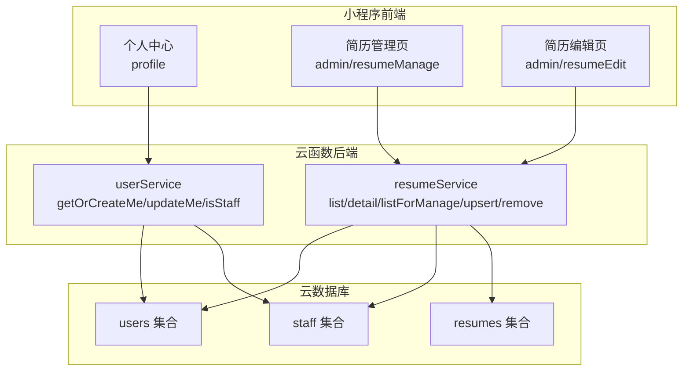
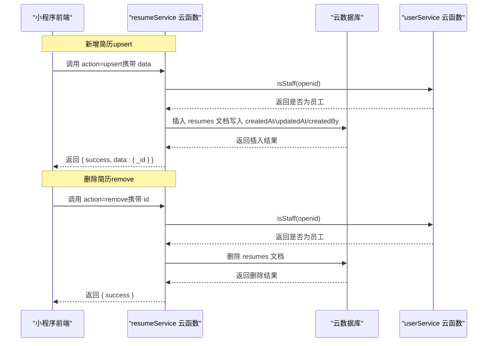
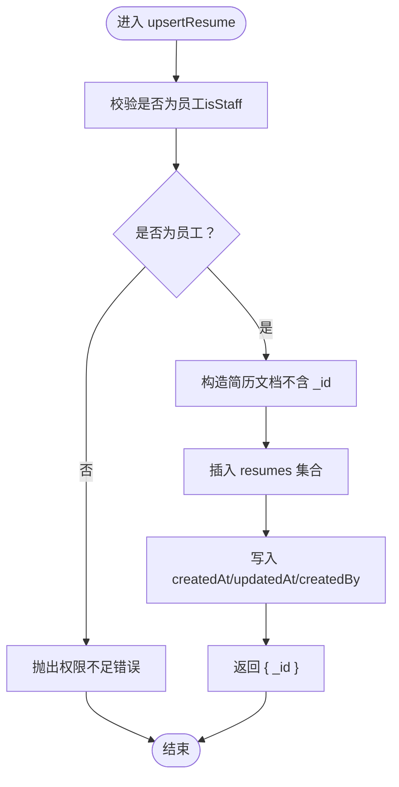
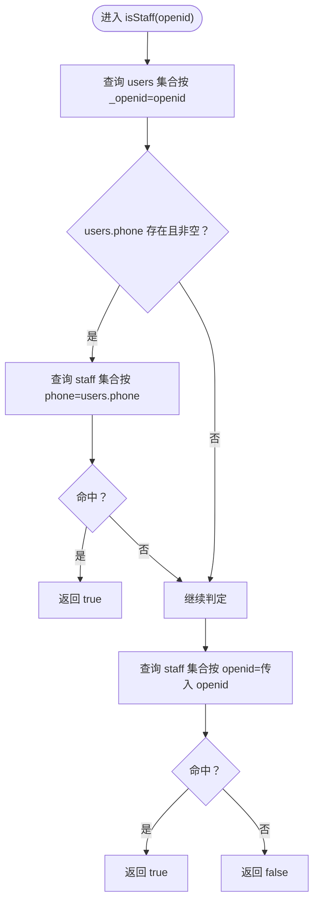
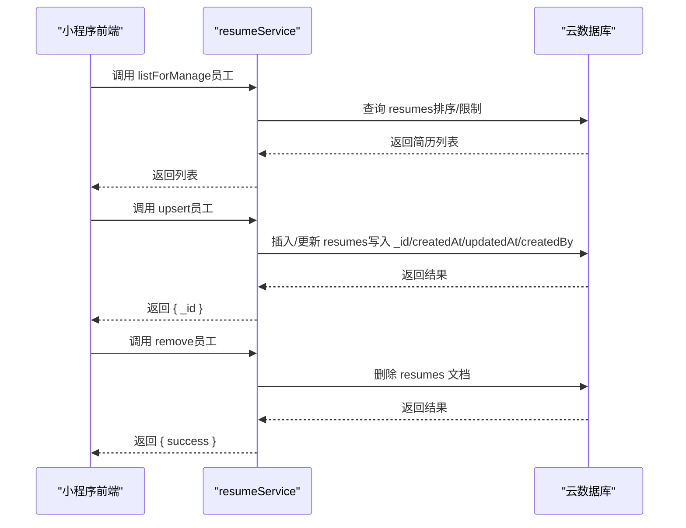
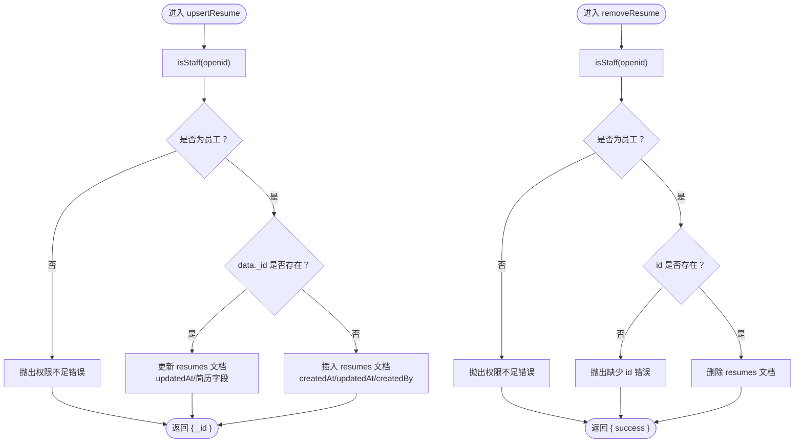
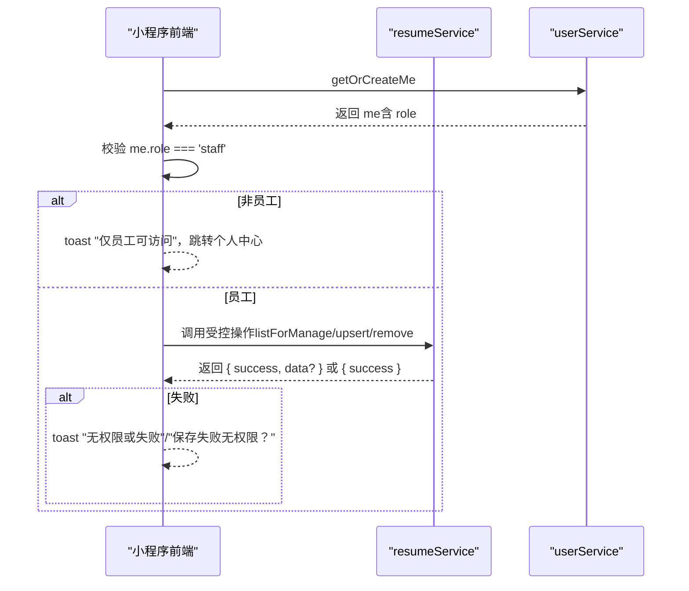
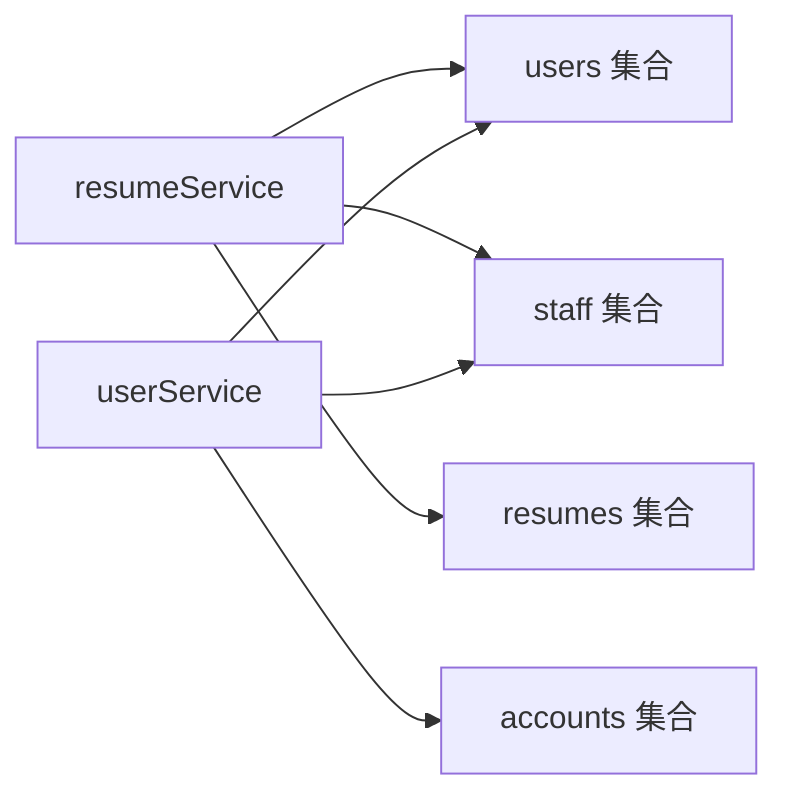

# 数据权限与归属

<cite>
**本文引用的文件**
- [cloudfunctions/resumeService/index.js](file://cloudfunctions/resumeService/index.js)
- [cloudfunctions/userService/index.js](file://cloudfunctions/userService/index.js)
- [miniprogram/pages/admin/resumeManage/index.js](file://miniprogram/pages/admin/resumeManage/index.js)
- [miniprogram/pages/admin/resumeEdit/index.js](file://miniprogram/pages/admin/resumeEdit/index.js)
- [PRD.md](file://PRD.md)
- [docs/简历管理方案深度分析.md](file://docs/简历管理方案深度分析.md)
</cite>

## 目录
1. [引言](#引言)
2. [项目结构](#项目结构)
3. [核心组件](#核心组件)
4. [架构总览](#架构总览)
5. [详细组件分析](#详细组件分析)
6. [依赖关系分析](#依赖关系分析)
7. [性能考量](#性能考量)
8. [故障排查指南](#故障排查指南)
9. [结论](#结论)

## 引言
本文件聚焦“安得褓贝”项目中简历集合（resumes）的数据权限与归属机制，围绕_createdBy_字段展开，系统性解析其作用、实现方式与安全边界。重点说明：
- _createdBy_字段如何在新增简历时由云函数自动写入，作为“数据归属”的关键锚点；
- 员工权限校验函数isStaff如何结合staff集合与users集合，实现基于微信openid的权限判定；
- 数据权限控制流程：员工仅能管理由自己创建或系统授权的简历；
- 云函数中upsert与remove操作的权限校验代码如何防止越权；
- 权限校验失败时的错误处理机制与前端反馈策略。

## 项目结构
项目采用“小程序前端 + 云函数后端 + 云数据库”的典型架构。与本主题直接相关的文件包括：
- 云函数：resumeService（简历服务）、userService（用户服务）
- 小程序页面：员工简历管理与编辑页面
- 文档：PRD与“简历管理方案深度分析”文档，明确数据模型与权限矩阵

图表来源
- [cloudfunctions/resumeService/index.js](file://cloudfunctions/resumeService/index.js#L1-L216)
- [cloudfunctions/userService/index.js](file://cloudfunctions/userService/index.js#L1-L289)
- [miniprogram/pages/admin/resumeManage/index.js](file://miniprogram/pages/admin/resumeManage/index.js#L1-L112)
- [miniprogram/pages/admin/resumeEdit/index.js](file://miniprogram/pages/admin/resumeEdit/index.js#L1-L211)

章节来源
- [cloudfunctions/resumeService/index.js](file://cloudfunctions/resumeService/index.js#L1-L216)
- [cloudfunctions/userService/index.js](file://cloudfunctions/userService/index.js#L1-L289)
- [PRD.md](file://PRD.md#L202-L353)

## 核心组件
- 云函数resumeService：负责简历的列表、详情、管理列表、新增/更新、删除等操作，并在新增时写入_createdBy_字段。
- 云函数userService：负责用户档案的获取/更新，以及isStaff权限判定。
- 小程序页面：员工端的简历管理与编辑页面，负责调用云函数并处理权限校验失败的前端提示。

章节来源
- [cloudfunctions/resumeService/index.js](file://cloudfunctions/resumeService/index.js#L135-L169)
- [cloudfunctions/userService/index.js](file://cloudfunctions/userService/index.js#L26-L47)
- [miniprogram/pages/admin/resumeManage/index.js](file://miniprogram/pages/admin/resumeManage/index.js#L29-L71)
- [miniprogram/pages/admin/resumeEdit/index.js](file://miniprogram/pages/admin/resumeEdit/index.js#L38-L51)

## 架构总览
下面的序列图展示了“新增简历”时_createdBy_字段的写入与权限校验流程，以及“删除简历”时的权限校验流程。

图表来源
- [cloudfunctions/resumeService/index.js](file://cloudfunctions/resumeService/index.js#L135-L169)
- [cloudfunctions/resumeService/index.js](file://cloudfunctions/resumeService/index.js#L171-L178)
- [cloudfunctions/userService/index.js](file://cloudfunctions/userService/index.js#L26-L47)

## 详细组件分析

### _createdBy_字段的作用与实现
- 字段含义：_createdBy_为字符串类型，存储简历创建者的微信openid，用于建立“数据归属”关系。
- 写入时机：在新增简历（upsert）时，云函数会将_createdBy_写入新建文档。
- 数据模型依据：PRD中明确resumes集合包含_createdBy_字段，且在新增时写入createdAt与createdBy。

图表来源
- [cloudfunctions/resumeService/index.js](file://cloudfunctions/resumeService/index.js#L135-L169)

章节来源
- [cloudfunctions/resumeService/index.js](file://cloudfunctions/resumeService/index.js#L135-L169)
- [PRD.md](file://PRD.md#L232-L253)

### 员工权限校验函数isStaff与staff集合
- isStaff判定逻辑：
  - 优先通过users集合中的phone字段匹配staff集合的phone；
  - 若users中无phone或为空，则回退到通过openid匹配staff集合的openid；
  - 任一匹配成功即判定为员工。
- 该逻辑确保了两种白名单维护方式的兼容：手机号白名单与openid白名单。

图表来源
- [cloudfunctions/userService/index.js](file://cloudfunctions/userService/index.js#L26-L47)
- [cloudfunctions/resumeService/index.js](file://cloudfunctions/resumeService/index.js#L26-L56)

章节来源
- [cloudfunctions/userService/index.js](file://cloudfunctions/userService/index.js#L26-L47)
- [cloudfunctions/resumeService/index.js](file://cloudfunctions/resumeService/index.js#L26-L56)

### 数据归属与权限控制流程
- 员工权限：
  - 通过isStaff判定为员工后，方可执行管理列表、新增/编辑、删除等操作；
  - 管理态详情（forManage=true）也强制要求员工身份。
- 数据归属：
  - 新增简历时写入_createdBy_=openid，形成“创建者=数据归属”的绑定；
  - 员工可管理所有简历（不受_createdBy_限制）；
  - 若后续引入“阿姨角色”，则可通过_createdBy_实现“仅能管理自己的简历”。

图表来源
- [cloudfunctions/resumeService/index.js](file://cloudfunctions/resumeService/index.js#L122-L133)
- [cloudfunctions/resumeService/index.js](file://cloudfunctions/resumeService/index.js#L135-L169)
- [cloudfunctions/resumeService/index.js](file://cloudfunctions/resumeService/index.js#L171-L178)

章节来源
- [cloudfunctions/resumeService/index.js](file://cloudfunctions/resumeService/index.js#L122-L133)
- [cloudfunctions/resumeService/index.js](file://cloudfunctions/resumeService/index.js#L135-L169)
- [cloudfunctions/resumeService/index.js](file://cloudfunctions/resumeService/index.js#L171-L178)

### 云函数中upsert与remove的权限校验
- upsert权限校验：
  - 调用isStaff(openid)，非员工直接抛错；
  - 新增时写入createdAt、updatedAt、createdBy；
  - 更新时仅写入updatedAt与简历字段。
- remove权限校验：
  - 调用isStaff(openid)，非员工直接抛错；
  - 校验id存在性，再执行删除。

图表来源
- [cloudfunctions/resumeService/index.js](file://cloudfunctions/resumeService/index.js#L135-L169)
- [cloudfunctions/resumeService/index.js](file://cloudfunctions/resumeService/index.js#L171-L178)

章节来源
- [cloudfunctions/resumeService/index.js](file://cloudfunctions/resumeService/index.js#L135-L169)
- [cloudfunctions/resumeService/index.js](file://cloudfunctions/resumeService/index.js#L171-L178)

### 权限校验失败的错误处理机制
- 云函数层：
  - isStaff判定失败时抛出错误；
  - upsert/remove在非员工时抛出错误；
  - 云函数统一捕获异常并返回{ success: false, errMsg }。
- 前端层：
  - 管理页与编辑页在调用云函数失败时，统一toast提示“无权限或失败”、“保存失败（无权限？）”等；
  - 管理页在进入时先调用userService.getOrCreateMe并校验role，非员工则提示并跳转个人中心。

图表来源
- [miniprogram/pages/admin/resumeManage/index.js](file://miniprogram/pages/admin/resumeManage/index.js#L29-L71)
- [miniprogram/pages/admin/resumeEdit/index.js](file://miniprogram/pages/admin/resumeEdit/index.js#L38-L51)
- [cloudfunctions/resumeService/index.js](file://cloudfunctions/resumeService/index.js#L180-L215)

章节来源
- [miniprogram/pages/admin/resumeManage/index.js](file://miniprogram/pages/admin/resumeManage/index.js#L29-L71)
- [miniprogram/pages/admin/resumeEdit/index.js](file://miniprogram/pages/admin/resumeEdit/index.js#L38-L51)
- [cloudfunctions/resumeService/index.js](file://cloudfunctions/resumeService/index.js#L180-L215)

### 与“阿姨角色”的扩展关系（基于方案文档）
- 当引入“阿姨角色”时，可利用_createdBy_字段实现“仅能管理自己的简历”：
  - 员工：可管理所有简历；
  - 阿姨：仅能编辑/查看_createdBy_=自身openid的简历。
- 该扩展已在“简历管理方案深度分析”文档中给出示意实现，包括：
  - 在accounts集合增加role字段；
  - 在users集合同步role；
  - 在resumeService中按角色分支处理列表与upsert逻辑。

章节来源
- [docs/简历管理方案深度分析.md](file://docs/简历管理方案深度分析.md#L96-L220)
- [PRD.md](file://PRD.md#L262-L281)

## 依赖关系分析
- resumeService依赖：
  - users集合：读取用户信息（role、phone等）；
  - staff集合：isStaff判定；
  - resumes集合：CRUD操作。
- userService依赖：
  - users集合：获取/更新用户档案；
  - staff集合：isStaff判定；
  - accounts集合：账号密码登录时同步role与openid。

图表来源
- [cloudfunctions/resumeService/index.js](file://cloudfunctions/resumeService/index.js#L1-L24)
- [cloudfunctions/userService/index.js](file://cloudfunctions/userService/index.js#L1-L24)

章节来源
- [cloudfunctions/resumeService/index.js](file://cloudfunctions/resumeService/index.js#L1-L24)
- [cloudfunctions/userService/index.js](file://cloudfunctions/userService/index.js#L1-L24)

## 性能考量
- 集合初始化：首次运行自动创建users/staff/resumes集合，避免新环境报错。
- 查询优化：
  - listForManage固定返回最近更新的100条，避免全表扫描；
  - detail默认无staff校验，减少不必要的权限检查。
- 写入优化：
  - upsert仅在新增时写入createdAt/createdBy，更新时仅写入updatedAt，降低冗余字段写入。

章节来源
- [cloudfunctions/resumeService/index.js](file://cloudfunctions/resumeService/index.js#L10-L24)
- [cloudfunctions/resumeService/index.js](file://cloudfunctions/resumeService/index.js#L122-L133)
- [cloudfunctions/resumeService/index.js](file://cloudfunctions/resumeService/index.js#L135-L169)

## 故障排查指南
- 常见错误与定位
  - “无权限或失败”：通常由isStaff判定失败或云函数抛错导致。检查：
    - staff集合是否包含该openid或对应phone；
    - 前端是否正确调用getOrCreateMe并校验role；
    - 云函数是否捕获异常并返回errMsg。
  - “缺少 id”：remove操作未传入id。检查调用侧参数。
- 前端提示
  - 管理页与编辑页在调用云函数失败时，统一toast提示，便于快速定位问题。
- 数据一致性
  - 新增简历时_createdBy_必须为当前openid，确保数据归属与审计链路清晰。

章节来源
- [cloudfunctions/resumeService/index.js](file://cloudfunctions/resumeService/index.js#L171-L178)
- [cloudfunctions/resumeService/index.js](file://cloudfunctions/resumeService/index.js#L180-L215)
- [miniprogram/pages/admin/resumeManage/index.js](file://miniprogram/pages/admin/resumeManage/index.js#L51-L71)
- [miniprogram/pages/admin/resumeEdit/index.js](file://miniprogram/pages/admin/resumeEdit/index.js#L172-L210)

## 结论
- _createdBy_字段是实现“数据归属”的关键：新增简历时写入创建者openid，形成清晰的数据所有权边界。
- isStaff函数通过staff集合与users集合的双重判定，确保员工权限的准确授予，兼顾手机号白名单与openid白名单两种维护方式。
- 云函数在upsert与remove上严格执行权限校验，配合前端的二次拦截与错误提示，有效防止越权操作。
- 若引入“阿姨角色”，可利用_createdBy_字段实现“仅能管理自己的简历”，进一步细化数据权限控制。