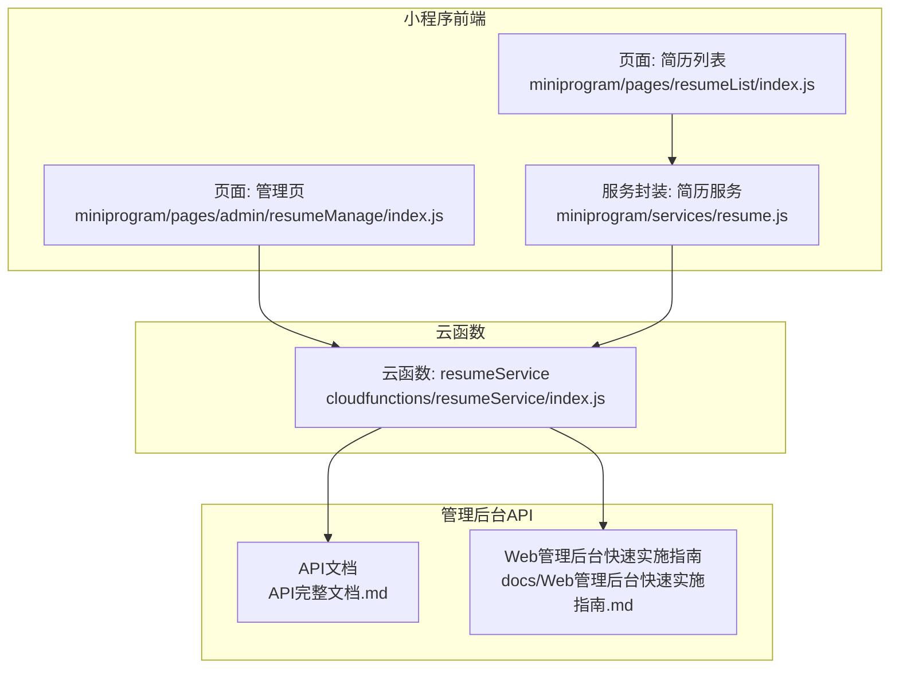
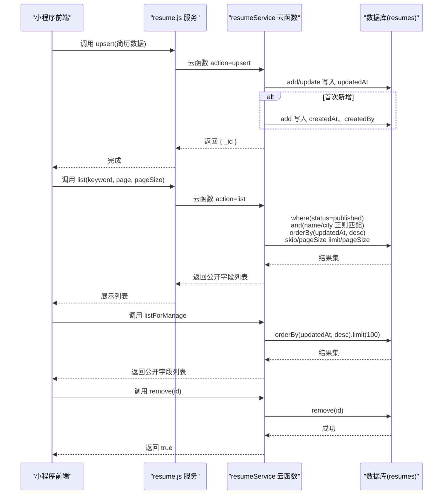
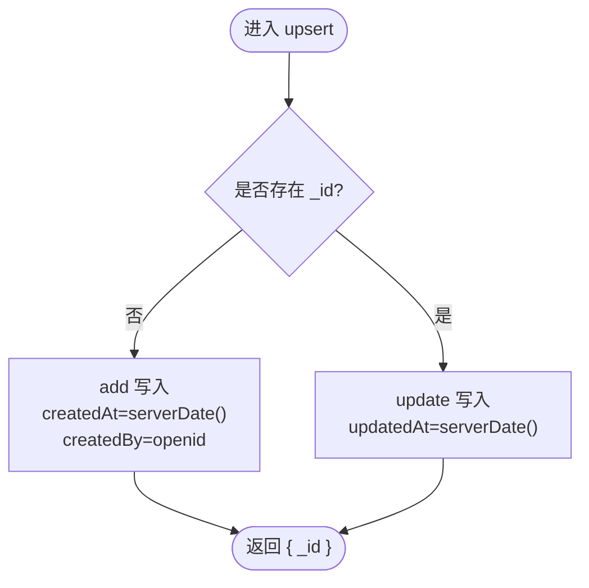
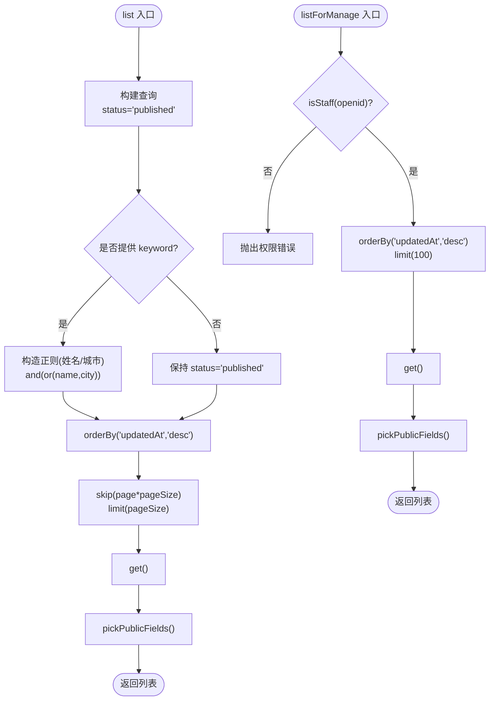
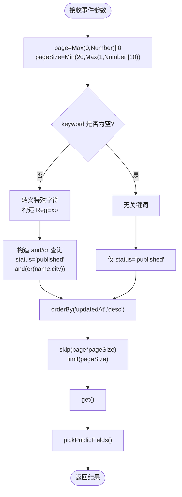
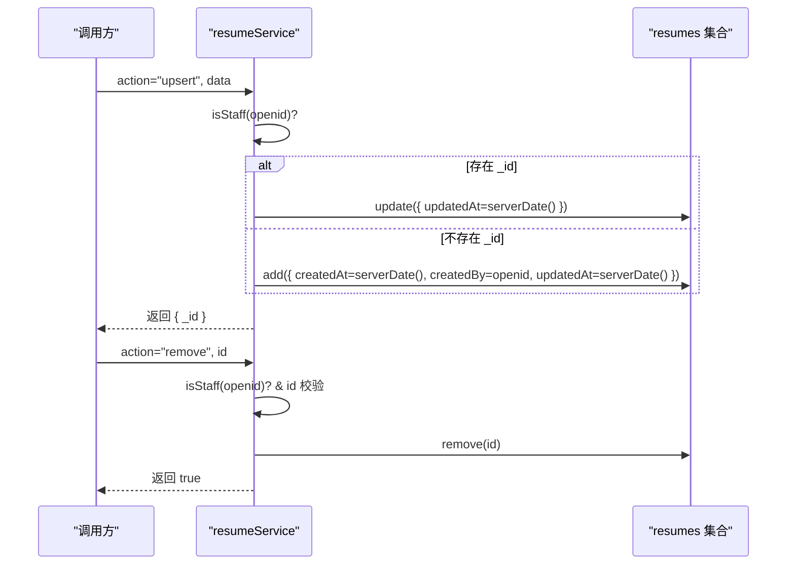
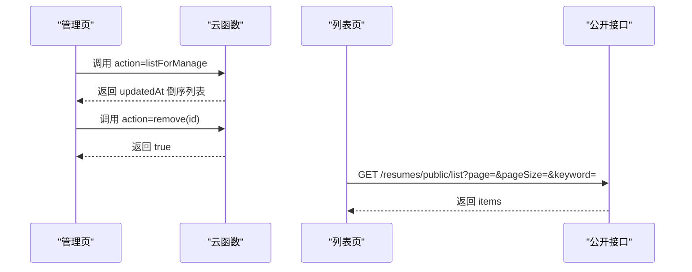
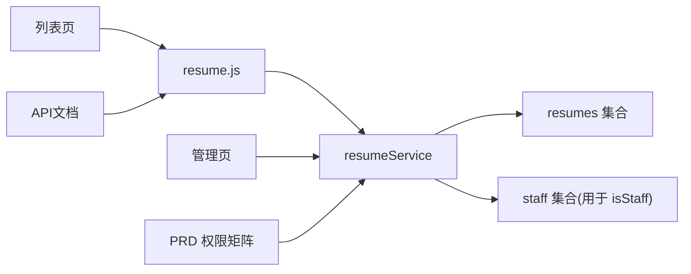

# 数据生命周期管理

<cite>
**本文引用的文件**
- [cloudfunctions/resumeService/index.js](file://cloudfunctions/resumeService/index.js)
- [miniprogram/services/resume.js](file://miniprogram/services/resume.js)
- [miniprogram/pages/admin/resumeManage/index.js](file://miniprogram/pages/admin/resumeManage/index.js)
- [miniprogram/pages/resumeList/index.js](file://miniprogram/pages/resumeList/index.js)
- [API完整文档.md](file://API完整文档.md)
- [PRD.md](file://PRD.md)
- [docs/Web管理后台快速实施指南.md](file://docs/Web管理后台快速实施指南.md)
</cite>

## 目录
1. [简介](#简介)
2. [项目结构](#项目结构)
3. [核心组件](#核心组件)
4. [架构总览](#架构总览)
5. [详细组件分析](#详细组件分析)
6. [依赖关系分析](#依赖关系分析)
7. [性能考量](#性能考量)
8. [故障排查指南](#故障排查指南)
9. [结论](#结论)
10. [附录](#附录)

## 简介
本文件围绕安得褓贝“resumes”集合的数据生命周期进行系统化梳理，重点说明：
- 时间戳字段管理：_createdAt、updatedAt 的写入与更新机制
- 列表与管理列表的排序策略：按 updatedAt 倒序
- 完整生命周期：通过 upsert 新增/更新，再通过 remove 删除
- 分页查询与关键词搜索：page/pageSize 参数与基于姓名/城市的正则模糊匹配
- 最佳实践与性能优化建议

## 项目结构
本项目采用前后端分离与云函数协同的模式：
- 小程序前端负责调用云函数与公开接口，展示简历列表、详情与管理操作
- 云函数 resumeService 提供简历的列表、详情、管理列表、新增/更新、删除等能力
- 管理后台 API 文档与 PRD 明确了接口定义、权限与排序策略

图表来源
- [cloudfunctions/resumeService/index.js](file://cloudfunctions/resumeService/index.js#L1-L216)
- [miniprogram/services/resume.js](file://miniprogram/services/resume.js#L1-L239)
- [miniprogram/pages/admin/resumeManage/index.js](file://miniprogram/pages/admin/resumeManage/index.js#L1-L112)
- [miniprogram/pages/resumeList/index.js](file://miniprogram/pages/resumeList/index.js#L1-L698)
- [API完整文档.md](file://API完整文档.md#L300-L499)
- [docs/Web管理后台快速实施指南.md](file://docs/Web管理后台快速实施指南.md#L75-L245)

章节来源
- [cloudfunctions/resumeService/index.js](file://cloudfunctions/resumeService/index.js#L1-L216)
- [miniprogram/services/resume.js](file://miniprogram/services/resume.js#L1-L239)
- [miniprogram/pages/admin/resumeManage/index.js](file://miniprogram/pages/admin/resumeManage/index.js#L1-L112)
- [miniprogram/pages/resumeList/index.js](file://miniprogram/pages/resumeList/index.js#L1-L698)
- [API完整文档.md](file://API完整文档.md#L300-L499)
- [docs/Web管理后台快速实施指南.md](file://docs/Web管理后台快速实施指南.md#L75-L245)

## 核心组件
- 云函数 resumeService：提供 list、detail、listForManage、upsert、remove 等动作，统一管理 resumes 集合
- 小程序服务封装 resume.js：封装公开接口调用，供页面组件使用
- 管理页与列表页：分别调用云函数与公开接口，实现管理与浏览体验
- API 文档与 PRD：明确接口定义、权限矩阵与排序策略

章节来源
- [cloudfunctions/resumeService/index.js](file://cloudfunctions/resumeService/index.js#L180-L216)
- [miniprogram/services/resume.js](file://miniprogram/services/resume.js#L1-L239)
- [PRD.md](file://PRD.md#L256-L312)

## 架构总览
简历数据生命周期的关键流程如下：
- 新增/更新：通过 upsert 写入 createdAt（首次）与 updatedAt（每次），并设置 createdBy（云函数侧）
- 列表查询：list 对 published 状态进行过滤，并按 updatedAt 倒序，支持关键词（姓名/城市）正则模糊匹配
- 管理列表：listForManage 按 updatedAt 倒序，返回最多 100 条
- 删除：remove 仅允许 staff 角色执行

图表来源
- [cloudfunctions/resumeService/index.js](file://cloudfunctions/resumeService/index.js#L78-L178)
- [miniprogram/services/resume.js](file://miniprogram/services/resume.js#L1-L239)
- [miniprogram/pages/admin/resumeManage/index.js](file://miniprogram/pages/admin/resumeManage/index.js#L51-L111)
- [miniprogram/pages/resumeList/index.js](file://miniprogram/pages/resumeList/index.js#L330-L380)

## 详细组件分析

### 时间戳字段管理：createdAt 与 updatedAt
- 写入时机
  - 新增时：首次 add 写入 createdAt 与 createdBy
  - 更新时：每次 update 写入 updatedAt
- 服务器时间：均使用 db.serverDate()，确保时钟一致性
- 字段可见范围：对外公开字段 pickPublicFields 包含 createdAt/updatedAt，便于前端展示

图表来源
- [cloudfunctions/resumeService/index.js](file://cloudfunctions/resumeService/index.js#L135-L169)

章节来源
- [cloudfunctions/resumeService/index.js](file://cloudfunctions/resumeService/index.js#L135-L169)

### 列表与管理列表排序：按 updatedAt 倒序
- 公开列表 list：固定 status=published，按 updatedAt 倒序，支持关键词（姓名/城市）正则模糊匹配
- 管理列表 listForManage：按 updatedAt 倒序，限制最多 100 条
- 详情 detail：默认任何用户可查看；当 forManage=true 时仅 staff 可查看

图表来源
- [cloudfunctions/resumeService/index.js](file://cloudfunctions/resumeService/index.js#L78-L133)

章节来源
- [cloudfunctions/resumeService/index.js](file://cloudfunctions/resumeService/index.js#L78-L133)
- [PRD.md](file://PRD.md#L256-L312)

### 分页查询与关键词搜索
- 分页参数
  - page：从 0 开始（云函数内部转换为从 0 开始）
  - pageSize：最小 1，最大 20（云函数内部约束）
- 关键词搜索
  - 仅对姓名与城市字段进行正则模糊匹配
  - 使用 db.RegExp 构造正则表达式，忽略大小写
- 小程序端调用
  - 小程序公开接口调用 resume.js 的 getResumeList/getResumeListMiniprogram，传入 page/pageSize/keyword 等参数

图表来源
- [cloudfunctions/resumeService/index.js](file://cloudfunctions/resumeService/index.js#L78-L106)
- [miniprogram/services/resume.js](file://miniprogram/services/resume.js#L16-L45)

章节来源
- [cloudfunctions/resumeService/index.js](file://cloudfunctions/resumeService/index.js#L78-L106)
- [miniprogram/services/resume.js](file://miniprogram/services/resume.js#L16-L45)

### 完整生命周期：upsert 与 remove
- upsert
  - staff 角色校验
  - 若 data._id 存在则 update，否则 add
  - 新增时写入 createdAt 与 createdBy；更新时写入 updatedAt
- remove
  - staff 角色校验与 id 校验
  - 删除指定简历

图表来源
- [cloudfunctions/resumeService/index.js](file://cloudfunctions/resumeService/index.js#L135-L178)
- [PRD.md](file://PRD.md#L256-L312)

章节来源
- [cloudfunctions/resumeService/index.js](file://cloudfunctions/resumeService/index.js#L135-L178)
- [PRD.md](file://PRD.md#L256-L312)

### 前端交互与调用链
- 管理页（resumeManage）
  - 调用云函数 action=listForManage，按 updatedAt 倒序展示
  - 删除按钮触发 remove，删除成功后刷新列表
- 列表页（resumeList）
  - 通过 resume.js 的 getResumeList 调用公开接口，传入 page/pageSize/keyword
  - 支持筛选与排序（默认按 updatedAt）

图表来源
- [miniprogram/pages/admin/resumeManage/index.js](file://miniprogram/pages/admin/resumeManage/index.js#L51-L111)
- [miniprogram/pages/resumeList/index.js](file://miniprogram/pages/resumeList/index.js#L330-L380)
- [miniprogram/services/resume.js](file://miniprogram/services/resume.js#L16-L45)

章节来源
- [miniprogram/pages/admin/resumeManage/index.js](file://miniprogram/pages/admin/resumeManage/index.js#L1-L112)
- [miniprogram/pages/resumeList/index.js](file://miniprogram/pages/resumeList/index.js#L330-L380)
- [miniprogram/services/resume.js](file://miniprogram/services/resume.js#L16-L45)

## 依赖关系分析
- 云函数 resumeService 依赖数据库操作与权限校验（isStaff）
- 小程序端通过 resume.js 封装请求，分别调用云函数与公开接口
- 管理后台 API 文档与 PRD 明确了接口定义与权限矩阵，与云函数行为保持一致

图表来源
- [cloudfunctions/resumeService/index.js](file://cloudfunctions/resumeService/index.js#L1-L216)
- [miniprogram/services/resume.js](file://miniprogram/services/resume.js#L1-L239)
- [PRD.md](file://PRD.md#L256-L312)
- [API完整文档.md](file://API完整文档.md#L300-L499)

章节来源
- [cloudfunctions/resumeService/index.js](file://cloudfunctions/resumeService/index.js#L1-L216)
- [miniprogram/services/resume.js](file://miniprogram/services/resume.js#L1-L239)
- [PRD.md](file://PRD.md#L256-L312)
- [API完整文档.md](file://API完整文档.md#L300-L499)

## 性能考量
- 排序与索引
  - updatedAt 倒序排序是高频需求，建议在 resumes 集合建立复合索引：status + updatedAt（降序），以提升 list/listForManage 的查询性能
- 分页与限制
  - 云函数对 pageSize 设有上限（最大 20），避免大页扫描
  - listForManage 限制最多 100 条，减少一次性返回大量数据
- 正则匹配
  - 关键词正则仅作用于姓名与城市，建议在这些字段建立索引，或考虑使用更高效的全文检索方案（如云开发全文检索）
- 前端预加载
  - 列表页对视频资源进行预加载与缓存，建议控制并发与缓存容量，避免内存占用过高

[本节为通用性能建议，不直接分析具体文件]

## 故障排查指南
- 权限错误
  - 现象：调用 listForManage/upsert/remove 返回“无权限或失败”
  - 排查：确认调用者是否为 staff（通过 isStaff 校验），以及 openid 是否正确传递
- 缺少 id
  - 现象：remove 抛出“缺少 id”
  - 排查：确认传入的 id 是否有效
- 关键词无效
  - 现象：list 无结果或结果异常
  - 排查：确认 keyword 是否为空；正则转义是否正确
- 服务器时间差异
  - 现象：createdAt/updatedAt 与本地时间不一致
  - 排查：确认使用 db.serverDate()，避免客户端时间偏差

章节来源
- [cloudfunctions/resumeService/index.js](file://cloudfunctions/resumeService/index.js#L108-L178)
- [PRD.md](file://PRD.md#L256-L312)

## 结论
- 本项目通过云函数 resumeService 统一管理 resumes 集合的生命周期，明确实现了：
  - 新增/更新时的时间戳写入与角色校验
  - 列表与管理列表的排序策略与分页限制
  - 关键词搜索的正则匹配范围
- 建议在生产环境中完善索引与缓存策略，持续优化查询与渲染性能。

[本节为总结性内容，不直接分析具体文件]

## 附录
- 管理后台 API 参考（与云函数行为一致）
  - 列表：按 updatedAt 倒序，limit 100
  - 创建/更新：使用 serverDate() 写入 createdAt/updatedAt
  - 删除：需要权限校验

章节来源
- [docs/Web管理后台快速实施指南.md](file://docs/Web管理后台快速实施指南.md#L188-L245)
- [API完整文档.md](file://API完整文档.md#L300-L499)