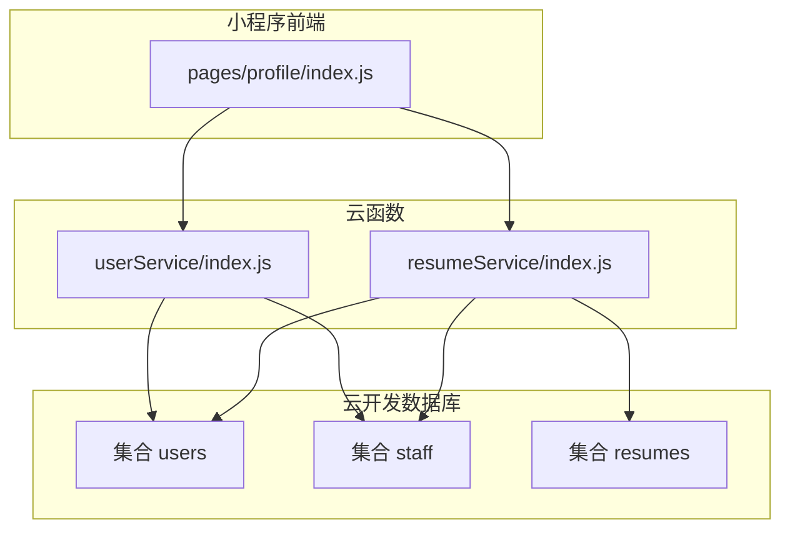
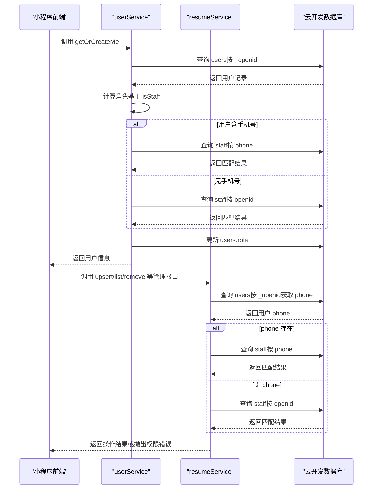
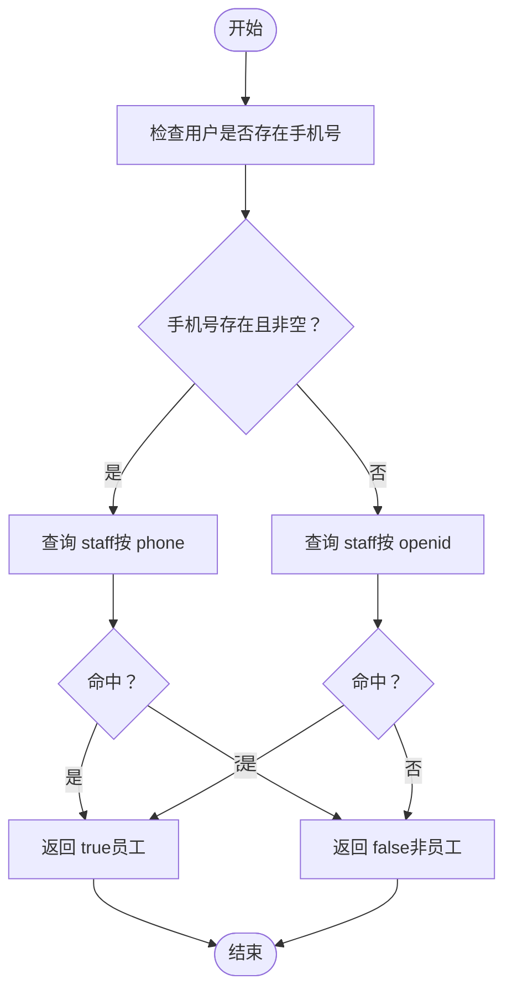
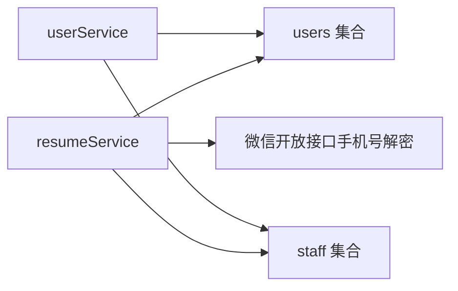

# staff集合

<cite>
**本文引用的文件**
- [cloudfunctions/userService/index.js](file://cloudfunctions/userService/index.js)
- [cloudfunctions/resumeService/index.js](file://cloudfunctions/resumeService/index.js)
- [cloudfunctions/userService/config.json](file://cloudfunctions/userService/config.json)
- [cloudfunctions/resumeService/config.json](file://cloudfunctions/resumeService/config.json)
- [miniprogram/pages/profile/index.js](file://miniprogram/pages/profile/index.js)
- [PRD.md](file://PRD.md)
</cite>

## 目录
1. [简介](#简介)
2. [项目结构](#项目结构)
3. [核心组件](#核心组件)
4. [架构总览](#架构总览)
5. [详细组件分析](#详细组件分析)
6. [依赖分析](#依赖分析)
7. [性能考虑](#性能考虑)
8. [故障排查指南](#故障排查指南)
9. [结论](#结论)
10. [附录](#附录)

## 简介
本文件为“安得褓贝”项目中“staff集合”的权威数据模型与权限控制说明。该集合作为员工白名单的核心权限控制机制，用于判定用户是否具备“员工”角色，从而决定其能否访问管理类功能。集合字段简洁明确，包含文档唯一标识与员工微信openid，用于身份匹配。同时，系统在权限判定上实现了双重验证机制：优先通过用户的手机号匹配白名单，若无手机号则回退到openid匹配，确保兼容历史数据与新流程并存。

此外，本文还阐述了staff集合与users集合的关联关系、数据安全策略、白名单维护流程与访问控制机制，并通过实际代码示例路径展示在userService与resumeService中如何调用该集合进行员工身份验证，强调其在保障系统安全性与实现角色权限分离中的关键作用。

## 项目结构
围绕staff集合的关键文件与职责如下：
- cloudfunctions/userService/index.js：负责用户态初始化、角色判定与手机号授权登录，内部通过isStaff函数查询staff集合进行权限校验。
- cloudfunctions/resumeService/index.js：负责简历相关服务，内部通过isStaff函数查询staff集合进行管理操作的权限校验。
- cloudfunctions/userService/config.json：声明云函数所需开放接口权限（如手机号解密）。
- cloudfunctions/resumeService/config.json：声明云函数所需开放接口权限。
- miniprogram/pages/profile/index.js：小程序前端页面，通过云函数调用获取用户信息并触发角色判定。
- PRD.md：产品需求文档，给出staff集合字段定义与用途说明。

图表来源
- [cloudfunctions/userService/index.js](file://cloudfunctions/userService/index.js#L1-L120)
- [cloudfunctions/resumeService/index.js](file://cloudfunctions/resumeService/index.js#L1-L120)
- [miniprogram/pages/profile/index.js](file://miniprogram/pages/profile/index.js#L1-L53)

章节来源
- [cloudfunctions/userService/index.js](file://cloudfunctions/userService/index.js#L1-L120)
- [cloudfunctions/resumeService/index.js](file://cloudfunctions/resumeService/index.js#L1-L120)
- [miniprogram/pages/profile/index.js](file://miniprogram/pages/profile/index.js#L1-L53)

## 核心组件
- staff集合
  - 字段定义
    - _id：文档唯一标识
    - openid：员工微信openid，用于权限匹配
  - 用途：作为员工白名单，支撑isStaff函数进行权限判定
- users集合
  - 与staff集合的关联：当用户存在手机号时，优先以手机号匹配staff白名单；否则回退到以openid匹配
  - 用户角色role由isStaff动态计算并持久化
- resumeService中的isStaff
  - 从users集合读取用户的phone字段，优先以phone匹配staff白名单，再回退到openid匹配
- userService中的isStaff
  - 支持显式传入phone参数，优先以phone匹配staff白名单，再回退到openid匹配

章节来源
- [PRD.md](file://PRD.md#L222-L231)
- [cloudfunctions/userService/index.js](file://cloudfunctions/userService/index.js#L26-L47)
- [cloudfunctions/resumeService/index.js](file://cloudfunctions/resumeService/index.js#L26-L56)

## 架构总览
下图展示了小程序前端、云函数与数据库之间的交互，以及权限判定流程。

图表来源
- [cloudfunctions/userService/index.js](file://cloudfunctions/userService/index.js#L26-L84)
- [cloudfunctions/resumeService/index.js](file://cloudfunctions/resumeService/index.js#L26-L56)

## 详细组件分析

### 数据模型与字段定义
- staff集合
  - 字段
    - _id：字符串，文档唯一标识
    - openid：字符串，员工微信openid
  - 用途：作为员工白名单，isStaff函数据此判定用户是否具备“员工”角色
- users集合
  - 与staff集合的关系：当用户存在手机号时，优先以手机号匹配staff白名单；否则回退到以openid匹配
  - 用户角色role由isStaff动态计算并持久化到users集合

章节来源
- [PRD.md](file://PRD.md#L222-L231)
- [cloudfunctions/userService/index.js](file://cloudfunctions/userService/index.js#L49-L84)
- [cloudfunctions/resumeService/index.js](file://cloudfunctions/resumeService/index.js#L26-L56)

### 权限判定流程（双重验证机制）
- 优先级策略
  - 若用户存在手机号，则优先以手机号匹配staff集合
  - 若用户不存在手机号或手机号为空，则回退到以openid匹配staff集合
- 适用范围
  - userService：在用户态初始化与更新时，动态重算角色
  - resumeService：在执行管理类操作前，先校验是否为员工

图表来源
- [cloudfunctions/userService/index.js](file://cloudfunctions/userService/index.js#L26-L47)
- [cloudfunctions/resumeService/index.js](file://cloudfunctions/resumeService/index.js#L26-L56)

章节来源
- [cloudfunctions/userService/index.js](file://cloudfunctions/userService/index.js#L26-L47)
- [cloudfunctions/resumeService/index.js](file://cloudfunctions/resumeService/index.js#L26-L56)

### 在userService中的调用示例
- 初始化与更新用户态
  - getOrCreateMe：查询users集合，若存在则根据isStaff重算角色并更新；若不存在则创建用户并按isStaff设置初始角色
  - updateMe：更新用户信息（如昵称、头像、手机号），随后重新获取用户态以刷新角色
- 手机号授权登录
  - loginByPhone：通过微信手机号接口获取手机号，更新users集合中的phone字段，随后重新获取用户态以刷新角色

章节来源
- [cloudfunctions/userService/index.js](file://cloudfunctions/userService/index.js#L49-L103)
- [cloudfunctions/userService/index.js](file://cloudfunctions/userService/index.js#L105-L161)

### 在resumeService中的调用示例
- 管理类接口前置校验
  - getDetail、listForManage、upsertResume、removeResume：均在执行前调用isStaff校验，非员工将被拒绝
- isStaff实现要点
  - 先查询users集合获取用户的phone，再按优先级匹配staff集合

章节来源
- [cloudfunctions/resumeService/index.js](file://cloudfunctions/resumeService/index.js#L107-L178)
- [cloudfunctions/resumeService/index.js](file://cloudfunctions/resumeService/index.js#L26-L56)

### 与users集合的关联关系
- 关联点
  - users集合的phone字段作为staff集合phone字段的映射依据
  - users集合的role字段由isStaff动态计算并持久化
- 影响
  - 当用户绑定手机号后，系统优先以手机号匹配白名单，提升匹配准确性与可维护性
  - 当用户未绑定手机号时，仍可通过openid匹配白名单，保证兼容性

章节来源
- [cloudfunctions/userService/index.js](file://cloudfunctions/userService/index.js#L49-L84)
- [cloudfunctions/resumeService/index.js](file://cloudfunctions/resumeService/index.js#L26-L56)

### 数据安全策略与访问控制
- 白名单维护流程
  - 当前代码未体现staff集合的录入流程（如后台工具、控制台手工录入等），PRD指出该问题
  - 建议：建立标准化的白名单维护流程，确保仅授权人员可添加/删除员工
- 访问控制机制
  - 前端入口控制：管理页入口仅在用户角色为员工时展示，但仍可被用户手动访问
  - 后端强制校验：所有管理类接口在执行前均调用isStaff进行后端校验，拒绝非员工访问
- 敏感信息保护
  - 云函数权限最小化：仅声明必要的开放接口权限（如手机号解密）
  - 日志与审计：建议在关键权限操作处增加日志记录，便于审计与追踪

章节来源
- [PRD.md](file://PRD.md#L339-L341)
- [cloudfunctions/userService/config.json](file://cloudfunctions/userService/config.json#L1-L6)
- [cloudfunctions/resumeService/config.json](file://cloudfunctions/resumeService/config.json#L1-L6)
- [cloudfunctions/resumeService/index.js](file://cloudfunctions/resumeService/index.js#L107-L178)

## 依赖分析
- 组件耦合
  - resumeService依赖users集合的phone字段与staff集合进行权限判定
  - userService依赖staff集合进行用户角色判定，并在用户态初始化与更新时使用
- 外部依赖
  - 微信开放接口：手机号解密（用于手机号授权登录）
- 潜在风险
  - 若users集合缺失phone字段或值为空，权限判定将回退至openid匹配，可能影响准确性
  - 白名单维护流程缺失可能导致误放行或误封禁

图表来源
- [cloudfunctions/resumeService/index.js](file://cloudfunctions/resumeService/index.js#L26-L56)
- [cloudfunctions/userService/index.js](file://cloudfunctions/userService/index.js#L105-L161)
- [cloudfunctions/userService/config.json](file://cloudfunctions/userService/config.json#L1-L6)

章节来源
- [cloudfunctions/resumeService/index.js](file://cloudfunctions/resumeService/index.js#L26-L56)
- [cloudfunctions/userService/index.js](file://cloudfunctions/userService/index.js#L105-L161)
- [cloudfunctions/userService/config.json](file://cloudfunctions/userService/config.json#L1-L6)

## 性能考虑
- 查询优化
  - isStaff在存在手机号时优先按phone查询staff集合，命中率更高，减少不必要的openid查询
  - 建议在staff集合上为phone字段建立索引，以提升查询性能
- 调用链路
  - resumeService在每次管理操作前都会进行isStaff校验，应尽量避免重复查询users集合，可在上层缓存用户phone
- 并发与一致性
  - 用户更新手机号与权限判定之间存在并发风险，建议在关键路径采用事务或幂等设计，确保角色判定的一致性

## 故障排查指南
- 现象：非员工也能访问管理页
  - 排查：确认后端isStaff校验是否生效；检查前端入口控制是否被绕过
- 现象：手机号授权登录后角色未更新
  - 排查：确认loginByPhone流程是否成功更新users集合phone字段；确认后续getOrCreateMe是否被调用以刷新角色
- 现象：权限判定不稳定（有时有效、有时无效）
  - 排查：确认users集合phone字段是否正确写入；确认staff集合中是否存在对应phone或openid记录
- 现象：白名单维护困难
  - 排查：当前代码未体现白名单维护流程，需补充后台工具或控制台流程

章节来源
- [cloudfunctions/resumeService/index.js](file://cloudfunctions/resumeService/index.js#L107-L178)
- [cloudfunctions/userService/index.js](file://cloudfunctions/userService/index.js#L49-L103)
- [PRD.md](file://PRD.md#L339-L341)

## 结论
staff集合作为安得褓贝项目员工白名单与权限判定的核心数据模型，通过“手机号优先、openid回退”的双重验证机制，兼顾了新老流程的兼容性与可维护性。结合users集合的角色持久化与resumeService的后端强制校验，系统实现了较为完善的角色权限分离与访问控制。建议尽快补齐白名单维护流程与前端手机号采集入口，以进一步提升系统的安全性与用户体验。

## 附录
- 实际代码示例路径（不展示具体代码内容）
  - 用户态初始化与角色判定（users集合与staff集合交互）
    - [cloudfunctions/userService/index.js](file://cloudfunctions/userService/index.js#L49-L84)
  - 用户信息更新与角色刷新
    - [cloudfunctions/userService/index.js](file://cloudfunctions/userService/index.js#L86-L103)
  - 手机号授权登录（手机号解密与用户态刷新）
    - [cloudfunctions/userService/index.js](file://cloudfunctions/userService/index.js#L105-L161)
  - 管理类接口前置权限校验（resumeService）
    - [cloudfunctions/resumeService/index.js](file://cloudfunctions/resumeService/index.js#L107-L178)
  - isStaff函数（users集合与staff集合交互）
    - [cloudfunctions/resumeService/index.js](file://cloudfunctions/resumeService/index.js#L26-L56)
    - [cloudfunctions/userService/index.js](file://cloudfunctions/userService/index.js#L26-L47)
  - 前端调用云函数获取用户信息
    - [miniprogram/pages/profile/index.js](file://miniprogram/pages/profile/index.js#L19-L35)
  - staff集合字段定义与用途
    - [PRD.md](file://PRD.md#L222-L231)