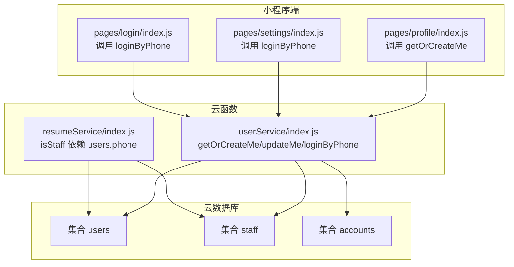
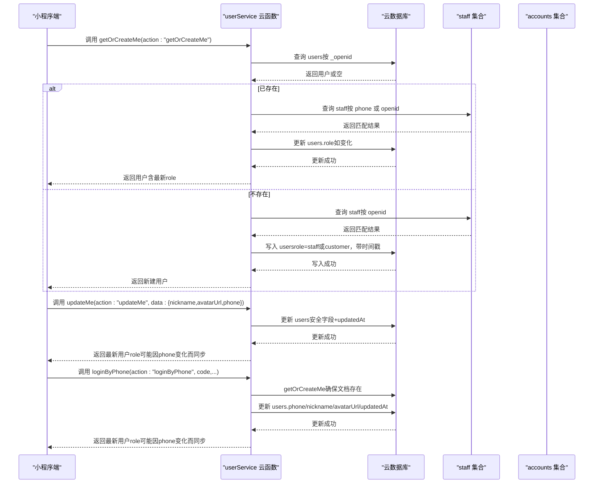
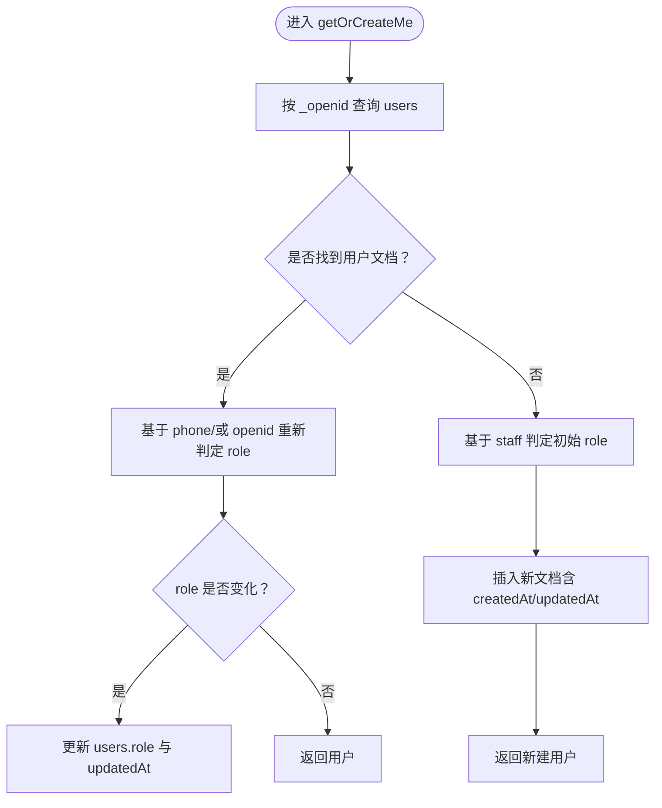
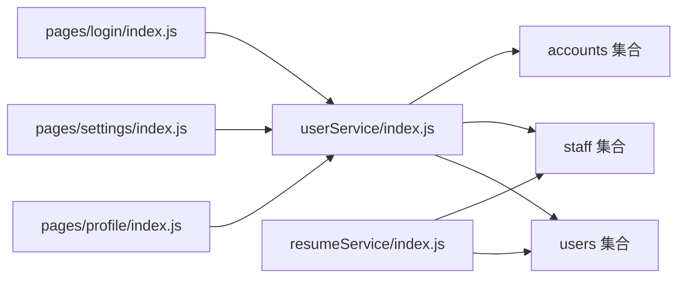

# users集合

<cite>
**本文引用的文件**
- [cloudfunctions/userService/index.js](file://cloudfunctions/userService/index.js)
- [cloudfunctions/userService/config.json](file://cloudfunctions/userService/config.json)
- [cloudfunctions/resumeService/index.js](file://cloudfunctions/resumeService/index.js)
- [miniprogram/pages/profile/index.js](file://miniprogram/pages/profile/index.js)
- [miniprogram/pages/settings/index.js](file://miniprogram/pages/settings/index.js)
- [miniprogram/pages/login/index.js](file://miniprogram/pages/login/index.js)
- [PRD.md](file://PRD.md)
- [docs/简历管理方案深度分析.md](file://docs/简历管理方案深度分析.md)
</cite>

## 目录
1. [简介](#简介)
2. [项目结构](#项目结构)
3. [核心组件](#核心组件)
4. [架构总览](#架构总览)
5. [详细组件分析](#详细组件分析)
6. [依赖分析](#依赖分析)
7. [性能考虑](#性能考虑)
8. [故障排查指南](#故障排查指南)
9. [结论](#结论)
10. [附录](#附录)

## 简介
本文件聚焦于“安得褓贝”项目中users集合的数据模型与业务行为，围绕以下目标展开：
- 字段定义与类型约束：_id、_openid、role、nickname、avatarUrl、phone、createdAt、updatedAt
- 与staff集合的关联关系与权限判定机制
- 首次访问自动创建文档的逻辑
- 角色自动同步与数据更新策略
- 结合代码示例说明getOrCreateMe与updateMe云函数如何操作users集合
- 在用户认证与权限管理中的核心作用

## 项目结构
users集合位于微信云开发数据库中，由云函数userService统一管理，小程序端通过云函数调用完成用户档案的获取与更新。核心交互路径如下：
- 小程序端调用云函数userService的getOrCreateMe/updateMe/loginByPhone等动作
- 云函数在数据库中读写users集合，并根据staff集合与手机号进行角色判定
- resumeService等其他云函数在需要时也依赖users集合中的phone字段进行权限判定

图表来源
- [cloudfunctions/userService/index.js](file://cloudfunctions/userService/index.js#L1-L288)
- [cloudfunctions/resumeService/index.js](file://cloudfunctions/resumeService/index.js#L1-L150)
- [miniprogram/pages/profile/index.js](file://miniprogram/pages/profile/index.js#L1-L53)
- [miniprogram/pages/settings/index.js](file://miniprogram/pages/settings/index.js#L63-L145)
- [miniprogram/pages/login/index.js](file://miniprogram/pages/login/index.js#L144-L190)

章节来源
- [cloudfunctions/userService/index.js](file://cloudfunctions/userService/index.js#L1-L288)
- [cloudfunctions/resumeService/index.js](file://cloudfunctions/resumeService/index.js#L1-L150)
- [miniprogram/pages/profile/index.js](file://miniprogram/pages/profile/index.js#L1-L53)
- [miniprogram/pages/settings/index.js](file://miniprogram/pages/settings/index.js#L63-L145)
- [miniprogram/pages/login/index.js](file://miniprogram/pages/login/index.js#L144-L190)

## 核心组件
- users集合：存储用户档案，包含角色、头像、昵称、手机号及时间戳
- staff集合：员工白名单，用于基于openid或phone判定staff角色
- accounts集合：账号密码登录凭证，与openid绑定，用于账号密码登录后的权限判定
- userService云函数：提供getOrCreateMe、updateMe、loginByPhone等动作，负责users集合的读写与角色同步
- resumeService云函数：在需要时读取users集合的phone字段，结合staff集合进行权限判定

章节来源
- [cloudfunctions/userService/index.js](file://cloudfunctions/userService/index.js#L1-L288)
- [cloudfunctions/resumeService/index.js](file://cloudfunctions/resumeService/index.js#L1-L150)
- [PRD.md](file://PRD.md#L222-L255)

## 架构总览
users集合在系统中的定位：
- 作为用户档案中心，承载用户基本信息与角色
- 通过openid与staff集合关联，实现基于手机号白名单与历史openid的双重判定
- 通过云函数统一入口，保证数据一致性与权限判定逻辑集中化
- 与accounts集合配合，支持账号密码登录后的角色映射与权限判定

图表来源
- [cloudfunctions/userService/index.js](file://cloudfunctions/userService/index.js#L49-L156)

章节来源
- [cloudfunctions/userService/index.js](file://cloudfunctions/userService/index.js#L49-L156)

## 详细组件分析

### users集合数据模型
- 字段与类型
  - _id：字符串，云数据库自动生成的文档主键
  - _openid：字符串，关联微信用户身份
  - role：字符串，取值为"staff"或"customer"
  - nickname：字符串，用户昵称
  - avatarUrl：字符串，头像URL
  - phone：字符串，手机号（可为空）
  - createdAt：serverDate，文档创建时间
  - updatedAt：serverDate，文档最近更新时间

- 约束与规则
  - _id与_openid由云数据库与微信上下文保证唯一性
  - role字段通过isStaff逻辑自动同步，优先以phone匹配staff集合，其次以openid匹配staff集合
  - nickname、avatarUrl、phone为可选字段，updateMe仅对传入的有效字符串字段进行更新
  - createdAt/updatedAt由云函数写入serverDate，确保时区与服务器一致

- 业务规则
  - 首次访问：若users中不存在对应_openid的文档，则创建并写入初始role（基于staff集合判定）
  - 角色同步：每次读取或更新后，都会重新判定role并持久化
  - 手机号登录：loginByPhone会解密手机号并写入users.phone，随后重新判定role
  - 账号密码登录：不直接写入role，而是通过accounts与users配合，最终在getOrCreateMe时判定role

章节来源
- [cloudfunctions/userService/index.js](file://cloudfunctions/userService/index.js#L49-L156)
- [cloudfunctions/userService/config.json](file://cloudfunctions/userService/config.json#L1-L6)
- [PRD.md](file://PRD.md#L282-L292)

### 与staff集合的关联关系与权限判定
- 判定优先级
  - 若用户存在phone且在staff集合中存在对应phone记录，则角色为staff
  - 否则回退到以openid在staff集合中查找，命中则为staff
  - 否则为customer

- 依赖users.phone
  - resumeService在权限判定时会先读取users集合的phone字段，再与staff集合比对
  - 这意味着当用户授权手机号后，其role可能从customer变为staff

- 员工白名单维护
  - PRD指出staff集合的openid录入方式未在代码中体现，属于运营流程层面的约定

章节来源
- [cloudfunctions/userService/index.js](file://cloudfunctions/userService/index.js#L26-L47)
- [cloudfunctions/resumeService/index.js](file://cloudfunctions/resumeService/index.js#L26-L56)
- [PRD.md](file://PRD.md#L339-L345)

### 首次访问自动创建文档的逻辑
- getOrCreateMe流程
  - 查询users中是否存在_openid对应的文档
  - 若存在：重新判定role并更新（如变化），返回用户
  - 若不存在：基于staff集合判定初始role，写入createdAt/updatedAt，返回新建用户
- ensureCollections
  - 首次调用云函数时自动创建users、staff、accounts集合，避免新环境报错

图表来源
- [cloudfunctions/userService/index.js](file://cloudfunctions/userService/index.js#L49-L84)

章节来源
- [cloudfunctions/userService/index.js](file://cloudfunctions/userService/index.js#L18-L24)
- [cloudfunctions/userService/index.js](file://cloudfunctions/userService/index.js#L49-L84)

### 角色自动同步机制与数据更新策略
- 自动同步
  - 读取：getOrCreateMe在返回前会重新判定role并持久化
  - 更新：updateMe在写入安全字段后，再次调用getOrCreateMe以触发role重判
  - 登录：loginByPhone在写入phone后，再次调用getOrCreateMe以触发role重判
- 更新策略
  - updateMe仅对传入的字符串字段进行更新（nickname、avatarUrl、phone）
  - 所有更新均写入updatedAt，便于审计与排序
  - 云函数使用serverDate，确保时间一致性

章节来源
- [cloudfunctions/userService/index.js](file://cloudfunctions/userService/index.js#L86-L103)
- [cloudfunctions/userService/index.js](file://cloudfunctions/userService/index.js#L105-L156)

### 云函数API与调用示例
- getOrCreateMe
  - 功能：获取当前用户档案；不存在则创建（并写入role）
  - 调用方：小程序profile页加载用户信息
  - 示例路径：[miniprogram/pages/profile/index.js](file://miniprogram/pages/profile/index.js#L19-L35)
- updateMe
  - 功能：更新用户档案（昵称/头像/电话等）
  - 调用方：小程序settings页保存资料
  - 示例路径：[miniprogram/pages/settings/index.js](file://miniprogram/pages/settings/index.js#L119-L145)
- loginByPhone
  - 功能：通过微信手机号授权创建/更新用户并写入phone
  - 调用方：小程序settings/login页授权手机号
  - 示例路径：[miniprogram/pages/settings/index.js](file://miniprogram/pages/settings/index.js#L63-L118)、[miniprogram/pages/login/index.js](file://miniprogram/pages/login/index.js#L144-L190)
- 云函数入口与权限
  - 入口：cloudfunctions/userService/index.js
  - 权限：phonenumber.getPhoneNumber开放接口
  - 示例路径：[cloudfunctions/userService/config.json](file://cloudfunctions/userService/config.json#L1-L6)

章节来源
- [PRD.md](file://PRD.md#L282-L292)
- [cloudfunctions/userService/index.js](file://cloudfunctions/userService/index.js#L258-L288)
- [cloudfunctions/userService/config.json](file://cloudfunctions/userService/config.json#L1-L6)
- [miniprogram/pages/profile/index.js](file://miniprogram/pages/profile/index.js#L19-L35)
- [miniprogram/pages/settings/index.js](file://miniprogram/pages/settings/index.js#L63-L145)
- [miniprogram/pages/login/index.js](file://miniprogram/pages/login/index.js#L144-L190)

## 依赖分析
- 云函数依赖
  - userService依赖users、staff、accounts集合
  - resumeService依赖users.phone进行权限判定
- 小程序端依赖
  - profile/settings/login页面通过云函数调用userService
- 外部依赖
  - phonenumber.getPhoneNumber开放接口权限

图表来源
- [cloudfunctions/userService/index.js](file://cloudfunctions/userService/index.js#L1-L288)
- [cloudfunctions/resumeService/index.js](file://cloudfunctions/resumeService/index.js#L1-L150)
- [miniprogram/pages/profile/index.js](file://miniprogram/pages/profile/index.js#L1-L53)
- [miniprogram/pages/settings/index.js](file://miniprogram/pages/settings/index.js#L63-L145)
- [miniprogram/pages/login/index.js](file://miniprogram/pages/login/index.js#L144-L190)

章节来源
- [cloudfunctions/userService/index.js](file://cloudfunctions/userService/index.js#L1-L288)
- [cloudfunctions/resumeService/index.js](file://cloudfunctions/resumeService/index.js#L1-L150)
- [miniprogram/pages/profile/index.js](file://miniprogram/pages/profile/index.js#L1-L53)
- [miniprogram/pages/settings/index.js](file://miniprogram/pages/settings/index.js#L63-L145)
- [miniprogram/pages/login/index.js](file://miniprogram/pages/login/index.js#L144-L190)

## 性能考虑
- 查询与更新
  - users集合按_openid查询，建议在_openid上建立索引以提升查询效率
  - updateMe仅更新必要字段并写入updatedAt，减少写放大
- 角色判定
  - isStaff先查phone再查openid，建议在staff集合的phone与openid字段建立索引
- 首次初始化
  - ensureCollections在首次调用时批量创建集合，避免后续频繁报错

[本节为通用建议，无需特定文件来源]

## 故障排查指南
- “集合不存在”错误
  - 现象：新环境首次调用云函数时报错
  - 处理：确保已部署userService，其ensureCollections会自动创建users/staff/accounts
  - 参考：[cloudfunctions/userService/index.js](file://cloudfunctions/userService/index.js#L18-L24)
- “未知 action”错误
  - 现象：调用云函数时action不在支持列表
  - 处理：确认传入action为getOrCreateMe/updateMe/loginByPhone/accountRegister/accountLogin之一
  - 参考：[cloudfunctions/userService/index.js](file://cloudfunctions/userService/index.js#L258-L288)
- “手机号授权失败”
  - 现象：loginByPhone无法获取手机号
  - 处理：检查微信phonenumber.getPhoneNumber权限配置与code有效性
  - 参考：[cloudfunctions/userService/config.json](file://cloudfunctions/userService/config.json#L1-L6)、[cloudfunctions/userService/index.js](file://cloudfunctions/userService/index.js#L105-L156)
- “权限不足”
  - 现象：resumeService等云函数抛出权限错误
  - 处理：确认用户是否已在staff集合中维护phone或openid，或用户未授权手机号导致role仍为customer
  - 参考：[cloudfunctions/resumeService/index.js](file://cloudfunctions/resumeService/index.js#L26-L56)、[docs/简历管理方案深度分析.md](file://docs/简历管理方案深度分析.md#L43-L94)

章节来源
- [cloudfunctions/userService/index.js](file://cloudfunctions/userService/index.js#L18-L24)
- [cloudfunctions/userService/index.js](file://cloudfunctions/userService/index.js#L258-L288)
- [cloudfunctions/userService/config.json](file://cloudfunctions/userService/config.json#L1-L6)
- [cloudfunctions/resumeService/index.js](file://cloudfunctions/resumeService/index.js#L26-L56)
- [docs/简历管理方案深度分析.md](file://docs/简历管理方案深度分析.md#L43-L94)

## 结论
users集合在“安得褓贝”项目中承担用户档案与角色判定的核心职责。通过与staff集合的关联、基于手机号与openid的双重判定机制，以及云函数统一入口的读写与同步策略，实现了灵活且可扩展的用户认证与权限管理。建议在生产环境中：
- 为_openid、staff.phone、staff.openid建立索引
- 明确staff集合的维护流程（如通过后台工具/运营流程录入）
- 在前端补充phone字段的采集与更新入口，以提升role判定的准确性

[本节为总结性内容，无需特定文件来源]

## 附录
- 字段类型与默认值
  - _id：字符串（系统生成）
  - _openid：字符串（来自微信上下文）
  - role：字符串（默认"customer"，基于staff集合判定）
  - nickname/avatarUrl/phone：字符串（可为空）
  - createdAt/updatedAt：serverDate（系统写入）
- 相关PRD条目
  - users集合字段定义与用途
  - staff集合字段定义与用途
  - 云函数清单（action定义）

章节来源
- [PRD.md](file://PRD.md#L222-L255)
- [PRD.md](file://PRD.md#L282-L292)