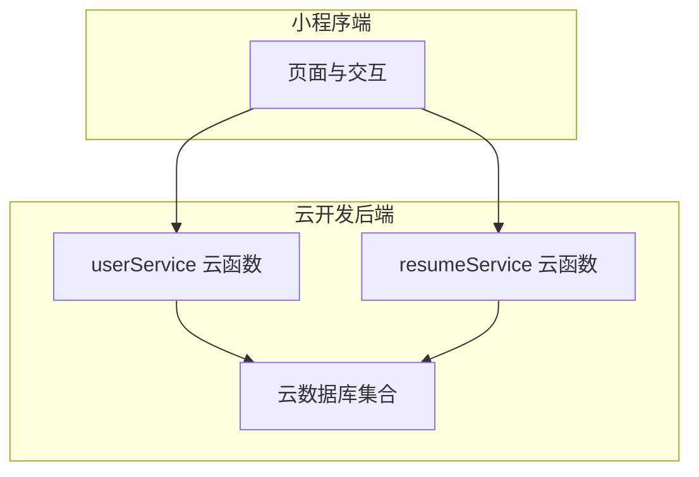
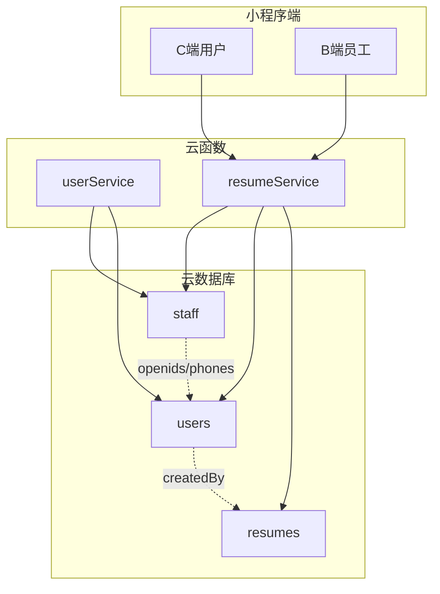
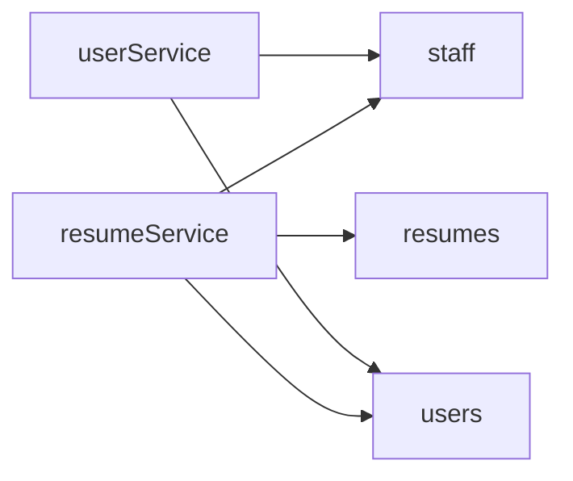
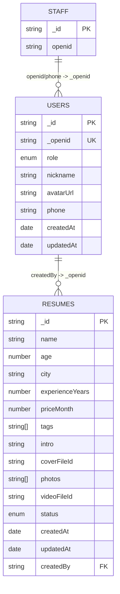
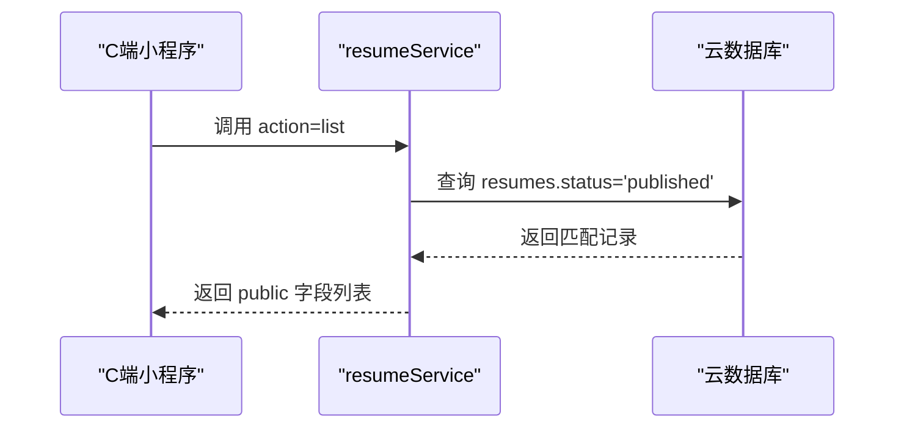
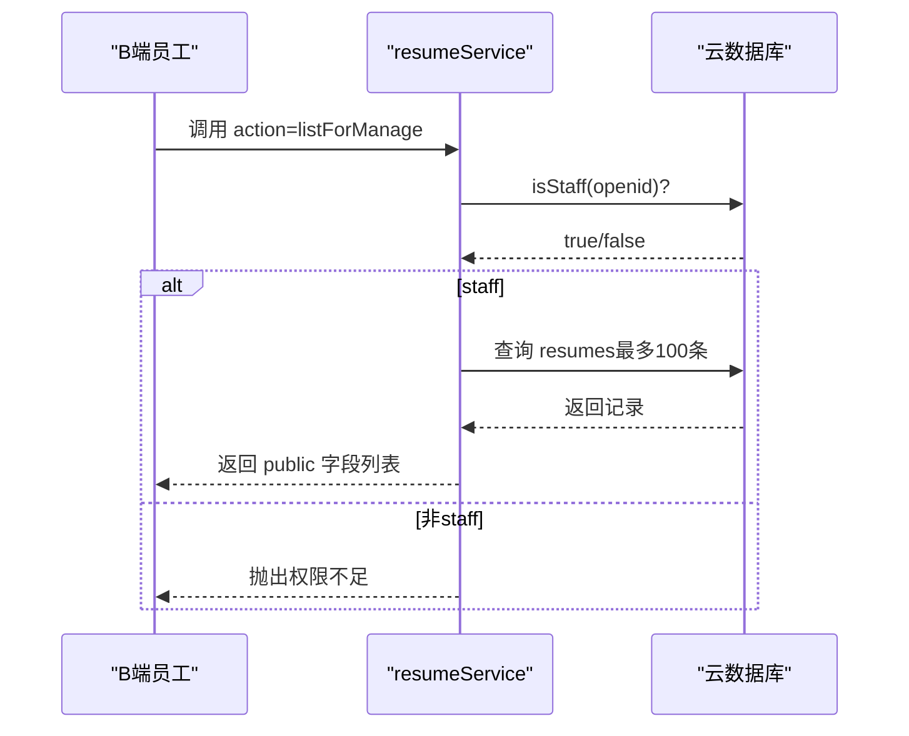

# 数据库设计

<cite>
**本文引用的文件**
- [PRD.md](file://PRD.md)
- [API完整文档.md](file://API完整文档.md)
- [cloudfunctions/userService/index.js](file://cloudfunctions/userService/index.js)
- [cloudfunctions/resumeService/index.js](file://cloudfunctions/resumeService/index.js)
- [docs/简历管理方案深度分析.md](file://docs/简历管理方案深度分析.md)
</cite>

## 目录
1. [简介](#简介)
2. [项目结构](#项目结构)
3. [核心集合与数据模型](#核心集合与数据模型)
4. [架构总览](#架构总览)
5. [详细组件分析](#详细组件分析)
6. [依赖关系分析](#依赖关系分析)
7. [性能与可用性考量](#性能与可用性考量)
8. [故障排查指南](#故障排查指南)
9. [结论](#结论)
10. [附录](#附录)

## 简介
本设计文档聚焦于云数据库中的三个核心集合：users、staff、resumes，系统化阐述其字段定义、业务规则、索引与约束、数据关系与生命周期，并结合云函数实现说明访问模式与权限控制。特别地，明确C端列表查询仅返回已发布简历，以及resumes.createdBy与users._openid的关联关系。

## 项目结构
围绕数据库设计，涉及的主要文件与职责如下：
- PRD.md：定义角色、权限矩阵、集合字段与业务规则
- cloudfunctions/userService/index.js：用户档案与角色判定、权限来源
- cloudfunctions/resumeService/index.js：简历列表/详情/管理、状态过滤与权限校验
- docs/简历管理方案深度分析.md：角色与权限体系的扩展方案与建议

图表来源
- [cloudfunctions/userService/index.js](file://cloudfunctions/userService/index.js#L258-L289)
- [cloudfunctions/resumeService/index.js](file://cloudfunctions/resumeService/index.js#L180-L216)

章节来源
- [PRD.md](file://PRD.md#L202-L281)
- [cloudfunctions/userService/index.js](file://cloudfunctions/userService/index.js#L258-L289)
- [cloudfunctions/resumeService/index.js](file://cloudfunctions/resumeService/index.js#L180-L216)

## 核心集合与数据模型

### users（用户档案）
- 用途：存储用户基本信息与角色，作为权限判定与个人中心展示的基础。
- 字段定义（来自PRD与云函数实现）：
  - _id：字符串，文档主键
  - _openid：字符串，微信 openid（云开发自动写入/可查询）
  - role：'staff' | 'customer'，角色
  - nickname：字符串，昵称（授权后写入）
  - avatarUrl：字符串，头像（授权后写入）
  - phone：字符串，预留字段（支持写入，前端暂无入口）
  - createdAt：serverDate，创建时间
  - updatedAt：serverDate，更新时间
- 约束与规则：
  - 首次访问时若不存在则自动创建；角色通过isStaff判定后写回
  - 更新用户信息时，自动同步updatedAt
- 关系：
  - 与resumes.createdBy通过_openid关联（新增简历时写入）

章节来源
- [PRD.md](file://PRD.md#L206-L219)
- [cloudfunctions/userService/index.js](file://cloudfunctions/userService/index.js#L49-L103)

### staff（员工白名单）
- 用途：员工权限判定依据，支持两种匹配方式：openid或phone
- 字段定义（来自PRD与云函数实现）：
  - _id：字符串，文档主键
  - openid：字符串，员工 openid（用于权限判断）
- 约束与规则：
  - isStaff优先通过phone匹配，再回退到openid
  - 仅用于权限判定，不直接暴露给C端
- 关系：
  - 与users._openid间接关联，通过users.phone参与判定

章节来源
- [PRD.md](file://PRD.md#L222-L231)
- [cloudfunctions/resumeService/index.js](file://cloudfunctions/resumeService/index.js#L26-L56)
- [cloudfunctions/userService/index.js](file://cloudfunctions/userService/index.js#L26-L47)

### resumes（简历）
- 用途：阿姨简历主体数据，支撑C端浏览与B端管理
- 字段定义（来自PRD与云函数实现）：
  - _id：字符串，简历主键
  - name：字符串，姓名
  - age：number | ''，年龄（实现允许空）
  - city：字符串，城市
  - experienceYears：number，经验年数
  - priceMonth：number | ''，月薪（实现允许空）
  - tags：string[]，标签
  - intro：字符串，文本介绍
  - coverFileId：字符串，封面 fileID
  - photos：string[]，图片 fileID 数组
  - videoFileId：字符串，视频 fileID
  - status：'draft' | 'published'，发布状态（仅published对C端可见）
  - createdAt：serverDate，创建时间（新增时写入）
  - updatedAt：serverDate，更新时间
  - createdBy：字符串，创建者 openid（新增时写入）
- 约束与规则：
  - C端列表固定只返回status='published'
  - upsert时status非published自动归档为draft
  - listForManage默认返回最多100条（含draft/published）
  - 详情接口支持forManage=true时仅staff可见
- 关系：
  - createdBy与users._openid关联，用于标识创建者

章节来源
- [PRD.md](file://PRD.md#L232-L254)
- [cloudfunctions/resumeService/index.js](file://cloudfunctions/resumeService/index.js#L78-L106)
- [cloudfunctions/resumeService/index.js](file://cloudfunctions/resumeService/index.js#L108-L133)
- [cloudfunctions/resumeService/index.js](file://cloudfunctions/resumeService/index.js#L135-L169)

## 架构总览
下图展示小程序端、云函数与云数据库之间的交互，以及集合间的关系与权限判定链路。

图表来源
- [cloudfunctions/userService/index.js](file://cloudfunctions/userService/index.js#L26-L47)
- [cloudfunctions/resumeService/index.js](file://cloudfunctions/resumeService/index.js#L26-L56)
- [cloudfunctions/resumeService/index.js](file://cloudfunctions/resumeService/index.js#L78-L106)
- [cloudfunctions/resumeService/index.js](file://cloudfunctions/resumeService/index.js#L135-L169)

## 详细组件分析

### users集合字段与业务规则
- 字段与类型：见“核心集合与数据模型”
- 主键：_id
- 索引：未显式声明，但集合存在时通常具备默认索引
- 数据约束：
  - role由isStaff动态判定并写回users
  - phone为可选字段，用于staff判定
  - createdAt/updatedAt由serverDate自动维护
- 业务规则：
  - 首次访问自动创建用户档案
  - 更新用户信息时同步更新updatedAt

章节来源
- [PRD.md](file://PRD.md#L206-L219)
- [cloudfunctions/userService/index.js](file://cloudfunctions/userService/index.js#L49-L103)

### staff集合字段与权限判定
- 字段与类型：见“核心集合与数据模型”
- 主键：_id
- 索引：未显式声明
- 权限判定逻辑：
  - isStaff优先通过users.phone匹配staff.phone
  - 若无phone或未命中，则回退到staff.openid匹配
  - 仅用于resumeService与userService的权限校验

章节来源
- [PRD.md](file://PRD.md#L222-L231)
- [cloudfunctions/resumeService/index.js](file://cloudfunctions/resumeService/index.js#L26-L56)
- [cloudfunctions/userService/index.js](file://cloudfunctions/userService/index.js#L26-L47)

### resumes集合字段与访问模式
- 字段与类型：见“核心集合与数据模型”
- 主键：_id
- 索引：未显式声明
- 访问模式与规则：
  - list：固定status='published'，支持keyword（姓名/城市）与分页
  - detail：默认任何用户可看；forManage=true时仅staff可见
  - listForManage：仅staff可见，最多100条
  - upsert：仅staff可见；status非published自动归档为draft
  - remove：仅staff可见
- 数据关系：
  - createdBy与users._openid关联，用于标识创建者

章节来源
- [PRD.md](file://PRD.md#L232-L254)
- [cloudfunctions/resumeService/index.js](file://cloudfunctions/resumeService/index.js#L78-L106)
- [cloudfunctions/resumeService/index.js](file://cloudfunctions/resumeService/index.js#L108-L133)
- [cloudfunctions/resumeService/index.js](file://cloudfunctions/resumeService/index.js#L135-L169)

### 权限矩阵与角色来源
- 角色来源：
  - 若staff集合存在对应记录（openid或phone），则为staff；否则为customer
- 权限矩阵（来自PRD）：
  - 列表/详情：customer与staff均可浏览已发布简历
  - 管理态详情/管理列表/新增/编辑/删除：仅staff可执行
  - 获取/更新用户信息：任意用户可执行

章节来源
- [PRD.md](file://PRD.md#L262-L281)
- [cloudfunctions/userService/index.js](file://cloudfunctions/userService/index.js#L26-L47)
- [cloudfunctions/resumeService/index.js](file://cloudfunctions/resumeService/index.js#L108-L133)

### 数据生命周期与访问模式
- 生命周期要点：
  - 新增简历时写入createdAt、updatedAt、createdBy
  - upsert时自动规范化status与时间戳
  - 删除简历仅允许staff
- 访问模式：
  - C端：仅list与detail（forManage=false）可见published
  - B端：listForManage与upsert/remove仅staff可见

章节来源
- [cloudfunctions/resumeService/index.js](file://cloudfunctions/resumeService/index.js#L135-L169)
- [cloudfunctions/resumeService/index.js](file://cloudfunctions/resumeService/index.js#L78-L106)

## 依赖关系分析

图表来源
- [cloudfunctions/resumeService/index.js](file://cloudfunctions/resumeService/index.js#L26-L56)
- [cloudfunctions/userService/index.js](file://cloudfunctions/userService/index.js#L26-L47)

章节来源
- [cloudfunctions/resumeService/index.js](file://cloudfunctions/resumeService/index.js#L26-L56)
- [cloudfunctions/userService/index.js](file://cloudfunctions/userService/index.js#L26-L47)

## 性能与可用性考量
- 查询性能
  - list固定status='published'，减少无效扫描
  - keyword使用正则匹配姓名/城市，建议在高频字段建立索引以优化
- 分页与限制
  - pageSize上限20，page从0开始，返回条数小于pageSize视为无更多
  - listForManage限制100条，避免一次性返回过多数据
- 权限前置校验
  - 所有管理类接口在云函数层强校验staff，降低前端绕过风险
- 集合初始化
  - 云函数首次调用时自动创建集合，避免新环境报错

章节来源
- [cloudfunctions/resumeService/index.js](file://cloudfunctions/resumeService/index.js#L78-L106)
- [cloudfunctions/resumeService/index.js](file://cloudfunctions/resumeService/index.js#L122-L133)
- [cloudfunctions/userService/index.js](file://cloudfunctions/userService/index.js#L10-L24)

## 故障排查指南
- 无法获取用户信息或角色不正确
  - 检查users是否存在_openid对应的记录；若不存在，首次访问会自动创建
  - 确认users.phone是否正确写入，因为isStaff优先通过phone匹配
- 无权限或失败
  - 管理类接口（listForManage/upsert/remove）仅staff可调用
  - 若手动访问管理页，云函数会拒绝并返回“无权限或失败”
- 列表为空或无更多
  - 确认简历status为published；keyword是否过大导致无匹配
  - 检查pageSize与page参数是否合理

章节来源
- [cloudfunctions/userService/index.js](file://cloudfunctions/userService/index.js#L49-L103)
- [cloudfunctions/resumeService/index.js](file://cloudfunctions/resumeService/index.js#L108-L133)
- [cloudfunctions/resumeService/index.js](file://cloudfunctions/resumeService/index.js#L78-L106)

## 结论
本数据库设计以users、staff、resumes为核心，通过users._openid与resumes.createdBy建立关联，借助staff集合实现灵活的员工权限判定（优先phone，回退openid）。C端列表严格限定published状态，保障数据可见性与一致性；管理端接口在云函数层强校验权限，确保业务安全。建议在高频查询字段上补充索引以进一步优化性能。

## 附录

### 字段定义表（users）
- 字段名：_id
  - 类型：字符串
  - 主键：是
  - 说明：文档主键
- 字段名：_openid
  - 类型：字符串
  - 说明：微信 openid
- 字段名：role
  - 类型：'staff' | 'customer'
  - 说明：角色
- 字段名：nickname
  - 类型：字符串
  - 说明：昵称
- 字段名：avatarUrl
  - 类型：字符串
  - 说明：头像
- 字段名：phone
  - 类型：字符串
  - 说明：预留字段
- 字段名：createdAt
  - 类型：serverDate
  - 说明：创建时间
- 字段名：updatedAt
  - 类型：serverDate
  - 说明：更新时间

章节来源
- [PRD.md](file://PRD.md#L206-L219)

### 字段定义表（staff）
- 字段名：_id
  - 类型：字符串
  - 主键：是
  - 说明：文档主键
- 字段名：openid
  - 类型：字符串
  - 说明：员工 openid（用于权限判断）

章节来源
- [PRD.md](file://PRD.md#L222-L231)

### 字段定义表（resumes）
- 字段名：_id
  - 类型：字符串
  - 主键：是
  - 说明：简历主键
- 字段名：name
  - 类型：字符串
  - 说明：姓名
- 字段名：age
  - 类型：number | ''
  - 说明：年龄
- 字段名：city
  - 类型：字符串
  - 说明：城市
- 字段名：experienceYears
  - 类型：number
  - 说明：经验年数
- 字段名：priceMonth
  - 类型：number | ''
  - 说明：月薪
- 字段名：tags
  - 类型：string[]
  - 说明：标签
- 字段名：intro
  - 类型：字符串
  - 说明：文本介绍
- 字段名：coverFileId
  - 类型：字符串
  - 说明：封面 fileID
- 字段名：photos
  - 类型：string[]
  - 说明：图片 fileID 数组
- 字段名：videoFileId
  - 类型：字符串
  - 说明：视频 fileID
- 字段名：status
  - 类型：'draft' | 'published'
  - 说明：发布状态
- 字段名：createdAt
  - 类型：serverDate
  - 说明：创建时间
- 字段名：updatedAt
  - 类型：serverDate
  - 说明：更新时间
- 字段名：createdBy
  - 类型：字符串
  - 说明：创建者 openid

章节来源
- [PRD.md](file://PRD.md#L232-L254)

### 数据关系图（ER）

图表来源
- [PRD.md](file://PRD.md#L206-L254)
- [cloudfunctions/userService/index.js](file://cloudfunctions/userService/index.js#L26-L47)
- [cloudfunctions/resumeService/index.js](file://cloudfunctions/resumeService/index.js#L135-L169)

### 访问模式序列图（C端列表）

图表来源
- [cloudfunctions/resumeService/index.js](file://cloudfunctions/resumeService/index.js#L78-L106)

### 访问模式序列图（B端管理）

图表来源
- [cloudfunctions/resumeService/index.js](file://cloudfunctions/resumeService/index.js#L122-L133)
- [cloudfunctions/resumeService/index.js](file://cloudfunctions/resumeService/index.js#L26-L56)