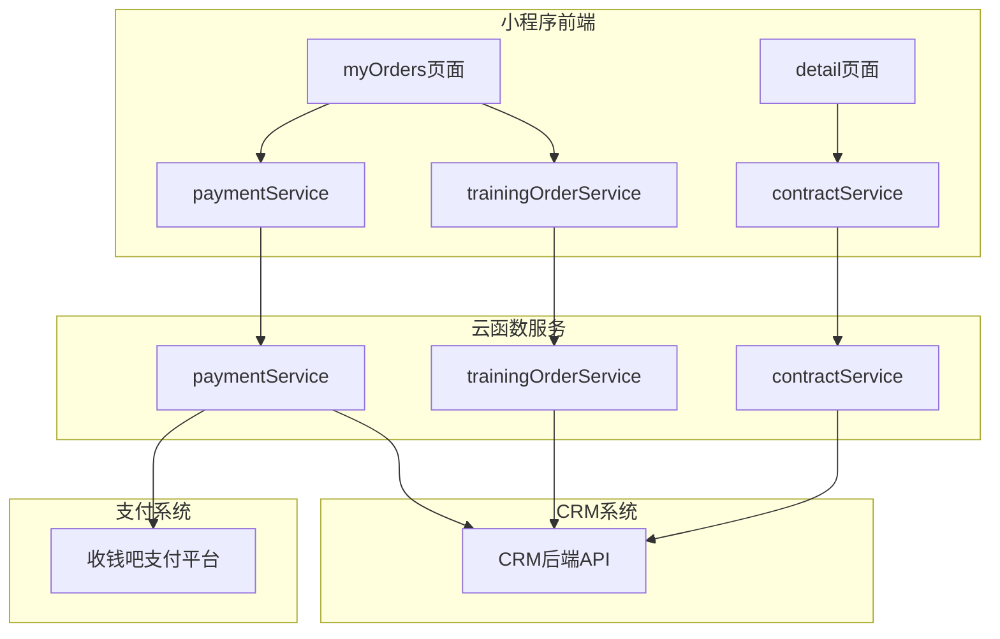
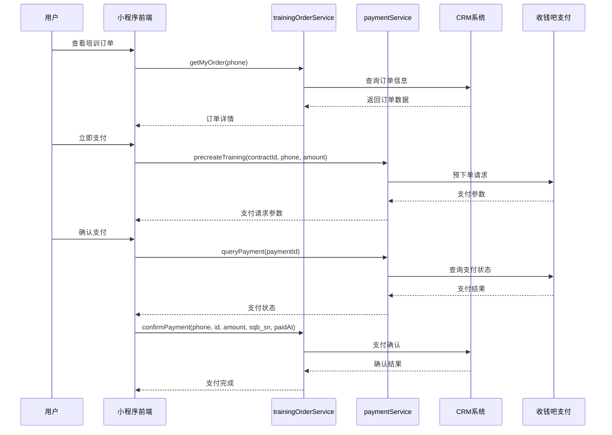
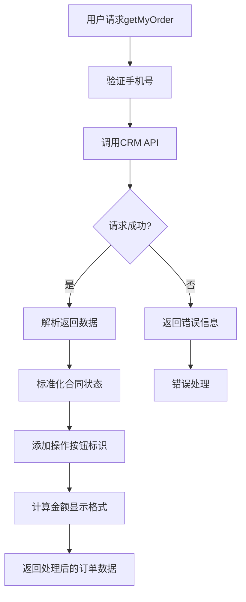
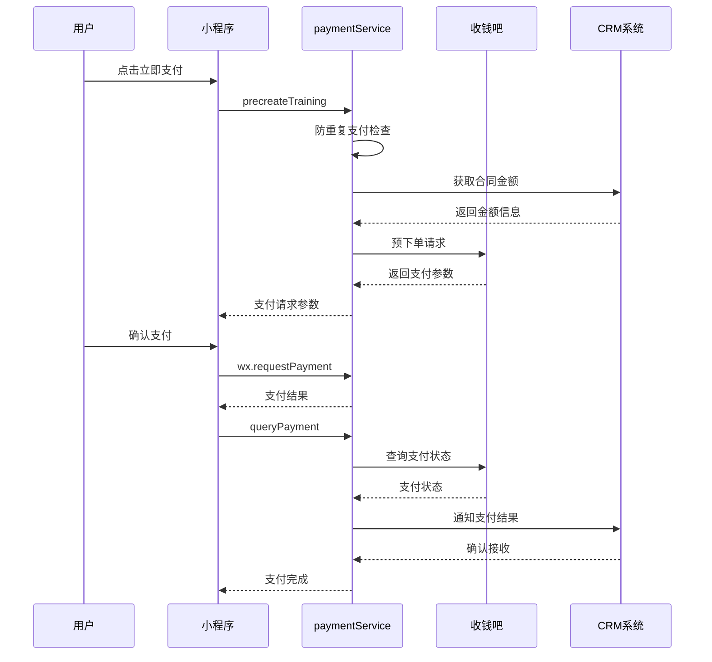
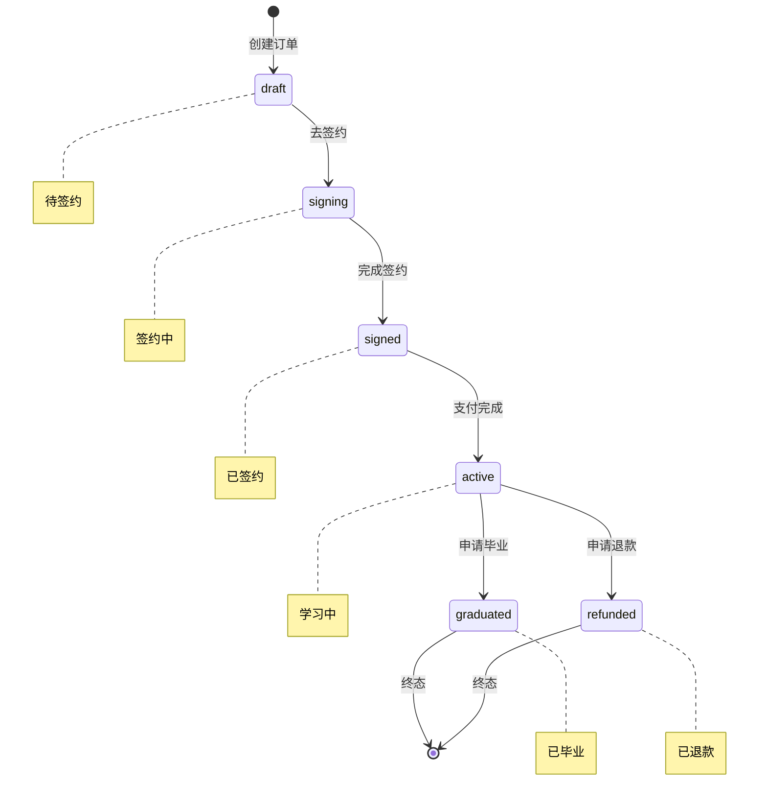
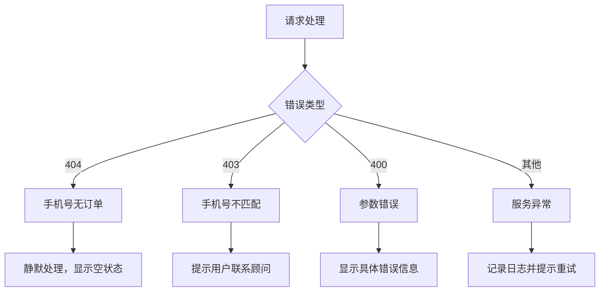
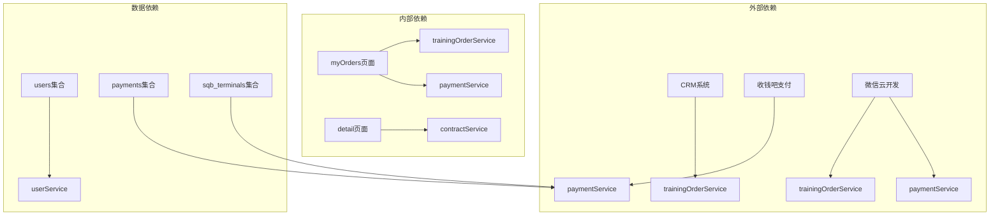

# 培训订单服务

<cite>
**本文档引用的文件**
- [trainingOrderService/index.js](file://cloudfunctions/trainingOrderService/index.js)
- [trainingOrderService/package.json](file://cloudfunctions/trainingOrderService/package.json)
- [trainingOrderService/config.json](file://cloudfunctions/trainingOrderService/config.json)
- [myOrders/index.js](file://miniprogram/pages/myOrders/index.js)
- [myOrders/detail.js](file://miniprogram/pages/myOrders/detail.js)
- [paymentService/index.js](file://cloudfunctions/paymentService/index.js)
- [userService.js](file://miniprogram/services/userService.js)
- [app.js](file://miniprogram/app.js)
</cite>

## 目录
1. [简介](#简介)
2. [项目结构](#项目结构)
3. [核心组件](#核心组件)
4. [架构概览](#架构概览)
5. [详细组件分析](#详细组件分析)
6. [依赖关系分析](#依赖关系分析)
7. [性能考虑](#性能考虑)
8. [故障排除指南](#故障排除指南)
9. [结论](#结论)

## 简介

培训订单服务是安得褓贝小程序中的一个核心云函数服务，专门负责处理职培订单相关的业务逻辑。该服务通过与CRM系统的深度集成，为用户提供完整的培训订单管理功能，包括订单查询、合同签约、支付处理、状态跟踪等核心功能。

该服务采用微服务架构设计，通过云函数的形式提供RESTful API接口，实现了前后端分离的现代化小程序开发模式。服务支持多种订单状态管理和复杂的业务流程控制，为用户提供了便捷的在线培训服务体验。

## 项目结构

培训订单服务位于云开发环境中，主要由以下几个核心部分组成：

**图表来源**
- [trainingOrderService/index.js:1-120](file://cloudfunctions/trainingOrderService/index.js#L1-L120)
- [myOrders/index.js:1-410](file://miniprogram/pages/myOrders/index.js#L1-L410)

**章节来源**
- [trainingOrderService/index.js:1-120](file://cloudfunctions/trainingOrderService/index.js#L1-L120)
- [trainingOrderService/package.json:1-15](file://cloudfunctions/trainingOrderService/package.json#L1-L15)
- [trainingOrderService/config.json:1-6](file://cloudfunctions/trainingOrderService/config.json#L1-L6)

## 核心组件

培训订单服务包含以下核心组件：

### 1. 订单查询组件
负责获取用户的培训订单信息，包括学员档案、课程信息、合同状态等完整数据。

### 2. 合同签约组件  
提供合同签署链接获取功能，支持爱签电子合同的在线签署流程。

### 3. 支付确认组件
处理支付结果确认，与收钱吧支付平台进行数据同步，确保支付状态的准确性。

### 4. 毕业申请组件
支持学员自助申请毕业，实现从在学状态到毕业状态的转换。

### 5. 状态查询组件
提供轻量级的状态查询接口，支持高频轮询，实时获取订单状态变化。

**章节来源**
- [trainingOrderService/index.js:56-95](file://cloudfunctions/trainingOrderService/index.js#L56-L95)

## 架构概览

培训订单服务采用分层架构设计，实现了清晰的职责分离和良好的可扩展性：

**图表来源**
- [myOrders/index.js:324-408](file://miniprogram/pages/myOrders/index.js#L324-L408)
- [paymentService/index.js:490-626](file://cloudfunctions/paymentService/index.js#L490-L626)
- [trainingOrderService/index.js:69-77](file://cloudfunctions/trainingOrderService/index.js#L69-L77)

## 详细组件分析

### 订单查询组件

订单查询组件是培训订单服务的核心功能之一，负责获取用户的完整培训订单信息。

#### 功能特性
- **手机号验证**：确保订单归属的手机号有效性
- **多订单聚合**：支持同时获取多个培训合同信息
- **状态标准化**：将不同状态统一映射到标准状态体系
- **权限控制**：通过CRM系统验证用户权限

#### 数据处理流程

**图表来源**
- [trainingOrderService/index.js:56-60](file://cloudfunctions/trainingOrderService/index.js#L56-L60)
- [myOrders/index.js:225-262](file://miniprogram/pages/myOrders/index.js#L225-L262)

**章节来源**
- [trainingOrderService/index.js:56-60](file://cloudfunctions/trainingOrderService/index.js#L56-L60)
- [myOrders/index.js:194-268](file://miniprogram/pages/myOrders/index.js#L194-L268)

### 支付处理组件

支付处理组件实现了完整的在线支付流程，集成了收钱吧支付平台的API。

#### 支付流程

**图表来源**
- [myOrders/index.js:350-398](file://miniprogram/pages/myOrders/index.js#L350-L398)
- [paymentService/index.js:490-626](file://cloudfunctions/paymentService/index.js#L490-L626)

#### 防重复支付机制

支付组件实现了多重防重复机制，确保交易安全：

1. **数据库检查**：查询是否存在相同合同ID的待支付或已支付订单
2. **收钱吧状态同步**：检查收钱吧平台上的订单状态
3. **业务状态拦截**：防止在处理中的订单被重复提交
4. **超时处理**：自动清理超时的未完成订单

**章节来源**
- [paymentService/index.js:502-538](file://cloudfunctions/paymentService/index.js#L502-L538)

### 合同状态管理

培训订单服务实现了完整的合同生命周期管理，支持多种状态转换：

#### 状态转换图

**图表来源**
- [myOrders/index.js:11-23](file://miniprogram/pages/myOrders/index.js#L11-L23)

#### 状态映射规则

| CRM状态 | 标准状态 | 显示文本 |
|---------|----------|----------|
| draft | signing | 待签约 |
| signing | signing | 签约中 |
| signed | signed | 已签约 |
| active | active | 学习中 |
| graduated | graduated | 已毕业 |
| refunded | refunded | 已退款 |

**章节来源**
- [myOrders/index.js:11-23](file://miniprogram/pages/myOrders/index.js#L11-L23)

### 错误处理机制

培训订单服务实现了完善的错误处理机制，确保用户体验的稳定性：

#### 错误分类处理

**图表来源**
- [myOrders/index.js:209-222](file://miniprogram/pages/myOrders/index.js#L209-L222)

**章节来源**
- [myOrders/index.js:209-222](file://miniprogram/pages/myOrders/index.js#L209-L222)

## 依赖关系分析

培训订单服务涉及多个组件间的复杂依赖关系：

**图表来源**
- [trainingOrderService/index.js:1-120](file://cloudfunctions/trainingOrderService/index.js#L1-L120)
- [paymentService/index.js:1-662](file://cloudfunctions/paymentService/index.js#L1-L662)

### 外部服务集成

培训订单服务主要依赖以下外部服务：

1. **CRM系统**：提供订单数据查询、支付确认等功能
2. **收钱吧支付平台**：提供在线支付解决方案
3. **微信云开发**：提供云函数、数据库、存储等基础设施

### 内部服务协作

各服务间通过明确的接口进行协作：

- **trainingOrderService**：订单查询、状态管理
- **paymentService**：支付处理、状态同步
- **contractService**：合同管理、电子签约
- **userService**：用户认证、权限管理

**章节来源**
- [trainingOrderService/index.js:1-120](file://cloudfunctions/trainingOrderService/index.js#L1-L120)
- [paymentService/index.js:1-662](file://cloudfunctions/paymentService/index.js#L1-L662)

## 性能考虑

培训订单服务在设计时充分考虑了性能优化：

### 1. 缓存策略
- **状态缓存**：高频状态查询结果进行短期缓存
- **数据预加载**：在用户切换Tab时预加载相关数据
- **懒加载机制**：按需加载培训订单数据，减少首屏压力

### 2. 网络优化
- **并发请求**：支持多个API请求并行处理
- **请求合并**：将多个小请求合并为批量请求
- **超时控制**：合理设置请求超时时间，避免长时间等待

### 3. 数据处理优化
- **增量更新**：只更新发生变化的数据
- **数据压缩**：传输过程中进行数据压缩
- **分页加载**：大量数据采用分页方式加载

## 故障排除指南

### 常见问题及解决方案

#### 1. 订单查询失败
**症状**：用户无法看到培训订单
**可能原因**：
- 手机号未绑定或绑定错误
- CRM系统接口异常
- 网络连接问题

**解决步骤**：
1. 检查用户是否已绑定手机号
2. 验证CRM系统接口可用性
3. 检查网络连接状态
4. 查看云函数日志获取详细错误信息

#### 2. 支付失败
**症状**：支付请求后无法完成支付
**可能原因**：
- 收钱吧支付平台异常
- 网络超时
- 重复支付检测

**解决步骤**：
1. 检查收钱吧API状态
2. 确认网络连接稳定
3. 清理重复支付记录
4. 重新发起支付请求

#### 3. 合同签署问题
**症状**：无法获取合同签署链接
**可能原因**：
- 合同状态不符合签署条件
- 爱签平台接口异常
- 用户权限验证失败

**解决步骤**：
1. 检查合同当前状态
2. 验证用户是否有签署权限
3. 重新获取签署链接
4. 联系技术支持

**章节来源**
- [myOrders/index.js:209-222](file://miniprogram/pages/myOrders/index.js#L209-L222)
- [paymentService/index.js:354-405](file://cloudfunctions/paymentService/index.js#L354-L405)

### 日志监控

建议启用以下关键日志监控：

1. **API调用日志**：记录所有外部API调用
2. **错误日志**：捕获并记录所有异常情况
3. **性能日志**：监控响应时间和成功率
4. **用户行为日志**：跟踪用户操作流程

## 结论

培训订单服务作为安得褓贝小程序的重要组成部分，通过精心设计的架构和完善的业务逻辑，为用户提供了完整的在线培训服务体验。该服务具有以下特点：

### 技术优势
- **模块化设计**：清晰的职责分离，便于维护和扩展
- **安全性保障**：多重身份验证和权限控制机制
- **高可用性**：完善的错误处理和降级策略
- **性能优化**：合理的缓存和并发处理机制

### 业务价值
- **用户体验**：简洁直观的操作界面，流畅的交互体验
- **业务效率**：自动化的工作流程，减少人工干预
- **数据安全**：严格的数据保护和隐私控制
- **扩展性强**：灵活的架构设计，支持业务快速发展

### 发展建议
1. **功能扩展**：增加更多培训相关的辅助功能
2. **性能优化**：持续优化响应速度和并发处理能力
3. **监控完善**：建立更全面的监控和告警机制
4. **用户体验**：不断改进界面设计和交互流程

通过持续的技术创新和业务优化，培训订单服务将继续为安得褓贝小程序的发展提供强有力的支持。