# 推荐系统

<cite>
**本文档引用的文件**
- [PRD.md](file://PRD.md)
- [resumeService/index.js](file://cloudfunctions/resumeService/index.js)
- [userService/index.js](file://cloudfunctions/userService/index.js)
- [resume.js](file://miniprogram/services/resume.js)
- [request.js](file://miniprogram/utils/request.js)
- [resumeList/index.js](file://miniprogram/pages/resumeList/index.js)
- [resumeDetail/index.js](file://miniprogram/pages/resumeDetail/index.js)
- [referralService/index.js](file://cloudfunctions/referralService/index.js)
- [baobei/index.js](file://cloudfunctions/baobei/index.js)
- [标签匹配算法优化方案.md](file://docs/标签匹配算法优化方案.md)
</cite>

## 目录
1. [项目概述](#项目概述)
2. [系统架构](#系统架构)
3. [核心组件分析](#核心组件分析)
4. [推荐系统设计](#推荐系统设计)
5. [数据流分析](#数据流分析)
6. [性能优化策略](#性能优化策略)
7. [安全与权限控制](#安全与权限控制)
8. [故障排除指南](#故障排除指南)
9. [总结](#总结)

## 项目概述

安得褓贝是一个基于微信小程序的月嫂/育婴师简历展示与管理系统。该项目采用前后端分离架构，前端使用微信小程序框架，后端基于腾讯云开发平台。

### 系统特点

- **多角色权限管理**：支持客户(customer)和员工(staff)两种角色
- **简历管理功能**：提供完整的简历创建、编辑、发布和管理功能
- **推荐系统**：集成推荐人机制，支持用户推荐阿姨简历
- **视频预加载优化**：针对移动端网络环境优化视频加载体验
- **标签匹配算法**：支持智能标签分类和推荐

## 系统架构

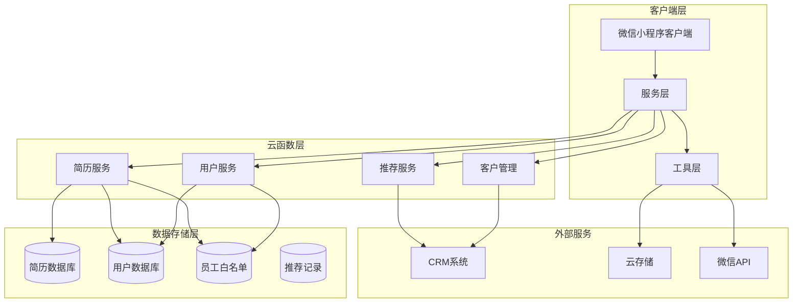

**图表来源**
- [resumeService/index.js:1-216](file://cloudfunctions/resumeService/index.js#L1-L216)
- [userService/index.js:1-537](file://cloudfunctions/userService/index.js#L1-L537)
- [referralService/index.js:1-374](file://cloudfunctions/referralService/index.js#L1-L374)

## 核心组件分析

### 1. 简历服务组件

简历服务是整个推荐系统的核心组件，负责简历数据的CRUD操作和查询功能。

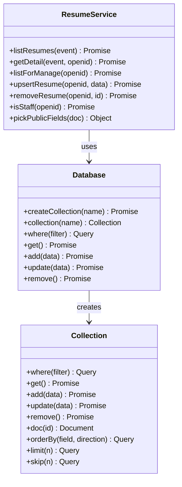

**图表来源**
- [resumeService/index.js:78-178](file://cloudfunctions/resumeService/index.js#L78-L178)

### 2. 用户服务组件

用户服务负责用户身份验证、角色管理和权限控制。

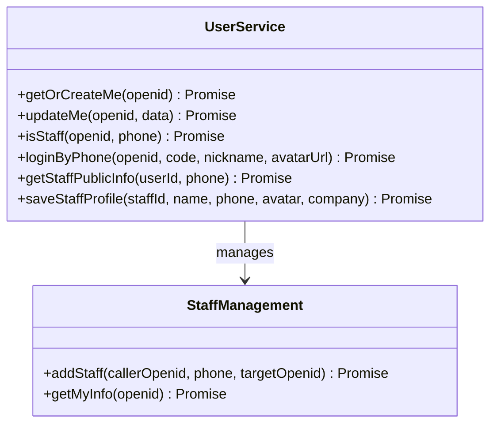

**图表来源**
- [userService/index.js:50-272](file://cloudfunctions/userService/index.js#L50-L272)

### 3. 推荐服务组件

推荐服务处理用户推荐阿姨简历的完整流程。

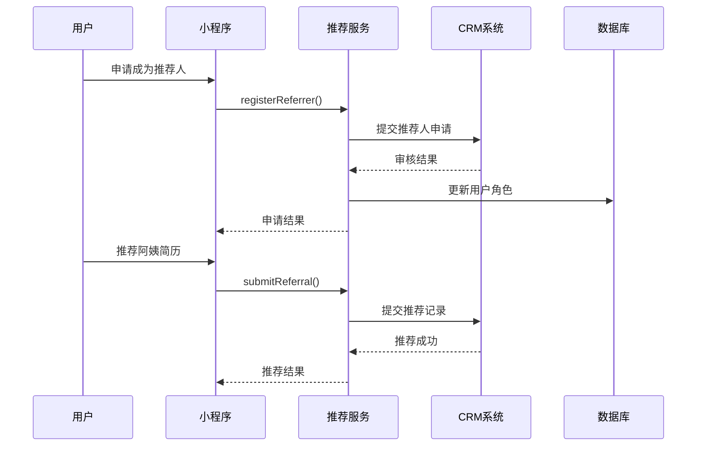

**图表来源**
- [referralService/index.js:64-196](file://cloudfunctions/referralService/index.js#L64-L196)

**章节来源**
- [resumeService/index.js:1-216](file://cloudfunctions/resumeService/index.js#L1-L216)
- [userService/index.js:1-537](file://cloudfunctions/userService/index.js#L1-L537)
- [referralService/index.js:1-374](file://cloudfunctions/referralService/index.js#L1-L374)

## 推荐系统设计

### 1. 推荐算法架构

推荐系统采用多维度标签匹配算法，结合用户行为和内容特征进行智能推荐。

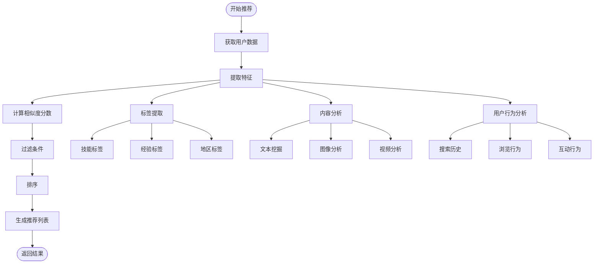

**图表来源**
- [标签匹配算法优化方案.md:1-113](file://docs/标签匹配算法优化方案.md#L1-L113)

### 2. 推荐标签系统

系统实现了完整的标签匹配算法，支持多标签推荐和权重计算。

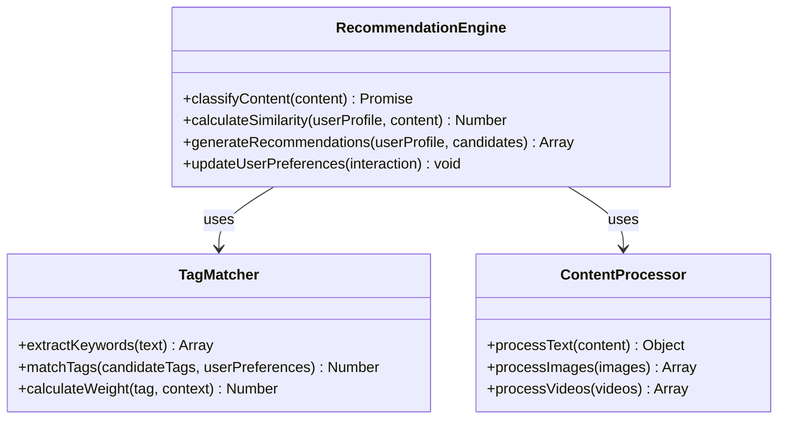

**图表来源**
- [标签匹配算法优化方案.md:30-86](file://docs/标签匹配算法优化方案.md#L30-L86)

### 3. 推荐展示组件

简历详情页实现了推荐理由的智能展示功能。

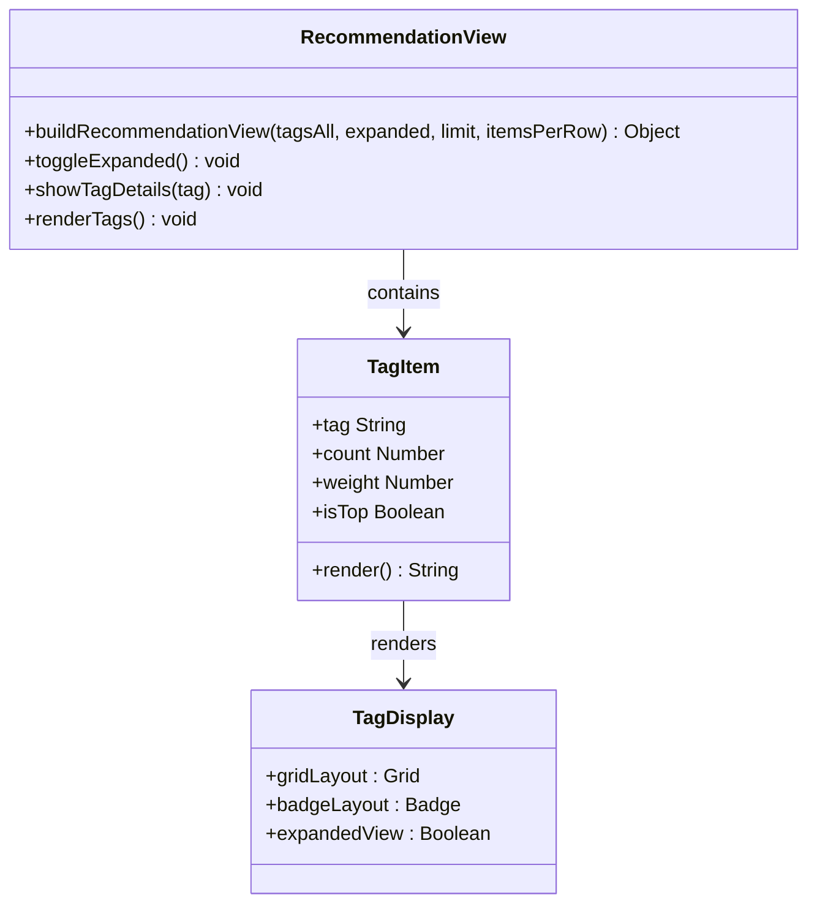

**图表来源**
- [resumeDetail/index.js:160-190](file://miniprogram/pages/resumeDetail/index.js#L160-L190)

**章节来源**
- [标签匹配算法优化方案.md:1-113](file://docs/标签匹配算法优化方案.md#L1-L113)
- [resumeDetail/index.js:160-190](file://miniprogram/pages/resumeDetail/index.js#L160-L190)

## 数据流分析

### 1. 简历数据流

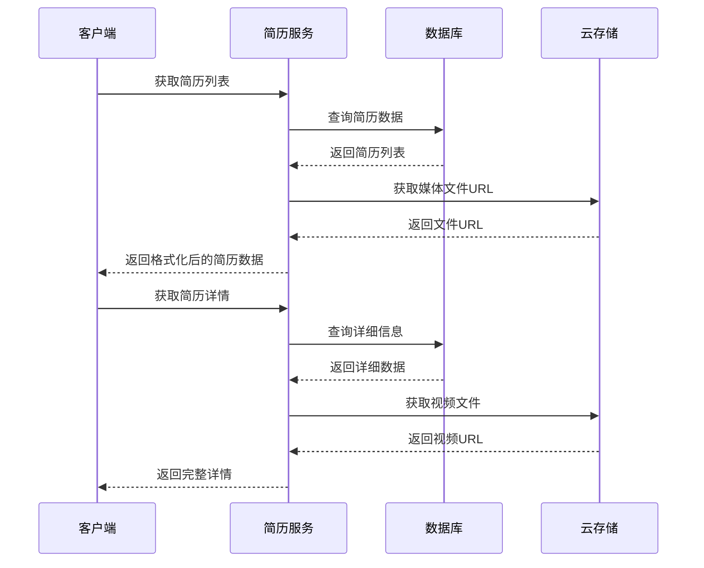

**图表来源**
- [resume.js:16-99](file://miniprogram/services/resume.js#L16-L99)
- [resumeService/index.js:78-120](file://cloudfunctions/resumeService/index.js#L78-L120)

### 2. 用户认证数据流

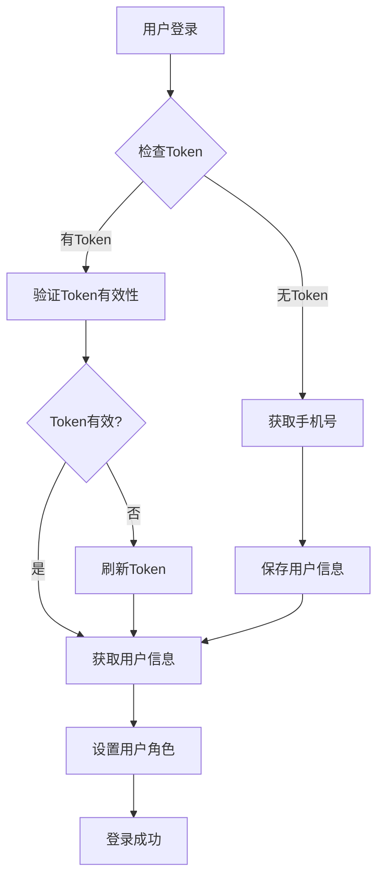

**图表来源**
- [request.js:47-111](file://miniprogram/utils/request.js#L47-L111)
- [userService/index.js:274-327](file://cloudfunctions/userService/index.js#L274-L327)

**章节来源**
- [resume.js:1-239](file://miniprogram/services/resume.js#L1-L239)
- [request.js:1-133](file://miniprogram/utils/request.js#L1-L133)

## 性能优化策略

### 1. 视频预加载优化

系统实现了智能的视频预加载机制，优化移动端网络环境下的视频播放体验。

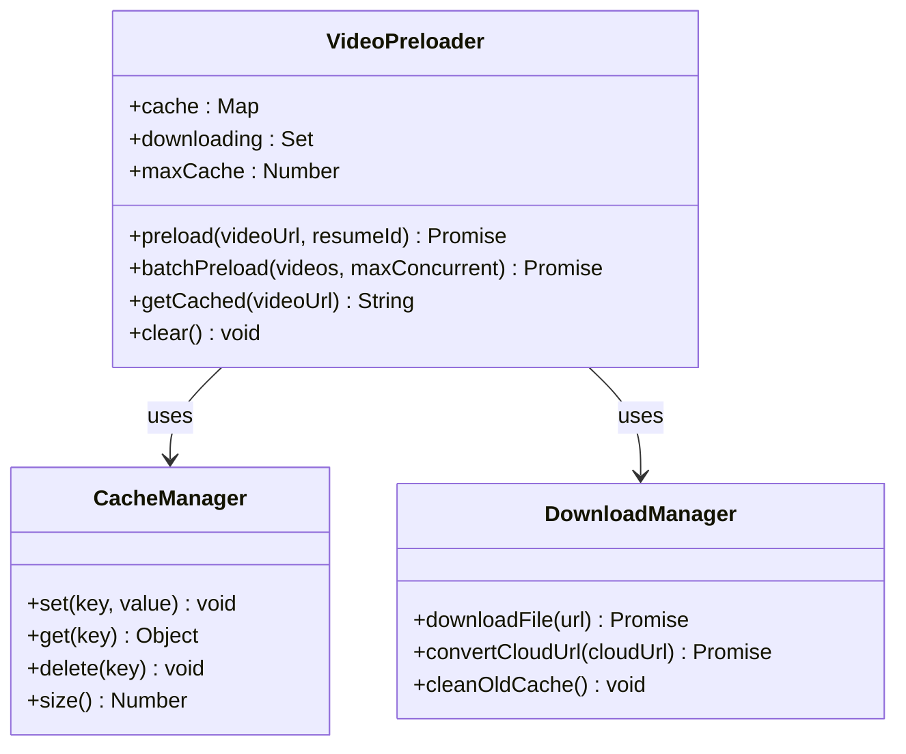

**图表来源**
- [resumeList/index.js:51-205](file://miniprogram/pages/resumeList/index.js#L51-L205)

### 2. 列表加载优化

简历列表实现了智能的分页加载和缓存策略。

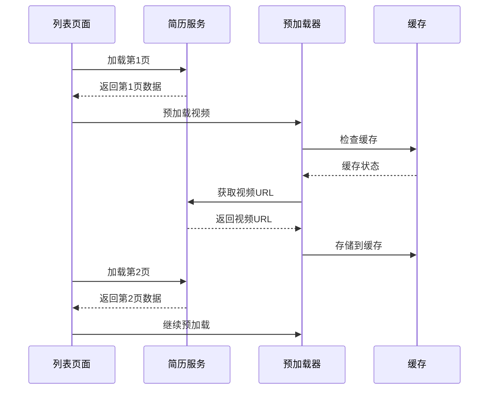

**图表来源**
- [resumeList/index.js:290-339](file://miniprogram/pages/resumeList/index.js#L290-L339)

**章节来源**
- [resumeList/index.js:51-205](file://miniprogram/pages/resumeList/index.js#L51-L205)
- [resumeList/index.js:290-339](file://miniprogram/pages/resumeList/index.js#L290-L339)

## 安全与权限控制

### 1. 角色权限管理

系统实现了严格的权限控制机制，确保不同角色只能访问相应的功能。

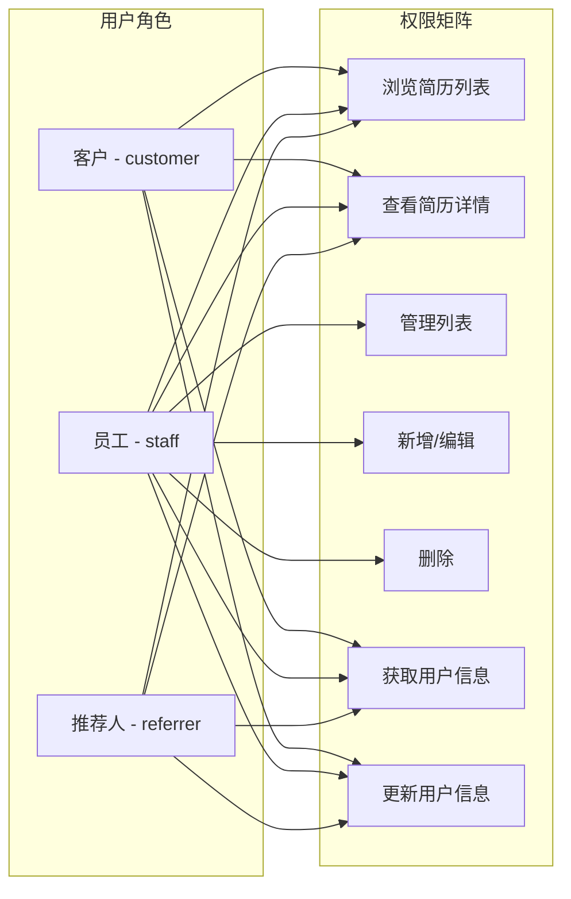

**图表来源**
- [PRD.md:262-280](file://PRD.md#L262-L280)

### 2. 数据访问控制

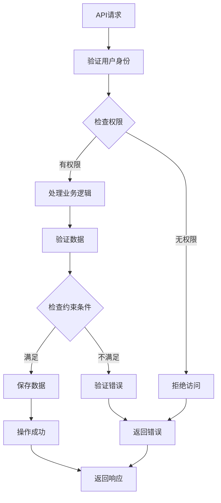

**图表来源**
- [resumeService/index.js:135-178](file://cloudfunctions/resumeService/index.js#L135-L178)
- [userService/index.js:240-272](file://cloudfunctions/userService/index.js#L240-L272)

**章节来源**
- [PRD.md:262-280](file://PRD.md#L262-L280)
- [resumeService/index.js:135-178](file://cloudfunctions/resumeService/index.js#L135-L178)
- [userService/index.js:240-272](file://cloudfunctions/userService/index.js#L240-L272)

## 故障排除指南

### 1. 常见问题诊断

#### 简历列表加载失败
- **症状**：简历列表无法加载或显示空白
- **可能原因**：
  - 网络连接问题
  - Token过期
  - CRM服务不可用
- **解决方案**：
  - 检查网络连接状态
  - 重新登录获取新Token
  - 查看CRM系统状态

#### 视频播放失败
- **症状**：简历详情页视频无法播放
- **可能原因**：
  - 云存储URL转换失败
  - 视频文件损坏
  - 网络环境不佳
- **解决方案**：
  - 检查云存储配置
  - 重新上传视频文件
  - 使用WiFi网络或增强预加载

#### 推荐功能异常
- **症状**：推荐功能无法正常使用
- **可能原因**：
  - CRM接口调用失败
  - 用户权限不足
  - 推荐算法异常
- **解决方案**：
  - 检查CRM系统连接
  - 验证用户推荐人资格
  - 查看推荐日志

### 2. 性能监控指标

| 指标类型 | 正常阈值 | 监控方法 | 异常处理 |
|---------|---------|---------|---------|
| 列表加载时间 | < 2秒 | wx.getNetworkType | 重试加载 |
| 视频预加载成功率 | > 90% | 预加载统计 | 降级为普通加载 |
| API响应时间 | < 1秒 | 网络监控 | 优化请求频率 |
| Token有效期 | > 5分钟 | 登录状态检查 | 自动刷新 |

**章节来源**
- [resumeList/index.js:51-205](file://miniprogram/pages/resumeList/index.js#L51-L205)
- [resumeDetail/index.js:381-407](file://miniprogram/pages/resumeDetail/index.js#L381-L407)

## 总结

安得褓贝推荐系统是一个功能完善、架构清晰的移动应用推荐解决方案。系统的主要特点包括：

### 核心优势

1. **完整的权限体系**：支持多角色权限管理，确保数据安全
2. **智能推荐算法**：基于标签匹配和用户行为分析的智能推荐
3. **性能优化**：视频预加载、缓存策略等多重性能优化
4. **扩展性强**：模块化设计，易于功能扩展和维护

### 技术亮点

- **前后端分离架构**：清晰的职责划分，便于团队协作
- **云原生部署**：基于腾讯云开发平台，具备良好的可扩展性
- **用户体验优化**：针对移动端网络环境的专门优化
- **安全防护**：完善的权限控制和数据保护机制

### 发展建议

1. **AI智能推荐**：可以进一步引入机器学习算法提升推荐准确性
2. **实时推荐**：增加实时用户行为追踪和动态推荐
3. **A/B测试**：建立推荐效果评估体系
4. **个性化定制**：支持用户个性化推荐偏好设置

该推荐系统为月嫂/育婴师行业提供了专业的数字化解决方案，有效提升了用户匹配效率和服务质量。