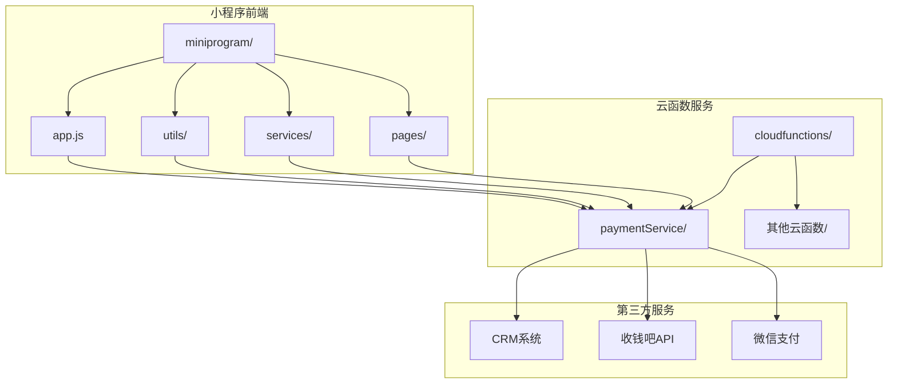
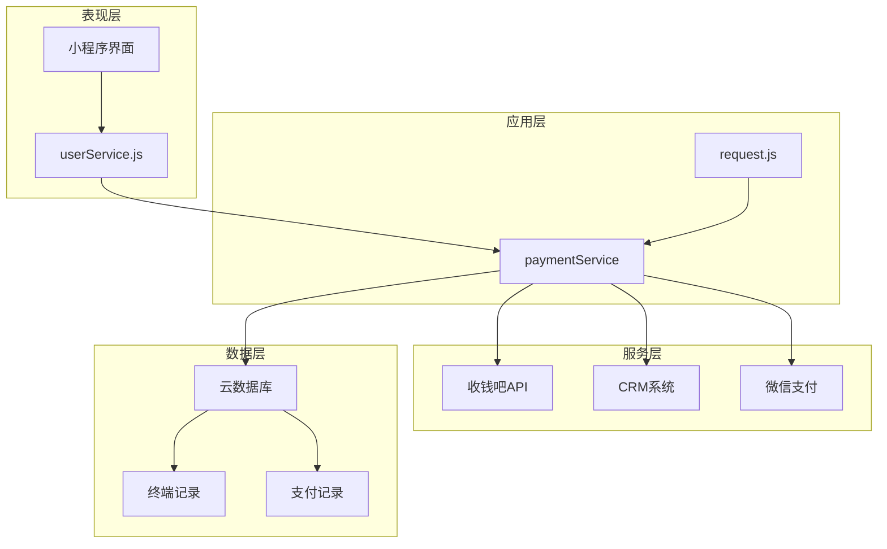
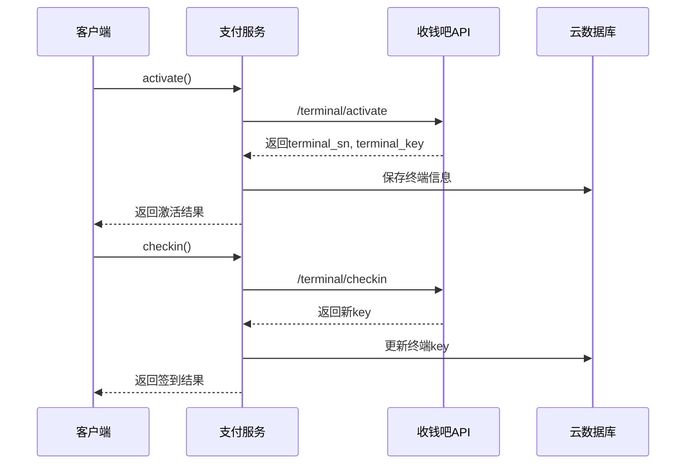
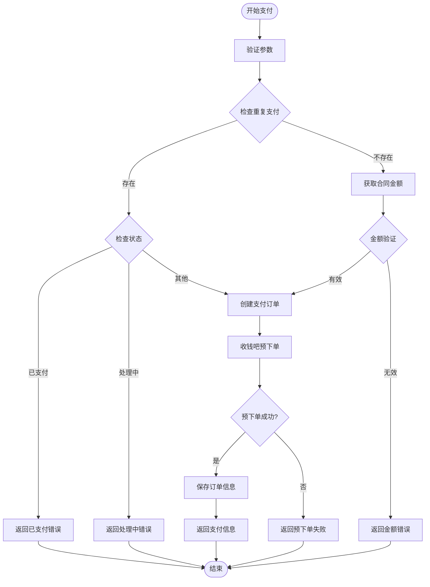
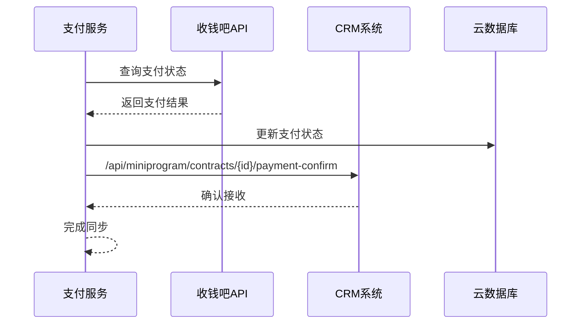
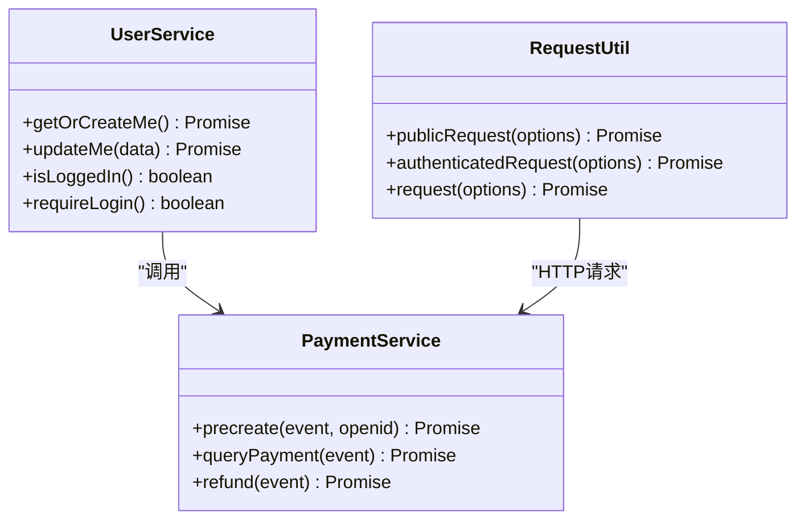
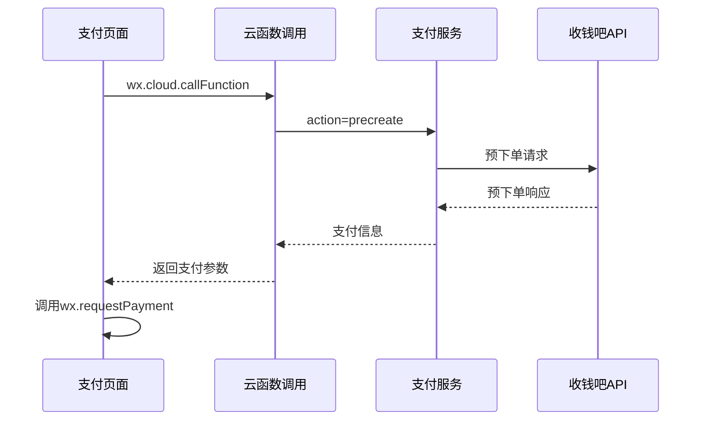
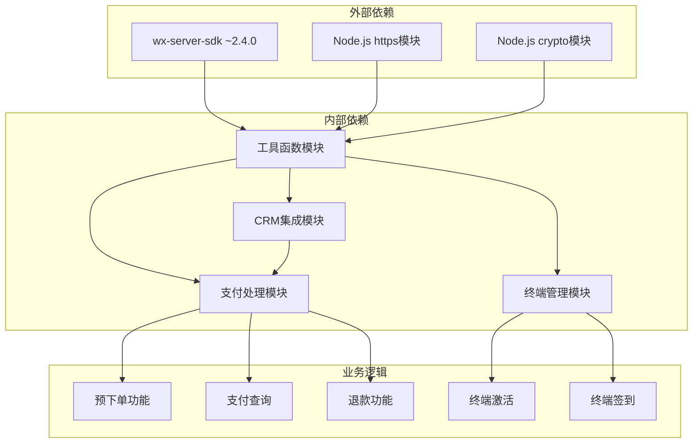

# 支付服务

<cite>
**本文档引用的文件**
- [paymentService/index.js](file://cloudfunctions/paymentService/index.js)
- [paymentService/package.json](file://cloudfunctions/paymentService/package.json)
- [paymentService/config.json](file://cloudfunctions/paymentService/config.json)
- [miniprogram/utils/request.js](file://miniprogram/utils/request.js)
- [miniprogram/services/userService.js](file://miniprogram/services/userService.js)
- [miniprogram/app.js](file://miniprogram/app.js)
- [miniprogram/pages/myOrders/detail.js](file://miniprogram/pages/myOrders/detail.js)
- [miniprogram/pages/childcareContractPreview/index.js](file://miniprogram/pages/childcareContractPreview/index.js)
- [miniprogram/pages/nannyChildcareContractPreview/index.js](file://miniprogram/pages/nannyChildcareContractPreview/index.js)
</cite>

## 目录
1. [简介](#简介)
2. [项目结构](#项目结构)
3. [核心组件](#核心组件)
4. [架构概览](#架构概览)
5. [详细组件分析](#详细组件分析)
6. [依赖关系分析](#依赖关系分析)
7. [性能考虑](#性能考虑)
8. [故障排除指南](#故障排除指南)
9. [结论](#结论)

## 简介

安得褓贝支付服务是一个基于微信云开发的收钱吧支付解决方案，专门为小程序提供完整的支付功能。该服务集成了终端激活、签到、预下单、支付查询、退款等核心支付功能，并与CRM系统深度集成，实现了支付状态的实时同步。

支付服务主要包含以下特性：
- 收钱吧第三方支付集成
- 微信小程序支付流程
- CRM系统支付状态同步
- 支付安全验证机制
- 自动化终端管理

## 项目结构

支付服务在整个项目中的位置和组织方式如下：

**图表来源**
- [paymentService/index.js:1-662](file://cloudfunctions/paymentService/index.js#L1-L662)
- [miniprogram/app.js:1-249](file://miniprogram/app.js#L1-L249)

**章节来源**
- [paymentService/index.js:1-662](file://cloudfunctions/paymentService/index.js#L1-L662)
- [paymentService/package.json:1-15](file://cloudfunctions/paymentService/package.json#L1-L15)
- [paymentService/config.json:1-6](file://cloudfunctions/paymentService/config.json#L1-L6)

## 核心组件

支付服务的核心组件包括：

### 1. 收钱吧支付核心模块
- **终端管理**：负责收钱吧设备的激活和签到
- **支付处理**：实现预下单、支付查询、退款等功能
- **安全验证**：MD5签名验证和参数完整性检查

### 2. CRM集成模块
- **支付状态同步**：支付完成后自动通知CRM系统
- **数据一致性**：确保支付记录与CRM数据保持一致

### 3. 小程序集成模块
- **用户身份验证**：通过OpenID进行用户身份确认
- **支付流程封装**：简化小程序端的支付调用

**章节来源**
- [paymentService/index.js:14-116](file://cloudfunctions/paymentService/index.js#L14-L116)

## 架构概览

支付服务采用分层架构设计，实现了清晰的职责分离：

**图表来源**
- [paymentService/index.js:631-661](file://cloudfunctions/paymentService/index.js#L631-L661)
- [miniprogram/services/userService.js:1-45](file://miniprogram/services/userService.js#L1-L45)
- [miniprogram/utils/request.js:1-133](file://miniprogram/utils/request.js#L1-L133)

## 详细组件分析

### 支付服务核心功能

#### 1. 终端管理功能

支付服务实现了完整的终端生命周期管理：

**图表来源**
- [paymentService/index.js:159-204](file://cloudfunctions/paymentService/index.js#L159-L204)

#### 2. 支付流程管理

支付流程包含了完整的安全验证和状态管理：

**图表来源**
- [paymentService/index.js:211-348](file://cloudfunctions/paymentService/index.js#L211-L348)

#### 3. CRM系统集成

支付完成后自动同步到CRM系统：

**图表来源**
- [paymentService/index.js:84-116](file://cloudfunctions/paymentService/index.js#L84-L116)

**章节来源**
- [paymentService/index.js:159-482](file://cloudfunctions/paymentService/index.js#L159-L482)

### 小程序集成组件

#### 1. 用户服务集成

小程序通过用户服务获取必要的用户信息：

**图表来源**
- [miniprogram/services/userService.js:1-45](file://miniprogram/services/userService.js#L1-L45)
- [paymentService/index.js:631-661](file://cloudfunctions/paymentService/index.js#L631-L661)

#### 2. 支付页面集成

小程序页面通过云函数调用支付服务：

**图表来源**
- [miniprogram/pages/myOrders/detail.js:56-60](file://miniprogram/pages/myOrders/detail.js#L56-L60)
- [paymentService/index.js:631-661](file://cloudfunctions/paymentService/index.js#L631-L661)

**章节来源**
- [miniprogram/services/userService.js:1-45](file://miniprogram/services/userService.js#L1-L45)
- [miniprogram/utils/request.js:1-133](file://miniprogram/utils/request.js#L1-L133)
- [miniprogram/pages/myOrders/detail.js:35-113](file://miniprogram/pages/myOrders/detail.js#L35-L113)

## 依赖关系分析

支付服务的依赖关系体现了清晰的分层架构：

**图表来源**
- [paymentService/package.json:11-13](file://cloudfunctions/paymentService/package.json#L11-L13)
- [paymentService/index.js:7-31](file://cloudfunctions/paymentService/index.js#L7-L31)

**章节来源**
- [paymentService/package.json:1-15](file://cloudfunctions/paymentService/package.json#L1-L15)
- [paymentService/index.js:1-662](file://cloudfunctions/paymentService/index.js#L1-L662)

## 性能考虑

支付服务在设计时充分考虑了性能和可靠性：

### 1. 缓存策略
- 终端密钥每20小时自动刷新，避免频繁重新激活
- 支付状态查询采用智能缓存，减少不必要的API调用

### 2. 错误处理
- 所有网络请求都有超时控制和重试机制
- 支付状态异常时提供详细的错误信息和恢复建议

### 3. 安全性
- 使用MD5签名验证确保数据完整性
- 敏感信息通过环境变量管理
- 支付金额双重验证机制

## 故障排除指南

### 常见问题及解决方案

#### 1. 支付失败排查
- **检查终端状态**：确认终端已激活且密钥有效
- **验证金额**：确保金额转换正确且在允许范围内
- **检查网络**：确认收钱吧API可正常访问

#### 2. 支付状态不同步
- **手动查询**：调用查询接口获取最新状态
- **检查回调**：确认CRM回调接口正常工作
- **查看日志**：分析支付服务的错误日志

#### 3. 重复支付问题
- **检查防重复机制**：确认支付记录的状态检查逻辑
- **清理异常状态**：手动更新异常的支付状态
- **监控告警**：设置支付异常的监控告警

**章节来源**
- [paymentService/index.js:217-255](file://cloudfunctions/paymentService/index.js#L217-L255)
- [paymentService/index.js:424-430](file://cloudfunctions/paymentService/index.js#L424-L430)

## 结论

安得褓贝支付服务是一个设计完善的第三方支付集成解决方案，具有以下特点：

### 技术优势
- **架构清晰**：分层设计便于维护和扩展
- **安全可靠**：多重验证机制确保支付安全
- **集成度高**：与CRM系统无缝对接
- **用户体验好**：简化的小程序支付流程

### 应用价值
- **提升效率**：自动化支付流程减少人工干预
- **降低成本**：标准化的支付处理降低运营成本
- **增强信任**：透明的支付状态和完善的错误处理
- **扩展性强**：模块化设计支持功能扩展

该支付服务为小程序提供了稳定可靠的支付基础设施，是整个安得褓贝生态系统的重要组成部分。